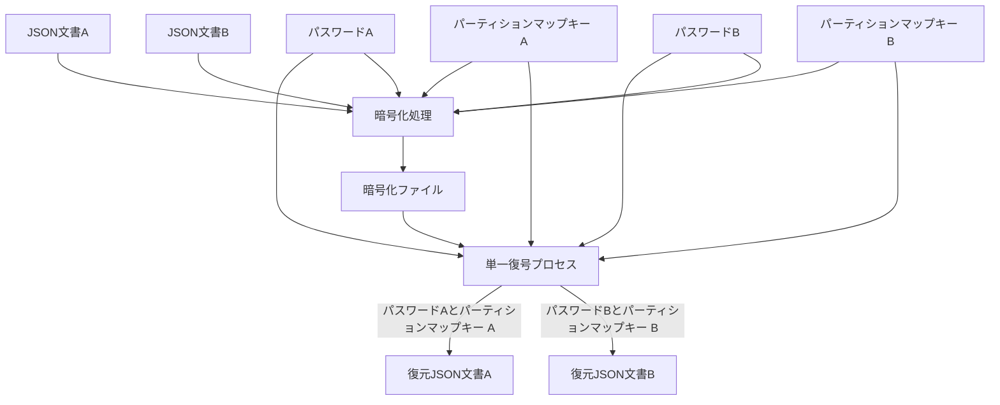
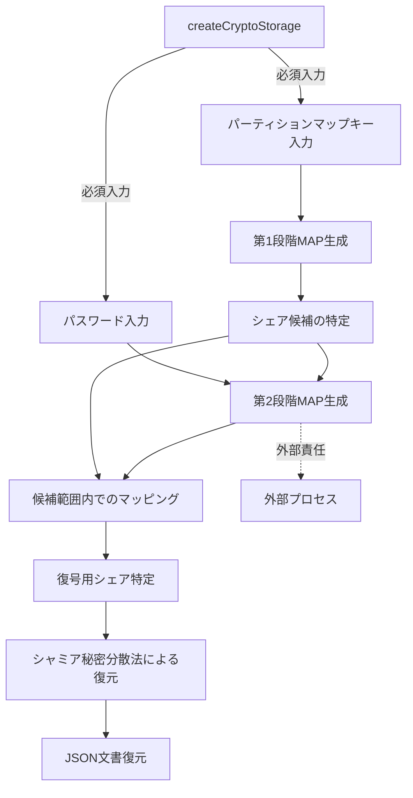

# シャミア秘密分散法による複数平文復号システム設計書

## 2. システムアーキテクチャ

### 2.1. 基本原理

本システムは以下の基本原理に基づいて設計される：

1. **シャミア秘密分散法**：暗号技術の一種であり、秘密情報を複数のシェアに分散し、全てのシェアが揃った場合のみ元の情報を復元できる仕組み
2. **多段 MAP 方式**：パーティションマップキーによる第 1 段階の MAP 生成とパスワードによる第 2 段階のマッピングを組み合わせる
3. **統計的区別不可能性**：異なる文書のシェアや未割当領域のシェアが統計的に区別できず、暗号化ファイルやその他の生成物からも一切の手がかりが得られない
4. **直交処理原則**：全ての処理ステップが互いに独立して一貫性を持ち、入力データの特性に左右されず、常に同一の方法で実行される
5. **直線的処理**：復号処理中に評価や条件分岐を一切含まない

### 2.2. システム構成図

システムの全体構成を以下に示す：



この図では、復号処理は単一のプロセスであり、異なるパスワードとパーティションマップキーの組み合わせが入力されることで異なる文書が復元されることを示しています。実装上、復号処理は完全に同一のコードパスを通り、条件分岐なしの直線的処理で実行されます。

※注: 図では文書 A と B が同時に示されていますが、実際の処理では一度に 1 つの文書しか処理されません。どちらの文書が処理されるかは、入力されるパスワードとパーティションマップキーの組み合わせによって決まり、システム内部での判別処理は行われません。

### 2.3. 多段 MAP 方式の詳細

多段 MAP 方式は本システムの核心技術であり、以下の 2 段階で構成される：

1. **第 1 段階（パーティションマップキーによる MAP 生成）**：

   - ユーザーが保持するパーティションマップキーにより、第 1 段階の MAP を生成
   - この MAP（単純な整数配列 [1,3,5,8,...]）により全シェア空間から復号に必要なシェア全てを特定
   - この段階で不要なシェアの大部分を除外可能
   - 各パーティションマップキーに対応する各パーティション分布は重複せず独立

2. **第 2 段階（パスワードによるマッピング）**：
   - パスワードから鍵導出関数を用いてマップデータを生成
   - 第 2 段階の MAP も単純な整数配列として実装される
   - 第 1 段階で特定された範囲内のシェア全てを対象にマッピングを適用
   - マッピング結果に基づき、実際に復号に使用するシェア全てを特定
   - 第 2 段階の MAP 生成はパーティション内の相対位置に基づくため、同じパスワードでも異なるパーティションマップキーを使用すると異なる絶対位置に対応するシェアが選択される

以下が正しい処理フローです：



※注: 第 2 段階 MAP 生成はパスワードと第 1 段階で特定されたシェア候補の両方を入力として受け取ります。図の矢印は依存関係と処理の流れを示しており、第 1 段階の結果が第 2 段階の入力として使用されることを明示しています。本システムでは、常に全てのシェアを使用して復号を行うため、閾値の概念は存在しません。また、createCryptoStorage の呼び出しには必須入力としてパスワードとパーティションマップキーが必要です。第 2 段階 MAP の生成は createCryptoStorage プロセスの外部の責任となります。

### 2.4. 暗号化ファイルの構造

暗号化ファイルの中身を平文で表現すると、以下のように単純な数値の羅列だけです：

```
[
  43168234226065444066188128433421335992812488068053585868021789200038419124861,
  19875432109876543210987654321098765432109876543210987654321098765432109876543,
  87654321098765432109876543210987654321098765432109876543210987654321098765432,
  12345678901234567890123456789012345678901234567890123456789012345678901234567,
  ...
]
```

これは実際の暗号領域の内容を表しており、各値はシャミア秘密分散法により生成された非常に大きな整数（シェア値）です。

特徴:

- チャンクデータだけが並び、識別情報や関連付け情報は一切含まれない
- 全てのチャンクは外見上区別できず、統計的に同一の分布を持つ
- シェアの所属（A/B/未割当）を示す情報は一切含まれない
- チャンク識別子や順序情報も含まれない
- 全ての識別と復号はパーティションマップキーとパスワードの組み合わせのみで行われる
- 復号には常に全てのシェアが使用され、シェア数に対する閾値という概念は存在しない

### 2.5. データ処理フロー

#### 暗号化フロー

本システムでの暗号化処理の流れは以下の通りです：

1. **平文データ** → **チャンク分割（64 バイト固定長）**:

   - JSON 文書を確認し、容量制限内であることを検証
   - データを厳密に 64 バイト固定サイズのチャンクに分割
   - 全ての入力に対して常に一定のパディング処理を適用（直交処理原則に基づく）

2. **各チャンク** → **シャミア法適用** → **複数のシェア生成**:

   - 各チャンクをシャミア秘密分散法でシェア化（全シェア使用方式）
   - 多項式の次数はシェア数-1 とし、全てのシェアを使用する方式を実装

3. **シェア群をファイルに保存（暗号化状態）**:
   - パーティションマップキーから第 1 段階 MAP を生成
   - パスワードから第 2 段階 MAP を生成（固定数のシェア位置）
   - 第 2 段階 MAP で確定した全シェア位置に有効シェアを配置
   - 最小限のメタデータ（ソルト値のみ）を付加して暗号化ファイルを生成

#### 復号フロー

復号処理の流れは以下の通りです：

1. **シェア群取得** → **特定の MAP に基づくシェア選択**:

   - パーティションマップキーを使用して第 1 段階 MAP を生成
   - パスワードとソルトを使用して第 2 段階 MAP を生成
   - 適切なシェアを全て選択し、チャンク毎に整理

2. **選択されたシェア** → **シャミア法逆適用** → **チャンク復元**:

   - 各チャンクに対してラグランジュ補間で秘密を復元
   - 復元したチャンクを結合して元のデータを生成

3. **チャンク結合** → **平文データ復元**:
   - 固定サイズ調整用のパディングデータを除去
   - 多段デコードを適用して元の JSON 文書を復元

### 2.6. 実装上の重要ポイント

以下は本システムの実装において特に重要な点です：

1. **固定サイズチャンク処理**:

   - チャンクサイズは厳密に 64 バイト（512 ビット）を遵守
   - 全チャンクを厳密に同一サイズ・同一方法で処理し、統計的区別不能性を確保
   - 入力サイズに関わらず常に同一のチャンク処理パイプラインを適用

2. **多段エンコード処理**:

   - UTF-8 テキスト（元の JSON）→ Latin-1 へのエンコード変換 → Base64 エンコード → 固定長シリアライズ処理
   - Base64 エンコード後に固定長形式でシリアライズし、完全な固定サイズを保証
   - この多段エンコードとシリアライズにより、復号プロセスの堅牢性を確保し、変動要因を排除

3. **WAL ログ方式と一時ファイル管理**:

   - 更新処理時には WAL（Write-Ahead Logging）方式を採用
   - 一時ファイルは独自の暗号化処理を適用し、本体ファイルとの相関攻撃リスクを防止
   - ロックファイルを使用して複数プロセスの並列実行に対応し、相互干渉を防止

4. **A/B 文書独立性保証**:

   - 各文書の更新は必ず一文書ずつ行われ、同時更新は許可されない
   - A 文書を更新する際、B 文書のシェアは完全に保護され変更されない
   - updateCryptoStorage 関数は領域指定をパラメータとして受け取らず、パーティションマップキーから対応する分布を自動的に特定する

5. **メタデータ最小化**:
   - 塩値（salt）のみを保存し、その他のメタデータは極力排除
   - 初期化ファイルと暗号化済みファイルが外部から区別できないよう設計

これらの実装ポイントに従うことで、安全性と効率性を両立したシステムを構築できます。

### 2.7. パーティションマップキーの詳細

パーティションマップキーは本システムにおける重要な要素であり、以下の特性を持ちます：

1. **パーティションマップキーの本質**:

   - パーティションマップキーは `9jfhsyenehgr6hkwhjyhbweey6d` のような単一行の文字列として表現される
   - 本質的には、パーティション分布データの暗号化された形式である
   - 単なるシェア ID のリストではなく、シェア ID を特定するための元データとして機能する

2. **MAP との関係**:

   - パーティションマップキーから暗号学的ハッシュ関数を通じて第 1 段階 MAP（整数配列）が生成される
   - 生成される MAP は単純な整数の配列（例: [1,3,5,8,10,15,...]）であり、必要なシェア ID を特定する

3. **メタデータの排除**:

   - パーティションマップキー自体は、A 用か B 用かを示すメタデータを一切含まない
   - 暗号化された形態のみが保存され、外部からはその用途が判別できない
   - このメタデータの排除により、キー自体からの情報漏洩リスクを最小化している

4. **セキュリティモデル**:

   - パーティションマップキーとパスワードの 2 要素により、セキュリティが確保される
   - どちらか一方だけでは復号できない設計になっている
   - 同じパーティションマップキーを使用すれば常に同じシェア候補群が特定され、決定論的な動作が保証される
   - 一方で、パスワードはユーザーごとに異なるため、実際に使用されるシェアも異なる

5. **createCryptoStorage との関係**:
   - パーティションマップキーは createCryptoStorage 関数への必須入力の一つである
   - このキーにより、暗号化データの物理的な配置が決定される
   - 暗号データ内のどの部分が A 用でどの部分が B 用かはパーティションマップキーのみが把握している

このようにパーティションマップキーは単なる識別子ではなく、暗号システム全体の安全性と機能性を支える重要な要素です。外部から見ると単なる文字列に見えますが、内部的には複雑な暗号学的処理により、効率的かつ安全にデータの分離と保護を実現しています。
