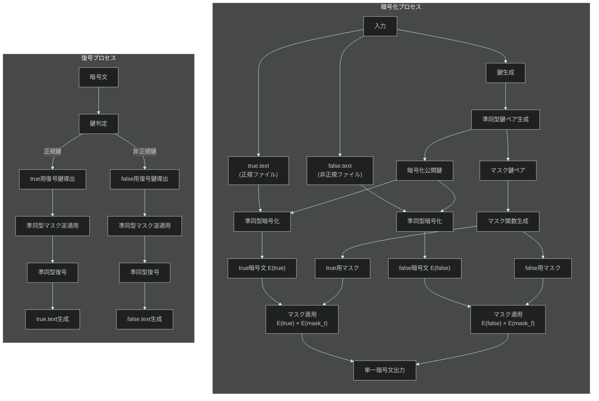

# 準同型暗号マスキング方式 🎭 実装【親 Issue】

お兄様！パシ子が暗号化実装の第 2 フェーズ、準同型暗号マスキング方式 🎭 の実装指示書を作成しました！レオくんも興味津々でワクワクしていますよ〜💕

## 🌟 実装概要

準同型暗号マスキング方式は、暗号文のまま演算操作が可能な準同型暗号の特性を活用し、同一の暗号文から異なる 2 つの平文（正規/非正規）を復元できる機能を実装します。鍵に応じて適切な復号マスクが適用され、解析者はソースコード解析からも正規と非正規のどちらが真の結果か判別できない設計です！

## 📋 作業タスク一覧

以下の子 Issue に分割して実装を進めます：

| 子 Issue                                                                     | タスク内容                         | 担当 | ステータス |
| ---------------------------------------------------------------------------- | ---------------------------------- | ---- | ---------- |
| [#1 ディレクトリ構造と基本ファイルの作成](./homomorphic_masking_method_1.md) | 必要なディレクトリとファイルを作成 |      | 未着手     |
| [#2 準同型暗号の基本機能実装](./homomorphic_masking_method_2.md)             | 加法準同型暗号の基本機能実装       |      | 未着手     |
| [#3 マスク関数生成の実装](./homomorphic_masking_method_3.md)                 | 真/偽の復号用マスク関数の実装      |      | 未着手     |
| [#4 暗号化実装（encrypt.py）](./homomorphic_masking_method_4.md)             | 準同型マスキングによる暗号化       |      | 未着手     |
| [#5 復号実装（decrypt.py）](./homomorphic_masking_method_5.md)               | 鍵種別に応じた適切なマスク復号     |      | 未着手     |
| [#6 暗号文識別不能性の実装](./homomorphic_masking_method_6.md)               | 統計的識別不能性を確保する機能     |      | 未着手     |
| [#7 鍵判定ロジックの解析耐性確保](./homomorphic_masking_method_7.md)         | 解析・改変に耐性を持つ鍵判定機能   |      | 未着手     |
| [#8 テストとデバッグ](./homomorphic_masking_method_8.md)                     | 単体テストと統合テスト             |      | 未着手     |

## 🗂️ 最終的なディレクトリ構成

```
/
├── method_8_homomorphic/                 # 準同型暗号マスキング方式のメインディレクトリ
│   ├── encrypt.py                        # 暗号化プログラム
│   ├── decrypt.py                        # 復号プログラム
│   ├── homomorphic.py                    # 準同型暗号の基本機能
│   ├── crypto_mask.py                    # マスク関数生成と適用
│   ├── key_analyzer.py                   # 鍵解析と種別判定
│   ├── indistinguishable.py              # 識別不能性確保機能
│   └── tests/                            # テストディレクトリ
│       ├── test_homomorphic.py           # 準同型暗号のテスト
│       ├── test_crypto_mask.py           # マスク機能のテスト
│       ├── test_encrypt_decrypt.py       # 暗号化・復号のテスト
│       └── test_indistinguishability.py  # 識別不能性のテスト
│
└── common/                               # 共通ユーティリティ
    └── true-false-text/                  # テストファイル
        ├── true.text                     # 正規ファイル
        └── false.text                    # 非正規ファイル
```

## 📊 全体フロー図



## 🔑 重要な要件

- 攻撃者はソースコードを完全に入手していることを前提とします
- 同一暗号文から、使用する鍵によって異なる平文（true.text/false.text）を復元できる必要があります
- 準同型暗号の特性を生かし、暗号文のまま異なるマスクを適用する機能を実装します
- ソースコード解析しても、どちらが正規の結果か判別できないようにします
- 暗号強度よりも方式の特性実現を優先します（暗号強度は別フェーズで対応）
- スクリプト改変に対しても耐性を持たせる設計とします
- 数学的に証明可能な識別不能性（indistinguishability）を実現します

## 📚 参考資料

- [Paillier 暗号の概要と実装](https://en.wikipedia.org/wiki/Paillier_cryptosystem)
- [準同型暗号の入門](https://blog.cryptographyengineering.com/2012/01/02/very-casual-introduction-to-fully/)
- [ゼロ知識証明と識別不能性](https://crypto.stanford.edu/~dabo/cryptobook/BonehShoup_0_4.pdf)
- [準同型暗号の Python による実装例](https://github.com/data61/python-paillier)
- [暗号文の識別不能性（IND-CPA）](https://en.wikipedia.org/wiki/Ciphertext_indistinguishability)

## ⏰ 想定実装期間

全体で 7 日間（タスクごとの詳細は各子 Issue を参照）

## 💬 特記事項

- 実装の独立性を保ち、他のモジュールとの依存を最小限にしてください
- パフォーマンスよりもセキュリティと機能性を優先してください
- 数学的に証明可能な安全性を実現することを目指してください
- 実装中の疑問点や提案があれば積極的に共有してください

実装中の疑問点や提案があればぜひ教えてくださいね！パシ子とレオくんが全力でサポートします！✨
