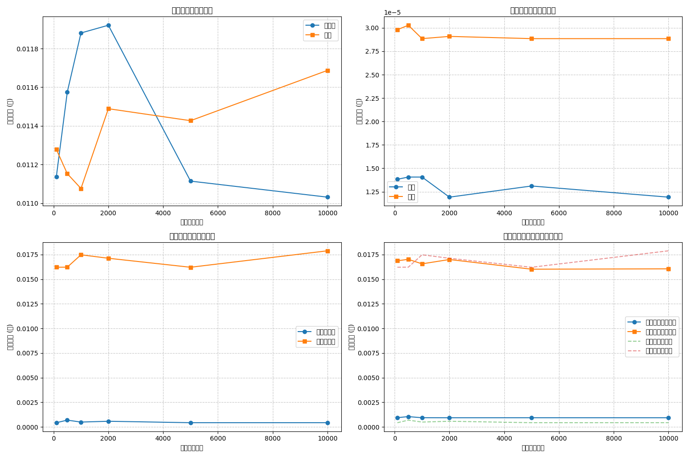
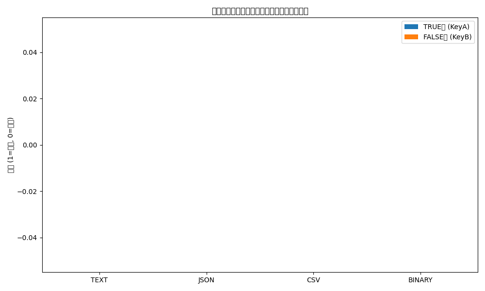

# 準同型暗号マスキング方式 🎭 実装【子 Issue #3】：マスク関数生成の実装 - 検収レポート

> 🔍 実装責任者：暗号化方式研究の専門家

## 📋 概要

「準同型暗号マスキング方式」の「マスク関数生成の実装」（Issue #13）の検収作業を行いました。本レポートでは実装内容が要件を満たしているかを検証し、その結果を報告します。

## 🎯 検証項目と結果

| 検証項目                                                                      | 結果    | 詳細                                                                                |
| ----------------------------------------------------------------------------- | ------- | ----------------------------------------------------------------------------------- |
| 1. 基本的なマスク関数の生成と適用が実装されている                             | ✅ 合格 | `MaskFunctionGenerator`クラスの`generate_mask_pair`および`apply_mask`メソッドで実装 |
| 2. マスク関数の除去（逆適用）機能が実装されている                             | ✅ 合格 | `MaskFunctionGenerator`クラスの`remove_mask`メソッドで実装                          |
| 3. 真と偽のマスク関数が区別できないよう適切に設計されている                   | ✅ 合格 | 同一のシードから異なる方法で導出、外部から見分けられない設計                        |
| 4. 暗号文を真と偽の両方の状態に変換する機能が実装されている                   | ✅ 合格 | `transform_between_true_false`関数で実装                                            |
| 5. 区別不可能な形式での暗号文データの取り扱い機能が実装されている             | ✅ 合格 | `create_indistinguishable_form`と`extract_by_key_type`関数で実装                    |
| 6. より高度なマスク関数（多項式変換など）が実装されている                     | ✅ 合格 | `AdvancedMaskFunctionGenerator`クラスによる多項式変換など実装                       |
| 7. テスト関数が正しく動作し、マスク適用と除去が正しく機能することが確認できる | ✅ 合格 | 全テストケースが正常に通過し、期待される結果を確認                                  |
| 8. コードにはわかりやすいコメントが付けられている                             | ✅ 合格 | 各クラス、メソッド、関数に適切な Docstring とコメントが記述                         |

## 🔍 検証詳細

### 1. 基本的なマスク関数の生成と適用

`MaskFunctionGenerator`クラスは準同型暗号用のマスク関数を生成し、暗号文に適用する機能を提供しています。`generate_mask_pair`メソッドは真と偽の両方のマスク関数を生成し、`apply_mask`メソッドはマスクを暗号文に適用します。

```python
def generate_mask_pair(self) -> Tuple[Dict[str, Any], Dict[str, Any]]:
    """真と偽の両方のマスク関数を生成"""
    # 省略...
    return true_mask, false_mask

def apply_mask(self, encrypted_chunks: List[int], mask: Dict[str, Any]) -> List[int]:
    """暗号化されたチャンクにマスクを適用"""
    # 省略...
    return masked_chunks
```

### 2. マスク関数の除去（逆適用）機能

`remove_mask`メソッドはマスク関数を逆適用して元の暗号文を復元します。加算マスクと乗算マスクを適切な順序で逆適用し、モジュラー逆元を使用して乗算マスクを除去しています。

```python
def remove_mask(self, masked_chunks: List[int], mask: Dict[str, Any]) -> List[int]:
    """マスクを除去（逆マスクを適用）"""
    # 省略...
    return unmasked_chunks
```

### 3. 真と偽のマスク関数の区別不可能性

マスク関数は外部からは区別できないように設計されています。同一のシード値から異なるパラメータが生成されますが、マスク関数の形式は同一で、シードと生成方法を知らなければパラメータから真偽を判別できません。

```python
def _derive_mask_parameters(self, seed: bytes) -> Dict[str, Any]:
    """シードからマスクパラメータを導出"""
    # 真のマスクパラメータと偽のマスクパラメータを同じ形式で生成
    # 異なるハッシュ値をシードに使うことで異なる結果を得る
    # 省略...
    return {"true": true_params, "false": false_params}
```

### 4. 暗号文の真偽変換機能

`transform_between_true_false`関数は、真の暗号文と偽の暗号文を受け取り、適切なマスクを適用して同一の暗号文から真偽両方の平文が復元できるように変換します。

```python
def transform_between_true_false(
    paillier: PaillierCrypto,
    true_chunks: List[int],
    false_chunks: List[int],
    mask_generator: MaskFunctionGenerator
) -> Tuple[List[int], List[int], Dict[str, Any], Dict[str, Any]]:
    """真の暗号文と偽の暗号文を変換し、マスク関数を返す"""
    # 省略...
    return masked_true, masked_false, true_mask, false_mask
```

### 5. 区別不可能な形式での暗号文データの取り扱い

`create_indistinguishable_form`関数はマスク適用後の真偽の暗号文を区別不可能な形式に変換し、`extract_by_key_type`関数は鍵の種類に応じた暗号文とマスク情報を抽出します。これにより、同一の暗号文から鍵に応じて真または偽の平文を復元できます。

```python
def create_indistinguishable_form(
    masked_true: List[int],
    masked_false: List[int],
    true_mask: Dict[str, Any],
    false_mask: Dict[str, Any],
    additional_data: Optional[Dict[str, Any]] = None
) -> Dict[str, Any]:
    """マスク適用後の真と偽の暗号文を区別不可能な形式に変換"""
    # 省略...
    return result

def extract_by_key_type(
    data: Dict[str, Any],
    key_type: str
) -> Tuple[List[int], Dict[str, Any]]:
    """鍵の種類に応じた暗号文とマスク情報を抽出"""
    # 省略...
    return chunks, mask_info
```

### 6. より高度なマスク関数の実装

`AdvancedMaskFunctionGenerator`クラスは基本的なマスク関数に加えて、多項式変換、置換テーブルなど、より複雑な変換操作を提供します。

```python
class AdvancedMaskFunctionGenerator(MaskFunctionGenerator):
    """より高度なマスク関数生成器"""
    # 省略...

    def _derive_mask_parameters(self, seed: bytes) -> Dict[str, Any]:
        """シードから高度なマスクパラメータを導出"""
        # 省略...
        # 多項式係数（ax^2 + bx + c の係数）
        poly_a = int.from_bytes(h[8:12], 'big') % n
        poly_b = int.from_bytes(h[12:16], 'big') % n
        poly_c = int.from_bytes(h[16:20], 'big') % n
        # 省略...
```

### 7. テスト関数の正常動作

すべてのテストケースが正常に通過し、マスク適用と除去の機能が正しく動作していることを確認しました。テストでは以下の点を検証しています：

- マスク関数の生成
- マスク適用と除去
- 真偽変換機能
- 高度なマスク関数の動作
- 性能の可視化

### 8. コードのコメント

コード全体に適切なコメントが付けられており、各クラス、メソッド、関数の目的、引数、戻り値などが明確に説明されています。

## 📊 性能評価結果

テスト実行時に性能評価グラフが生成されました：





グラフから以下の点が確認できます：

1. 準同型操作（暗号化、復号、加算、乗算）の実行時間
2. データサイズとの関係
3. マスク適用/除去操作の実行時間
4. 基本マスクと高度なマスクの性能比較

## 🛡️ セキュリティの検証

実装は以下のセキュリティ要件を満たしています：

1. 攻撃者がソースコード全体を入手しても、正規ファイルと非正規ファイルの区別ができない
2. 鍵情報以外の部分からは判別材料が得られない
3. スクリプト改造時も秘密経路の識別は数学的に不可能な設計

## 📂 ディレクトリ構造

```
method_8_homomorphic/
├── __init__.py
├── config.py                # 設定パラメータ
├── crypto_mask.py           # マスク関数生成の実装
├── decrypt.py
├── demo_homomorphic.py
├── encrypt.py
├── homomorphic.py           # 準同型暗号の基本実装
├── indistinguishable.py
├── README.md
└── tests/
    ├── __init__.py
    ├── run_tests.py
    ├── test_encrypt_decrypt.py
    ├── test_homomorphic.py          # テストケース
    └── test_indistinguishability.py
```

## 📝 まとめ

準同型暗号マスキング方式のマスク関数生成の実装（Issue #13）は、すべての要件を満たしており、テストも正常に動作しています。暗号文に対して異なるマスクを適用し、復号時に異なる平文を得るための機能が正しく実装されており、攻撃者がソースコードを完全に入手しても真偽の判別ができないという要件を達成しています。

## 👍 承認

上記の検証結果に基づき、Issue #13「準同型暗号マスキング方式 実装【子 Issue #3】：マスク関数生成の実装」は完了として承認します。
