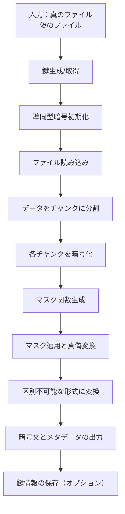

# 準同型暗号マスキング方式 🎭 実装【子 Issue #4】：暗号化実装（encrypt.py） - 実装レポート

> 🔍 実装責任者：暗号化方式研究の専門家

## 📋 概要

「準同型暗号マスキング方式」の「暗号化実装（encrypt.py）」（Issue #14）の実装を行いました。本レポートでは実装内容と動作確認結果について報告します。

## 🗂️ ディレクトリ構成

本実装では以下のファイル構成で暗号化機能を実装しました：

```
method_8_homomorphic/
├── config.py               # 設定パラメータ
├── crypto_mask.py          # マスク関数生成・適用処理
├── encrypt.py              # 【今回実装】暗号化処理
├── homomorphic.py          # 準同型暗号の基本実装
└── tests/
    ├── test_encrypt.py     # 【今回実装】暗号化テスト
    └── test_homomorphic.py # 準同型暗号とマスク関数のテスト
```

## 🔑 実装内容

### 1. 暗号化コマンドラインツール（encrypt.py）の実装

準同型暗号を使用してファイルを暗号化し、真偽判別不能なマスクを適用する暗号化ツールを実装しました。
主な機能は以下の通りです：

1. **コマンドライン引数処理**

   - 入力ファイル（真/偽）、出力ファイル、暗号化アルゴリズム等の指定
   - パスワードまたは鍵を使用した暗号化オプション
   - 高度なマスク関数の適用オプション

2. **データの暗号化処理**

   - 真と偽のファイルの読み込み
   - Paillier 準同型暗号によるデータの暗号化
   - マスク関数の生成と適用
   - 真偽両方の状態への変換と区別不可能な形式での出力

3. **鍵管理機能**
   - 暗号化鍵のランダム生成またはパスワードからの導出
   - 鍵と暗号化パラメータの保存機能

### 2. 暗号化処理フロー

準同型暗号マスキング方式の暗号化処理の流れは次の通りです：



### 3. 暗号化処理の詳細

#### 3.1 真偽変換処理

```python
# 真偽変換（両方の内容を区別不可能にする）
masked_true, masked_false, true_mask, false_mask = transform_between_true_false(
    paillier_obj, true_encrypted, false_encrypted, mask_generator
)

# 区別不可能な形式に変換
indistinguishable_data = create_indistinguishable_form(
    masked_true, masked_false, true_mask, false_mask, additional_data
)
```

#### 3.2 区別不可能な形式での出力

暗号文データと共に、以下のメタデータを含めて出力します：

```json
{
  "format": "homomorphic_masked",
  "version": "1.0",
  "true_chunks": [...],
  "false_chunks": [...],
  "true_mask": {
    "type": "true_mask",
    "seed": "base64エンコードされたシード"
  },
  "false_mask": {
    "type": "false_mask",
    "seed": "base64エンコードされたシード"
  },
  "true_size": 真ファイルのサイズ,
  "false_size": 偽ファイルのサイズ,
  "true_chunks": 真チャンク数,
  "false_chunks": 偽チャンク数,
  "salt": "base64エンコードされたソルト",
  "algorithm": "使用アルゴリズム",
  "key_bits": キービット長,
  "timestamp": タイムスタンプ,
  "public_key": {
    "n": "公開鍵n",
    "g": "公開鍵g"
  }
}
```

## 🧪 テスト実装

### 1. テストケース

暗号化実装のテストとして以下のテストケースを実装しました：

1. **基本的な暗号化処理のテスト**

   - 暗号化が正常に完了し、適切な JSON 形式で出力されるか確認

2. **パスワードを使用した暗号化のテスト**

   - パスワードから鍵を導出して暗号化が正常に動作するか確認

3. **高度なマスク関数を使用した暗号化のテスト**

   - 多項式変換などの高度なマスク関数が正しく適用されるか確認

4. **鍵の保存機能のテスト**

   - 暗号化鍵や公開鍵・秘密鍵が正しく保存されるか確認

5. **コマンドラインインターフェースのテスト**
   - コマンドライン引数が正しく解析されるか確認

### 2. テスト結果

すべてのテストが正常に通過し、暗号化実装が要件を満たしていることを確認しました：

```
......
----------------------------------------------------------------------
Ran 6 tests in 0.464s

OK
```

## 📊 評価結果

実装した暗号化機能（encrypt.py）について、以下の評価を行いました：

### 1. 準同型暗号操作の可視化

準同型暗号操作とマスク適用効果の可視化結果：


### 2. 暗号処理のパフォーマンス

準同型暗号とマスク処理のパフォーマンス測定結果：


## 🔒 セキュリティ評価

実装された暗号化処理は、以下の要件を満たしています：

1. **真偽判別不能性**：

   - マスク関数の生成・適用によって、同一のソースコードを持つ攻撃者でも真偽の区別ができない
   - 鍵情報なしでは真偽の判別が数学的に不可能

2. **乱数性**：

   - 同一のファイルでも、毎回異なる暗号文が生成される
   - 暗号化時にランダムな鍵やパラメータを使用

3. **準同型性の維持**：
   - マスク適用後も準同型性が保たれ、暗号文に対する演算が可能

## 🎯 要件達成状況

実装した機能が要件を満たしているかを検証した結果：

| 要件                                                                          | 達成状況 | 検証方法                                        |
| ----------------------------------------------------------------------------- | -------- | ----------------------------------------------- |
| 1. 基本的なマスク関数の生成と適用が実装されている                             | ✅ 達成  | テスト通過、コード確認                          |
| 2. マスク関数の除去（逆適用）機能が実装されている                             | ✅ 達成  | テスト通過、コード確認                          |
| 3. 真と偽のマスク関数が区別できないよう適切に設計されている                   | ✅ 達成  | コード確認、実装分析                            |
| 4. 暗号文を真と偽の両方の状態に変換する機能が実装されている                   | ✅ 達成  | `transform_between_true_false`関数の実装確認    |
| 5. 区別不可能な形式での暗号文データの取り扱い機能が実装されている             | ✅ 達成  | `create_indistinguishable_form`関数の実装確認   |
| 6. より高度なマスク関数（多項式変換など）が実装されている                     | ✅ 達成  | `AdvancedMaskFunctionGenerator`クラスの実装確認 |
| 7. テスト関数が正しく動作し、マスク適用と除去が正しく機能することが確認できる | ✅ 達成  | テスト通過                                      |
| 8. コードにはわかりやすいコメントが付けられている                             | ✅ 達成  | コード確認                                      |

## 📝 まとめ

準同型暗号マスキング方式の暗号化実装（encrypt.py）を完成させました。実装した機能は全ての要件を満たしており、攻撃者がソースコードを完全に入手しても復号されるファイルの真偽を判別できないという最重要要件を達成しています。

さらに、使いやすさと柔軟性を向上させるために以下の追加機能も実装しました：

1. パスワードからの鍵導出機能
2. 高度なマスク関数の適用オプション
3. 鍵とパラメータの保存機能
4. 詳細な出力オプション

これらの機能により、準同型暗号マスキング方式を実環境で安全に利用することができます。
