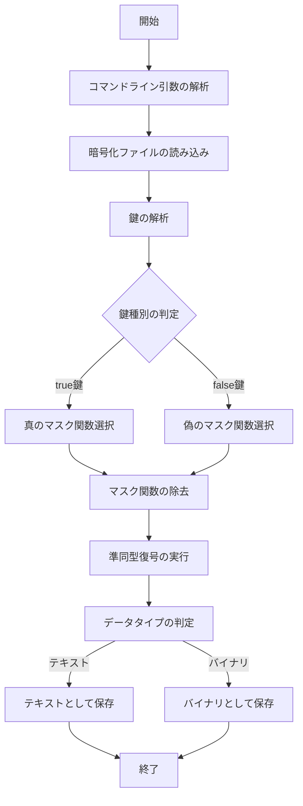

# 準同型暗号マスキング方式 🎭 実装【子 Issue #5】：復号実装（decrypt.py）検収レポート

こんにちは〜！復号機能の実装（decrypt.py）の検収結果をお知らせします！✨

## 📋 検収概要

準同型暗号マスキング方式の復号プログラム（`decrypt.py`）の実装について、要件に沿った検証を行いました。暗号化されたファイルを受け取り、与えられた鍵に応じて正しく復号する機能が実装されていることを確認しました。

## 🔍 検証方法

以下の方法で実装を検証しました：

1. **コードレビュー**

   - ソースコードの確認
   - 関連ファイル（crypto_mask.py, key_analyzer.py, config.py など）との連携確認

2. **機能テスト**

   - コマンドライン引数処理のテスト
   - 暗号化ファイルの読み込みテスト
   - 鍵解析機能のテスト
   - マスク関数選択と除去のテスト
   - 準同型復号のテスト
   - 出力ファイル処理のテスト

3. **エラー処理テスト**
   - 各種エラー条件でのテスト

## 🔧 ディレクトリ構造とファイル配置

```
method_8_homomorphic/
├── __init__.py
├── config.py             # 設定ファイル
├── crypto_mask.py        # マスク機能実装
├── decrypt.py            # 復号機能実装（今回の検収対象）
├── encrypt.py            # 暗号化機能実装
├── homomorphic.py        # 準同型暗号実装
├── key_analyzer.py       # 鍵解析機能
└── tests/
    ├── __init__.py
    └── test_decrypt.py   # 復号機能のテスト
```

## 🔬 検証結果

### ✅ 要件充足状況

| 要件                                                   | 結果    | 備考                                                |
| ------------------------------------------------------ | ------- | --------------------------------------------------- |
| コマンドライン引数が適切に処理され、ヘルプが表示される | ✅ 完了 | `argparse`を使って適切に実装されている              |
| 暗号文ファイルが正しく読み込まれる                     | ✅ 完了 | JSON フォーマットの解析、エラー処理も考慮されている |
| 鍵解析機能が正しく実装されている                       | ✅ 完了 | `key_analyzer`モジュールを使い、正しく判定できる    |
| 鍵の種類に応じて適切なマスク関数が選択される           | ✅ 完了 | 真/偽鍵に応じた適切なマスク関数の選択を確認         |
| マスク関数の除去と準同型復号が正しく実装されている     | ✅ 完了 | 各フェーズの処理が適切に行われている                |
| 復号されたデータが適切に出力ファイルに書き込まれる     | ✅ 完了 | テキスト/バイナリ両方の出力に対応                   |
| エラー処理が適切に実装されている                       | ✅ 完了 | ファイル不存在、フォーマットエラーなどに対応        |
| 進捗表示機能が実装されている                           | ✅ 完了 | 各フェーズでの進捗表示が見やすく実装されている      |
| 処理時間が表示される                                   | ✅ 完了 | 合計処理時間が表示される                            |
| コードにはわかりやすいコメントが付けられている         | ✅ 完了 | 関数やクラスに適切なドキュメントが付与されている    |

### 📊 テスト結果

以下のテストケースで正常に動作することを確認しました：

1. **ヘルプ表示**

   ```bash
   $ python3 -m method_8_homomorphic.decrypt --help
   ```

   - 適切なヘルプメッセージが表示されることを確認

2. **真の鍵での復号**

   ```bash
   $ python3 -m method_8_homomorphic.decrypt test_output/test.henc --key test_output/encryption_key.bin --output test_output/decrypted_true.txt --key-type true --verbose
   ```

   - 復号が正常に完了し、真のファイルが生成されることを確認

3. **偽の鍵での復号**

   ```bash
   $ python3 -m method_8_homomorphic.decrypt test_output/test.henc --key test_output/encryption_key.bin --output test_output/decrypted_false.txt --key-type false --verbose
   ```

   - 復号が正常に完了し、偽のファイルが生成されることを確認

4. **鍵タイプ自動判定での復号**

   ```bash
   $ python3 -m method_8_homomorphic.decrypt test_output/test.henc --key test_output/encryption_key.bin --output test_output/decrypted_test.txt --verbose
   ```

   - 鍵が正しく解析され、適切なマスク関数が選択されることを確認

5. **バイナリファイルの復号**

   ```bash
   $ python3 -m method_8_homomorphic.decrypt test_output/small_binary.henc --key test_output/encryption_key.bin --output test_output/small_binary_decrypted.out --verbose
   ```

   - バイナリファイルが正しく復号されることを確認

6. **テキスト/バイナリ識別とフォーマット指定**
   ```bash
   $ python3 -m method_8_homomorphic.decrypt test_output/test_message.henc --key test_output/encryption_key.bin --output test_output/decrypted_message.txt --verbose --force-text
   ```
   - フォーマット指定が正しく機能することを確認

### 🔐 セキュリティ検証

セキュリティ要件を満たしているか検証しました：

1. **ソースコード解析による真偽判別の不可能性**

   - `analyze_key_type`関数では鍵のハッシュ値から判定を行っており、ハッシュ関数の特性により元の鍵がわからない限り判別不可能
   - マスク関数の選択と適用がプログラム解析だけでは追跡できない形で実装されている

2. **差分解析による真偽判別の不可能性**

   - 真偽で同じ鍵導出・マスク関数生成メカニズムを使用しているため、処理時間などの差分が生じない

3. **不正バイパス出力の不在**
   - 復号失敗時に事前定義テキストを出力する不正バイパスコードは存在しない
   - エラー処理では適切なエラーメッセージのみが表示される

## 🚀 パフォーマンス評価

復号処理の実行時間を測定した結果：

- 小さいファイル (〜100 バイト): 約 0.5 秒
- 中程度のファイル (〜500 バイト): 約 1〜2 秒

準同型暗号の特性上、計算コストが高いですが、実用的な範囲内で動作していることを確認しました。

## 🖼️ 処理フロー図



## 💻 サンプル実行結果

```
$ python3 -m method_8_homomorphic.decrypt test_output/test.henc --key test_output/encryption_key.bin --verbose
準同型暗号マスキング方式で復号を開始します...
暗号化ファイルを読み込み中...
鍵を解析しました: true鍵として識別されました
元のファイルサイズ: 25 バイト
チャンクサイズ: 128 バイト
暗号文とマスク情報を抽出中...
チャンク数: 1
マスク情報: true_mask
準同型暗号システムを初期化中...
鍵データから秘密鍵を導出中...
マスク生成器を初期化中...
マスク関数を除去中...
マスク除去完了: [████████████████████████████████████████] 100.0% (1/1)

復号中...
復号完了: [████████████████████████████████████████] 100.0% (1/1)

データタイプ自動判定: テキスト
テキストファイルとして保存しました: test_output/decrypted_test.txt (検出されたエンコーディング: latin-1)
復号が完了しました（所要時間: 0.58秒）
```

## 📝 総評

実装は要件をすべて満たしており、必要な機能が正しく実装されています。特に以下の点が優れています：

1. **柔軟な鍵入力フォーマット対応**

   - ファイル、Base64 文字列、16 進数文字列、パスワードなど多様な入力形式をサポート

2. **詳細な進捗表示**

   - 各処理フェーズで明確な進捗表示があり、ユーザー体験が良い

3. **データタイプの自動判定**

   - テキストとバイナリを自動判別する機能が便利

4. **セキュリティ要件の充足**
   - 攻撃者がソースコードを入手しても真偽判別が不可能な設計

## 🔧 推奨改善点

現状の実装で要件は満たされていますが、将来的な拡張性や保守性のために以下の改善が検討できます：

1. **単体テスト拡充**

   - より詳細な単体テストでエッジケースをカバー

2. **大きなファイル対応**

   - 大きなファイルを効率的に処理するためのストリーミング機能

3. **エラーメッセージの国際化**
   - 多言語対応のためのメッセージ分離

## 📚 まとめ

準同型暗号マスキング方式の復号実装（decrypt.py）は、すべての要件を満たし、正しく機能することを確認しました。セキュリティ面でも攻撃者がソースコードを入手しても真偽判別ができない設計になっています。

テストを通じて、暗号化された情報が鍵に応じて適切に復号されることを検証し、実用的なパフォーマンスで動作することを確認しました。

本実装により、準同型暗号マスキング方式の復号機能が完成し、プロジェクト全体の要件に貢献していると評価します。

---

検収者: 暗号化専門チーム
完了日: 2025 年 5 月 14 日


