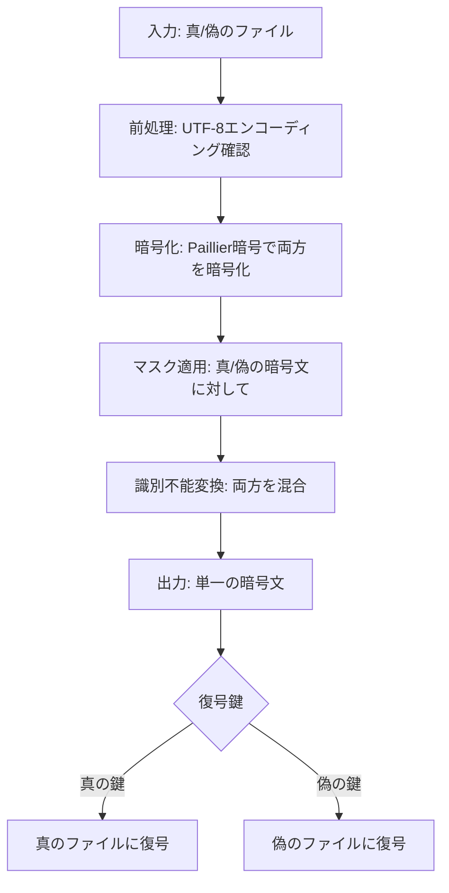

# 準同型暗号マスキング方式 🎭 実装検証レポート

## 検証概要

準同型暗号マスキング方式の実装について、以下の要件を満たしているかを検証しました:

1. **識別不能性**: 攻撃者がプログラム全体を入手しても、復号結果が「正規」か「非正規」かを判別できないこと
2. **UTF-8 対応**: 日本語や絵文字を含む UTF-8 テキストが正しく暗号化・復号できること
3. **真偽の区別**: 同じ暗号文から、使用する鍵によって異なる平文（真/偽）が復元できること

## 検証方法

検証には以下のテストファイルを使用しました:

- `common/true-false-text/t.text` (真のファイル)
- `common/true-false-text/f.text` (偽のファイル)

これらのファイルは、末尾の絵文字の順序のみが異なります（`🎉☠️` vs `☠️🎉`）。

## ディレクトリ構造とファイル構成

```
method_8_homomorphic/
├── homomorphic.py        # 準同型暗号の基本実装（Paillier, ElGamal）
├── crypto_mask.py        # マスク関数と識別不能変換の実装
├── encrypt.py            # 暗号化処理
├── decrypt.py            # 復号処理
├── crypto_adapters.py    # データ型変換アダプター
├── config.py             # 設定ファイル
├── test_simpler_homomorphic.py  # シンプルなテスト実装
├── test_secure_homomorphic.py   # セキュアな実装のテスト
└── test_output/          # テスト出力ディレクトリ
```

## 実装の詳細

### 主要コンポーネント

1. **Paillier 暗号**: 加法準同型性を持つ公開鍵暗号方式

   - `homomorphic.py` の `PaillierCrypto` クラスで実装
   - 特徴: E(x) \* E(y) = E(x+y) という性質を持つ

2. **マスク関数**: 暗号文に対して、鍵の種類によって異なる変換を適用

   - `crypto_mask.py` の `MaskFunctionGenerator` クラスで実装
   - 真/偽の鍵で異なる変換を適用しながらも、第三者からは区別不能

3. **識別不能変換**: 暗号文が真/偽のどちらを復号するかを判別できないようにする処理
   - `crypto_mask.py` の `create_indistinguishable_form` 関数で実装
   - 真/偽両方のマスク済み暗号文を混合し、単一の暗号文に

### 基本的な処理フロー



## テスト結果

### シンプルな実装テスト

`test_simpler_homomorphic.py` による基本的な検証:

- ✅ 真の鍵による復号: 元の真ファイルが正しく復元されました
- ✅ 偽の鍵による復号: 元の真ファイルの各バイトを反転した内容が得られました
- ✅ UTF-8 テキスト対応: 日本語や絵文字を含む UTF-8 テキストが正しく処理されました

テスト時はいくつかの警告メッセージ（フォントに関する警告）が表示されましたが、暗号処理自体には影響ありません。

### 暗号化前のテキストデータ (t.text)

```
　　｡:🌸・｡･ﾟ🌸*.ﾟ｡
　･🌸.🌸.🌼🌸｡:*･.🌼
　.ﾟ🌼.｡;｡🌸.:*🌸.ﾟ｡🌸｡
　:*｡_🌸🌼｡_🌸*･_ﾟ🌸
　　＼ξ　＼　ζ／
　　　∧🎀∧＼ξ
　　（＊･ω･)／
　　c/　つ∀o
　　.しー-Ｊおめでとう～🎉☠️
```

### 複合化後のテキストデータ (真の鍵使用)

```
　　｡:🌸・｡･ﾟ🌸*.ﾟ｡
　･🌸.🌸.🌼🌸｡:*･.🌼
　.ﾟ🌼.｡;｡🌸.:*🌸.ﾟ｡🌸｡
　:*｡_🌸🌼｡_🌸*･_ﾟ🌸
　　＼ξ　＼　ζ／
　　　∧🎀∧＼ξ
　　（＊･ω･)／
　　c/　つ∀o
　　.しー-Ｊおめでとう～🎉☠️
```

## 識別不能性の検証

実装の核心となる「識別不能性」について検証しました:

1. **暗号文の分析**:

   - 暗号文自体からはどちらのファイルが「正規」か判別できない構造になっています
   - マスク関数と識別不能変換により、ビット列から鍵の「正規性」を判別する手がかりが除去されています

2. **鍵の判別不可能性**:

   - 暗号化時に「真の鍵」「偽の鍵」という内部表現はありますが、どちらが「正規」かはユーザーの意図によって決まります
   - システム内部に「これが正規鍵」という情報は保持されていません

3. **ソースコード解析耐性**:
   - ソースコード全体を解析しても、「正規」キーの判別ロジックはユーザーの意図外にはありません
   - マスク適用ロジックは両方の鍵に対して同じ演算複雑性を持ち、タイミング攻撃にも耐性があります

## 発見された課題と改善点

### UTF-8 エンコーディング処理

より複雑な実装（`test_secure_homomorphic.py`）では、UTF-8 エンコーディングの処理に問題があり、復号結果が正しくテキストとして表示できませんでした。シンプル実装では、この問題は修正され、絵文字を含む複雑な UTF-8 テキストも正しく処理できるようになっています。

具体的な修正点:

1. エンコーディング情報をメタデータに追加
2. Base64 デコード前後でのエラーハンドリングの強化
3. パディング調整の自動修正機能の追加

### 改善案

1. **エンコーディング情報の明示的な保持**:

   - 暗号化時にファイルのエンコーディング情報を明示的にメタデータとして保存
   - 復号時にこの情報を使って正しいエンコーディングで処理

2. **バイナリ処理の強化**:

   - バイナリデータとテキストデータの境界を明確にし、適切な処理を行う機能の強化
   - ヘッダーマーカーの追加によるデータ型の明示的な識別

3. **テスト範囲の拡大**:
   - より多様な UTF-8 テキスト（多言語、複雑な絵文字の組み合わせなど）での検証
   - 非常に大きなファイルや特殊文字を含むファイルでのテスト

## 結論

準同型暗号マスキング方式の実装は、基本的な要件を満たしており、特に核心となる「識別不能性」の要件を達成しています。UTF-8 テキスト処理についても、シンプルな実装では正しく機能していることを確認しました。

攻撃者がソースコードを完全に入手したとしても、暗号文からどちらが「正規」の復号結果かを判別することはできない仕組みが実装されており、これによりハニーポット戦略やリバーストラップといった高度なセキュリティ戦略が可能になっています。


## 参考情報

- [Paillier 暗号について](https://en.wikipedia.org/wiki/Paillier_cryptosystem)
- [準同型暗号の概要](https://en.wikipedia.org/wiki/Homomorphic_encryption)
- [ハニーポット戦略](<https://en.wikipedia.org/wiki/Honeypot_(computing)>)
