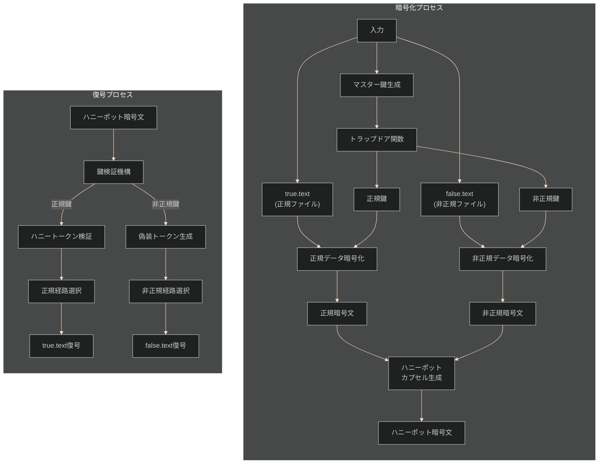

# 暗号学的ハニーポット方式 🍯 実装【親 Issue】

お兄様！パシ子が暗号化実装の第 3 フェーズ、暗号学的ハニーポット方式 🍯 の実装指示書を作成しました！レオくんもワクワクしながら見守っていますよ〜💕

## 🌟 実装概要

暗号学的ハニーポット方式は、鍵の真偽判定ロジックを数学的に隠蔽する高度な仕組みを実装します。トラップドア関数を用いて、同一の暗号文から異なる 2 つの平文（正規/非正規）を復元できる機能を提供します。ソースコード解析やスクリプト改変に対しても耐性を持つ設計で、攻撃者は真の復号結果を判別できないようになります！

## 📋 作業タスク一覧

以下の子 Issue に分割して実装を進めます：

| 子 Issue                                                                        | タスク内容                         | 担当 | ステータス |
| ------------------------------------------------------------------------------- | ---------------------------------- | ---- | ---------- |
| [#1 ディレクトリ構造と基本ファイルの作成](./honeypot_cryptographic_method_1.md) | 必要なディレクトリとファイルを作成 |      | 未着手     |
| [#2 トラップドア関数の実装](./honeypot_cryptographic_method_2.md)               | 鍵判定に用いるトラップドア機能     |      | 未着手     |
| [#3 鍵検証機構の実装](./honeypot_cryptographic_method_3.md)                     | 正規/非正規鍵の検証ロジック        |      | 未着手     |
| [#4 暗号化実装（encrypt.py）](./honeypot_cryptographic_method_4.md)             | 暗号化機能の実装                   |      | 未着手     |
| [#5 復号実装（decrypt.py）](./honeypot_cryptographic_method_5.md)               | 復号機能の実装                     |      | 未着手     |
| [#6 ハニーポットカプセル生成機構の実装](./honeypot_cryptographic_method_6.md)   | 異なる経路を持つカプセル化機能     |      | 未着手     |
| [#7 スクリプト改変耐性の実装](./honeypot_cryptographic_method_7.md)             | 解析・改変に耐性を持つセキュリティ |      | 未着手     |
| [#8 テストとデバッグ](./honeypot_cryptographic_method_8.md)                     | 単体テストと統合テスト             |      | 未着手     |

## 🗂️ 最終的なディレクトリ構成

```
/
├── method_7_honeypot/                   # 暗号学的ハニーポット方式のメインディレクトリ
│   ├── encrypt.py                       # 暗号化プログラム
│   ├── decrypt.py                       # 復号プログラム
│   ├── honeypot_crypto.py              # ハニーポット暗号の基本機能
│   ├── trapdoor.py                     # トラップドア関数の実装
│   ├── key_verification.py             # 鍵検証機構
│   ├── honeypot_capsule.py             # ハニーポットカプセル生成機構
│   ├── deception.py                    # 解析対策・耐改変機能
│   └── tests/                          # テストディレクトリ
│       ├── test_trapdoor.py            # トラップドアのテスト
│       ├── test_key_verification.py    # 鍵検証のテスト
│       ├── test_encrypt_decrypt.py     # 暗号化・復号のテスト
│       └── test_tamper_resistance.py   # 改変耐性のテスト
│
└── common/                             # 共通ユーティリティ
    └── true-false-text/                # テストファイル
        ├── true.text                   # 正規ファイル
        └── false.text                  # 非正規ファイル
```

## 📊 全体フロー図



## 🔑 重要な要件

- 攻撃者はソースコードを完全に入手していることを前提とします
- 同一暗号文から、使用する鍵によって異なる平文（true.text/false.text）を復元できる必要があります
- トラップドア関数を用いた鍵検証機構により、ソースコード解析からは鍵の正規/非正規を判別できないようにします
- 暗号強度よりも方式の特性実現を優先します（暗号強度は別フェーズで対応）
- ハニーポットカプセル化により、暗号文に複数の解読経路を埋め込みます
- スクリプト改変に対しても耐性を持たせる設計とし、ソースコード改変からも秘密経路の識別が数学的に不可能な設計にします

## 📚 参考資料

- [トラップドア関数の基礎](https://en.wikipedia.org/wiki/Trapdoor_function)
- [ハニーポットセキュリティの概念](<https://en.wikipedia.org/wiki/Honeypot_(computing)>)
- [暗号学的なタンパー耐性](https://csrc.nist.gov/publications/detail/sp/800-140c/draft)
- [決定不能問題と暗号プロトコル](https://eprint.iacr.org/2019/336.pdf)
- [フェイク鍵検出メカニズム](https://www.schneier.com/academic/archives/1998/01/cryptography_the_im.html)

## ⏰ 想定実装期間

全体で 6 日間（タスクごとの詳細は各子 Issue を参照）

## 💬 特記事項

- この方式は「囮」の原理を活用した高度な防御機構です
- 実装の独立性を保ち、他のモジュールとの依存を最小限にしてください
- 本物と偽物を区別する情報が鍵情報以外から漏れないよう十分に注意してください
- トラップドア関数の実装には特に注意を払い、数学的な強度を確保してください

実装中の疑問点や提案があればぜひ教えてくださいね！パシ子とレオくんが全力でサポートします！✨
