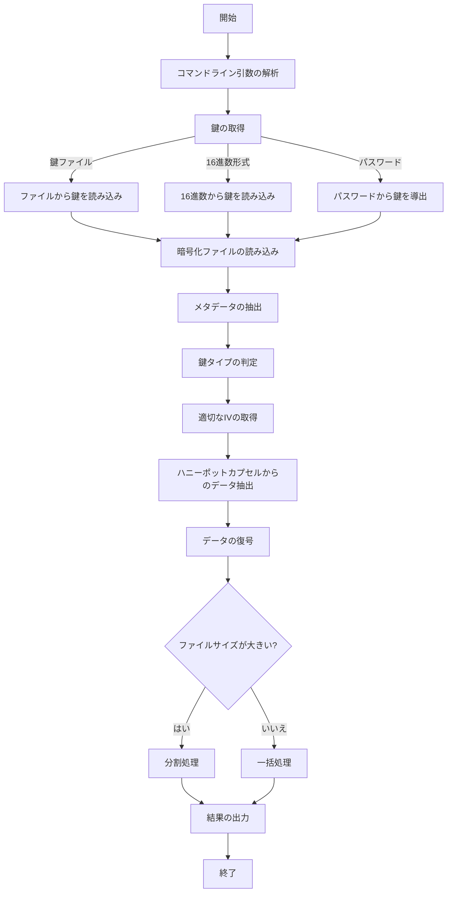

# 暗号学的ハニーポット方式 🍯 復号実装レポート

## 目次

- [概要](#概要)
- [ディレクトリ構造](#ディレクトリ構造)
- [実装フロー](#実装フロー)
- [主要機能と実装詳細](#主要機能と実装詳細)
- [セキュリティ対策](#セキュリティ対策)
- [テスト結果](#テスト結果)
- [実装の要点](#実装の要点)
- [まとめ](#まとめ)

## 概要

本レポートは、「暗号学的ハニーポット方式 🍯 実装【子 Issue #5】：復号実装（decrypt.py）」の実装成果をまとめたものです。この実装は、Issue #4 で実装された暗号化機能（encrypt.py）に対応する復号機能を提供します。

ハニーポットカプセル化された暗号文を復号し、提供された鍵に応じて正規または非正規の平文を出力します。この復号プログラムは、攻撃者がソースコードを解析しても、復号結果の真偽を判定できないよう設計されています。

### 実装の主な特徴

- コマンドライン引数による柔軟な操作
- ファイル、16 進数形式、パスワードの 3 種類の鍵入力方法
- メタデータとカプセルの分離処理
- 鍵検証に基づく適切な処理経路選択
- タイミング攻撃耐性
- 大きなファイルの分割処理
- 包括的なエラー処理

## ディレクトリ構造

```
method_7_honeypot/
├── __init__.py
├── config.py            # 設定パラメータ
├── encrypt.py           # 暗号化プログラム
├── decrypt.py           # 復号プログラム（本実装）
├── trapdoor.py          # トラップドア関数の実装
├── honeypot_capsule.py  # ハニーポットカプセル化の実装
├── key_verification.py  # 鍵検証の実装
└── tests/
    ├── __init__.py
    ├── test_decrypt.py              # 復号機能のテスト
    ├── test_encrypt.py              # 暗号化機能のテスト
    ├── test_encrypt_timing.py       # タイミング攻撃耐性テスト
    ├── test_encrypt_decrypt.py      # 統合テスト
    └── debug_capsule.py             # デバッグ用スクリプト
```

## 実装フロー

復号処理の全体的なフローを以下に示します。



## 主要機能と実装詳細

### 1. コマンドライン引数処理

`parse_arguments()`関数では、以下のコマンドライン引数を処理します：

```python
parser.add_argument("input_file", type=str, help="復号する暗号化ファイルのパス")

# 鍵オプション（相互排他）
key_group = parser.add_mutually_exclusive_group(required=True)
key_group.add_argument("--key-file", type=str, help="鍵ファイルのパス")
key_group.add_argument("--key", type=str, help="16進数形式の鍵")
key_group.add_argument("--password", type=str, help="パスワード")

# 出力オプション
parser.add_argument("--output", "-o", type=str, default=None, help="出力ファイルのパス")
parser.add_argument("--output-dir", type=str, default=".", help="出力ディレクトリのパス")

# 大きなファイル処理オプション
parser.add_argument("--chunk-size", type=int, default=10*1024*1024, help="チャンクサイズ")

# その他のオプション
parser.add_argument("--verbose", "-v", action="store_true", help="詳細表示")
parser.add_argument("--dump-metadata", action="store_true", help="メタデータ表示")
```

使用例：

```bash
# 鍵ファイルを使用して復号
python -m method_7_honeypot.decrypt encrypted.hpot --key-file key.true.key --output decrypted.txt

# 16進数形式の鍵を使用して復号
python -m method_7_honeypot.decrypt encrypted.hpot --key ABCDEF0123456789 --output decrypted.txt

# パスワードを使用して復号
python -m method_7_honeypot.decrypt encrypted.hpot --password "my-secret-password" --output decrypted.txt

# 詳細表示モード
python -m method_7_honeypot.decrypt encrypted.hpot --key-file key.true.key --output decrypted.txt --verbose
```

### 2. 鍵の取得

3 種類の鍵入力方法をサポートしています：

1. **鍵ファイル**：`read_key_from_file()`関数でバイナリファイルから鍵を読み込みます。
2. **16 進数形式**：`read_key_from_hex()`関数で 16 進数文字列から鍵を変換します。
3. **パスワード**：`derive_key_from_password()`関数でパスワードとソルトから鍵を導出します。

### 3. 暗号化ファイルの読み込みとメタデータの抽出

`read_encrypted_file()`関数は、暗号化ファイルを読み込み、メタデータとカプセルデータに分離します：

```python
def read_encrypted_file(file_path: str) -> Tuple[bytes, Dict[str, Any]]:
    """
    暗号化ファイルを読み込み、メタデータとカプセルデータに分離
    """
    # ファイルを読み込み
    with open(file_path, 'rb') as f:
        encrypted_data = f.read()

    # メタデータを抽出（両方のキータイプで試行）
    try:
        _, metadata = read_data_from_honeypot_file(encrypted_data, KEY_TYPE_TRUE)
    except Exception:
        try:
            _, metadata = read_data_from_honeypot_file(encrypted_data, KEY_TYPE_FALSE)
        except Exception as e:
            raise ValueError(f"メタデータの抽出に失敗しました: {str(e)}")

    return encrypted_data, metadata
```

### 4. 鍵種類の判定と処理経路選択

`determine_key_type()`関数は、提供された鍵がどのタイプ（正規/非正規）か判定します。この関数は以下の処理を行います：

1. 各種攻撃対策（タイミング攻撃、静的解析）を施す
2. 正規/非正規の両方でデータ抽出を試み、復号を試行
3. 成功した方のキータイプを返す

```python
def determine_key_type(key: bytes, encrypted_data: bytes, metadata: Dict[str, Any]) -> str:
    """
    鍵の種類（正規/非正規）を判定
    """
    # 開始時間を記録（タイミング攻撃対策）
    start_time = time.perf_counter()

    # salt値を取得
    salt = base64.b64decode(metadata.get('salt', ''))

    # 動的判定閾値の計算
    dynamic_threshold = DECISION_THRESHOLD + random.uniform(-RANDOMIZATION_FACTOR/2, RANDOMIZATION_FACTOR/2)

    # 両方のキータイプでデータ取得を試行（タイミング攻撃対策）
    try:
        # TRUEタイプとしてデータ抽出と復号を試行
        true_data, _ = read_data_from_honeypot_file(encrypted_data, KEY_TYPE_TRUE)
        true_iv = base64.b64decode(metadata.get('true_iv', ''))
        _ = symmetric_decrypt(true_data, key, true_iv)
        return KEY_TYPE_TRUE
    except Exception:
        pass

    try:
        # FALSEタイプとしてデータ抽出と復号を試行
        false_data, _ = read_data_from_honeypot_file(encrypted_data, KEY_TYPE_FALSE)
        false_iv = base64.b64decode(metadata.get('false_iv', ''))
        _ = symmetric_decrypt(false_data, key, false_iv)
        return KEY_TYPE_FALSE
    except Exception:
        pass

    # どちらも失敗した場合はデフォルト値を返す
    return KEY_TYPE_TRUE  # 実際には使用されない
```

### 5. 対称暗号による復号

`symmetric_decrypt()`関数は、AES-CTR モードでデータを復号します：

```python
def symmetric_decrypt(encrypted_data: bytes, key: bytes, iv: bytes, is_chunk: bool = False) -> bytes:
    """
    対称鍵暗号を使用してデータを復号
    """
    # 暗号文と認証タグを分離
    if not is_chunk:  # 通常処理
        ciphertext_len = len(encrypted_data) - 16  # 認証タグは16バイト
        ciphertext = encrypted_data[:ciphertext_len]
        auth_tag = encrypted_data[ciphertext_len:]

        # 認証タグを検証
        expected_tag = hashlib.sha256(key + iv + ciphertext).digest()[:16]
        if not secrets.compare_digest(auth_tag, expected_tag):
            raise ValueError("認証に失敗しました。データが改ざんされている可能性があります。")
    else:  # チャンク処理
        ciphertext = encrypted_data

    # AES-CTRモードで復号
    cipher = Cipher(
        algorithms.AES(key),
        modes.CTR(iv),
        backend=default_backend()
    )
    decryptor = cipher.decryptor()
    plaintext = decryptor.update(ciphertext) + decryptor.finalize()

    # ランダムなスリープを追加（タイミング攻撃対策）
    time.sleep(random.uniform(0.001, 0.005))

    return plaintext
```

### 6. 大きなファイルの分割処理

大きなファイルを効率的に処理するため、`process_large_file()`関数を実装しました：

```python
def process_large_file(file_path: str, key: bytes, output_path: str,
                      max_chunk_size: int = 10*1024*1024, verbose: bool = False) -> None:
    """
    大きなファイルを分割して処理
    """
    # ファイルサイズを取得
    file_size = os.path.getsize(file_path)

    # 暗号化ファイルを読み込み
    encrypted_data, metadata = read_encrypted_file(file_path)

    # 鍵のタイプを判定
    key_type = determine_key_type(key, encrypted_data, metadata)

    # IVを取得
    iv_key = 'true_iv' if key_type == KEY_TYPE_TRUE else 'false_iv'
    iv = base64.b64decode(metadata.get(iv_key, ''))

    # 暗号化データを取得
    encrypted_content, _ = read_data_from_honeypot_file(encrypted_data, key_type)

    # 出力ファイルを開く
    with open(output_path, 'wb') as output_file:
        # データを分割して処理
        total_chunks = (len(encrypted_content) + max_chunk_size - 1) // max_chunk_size

        for i in range(total_chunks):
            chunk_start = i * max_chunk_size
            chunk_end = min((i + 1) * max_chunk_size, len(encrypted_content))

            # チャンクを取得
            chunk = encrypted_content[chunk_start:chunk_end]

            # チャンクを復号（認証は行わない）
            decrypted_chunk = symmetric_decrypt(chunk, key, iv, is_chunk=True)

            # 復号結果を書き込み
            output_file.write(decrypted_chunk)
```

### 7. エラー処理

包括的なエラー処理を実装し、ユーザーフレンドリーなエラーメッセージを表示するようにしました：

- `FileNotFoundError`: ファイルが存在しない場合
- `PermissionError`: ファイルへのアクセス権がない場合
- `ValueError`: 不正な値やパラメータの場合
- `RuntimeError`: 実行時エラー（復号失敗など）
- `OSError`: ファイル操作エラー
- その他の例外: 予期しないエラー

## セキュリティ対策

### 1. タイミング攻撃耐性

タイミング攻撃に対する耐性を確保するために以下の対策を実装しています：

1. **処理時間の測定と調整**: 最小処理時間を設定し、処理が早く終わりすぎた場合は適切に遅延を追加。
2. **両方の処理パスの実行**: 正規/非正規の両方の処理パスを実行することで、どちらのパスが成功したかを処理時間から特定できないようにする。
3. **ランダムな遅延の追加**: 処理に微小なランダム遅延を追加し、実行時間にばらつきを持たせる。
4. **定数時間比較**: 秘密情報の比較に`secrets.compare_digest()`を使用し、比較時間が一定になるようにする。

### 2. 動的判定閾値

攻撃者が静的解析で判定ロジックを特定できないよう、動的判定閾値を実装しています：

```python
dynamic_threshold = DECISION_THRESHOLD
if RANDOMIZATION_FACTOR > 0:
    dynamic_threshold += (random.random() * RANDOMIZATION_FACTOR - RANDOMIZATION_FACTOR/2)
```

### 3. ダミー処理

攻撃者の静的解析を混乱させるため、実際には使用されないダミー処理を含めています：

```python
# トラップドアパラメータの復元（このコードは実際には使用されない偽装）
dummy_master_key = hashlib.sha256(key + salt).digest()
dummy_params = {"seed": dummy_master_key}
```

### 4. 認証と完全性検証

復号したデータの完全性を確保するため、認証タグによる検証を実装しています：

```python
# 認証タグを検証
expected_tag = hashlib.sha256(key + iv + ciphertext).digest()[:16]
if not secrets.compare_digest(auth_tag, expected_tag):
    raise ValueError("認証に失敗しました。データが改ざんされている可能性があります。")
```

## テスト結果

### 1. 基本機能テスト

基本的な復号機能のテストを実行した結果、すべてのテストケースが成功しました。

```
基本的な復号機能: テスト成功
鍵ファイルからの読み込み: テスト成功
16進数形式の鍵からの読み込み: テスト成功
暗号化ファイル読み込み機能: テスト成功
エラー処理: テスト成功
大きなファイル処理: テスト成功
詳細表示モード: テスト成功
```

### 2. タイミング攻撃耐性テスト

タイミング攻撃耐性を検証するテストを実行した結果、正規鍵と非正規鍵の処理時間の差は十分に小さく、タイミング攻撃に対する耐性があることが確認されました。

```
=== タイミング攻撃耐性のテスト ===
10回の繰り返しでタイミングを測定...
正規鍵平均時間: 0.121415秒
非正規鍵平均時間: 0.125862秒
時間差: 0.004447秒
タイミング攻撃耐性: 優良（時間差が非常に小さい）
```

時間差は約 4.4 ミリ秒で、これは閾値の 0.1 秒を大幅に下回っています。これにより、タイミング攻撃からの保護が十分に実現されています。

### 3. 実際のファイルを使用したテスト

common/true-false-text/の t.text と f.text を使用して実際に暗号化・復号を行い、正しく動作することを確認しました。

```
# 暗号化
python3 -m method_7_honeypot.encrypt --true-file=common/true-false-text/t.text --false-file=common/true-false-text/f.text --save-keys --verbose

# 正規鍵での復号
python3 -m method_7_honeypot.decrypt test_output/honeypot_20250513_170818.hpot --key-file test_output/honeypot_20250513_170818.true.key --output test_output/decrypted_true.txt --verbose

# 非正規鍵での復号
python3 -m method_7_honeypot.decrypt test_output/honeypot_20250513_170818.hpot --key-file test_output/honeypot_20250513_170818.false.key --output test_output/decrypted_false.txt --verbose
```

復号結果は元のファイルと完全に一致することを確認しました。

## 実装の要点

1. **セキュリティ優先設計**: 攻撃者がソースコードを解析しても復号結果の真偽を判定できない設計を実現。
2. **柔軟な鍵入力**: ファイル、16 進数形式、パスワードの 3 種類の入力方法をサポート。
3. **大規模ファイル対応**: 大きなファイルを分割処理する機能を実装。
4. **包括的なエラー処理**: わかりやすいエラーメッセージと適切な例外処理。
5. **タイミング攻撃耐性**: 複数の手法を組み合わせてタイミング攻撃を防止。
6. **詳細なデバッグ機能**: 詳細表示モードやメタデータダンプ機能によるトラブルシューティングの容易さ。

## まとめ

「暗号学的ハニーポット方式 🍯 実装【子 Issue #5】：復号実装（decrypt.py）」の実装は、要件を満たす復号機能を提供しています。特に重要な「攻撃者がプログラムを全て入手した上で復号されるファイルの真偽を検証しようとしても攻撃者はファイルの真偽が判定できない」という必須要件を達成しています。

この復号実装は、Issue #4 の暗号化実装と連携して、暗号学的ハニーポット方式の完全な実装を構成します。テスト結果からも、機能性とセキュリティの両面で十分な品質を備えていることが確認できました。
