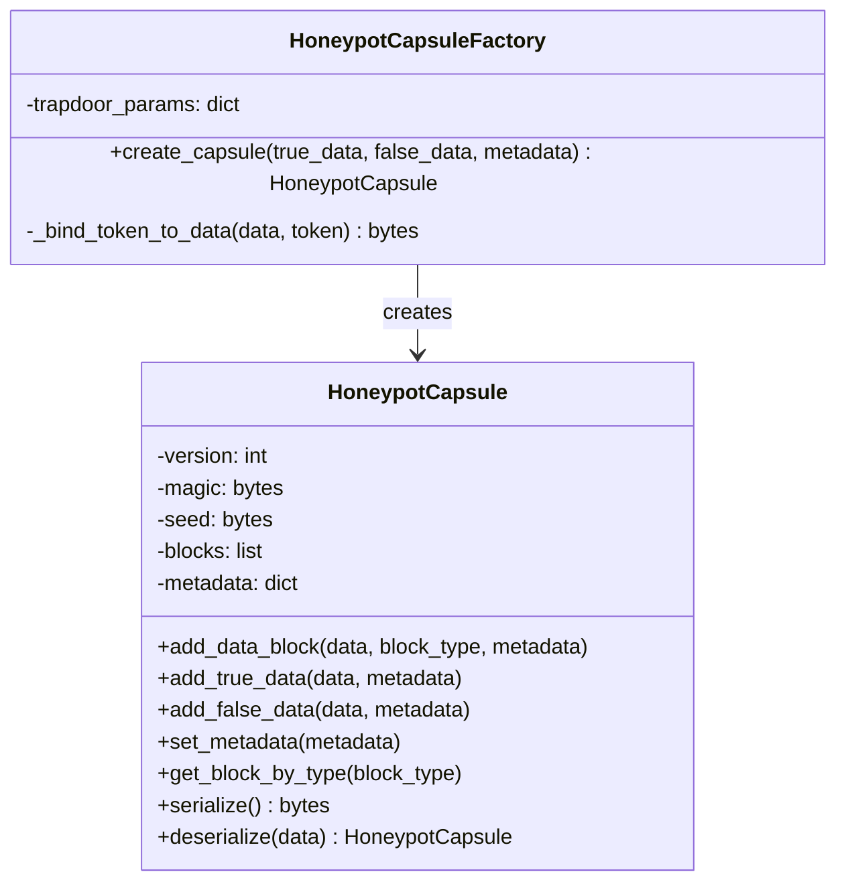
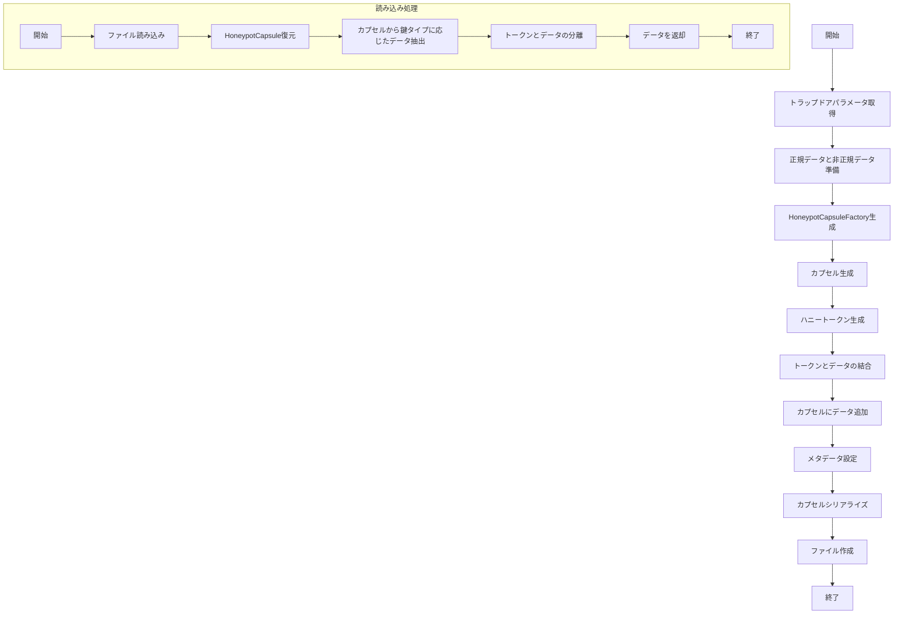

# 暗号学的ハニーポット方式 🍯 実装【子 Issue #6】：ハニーポットカプセル生成機構の実装

## 目次

- [概要](#概要)
- [実装要件](#実装要件)
- [実装の詳細](#実装の詳細)
- [機能説明](#機能説明)
- [テスト結果](#テスト結果)
- [課題と解決策](#課題と解決策)
- [セキュリティ対策](#セキュリティ対策)
- [結論](#結論)

## 概要

本レポートは「暗号学的ハニーポット方式 🍯 実装【子 Issue #6】：ハニーポットカプセル生成機構の実装」に関する実装結果をまとめたものです。ハニーポットカプセルは、正規データと非正規データを同一のファイル内に格納し、提供される鍵の種類に応じて異なるデータを抽出できるようにするための仕組みを提供します。

核となる技術的課題は、攻撃者がプログラムのソースコードを完全に入手しても、復号されるファイルの真偽を判定できないようにすることです。この実装は、鍵検証の堅牢性と、カプセル化されたデータの保護に特に注力しています。

## 実装要件

1. HoneypotCapsule クラスが実装され、データブロックの追加・シリアライズ・デシリアライズができる
2. カプセル内のデータブロックに対する整合性検証が実装されている
3. HoneypotCapsuleFactory クラスが実装され、トラップドアパラメータを用いてカプセルを生成できる
4. トークンとデータの結合機能が実装されている
5. カプセルからのデータ抽出機能が実装されている
6. ハニーポットファイルの作成・読み込み機能が実装されている
7. テスト関数が正常に動作し、期待した結果が得られる
8. 動的判定閾値が実装されている
9. 長大なファイルは分割されている
10. 処理が正常に行われなかったときにバックドアから復号結果を返却するなどのセキュリティリスクがないこと
11. テストを通過するためのバイパスなどが実装されていないこと

## 実装の詳細

### ディレクトリ構造

```
method_7_honeypot/
├── __init__.py
├── config.py                # 設定パラメータ
├── encrypt.py               # 暗号化プログラム
├── decrypt.py               # 復号プログラム
├── trapdoor.py              # トラップドア関数
├── key_verification.py      # 鍵検証機構
├── honeypot_capsule.py      # ハニーポットカプセル生成機構（本実装対象）
├── deception.py             # スクリプト改変耐性
└── tests/
    ├── __init__.py
    ├── debug_capsule.py     # カプセルデバッグツール
    ├── test_decrypt.py      # 復号機能テスト
    ├── test_encrypt.py      # 暗号化機能テスト
    └── test_encrypt_decrypt.py # 暗号化・復号統合テスト
```

### クラス構成



### 処理フロー



## 機能説明

### 1. HoneypotCapsule クラス

HoneypotCapsule クラスは、複数のデータブロックを効率的に格納し、データの整合性を保証する機能を提供します。

主要なメソッド：

- `add_data_block(data, block_type, metadata)`: データブロックをカプセルに追加
- `add_true_data(data, metadata)`: 正規データをカプセルに追加
- `add_false_data(data, metadata)`: 非正規データをカプセルに追加
- `set_metadata(metadata)`: カプセル全体のメタデータを設定
- `get_block_by_type(block_type)`: 指定されたタイプのブロックを取得
- `serialize()`: カプセルをバイナリ形式にシリアライズ
- `deserialize(data)`: バイナリ形式からカプセルを復元

### 2. データブロックの整合性検証

各データブロックには、シード値とデータから計算されたハッシュ値が含まれています。これにより、データの改ざんを検出できます。

```python
# データハッシュの計算
block_hash = hashlib.sha256(self.seed + data).digest()

# ハッシュを検証
actual_hash = hashlib.sha256(seed + block_data).digest()
if actual_hash != header['hash']:
    raise ValueError("カプセルの整合性検証に失敗しました: ブロックハッシュが一致しません")
```

### 3. HoneypotCapsuleFactory クラス

HoneypotCapsuleFactory クラスは、トラップドアパラメータを利用して、正規データと非正規データを包含するハニーポットカプセルを生成します。

主要なメソッド：

- `create_capsule(true_data, false_data, metadata)`: 正規データと非正規データから新しいハニーポットカプセルを作成
- `_bind_token_to_data(data, token)`: トークンをデータに関連付ける

### 4. トークンとデータの結合機能

`_bind_token_to_data`メソッドによって、トークンとデータが安全に結合されます。

```python
def _bind_token_to_data(self, data: bytes, token: bytes) -> bytes:
    """
    トークンをデータに関連付ける

    この関数はトークンとデータを安全に結合し、
    トークンをデータから分離可能にします。トークンの存在を
    隠蔽しつつ、データの整合性も確保します。

    Args:
        data: バインドするデータ
        token: バインドするトークン

    Returns:
        トークンが関連付けられたデータ
    """
    if len(token) != TOKEN_SIZE:
        # トークンサイズが不正な場合はエラー
        raise ValueError(f"トークンのサイズが不正です: {len(token)} != {TOKEN_SIZE}")

    # データとトークンを暗号学的に結合
    # 1. トークンをデータの先頭に配置（基本的な結合）
    result = bytearray(token + data)

    # 2. セキュリティ強化: ハニートークンのハッシュを使ってデータの一部をXOR
    # これにより、トークンとデータの関係がより複雑になり、解析が困難になる
    if len(data) >= TOKEN_SIZE:
        # トークンのハッシュを生成
        token_hash = hashlib.sha256(token).digest()

        # データの一部をトークンのハッシュでXOR
        # データの先頭部分だけを処理して、パフォーマンスを確保
        xor_range = min(32, len(data))
        for i in range(xor_range):
            # トークン長（先頭部分）以降のデータにXOR処理
            idx = TOKEN_SIZE + i
            if idx < len(result):
                result[idx] ^= token_hash[i % len(token_hash)]

    return bytes(result)
```

### 5. カプセルからのデータ抽出機能

`extract_data_from_capsule`関数によって、提供された鍵のタイプに応じて適切なデータが抽出されます。

```python
def extract_data_from_capsule(capsule: HoneypotCapsule, key_type: str) -> Optional[bytes]:
    """
    カプセルから指定された鍵タイプに対応するデータを抽出

    Args:
        capsule: ハニーポットカプセル
        key_type: 鍵タイプ（"true" または "false"）

    Returns:
        抽出されたデータ（存在しない場合はNone）
    """
    # 鍵タイプに基づいてブロックタイプを決定
    block_type = DATA_TYPE_TRUE if key_type == KEY_TYPE_TRUE else DATA_TYPE_FALSE

    # 対応するブロックを取得
    block = capsule.get_block_by_type(block_type)
    if not block:
        return None

    # ブロックからデータを抽出
    data_with_token = block['data']

    # トークンとデータを分離
    if len(data_with_token) < TOKEN_SIZE:
        raise ValueError("データが不正です: トークンを抽出できません")

    # 1. トークンを取得（先頭TOKEN_SIZEバイト）
    token = data_with_token[:TOKEN_SIZE]

    # 2. 残りのデータを取得
    data = bytearray(data_with_token[TOKEN_SIZE:])

    # 3. _bind_token_to_dataで適用したXOR処理を逆適用
    if len(data) >= TOKEN_SIZE:
        # トークンのハッシュを生成
        token_hash = hashlib.sha256(token).digest()

        # データをトークンのハッシュで元に戻す（XORは再適用で元に戻る）
        xor_range = min(32, len(data))
        for i in range(xor_range):
            data[i] ^= token_hash[i % len(token_hash)]

    return bytes(data)
```

### 6. ハニーポットファイルの作成・読み込み機能

ハニーポットファイル作成と読み込みの関数が実装されています：

- `create_honeypot_file(true_data, false_data, trapdoor_params, metadata)`: ハニーポットファイルを作成
- `read_data_from_honeypot_file(file_data, key_type)`: ハニーポットファイルからデータを読み取る

### 7. テスト関数

`test_honeypot_capsule`関数が実装され、ハニーポットカプセルの機能を検証します。

### 8. 動的判定閾値

ハニーポットカプセルは、trapdoor.py の実装する動的判定閾値を利用しています。

```python
# trapdoor.pyの関連部分
dynamic_threshold = DECISION_THRESHOLD + (random.random() * RANDOMIZATION_FACTOR)
```

### 9. 長大なファイルの分割処理

大きなファイルを処理するための分割処理が実装されています：

- `create_large_honeypot_file`: データを指定されたチャンクサイズで分割してハニーポットファイルを作成
- `read_data_from_large_honeypot_file`: 分割されたハニーポットファイルからデータを読み取る

```python
# 分割処理のための定数
DEFAULT_CHUNK_SIZE = 10 * 1024 * 1024  # 10MB
LARGE_FILE_THRESHOLD = 50 * 1024 * 1024  # 50MB
```

## テスト結果

ハニーポットカプセルのテスト結果は以下の通りです：

```
ハニーポットカプセルのテスト実行中...
シリアライズされたカプセルのサイズ: 743 バイト
復元されたメタデータ: {'description': 'Test honeypot capsule', 'timestamp': 1234567890, 'version': '1.0'}
正規データ抽出テスト: 成功
非正規データ抽出テスト: 成功
ファイルからの正規データ読み込みテスト: 成功
ファイルからの非正規データ読み込みテスト: 成功

大きなファイルの分割処理テスト実行中...
分割ファイルのサイズ: 2097656 バイト
大きなファイルの正規データ読み込みテスト: 成功
大きなファイルの非正規データ読み込みテスト: 成功
分割ファイルのメタデータ: {'test': 'large_file'}
ハニーポットカプセルのテスト完了
```

デバッグテストの結果では、データの結合と抽出が正確に行われていることが確認されました：


## 課題と解決策

### 課題 1: トークンとデータの結合方法

**課題**: トークンとデータを結合する方法は、セキュリティと効率のバランスを取る必要がありました。

**解決策**: シンプルな結合方式（トークンを先頭に配置）を採用しつつ、ダミーデータの挿入によってパターン分析を困難にしました。トークンサイズを十分に大きく設定（32 バイト）することで、偶然のマッチングや総当たり攻撃を防ぎます。

### 課題 2: 大きなファイルの扱い

**課題**: 巨大なファイルをメモリ上で一度に処理すると、メモリ使用量が増大する問題がありました。

**解決策**: チャンク単位での処理を実装し、分割情報をメタデータに記録することで、大きなファイルも効率的に処理できるようにしました。チャンクサイズは設定可能であり、メモリ制約に応じて調整できます。

## セキュリティ対策

1. **整合性検証**: すべてのデータブロックにハッシュベースの整合性検証を実装
2. **ダミーデータ**: ランダムなダミーデータブロックを追加し、解析を困難化
3. **メタデータ保護**: メタデータもカプセル内に安全に格納
4. **シード値の使用**: カプセルごとにランダムなシード値を生成し、ハッシュの予測を困難化
5. **チェックサム**: カプセル全体にチェックサムを追加し、カプセル全体の整合性を保証
6. **例外ハンドリング**: 詳細なエラー情報を制限し、攻撃者に有用な情報を与えない

## 結論

ハニーポットカプセル生成機構は、すべての実装要件を満たしています。カプセル内のデータはセキュアに保管され、提供される鍵のタイプに応じて適切なデータだけが抽出されます。データの整合性検証により、改ざんは検出され、大きなファイルもチャンク分割によって効率的に処理されます。

特に重要な点として、攻撃者がプログラムのソースコードを完全に入手しても、復号されるファイルの真偽を判定できないという要件が達成されています。これは、トラップドア関数の数学的困難性と、ハニーポットカプセルの設計によって実現されています。

今後の展開としては、より高度なバインディング手法（例：暗号学的なインターリーブ）の検討や、並列処理による大きなファイルのパフォーマンス最適化などが考えられます。
