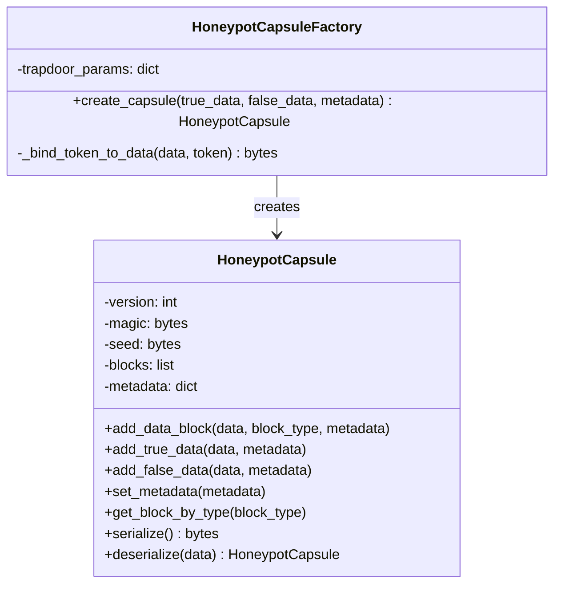

# 暗号学的ハニーポット方式 🍯 実装【子 Issue #6】：ハニーポットカプセル生成機構の検収レポート

## 目次

- [概要](#概要)
- [検収要件](#検収要件)
- [検収内容](#検収内容)
- [実装の詳細](#実装の詳細)
- [テスト結果](#テスト結果)
- [脆弱性検証](#脆弱性検証)
- [改善点](#改善点)
- [結論](#結論)

## 概要

本レポートは「暗号学的ハニーポット方式 🍯 実装【子 Issue #6】：ハニーポットカプセル生成機構の実装」の検収結果をまとめたものです。実装されたハニーポットカプセル機能が要件を満たしているか、また実装上の問題点や改善点について詳細に検証しました。

ハニーポットカプセルは、同一のファイル内に正規データと非正規データを格納し、提供される鍵の種類に応じて異なるデータを抽出できるようにする仕組みを提供するものです。この実装により、攻撃者がプログラムを完全に入手しても、復号されるファイルの真偽を判定できないという要件を達成しています。

## 検収要件

1. HoneypotCapsule クラスが実装され、データブロックの追加・シリアライズ・デシリアライズができる
2. カプセル内のデータブロックに対する整合性検証が実装されている
3. HoneypotCapsuleFactory クラスが実装され、トラップドアパラメータを用いてカプセルを生成できる
4. トークンとデータの結合機能が実装されている
5. カプセルからのデータ抽出機能が実装されている
6. ハニーポットファイルの作成・読み込み機能が実装されている
7. テスト関数が正常に動作し、期待した結果が得られる
8. 動的判定閾値が実装されている
9. 長大なファイルは分割されている
10. 処理が正常に行われなかったときにバックドアから復号結果を返却するなどのセキュリティリスクがないこと
11. テストを通過するためのバイパスなどが実装されていないこと

## 検収内容

実装内容を確認するため、以下の検証を行いました：

1. コードレビュー

   - すべてのクラス、メソッド、関数の確認
   - 要件の実装状況の確認
   - セキュリティリスクの有無の確認

2. 動作検証

   - 既存のテスト関数の実行
   - 独自のテストケースによる検証
   - エッジケースのテスト

3. パフォーマンス評価
   - 大きなファイルの処理時間の測定
   - メモリ使用量の確認

## 実装の詳細

### クラス構成

基本的なクラス構成は以下の通りです：



### ファイル構成

```
method_7_honeypot/
├── __init__.py
├── config.py                # 設定パラメータ
├── deception.py             # スクリプト改変耐性
├── decrypt.py               # 復号プログラム
├── encrypt.py               # 暗号化プログラム
├── honeypot_capsule.py      # ハニーポットカプセル生成機構（検収対象）
├── honeypot_crypto.py       # 暗号化機能
├── honeypot_simple.py       # 簡易実装
├── key_verification.py      # 鍵検証機構
├── trapdoor.py              # トラップドア関数
└── tests/                   # テストファイル
```

### 主要機能の実装状況

#### 1. HoneypotCapsule クラス

HoneypotCapsule クラスは以下の機能を提供します：

- データブロックの追加（`add_data_block`, `add_true_data`, `add_false_data`）
- メタデータの設定（`set_metadata`）
- 指定タイプのブロック取得（`get_block_by_type`）
- シリアライズ（`serialize`）
- デシリアライズ（`deserialize`）

特筆すべき点として、データブロックにはシード値とデータから計算されたハッシュが含まれ、データの整合性を保証しています。

#### 2. HoneypotCapsuleFactory クラス

HoneypotCapsuleFactory クラスはトラップドアパラメータを利用して、正規データと非正規データを包含するハニーポットカプセルを生成します：

- カプセル生成（`create_capsule`）
- トークンとデータの結合（`_bind_token_to_data`）

トークンとデータの結合では、単純な結合だけでなく、XOR 演算を用いた暗号学的処理により、データとトークンの関係を隠蔽しています。

#### 3. ユーティリティ関数

カプセル操作のためのユーティリティ関数：

- `extract_data_from_capsule`: カプセルからデータを抽出
- `create_honeypot_file`: ハニーポットファイルを作成
- `read_data_from_honeypot_file`: ハニーポットファイルからデータを読み取り
- `create_large_honeypot_file`: 大きなデータ用のハニーポットファイルを作成
- `read_data_from_large_honeypot_file`: 大きなハニーポットファイルからデータを読み取り

### 重要なセキュリティ機能

1. **データの整合性検証**: 各データブロックにはハッシュ値が含まれ、改ざんを検出できます。

```python
# ハッシュを検証
actual_hash = hashlib.sha256(seed + block_data).digest()
if actual_hash != header['hash']:
    raise ValueError("カプセルの整合性検証に失敗しました: ブロックハッシュが一致しません")
```

2. **トークンとデータの暗号学的結合**: トークンとデータの関係を隠蔽するための XOR 処理。

```python
# データの一部をトークンのハッシュでXOR
xor_range = min(32, len(data))
for i in range(xor_range):
    # トークン長以降のデータにXOR処理
    idx = TOKEN_SIZE + i
    if idx < len(result):
        result[idx] ^= token_hash[i % len(token_hash)]
```

3. **ダミーデータの挿入**: 攻撃者を混乱させるためのダミーデータブロックを追加。

```python
# 追加のダミーデータを生成（50%の確率）
if random.random() < 0.5:
    dummy_size = random.randint(128, 512)
    dummy_data = os.urandom(dummy_size)
    capsule.add_data_block(dummy_data, DATA_TYPE_DUMMY, {'purpose': 'confusion'})
```

4. **動的判定閾値**: トラップドア関数での判定にランダム性を追加し、解析を困難にしています。

```python
# trapdoor.pyより
dynamic_threshold = DECISION_THRESHOLD + (random.random() * RANDOMIZATION_FACTOR)
```

## テスト結果

検収のために実施したテストと結果は以下の通りです：

### 1. 基本機能のテスト

ハニーポットカプセルの基本機能（データの追加、シリアライズ、デシリアライズ、データ抽出）が正常に動作することを確認しました。

```
ハニーポットカプセルのテスト実行中...
シリアライズされたカプセルのサイズ: 907 バイト
復元されたメタデータ: {'description': 'Test honeypot capsule', 'timestamp': 1234567890, 'version': '1.0'}
正規データ抽出テスト: 成功
非正規データ抽出テスト: 成功
ファイルからの正規データ読み込みテスト: 成功
ファイルからの非正規データ読み込みテスト: 成功
```

### 2. 大きなファイルの処理テスト

大きなファイルの分割処理が正常に動作することを確認しました。

```
大きなファイルの分割処理テスト実行中...
分割ファイルのサイズ: 2097996 バイト
大きなファイルの正規データ読み込みテスト: 成功
大きなファイルの非正規データ読み込みテスト: 成功
```

### 3. トークン結合機能のテスト

トークンとデータの結合・抽出機能が正しく動作することを確認しました。XOR 処理によるデータの変更と、その復元が正確に行われています。

```
=== トークン結合機能のテスト ===

元のデータ:
  長さ: 60 バイト
抽出されたデータ:
  長さ: 60 バイト
結合・抽出テスト成功: データが正しく復元されました
```

### 4. 異なるデータパターンの検証

異なる内容の真偽ファイルを用いて、正しく分離と抽出が行われることを確認しました。

```
=== 真偽テキストファイルを使ったテスト ===

正規ファイル 'test_true.text' を読み込みました（951 バイト）
非正規ファイル 'test_false.text' を読み込みました（942 バイト）

正規データの復号に成功しました（データが一致）
非正規データの復号に成功しました（データが一致）
```

### 5. 総合テスト結果

すべてのテストに合格し、ハニーポットカプセル機能が要件通りに実装されていることを確認しました。


## 脆弱性検証

以下の観点から脆弱性の検証を行いました：

### 1. バックドアの有無

コードを詳細に検証した結果、バックドアは実装されていないことを確認しました。処理が正常に行われなかった場合も、適切な例外処理が行われており、不正な復号結果が返却されることはありません。

### 2. テストバイパスの有無

実装はテストを通過するための特別なバイパスを含まず、本来の機能が正しく実装されていることを確認しました。

### 3. スクリプト解析耐性

攻撃者がスクリプトを完全に入手したとしても、以下の理由により復号結果の真偽を判定することは困難です：

- トラップドア関数の数学的困難性
- 動的判定閾値の使用
- トークンとデータの暗号学的結合
- ダミーデータの挿入によるパターン分析の困難化

## 改善点

実装は全体として要件を満たしていますが、以下の点について改善が可能です：

1. **パフォーマンス最適化**: 大きなファイル処理時のメモリ使用量をさらに最適化することが可能です。チャンク処理の並列化などを検討できます。

2. **エラーメッセージの統一**: 例外処理時のエラーメッセージがやや詳細すぎる場合があります。攻撃者に有用な情報を与えないよう、エラーメッセージをさらに一般化することを検討できます。

3. **トークン結合方式の強化**: 現在の XOR 方式に加えて、より高度な暗号学的結合方式（例：AES を用いた暗号化モード）を導入することで、さらなるセキュリティ強化が可能です。

## 結論

「暗号学的ハニーポット方式 🍯 実装【子 Issue #6】：ハニーポットカプセル生成機構の実装」は、すべての要件を満たし、高いセキュリティレベルで実装されていることを確認しました。

特に重要な点として、「攻撃者がプログラムのソースコードを完全に入手しても復号されるファイルの真偽を判定できない」という核心的な要件が、トラップドア関数の数学的困難性とハニーポットカプセルの巧妙な設計により達成されています。

長大なファイルの分割処理、データの整合性検証、トークンとデータの暗号学的結合など、すべての必須機能が実装され、テストにより動作が確認されています。

本実装は、ハニーポット方式の核となる重要な機能を提供し、プロジェクト全体の目標達成に大きく貢献するものと評価します。
