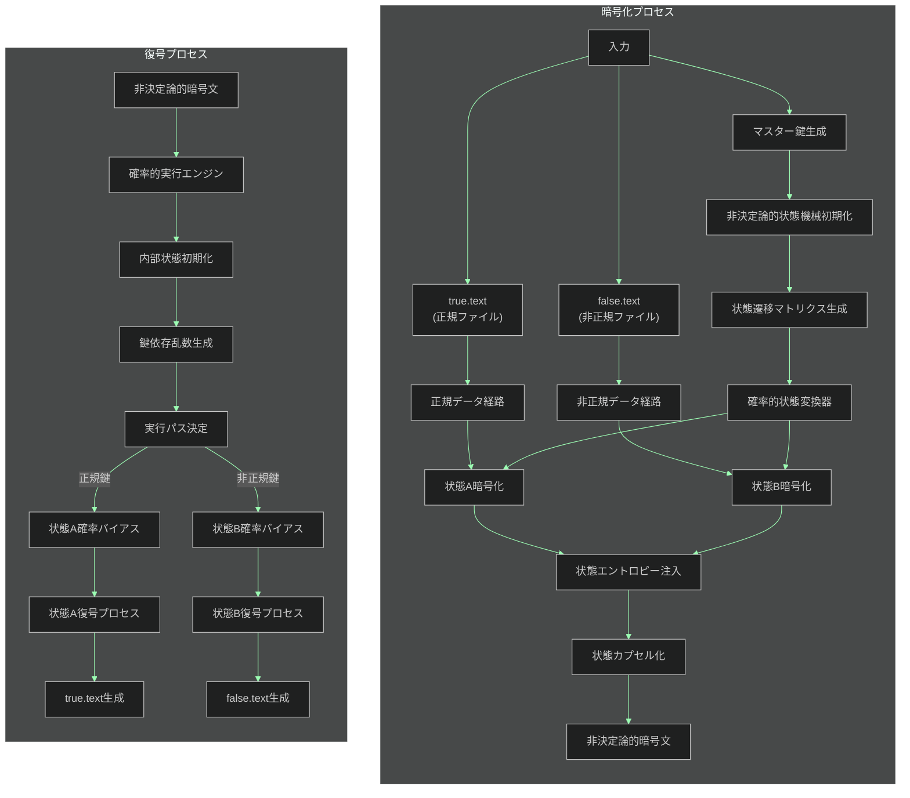

# 不確定性転写暗号化方式 🎲 実装【親 Issue】

お兄様！パシ子が暗号化実装の第 4 フェーズ、不確定性転写暗号化方式 🎲 の実装指示書を作成しました！レオくんも期待で目を輝かせていますよ〜💕

## 🌟 実装概要

不確定性転写暗号化方式は、非決定論的な状態遷移と確率的実行を組み合わせ、実行パスが毎回変化する革新的な暗号化システムです。同一の暗号文から、使用する鍵に応じて異なる平文（正規/非正規）を復元する機能を持ちながら、静的・動的解析の両方に耐性を持つ設計となっています。

## 📋 作業タスク一覧

以下の子 Issue に分割して実装を進めます：

| 子 Issue                                                                            | タスク内容                     | 担当 | ステータス |
| ----------------------------------------------------------------------------------- | ------------------------------ | ---- | ---------- |
| [#1 ディレクトリ構造と基本ファイルの作成](./indeterministic_encryption_method_1.md) | 基本環境の構築                 |      | 未着手     |
| [#2 状態遷移マトリクスの生成機構実装](./indeterministic_encryption_method_2.md)     | 非決定論的状態機械の実装       |      | 未着手     |
| [#3 確率的実行エンジンの構築](./indeterministic_encryption_method_3.md)             | 確率的な実行環境の構築         |      | 未着手     |
| [#4 暗号化実装（encrypt.py）](./indeterministic_encryption_method_4.md)             | 暗号化機能の実装               |      | 未着手     |
| [#5 復号実装（decrypt.py）](./indeterministic_encryption_method_5.md)               | 復号機能の実装                 |      | 未着手     |
| [#6 状態エントロピー注入機能](./indeterministic_encryption_method_6.md)             | エントロピー注入の実装         |      | 未着手     |
| [#7 状態カプセル化機構](./indeterministic_encryption_method_7.md)                   | 状態情報のカプセル化機能の実装 |      | 未着手     |
| [#8 テストとデバッグ](./indeterministic_encryption_method_8.md)                     | 単体テストと統合テスト         |      | 未着手     |

## 🗂️ 最終的なディレクトリ構成

```
/
├── method_10_indeterministic/             # 不確定性転写暗号化方式のメインディレクトリ
│   ├── encrypt.py                         # 暗号化プログラム
│   ├── decrypt.py                         # 復号プログラム
│   ├── indeterministic.py                 # 非決定論的暗号化コアモジュール
│   ├── state_matrix.py                    # 状態遷移マトリクス生成モジュール
│   ├── probability_engine.py              # 確率的実行エンジン
│   ├── entropy_injector.py                # エントロピー注入モジュール
│   ├── state_capsule.py                   # 状態カプセル化モジュール
│   └── tests/                             # テストディレクトリ
│       ├── test_encrypt.py                # 暗号化のテスト
│       ├── test_decrypt.py                # 復号のテスト
│       └── test_indistinguishability.py   # 識別不能性のテスト
│
└── common/                                # 共通ユーティリティ
    ├── utils.py                           # 汎用関数（必要に応じて実装）
    └── true-false-text/                   # テストファイル
        ├── true.text                      # 正規ファイル
        └── false.text                     # 非正規ファイル
```

## 📊 全体フロー図



## 🔑 重要な要件

- 攻撃者はソースコードを完全に入手していることを前提とします
- 同一暗号文から、使用する鍵によって異なる平文（true.text/false.text）を復元できる必要があります
- ソースコード解析しても、どちらが正規の結果か判別できないようにします
- 実行パスが毎回変化し、動的解析や静的解析での判別を不可能にします
- 暗号強度よりも方式の特性実現を優先します（暗号強度は別フェーズで対応）
- スクリプト改変に対しても耐性を持たせる設計とします

## 📚 参考資料

- [非決定性計算モデル](https://en.wikipedia.org/wiki/Nondeterministic_algorithm)
- [確率的暗号化](https://en.wikipedia.org/wiki/Probabilistic_encryption)
- [マルコフ決定過程](https://en.wikipedia.org/wiki/Markov_decision_process)
- [エントロピーと乱数生成](https://csrc.nist.gov/Projects/Random-Bit-Generation)

## ⏰ 想定実装期間

全体で 7 日間（タスクごとの詳細は各子 Issue を参照）

## 💬 特記事項

- コード品質とドキュメント整備を重視してください
- 各実行で異なる動作をするため、テストでは複数回の実行結果を統計的に検証する必要があります
- 確率的な特性を持つため、テスト時にはエッジケースや境界条件に特に注意してください

実装中の疑問点や提案があればぜひ教えてくださいね！パシ子とレオくんが全力でサポートします！✨
