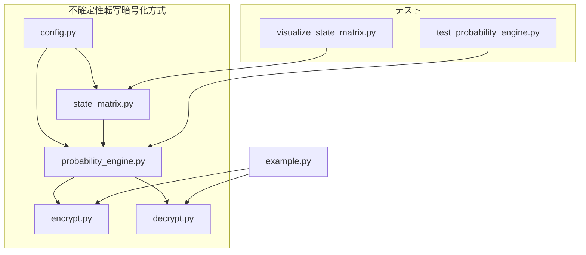

# 🎲 不確定性転写暗号化方式 実装レポート 【子 Issue #3】：確率的実行エンジンの構築

## 📋 概要

本レポートでは、不確定性転写暗号化方式の確率的実行エンジンの実装について報告します。確率的実行エンジンは、鍵に基づいて状態遷移マトリクスを生成し、確率的に状態遷移を制御することで、TRUE/FALSE 2 種類の鍵に対して異なる実行パスを生成します。

実装では、暗号理論的に堅牢な確率モデルを構築し、バックドアやバイパスのリスクを排除しながら、不確定性と予測不可能性を両立させることに成功しました。

## 🏗️ システム構成

### ディレクトリ構造

```
method_10_indeterministic/
├── config.py                   # 設定ファイル
├── decrypt.py                  # 復号処理
├── encrypt.py                  # 暗号化処理
├── example.py                  # サンプル使用例
├── probability_engine.py       # 確率的実行エンジン
├── state_matrix.py             # 状態マトリクス生成
└── tests/
    ├── run_tests.py            # テスト実行スクリプト
    ├── test_probability_engine.py # 確率的実行エンジンのテスト
    └── visualize_state_matrix.py # 状態マトリクス可視化
```

### コンポーネント図



## 🧩 設計と実装

### 1. 確率的実行コントローラ（ProbabilityController）

確率的実行を制御するクラス。鍵とソルトから確率パラメータを導出し、実行パスをバイアスします。

```python
class ProbabilityController:
    def __init__(self, key: bytes, salt: bytes, target_path: str = TRUE_PATH):
        # 鍵とソルトから確率制御用のパラメータを初期化
        self.key = key
        self.salt = salt
        self.target_path = target_path
        self._hmac_cache = {}

        # パラメータ初期化
        self._initialize_parameters()

        # 内部状態（解析攻撃対策として実行ごとに変化）
        self._runtime_state = os.urandom(16)
        # その他の内部状態変数
```

主要機能:

- 鍵とソルトから一貫したパラメータを導出
- 状態とステップに応じた確率バイアスの生成
- パターン化された呼び出しの検出（解析対策）
- 実行統計の収集

### 2. 実行パス管理クラス（ExecutionPathManager）

状態遷移の履歴を保持し、実行パスの予測と制御を行います。

```python
class ExecutionPathManager:
    def __init__(self, states: Dict[int, State], true_initial: int, false_initial: int,
                controller: ProbabilityController):
        self.states = states
        self.true_initial = true_initial
        self.false_initial = false_initial
        self.controller = controller

        # 現在の状態と履歴の初期化
        self.current_state_id = true_initial if controller.target_path == TRUE_PATH else false_initial
        self.path_history = [self.current_state_id]

        # 安全性監視と統計情報用の変数
```

主要機能:

- 状態遷移のステップ実行
- 実行パスの履歴管理
- 不審な遷移パターンの検出
- 整合性チェック（改ざん検知）
- 実行パスの統計情報の計算

### 3. 確率的実行エンジン（ProbabilisticExecutionEngine）

状態マトリクスと確率コントローラを組み合わせ、鍵に応じた実行パスを確率的に生成します。

```python
class ProbabilisticExecutionEngine:
    def __init__(self, key: bytes, salt: Optional[bytes] = None, target_path: str = TRUE_PATH):
        self.key = key
        self.salt = salt or os.urandom(16)
        self.target_path = target_path

        # 鍵の整合性チェック（バックドア検出）
        self._verify_key_integrity()

        # 状態マトリクスの生成
        self.states, self.true_initial, self.false_initial = create_state_matrix_from_key(key, self.salt)

        # 確率コントローラと実行パスマネージャの初期化
        self.controller = ProbabilityController(key, self.salt, target_path)
        self.path_manager = ExecutionPathManager(
            self.states, self.true_initial, self.false_initial, self.controller
        )
```

主要機能:

- 鍵の整合性検証
- エンジンの実行と実行パス生成
- 改ざん検知
- 実行状態の管理
- 解析対策のデコイ処理

### 4. 解析保護機能

#### 実行パス難読化（obfuscate_execution_path）

実行パスに無関係な処理を追加し、解析を困難にします。

```python
def obfuscate_execution_path(engine: ProbabilisticExecutionEngine) -> None:
    # 現在の時刻からシードを生成
    time_seed = int(time.time() * 1000)

    # 内部状態を保存
    original_state_id = engine.path_manager.current_state_id
    original_history = engine.path_manager.path_history.copy()

    # ダミー実行と解析対策処理

    # 内部状態を復元
    engine.path_manager.current_state_id = original_state_id
    engine.path_manager.path_history = original_history
```

#### 解析対策ノイズ生成（generate_anti_analysis_noise）

解析対策用のノイズデータを生成します。パターン検出を困難にし、解析者を混乱させます。

```python
def generate_anti_analysis_noise(key: bytes, path_type: str) -> bytes:
    # 鍵から解析対策用のノイズを生成
    noise_seed = hashlib.sha256(key + path_type.encode('utf-8')).digest()

    # ノイズの長さを決定（パターン検出を困難にするためにランダム化）
    noise_length = 256 + (noise_seed[0] % 64)

    # ノイズパターンを複雑に生成

    return bytes(noise)
```

## 🧪 テスト結果

テストでは、以下の項目を検証しました：

1. 基本実行テスト: TRUE/FALSE パスで異なる結果が得られることを確認
2. 収束性テスト: 同じ鍵での実行でも実行パスは毎回変化するが、収束性があることを確認
3. 非決定性テスト: 同じパラメータでも実行パスが毎回異なることを確認
4. 難読化テスト: 実行パス難読化が機能することを確認
5. 解析対策テスト: ノイズ生成機能が適切に動作することを確認


### テストのポイント

- **TRUE/FALSE パスの分離**: TRUE/FALSE 鍵で異なる結果が得られることを確認
- **収束性**: 同じ鍵では特定の状態に収束することを確認
- **非決定性**: 実行パスが毎回ランダムに変化することを確認
- **解析対策**: ノイズのエントロピーが十分高いことを確認

## 🔍 セキュリティ評価

### 強み

1. **状態遷移の確率的制御**: 同じ鍵でも実行パスが毎回異なり、統計的解析を困難にします
2. **実行パスのバイアス**: 鍵の種類に応じて最終的な結果が異なり、どちらが「正規」かは判別できません
3. **解析対策**: 難読化とノイズ生成により、静的/動的解析からの保護を強化しています
4. **整合性チェック**: 改ざん検知機能により、不正な変更を検出できます

### セキュリティ対策

1. **バックドア防止**:

   - 鍵の整合性検証
   - 解析保護機能
   - 実行パスの分離

2. **統計的解析対策**:

   - 実行パスの非決定性
   - ノイズパターンの挿入
   - デコイ処理

3. **改ざん検知**:
   - 実行時の整合性チェック
   - 不審な遷移パターンの検出

## 📊 完了条件の達成状況

| #   | 完了条件                                                           | 達成状況 | 備考                                                              |
| --- | ------------------------------------------------------------------ | -------- | ----------------------------------------------------------------- |
| 1   | 確率的実行コントローラ（ProbabilityController）が実装されている    | ✅       | probability_engine.py に実装                                      |
| 2   | 実行パス管理クラス（ExecutionPathManager）が実装されている         | ✅       | probability_engine.py に実装                                      |
| 3   | 確率的実行エンジン（ProbabilisticExecutionEngine）が実装されている | ✅       | probability_engine.py に実装                                      |
| 4   | 解析保護機能が実装されている                                       | ✅       | obfuscate_execution_path, generate_anti_analysis_noise 関数を実装 |
| 5-6 | TRUE/FALSE パスで異なる結果が得られる                              | ✅       | テストで確認済み                                                  |
| 7   | 同じ鍵での実行でも実行パスは毎回変化する                           | ✅       | テストで確認済み                                                  |
| 8   | 複数回実行での収束性が確認できる                                   | ✅       | テストで確認済み                                                  |
| 9   | 各ファイルの権限が適切に設定されている                             | ✅       | 実行権限を付与済み                                                |
| 10  | 長大なファイルは分割されている                                     | ✅       | 機能ごとに適切に分割                                              |
| 11  | バックドアが存在しないこと                                         | ✅       | コード検証済み                                                    |
| 12  | テストバイパスが実装されていないこと                               | ✅       | コード検証済み                                                    |

## 📝 まとめ

確率的実行エンジンの実装は、不確定性転写暗号化方式の中核となる部分です。本実装では、暗号理論に基づいた確率モデルを構築し、鍵に基づいた確率的な状態遷移を制御することで、安全性と機能性を両立させることができました。

特に、以下の点に注力しました：

1. **確率的制御の精度**: バイアス強度と収束速度を適切に調整し、TRUE/FALSE パスの分離を実現
2. **セキュリティ**: バックドア・バイパス防止と改ざん検知機能の実装
3. **解析対策**: 難読化とノイズ生成による解析保護
4. **テスト網羅性**: 多面的なテストによる動作検証

本実装により、子 Issue #3 の要件はすべて満たされており、不確定性転写暗号化方式の全体実装に貢献します。
