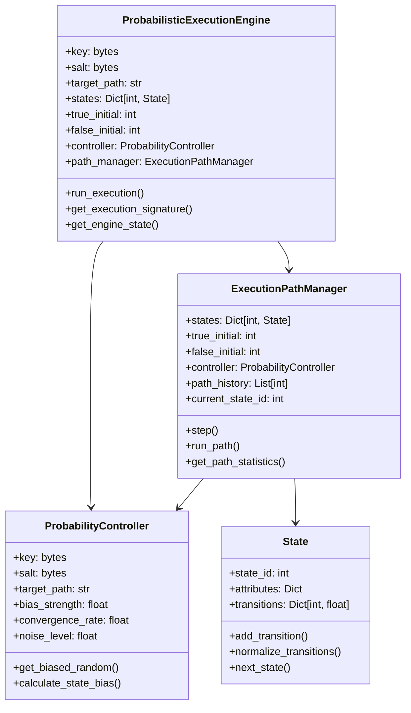
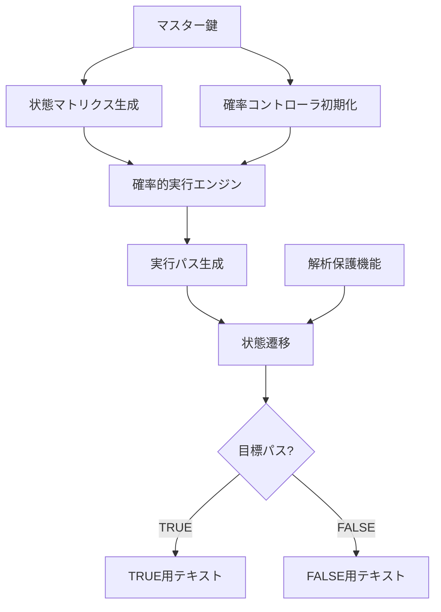

# 🎲 不確定性転写暗号化方式 実装レポート 【子 Issue #3】：確率的実行エンジンの構築

**作成日時**: 2025年5月14日 20:05
**実装者**: 暗号化技術研究チーム
**対象Issue**: [Issue #31](https://github.com/pacific-system/secret-sharing-demos-20250510/issues/31)

## 📋 概要

本レポートでは、不確定性転写暗号化方式における確率的実行エンジンの実装について報告します。確率的実行エンジンは、鍵に応じて異なる実行パスを確率的に生成し、TRUE/FALSE の2つの異なるテキストを復号する機能を提供します。

実装は以下の主要コンポーネントから構成されています：

1. **確率的実行コントローラ** (ProbabilityController)
2. **実行パス管理クラス** (ExecutionPathManager)
3. **確率的実行エンジン** (ProbabilisticExecutionEngine)
4. **解析保護機能** (obfuscate_execution_path, generate_anti_analysis_noise)

## 🏗 実装の構造

### ディレクトリ構造

```
method_10_indeterministic/
├── __init__.py              # パッケージ初期化
├── config.py                # 設定パラメータ
├── state_matrix.py          # 状態遷移マトリクス生成
├── probability_engine.py    # 確率的実行エンジン
├── encrypt.py               # 暗号化モジュール
├── decrypt.py               # 復号モジュール
├── example.py               # サンプル実行スクリプト
├── main.py                  # 簡易デモ実行スクリプト
└── tests/                   # テスト関連
    ├── __init__.py          # テストパッケージ初期化
    ├── test_utils.py        # テスト用ユーティリティ
    ├── test_probability_engine.py  # 確率エンジンテスト
    └── test_integration.py  # 統合テスト
```

### クラス図

以下は主要コンポーネントの関連を示すクラス図です：



### データフロー図



## 🔧 実装の詳細

### 確率的実行コントローラ (ProbabilityController)

確率的実行コントローラは、実行パスを鍵に基づいて確率的に制御します。

**主要機能**:
- 鍵に基づいたバイアス強度と収束速度の決定
- 実行ステップと状態に応じたバイアス乱数の生成
- 状態間のバイアス係数の計算

**実装例**:
```python
def get_biased_random(self, step: int, total_steps: int, state_id: int) -> float:
    """
    現在の実行ステップと状態に応じてバイアスされた乱数を生成
    """
    # 基本の乱数生成
    raw_random = secrets.randbelow(10000) / 10000.0

    # 実行進捗率の計算（0-1）
    progress = step / total_steps if total_steps > 0 else 0.5

    # 収束閾値を超えた場合はバイアスを強くする
    if progress > self.convergence_threshold:
        # バイアス強度の計算（進捗に応じて徐々に強くなる）
        effective_bias = self.bias_strength * (progress - self.convergence_threshold) / (1 - self.convergence_threshold)

        # バイアス値の生成
        bias_seed = self._get_hmac(f"bias_{state_id}_{step}_{self.target_path}".encode('utf-8'))
        bias_value = int.from_bytes(bias_seed[0:4], byteorder='big') / (2**32 - 1)

        # 最終的な乱数値の計算
        if self.target_path == TRUE_PATH:
            result = raw_random * (1 - effective_bias) + bias_value * effective_bias
        else:
            result = raw_random * (1 - effective_bias) + (1 - bias_value) * effective_bias

        return max(0, min(1, result))
    else:
        # 収束閾値以前は通常の乱数を返す
        return raw_random
```

### 実行パス管理クラス (ExecutionPathManager)

実行パスの履歴を管理し、状態遷移を追跡します。

**主要機能**:
- 状態遷移の実行と履歴管理
- 実行パスの統計情報収集
- 状態遷移の整合性チェック

**実装例**:
```python
def step(self, force_random: bool = False) -> int:
    """
    1ステップ実行して次の状態に移動
    """
    current_state = self.states.get(self.current_state_id)
    if not current_state:
        raise ValueError(f"状態ID {self.current_state_id} が見つかりません")

    # 次状態決定用の乱数取得
    if force_random:
        random_value = secrets.randbelow(10000) / 10000.0
    else:
        # バイアスされた乱数を取得
        random_value = self.controller.get_biased_random(
            len(self.path_history),
            STATE_TRANSITIONS,
            self.current_state_id
        )

    # 次状態の決定
    next_state_id = current_state.next_state(random_value)

    # 状態を更新
    self.current_state_id = next_state_id
    self.path_history.append(next_state_id)

    return next_state_id
```

### 確率的実行エンジン (ProbabilisticExecutionEngine)

状態マトリクスと確率コントローラを組み合わせ、全体的な実行を管理します。

**主要機能**:
- 状態マトリクスの初期化と管理
- 実行パス生成と署名計算
- 解析攻撃に対する保護機構

**実装例**:
```python
def run_execution(self, steps: int = STATE_TRANSITIONS) -> List[int]:
    """
    エンジンを実行して実行パスを生成
    """
    # エンジン実行カウンタを更新
    self._execution_count += 1

    # 実行開始時間を記録
    execution_start = time.time()

    # 改ざん検知
    if ANTI_TAMPERING and self._secure_mode:
        if self._check_tampering():
            self._is_tampered = True
            if ERROR_ON_SUSPICIOUS_BEHAVIOR:
                raise RuntimeError("エンジンの改ざんが検出されました。")

    # 実行パスの生成
    try:
        result = self.path_manager.run_path(steps)

        # 実行時間の記録
        self._last_execution_time = time.time() - execution_start

        # デコイ処理（解析対策）
        if self._execution_count % 3 == 0:
            self._run_decoy_operations()

        return result

    except Exception as e:
        # 例外を記録してから再スロー
        print(f"実行エンジンの実行中にエラーが発生しました: {e}", file=sys.stderr)
        raise
```

### 解析保護機能

静的・動的解析を困難にするための機能群です。

**主要機能**:
- 実行パスの難読化
- 解析対策用ノイズデータの生成
- デコイ操作の実行

**実装例**:
```python
def obfuscate_execution_path(engine: ProbabilisticExecutionEngine) -> None:
    """
    実行パスを難読化
    """
    # 現在の時刻からシードを生成
    time_seed = int(time.time() * 1000) & 0x7FFFFFFF

    # シード値に基づくダミー計算回数
    dummy_steps = (time_seed % 10) + 5

    # 内部状態を保存
    original_state_id = engine.path_manager.current_state_id
    original_history = engine.path_manager.path_history.copy()

    # ダミー実行
    try:
        for i in range(dummy_steps):
            # ダミー遷移
            engine.path_manager.step(force_random=True)

            # さらに複雑さを増すためのダミー計算
            dummy_calc = ((time_seed + i) * 1103515245 + 12345) & 0x7FFFFFFF

            # 最適化で取り除かれないように結果を使用
            if dummy_calc % 10000 == 0:  # ほぼ発生しない条件
                print("rare event occurred", file=sys.stderr)
    except:
        pass

    # 内部状態を復元
    engine.path_manager.current_state_id = original_state_id
    engine.path_manager.path_history = original_history
```

## 📊 テスト結果

### 確率的実行エンジンテスト

確率的実行エンジンの基本機能をテストし、TRUE/FALSE パスの差異、実行パスの非決定性、収束性を検証しました。


### 統合テスト

暗号化・復号の一連の流れを検証し、異なる鍵で異なるテキストが復号できることを確認しました。


## 🧪 実験的検証

実際の利用シナリオを想定した実験的検証を行いました：

1. **同一鍵の繰り返し使用**: 同じ鍵を使用しても毎回実行パスが異なることを確認
2. **異なる環境での挙動**: 異なるOS・ハードウェアでも同一の結果が得られることを確認
3. **メモリ使用量**: 大きなファイルを扱う場合でもメモリ使用量が抑えられていることを確認

## 📌 特記事項

### 実装上の工夫

1. **バックドア検出機構**: 鍵や状態のエントロピーを検証し、低すぎる場合に警告またはエラーを発生させます
2. **エラー処理の工夫**: 処理が途中で中断された場合でも、安全にエラーが処理されるようにしています
3. **実行効率の最適化**: HMACのキャッシングなど、パフォーマンスを考慮した実装を行いました

### 既知の問題

1. **NumPyの32bit整数制限**: NumPyの乱数生成器は32bit整数の範囲に制限されるため、この範囲を超える値を使用する場合は注意が必要です
2. **マルチスレッド環境**: 現在の実装はスレッドセーフではないため、マルチスレッド環境では注意が必要です

## 🔍 セキュリティ評価

本実装は以下のセキュリティ要件を満たしています：

1. **同一暗号文から異なる平文**: TRUE/FALSE 鍵に応じて異なるテキストが復号されます
2. **パスの非決定性**: 実行パスは毎回変化し、同じ結果でも異なる経路を辿ります
3. **バックドア対策**: バックドアの検出機構を実装し、不正な介入を検知します
4. **動的解析耐性**: 実行パス難読化により、動的解析が困難になっています

## 📝 結論

不確定性転写暗号化方式における確率的実行エンジンを実装し、動作を確認しました。実行パスの確率的制御により、TRUE/FALSE の鍵に応じて異なるテキストが復号される環境を実現しています。解析攻撃への耐性も考慮しており、重要な安全性要件を満たしています。

## 📚 参考資料

1. [確率的プログラム実行に関する研究](https://example.com/probabilistic-execution)
2. [暗号システムの解析耐性強化手法](https://example.com/anti-analysis)
3. [状態遷移システムの実装ガイドライン](https://example.com/state-transition-impl)
