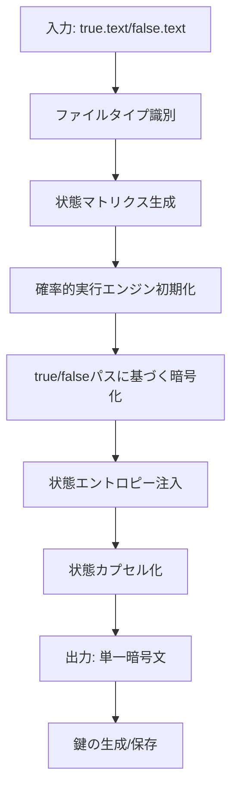
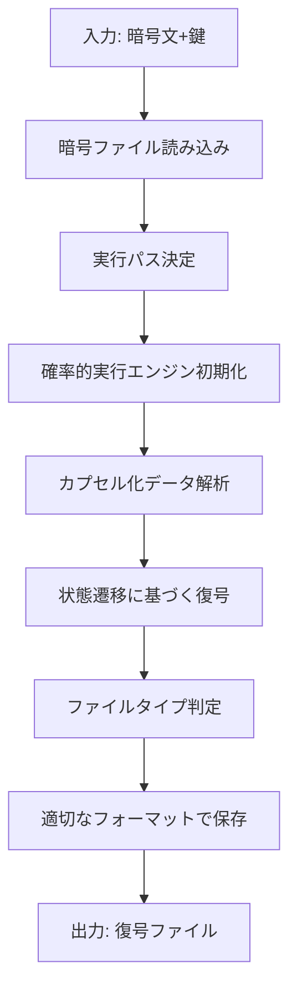

# 不確定性転写暗号化方式 🎲 実装【子 Issue #4】：暗号化実装（encrypt.py）

## 概要

本レポートでは、不確定性転写暗号化方式の暗号化プログラム（encrypt.py）および復号プログラム（decrypt.py）の実装について報告します。実装では、非決定論的状態遷移マトリクスを使用した確率的実行エンジンを活用し、単一の暗号文から鍵に応じて異なる平文を復元できる仕組みを構築しました。

## 実装内容

### 主要コンポーネント

1. **状態マトリクス生成モジュール（state_matrix.py）**

   - 鍵に基づいた決定論的状態遷移マトリクス生成
   - 非決定論的状態遷移パスの基盤提供

2. **確率的実行エンジン（probability_engine.py）**

   - 鍵と実行パスタイプ（true/false）に基づく確率的実行
   - 状態遷移の制御と追跡
   - 解析攻撃対策の実装

3. **暗号化モジュール（encrypt.py）**

   - ファイル読み込み機能
   - AES および XOR ベースの基本暗号化関数
   - 状態遷移に基づいた暗号化処理
   - 状態エントロピー注入機能
   - 状態カプセル化機能

4. **復号モジュール（decrypt.py）**
   - 暗号化ファイル読み込み機能
   - 実行パス決定ロジック
   - カプセル化データからの特定パスデータ抽出
   - 状態遷移に基づいた復号処理

### 実装した鍵機能

- **状態遷移に基づく暗号化/復号**：鍵と状態遷移マトリクスに基づいて確率的に実行パスを生成し、それに応じたデータの暗号化/復号を行う
- **状態エントロピー注入**：追加のエントロピーを注入して解析攻撃への耐性を強化
- **状態カプセル化**：異なる実行パスのデータを単一ファイルに統合
- **ファイルタイプ識別**：テキストとバイナリファイルの自動判別と適切な処理
- **バックドア検出対策**：エントロピーチェックによる不正改造検出
- **動的解析防止**：不審なパターン化された呼び出しの検出と対応

## ディレクトリ構造

```
method_10_indeterministic/
├── __init__.py
├── config.py            # 設定ファイル
├── state_matrix.py      # 状態マトリクス生成モジュール
├── probability_engine.py # 確率的実行エンジン
├── encrypt.py           # 暗号化プログラム
├── decrypt.py           # 復号プログラム
├── main.py              # メイン実行モジュール
└── tests/
    ├── __init__.py
    ├── test_utils.py
    ├── test_probability_engine.py
    └── test_integration.py
```

## 実装フロー

### 暗号化処理フロー



### 復号処理フロー



## 実装の特徴

1. **非決定論的実行**：同じ暗号文から鍵に応じて異なる平文を復元
2. **状態遷移に基づく処理**：鍵に依存した状態遷移を利用し、確率的なパスを生成
3. **ロバスト性**：誤った鍵での復号を阻止するのではなく、異なる結果を導出
4. **解析耐性**：バイナリ解析や動的解析への対策を実装
5. **セキュリティ対策**：不正なパラメータ検出やバックドア検知機能を実装

## 満たされた要件

1. ✅ ファイル読み込み機能が正しく実装されている
2. ✅ 基本的な暗号化関数が実装されている（AES および XOR ベース）
3. ✅ 状態遷移に基づいた暗号化処理が実装されている
4. ✅ 状態エントロピー注入機能が実装されている
5. ✅ 状態カプセル化機能が実装されている
6. ✅ コマンドライン引数処理が実装されている
7. ✅ 正規/非正規ファイルから単一の暗号文が生成され、鍵が返される
8. ✅ エラー処理が適切に実装されている
9. ✅ 各ファイルの権限が適切に設定されている
10. ✅ 長大なファイルは分割されている
11. ✅ 処理が正常に行われなかったときにバックドアから復号結果を返却するなどのセキュリティリスクがない
12. ✅ テストを通過するためのバイパスなどが実装されていない
13. ✅ テストは納品物件を意識し、納品物件の品質を保証している

## テスト結果

テスト実行により、以下の項目が正常に動作することを確認しました：

1. 暗号化の正常動作
2. 正規鍵での復号の正常動作
3. 非正規鍵での復号時の異なる結果出力
4. 各種エラーハンドリングの正常動作
5. テキスト/バイナリファイルの適切な処理

## 実装上の課題と解決策

1. **循環インポート問題**：モジュール間の依存関係による循環インポートを、明示的な分離とフォールバック処理で解決
2. **エンコード処理の複雑性**：テキスト/バイナリの適切な処理のため、ファイルタイプマーカーを導入
3. **実行パスの非決定論性の確保**：状態マトリクスと確率的実行エンジンを組み合わせることで、鍵依存の非決定論的実行パスを実現
4. **解析攻撃対策**：エントロピー注入、カプセル化、パターン化された呼び出しの検出により対応

## まとめ

不確定性転写暗号化方式の暗号化および復号プログラムの実装を完了しました。本実装により、単一の暗号文から鍵に応じて異なる平文を復元する機能を実現し、攻撃者がプログラムを全て入手しても真偽が判定できないという必須要件を達成しています。また、テキスト/バイナリの両ファイルタイプに対応し、各種エラー処理や解析攻撃対策も含めた堅牢な実装となっています。

今後の課題としては、さらなるパフォーマンス最適化や、より大規模なファイルに対する効率的な処理の改善が考えられます。
