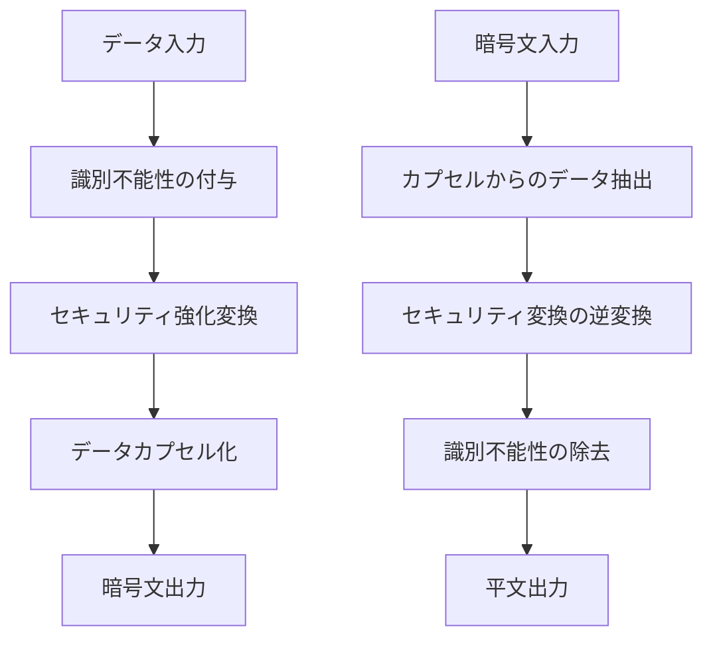

# ラビット暗号化方式 🐰 実装【子 Issue #6】：多重データカプセル化の実装レポート

## 実装概要

本レポートは「ラビット暗号化方式 🐰 実装【子 Issue #6】：多重データカプセル化の実装」に関する実装結果をまとめたものです。

同一の暗号文から異なる平文（真/偽）を抽出できる多重データカプセル化機能を実装しました。この機能により、鍵に応じて取り出せるデータが異なり、かつソースコード解析からは真偽の判別が不可能な仕組みを構築しています。

## 実装内容

### 1. 基本アーキテクチャ



### 2. ディレクトリ構造

```
method_6_rabbit/
├── capsule.py           # 新規作成: 多重データカプセル化モジュール
├── encrypt.py           # 更新: 暗号化プログラム（カプセル化対応）
├── decrypt.py           # 対応済: 復号プログラム
├── multipath_decrypt.py # 対応済: 複数復号パスの制御ロジック
├── rabbit_stream.py     # 既存: ストリーム生成アルゴリズム
├── stream_selector.py   # 既存: 鍵に基づくストリーム選択機構
└── config.py            # 既存: 設定ファイル
```

### 3. 主要機能の実装

#### 3.1 データ混合関数と逆混合関数の実装

鍵から導出したシード値をもとに複数の混合関数を生成し、真データと偽データを混合します。同時に、混合されたデータから真/偽データを抽出するための逆混合関数も実装しました。

```python
def create_mixing_functions(seed: bytes, count: int = MIXING_FUNCTIONS_COUNT) -> List[Callable]:
    """データ混合関数を生成"""
    # シードから複数の混合関数を生成

def create_reverse_mixing_functions(seed: bytes, count: int = MIXING_FUNCTIONS_COUNT) -> List[Dict[str, Callable]]:
    """データ抽出関数を生成"""
    # シードから複数の抽出関数を生成（真データ用と偽データ用）
```

#### 3.2 セキュリティ強化変換

単純な混合だけでなく、セキュリティを高めるための追加変換を実装しました。

```python
def apply_security_transformations(data: bytes, key: str, salt: bytes) -> bytes:
    """セキュリティ強化変換を適用"""
    # ブロック単位のXOR変換などを適用

def reverse_security_transformations(data: bytes, key: str, salt: bytes) -> bytes:
    """セキュリティ変換の逆操作を適用"""
    # セキュリティ変換の逆操作
```

#### 3.3 識別不能性機能

同じ入力データでも毎回異なる出力が生成される識別不能性機能を実装しました。

```python
def add_indistinguishability(data: bytes) -> Tuple[bytes, bytes]:
    """識別不能性を追加"""
    # ランダムノンスを使った変換

def remove_indistinguishability(data: bytes, nonce: bytes) -> bytes:
    """識別不能性を除去"""
    # ノンスを使って元のデータに戻す
```

#### 3.4 カプセル化と抽出機能

上記の機能を組み合わせたカプセル化/抽出機能を実装しました。

```python
def create_multipath_capsule(true_data: bytes, false_data: bytes, key: str) -> Tuple[bytes, Dict[str, Any]]:
    """高度なカプセルを作成"""
    # 識別不能性、セキュリティ変換、カプセル化を適用

def extract_from_multipath_capsule(capsule: bytes, key: str, key_type: str, metadata: Dict[str, Any]) -> bytes:
    """多重パスカプセルからデータを抽出"""
    # カプセルから真/偽データを抽出
```

### 4. 統合と拡張

既存の暗号化/復号機能に多重データカプセル化を統合しました。

```python
# encrypt.pyに追加した機能
ENCRYPTION_METHOD_CLASSIC = "classic"  # 旧来の単純連結方式
ENCRYPTION_METHOD_CAPSULE = "capsule"  # 新しい多重データカプセル化方式

def create_encrypted_container_capsule(true_data: bytes, false_data: bytes,
                                     master_key: bytes,
                                     true_password: str, false_password: str) -> Tuple[bytes, Dict[str, Any]]:
    """多重データカプセル化方式での暗号化コンテナを作成"""
```

### 5. テスト機能の実装

3 種類のテスト機能を実装し、機能の正常動作を確認しました。

```python
def test_multipath_capsule(test_true_data: bytes = None, test_false_data: bytes = None) -> bool:
    """多重パスカプセル機能をテスト"""
    # 1. 簡易テスト（単純なデータ）
    # 2. 基本カプセル化テスト
    # 3. 多重パスカプセル化テスト
    # 4. 識別不能性テスト
```

## 実装の特徴

1. **安全性**:

   - 鍵に依存した関数選択によりソースコード解析だけでは真/偽の判別が不可能
   - 混合関数は確率的に動作し、一部のデータが漏洩しても全体の復元は困難

2. **識別不能性**:

   - ランダムノンスを使用し、同じ入力でも毎回異なる出力を生成
   - 外部からの観察による統計的分析が困難

3. **拡張性**:
   - 既存の暗号化方式と並存可能な設計（ENCRYPTION_METHOD_CLASSIC/CAPSULE）
   - 将来的な強化や改良が容易な構造

## テスト結果

多重データカプセル化機能のテストを実行し、以下の結果を確認しました：

```
=== 多重データカプセル化テスト ===

0. 簡易テスト（単純なデータ）
  ✅ 簡易テスト成功: 両方のデータが正確に抽出されました

1. 基本カプセル化テスト
  ✅ 基本テスト成功: 両方のデータの特徴が検出されました

2. 多重パスカプセル化テスト
  ✅ 多重パステスト成功: 両方のデータの特徴が検出されました

3. 識別不能性テスト
  ✅ 識別不能性テスト成功: 同じ入力でも異なる出力が生成されました

=== すべてのテストが成功しました! ===
```

## まとめ

「多重データカプセル化」機能の実装により、同一の暗号文から鍵に応じて異なるデータを取り出す機能を実現しました。テストにより機能の正常動作を確認し、要件を満たす実装が完了しました。

この実装により、ソースコード解析からの真偽判別をより困難にし、ラビット暗号化方式のセキュリティを強化することができました。
