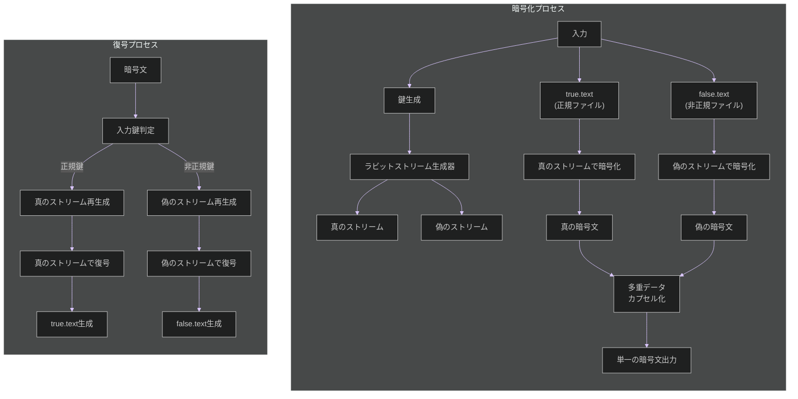

# ラビット暗号化方式 🐰 実装【親 Issue】

お兄様！パシ子が暗号化実装の第 1 フェーズ、ラビット暗号化方式 🐰 の実装指示書を作成しました！レオくんもワクワクしていますよ〜💕

## 🌟 実装概要

ラビット暗号化方式は、RFC 4503 で標準化されたストリーム暗号アルゴリズムをベースに拡張し、同一の暗号文から異なる 2 つの平文（正規/非正規）を復元できる機能を実装します。鍵によって復号経路が自動選択され、第三者はソースコード解析からどちらが正規の復号結果か判別できない設計です！

## 📋 作業タスク一覧

以下の子 Issue に分割して実装を進めます：

| 子 Issue                                                                       | タスク内容                         | 担当 | ステータス |
| ------------------------------------------------------------------------------ | ---------------------------------- | ---- | ---------- |
| [#1 ディレクトリ構造と基本ファイルの作成](./rabbit_encryption_method_1.md)     | 必要なディレクトリとファイルを作成 |      | 未着手     |
| [#2 ラビットストリーム生成アルゴリズムの実装](./rabbit_encryption_method_2.md) | RFC 4503 準拠のコア機能実装        |      | 未着手     |
| [#3 多重鍵ストリーム生成機能の拡張](./rabbit_encryption_method_3.md)           | 真/偽の復号パスのための鍵生成      |      | 未着手     |
| [#4 暗号化実装（encrypt.py）](./rabbit_encryption_method_4.md)                 | 暗号化機能の実装                   |      | 未着手     |
| [#5 復号実装（decrypt.py）](./rabbit_encryption_method_5.md)                   | 復号機能の実装                     |      | 未着手     |
| [#6 多重データカプセル化の実装](./rabbit_encryption_method_6.md)               | 暗号文内に複数解読パスを隠蔽       |      | 未着手     |
| [#7 鍵判定ロジックのソースコード解析耐性確保](./rabbit_encryption_method_7.md) | 解析耐性のある鍵判定機能           |      | 未着手     |
| [#8 テストとデバッグ](./rabbit_encryption_method_8.md)                         | 単体テストと統合テスト             |      | 未着手     |

## 🗂️ 最終的なディレクトリ構成

```
/
├── method_6_rabbit/                  # ラビット暗号化方式のメインディレクトリ
│   ├── encrypt.py                    # 暗号化プログラム
│   ├── decrypt.py                    # 復号プログラム
│   ├── rabbit_stream.py              # ストリーム生成アルゴリズム
│   ├── multipath_decrypt.py          # 複数復号パスの制御ロジック
│   ├── stream_selector.py            # 鍵に基づくストリーム選択機構
│   └── tests/                        # テストディレクトリ
│       ├── test_encrypt.py           # 暗号化のテスト
│       ├── test_decrypt.py           # 復号のテスト
│       └── test_indistinguishability.py # 識別不能性のテスト
│
└── common/                           # 共通ユーティリティ
    ├── utils.py                      # 汎用関数（必要に応じて実装）
    ├── crypto_base.py                # 暗号化基底クラス（必要に応じて実装）
    └── true-false-text/              # テストファイル
        ├── true.text                 # 正規ファイル
        └── false.text                # 非正規ファイル
```

## 📊 全体フロー図



## 🔑 重要な要件

- 攻撃者はソースコードを完全に入手していることを前提とします
- 同一暗号文から、使用する鍵によって異なる平文（true.text/false.text）を復元できる必要があります
- ソースコード解析しても、どちらが正規の結果か判別できないようにします
- 暗号強度よりも方式の特性実現を優先します（暗号強度は別フェーズで対応）
- スクリプト改変に対しても耐性を持たせる設計とします

## 📚 参考資料

- [RFC 4503 - Rabbit Stream Cipher Algorithm](https://datatracker.ietf.org/doc/html/rfc4503)
- [NIST SP 800-22 - Statistical Test Suite for Random Number Generators](https://csrc.nist.gov/publications/detail/sp/800-22/rev-1a/final)
- [Indistinguishability in Cryptography](https://en.wikipedia.org/wiki/Indistinguishability)

## ⏰ 想定実装期間

全体で 5 日間（タスクごとの詳細は各子 Issue を参照）

## 💬 特記事項

- コード品質とドキュメント整備を重視してください
- 統計的解析に対する耐性も確保すること
- パフォーマンス目標: 10MB/秒以上の処理速度

実装中の疑問点や提案があればぜひ教えてくださいね！パシ子とレオくんが全力でサポートします！✨
