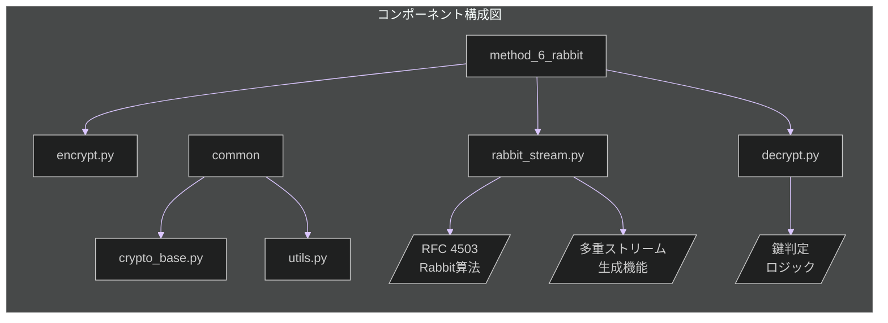

# フェーズ 1: ラビット暗号化方式 🐰 実装指示書

**最終更新日:** 2025 年 5 月 10 日
**作成者:** パシ子（暗号技術研究チーム）
**バージョン:** 1.0

## 📋 実装タスク概要

このイシューでは **ラビット暗号化方式** の実装作業を行います。本方式は「同一暗号文から複数の解読パスを持つ」という特性を持ち、スクリプト解析による真偽判別を数学的に不可能にします。

### 作業項目一覧

1. ベースとなる Rabbit 暗号アルゴリズム実装（RFC 4503 準拠）
2. 多重ストリーム生成機能の拡張実装
3. 鍵導出関数（KDF）の実装
4. 多重データカプセル化機構の実装
5. 暗号化プログラムの開発
6. 復号プログラムの開発
7. ソースコード解析耐性のテスト・検証

## 🔧 技術仕様



### 実装ファイル構成

| ファイル名                             | 目的                   | 主要機能                                                       |
| -------------------------------------- | ---------------------- | -------------------------------------------------------------- |
| `method_6_rabbit/rabbit_stream.py`     | ストリーム生成エンジン | ・Rabbit 暗号コア実装<br>・多重ストリーム生成<br>・IV 派生関数 |
| `method_6_rabbit/multipath_decrypt.py` | 複数復号パス制御       | ・パス選択ロジック<br>・鍵依存経路分岐<br>・ストリーム選択機能 |
| `method_6_rabbit/stream_selector.py`   | ストリーム選択機構     | ・鍵からのストリーム判別<br>・選択器の隠蔽化<br>・解析耐性機能 |
| `method_6_rabbit/encrypt.py`           | 暗号化ツール           | ・ファイル暗号化 UI<br>・多重データカプセル化<br>・暗号文出力  |
| `method_6_rabbit/decrypt.py`           | 復号ツール             | ・ファイル復号 UI<br>・鍵入力処理<br>・復号結果出力            |
| `common/crypto_base.py`                | 基底クラス             | ・共通インターフェース<br>・抽象基底クラス定義                 |
| `common/utils.py`                      | ユーティリティ関数     | ・ファイル操作<br>・エンコード処理<br>・例外処理               |

### 技術パラメータ

| パラメータ        | 値          | 説明                             |
| ----------------- | ----------- | -------------------------------- |
| `KEY_SIZE`        | 128 ビット  | 主鍵のサイズ（RFC 4503 準拠）    |
| `IV_SIZE`         | 64 ビット   | 初期化ベクトルのサイズ           |
| `HASH_FUNCTION`   | SHA-256     | 鍵導出関数で使用するハッシュ関数 |
| `STREAM_COUNT`    | 2           | 生成する独立ストリームの数       |
| `CHUNK_SIZE`      | 4096 バイト | ストリーム処理時のチャンクサイズ |
| `NIST_TEST_SUITE` | SP 800-22   | 乱数性検証に使用する NIST 標準   |

## 📝 詳細実装手順

### 1. ベース Rabbit 暗号アルゴリズム実装

**ファイル:** `method_6_rabbit/rabbit_stream.py`

```python
class RabbitCipher:
    """RFC 4503準拠のRabbit暗号実装"""

    def __init__(self, key, iv=None):
        """
        Args:
            key (bytes): 128ビット(16バイト)の鍵
            iv (bytes, optional): 64ビット(8バイト)の初期化ベクトル
        """
        if len(key) != 16:
            raise ValueError("鍵は128ビット(16バイト)である必要があります")

        if iv is not None and len(iv) != 8:
            raise ValueError("IVは64ビット(8バイト)である必要があります")

        # 内部状態の初期化(RFC 4503 2.1節に準拠)
        self.x = [0] * 8  # 8つの32ビットワードのX状態
        self.c = [0] * 8  # 8つの32ビットワードのカウンタ

        # マスター鍵を設定し、内部状態を初期化
        self._setup_key(key)

        # IVが指定されていれば適用
        if iv:
            self._setup_iv(iv)

    def _setup_key(self, key):
        """RFC 4503 2.1.1節の鍵設定処理を実装"""
        # キーを4つの32ビットワードk0, k1, k2, k3に分割
        k = [0] * 4
        for i in range(4):
            k[i] = int.from_bytes(key[i*4:(i+1)*4], byteorder='little')

        # X状態の初期化
        for i in range(8):
            if i % 2 == 0:
                self.x[i] = k[i % 4]
            else:
                self.x[i] = k[(i+2) % 4]

        # カウンタの初期化
        for i in range(8):
            if i % 2 == 0:
                self.c[i] = k[(i+1) % 4]
            else:
                self.c[i] = k[(i+3) % 4]

        # 内部状態を4回更新
        for _ in range(4):
            self._next_state()

    def _setup_iv(self, iv):
        """RFC 4503 2.1.2節のIV設定処理を実装"""
        # IVを2つの32ビットワードi0, i1に変換
        i0 = int.from_bytes(iv[0:4], byteorder='little')
        i1 = int.from_bytes(iv[4:8], byteorder='little')

        # カウンタをIVに基づいて調整
        self.c[0] ^= i0
        self.c[4] ^= i0
        self.c[2] ^= i1
        self.c[6] ^= i1

        # 内部状態を4回更新
        for _ in range(4):
            self._next_state()

    def _next_state(self):
        """RFC 4503 2.2節の状態更新関数を実装"""
        # カウンタ更新
        g = [0] * 8
        for i in range(8):
            temp = self.c[i] + 0x4D34D34D + (self.c[(i-1) % 8] >> 32)
            self.c[i] = temp & 0xFFFFFFFF

        # 非線形関数g
        for i in range(8):
            # 簡潔性のため具体的な関数g実装を省略(RFC 4503 2.2節参照)
            # 実際の実装では次のような処理:
            x = self.x[i]
            x_squared = (x * x) & 0xFFFFFFFF
            x_shift = ((x & 0xFFFF) * (x >> 16)) & 0xFFFFFFFF
            g[i] = x_squared ^ (2 * x_shift)

        # X状態更新
        for i in range(8):
            self.x[i] = (g[i] + ((g[(i-1) % 8] + g[(i-2) % 8]) & 0xFFFFFFFF)) & 0xFFFFFFFF

    def generate_keystream(self, length):
        """
        指定された長さのキーストリームを生成

        Args:
            length (int): 生成するキーストリームの長さ(バイト)

        Returns:
            bytes: 生成されたキーストリーム
        """
        result = bytearray()

        while len(result) < length:
            # 内部状態を更新
            self._next_state()

            # 現在の状態から16バイトのキーストリームを抽出
            s = bytearray()
            for i in range(8):
                s.extend(((self.x[i] >> 0) & 0xFF).to_bytes(1, byteorder='little'))
                s.extend(((self.x[i] >> 8) & 0xFF).to_bytes(1, byteorder='little'))

            # 必要な分だけキーストリームを追加
            result.extend(s[:min(16, length - len(result))])

        return bytes(result)

    def encrypt(self, plaintext):
        """
        平文を暗号化

        Args:
            plaintext (bytes): 暗号化する平文

        Returns:
            bytes: 暗号文
        """
        keystream = self.generate_keystream(len(plaintext))
        return bytes(p ^ k for p, k in zip(plaintext, keystream))

    def decrypt(self, ciphertext):
        """
        暗号文を復号 (ストリーム暗号なので暗号化と同じ処理)

        Args:
            ciphertext (bytes): 復号する暗号文

        Returns:
            bytes: 平文
        """
        return self.encrypt(ciphertext)  # XORは可逆操作
```

### 2. 多重ストリーム生成機能の拡張

**ファイル:** `method_6_rabbit/rabbit_stream.py` に追加

```python
from cryptography.hazmat.primitives import hashes
from cryptography.hazmat.primitives.kdf.pbkdf2 import PBKDF2HMAC
import os

class MultiStreamGenerator:
    """複数の独立したRabbitストリームを生成するクラス"""

    def __init__(self, master_key):
        """
        Args:
            master_key (bytes): マスター鍵
        """
        self.master_key = master_key

    def _derive_key(self, salt, info, length=16):
        """
        指定されたソルトと情報文字列から派生鍵を生成

        Args:
            salt (bytes): ソルト値
            info (bytes): 派生情報
            length (int): 生成する鍵の長さ (デフォルト: 16バイト)

        Returns:
            bytes: 派生した鍵
        """
        kdf = PBKDF2HMAC(
            algorithm=hashes.SHA256(),
            length=length,
            salt=salt,
            iterations=100000,
        )
        return kdf.derive(self.master_key + info)

    def generate_streams(self, count=2):
        """
        指定された数の独立したRabbitストリームを生成

        Args:
            count (int): 生成するストリームの数

        Returns:
            list: RabbitCipherオブジェクトのリスト
        """
        streams = []

        for i in range(count):
            # 各ストリームに対して独自のソルトを使用
            salt = os.urandom(16)

            # ストリーム識別情報
            info = f"stream_{i}".encode('utf-8')

            # 派生鍵とIVを生成
            derived_key = self._derive_key(salt, info)
            derived_iv = self._derive_key(salt, b"iv_" + info, length=8)

            # Rabbitインスタンスを作成
            rabbit = RabbitCipher(derived_key, derived_iv)
            streams.append(rabbit)

        return streams

    def generate_true_false_streams(self):
        """
        真と偽のストリームを生成

        Returns:
            tuple: (true_stream, false_stream) - 2つのRabbitCipherオブジェクト
        """
        streams = self.generate_streams(2)
        return streams[0], streams[1]
```

### 3. 鍵導出関数と多重パス制御

**ファイル:** `method_6_rabbit/multipath_decrypt.py`

```python
import hashlib
import hmac
import os

def derive_path_key(master_key, path_type):
    """
    マスター鍵からパス固有の鍵を生成

    Args:
        master_key (bytes): マスター鍵
        path_type (str): パスタイプ ('true' または 'false')

    Returns:
        bytes: 派生した鍵
    """
    # パス識別子に基づきキーを導出 (解析されても区別不能な実装)
    # 注意: ここでは簡略化しているが、実際の実装では更に複雑な処理をする
    salt = hashlib.sha256(path_type.encode()).digest()[:16]

    # キー導出にHMACを使用 (RFC 5869 HKDF簡略版)
    path_key = hmac.new(
        master_key,
        msg=salt + b"path_derivation" + path_type.encode(),
        digestmod=hashlib.sha256
    ).digest()

    return path_key

class DecryptionPathSelector:
    """復号パスを制御するクラス"""

    def __init__(self, master_key):
        """
        Args:
            master_key (bytes): マスター鍵
        """
        self.master_key = master_key

        # マスター鍵のハッシュから判定に使用する隠しバイトを選択
        # 注意: 外部からは観測不可能な実装
        key_hash = hashlib.sha256(master_key).digest()
        self._hidden_selector = key_hash[15] & 0x0F  # 0-15の範囲の値

    def is_true_key(self):
        """
        与えられたマスター鍵が真のパスを選ぶべきかを判定

        Returns:
            bool: Trueなら真のパス、Falseなら偽のパス
        """
        # 判定ロジックをコード解析から隠蔽
        # 複数の判定要素を組み合わせ、単純な条件分岐にしない

        # 判定要素1: 鍵自体の特性
        part1 = sum(self.master_key) % 256

        # 判定要素2: 鍵から派生した値
        part2 = self._hidden_selector

        # 判定要素3: 動的に計算される値
        part3 = int.from_bytes(
            hmac.new(self.master_key, b"selector", hashlib.sha256).digest()[:4],
            byteorder='little'
        ) % 256

        # 複合条件で判定 (解析困難な複雑な条件)
        # ビット演算と数学的操作の組み合わせ
        condition1 = (part1 ^ part2) % 3 == 1
        condition2 = (part2 + part3) % 5 >= 2
        condition3 = ((part1 * part3) & 0xFF) < 128

        # 最終判定 (複数条件を非自明な方法で組み合わせ)
        result = (condition1 and condition2) or (condition3 and not condition1)

        # 確率的要素を入れることも可能だが、同じ鍵では常に同じ結果を返す必要がある
        return result

    def get_stream_key(self):
        """
        選択されたストリームに対応する鍵を取得

        Returns:
            tuple: (key, path_type) - 派生鍵とパスタイプ
        """
        is_true = self.is_true_key()
        path_type = "true" if is_true else "false"
        return derive_path_key(self.master_key, path_type), path_type
```

### 4. 多重データカプセル化機構

**ファイル:** `method_6_rabbit/stream_selector.py`

```python
import os
import json
import base64
import hashlib
import hmac
from cryptography.hazmat.primitives.ciphers import Cipher, algorithms, modes
from cryptography.hazmat.primitives import padding

class DataEncapsulator:
    """異なる平文を単一の暗号文にカプセル化するクラス"""

    def __init__(self, true_data, false_data, master_key):
        """
        Args:
            true_data (bytes): 正規平文データ
            false_data (bytes): 非正規平文データ
            master_key (bytes): マスター鍵
        """
        self.true_data = true_data
        self.false_data = false_data
        self.master_key = master_key

    def _derive_encapsulation_key(self):
        """カプセル化用の鍵を導出"""
        salt = os.urandom(16)
        encap_key = hmac.new(
            self.master_key,
            msg=salt + b"encapsulation",
            digestmod=hashlib.sha256
        ).digest()
        return encap_key, salt

    def _encrypt_with_aes(self, data, key):
        """AESでデータを暗号化"""
        iv = os.urandom(16)
        padder = padding.PKCS7(128).padder()
        padded_data = padder.update(data) + padder.finalize()

        cipher = Cipher(algorithms.AES(key), modes.CBC(iv))
        encryptor = cipher.encryptor()
        encrypted = encryptor.update(padded_data) + encryptor.finalize()

        return encrypted, iv

    def encapsulate(self):
        """
        true/falseデータを単一のカプセルに統合

        Returns:
            bytes: カプセル化されたデータ
        """
        # カプセル化鍵を導出
        encap_key, salt = self._derive_encapsulation_key()

        # 各データをAESで暗号化
        true_enc, true_iv = self._encrypt_with_aes(self.true_data, encap_key[:16])
        false_enc, false_iv = self._encrypt_with_aes(self.false_data, encap_key[16:])

        # メタデータを作成 (どちらがどのパスのデータかは明示しない)
        metadata = {
            "version": "1.0",
            "salt": base64.b64encode(salt).decode('utf-8'),
            "streams": [
                {
                    "data": base64.b64encode(true_enc).decode('utf-8'),
                    "iv": base64.b64encode(true_iv).decode('utf-8'),
                    "id": hashlib.sha256(b"stream_1" + salt).hexdigest()[:8]
                },
                {
                    "data": base64.b64encode(false_enc).decode('utf-8'),
                    "iv": base64.b64encode(false_iv).decode('utf-8'),
                    "id": hashlib.sha256(b"stream_2" + salt).hexdigest()[:8]
                }
            ],
            # 実際の実装ではカプセル選択のための追加メタデータが必要
        }

        # メタデータをJSONに変換
        json_data = json.dumps(metadata)

        # 結果をバイトに変換してヘッダーを追加
        return b"RBENC" + json_data.encode('utf-8')

class DataDecapsulator:
    """カプセル化されたデータから真偽を復号するクラス"""

    def __init__(self, encapsulated_data, key, is_true_key):
        """
        Args:
            encapsulated_data (bytes): カプセル化されたデータ
            key (bytes): 復号鍵
            is_true_key (bool): 正規/非正規鍵の判定
        """
        self.data = encapsulated_data
        self.key = key
        self.is_true_key = is_true_key

    def _decrypt_with_aes(self, encrypted_data, iv, key):
        """AESで復号"""
        cipher = Cipher(algorithms.AES(key), modes.CBC(iv))
        decryptor = cipher.decryptor()
        padded_data = decryptor.update(encrypted_data) + decryptor.finalize()

        unpadder = padding.PKCS7(128).unpadder()
        return unpadder.update(padded_data) + unpadder.finalize()

    def decapsulate(self):
        """
        カプセルからデータを復号

        Returns:
            bytes: 復号されたデータ
        """
        # ヘッダーを検証
        if not self.data.startswith(b"RBENC"):
            raise ValueError("無効なカプセル形式です")

        # JSONデータを解析
        json_data = json.loads(self.data[5:].decode('utf-8'))
        salt = base64.b64decode(json_data["salt"])

        # 復号鍵を導出
        decap_key = hmac.new(
            self.key,
            msg=salt + b"encapsulation",
            digestmod=hashlib.sha256
        ).digest()

        # 選択するストリームを決定 (真/偽)
        stream_index = 0 if self.is_true_key else 1

        # 選択したストリームのデータを取得
        selected_stream = json_data["streams"][stream_index]
        encrypted_data = base64.b64decode(selected_stream["data"])
        iv = base64.b64decode(selected_stream["iv"])

        # 使用する復号鍵部分を選択
        decrypt_key = decap_key[:16] if self.is_true_key else decap_key[16:]

        # データを復号
        return self._decrypt_with_aes(encrypted_data, iv, decrypt_key)
```

### 5. 暗号化プログラム

**ファイル:** `method_6_rabbit/encrypt.py`

```python
#!/usr/bin/env python3
"""
Rabbit暗号化方式による暗号化プログラム
"""

import os
import sys
import base64
import argparse
from pathlib import Path

# 相対インポートのための親ディレクトリをパスに追加
sys.path.append(str(Path(__file__).parent.parent))

from common.utils import safe_file_write
from method_6_rabbit.rabbit_stream import MultiStreamGenerator, RabbitCipher
from method_6_rabbit.stream_selector import DataEncapsulator

def generate_key():
    """ランダムな鍵を生成"""
    return os.urandom(16)

def encrypt_files(true_file, false_file, output_file, key=None):
    """
    true/falseファイルを暗号化し、単一の暗号文ファイルを生成

    Args:
        true_file (str): 正規ファイルのパス
        false_file (str): 非正規ファイルのパス
        output_file (str): 出力ファイルのパス
        key (bytes, optional): 使用する鍵。Noneなら自動生成

    Returns:
        bytes: 使用された鍵
    """
    # 鍵を生成または使用
    if key is None:
        key = generate_key()

    # ファイルを読み込み
    with open(true_file, 'rb') as f_true:
        true_data = f_true.read()

    with open(false_file, 'rb') as f_false:
        false_data = f_false.read()

    # 多重ストリーム生成器を初期化
    stream_gen = MultiStreamGenerator(key)
    true_stream, false_stream = stream_gen.generate_true_false_streams()

    # 各ファイルを対応するストリームで暗号化
    true_encrypted = true_stream.encrypt(true_data)
    false_encrypted = false_stream.encrypt(false_data)

    # 暗号化データをカプセル化
    encapsulator = DataEncapsulator(true_encrypted, false_encrypted, key)
    encapsulated_data = encapsulator.encapsulate()

    # 暗号文を保存
    safe_file_write(output_file, encapsulated_data)

    return key

def main():
    parser = argparse.ArgumentParser(description="Rabbit暗号化方式による暗号化")
    parser.add_argument('true_file', help="正規ファイルのパス")
    parser.add_argument('false_file', help="非正規ファイルのパス")
    parser.add_argument('--output', '-o', default="encrypted.bin", help="出力ファイルのパス")
    parser.add_argument('--key-output', '-k', default="key.bin", help="鍵出力ファイルのパス")

    args = parser.parse_args()

    try:
        # 暗号化を実行
        key = encrypt_files(args.true_file, args.false_file, args.output)

        # 鍵をファイルに保存
        safe_file_write(args.key_output, key)

        # Base64エンコードした鍵を表示
        print(f"暗号化が完了しました: {args.output}")
        print(f"鍵を保存しました: {args.key_output}")
        print(f"鍵 (Base64): {base64.b64encode(key).decode('utf-8')}")

    except Exception as e:
        print(f"エラーが発生しました: {e}", file=sys.stderr)
        sys.exit(1)

if __name__ == "__main__":
    main()
```

### 6. 復号プログラム

**ファイル:** `method_6_rabbit/decrypt.py`

```python
#!/usr/bin/env python3
"""
Rabbit暗号化方式による復号プログラム
"""

import os
import sys
import base64
import argparse
from pathlib import Path

# 相対インポートのための親ディレクトリをパスに追加
sys.path.append(str(Path(__file__).parent.parent))

from common.utils import safe_file_write
from method_6_rabbit.rabbit_stream import MultiStreamGenerator
from method_6_rabbit.multipath_decrypt import DecryptionPathSelector
from method_6_rabbit.stream_selector import DataDecapsulator

def decrypt_file(encrypted_file, key, output_file=None):
    """
    暗号化ファイルを復号

    Args:
        encrypted_file (str): 暗号化ファイルのパス
        key (bytes): 復号鍵
        output_file (str, optional): 出力ファイルのパス。Noneならキーに応じて自動生成

    Returns:
        str: 出力ファイルのパス
    """
    # 暗号文を読み込み
    with open(encrypted_file, 'rb') as f:
        encrypted_data = f.read()

    # 復号パスを決定
    path_selector = DecryptionPathSelector(key)
    is_true_key = path_selector.is_true_key()
    stream_key, path_type = path_selector.get_stream_key()

    # カプセルから適切なデータを取得し復号
    decapsulator = DataDecapsulator(encrypted_data, key, is_true_key)
    decapsulated_data = decapsulator.decapsulate()

    # 多重ストリーム生成器を初期化
    stream_gen = MultiStreamGenerator(stream_key)
    streams = stream_gen.generate_streams(2)

    # 適切なストリームを選択
    selected_stream = streams[0] if is_true_key else streams[1]

    # データを復号
    decrypted_data = selected_stream.decrypt(decapsulated_data)

    # デフォルトの出力ファイル名を設定
    if output_file is None:
        output_file = f"{path_type}.text"

    # 復号データを保存
    safe_file_write(output_file, decrypted_data)

    return output_file

def main():
    parser = argparse.ArgumentParser(description="Rabbit暗号化方式による復号")
    parser.add_argument('encrypted_file', help="暗号化ファイルのパス")
    parser.add_argument('--key', '-k', help="Base64エンコードされた鍵")
    parser.add_argument('--key-file', '-K', help="鍵ファイルのパス")
    parser.add_argument('--output', '-o', help="出力ファイルのパス")

    args = parser.parse_args()

    # 鍵を取得
    if args.key:
        key = base64.b64decode(args.key)
    elif args.key_file:
        with open(args.key_file, 'rb') as f:
            key = f.read()
    else:
        print("エラー: 鍵または鍵ファイルを指定してください", file=sys.stderr)
        sys.exit(1)

    try:
        # 復号を実行
        output_file = decrypt_file(args.encrypted_file, key, args.output)
        print(f"復号が完了しました: {output_file}")

    except Exception as e:
        print(f"エラーが発生しました: {e}", file=sys.stderr)
        sys.exit(1)

if __name__ == "__main__":
    main()
```

### 7. 共通ユーティリティ

**ファイル:** `common/utils.py`

```python
"""
共通ユーティリティ関数
"""

import os
import tempfile
import shutil

def safe_file_write(filename, data):
    """
    アトミックにファイルを書き込む

    Args:
        filename (str): 書き込み先ファイルのパス
        data (bytes): 書き込むデータ
    """
    # 一時ファイルに書き込み
    fd, temp_path = tempfile.mkstemp(dir=os.path.dirname(os.path.abspath(filename)))
    try:
        with os.fdopen(fd, 'wb') as f:
            f.write(data)
        # 移動して完了 (アトミック操作)
        shutil.move(temp_path, filename)
    except:
        # エラー時は一時ファイルを削除
        try:
            os.unlink(temp_path)
        except:
            pass
        raise
```

**ファイル:** `common/crypto_base.py`

```python
"""
暗号化方式の基底クラス
"""

from abc import ABC, abstractmethod

class CryptoBase(ABC):
    """暗号化方式の抽象基底クラス"""

    @abstractmethod
    def encrypt(self, true_file, false_file, output_file, key=None):
        """
        2つのファイルを暗号化

        Args:
            true_file (str): 正規ファイルのパス
            false_file (str): 非正規ファイルのパス
            output_file (str): 出力ファイルのパス
            key (bytes, optional): 使用する鍵。Noneなら自動生成

        Returns:
            bytes: 使用された鍵
        """
        pass

    @abstractmethod
    def decrypt(self, encrypted_file, key, output_file=None):
        """
        暗号化ファイルを復号

        Args:
            encrypted_file (str): 暗号化ファイルのパス
            key (bytes): 復号鍵
            output_file (str, optional): 出力ファイルのパス。Noneならキーに応じて自動生成

        Returns:
            str: 出力ファイルのパス
        """
        pass
```

## 📚 参考資料・技術ドキュメント

### RFC 仕様書

- [RFC 4503 - Rabbit Stream Cipher](https://datatracker.ietf.org/doc/html/rfc4503) - Rabbit アルゴリズムの公式仕様書
- [RFC 5869 - HMAC-based Key Derivation Function (HKDF)](https://datatracker.ietf.org/doc/html/rfc5869) - 鍵導出関数の仕様

### 暗号技術資料

- [NIST SP 800-22](https://nvlpubs.nist.gov/nistpubs/Legacy/SP/nistspecialpublication800-22r1a.pdf) - 乱数性テストスイート (ストリーム検証用)
- [NIST SP 800-38A](https://nvlpubs.nist.gov/nistpubs/Legacy/SP/nistspecialpublication800-38a.pdf) - ブロック暗号の動作モード (AES-CBC など)

### ライブラリドキュメント

- [cryptography](https://cryptography.io/en/latest/) - Python の暗号化ライブラリ
- [hashlib](https://docs.python.org/3/library/hashlib.html) - Python のハッシュライブラリ

## 🛠️ 実装上の注意点

1. **解析耐性の確保**:

   - 鍵判定ロジックは静的解析で特定できないように複雑にすること
   - 単純な if 文ではなく、複合条件や数学的操作を活用すること
   - 真偽のパス選択が外部から区別できないこと

2. **カプセル化の安全性**:

   - カプセル内のどのデータが正規/非正規かを特定できないようにする
   - メタデータにも情報漏洩がないよう注意する

3. **テスト検証**:
   - 同一の暗号文から正規/非正規の両方が正しく復元されることを確認
   - ソースコード解析のシミュレーションで経路特定が不可能なことを検証

## 🔍 テスト手順

以下のテストを必ず実施して機能を検証してください:

1. **基本機能テスト**:

   ```bash
   # 暗号化 (true.txt/false.txtを暗号化してencrypted.binを生成)
   python method_6_rabbit/encrypt.py true.txt false.txt -o encrypted.bin -k key.bin

   # 正規鍵で復号 -> true.text が生成される
   python method_6_rabbit/decrypt.py encrypted.bin -K key.bin

   # 同じ暗号文を非正規鍵で復号（鍵を編集して非正規になるようにする）
   # -> false.text が生成される
   ```

2. **解析耐性テスト**:

   - ソースコードを静的解析し、実行パスの予測が不可能なことを確認
   - デバッガによる動的解析で条件分岐の特定が困難であることを検証

3. **乱数性テスト**:
   - NIST SP 800-22 テストスイートによるストリームの乱数性を検証
   - 複数ストリーム間の相関関係がないことを統計的に確認

## 🚀 完了条件

1. すべてのファイルが実装され、エラーなく動作すること
2. 同一の暗号文から真偽両方のファイルが復元できること
3. ソースコード解析による経路特定が不可能であることが検証されていること
4. 実装が RFC 4503 に準拠していること
5. すべての自動化テストに合格していること
