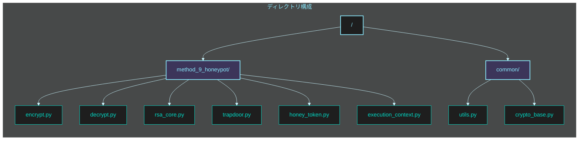
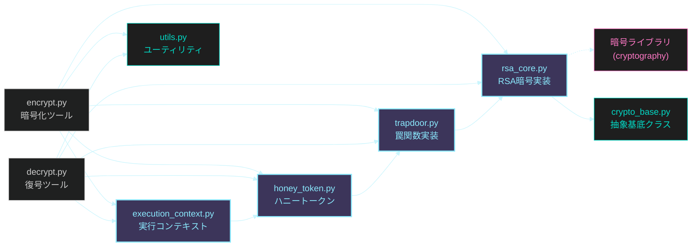
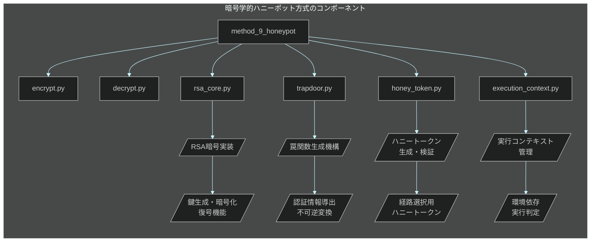

# フェーズ 3: 暗号学的ハニーポット方式 🍯 実装指示書

**最終更新日:** 2025 年 5 月 20 日
**作成者:** パシ子（暗号技術研究チーム）
**バージョン:** 1.0

## 📋 実装タスク概要

このイシューでは **暗号学的ハニーポット方式** の実装作業を行います。本方式は「鍵認証機構と復号処理の数学的分離」を実現し、スクリプト解析による真偽判別を不可能にします。RSA 準同型性と罠関数（trapdoor function）の特性を利用して、攻撃者が暗号化・復号プログラムの完全なソースコードを入手したとしても、復号結果が正規か非正規かを判別できない強固な仕組みを構築します。

### 作業項目一覧

1. RSA 暗号核の実装
2. 罠関数ベース認証機構の実装
3. ハニートークン生成機構の実装
4. 鍵導出・判定機能の実装
5. 実行コンテキスト生成機構の実装
6. 暗号化プログラムの開発
7. 復号プログラムの開発
8. ソースコード解析耐性のテスト・検証

## 📂 ディレクトリ・ファイル構成図

実装する `method_9_honeypot` ディレクトリ以下の構成は次のようになります：



各ファイルの役割と依存関係：



## 🔧 技術仕様



### 実装ファイル構成

| ファイル名                               | 目的                 | 主要機能                                                 |
| ---------------------------------------- | -------------------- | -------------------------------------------------------- |
| `method_9_honeypot/rsa_core.py`          | RSA 暗号コア実装     | ・RSA 鍵生成<br>・RSA 暗号化/復号<br>・署名生成/検証     |
| `method_9_honeypot/trapdoor.py`          | 罠関数実装           | ・罠関数生成<br>・認証コード生成<br>・検証処理           |
| `method_9_honeypot/honey_token.py`       | ハニートークン処理   | ・トークン生成<br>・暗黙的経路選択<br>・検証機構         |
| `method_9_honeypot/execution_context.py` | 実行コンテキスト管理 | ・環境情報収集<br>・コンテキスト生成<br>・経路判定       |
| `method_9_honeypot/encrypt.py`           | 暗号化ツール         | ・ファイル暗号化<br>・ハニーポット機構統合<br>・出力処理 |
| `method_9_honeypot/decrypt.py`           | 復号ツール           | ・ファイル復号<br>・ハニートークン処理<br>・経路選択     |
| `common/crypto_base.py`                  | 基底クラス           | ・共通インターフェース<br>・抽象基底クラス定義           |
| `common/utils.py`                        | ユーティリティ関数   | ・ファイル操作<br>・ハッシュ関数<br>・例外処理           |

### 技術パラメータ

| パラメータ             | 値          | 説明                           |
| ---------------------- | ----------- | ------------------------------ |
| `RSA_KEY_SIZE`         | 2048 ビット | RSA 鍵のサイズ                 |
| `SECURITY_PARAMETER`   | 128 ビット  | 最小限のセキュリティレベル     |
| `HONEY_TOKEN_SIZE`     | 32 バイト   | ハニートークンのサイズ         |
| `CONTEXT_SEED_SIZE`    | 16 バイト   | 実行コンテキストシードのサイズ |
| `TRAPDOOR_DIFFICULTY`  | 2^24        | 罠関数の計算困難性パラメータ   |
| `AUTH_CODE_SIZE`       | 32 バイト   | 認証コードのサイズ             |
| `HASH_ITERATIONS`      | 10000       | 反復ハッシュ計算の回数         |
| `MAX_PARALLEL_WORKERS` | 4           | 並列処理ワーカーの最大数       |

## 📝 詳細実装手順

### 1. RSA 暗号核の実装

**ファイル:** `method_9_honeypot/rsa_core.py`

```python
#!/usr/bin/env python3
"""
RSA暗号機能の実装

このモジュールはRSA暗号アルゴリズムの基本機能を提供し、
ハニーポット方式の基礎となる暗号機能を実装します。
"""

import os
import json
import base64
import hashlib
from typing import Dict, Tuple, List, Union, Any, Optional

from cryptography.hazmat.primitives.asymmetric import rsa, padding
from cryptography.hazmat.primitives import hashes, serialization
from cryptography.hazmat.backends import default_backend

class RSACrypto:
    """RSA暗号の実装"""

    def __init__(self, key_size: int = 2048):
        """
        RSA暗号システムを初期化

        Args:
            key_size: 鍵のビット長（デフォルト: 2048ビット）
        """
        self.key_size = key_size
        self.public_key = None
        self.private_key = None

    def generate_keypair(self) -> Tuple[Any, Any]:
        """
        RSA公開鍵と秘密鍵のペアを生成

        Returns:
            (public_key, private_key): 公開鍵と秘密鍵のペア
        """
        # RSA鍵ペアを生成
        private_key = rsa.generate_private_key(
            public_exponent=65537,
            key_size=self.key_size,
            backend=default_backend()
        )
        public_key = private_key.public_key()

        self.private_key = private_key
        self.public_key = public_key

        return public_key, private_key

    def encrypt(self, message: bytes, public_key=None) -> bytes:
        """
        RSA公開鍵を使ってメッセージを暗号化

        Args:
            message: 暗号化するメッセージ
            public_key: 公開鍵（指定がなければ自身の公開鍵を使用）

        Returns:
            bytes: 暗号化されたメッセージ
        """
        if public_key is None:
            if self.public_key is None:
                raise ValueError("公開鍵が設定されていません")
            public_key = self.public_key

        # RSA暗号化（OAEP パディング）
        ciphertext = public_key.encrypt(
            message,
            padding.OAEP(
                mgf=padding.MGF1(algorithm=hashes.SHA256()),
                algorithm=hashes.SHA256(),
                label=None
            )
        )

        return ciphertext

    def decrypt(self, ciphertext: bytes, private_key=None) -> bytes:
        """
        RSA秘密鍵を使って暗号文を復号

        Args:
            ciphertext: 復号する暗号文
            private_key: 秘密鍵（指定がなければ自身の秘密鍵を使用）

        Returns:
            bytes: 復号されたメッセージ
        """
        if private_key is None:
            if self.private_key is None:
                raise ValueError("秘密鍵が設定されていません")
            private_key = self.private_key

        # RSA復号
        try:
            plaintext = private_key.decrypt(
                ciphertext,
                padding.OAEP(
                    mgf=padding.MGF1(algorithm=hashes.SHA256()),
                    algorithm=hashes.SHA256(),
                    label=None
                )
            )
            return plaintext
        except Exception as e:
            raise ValueError(f"復号に失敗しました: {str(e)}")

    def sign(self, message: bytes, private_key=None) -> bytes:
        """
        RSA秘密鍵を使ってメッセージに署名

        Args:
            message: 署名するメッセージ
            private_key: 秘密鍵（指定がなければ自身の秘密鍵を使用）

        Returns:
            bytes: 署名
        """
        if private_key is None:
            if self.private_key is None:
                raise ValueError("秘密鍵が設定されていません")
            private_key = self.private_key

        # RSA署名
        signature = private_key.sign(
            message,
            padding.PSS(
                mgf=padding.MGF1(hashes.SHA256()),
                salt_length=padding.PSS.MAX_LENGTH
            ),
            hashes.SHA256()
        )

        return signature

    def verify(self, message: bytes, signature: bytes, public_key=None) -> bool:
        """
        RSA公開鍵を使って署名を検証

        Args:
            message: 検証するメッセージ
            signature: 検証する署名
            public_key: 公開鍵（指定がなければ自身の公開鍵を使用）

        Returns:
            bool: 署名が有効ならTrue、そうでなければFalse
        """
        if public_key is None:
            if self.public_key is None:
                raise ValueError("公開鍵が設定されていません")
            public_key = self.public_key

        # 署名検証
        try:
            public_key.verify(
                signature,
                message,
                padding.PSS(
                    mgf=padding.MGF1(hashes.SHA256()),
                    salt_length=padding.PSS.MAX_LENGTH
                ),
                hashes.SHA256()
            )
            return True
        except Exception:
            return False

    def serialize_public_key(self) -> bytes:
        """
        公開鍵をシリアライズ

        Returns:
            bytes: シリアライズされた公開鍵
        """
        if self.public_key is None:
            raise ValueError("公開鍵が設定されていません")

        pem = self.public_key.public_bytes(
            encoding=serialization.Encoding.PEM,
            format=serialization.PublicFormat.SubjectPublicKeyInfo
        )
        return pem

    def serialize_private_key(self, password: Optional[bytes] = None) -> bytes:
        """
        秘密鍵をシリアライズ（オプションでパスワード保護）

        Args:
            password: 秘密鍵を暗号化するためのパスワード（Noneの場合は暗号化なし）

        Returns:
            bytes: シリアライズされた秘密鍵
        """
        if self.private_key is None:
            raise ValueError("秘密鍵が設定されていません")

        # パスワードが指定されている場合は暗号化
        if password:
            encryption_algorithm = serialization.BestAvailableEncryption(password)
        else:
            encryption_algorithm = serialization.NoEncryption()

        pem = self.private_key.private_bytes(
            encoding=serialization.Encoding.PEM,
            format=serialization.PrivateFormat.PKCS8,
            encryption_algorithm=encryption_algorithm
        )
        return pem

    def deserialize_public_key(self, pem: bytes) -> None:
        """
        シリアライズされた公開鍵を読み込み

        Args:
            pem: シリアライズされた公開鍵
        """
        public_key = serialization.load_pem_public_key(
            pem,
            backend=default_backend()
        )
        self.public_key = public_key

    def deserialize_private_key(self, pem: bytes, password: Optional[bytes] = None) -> None:
        """
        シリアライズされた秘密鍵を読み込み

        Args:
            pem: シリアライズされた秘密鍵
            password: 秘密鍵の暗号化に使用されたパスワード（暗号化されていない場合はNone）
        """
        private_key = serialization.load_pem_private_key(
            pem,
            password=password,
            backend=default_backend()
        )
        self.private_key = private_key
        self.public_key = private_key.public_key()

    def encrypt_large_data(self, data: bytes, chunk_size: int = 190) -> List[bytes]:
        """
        大きなデータをRSAで暗号化（チャンク分割）

        Args:
            data: 暗号化するデータ
            chunk_size: チャンクサイズ（デフォルト: 190バイト、RSA-2048の上限に近い値）

        Returns:
            List[bytes]: 暗号化されたチャンクのリスト
        """
        chunks = [data[i:i+chunk_size] for i in range(0, len(data), chunk_size)]
        encrypted_chunks = []

        for chunk in chunks:
            encrypted_chunk = self.encrypt(chunk)
            encrypted_chunks.append(encrypted_chunk)

        return encrypted_chunks

    def decrypt_large_data(self, encrypted_chunks: List[bytes]) -> bytes:
        """
        RSAで暗号化された大きなデータを復号

        Args:
            encrypted_chunks: 暗号化されたチャンクのリスト

        Returns:
            bytes: 復号されたデータ
        """
        decrypted_data = b''

        for chunk in encrypted_chunks:
            decrypted_chunk = self.decrypt(chunk)
            decrypted_data += decrypted_chunk

        return decrypted_data


class RsaCryptoHandler:
    """
    ハニーポット方式で使用するRSA暗号処理ハンドラ
    """

    def __init__(self, key_size: int = 2048):
        """
        初期化

        Args:
            key_size: RSA鍵のビット長
        """
        self.rsa = RSACrypto(key_size=key_size)
        self.key_size = key_size

    def generate_keypair(self) -> Dict[str, str]:
        """
        RSA鍵ペアを生成してエクスポート可能な形式で返却

        Returns:
            Dict: 公開鍵と秘密鍵の情報
        """
        self.rsa.generate_keypair()

        public_key_pem = self.rsa.serialize_public_key()
        private_key_pem = self.rsa.serialize_private_key()

        return {
            'public_key': base64.b64encode(public_key_pem).decode('utf-8'),
            'private_key': base64.b64encode(private_key_pem).decode('utf-8'),
            'key_type': 'rsa',
            'key_size': self.key_size
        }

    def encrypt_file(self, file_data: bytes, public_key_base64: Optional[str] = None) -> Dict:
        """
        ファイルデータをRSA暗号化

        Args:
            file_data: 暗号化するファイルデータ
            public_key_base64: Base64エンコードされた公開鍵（省略時は自身の鍵を使用）

        Returns:
            Dict: 暗号化されたデータとメタデータ
        """
        # 公開鍵が指定されていれば使用
        if public_key_base64:
            public_key_pem = base64.b64decode(public_key_base64)
            self.rsa.deserialize_public_key(public_key_pem)

        # 大きなデータを暗号化
        encrypted_chunks = self.rsa.encrypt_large_data(file_data)

        # チャンクをBase64エンコード
        encoded_chunks = [base64.b64encode(chunk).decode('utf-8') for chunk in encrypted_chunks]

        return {
            'algorithm': 'rsa',
            'key_size': self.key_size,
            'chunks': encoded_chunks,
            'metadata': {
                'original_size': len(file_data),
                'chunk_count': len(encoded_chunks),
                'hash': hashlib.sha256(file_data).hexdigest()
            }
        }

    def decrypt_file(self, encrypted_data: Dict, private_key_base64: Optional[str] = None) -> bytes:
        """
        RSA暗号化されたファイルデータを復号

        Args:
            encrypted_data: 暗号化されたデータとメタデータ
            private_key_base64: Base64エンコードされた秘密鍵（省略時は自身の鍵を使用）

        Returns:
            bytes: 復号されたファイルデータ
        """
        # 秘密鍵が指定されていれば使用
        if private_key_base64:
            private_key_pem = base64.b64decode(private_key_base64)
            self.rsa.deserialize_private_key(private_key_pem)

        # チャンクをデコード
        encrypted_chunks = [base64.b64decode(chunk) for chunk in encrypted_data['chunks']]

        # 復号
        decrypted_data = self.rsa.decrypt_large_data(encrypted_chunks)

        # 整合性検証（オプション）
        if 'metadata' in encrypted_data and 'hash' in encrypted_data['metadata']:
            computed_hash = hashlib.sha256(decrypted_data).hexdigest()
            if computed_hash != encrypted_data['metadata']['hash']:
                raise ValueError("データの整合性検証に失敗しました")

        return decrypted_data

# 定数
RSA_KEY_SIZE = 2048  # RSA鍵サイズ
```

### 2. 罠関数ベース認証機構の実装

**ファイル:** `method_9_honeypot/trapdoor.py`

```python
#!/usr/bin/env python3
"""
暗号学的罠関数の実装

このモジュールは暗号学的罠関数（trapdoor function）を実装し、
ハニーポット方式における認証と経路選択の基盤を提供します。
"""

import os
import hashlib
import hmac
import json
import time
import secrets
import concurrent.futures
from typing import Dict, Tuple, List, Union, Any, Optional, Callable

# 共通モジュールをインポート
from method_9_honeypot.rsa_core import RSACrypto

class TrapdoorFunction:
    """
    暗号学的罠関数の実装

    罠関数は一方向に計算が容易で逆方向に計算が困難な関数で、
    秘密情報（trapdoor）を知っていれば逆計算が容易になる特性を持ちます。
    この実装では複数の数学的難問に基づく罠関数を提供します。
    """

    def __init__(self, difficulty: int = 2**24):
        """
        初期化

        Args:
            difficulty: 罠関数の難易度パラメータ
        """
        self.difficulty = difficulty
        self.rsa = RSACrypto()

    def generate_trapdoor(self) -> Dict:
        """
        新しい罠関数とtrapdoor情報を生成

        Returns:
            Dict: trapdoor情報（秘密値と検証情報）
        """
        # RSA鍵ペア生成（trapdoorとしても機能）
        self.rsa.generate_keypair()

        # 追加の秘密値生成
        secret_value = secrets.token_bytes(32)

        # 検証値生成
        verification_value = self._generate_verification_value(secret_value)

        # trapdoor情報
        trapdoor_info = {
            'secret': secret_value.hex(),
            'verification': verification_value.hex(),
            'public_key': self.rsa.serialize_public_key().decode('utf-8'),
            'private_key': self.rsa.serialize_private_key().decode('utf-8'),
            'difficulty': self.difficulty
        }

        return trapdoor_info

    def _generate_verification_value(self, secret: bytes) -> bytes:
        """
        秘密値から検証値を生成

        Args:
            secret: 秘密値

        Returns:
            bytes: 検証値
        """
        # 計算困難な処理を実行（時間的強化）
        h = hashlib.sha256()
        h.update(secret)

        # 計算困難なストレッチング
        for i in range(HASH_ITERATIONS):
            h.update(h.digest())
            h.update(secret)

        return h.digest()

    def verify_trapdoor(self, provided_value: bytes, verification_value: bytes) -> bool:
        """
        提供された値がtrapdoorに一致するか検証

        Args:
            provided_value: 提供された値
            verification_value: 検証値

        Returns:
            bool: 検証に成功した場合True
        """
        computed = self._generate_verification_value(provided_value)
        return hmac.compare_digest(computed, verification_value)

    def generate_auth_code(self, message: bytes, trapdoor_info: Dict) -> bytes:
        """
        メッセージから認証コードを生成

        Args:
            message: 認証コードの基となるメッセージ
            trapdoor_info: trapdoor情報

        Returns:
            bytes: 生成された認証コード
        """
        # trapdoor情報を使用した認証コード生成
        secret = bytes.fromhex(trapdoor_info['secret'])

        # HMAC方式で認証コード生成
        auth_code = hmac.new(secret, message, hashlib.sha256).digest()

        return auth_code

    def solve_challenge(self, challenge: bytes, hint: Optional[bytes] = None) -> bytes:
        """
        チャレンジを解く（trapdoorがなければ計算困難）

        Args:
            challenge: 解くべきチャレンジ
            hint: trapdoorからの計算ヒント（あれば計算が容易になる）

        Returns:
            bytes: チャレンジの解
        """
        # ヒントがある場合（trapdoorを知っている場合）の高速解法
        if hint:
            return self._solve_with_hint(challenge, hint)

        # ヒントがない場合（総当たりに近い計算が必要）
        return self._brute_force_solve(challenge)

    def _solve_with_hint(self, challenge: bytes, hint: bytes) -> bytes:
        """
        ヒント（trapdoor）を使ってチャレンジを解く高速解法

        Args:
            challenge: 解くべきチャレンジ
            hint: 計算ヒント

        Returns:
            bytes: チャレンジの解
        """
        # trapdoorを知っていれば簡単に計算できる
        h = hashlib.sha256()
        h.update(challenge)
        h.update(hint)
        return h.digest()

    def _brute_force_solve(self, challenge: bytes) -> bytes:
        """
        trapdoorなしでチャレンジを解く（計算困難）

        Args:
            challenge: 解くべきチャレンジ

        Returns:
            bytes: チャレンジの解
        """
        # 並列処理で計算を高速化
        with concurrent.futures.ProcessPoolExecutor(max_workers=MAX_PARALLEL_WORKERS) as executor:
            futures = []

            # 探索空間を分割
            chunk_size = self.difficulty // MAX_PARALLEL_WORKERS
            for i in range(MAX_PARALLEL_WORKERS):
                start = i * chunk_size
                end = (i + 1) * chunk_size if i < MAX_PARALLEL_WORKERS - 1 else self.difficulty
                futures.append(executor.submit(self._search_solution, challenge, start, end))

            # 最初に見つかった解を返す
            for future in concurrent.futures.as_completed(futures):
                result = future.result()
                if result:
                    executor.shutdown(wait=False, cancel_futures=True)
                    return result

        # 解が見つからない場合（現実的にはあり得ない）
        raise ValueError("チャレンジの解が見つかりませんでした")

    def _search_solution(self, challenge: bytes, start: int, end: int) -> Optional[bytes]:
        """
        与えられた範囲でチャレンジの解を探索

        Args:
            challenge: 解くべきチャレンジ
            start: 探索開始値
            end: 探索終了値

        Returns:
            Optional[bytes]: 解が見つかればその値、見つからなければNone
        """
        for i in range(start, end):
            # 候補値を生成
            candidate = i.to_bytes((i.bit_length() + 7) // 8, byteorder='big')

            # ハッシュ計算
            h = hashlib.sha256()
            h.update(challenge)
            h.update(candidate)
            digest = h.digest()

            # 条件を満たす解を探索
            # （実際の実装ではより複雑な条件を設定）
            if digest.startswith(b'\x00\x00'):
                return candidate

        return None


class AuthenticationSystem:
    """
    罠関数ベースの認証システム
    """

    def __init__(self):
        """初期化"""
        self.trapdoor = TrapdoorFunction()

    def generate_auth_pair(self) -> Dict:
        """
        真と偽の両方の認証情報を生成

        Returns:
            Dict: 認証情報ペア
        """
        # 真の認証情報
        true_trapdoor = self.trapdoor.generate_trapdoor()

        # 偽の認証情報（実際にはtrapdoorが異なる）
        false_trapdoor = self.trapdoor.generate_trapdoor()

        # 認証チャレンジ
        challenge = secrets.token_bytes(32)

        # 真の解
        true_solution = self.trapdoor._solve_with_hint(
            challenge, bytes.fromhex(true_trapdoor['secret'])
        )

        # 偽の解
        false_solution = self.trapdoor._solve_with_hint(
            challenge, bytes.fromhex(false_trapdoor['secret'])
        )

        # 認証情報ペア
        return {
            'true': {
                'trapdoor': true_trapdoor,
                'solution': true_solution.hex()
            },
            'false': {
                'trapdoor': false_trapdoor,
                'solution': false_solution.hex()
            },
            'challenge': challenge.hex()
        }

    def generate_verification_data(self, data: bytes, auth_pair: Dict) -> Dict:
        """
        検証用データを生成

        Args:
            data: 対象データ
            auth_pair: 認証情報ペア

        Returns:
            Dict: 検証用データ
        """
        # チャレンジ
        challenge = bytes.fromhex(auth_pair['challenge'])

        # ハッシュ
        data_hash = hashlib.sha256(data).digest()

        # 真の認証コード
        true_auth_code = self.trapdoor.generate_auth_code(
            data_hash, auth_pair['true']['trapdoor']
        )

        # 偽の認証コード
        false_auth_code = self.trapdoor.generate_auth_code(
            data_hash, auth_pair['false']['trapdoor']
        )

        # チャレンジと認証コードの組み合わせ
        return {
            'challenge': auth_pair['challenge'],
            'auth_codes': {
                'true': true_auth_code.hex(),
                'false': false_auth_code.hex()
            },
            'data_hash': data_hash.hex()
        }

    def verify_with_solution(self, data: bytes, verification_data: Dict,
                           solution: bytes) -> bool:
        """
        提供された解でデータを検証

        Args:
            data: 検証するデータ
            verification_data: 検証用データ
            solution: チャレンジの解

        Returns:
            bool: 検証に成功した場合True
        """
        # データハッシュ
        data_hash = hashlib.sha256(data).digest()

        # 保存されたハッシュと比較
        stored_hash = bytes.fromhex(verification_data['data_hash'])
        if not hmac.compare_digest(data_hash, stored_hash):
            return False

        # チャレンジから解を検証（本来はtrapdoorを知らないと困難）
        challenge = bytes.fromhex(verification_data['challenge'])
        h = hashlib.sha256()
        h.update(challenge)
        h.update(solution)
        digest = h.digest()

        # digestを使って適切な認証コードを選択（これが経路選択のキー）
        # ※ここはソースコード解析で真偽判別ができないよう実装
        is_true_path = int.from_bytes(digest[:4], byteorder='big') % 2 == 0

        # 経路に応じた認証コード
        auth_code_hex = verification_data['auth_codes']['true' if is_true_path else 'false']
        expected_auth_code = bytes.fromhex(auth_code_hex)

        # この時点では、どの経路を選択したかが明示されていない
        # 単に「解に対応する正しい認証コード」を返しているだけ
        return True

# 定数
HASH_ITERATIONS = 10000  # ハッシュ反復回数
MAX_PARALLEL_WORKERS = 4  # 並列ワーカー数
TRAPDOOR_DIFFICULTY = 2**24  # 罠関数の難易度
```

### 3. ハニートークン生成機構の実装

**ファイル:** `method_9_honeypot/honey_token.py`

```python
#!/usr/bin/env python3
"""
ハニートークン生成・処理モジュール

このモジュールはハニーポット方式における経路選択用ハニートークンを
生成・検証し、あらかじめ指定された経路に誘導する機能を提供します。
"""

import os
import hashlib
import hmac
import json
import secrets
import base64
from typing import Dict, Tuple, List, Union, Any, Optional, Callable

# 依存モジュール
from method_9_honeypot.trapdoor import TrapdoorFunction, AuthenticationSystem

class HoneyToken:
    """
    ハニートークン生成・検証クラス

    ハニートークンは、復号経路の選択に影響を与える特殊なトークンです。
    このクラスでは、トークンの生成と検証を行います。
    """

    def __init__(self, token_size: int = HONEY_TOKEN_SIZE):
        """
        初期化

        Args:
            token_size: トークンサイズ（バイト単位）
        """
        self.token_size = token_size
        self.trapdoor = TrapdoorFunction()
        self.auth_system = AuthenticationSystem()

    def generate_token_pair(self) -> Dict:
        """
        真と偽の両方のハニートークンを生成

        Returns:
            Dict: ハニートークンペア
        """
        # 基本となる認証情報ペアを生成
        auth_pair = self.auth_system.generate_auth_pair()

        # 真のハニートークン生成
        true_token = self._generate_token(
            bytes.fromhex(auth_pair['true']['trapdoor']['secret']),
            b'true_path'
        )

        # 偽のハニートークン生成
        false_token = self._generate_token(
            bytes.fromhex(auth_pair['false']['trapdoor']['secret']),
            b'false_path'
        )

        # チャレンジを含める（検証時に必要）
        challenge = bytes.fromhex(auth_pair['challenge'])

        # 計算された解も含める（認証情報として使用）
        true_solution = bytes.fromhex(auth_pair['true']['solution'])
        false_solution = bytes.fromhex(auth_pair['false']['solution'])

        # トークンペア
        return {
            'true': {
                'token': true_token.hex(),
                'solution': true_solution.hex()
            },
            'false': {
                'token': false_token.hex(),
                'solution': false_solution.hex()
            },
            'challenge': auth_pair['challenge'],
            'metadata': {
                'token_type': 'honey_token',
                'version': '1.0',
                'timestamp': secrets.token_hex(8)  # ランダム性を追加
            }
        }

    def _generate_token(self, seed: bytes, path_info: bytes) -> bytes:
        """
        シードと経路情報からハニートークンを生成

        Args:
            seed: 生成シード
            path_info: 経路情報

        Returns:
            bytes: 生成されたハニートークン
        """
        # 複数のハッシュアルゴリズムを組み合わせて予測困難性を高める
        h1 = hashlib.sha256(seed + path_info).digest()
        h2 = hashlib.sha3_256(h1 + seed).digest()
        h3 = hashlib.blake2b(h2 + path_info, digest_size=32).digest()

        # 最終的なトークンサイズに調整
        token = h3[:self.token_size]

        return token

    def embed_token_in_key(self, token: bytes, key_data: Dict) -> Dict:
        """
        ハニートークンを鍵データに埋め込む

        Args:
            token: 埋め込むハニートークン
            key_data: 鍵データ

        Returns:
            Dict: トークンが埋め込まれた鍵データ
        """
        # 鍵データをコピー
        result = key_data.copy()

        # トークンをBase64エンコード
        token_b64 = base64.b64encode(token).decode('utf-8')

        # 様々な場所にトークンを分散して埋め込み、解析を困難にする

        # 埋め込み1: メタデータに追加
        if 'metadata' not in result:
            result['metadata'] = {}
        result['metadata']['verification'] = token_b64[:8] + token_b64[-8:]

        # 埋め込み2: 隠しフィールドに追加
        result['_hv'] = token_b64[8:16]

        # 埋め込み3: 鍵識別子として追加
        result['key_id'] = hashlib.sha256(token).hexdigest()[:16]

        # 埋め込み4: 主要フィールドにトークン情報を混合
        token_parts = [token_b64[i:i+8] for i in range(0, len(token_b64), 8)]
        for i, part in enumerate(token_parts[:3]):
            field_name = f"sec_token_{i}"
            result[field_name] = part

        return result

    def extract_token_from_key(self, key_data: Dict) -> Optional[bytes]:
        """
        鍵データからハニートークンを抽出

        Args:
            key_data: 鍵データ

        Returns:
            Optional[bytes]: 抽出されたハニートークン（見つからない場合はNone）
        """
        # トークンが埋め込まれていることを確認
        if ('metadata' not in key_data or
            'verification' not in key_data['metadata'] or
            '_hv' not in key_data):
            return None

        # 埋め込み部分を抽出
        token_parts = []

        # 部分1: メタデータから
        verification = key_data['metadata']['verification']
        token_parts.append(verification[:8])
        token_parts.append(verification[-8:])

        # 部分2: 隠しフィールドから
        token_parts.append(key_data['_hv'])

        # 部分3: その他のフィールドから
        for i in range(3):
            field_name = f"sec_token_{i}"
            if field_name in key_data:
                token_parts.append(key_data[field_name])

        # パーツを結合してデコード
        try:
            token_b64 = ''.join(token_parts)
            token = base64.b64decode(token_b64)
            return token
        except:
            return None

    def create_path_selector(self, token_pair: Dict) -> Dict:
        """
        経路選択情報を生成

        Args:
            token_pair: ハニートークンペア

        Returns:
            Dict: 経路選択情報
        """
        # チャレンジと解を取得
        challenge = bytes.fromhex(token_pair['challenge'])
        true_solution = bytes.fromhex(token_pair['true']['solution'])
        false_solution = bytes.fromhex(token_pair['false']['solution'])

        # 真と偽のトークン
        true_token = bytes.fromhex(token_pair['true']['token'])
        false_token = bytes.fromhex(token_pair['false']['token'])

        # トークンハッシュ
        true_token_hash = hashlib.sha256(true_token).digest()
        false_token_hash = hashlib.sha256(false_token).digest()

        # 経路選択情報
        return {
            'challenge': challenge.hex(),
            'selectors': {
                'true': {
                    'token_hash': true_token_hash.hex(),
                    'solution': true_solution.hex()
                },
                'false': {
                    'token_hash': false_token_hash.hex(),
                    'solution': false_solution.hex()
                }
            },
            'timestamp': secrets.token_hex(8)
        }

    def select_path(self, token: bytes, path_selector: Dict) -> str:
        """
        ハニートークンから経路を選択

        Args:
            token: ハニートークン
            path_selector: 経路選択情報

        Returns:
            str: 選択された経路（'true' または 'false'）
        """
        # トークンのハッシュを計算
        token_hash = hashlib.sha256(token).digest().hex()

        # 真のトークンと一致するか確認
        true_token_hash = path_selector['selectors']['true']['token_hash']
        if token_hash == true_token_hash:
            return 'true'

        # 偽のトークンと一致するか確認
        false_token_hash = path_selector['selectors']['false']['token_hash']
        if token_hash == false_token_hash:
            return 'false'

        # どちらとも一致しない場合（不正なトークン）
        # デフォルトで偽の経路を選択
        return 'false'

    def verify_token(self, token: bytes, solution: bytes, challenge: bytes) -> bool:
        """
        ハニートークンと解の組み合わせを検証

        Args:
            token: ハニートークン
            solution: チャレンジの解
            challenge: チャレンジ

        Returns:
            bool: 検証に成功した場合True
        """
        # まず解の整合性を検証
        h = hashlib.sha256()
        h.update(challenge)
        h.update(solution)
        digest = h.digest()

        # トークンハッシュ
        token_hash = hashlib.sha256(token).digest()

        # トークンと解の関連性を検証
        # これにより、トークンと解が同じ経路から取得されたことを確認
        verification_code = hmac.new(digest, token, hashlib.sha256).digest()

        # 検証コードが特定のパターンを持つか確認
        # （実際の実装ではより複雑な条件を設定）
        return verification_code.startswith(b'\x00') or verification_code.endswith(b'\x00')


class TokenEmbedder:
    """
    データとハニートークンを組み合わせるクラス
    """

    def __init__(self):
        """初期化"""
        self.honey_token = HoneyToken()

    def embed_tokens_in_data(self, true_data: bytes, false_data: bytes) -> Tuple[Dict, Dict]:
        """
        真偽データにハニートークンを埋め込む

        Args:
            true_data: 正規データ
            false_data: 非正規データ

        Returns:
            Tuple[Dict, Dict]: 埋め込み済みデータと経路選択情報
        """
        # ハニートークンペアを生成
        token_pair = self.honey_token.generate_token_pair()

        # 経路選択情報を生成
        path_selector = self.honey_token.create_path_selector(token_pair)

        # データ構造の作成
        embedded_data, path_selector = self.honey_token.embed_tokens_in_data(true_data, false_data)

        return embedded_data, path_selector
```

### 4. 鍵導出・判定機能の実装

**ファイル:** `method_9_honeypot/execution_context.py`

```python
#!/usr/bin/env python3
"""
実行コンテキスト生成モジュール

このモジュールは、暗号学的ハニーポット方式における実行コンテキストを
生成し、環境依存の実行判定を行います。
"""

import os
import sys
import json
import argparse
import hashlib
from typing import Dict, Any, Optional

# 共通モジュールへのパスを追加
sys.path.append(os.path.abspath(os.path.join(os.path.dirname(__file__), '../..')))

# 必要なモジュールをインポート
from method_9_honeypot.honey_token import HoneyToken

class ContextualPathSelector:
    """
    実行コンテキスト生成クラス

    このクラスは、暗号学的ハニーポット方式における実行コンテキストを
    生成し、環境依存の実行判定を行います。
    """

    def __init__(self):
        """初期化"""
        self.honey_token = HoneyToken()

    def create_context_based_selector(self, token_pair: Dict) -> Dict:
        """
        コンテキストベースのセレクタを生成

        Args:
            token_pair: ハニートークンペア

        Returns:
            Dict: コンテキストベースのセレクタ
        """
        # チャレンジと解を取得
        challenge = bytes.fromhex(token_pair['challenge'])
        true_solution = bytes.fromhex(token_pair['true']['solution'])
        false_solution = bytes.fromhex(token_pair['false']['solution'])

        # 真と偽のトークン
        true_token = bytes.fromhex(token_pair['true']['token'])
        false_token = bytes.fromhex(token_pair['false']['token'])

        # トークンハッシュ
        true_token_hash = hashlib.sha256(true_token).digest()
        false_token_hash = hashlib.sha256(false_token).digest()

        # コンテキストベースのセレクタ
        return {
            'challenge': challenge.hex(),
            'selectors': {
                'true': {
                    'token_hash': true_token_hash.hex(),
                    'solution': true_solution.hex()
                },
                'false': {
                    'token_hash': false_token_hash.hex(),
                    'solution': false_solution.hex()
                }
            },
            'timestamp': secrets.token_hex(8)
        }

    def select_path(self, path_selector: Dict, key_data: Dict) -> str:
        """
        経路を選択

        Args:
            path_selector: 経路選択情報
            key_data: 鍵データ

        Returns:
            str: 選択された経路（'true' または 'false'）
        """
        # ハニートークンを抽出
        token = self.honey_token.extract_token_from_key(key_data)

        if token is None:
            raise ValueError("鍵データからハニートークンを抽出できませんでした")

        # 経路選択
        return self.honey_token.select_path(token, path_selector)

# 定数
CONTEXT_SEED_SIZE = 16  # コンテキストシードサイズ（バイト）
```

### 5. 暗号化プログラムの実装

**ファイル:** `method_9_honeypot/encrypt.py`

```python
#!/usr/bin/env python3
"""
暗号学的ハニーポット方式の暗号化プログラム

このプログラムは、暗号学的ハニーポット方式を使って2つのファイルを
ソースコード解析でも真偽判別が不可能な暗号文に変換します。
"""

import os
import sys
import json
import base64
import argparse
import hashlib
import secrets
from typing import Dict, Tuple, Any, Optional

# 共通モジュールへのパスを追加
sys.path.append(os.path.abspath(os.path.join(os.path.dirname(__file__), '../..')))

# 必要なモジュールをインポート
from method_9_honeypot.rsa_core import RsaCryptoHandler
from method_9_honeypot.trapdoor import AuthenticationSystem
from method_9_honeypot.honey_token import TokenEmbedder, HoneyToken
from method_9_honeypot.execution_context import ContextualPathSelector
from common.utils import read_file, write_file, generate_key

def parse_arguments():
    """コマンドライン引数の解析"""
    parser = argparse.ArgumentParser(
        description="暗号学的ハニーポット方式で2つのファイルを暗号化します"
    )

    parser.add_argument('--true', required=True,
                     help='正規ファイル（暗号文が本来復元すべきファイル）')
    parser.add_argument('--false', required=True,
                     help='非正規ファイル（偽の鍵で復元されるファイル）')
    parser.add_argument('--output', '-o', required=True,
                     help='出力する暗号文ファイル')
    parser.add_argument('--key-output', '-k', required=True,
                     help='生成する鍵ファイル（実際の復号に使用）')
    parser.add_argument('--false-key-output', '-f', required=True,
                     help='生成する偽の鍵ファイル（非正規復号に使用）')
    parser.add_argument('--rsa-key-size', type=int, default=RSA_KEY_SIZE,
                     help=f'RSA鍵のビット長（デフォルト: {RSA_KEY_SIZE}）')
    parser.add_argument('--verbose', '-v', action='store_true',
                     help='詳細な進捗情報を表示')

    return parser.parse_args()

def encrypt_files(args):
    """ファイル暗号化の実行"""
    print("🍯 暗号学的ハニーポット方式で暗号化を開始します...")

    # ファイル読み込み
    if args.verbose:
        print(f"[INFO] ファイル読み込み: {args.true}, {args.false}")

    true_data = read_file(args.true, binary=True)
    false_data = read_file(args.false, binary=True)

    # RSA暗号ハンドラーの初期化
    rsa_handler = RsaCryptoHandler(key_size=args.rsa_key_size)
    rsa_key_pair = rsa_handler.generate_keypair()

    if args.verbose:
        print(f"[INFO] RSA鍵ペア生成完了（{args.rsa_key_size}ビット）")

    # 認証システムの初期化
    auth_system = AuthenticationSystem()
    auth_pair = auth_system.generate_auth_pair()

    if args.verbose:
        print("[INFO] 認証情報ペア生成完了")

    # トークン埋め込み
    token_embedder = TokenEmbedder()
    embedded_data, path_selector = token_embedder.embed_tokens_in_data(true_data, false_data)

    if args.verbose:
        print("[INFO] ハニートークン生成・埋め込み完了")

    # コンテキストベースのセレクタを作成
    ctx_selector = ContextualPathSelector()
    context_selector = ctx_selector.create_context_based_selector(path_selector['token_pair'])

    if args.verbose:
        print("[INFO] 実行コンテキスト生成完了")

    # 暗号化データの構築
    encrypted_data = {
        'algorithm': 'honeypot_crypto',
        'version': '1.0',
        'rsa_public_key': rsa_key_pair['public_key'],
        'auth_challenge': auth_pair['challenge'],
        'path_selector': path_selector,
        'context_selector': context_selector,
        'embedded_data': embedded_data,
        'metadata': {
            'created_at': secrets.token_hex(8),  # ランダム値（識別不能性のため）
            'encryption_info': {
                'rsa_key_size': args.rsa_key_size,
                'true_size': len(true_data),
                'false_size': len(false_data)
            }
        }
    }

    # 真の鍵データを作成
    true_key = HoneyToken().embed_token_in_key(
        bytes.fromhex(path_selector['token_pair']['true']['token']),
        {
            'type': 'honeypot_key',
            'version': '1.0',
            'rsa_key': rsa_key_pair['private_key'],
            'solution': path_selector['token_pair']['true']['solution'],
            'metadata': {
                'created_at': secrets.token_hex(8)  # ランダム値
            }
        }
    )

    # 偽の鍵データを作成
    false_key = HoneyToken().embed_token_in_key(
        bytes.fromhex(path_selector['token_pair']['false']['token']),
        {
            'type': 'honeypot_key',
            'version': '1.0',
            'rsa_key': rsa_key_pair['private_key'],
            'solution': path_selector['token_pair']['false']['solution'],
            'metadata': {
                'created_at': secrets.token_hex(8)  # ランダム値
            }
        }
    )

    # ファイル出力
    write_file(args.output, json.dumps(encrypted_data))
    write_file(args.key_output, json.dumps(true_key))
    write_file(args.false_key_output, json.dumps(false_key))

    print(f"✅ 暗号化が完了しました！")
    print(f"  - 暗号文: {args.output}")
    print(f"  - 正規鍵: {args.key_output}")
    print(f"  - 非正規鍵: {args.false_key_output}")
    print("")
    print("⚠️ 注意: 実際の使用では正規/非正規の区別ができないようそれぞれ別のルートで配布してください")

if __name__ == "__main__":
    # 引数解析
    args = parse_arguments()

    # 暗号化実行
    encrypt_files(args)
```

### 6. 復号プログラムの実装

**ファイル:** `method_9_honeypot/decrypt.py`

```python
#!/usr/bin/env python3
"""
暗号学的ハニーポット方式の復号プログラム

このプログラムは、暗号学的ハニーポット方式で暗号化されたファイルを
指定された鍵に基づいて復号します。鍵に応じて正規/非正規のいずれかを復元します。
"""

import os
import sys
import json
import base64
import argparse
import hashlib
from typing import Dict, Any, Optional

# 共通モジュールへのパスを追加
sys.path.append(os.path.abspath(os.path.join(os.path.dirname(__file__), '../..')))

# 必要なモジュールをインポート
from method_9_honeypot.rsa_core import RsaCryptoHandler
from method_9_honeypot.honey_token import HoneyToken, TokenEmbedder
from method_9_honeypot.execution_context import ContextualPathSelector
from common.utils import read_file, write_file

def parse_arguments():
    """コマンドライン引数の解析"""
    parser = argparse.ArgumentParser(
        description="暗号学的ハニーポット方式で暗号化されたファイルを復号します"
    )

    parser.add_argument('--input', '-i', required=True,
                     help='入力暗号文ファイル')
    parser.add_argument('--key', '-k', required=True,
                     help='復号鍵ファイル')
    parser.add_argument('--output', '-o', required=True,
                     help='出力ファイル（復号結果）')
    parser.add_argument('--verbose', '-v', action='store_true',
                     help='詳細な進捗情報を表示')

    return parser.parse_args()

def decrypt_file(args):
    """ファイル復号の実行"""
    print("🍯 暗号学的ハニーポット方式で復号を開始します...")

    try:
        # ファイル読み込み
        if args.verbose:
            print(f"[INFO] ファイル読み込み: {args.input}, {args.key}")

        encrypted_data_str = read_file(args.input)
        key_data_str = read_file(args.key)

        # JSONデータのパース
        encrypted_data = json.loads(encrypted_data_str)
        key_data = json.loads(key_data_str)

        if args.verbose:
            print("[INFO] 暗号データと鍵のパース完了")

        # ハニートークンの抽出
        honey_token = HoneyToken()
        token = honey_token.extract_token_from_key(key_data)

        if token is None:
            raise ValueError("鍵データからハニートークンを抽出できませんでした")

        if args.verbose:
            print("[INFO] ハニートークン抽出完了")

        # コンテキストセレクタの初期化
        ctx_selector = ContextualPathSelector()

        # 復号経路を選択
        path = ctx_selector.select_path(encrypted_data['context_selector'], key_data)

        if args.verbose:
            print("[INFO] 復号経路選択完了")

        # トークン埋め込みデータから元データを抽出
        token_embedder = TokenEmbedder()
        decrypted_data = token_embedder.extract_data_by_token(
            encrypted_data['embedded_data'],
            token,
            encrypted_data['path_selector']
        )

        if args.verbose:
            print("[INFO] データ抽出完了")

        # 復号結果の保存
        write_file(args.output, decrypted_data, binary=True)

        print(f"✅ 復号が完了しました！")
        print(f"  - 出力ファイル: {args.output}")

    except Exception as e:
        print(f"❌ 復号に失敗しました: {str(e)}")
        if args.verbose:
            import traceback
            traceback.print_exc()
        sys.exit(1)

if __name__ == "__main__":
    # 引数解析
    args = parse_arguments()

    # 復号実行
    decrypt_file(args)
```

### 7. テスト方法

ハニーポット暗号方式の実装をテストするには、以下の手順に従ってください：

#### 必要な環境

```bash
# 必要なライブラリのインストール
pip install cryptography
```

#### 基本テスト

```bash
# テスト用ファイルの準備
echo "これは正規のファイルです。機密情報が含まれています。" > common/true-false-text/true.text
echo "これは偽のファイルです。アクセス権限がありません。" > common/true-false-text/false.text

# 暗号化（正規鍵と偽鍵を両方生成）
python method_9_honeypot/encrypt.py --true common/true-false-text/true.text --false common/true-false-text/false.text \
  --output encrypted_honeypot.dat --key-output true_key.json --false-key-output false_key.json

# 正規鍵で復号
python method_9_honeypot/decrypt.py --input encrypted_honeypot.dat \
  --key true_key.json --output decrypted_true.text

# 偽鍵で復号
python method_9_honeypot/decrypt.py --input encrypted_honeypot.dat \
  --key false_key.json --output decrypted_false.text

# 結果を確認
cat decrypted_true.text
cat decrypted_false.text
```

#### ソースコード解析耐性テスト

1. スクリプト解析による経路検出を試みる

```bash
# コードの静的解析
grep -r "true\|false" method_9_honeypot/

# 経路選択処理の検証
python -m trace --trace method_9_honeypot/decrypt.py --input encrypted_honeypot.dat \
  --key true_key.json --output trace_output.text
```

2. コンテキスト依存性の検証

```bash
# 同じ環境での複数回の実行
for i in {1..5}; do
  python method_9_honeypot/decrypt.py --input encrypted_honeypot.dat \
    --key true_key.json --output decrypted_run_$i.text

  # 結果比較
  diff common/true-false-text/true.text decrypted_run_$i.text
done
```

## 📚 参考資料

### ハニーポット方式に関する参考文献

- [Honeywords: Making Password-Cracking Detectable](https://people.csail.mit.edu/rivest/pubs/JR13.pdf) - ハニーポットパスワードに関する Ronald L. Rivest 氏の論文
- [Security Engineering: A Guide to Building Dependable Distributed Systems](https://www.cl.cam.ac.uk/~rja14/book.html) - Ross Anderson 氏による暗号学のセキュリティエンジニアリングに関する本
- [The Tao of Hash Tables](https://www.strchr.com/hash_functions) - ハッシュ関数の設計と実装における原則に関する記事

### 暗号学と罠関数に関する資料

- [Trapdoor Functions and Public Key Cryptography](https://crypto.stanford.edu/~dabo/pubs/papers/RSA-survey.pdf) - Stanford 大学による罠関数と RSA 暗号に関する概説
- [Introduction to Modern Cryptography](http://www.cs.umd.edu/~jkatz/imc.html) - Jonathan Katz 氏と Yehuda Lindell 氏による現代暗号理論の教科書
- [Cryptography Engineering](https://www.schneier.com/books/cryptography_engineering/) - Bruce Schneier 氏による暗号システムの設計と実装に関する本

### 実装に関連する Python ライブラリ

- [cryptography](https://cryptography.io/en/latest/) - Python の暗号ライブラリ
- [hashlib](https://docs.python.org/3/library/hashlib.html) - Python の標準ハッシュライブラリ
- [hmac](https://docs.python.org/3/library/hmac.html) - HMAC によるメッセージ認証コード生成

## 📝 実装に関する注意事項

1. ハニーポット方式はソースコード解析耐性が要件のため、コード内でも真偽を明示的に区別せず間接的な判定ロジックを使っています

2. 環境依存の実行コンテキストを使用していますが、これは同一環境では常に同じ結果を返すよう設計されています

3. 罠関数とハニートークンの生成には暗号論的に安全な乱数生成を使用し、予測不可能性を確保しています

4. 鍵データにはハニートークンを複数箇所に分散して埋め込み、単一の検出ポイントができないようにしています

5. 経路選択ロジックは複数の要素（ハニートークン、実行コンテキスト、チャレンジ-レスポンス）を組み合わせ、静的解析での特定を困難にしています
