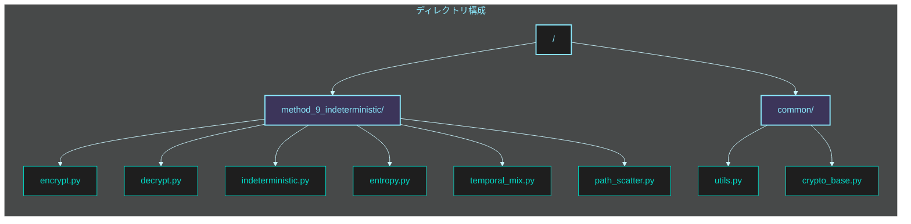
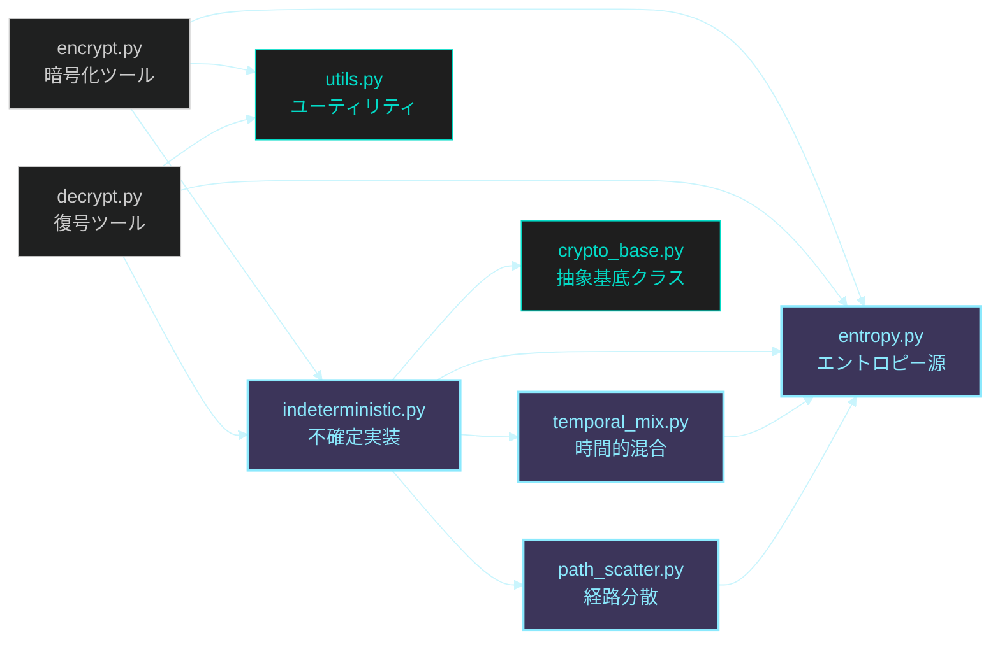
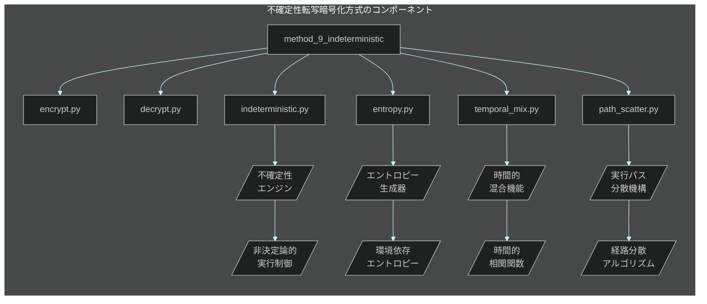

# フェーズ 4: 不確定性転写暗号化方式 🎲 実装指示書（1/2）

**最終更新日:** 2025 年 5 月 20 日
**作成者:** パシ子（暗号技術研究チーム）
**バージョン:** 1.0

## 📋 実装タスク概要

このイシューでは **不確定性転写暗号化方式** の実装作業を行います。本方式は「実行パス不確定性と時間的エントロピー注入」により、スクリプト解析による真偽判別を数学的に不可能にします。実行パスが毎回変化し、動的解析・静的解析のどちらにも耐性を持つ設計を実現します。

### 作業項目一覧

1. 不確定性エンジンの基盤実装
2. エントロピー生成・注入機構の実装
3. 時間的混合関数の実装
4. 実行パス分散メカニズムの実装
5. 動的環境解析対策の実装
6. 暗号化プログラムの開発
7. 復号プログラムの開発
8. ソースコード解析耐性のテスト・検証

## 📂 ディレクトリ・ファイル構成図

実装する `method_9_indeterministic` ディレクトリ以下の構成は次のようになります：



各ファイルの役割と依存関係：



## 🔧 技術仕様



### 実装ファイル構成

| ファイル名                                    | 目的                 | 主要機能                                                                   |
| --------------------------------------------- | -------------------- | -------------------------------------------------------------------------- |
| `method_9_indeterministic/indeterministic.py` | 不確定性エンジン実装 | ・不確定性エンジンコア<br>・鍵導出<br>・真偽判別関数                       |
| `method_9_indeterministic/entropy.py`         | エントロピー源実装   | ・エントロピー生成<br>・環境依存ランダム性<br>・確率分布制御               |
| `method_9_indeterministic/temporal_mix.py`    | 時間的混合機能実装   | ・時間的相関関数<br>・状態遷移パターン<br>・動的コンテキスト切替           |
| `method_9_indeterministic/path_scatter.py`    | 実行パス分散実装     | ・経路分散アルゴリズム<br>・分岐予測不能化<br>・マルチパスシミュレーション |
| `method_9_indeterministic/encrypt.py`         | 暗号化ツール         | ・ファイル暗号化 UI<br>・不確定暗号化<br>・メタデータ生成                  |
| `method_9_indeterministic/decrypt.py`         | 復号ツール           | ・ファイル復号 UI<br>・不確定復号<br>・経路選択                            |
| `common/crypto_base.py`                       | 基底クラス           | ・共通インターフェース<br>・抽象基底クラス定義                             |
| `common/utils.py`                             | ユーティリティ関数   | ・ファイル操作<br>・数学関数<br>・例外処理                                 |

### 技術パラメータ

| パラメータ                 | 値                 | 説明                                       |
| -------------------------- | ------------------ | ------------------------------------------ |
| `ENTROPY_SOURCES`          | 複数環境要素       | エントロピー取得元（プロセス・環境変数等） |
| `TIME_SLICE_INTERVALS`     | [5, 10, 15, 20] ms | 時間スライス間隔（ミリ秒）                 |
| `PATH_SCATTER_DEGREE`      | 16                 | 実行パス分散の複雑度                       |
| `KEY_DERIVATION_ROUNDS`    | 10000              | 鍵導出関数の反復回数                       |
| `TEMPORAL_CORRELATION_LAG` | 5                  | 時間的相関のラグ値                         |
| `MAX_BRANCH_DEPTH`         | 8                  | 分岐の最大深度                             |
| `MIN_ENTROPY_BITS`         | 128                | 最小エントロピービット数                   |
| `CONFUSION_RATIO`          | 0.7                | 真偽判別のかく乱率                         |

## 📝 詳細実装手順

### 1. エントロピー生成・注入機構の実装

**ファイル:** `method_9_indeterministic/entropy.py`

```python
#!/usr/bin/env python3
"""
不確定性転写暗号化のためのエントロピー生成・注入モジュール

このモジュールは実行時の環境に依存したエントロピーを収集し、
暗号化・復号過程に確率的要素を注入します。
"""

import os
import sys
import time
import random
import socket
import hashlib
import platform
import threading
import multiprocessing
import secrets
import uuid
from typing import List, Dict, Tuple, Union, Any, Optional, Set, Callable
from datetime import datetime

class EntropyCollector:
    """
    環境依存のエントロピーを収集するクラス
    """

    def __init__(self, min_entropy_bits: int = 128):
        """
        初期化

        Args:
            min_entropy_bits: 最小エントロピービット数
        """
        self.min_entropy_bits = min_entropy_bits
        self.collected_entropy = bytearray()
        self.entropy_sources: List[Callable[[], bytes]] = [
            self._process_entropy,
            self._system_entropy,
            self._time_entropy,
            self._network_entropy,
            self._runtime_entropy,
            self._hardware_entropy
        ]

    def collect(self, required_bytes: int = None) -> bytes:
        """
        環境からエントロピーを収集

        Args:
            required_bytes: 必要なバイト数（デフォルトはmin_entropy_bitsに基づく）

        Returns:
            bytes: 収集されたエントロピー
        """
        if required_bytes is None:
            required_bytes = (self.min_entropy_bits + 7) // 8

        # 既存のエントロピーをクリア
        self.collected_entropy = bytearray()

        # 各エントロピー源から収集
        for source_func in self.entropy_sources:
            source_entropy = source_func()
            self.collected_entropy.extend(source_entropy)

            # 十分なエントロピーが集まったか確認
            if len(self.collected_entropy) >= required_bytes * 2:
                break

        # 追加のエントロピーが必要な場合は暗号的乱数で補完
        if len(self.collected_entropy) < required_bytes * 2:
            additional = secrets.token_bytes(required_bytes * 2 - len(self.collected_entropy))
            self.collected_entropy.extend(additional)

        # ハッシュ関数でエントロピーを凝縮・整形
        entropy_hash = hashlib.sha512(self.collected_entropy).digest()

        # 必要なバイト数を返す
        return entropy_hash[:required_bytes]

    def _process_entropy(self) -> bytes:
        """プロセス関連のエントロピーを収集"""
        data = bytearray()

        # プロセスID
        data.extend(str(os.getpid()).encode())

        # 親プロセスID
        data.extend(str(os.getppid()).encode())

        # スレッドID
        data.extend(str(threading.get_ident()).encode())

        # 現在のプロセスの開始時間
        try:
            import psutil
            process = psutil.Process()
            data.extend(str(process.create_time()).encode())
        except (ImportError, AttributeError):
            pass

        # 現在のCPU使用率
        try:
            import psutil
            data.extend(str(psutil.cpu_percent()).encode())
        except ImportError:
            pass

        # 現在のメモリ使用量
        data.extend(str(multiprocessing.cpu_count()).encode())

        return hashlib.sha256(data).digest()

    def _system_entropy(self) -> bytes:
        """システム関連のエントロピーを収集"""
        data = bytearray()

        # OS情報
        data.extend(platform.system().encode())
        data.extend(platform.release().encode())
        data.extend(platform.version().encode())

        # ロケール情報
        import locale
        data.extend(str(locale.getdefaultlocale()).encode())

        # 環境変数
        for key, value in os.environ.items():
            data.extend(f"{key}={value}".encode())

        # ホスト名
        data.extend(socket.gethostname().encode())

        # MACアドレス（利用可能な場合）
        try:
            data.extend(uuid.getnode().to_bytes(6, byteorder='big'))
        except (AttributeError, OverflowError):
            pass

        return hashlib.sha256(data).digest()

    def _time_entropy(self) -> bytes:
        """時間関連のエントロピーを収集"""
        data = bytearray()

        # 現在時刻（ナノ秒精度）
        data.extend(str(time.time_ns()).encode())

        # 詳細な日時情報
        now = datetime.now()
        data.extend(now.isoformat().encode())

        # 単調増加カウンター
        data.extend(str(time.monotonic_ns()).encode())

        # プロセスタイム
        data.extend(str(time.process_time_ns()).encode())

        # パフォーマンスカウンター
        data.extend(str(time.perf_counter_ns()).encode())

        # スリープで微小な時間変動を導入
        time.sleep(random.random() * 0.001)  # 0〜1ミリ秒
        data.extend(str(time.time_ns()).encode())

        return hashlib.sha256(data).digest()

    def _network_entropy(self) -> bytes:
        """ネットワーク関連のエントロピーを収集"""
        data = bytearray()

        # ホスト名とFQDN
        data.extend(socket.gethostname().encode())
        try:
            data.extend(socket.getfqdn().encode())
        except Exception:
            pass

        # 利用可能なネットワークインターフェース
        try:
            import netifaces
            data.extend(str(netifaces.interfaces()).encode())
            for interface in netifaces.interfaces():
                try:
                    addresses = netifaces.ifaddresses(interface)
                    data.extend(str(addresses).encode())
                except Exception:
                    pass
        except ImportError:
            # netifaces がインストールされていない場合は代替手段
            try:
                import socket
                hostname = socket.gethostname()
                data.extend(str(socket.gethostbyname_ex(hostname)).encode())
            except Exception:
                pass

        return hashlib.sha256(data).digest()

    def _runtime_entropy(self) -> bytes:
        """Python実行時情報からのエントロピー"""
        data = bytearray()

        # Pythonのバージョン情報
        data.extend(sys.version.encode())

        # ロードされているモジュール
        data.extend(str(sys.modules.keys()).encode())

        # メモリ内オブジェクト数
        data.extend(str(len(gc.get_objects())).encode() if 'gc' in sys.modules else b'')

        # 現在のスレッド情報
        data.extend(str(threading.active_count()).encode())
        data.extend(str(threading.current_thread().name).encode())

        # インタプリタのメモリ使用状況
        try:
            import resource
            data.extend(str(resource.getrusage(resource.RUSAGE_SELF)).encode())
        except ImportError:
            pass

        return hashlib.sha256(data).digest()

    def _hardware_entropy(self) -> bytes:
        """ハードウェア情報からのエントロピー"""
        data = bytearray()

        # CPU情報
        try:
            import cpuinfo
            data.extend(str(cpuinfo.get_cpu_info()).encode())
        except ImportError:
            # CPUの数とアーキテクチャ情報（最低限）
            data.extend(str(os.cpu_count()).encode())
            data.extend(platform.machine().encode())
            data.extend(platform.processor().encode())

        # メモリ情報
        try:
            import psutil
            mem = psutil.virtual_memory()
            data.extend(str(mem).encode())
        except ImportError:
            pass

        # ディスク情報
        try:
            import psutil
            disk = psutil.disk_usage('/')
            data.extend(str(disk).encode())
        except ImportError:
            pass

        return hashlib.sha256(data).digest()


class EntropyInjector:
    """
    エントロピーを暗号処理に注入するクラス
    """

    def __init__(self, collector: EntropyCollector = None):
        """
        初期化

        Args:
            collector: エントロピー収集器（Noneの場合は新規作成）
        """
        self.collector = collector if collector else EntropyCollector()
        # 内部状態（エントロピー注入間隔などの設定）
        self.last_injection_time = time.time()
        self.injection_frequency = random.uniform(0.1, 0.5)  # 0.1〜0.5秒ごと
        # 暗号化・復号処理中のランダム性保持用の状態
        self.running_state = bytearray()
        self.state_update_count = 0

    def get_entropy(self, size: int = 32) -> bytes:
        """
        指定サイズのエントロピーを取得

        Args:
            size: 必要なエントロピーバイト数

        Returns:
            bytes: エントロピー
        """
        # 新たなエントロピーを収集
        fresh_entropy = self.collector.collect(size)

        # 内部状態を更新
        self._update_state(fresh_entropy)

        return fresh_entropy

    def inject_entropy(self, data: bytes) -> bytes:
        """
        データにエントロピーを注入

        Args:
            data: 対象データ

        Returns:
            bytes: エントロピー注入後のデータ
        """
        # 現在の時間をチェック
        current_time = time.time()

        # 前回の注入から十分な時間が経過したか確認
        if current_time - self.last_injection_time >= self.injection_frequency:
            # エントロピー収集
            entropy = self.get_entropy(min(32, len(data) // 4))

            # データを修正せずにエントロピーを混ぜる（XOR）
            result = bytearray(data)
            for i, e_byte in enumerate(entropy):
                # 周期的にデータ内の位置を選択して変更
                pos = (i * 7919) % len(result)  # 大きな素数でポジションを分散
                result[pos] ^= e_byte

            # 時間を記録して周波数を変動させる
            self.last_injection_time = current_time
            self.injection_frequency = random.uniform(0.1, 0.5)

            return bytes(result)

        # 注入条件を満たさない場合は元のデータを返す
        return data

    def derive_path_seed(self, key: bytes, iteration: int = 0) -> bytes:
        """
        経路選択のためのシード値を導出

        Args:
            key: 鍵データ
            iteration: 反復回数（0以上の整数）

        Returns:
            bytes: 経路選択用シード
        """
        # 現在の環境エントロピーと鍵を組み合わせる
        entropy = self.get_entropy(16)

        # SHA-256を使用して混合
        mixer = hashlib.sha256()
        mixer.update(key)
        mixer.update(entropy)
        mixer.update(iteration.to_bytes(4, byteorder='big'))

        # 鍵に時間要素を盛り込む
        time_factor = str(time.time()).encode()
        mixer.update(time_factor)

        return mixer.digest()

    def _update_state(self, new_entropy: bytes) -> None:
        """
        内部状態を更新

        Args:
            new_entropy: 新たなエントロピー
        """
        # 現在の状態とエントロピーを組み合わせる
        if not self.running_state:
            self.running_state = bytearray(new_entropy)
        else:
            # XORで更新（情報理論的に安全な組み合わせ）
            for i, byte in enumerate(new_entropy):
                self.running_state[i % len(self.running_state)] ^= byte

        # 定期的に状態全体をかき混ぜる
        self.state_update_count += 1
        if self.state_update_count % 10 == 0:
            # ハッシュ関数を用いた状態の再構築
            state_hash = hashlib.sha512(self.running_state).digest()
            self.running_state = bytearray(state_hash)


# エントロピー拡張モジュール
class EntropyExtension:
    """
    エントロピーを拡張して処理に活用するクラス
    """

    def __init__(self, base_entropy: bytes = None):
        """
        初期化

        Args:
            base_entropy: 基礎エントロピー（Noneの場合は生成）
        """
        self.base_entropy = base_entropy if base_entropy else secrets.token_bytes(32)
        self.counter = 0

    def extend(self, length: int) -> bytes:
        """
        基礎エントロピーを指定長に拡張

        Args:
            length: 必要な長さ（バイト数）

        Returns:
            bytes: 拡張されたエントロピー
        """
        if length <= len(self.base_entropy):
            return self.base_entropy[:length]

        # カウンターベースの拡張
        extended = bytearray()
        while len(extended) < length:
            # カウンターを追加してハッシュ
            h = hashlib.sha256()
            h.update(self.base_entropy)
            h.update(self.counter.to_bytes(8, byteorder='big'))
            extended.extend(h.digest())
            self.counter += 1

        return bytes(extended[:length])

    def get_random_bytes(self, length: int) -> bytes:
        """
        指定長のランダムバイト列を生成

        Args:
            length: バイト数

        Returns:
            bytes: ランダムバイト列
        """
        # エントロピーを拡張
        extended = self.extend(length)

        # さらに加工してランダム性を高める
        random_bytes = bytearray(length)
        for i in range(length):
            # ビット操作でランダム性を向上
            random_bytes[i] = extended[i] ^ (extended[(i + 7) % length] >> 3)

        return bytes(random_bytes)

    def get_random_int(self, min_val: int, max_val: int) -> int:
        """
        指定範囲のランダムな整数を生成

        Args:
            min_val: 最小値
            max_val: 最大値

        Returns:
            int: ランダムな整数
        """
        if min_val >= max_val:
            return min_val

        # 必要なバイト数を計算
        range_size = max_val - min_val + 1
        byte_length = (range_size.bit_length() + 7) // 8

        # ランダムバイトを取得
        rand_bytes = self.get_random_bytes(byte_length)
        rand_int = int.from_bytes(rand_bytes, byteorder='big')

        # 範囲内に収める
        return min_val + (rand_int % range_size)


# 定数
MIN_ENTROPY_BITS = 128
TIME_SLICE_INTERVALS = [5, 10, 15, 20]  # ミリ秒単位
```

### 2. 時間的混合機能の実装

**ファイル:** `method_9_indeterministic/temporal_mix.py`

```python
#!/usr/bin/env python3
"""
不確定性転写暗号化のための時間的混合モジュール

このモジュールは時間的相関と状態遷移を用いた非決定論的実行を実現し、
静的/動的解析による真偽判別を不可能にします。
"""

import os
import time
import random
import queue
import threading
import hashlib
import secrets
from typing import List, Dict, Tuple, Callable, Any, Union, Optional

from method_9_indeterministic.entropy import EntropyCollector, EntropyInjector

class TemporalContext:
    """
    時間的実行コンテキストを管理するクラス
    """

    def __init__(self, time_slices: List[int] = None):
        """
        初期化

        Args:
            time_slices: 時間スライス間隔（ミリ秒、Noneの場合はデフォルト値）
        """
        self.time_slices = time_slices if time_slices else TIME_SLICE_INTERVALS
        self.current_slice = 0
        self.sequence_number = 0
        self.last_transition = time.time()
        self.transition_history: List[float] = []
        self.context_state = {}
        self.entropy_injector = EntropyInjector()
        self.temporal_queue = queue.Queue()
        self.executing = False
        self.execution_thread = None

    def start(self) -> None:
        """
        時間的コンテキスト処理を開始
        """
        if self.executing:
            return

        self.executing = True
        self.execution_thread = threading.Thread(
            target=self._process_temporal_queue,
            daemon=True
        )
        self.execution_thread.start()

    def stop(self) -> None:
        """
        時間的コンテキスト処理を停止
        """
        self.executing = False
        if self.execution_thread and self.execution_thread.is_alive():
            # 終了を待機
            self.execution_thread.join(timeout=1.0)

    def add_task(self, task: Callable, *args, **kwargs) -> None:
        """
        時間的キューにタスクを追加

        Args:
            task: 実行する関数
            *args, **kwargs: 関数の引数
        """
        self.temporal_queue.put((task, args, kwargs))

    def _process_temporal_queue(self) -> None:
        """
        時間的キュー内のタスクを処理
        """
        while self.executing:
            try:
                # キューから次のタスクを取得（タイムアウト付き）
                task, args, kwargs = self.temporal_queue.get(timeout=0.5)

                # 次の時間スライスを選択
                self._select_next_time_slice()

                # スライス時間だけ待機
                time.sleep(self.current_slice / 1000.0)

                # タスク実行
                task(*args, **kwargs)

                # 遷移履歴を更新
                self._update_transition_history()

                # キュー項目の処理完了を通知
                self.temporal_queue.task_done()

            except queue.Empty:
                # キューが空の場合は少し待つ
                time.sleep(0.1)
            except Exception as e:
                # エラーが発生した場合でも処理を継続
                print(f"Error in temporal task: {e}")

    def _select_next_time_slice(self) -> None:
        """
        次の時間スライスをランダムに選択
        """
        # エントロピーに基づいてランダムに選択
        entropy = self.entropy_injector.get_entropy(4)
        entropy_value = int.from_bytes(entropy, byteorder='big')
        index = entropy_value % len(self.time_slices)
        self.current_slice = self.time_slices[index]

        # シーケンス番号を更新
        self.sequence_number += 1

    def _update_transition_history(self) -> None:
        """
        遷移履歴を更新
        """
        current_time = time.time()
        transition_time = current_time - self.last_transition
        self.transition_history.append(transition_time)

        # 履歴が長すぎる場合は古い項目を削除
        if len(self.transition_history) > TEMPORAL_CORRELATION_LAG:
            self.transition_history.pop(0)

        self.last_transition = current_time

    def get_temporal_fingerprint(self) -> bytes:
        """
        時間的遷移に基づく一意のフィンガープリントを生成

        Returns:
            bytes: フィンガープリント
        """
        # 現在の状態を含める
        data = bytearray()
        data.extend(self.sequence_number.to_bytes(4, byteorder='big'))

        # 遷移履歴を含める
        for t in self.transition_history:
            # 浮動小数点を整数に変換（マイクロ秒精度）
            microsec = int(t * 1_000_000)
            data.extend(microsec.to_bytes(8, byteorder='big'))

        # 現在時刻を含める
        current_time = int(time.time() * 1_000_000)
        data.extend(current_time.to_bytes(8, byteorder='big'))

        # ハッシュ化して返す
        return hashlib.sha256(data).digest()


class TemporalMixer:
    """
    非決定論的な時間的混合を提供するクラス
    """

    def __init__(self):
        """初期化"""
        self.temporal_context = TemporalContext()
        self.entropy_injector = EntropyInjector()
        self.correlation_samples: List[float] = []
        self.mix_counter = 0
        self.context_keys: Dict[str, Any] = {}
        # 相関性解析対策のランダムノイズ
        self.noise_level = random.uniform(0.01, 0.05)

    def start_mixing(self) -> None:
        """
        時間的混合処理を開始
        """
        self.temporal_context.start()

        # 初期ノイズタスクをキューに追加
        for _ in range(3):
            self.temporal_context.add_task(self._generate_noise)

    def stop_mixing(self) -> None:
        """
        時間的混合処理を停止
        """
        self.temporal_context.stop()

    def _generate_noise(self) -> None:
        """
        解析対策のノイズ生成
        """
        # ランダムな計算を実行（観測を困難にするため）
        start_time = time.time()
        noise_operations = random.randint(1000, 10000)

        # CPUバウンドな処理を実行
        result = 0
        for i in range(noise_operations):
            result = (result + i) % 0xFFFFFFFF

        # 時間計測
        elapsed = time.time() - start_time

        # 相関サンプルに追加
        self.correlation_samples.append(elapsed)

        # サンプルが多すぎる場合は古いものを削除
        if len(self.correlation_samples) > 50:
            self.correlation_samples.pop(0)

        # 次のノイズタスクをキューに追加（自己持続）
        if random.random() < 0.7:  # 70%の確率で継続
            self.temporal_context.add_task(self._generate_noise)

    def add_mix_task(self, task: Callable, *args, **kwargs) -> None:
        """
        混合タスクを追加

        Args:
            task: 実行する関数
            *args, **kwargs: 関数の引数
        """
        # タスクをラップして時間的相関を追加
        def wrapped_task(*task_args, **task_kwargs):
            # 開始時点の時間的指紋を取得
            start_fingerprint = self.temporal_context.get_temporal_fingerprint()

            # タスク実行
            result = task(*task_args, **task_kwargs)

            # 終了時点の時間的指紋を取得
            end_fingerprint = self.temporal_context.get_temporal_fingerprint()

            # 混合カウンターを更新
            self.mix_counter += 1

            # コンテキスト更新
            context_key = f"mix_{self.mix_counter}"
            self.context_keys[context_key] = {
                'start': start_fingerprint,
                'end': end_fingerprint,
                'duration': time.time() - self.temporal_context.last_transition
            }

            return result

        # ラップしたタスクをキューに追加
        self.temporal_context.add_task(wrapped_task, *args, **kwargs)

    def get_mix_state(self) -> bytes:
        """
        現在の混合状態を取得

        Returns:
            bytes: 混合状態のハッシュ
        """
        # 状態データを構築
        data = bytearray()

        # カウンターを含める
        data.extend(self.mix_counter.to_bytes(4, byteorder='big'))

        # コンテキストキーを含める
        for key, value in self.context_keys.items():
            data.extend(key.encode())
            data.extend(value['start'])
            data.extend(value['end'])

            # 浮動小数点を整数に変換（マイクロ秒精度）
            duration_microsec = int(value['duration'] * 1_000_000)
            data.extend(duration_microsec.to_bytes(8, byteorder='big'))

        # 相関サンプルを含める
        for sample in self.correlation_samples:
            sample_microsec = int(sample * 1_000_000)
            data.extend(sample_microsec.to_bytes(8, byteorder='big'))

        # エントロピーを注入
        entropy = self.entropy_injector.get_entropy(16)
        data.extend(entropy)

        # ハッシュ化して返す
        return hashlib.sha256(data).digest()

    def derive_temporal_key(self, master_key: bytes) -> bytes:
        """
        マスターキーから時間的混合を加えた派生キーを生成

        Args:
            master_key: マスターキー

        Returns:
            bytes: 派生キー
        """
        # 時間的状態を取得
        mix_state = self.get_mix_state()

        # 鍵導出関数（HKDF簡易版）
        h = hashlib.sha256()
        h.update(master_key)
        h.update(mix_state)
        h.update(b"temporal_key_derivation")

        return h.digest()


class TimeScatterer:
    """
    時間的分散を実現するクラス
    """

    def __init__(self):
        """初期化"""
        self.temporal_mixer = TemporalMixer()
        self.entropy_collector = EntropyCollector()
        self.operation_history: List[Dict[str, Any]] = []
        self.scatter_degree = PATH_SCATTER_DEGREE

    def start(self) -> None:
        """時間的分散処理を開始"""
        self.temporal_mixer.start_mixing()

    def stop(self) -> None:
        """時間的分散処理を停止"""
        self.temporal_mixer.stop_mixing()

    def scatter_operation(self, operation: Callable, *args, **kwargs) -> Any:
        """
        操作を時間的に分散させて実行

        Args:
            operation: 実行する操作
            *args, **kwargs: 操作の引数

        Returns:
            Any: 操作の結果
        """
        # 結果格納用
        result_queue: queue.Queue = queue.Queue()

        # 操作をラップして結果を格納
        def wrapped_op(*op_args, **op_kwargs):
            try:
                res = operation(*op_args, **op_kwargs)
                result_queue.put(('result', res))
            except Exception as e:
                result_queue.put(('error', e))

        # 時間的分散処理を追加
        self.temporal_mixer.add_mix_task(wrapped_op, *args, **kwargs)

        # ノイズ操作を追加（混同攻撃対策）
        self._add_noise_operations()

        # 結果を待機して返す
        try:
            result_type, value = result_queue.get(timeout=30.0)
            if result_type == 'error':
                raise value
            return value
        except queue.Empty:
            raise TimeoutError("時間的分散操作がタイムアウトしました")

    def _add_noise_operations(self) -> None:
        """
        ノイズとなる時間的操作を追加（解析対策）
        """
        # ランダムな数のノイズ操作を追加
        num_operations = random.randint(2, 5)

        for _ in range(num_operations):
            # どのノイズ操作を実行するか選択
            op_type = random.choice(['cpu_bound', 'memory_op', 'hash_op'])

            if op_type == 'cpu_bound':
                # CPU負荷のある操作
                self.temporal_mixer.add_mix_task(self._cpu_bound_noise)
            elif op_type == 'memory_op':
                # メモリ操作
                self.temporal_mixer.add_mix_task(self._memory_noise)
            elif op_type == 'hash_op':
                # ハッシュ計算
                self.temporal_mixer.add_mix_task(self._hash_noise)

    def _cpu_bound_noise(self) -> None:
        """CPUバウンドなノイズ操作"""
        # プライムシーブ計算などCPU負荷のある処理
        n = random.randint(10000, 50000)
        sieve = [True] * n
        for i in range(2, int(n**0.5) + 1):
            if sieve[i]:
                for j in range(i*i, n, i):
                    sieve[j] = False

        # 操作履歴に記録
        self.operation_history.append({
            'type': 'cpu_noise',
            'time': time.time(),
            'params': {'n': n}
        })

    def _memory_noise(self) -> None:
        """メモリ操作のノイズ"""
        # 一時的な大きなメモリ確保
        size = random.randint(1024, 4096) * 1024  # 1MB〜4MB
        data = bytearray(os.urandom(size))

        # いくつかの位置を書き換え
        for _ in range(100):
            pos = random.randint(0, size - 1)
            data[pos] = random.randint(0, 255)

        # 操作履歴に記録
        self.operation_history.append({
            'type': 'memory_noise',
            'time': time.time(),
            'params': {'size': size}
        })

        # 参照を削除してGCを促進
        del data

    def _hash_noise(self) -> None:
        """ハッシュ計算ノイズ"""
        # ランダムデータのハッシュ計算
        size = random.randint(1024, 8192) * 1024  # 1MB〜8MB
        data = os.urandom(size)

        # 複数のハッシュアルゴリズムを使用
        hash_algs = [hashlib.sha256, hashlib.sha512, hashlib.blake2b]
        for alg in hash_algs:
            h = alg()
            h.update(data)
            digest = h.digest()

        # 操作履歴に記録
        self.operation_history.append({
            'type': 'hash_noise',
            'time': time.time(),
            'params': {'size': size, 'algorithms': len(hash_algs)}
        })


# 定数
TEMPORAL_CORRELATION_LAG = 5
PATH_SCATTER_DEGREE = 16
TIME_SLICE_INTERVALS = [5, 10, 15, 20]  # ミリ秒単位
```

</rewritten_file>
