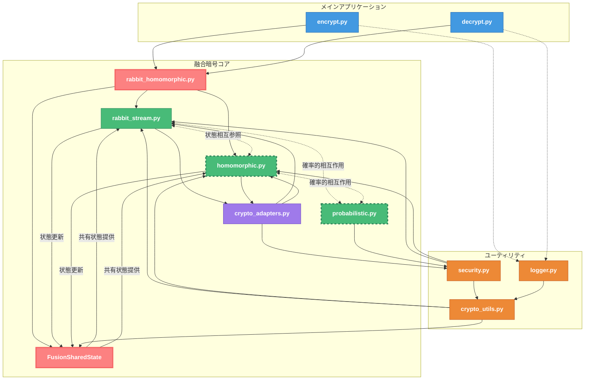

## 4. コンポーネント相関図 🔄

```mermaid
graph TD
    %% ノードスタイル定義
    classDef main fill:#4299E1,stroke:#2B6CB0,color:white,font-weight:bold
    classDef core fill:#48BB78,stroke:#2F855A,color:white,font-weight:bold
    classDef adapter fill:#9F7AEA,stroke:#6B46C1,color:white,font-weight:bold
    classDef util fill:#ED8936,stroke:#C05621,color:white,font-weight:bold
    classDef test fill:#F56565,stroke:#C53030,color:white,font-weight:bold
    classDef fusion fill:#FC8181,stroke:#F56565,color:white,font-weight:bold,stroke-width:3px
    classDef bidir stroke-dasharray: 5 5,stroke-width:3px

    %% メインファイル
    encrypt[encrypt.py]:::main
    decrypt[decrypt.py]:::main

    %% コアモジュール - 融合アーキテクチャを示す依存関係
    rabbitH[rabbit_homomorphic.py]:::fusion
    rabbitS[rabbit_stream.py]:::core
    homo[homomorphic.py]:::core

    %% 融合状態管理
    sharedState[FusionSharedState]:::fusion

    %% アダプターとユーティリティ
    adapter[crypto_adapters.py]:::adapter
    prob[probabilistic.py]:::core
    logger[logger.py]:::util
    security[security.py]:::util
    cryptoUtil[crypto_utils.py]:::util

    %% 依存関係定義 - 双方向の相互依存を示す
    encrypt --> rabbitH
    decrypt --> rabbitH

    encrypt -.-> logger
    decrypt -.-> logger

    %% 融合アーキテクチャの核心: 相互依存関係
    rabbitH --> rabbitS
    rabbitH --> homo
    rabbitH --> sharedState

    %% 真の融合を表現する双方向依存
    rabbitS <-.->|状態相互参照|homo:::bidir
    rabbitS -->|状態更新| sharedState
    homo -->|状態更新| sharedState
    sharedState -->|共有状態提供| rabbitS
    sharedState -->|共有状態提供| homo

    %% プロバビリスティック処理の双方向相互作用
    rabbitS <-.->|確率的相互作用| prob:::bidir
    homo <-.->|確率的相互作用| prob:::bidir

    %% アダプターと暗号コアの関係
    rabbitS --> adapter
    homo --> adapter
    adapter --> rabbitS
    adapter --> homo

    %% セキュリティモジュールの関係
    adapter --> security
    prob --> security
    security --> rabbitS
    security --> homo

    %% 共通ユーティリティ
    security --> cryptoUtil
    logger --> cryptoUtil
    cryptoUtil --> rabbitS
    cryptoUtil --> homo
    cryptoUtil --> sharedState

    %% サブグラフでグループ化
    subgraph メインアプリケーション
        encrypt
        decrypt
    end

    subgraph 融合暗号コア
        rabbitH
        sharedState
        rabbitS
        homo
        adapter
        prob
    end

    subgraph ユーティリティ
        logger
        security
        cryptoUtil
    end
```
