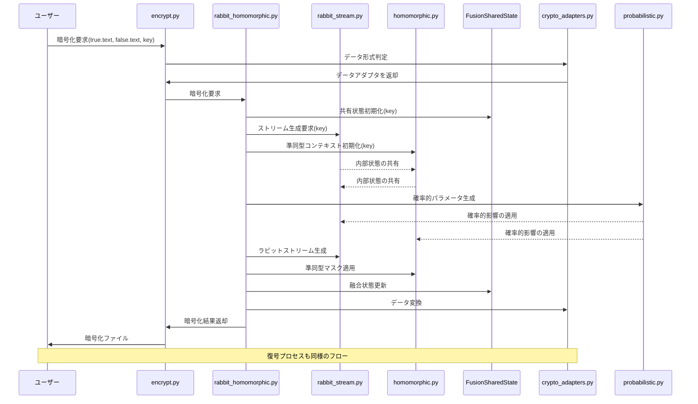

## 5. 処理シーケンス図 ⏱️

```mermaid
sequenceDiagram
    participant User as ユーザー
    participant Encrypt as encrypt.py
    participant RabbitH as rabbit_homomorphic.py
    participant RabbitS as rabbit_stream.py
    participant Homo as homomorphic.py
    participant Shared as FusionSharedState
    participant Adapter as crypto_adapters.py
    participant Prob as probabilistic.py

    %% 暗号化プロセス
    User->>Encrypt: 暗号化要求(true.text, false.text, key)
    Encrypt->>Adapter: データ形式判定
    Adapter->>Encrypt: データアダプタを返却
    Encrypt->>RabbitH: 暗号化要求
    RabbitH->>Shared: 共有状態初期化(key)

    %% ラビットストリーム生成と準同型初期化
    RabbitH->>RabbitS: ストリーム生成要求(key)
    RabbitH->>Homo: 準同型コンテキスト初期化(key)

    %% 相互参照設定
    RabbitS-->>Homo: 内部状態の共有
    Homo-->>RabbitS: 内部状態の共有

    %% 確率的処理
    RabbitH->>Prob: 確率的パラメータ生成
    Prob-->>RabbitS: 確率的影響の適用
    Prob-->>Homo: 確率的影響の適用

    %% データ処理と融合
    RabbitH->>RabbitS: ラビットストリーム生成
    RabbitH->>Homo: 準同型マスク適用
    RabbitH->>Shared: 融合状態更新

    %% 暗号化の実行
    RabbitH->>Adapter: データ変換
    RabbitH->>Encrypt: 暗号化結果返却
    Encrypt->>User: 暗号化ファイル

    %% 復号プロセス（省略表記）
    Note over User,Adapter: 復号プロセスも同様のフロー
```
