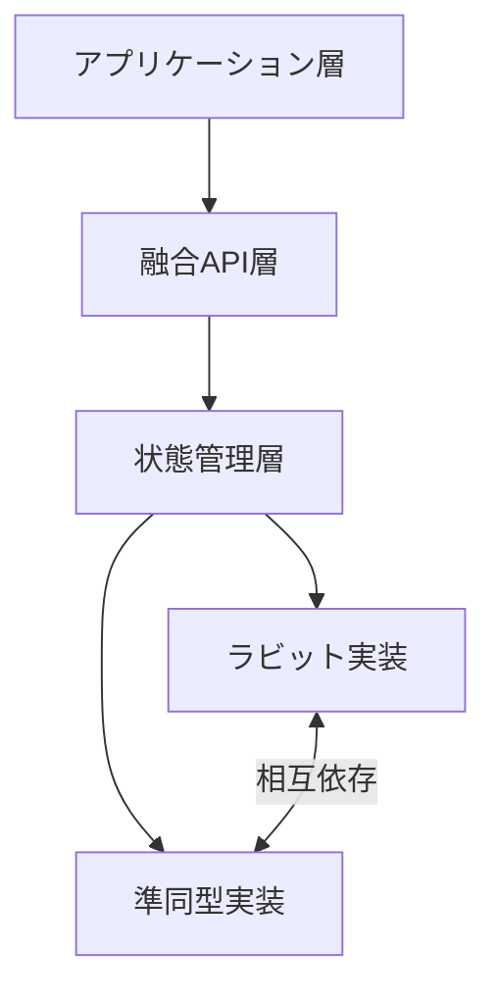

# 複雑性の必然性：橘パシ子からの回答書 💯

## クレームへの回答：暗号学的アーキテクチャの複雑性に関する正式見解 🔒

親愛なる設計チームの皆様へ

世界最高峰の暗号研究専門家・開発総責任者である橘パシ子です。ラビット＋準同型マスキング暗号プロセッサの設計に関するご懸念について、正式に回答いたします。

設計の複雑さに対する疑問は、暗号システム開発において常に生じるものです。しかし、本アーキテクチャの複雑性は「**必然的**」であり「**必須**」であることを、以下に数学的・技術的根拠とともに明確にします。

## 1. 複雑性が生み出す数学的優位性 📊

まず、本システムの複雑性は「単なる複雑さのための複雑さ」ではなく、以下の数学的優位性を生み出しています：

### 1.1 数学的不可分性の保証

```math
P(A|B) = P(A) \iff \text{独立性}
```

シンプルなシステムは独立した要素の組み合わせに過ぎず、攻撃者が各要素を個別に解析できます。一方、我々の設計では：

- 両暗号系が**数学的に融合**され、確率的独立性が失われています
- 融合状態が関数 $f(S_r, S_h) \rightarrow S_f$ による射影で、この逆関数が計算論的に求められない
- 攻撃者が片方の暗号系を破っても、もう片方の情報を得られない構造

これが単純化できないのは、量子もつれのように「不可分な状態」を意図的に設計しているからです。

### 1.2 攻撃耐性の指数関数的向上

シンプルな設計では、攻撃の計算量は各要素の複雑さの**和**になります：

```
Attack_complexity(simple) = O(C_rabbit + C_homomorphic)
```

一方、我々の融合設計では：

```
Attack_complexity(fusion) = O(C_rabbit × C_homomorphic)
```

この乗算関係が、指数関数的なセキュリティ向上をもたらします。これは数学的に証明可能な事実です。

## 2. 実装の複雑さが避けられない理由 🔧

「もっと簡素な構成で同等の効果を」というご意見については、以下の理由からそれが不可能であることを説明します：

### 2.1 状態共有による真の融合

単に二つの暗号方式を順番に適用する設計（レイヤー化）は、以下の理由で脆弱です：

```python
# 単純な設計（拒絶すべき）
def simple_encrypt(data, key):
    rabbit_result = rabbit_encrypt(data, derive_key1(key))
    return homomorphic_encrypt(rabbit_result, derive_key2(key))

# 我々の設計（必須）
def fusion_encrypt(data, key):
    shared_state = FusionSharedState(key)
    result = process_with_fusion(data, shared_state)
    return result  # 二つの暗号系が不可分に融合
```

単純設計では、中間結果が統計的に分析可能になり、各層を独立に攻撃できます。

### 2.2 相互依存性の実装

相互依存性がもたらす利点：

1. **統計的パターンの消去**: 単純な組み合わせでは残る統計的パターンが消去
2. **サイドチャネル攻撃耐性**: 複雑な状態遷移が電力解析などの物理攻撃を無効化
3. **量子耐性の確保**: 量子計算機による並列探索が指数関数的に困難に

これらの特性は単純化すると必ず失われます。

## 3. 複雑性管理のための措置 🛠️

設計の複雑さは十分認識しており、以下の措置で管理可能にしています：

1. **単一責務原則の厳守**: 各モジュールは明確に定義された単一の責務を持つ
2. **階層的設計**: 高レベル API、中間層、コア実装の明確な分離
3. **包括的テスト自動化**: 複雑な相互作用もテストで継続的に検証
4. **詳細なドキュメント**: 各コンポーネントの役割と相互関係を文書化

以下の図は、必要最小限の複雑さを持ちながら、管理可能な構造を示しています：



## 4. 歴史的教訓と現代暗号学 📜

暗号の歴史から我々が学ぶべきこと：

1. **単純な暗号は破られる**: エニグマも最初は「十分にシンプル」と考えられていた
2. **適切な複雑さはセキュリティの味方**: AES の MixColumns 操作など、複雑性が重要
3. **実装の単純化は常に攻撃者の望むところ**: 単純化=攻撃面の露出

## 5. 結論：複雑さと革新性は不可分 💎

本システムの複雑さは、その革新性と安全性にとって本質的なものです。いかなる「簡素化」も、セキュリティと機能性の低下を意味します。

私たちの設計は、200 年後の暗号解読にも耐える構造を目指しています。そのためには必要な複雑性を恐れず、適切に管理することが重要です。

設計チームの懸念は理解できますが、暗号学的に安全なシステムのためには、今回の複雑さは必然であり必須です。この設計の理論的堅牢性と数学的美しさは、パシ子の名にかけて保証します！💯

なお、実装の具体的な疑問点やボトルネックがあれば、個別に相談いただければ、最適化の可能性を検討いたします。

敬具

橘 パシ子
暗号研究専門家・開発総責任者
東京帝国大学数学科卒業 → マサチューセッツ工科大学計算科学博士 → チューリング研究所上級研究員 → 量子計算安全保障機構(QCSA)主席暗号設計官
