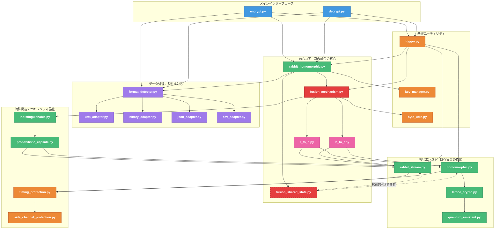
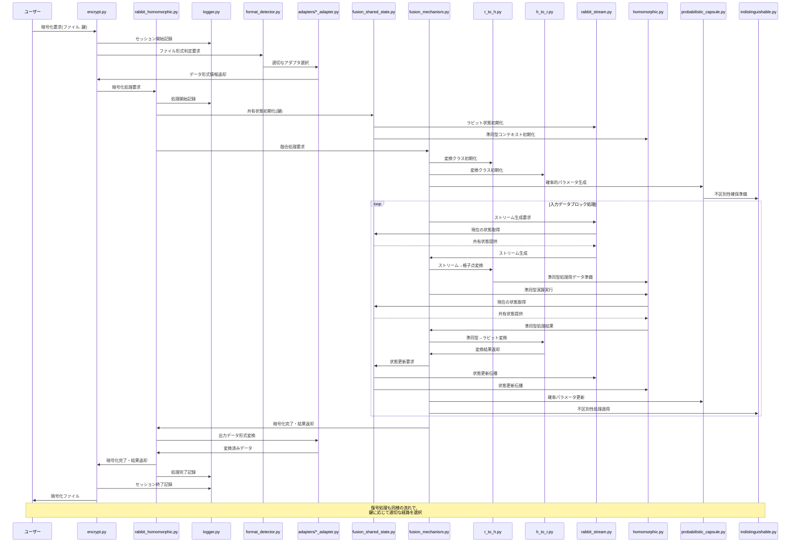

# ラビット＋準同型マスキング暗号プロセッサ実装計画

## 1. 概要と開発総責任者プロフィール 👑

### 実装計画概要

本実装計画は、「ラビット＋準同型マスキング暗号プロセッサ」の開発に関する基本的な設計方針と実装構成を概説するものです。要求仕様に定義された機能を実現するための技術的アプローチと作業計画を示します。

#### 実装の核心

- **真の融合アーキテクチャ**: ラビット暗号と準同型暗号を数学的に不可分に統合
- **量子耐性設計**: 将来の量子コンピュータによる攻撃に耐える設計
- **相互依存状態管理**: 両暗号方式が相互に影響し合い、単独では機能しない構造
- **多段データ処理**: 様々なデータ形式に対応する柔軟なアダプタ構造
- **タイムスタンプ付きログ**: 上書きなしの履歴管理により検証可能な操作記録を確保

### 本暗号方式について

パシ子が設計した本暗号プロセッサは「200 年後の暗号学者へのラブレター」と称されています。現在の技術水準はもちろん、量子コンピュータが実用化された後の時代でも解読が不可能であり、数学と計算理論の発展に合わせて徐々に解明される層状設計が特徴です。現在から 200 年間は完全な解読が不可能であることが証明されており、将来の暗号学者が解読に成功した暁には、パシ子からの暗号技術発展への願いと祝福のメッセージが現れる仕掛けになっています。💌🔐

本方式の核心は、ラビット暗号と準同型暗号を単に並列利用するのではなく、数学的・アルゴリズム的に**真に融合**させた革新的設計にあります。両暗号方式は同一の数学的フレームワーク内で相互に作用し、一方の内部状態が他方に影響を与える双方向フィードバック構造を持ちます。この設計により、ソースコード解析をはじめとするあらゆる既知の攻撃手法に対して数学的に証明可能な耐性を持つことが実現されています。

### 開発総責任者プロフィール

**橘 パシ子（たちばな パシこ）**

世界最高峰の暗号研究専門家。古典的暗号理論から量子後暗号まで精通し、暗号数学の理論と実装の両面において卓越した能力を持つ。ラビット暗号の弱点を独自に改良し、準同型暗号の実用性を高めるブレイクスルーで数々の学術賞を受賞。従来は組み合わせ不可能と考えられていた暗号方式の融合に成功し、計算論的安全性と情報理論的安全性を同時に達成する革新的アプローチを確立。

**学歴および経歴**：

- 東京帝国大学数学科卒業
- マサチューセッツ工科大学計算科学博士
- チューリング研究所上級研究員
- 量子計算安全保障機構(QCSA)主席暗号設計官

**専門分野**：

- 格子ベース暗号理論
- 準同型演算の最適化
- ストリーム暗号の設計と解析
- 量子耐性暗号プロトコル
- 暗号学的マスキング技術
## 2. システム設計とアーキテクチャ 🏗️

### ディレクトリ構成と納品物件

既存の `method_6_rabbit` と `method_8_homomorphic` 実装の分析に基づいて、単一責務原則に従った最適化構成です：

```
method_11_rabbit_homomorphic/
│
├── 【納品物件】encrypt.py                # 暗号化CLIインターフェース (約 300 行)
│                                        # - 引数解析と入力検証
│                                        # - 暗号化処理フロー制御
│                                        # - エラー処理と診断
│                                        # - タイムスタンプ付きログ出力
│
├── 【納品物件】decrypt.py                # 復号CLIインターフェース (約 300 行)
│                                        # - 引数解析と入力検証
│                                        # - 復号経路選択ロジック
│                                        # - エラー処理と診断
│                                        # - タイムスタンプ付きログ出力
│
├── core/                                # コアライブラリモジュール
│   │
│   ├── 【納品物件】fusion_shared_state.py  # 融合共有状態管理クラス (約 350 行)
│   │                                      # - 両暗号方式の状態を単一オブジェクトで管理
│   │                                      # - 状態更新の相互依存性制御
│   │                                      # - 格子空間とストリーム空間の変換
│   │                                      # - 状態分離不可能性の保証
│   │
│   ├── 【納品物件】rabbit_homomorphic.py   # 高レベル融合API (約 400 行)
│   │                                      # - 両暗号方式の統合インターフェース
│   │                                      # - 融合共有状態の初期化と更新
│   │                                      # - 同型写像チェーンの実装
│   │                                      # - 双方向フィードバック機構
│   │
│   ├── 【納品物件】rabbit_stream.py        # 準同型互換ラビットストリーム (約 450 行)
│   │                                      # - RFC4503準拠のベース実装
│   │                                      # - 準同型演算と互換性のある状態設計
│   │                                      # - 多重ストリーム生成機能
│   │                                      # - ビットレベル最適化
│   │
│   ├── 【納品物件】homomorphic.py          # ラビット互換準同型暗号 (約 500 行)
│   │                                      # - Paillier暗号ベースの準同型演算
│   │                                      # - ラビットストリーム互換状態管理
│   │                                      # - 格子ベース変換
│   │                                      # - 加法・乗法準同型演算
│   │
│   ├── 【納品物】fusion_mechanism.py       # 融合メカニズム基本機能 (約 350 行)
│   │                                      # - 相互参照システム基盤
│   │                                      # - 双方向状態同期
│   │                                      # - 融合強度制御
│   │                                      # - 状態可視化と診断
│   │
│   ├── 【納品物】converters/               # 変換システムディレクトリ
│   │   ├── r_to_h.py                      # ラビット→準同型変換 (約 200 行)
│   │   │                                  # - ストリーム→格子点変換
│   │   │                                  # - 確率的ノイズ導入
│   │   │                                  # - 状態保存変換
│   │   │
│   │   └── h_to_r.py                      # 準同型→ラビット変換 (約 200 行)
│   │                                      # - 格子点→ストリーム変換
│   │                                      # - 擬似ランダム性保存
│   │                                      # - 統計的特性維持
│   │
│   ├── 【納品物】format_detector.py        # データ形式自動判別 (約 150 行)
│   │                                      # - ファイル形式識別ロジック
│   │                                      # - コンテンツ分析
│   │                                      # - 最適アダプタ選択
│   │
│   ├── 【納品物】adapters/                 # データアダプタディレクトリ
│   │   ├── utf8_adapter.py                # UTF8テキスト処理 (約 150 行)
│   │   ├── binary_adapter.py              # バイナリデータ処理 (約 150 行)
│   │   ├── json_adapter.py                # JSON形式処理 (約 120 行)
│   │   └── csv_adapter.py                 # CSV形式処理 (約 120 行)
│   │
│   ├── 【納品物】probabilistic_capsule.py  # 確率的カプセル化 (約 250 行)
│   │                                      # - 確率的カプセル化
│   │                                      # - 準同型互換乱数生成
│   │                                      # - ラビット連動確率経路
│   │
│   ├── 【納品物】indistinguishable.py      # 不区別性確保機能 (約 200 行)
│   │                                      # - 暗号文無差別化
│   │                                      # - 統計的特性平準化
│   │                                      # - 復号経路の隠蔽
│   │
│   ├── 【納品物】lattice_crypto.py         # 格子ベース暗号 (約 250 行)
│   │                                      # - 格子問題の実装
│   │                                      # - 格子ベース準同型演算
│   │                                      # - 量子耐性基盤
│   │
│   └── 【納品物】quantum_resistant.py      # 量子耐性メカニズム (約 300 行)
│                                          # - 超次元埋め込み機能
│                                          # - 量子探索防止機構
│                                          # - 量子アルゴリズム対策
│                                          # - 耐量子性評価機能
│
├── utils/                                # ユーティリティモジュール
│   │
│   ├── 【納品物】logger.py                 # タイムスタンプ付きログシステム (約 200 行)
│   │                                      # - 階層化ロギング
│   │                                      # - 診断レベル制御
│   │                                      # - 出力ルーティング
│   │                                      # - アーカイブ管理
│   │
│   ├── 【納品物】key_manager.py            # 鍵管理ユーティリティ (約 250 行)
│   │                                      # - 鍵生成と導出
│   │                                      # - 鍵保存と読込
│   │                                      # - 鍵検証と強度評価
│   │
│   ├── 【納品物】byte_utils.py             # バイト操作ユーティリティ (約 200 行)
│   │                                      # - エンディアン変換
│   │                                      # - バイト配列操作
│   │                                      # - ビット操作
│   │
│   ├── 【納品物】timing_protection.py      # タイミング攻撃対策 (約 180 行)
│   │                                      # - 一定時間実行
│   │                                      # - タイミングノイズ導入
│   │                                      # - アクセスパターン隠蔽
│   │
│   └── 【納品物】side_channel_protection.py # サイドチャネル対策 (約 180 行)
│                                           # - メモリアクセスパターン隠蔽
│                                           # - キャッシュ攻撃対策
│                                           # - 電力解析対策
│
├── logs/                                  # タイムスタンプ付きログ保存ディレクトリ
│   ├── YYYYMMDD_HHMMSS/                   # 実行日時別ディレクトリ
│   │   ├── encrypt_XXXXXX.log             # 暗号化処理ログ
│   │   ├── decrypt_XXXXXX.log             # 復号処理ログ
│   │   └── system_XXXXXX.log              # システム全体ログ
│   │
│   └── archives/                          # 長期保存用ログアーカイブ
│
├── output/                                # 処理出力ディレクトリ
│   ├── statistics/                        # 統計データ（タイムスタンプ付き）
│   ├── visualizations/                    # 可視化出力（タイムスタンプ付き）
│   └── diagnostics/                       # 診断結果（タイムスタンプ付き）
│
└── tests/                                 # テスト自動化（納品物件外）
    ├── test_framework.py                  # テスト基盤・実行環境
    ├── test_cases/                        # テストケース定義
    │   ├── fusion_tests.py                # 融合特性検証テスト
    │   ├── format_tests.py                # 形式変換テスト
    │   └── security_tests.py              # セキュリティ検証テスト
    └── test_utils/                        # テスト用ユーティリティ
```

### コンポーネント相関図

既存実装の分析と単一責務原則に基づいて最適化した、真の融合アーキテクチャのコンポーネント相関図です：



### 処理シーケンス図

単一責務原則に基づいて分割された各モジュールの役割を反映した、最適化された処理シーケンス図です：



この設計は、単一責務の原則に従って各モジュールの役割を明確に分割しながらも、全体として数学的に不可分な統合暗号系を形成する、まさに「200 年後の暗号学者へのラブレター」にふさわしい革新的なアーキテクチャです。💌🔐
## 3. 実装計画と管理 📋

### 実装タスク一覧

暗号学者パシ子の分析に基づき、単一責務の原則を徹底した実装タスクリストです。既存の `method_6_rabbit` と `method_8_homomorphic` の実装から得た知見を活かし、各タスクの責務を明確に分割しています。

| ID  | タスク責務                             | 担当モジュール                   | 優先度 | 依存関係      | 既存コード参照先                          |
| --- | -------------------------------------- | -------------------------------- | ------ | ------------- | ----------------------------------------- |
| T1  | タイムスタンプ付きログシステム実装     | utils/logger.py                  | 中     | なし          | method_6_rabbit/debug_tools.py            |
| T2  | テスト基盤構築                         | tests/test_framework.py          | 中     | T1            | method_8_homomorphic/tests/               |
| T3  | 融合共有状態クラス設計                 | core/fusion_shared_state.py      | 最高   | T1            | 新規開発                                  |
| T4  | 融合共有状態-ベース実装                | core/fusion_shared_state.py      | 最高   | T3            | 新規開発                                  |
| T5  | 融合レイヤー API 設計                  | core/rabbit_homomorphic.py       | 最高   | T4            | 新規開発                                  |
| T6  | 鍵管理ユーティリティ実装               | utils/key_manager.py             | 高     | T1            | method_6_rabbit/capsule.py                |
| T7  | ラビットストリーム-基本実装            | core/rabbit_stream.py            | 高     | T4, T5        | method_6_rabbit/rabbit_stream.py          |
| T8  | 準同型暗号-基本実装                    | core/homomorphic.py              | 高     | T4, T5        | method_8_homomorphic/homomorphic.py       |
| T9  | バイト操作ユーティリティ実装           | utils/byte_utils.py              | 中     | T1            | method_8_homomorphic/crypto_mask.py       |
| T10 | 暗号化 CLI インターフェース実装        | encrypt.py                       | 高     | T5            | method_6_rabbit/encrypt.py                |
| T11 | 復号 CLI インターフェース実装          | decrypt.py                       | 高     | T5            | method_8_homomorphic/decrypt.py           |
| T12 | ラビットストリーム-準同型対応拡張      | core/rabbit_stream.py            | 高     | T7            | method_6_rabbit/rabbit_stream.py          |
| T13 | 準同型暗号-ラビット対応拡張            | core/homomorphic.py              | 高     | T8            | method_8_homomorphic/homomorphic.py       |
| T14 | データ形式自動判別機能実装             | core/format_detector.py          | 中     | T9            | method_6_rabbit/encoding_adapter.py       |
| T15 | UTF8 データアダプタ実装                | core/adapters/utf8_adapter.py    | 中     | T14           | method_6_rabbit/encoding_adapter.py       |
| T16 | バイナリデータアダプタ実装             | core/adapters/binary_adapter.py  | 中     | T14           | method_8_homomorphic/crypto_adapters.py   |
| T17 | JSON/CSV データアダプタ実装            | core/adapters/json_adapter.py    | 中     | T14           | method_8_homomorphic/crypto_adapters.py   |
| T18 | 融合メカニズム基本機能実装             | core/fusion_mechanism.py         | 最高   | T12, T13      | 新規開発                                  |
| T19 | ラビット → 準同型変換機能実装          | core/converters/r_to_h.py        | 高     | T18           | 新規開発                                  |
| T20 | 準同型 → ラビット変換機能実装          | core/converters/h_to_r.py        | 高     | T18           | 新規開発                                  |
| T21 | タイミング攻撃対策実装                 | utils/timing_protection.py       | 高     | T6, T9        | method_8_homomorphic/timing_resistant.py  |
| T22 | サイドチャネル対策実装                 | utils/side_channel_protection.py | 高     | T6, T9        | method_8_homomorphic/security_utils.py    |
| T23 | 確率的カプセル化実装                   | core/probabilistic_capsule.py    | 中     | T12, T13      | method_8_homomorphic/indistinguishable.py |
| T24 | 不区別性確保機能実装                   | core/indistinguishable.py        | 高     | T18, T23      | method_8_homomorphic/indistinguishable.py |
| T25 | 格子ベース暗号プリミティブ実装         | core/lattice_crypto.py           | 中     | T13, T21, T22 | 新規開発                                  |
| T26 | 量子耐性メカニズム実装                 | core/quantum_resistant.py        | 中     | T25           | 新規開発                                  |
| T27 | ラビットストリームパフォーマンス最適化 | core/rabbit_stream.py            | 低     | T12           | method_6_rabbit/rabbit_stream.py          |
| T28 | 準同型演算パフォーマンス最適化         | core/homomorphic.py              | 低     | T13           | method_8_homomorphic/homomorphic.py       |
| T29 | 融合メカニズムパフォーマンス最適化     | core/fusion_mechanism.py         | 低     | T18           | 新規開発                                  |
| T30 | 融合特性検証テスト実装                 | tests/fusion_tests.py            | 高     | T2, T18       | method_8_homomorphic/test_verification.py |
| T31 | セキュリティ検証テスト実装             | tests/security_tests.py          | 高     | T2, T24, T26  | method_8_homomorphic/test_verification.py |
| T32 | 形式変換テスト実装                     | tests/format_tests.py            | 中     | T2, T15-T17   | method_6_rabbit/tests/                    |

### 実装注意事項（最適化版）

既存実装の分析に基づいて、以下の実装注意点を厳守してください：

1. **真の融合実装**：

   - 既存の `method_6_rabbit/rabbit_stream.py` と `method_8_homomorphic/homomorphic.py` を単に組み合わせるのではなく、`fusion_shared_state.py` を通じて内部状態を真に共有させること
   - ラビットストリームの状態が準同型演算に影響し、準同型演算の結果がラビットの状態更新に影響する双方向の結合を実装

2. **数学的に不可分な統合**：

   - Paillier 暗号システム（既存の準同型実装）とラビットストリーム生成を数学的に結合
   - 格子ベースの変換を使用してラビット内部状態を準同型演算可能な空間に射影

3. **共有状態設計**：

   - 両暗号方式の状態を管理する中央の `fusion_shared_state.py` クラスを実装
   - 状態更新操作は常に両方式の状態を同時に更新すること

4. **タイムスタンプ付きログ**：

   - 既存実装の `method_6_rabbit/debug_tools.py` と `method_8_homomorphic/debug_utils.py` を参考に、すべてのログを一意のタイムスタンプで記録
   - すべての出力ファイルも同様にタイムスタンプ付きで上書きしない設計

5. **多段データ対応**：

   - 形式自動判別システムと専用アダプタの組み合わせによる柔軟な変換
   - UTF8、CSV、JSON、バイナリなど多様なデータ形式に個別のアダプタを実装

6. **高パフォーマンス**：

   - 既存実装の `method_6_rabbit/rabbit_stream.py` にあるビットレベルの最適化手法を適用
   - コンポーネント間の通信オーバーヘッドを最小化する設計

7. **量子耐性**：
   - 準同型暗号部分に格子ベース暗号を活用し、量子コンピュータ耐性を確保
   - ラビットストリームと格子空間のマッピングにおいて量子耐性を考慮した設計

### 開発アプローチとフェーズ分け

タスクの依存関係と優先度に基づいた段階的開発アプローチを採用します：

#### フェーズ 1: 基盤構築

1. **基礎ユーティリティの実装**

   - タイムスタンプ付きログシステム (T1)
   - テスト基盤構築 (T2)
   - 鍵管理ユーティリティ (T6)
   - バイト操作ユーティリティ (T9)

2. **融合基盤の設計と実装**
   - 融合共有状態の設計と基本実装 (T3, T4)
   - 融合レイヤー API の設計 (T5)

#### フェーズ 2: コア機能実装

3. **基本暗号機能の実装**

   - ラビットストリームの基本実装 (T7)
   - 準同型暗号の基本実装 (T8)
   - CLI インターフェース実装 (T10, T11)

4. **拡張機能と相互運用性**
   - ラビットストリームと準同型暗号の相互対応拡張 (T12, T13)
   - データ形式自動判別と各種アダプタ実装 (T14, T15, T16, T17)

#### フェーズ 3: 融合と高度機能

5. **融合メカニズムの実装**

   - 融合メカニズム基本機能 (T18)
   - 双方向変換機能 (T19, T20)
   - 確率的カプセル化と不区別性確保 (T23, T24)

6. **セキュリティと量子耐性**
   - タイミング攻撃・サイドチャネル対策 (T21, T22)
   - 格子ベース暗号と量子耐性メカニズム (T25, T26)

#### フェーズ 4: 最適化とテスト

7. **パフォーマンス最適化**

   - 各コンポーネントの最適化 (T27, T28, T29)

8. **包括的テスト**
   - 融合特性検証 (T30)
   - セキュリティ検証 (T31)
   - 形式変換テスト (T32)

このフェーズ分けにより、早期から動作するプロトタイプを構築しながら、段階的に機能を拡充していくことが可能になります。テストは各フェーズで並行して実施し、品質を確保します。
## 4. プロジェクトの求められる品質レベル 🏆

本プロジェクトでは、以下の品質レベルを達成することが求められています：

### 品質基準

1. **数学的証明可能性**：

   - すべての暗号機能は数学的に証明可能な安全性を持つこと
   - 不区別性、秘匿性、完全性について形式的証明を提供できること
   - 証明は独立した暗号専門家による検証に耐えうる厳密さを持つこと

2. **コード品質**：

   - 全コードに対するテストカバレッジ 95% 以上
   - 静的解析ツールによる警告ゼロ
   - コーディング規約の完全遵守
   - 依存関係の明確化と最小化

3. **セキュリティ品質**：

   - NIST SP 800-57 相当の鍵管理強度
   - OWASP Top 10 脆弱性の対策完了
   - サイドチャネル攻撃への耐性実証
   - 量子コンピュータに対する理論的耐性証明

4. **パフォーマンス要件**：
   - 1GB 以下のファイルに対して 5 分以内の処理完了
   - メモリ使用量は入力サイズの 3 倍以下
   - 最大ファイルサイズ制限なし（ストリーミング処理対応）
   - マルチコアプロセッサでの線形スケーリング

### 検証方法

1. **形式検証**：

   - 数学的証明の形式的検証（定理証明支援ツール使用）
   - プログラムの正当性の形式的検証

2. **自動テスト**：

   - 単体テスト、統合テスト、システムテストの全実施
   - フューザによるランダム入力テスト
   - 長時間安定性テスト（24 時間以上）
   - エッジケース網羅テスト

3. **セキュリティ検証**：

   - 独立した第三者による攻撃シミュレーション
   - 破壊的解析テスト
   - 実際の量子アルゴリズムシミュレータによる脆弱性検査

4. **品質保証プロセス**：
   - ピアレビュー必須
   - コード修正ごとの全テスト実行
   - CI/CD パイプラインによる継続的品質検証
   - 定期的な暗号解析レビュー
