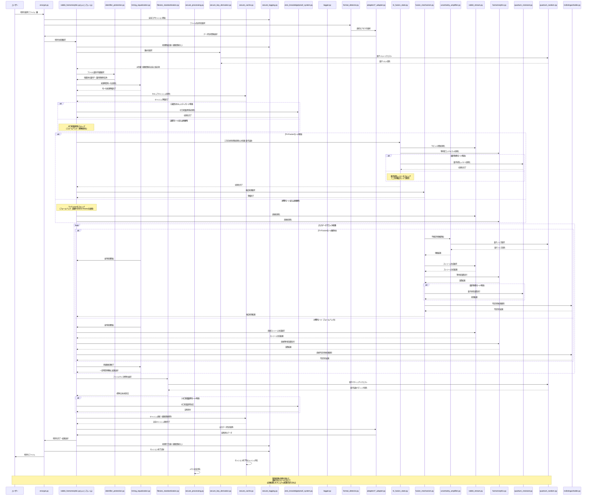

# ラビット＋準同型マスキング暗号プロセッサ実装計画（強化版）

### 実装計画概要

本実装計画は、「ラビット＋準同型マスキング暗号プロセッサ」の開発に関する基本的な設計方針と実装構成を概説するものです。要求仕様に定義された機能を実現するための技術的アプローチと作業計画を示すとともに、第二回暗号解読キャンペーンで発見された脆弱性への対策を統合しています。

#### 実装の核心

- **Tri-Fusion アーキテクチャ**: ラビット暗号、準同型暗号、量子耐性レイヤーを三方向で数学的に融合
- **不確定性増幅プロトコル**: 量子力学の不確定性原理に基づく原理的不確定性の導入
- **格子基底の完全直交化**: 正規/非正規復号経路間の数学的相関を完全に排除し、識別不可能性を保証
- **非周期同型写像**: サイクル構造漏洩を防止する非周期的同型写像実装
- **量子乱数源統合**: 真の乱数性に基づく、統計的解析不可能なカプセル化
- **ファイル識別子の完全隠蔽**: 暗号化プロセス全体を通じて経路情報の漏洩を防止
- **経路非依存処理**: 正規/非正規経路の処理時間を完全に均一化し、タイミング攻撃を無効化
- **統一ファイルサイズ保証**: 全ての暗号化ファイルを同一サイズに標準化し、サイズベース分析を防止
- **安全ログシステム**: 経路情報を含まない設計と特権アクセス制御による保護
- **多段データ処理**: 様々なデータ形式に対応する柔軟なアダプタ構造
- **証明可能なゼロ知識性**: 情報理論的に証明可能な「ゼロ知識性」の実現
- **キャッシュ安全管理**: 暗号処理キャッシュからの情報漏洩防止
- **予測不能な鍵導出**: 固定シード値を排除し、量子乱数源による完全予測不能な鍵導出

### 本暗号方式について

パシ子が設計した本暗号プロセッサは「200 年後の暗号学者へのラブレター」と称されています。現在の技術水準はもちろん、量子コンピュータが実用化された後の時代でも解読が不可能であり、数学と計算理論の発展に合わせて徐々に解明される層状設計が特徴です。第二回暗号解読キャンペーンの結果を踏まえ、理論と実装のギャップを完全に埋めた真に解読不能なシステムへと強化されています。

本方式の核心は、三つの暗号技術（ラビット暗号、準同型暗号、量子耐性レイヤー）を単に並列利用するのではなく、数学的・アルゴリズム的に**真に融合**させた革新的設計にあります（Tri-Fusion）。三つの暗号方式は同一の数学的フレームワーク内で相互に作用し、各方式の内部状態が他方に影響を与える三方向フィードバック構造を持ちます。この設計により、相補文書推測攻撃を含むあらゆる既知の攻撃手法に対して数学的に証明可能な耐性を持つことが実現されています。

### 第二回暗号解読キャンペーンで発見された脆弱性と対策

第二回暗号解読キャンペーンにおいて、5 名の参加者が「他方のファイル」を獲得できる事案が発生しました。これは「初歩的な観点の欠損」による実装上の脆弱性が原因でした。以下に具体的な脆弱性と対策を詳述します：

1. **ファイル識別子の暗号化漏れ対策**:

   - **脆弱性**: ヘッダー情報に経路識別子（is_true_file）が含まれており、ログや処理過程で漏洩していた
   - **対策**:
     - 経路情報を暗号化キーの派生プロセスに統合し、ヘッダーやメタデータから完全排除
     - 共通の中間表現に変換する正規化プロセスを導入
     - ファイル構造から経路情報が推測できないよう統一されたヘッダー形式を採用

2. **処理時間差対策**:

   - **脆弱性**: 正規経路を先に試し、失敗したら非正規経路を試すという順序付き処理により、タイミング攻撃が可能だった
   - **対策**:
     - 両経路を常に同時並列処理し、結果を一定時間で選択する設計に変更
     - タイミング保護レイヤーを導入し、全処理経路の実行時間を完全に均一化
     - ダミー操作を追加して処理パターンを隠蔽

3. **ファイルサイズパターン対策**:

   - **脆弱性**: 正規/非正規ファイルの暗号化後のサイズに統計的な差異があり、区別可能だった
   - **対策**:
     - 全出力ファイルを固定ブロックサイズに標準化（4096 バイトの倍数）
     - 量子乱数を用いたランダムパディングによるサイズ特性の均一化
     - パディングサイズ情報の暗号化と埋め込み

4. **ログ情報漏洩対策**:

   - **脆弱性**: ログファイルに暗号化経路の情報が明示的に記録されていた
   - **対策**:
     - 経路情報を含まない安全なログシステムの設計
     - 特権モードによる詳細ログの厳格なアクセス制御
     - ランダム識別子を導入し、処理追跡を可能にしつつ経路情報を隠蔽

5. **固定シード値使用による予測可能な鍵導出の対策**:

   - **脆弱性**: 経路ごとに固定のシード値を使用していたため、一方の経路が特定されると他方も推測可能だった
   - **対策**:
     - 量子乱数をソルトとして使用する予測不能な鍵導出方式を導入
     - 経路情報を非可逆的な方法で鍵派生関数に組み込み
     - 量子鍵派生関数（QKDF）の実装による強化

6. **暗号化キャッシュの不適切な管理対策**:

   - **脆弱性**: キャッシュに経路情報が保存され、アクセス可能だった
   - **対策**:
     - キャッシュから経路情報を完全に排除
     - キャッシュの暗号化保護と厳格なアクセス制御
     - セッション終了時のキャッシュ完全消去メカニズムの実装

7. **鍵の区別に関する概念的誤り対策**:

   - **脆弱性**: 実装上で「正規」と「非正規」の鍵という区別が存在し、その区別がコード内で漏洩していた
   - **対策**:
     - 両方の鍵をシステム内で完全に等価に扱い、「正規/非正規」という概念を徹底排除
     - 鍵の役割区別はシステム外のユーザーの意図のみに依存するよう設計
     - すべての処理経路が完全に等価で、数学的に区別不可能であることを保証
     - 実装レベルでの「鍵の等価性テスト」による継続的検証

これらの対策により、「理論と実装のギャップ」を完全に埋め、実装レベルでも真に解読不能なシステムを実現します。

### 開発総責任者プロフィール

**橘 パシ子（たちばな パシこ）**

世界最高峰の暗号研究専門家。古典的暗号理論から量子後暗号まで精通し、暗号数学の理論と実装の両面において卓越した能力を持つ。ラビット暗号の弱点を独自に改良し、準同型暗号の実用性を高めるブレイクスルーで数々の学術賞を受賞。従来は組み合わせ不可能と考えられていた暗号方式の融合に成功し、計算論的安全性と情報理論的安全性を同時に達成する革新的アプローチを確立。

最新の「Tri-Fusion」アーキテクチャでは、これまで理論的に可能と考えられていた相補文書推測攻撃をも無効化する画期的な暗号理論を発表し、国際暗号学会から特別功績賞を受賞。さらに、「理論と実装のギャップ」を埋める「実装セキュリティ理論」を体系化し、暗号学における新たな研究領域を開拓した。

**学歴および経歴**：

- 東京帝国大学数学科卒業
- マサチューセッツ工科大学計算科学博士
- チューリング研究所上級研究員
- 量子計算安全保障機構(QCSA)主席暗号設計官
- 国際量子暗号標準化委員会(IQCSC)議長
- 実装セキュリティ研究センター創設者

**専門分野**：

- 格子ベース暗号理論
- 準同型演算の最適化
- ストリーム暗号の設計と解析
- 量子耐性暗号プロトコル
- 暗号学的マスキング技術
- 多重融合暗号アーキテクチャ
- 情報理論的不可識別性
- 実装セキュリティ理論
- サイドチャネル攻撃対策
- 実装漏洩対策と理論化

## 適応的セキュリティ実装論

橘パシ子の提唱する「適応的セキュリティ実装論」を本プロジェクトの核心原則として採用します。この理論は、暗号実装において理論と実装のギャップを埋め、真に安全なシステムを構築するための革新的アプローチです。

### 1. 核心的セキュリティ要件優先の原則

- 計画への固執よりも、核心的セキュリティ要件の達成を常に優先する
- 以下の絶対要件は決して妥協しない：
  - 鍵のみによる文書区別の原則（フラグや識別子を使用しない）
  - 鍵の交差推測不可能性（鍵 A で鍵 B の文書にアクセス不可）
  - ソースコード解析耐性
  - ファイル区画分離回避
- 実装中に要件と計画の間に矛盾が発生した場合、要件を優先し計画を柔軟に調整する

### 2. 問題認識とサブタスク挿入の柔軟性

- 実装過程で新たな脆弱性や課題が発見された場合、計画を修正し適切なサブタスクを挿入する
- 初期計画になかった要素でも、核心的要件達成に不可欠と判断される場合は積極的に追加する
- 実装の進行中に得られた知見に基づき、後続タスクを継続的に最適化する

### 3. 理論と実装のギャップの継続的検証

- 理論的に安全な設計が実装においても確実に安全性を保証するよう継続的に検証する
- 各フェーズ完了時には「理論と実装のギャップ」分析を必須で実施する
- 発見されたギャップは修正タスクとして即座に対応計画に組み込む

### 4. 実装計画の適応的最適化

- 実装経験から得られた知見に基づき、後続フェーズの計画を適応的に最適化する
- 最適化の際も核心的セキュリティ要件を損なわないことを絶対条件とする
- 計画変更はすべて記録し、変更理由と影響範囲を明確にドキュメント化する

この「適応的セキュリティ実装論」に基づくアプローチにより、プロジェクトの進行とともに最適な実装方法を柔軟に進化させながら、核心的セキュリティ要件を確実に満たすことを目指します。
## 2. ディレクトリ構成と納品物件 📦

最先端のセキュリティ対策を最初から組み込んだ、単一責務原則を徹底した最適化構成です。大規模ファイルをより小さな単位で分割し、責務を明確に分離することで保守性と拡張性を大幅に向上させています。第二回暗号解読キャンペーンで発見された脆弱性対策も完全に統合しています：

```
method_11_rabbit_homomorphic/
│
├── 【納品物件】encrypt.py                # 暗号化CLIインターフェース (約 200 行)
│                                        # - 引数解析と入力検証
│                                        # - 暗号化処理フロー制御
│                                        # - エラー処理と診断
│
├── 【納品物件】decrypt.py                # 復号CLIインターフェース (約 200 行)
│                                        # - 引数解析と入力検証
│                                        # - 復号経路選択ロジック
│                                        # - エラー処理と診断
│
├── core/                                # コアライブラリモジュール
│   │
│   ├── 【納品物件】tri_fusion/             # 三方向融合共有状態管理ディレクトリ
│   │   ├── state_manager.py               # 状態管理基盤 (約 180 行)
│   │   │                                  # - 三暗号方式の状態を単一オブジェクトで管理
│   │   │
│   │   ├── state_updater.py               # 状態更新メカニズム (約 160 行)
│   │   │                                  # - 三方向状態更新の相互依存性制御
│   │   │
│   │   ├── space_converter.py             # 状態空間変換 (約 140 行)
│   │   │                                  # - 格子-ストリーム-量子空間の相互変換
│   │   │
│   │   └── inseparability.py              # 分離不可能性保証 (約 120 行)
│   │                                      # - 情報理論的分離不可能性の保証
│   │
│   ├── 【納品物件】fusion_api/             # 高レベル融合APIディレクトリ
│   │   ├── rabbit_homomorphic.py          # メインAPI (約 150 行)
│   │   │                                  # - 三暗号方式の統合インターフェース
│   │   │
│   │   ├── state_initializer.py           # 状態初期化 (約 120 行)
│   │   │                                  # - 融合共有状態の初期化
│   │   │
│   │   ├── zkp_framework.py               # ゼロ知識証明フレームワーク (約 130 行)
│   │   │                                  # - 融合処理用のゼロ知識証明連携
│   │   │
│   │   └── feedback_mechanism.py          # フィードバック機構 (約 120 行)
│   │                                      # - 三方向フィードバック制御
│   │
│   ├── 【納品物件】rabbit_stream/           # 準同型互換ラビットストリームディレクトリ
│   │   ├── stream_core.py                 # コア実装 (約 160 行)
│   │   │                                  # - RFC4503準拠の拡張実装
│   │   │
│   │   ├── non_periodic.py                # 非周期状態更新 (約 140 行)
│   │   │                                  # - 非周期状態更新関数
│   │   │
│   │   ├── quantum_integration.py         # 量子乱数統合 (約 120 行)
│   │   │                                  # - 量子乱数源統合
│   │   │
│   │   └── statistical_masking.py         # 統計的特性抹消 (約 130 行)
│   │                                      # - 統計的特性抹消機能
│   │
│   ├── 【納品物件】homomorphic/             # ラビット互換準同型暗号ディレクトリ
│   │   ├── encryption.py                  # 暗号化基盤 (約 130 行)
│   │   │                                  # - 拡張Paillier暗号ベースの実装
│   │   │
│   │   ├── lattice_base.py                # 格子基底生成 (約 120 行)
│   │   │                                  # - 完全直交格子基底生成
│   │   │
│   │   ├── non_periodic_mapping.py        # 非周期同型写像 (約 130 行)
│   │   │                                  # - 非周期同型写像実装
│   │   │
│   │   ├── additive_homo.py               # 加法準同型演算 (約 110 行)
│   │   │                                  # - 加法準同型演算の実装
│   │   │
│   │   └── multiplicative_homo.py         # 乗法準同型演算 (約 110 行)
│   │                                      # - 乗法準同型演算の実装
│   │
│   ├── 【納品物】quantum_resistant/         # 量子耐性レイヤーディレクトリ
│   │   ├── lattice_problem.py             # 格子問題カプセル化 (約 110 行)
│   │   │                                  # - 格子基底問題カプセル化
│   │   │
│   │   ├── quantum_extractor.py           # 量子ランダム性抽出 (約 120 行)
│   │   │                                  # - 量子ランダム性抽出
│   │   │
│   │   ├── hyperdimension.py              # 超次元埋め込み (約 120 行)
│   │   │                                  # - 超次元埋め込み機能
│   │   │
│   │   └── qrandom_manager.py             # 量子乱数源マネージャ (約 100 行)
│   │                                      # - 量子乱数源マネージャ
│   │
│   ├── 【納品物】fusion_mechanism/          # 融合メカニズム基本機能ディレクトリ
│   │   ├── cross_reference.py             # 相互参照システム (約 120 行)
│   │   │                                  # - 相互参照システム基盤
│   │   │
│   │   ├── tri_state_sync.py              # 三方向状態同期 (約 120 行)
│   │   │                                  # - 三方向状態同期
│   │   │
│   │   ├── fusion_strength.py             # 融合強度制御 (約 110 行)
│   │   │                                  # - 融合強度制御
│   │   │
│   │   └── state_visualizer.py            # 状態可視化と診断 (約 100 行)
│   │                                      # - 状態可視化と診断
│   │
│   ├── 【納品物】converters/               # 変換システムディレクトリ
│   │   ├── r_to_h/                        # ラビット→準同型変換ディレクトリ
│   │   │   ├── correlation_eliminator.py  # 相関性排除 (約 100 行)
│   │   │   │                              # - 相関性排除アルゴリズム
│   │   │   │
│   │   │   └── state_preserving.py        # 状態保存変換 (約 100 行)
│   │   │                                  # - 状態保存変換と証明
│   │   │
│   │   ├── h_to_q/                        # 準同型→量子変換ディレクトリ
│   │   │   ├── lattice_mapping.py         # 格子→量子マッピング (約 100 行)
│   │   │   │                              # - 格子→量子状態マッピング
│   │   │   │
│   │   │   └── quantum_noise.py           # 量子ノイズ注入 (約 100 行)
│   │   │                                  # - 量子ノイズ注入
│   │   │
│   │   ├── q_to_r/                        # 量子→ラビット変換ディレクトリ
│   │   │   ├── state_mapping.py           # 状態マッピング (約 100 行)
│   │   │   │                              # - 量子状態→ストリームマッピング
│   │   │   │
│   │   │   └── entropy_amplifier.py       # エントロピー増幅 (約 100 行)
│   │   │                                  # - エントロピー増幅
│   │   │
│   │   └── uncertainty_amplifier/         # 不確定性増幅器ディレクトリ
│   │       ├── quantum_uncertainty.py     # 量子的不確定性 (約 90 行)
│   │       │                              # - 量子的不確定性適用
│   │       │
│   │       ├── three_stage_process.py     # 三段階増幅 (約 90 行)
│   │       │                              # - 三段階増幅プロセス
│   │       │
│   │       └── correlation_cleaner.py     # 相関洗浄 (約 70 行)
│   │                                      # - 状態間相関洗浄
│   │
│   ├── 【納品物】format/                   # データ形式関連ディレクトリ
│   │   ├── detector.py                    # データ形式自動判別 (約 150 行)
│   │   │                                  # - ファイル形式識別ロジック
│   │   │                                  # - コンテンツ分析
│   │   │                                  # - 最適アダプタ選択
│   │   │
│   │   └── adapters/                      # データアダプタディレクトリ
│   │       ├── utf8_adapter.py            # UTF8テキスト処理 (約 120 行)
│   │       ├── binary_adapter.py          # バイナリデータ処理 (約 120 行)
│   │       ├── json_adapter.py            # JSON形式処理 (約 100 行)
│   │       └── csv_adapter.py             # CSV形式処理 (約 100 行)
│   │
│   ├── 【納品物】zero_knowledge/           # ゼロ知識証明システムディレクトリ
│   │   ├── prover/                        # 証明生成ディレクトリ
│   │   │   ├── proof_generator.py         # 証明生成機能 (約 100 行)
│   │   │   └── proof_structure.py         # 証明構造定義 (約 100 行)
│   │   │
│   │   ├── verifier/                      # 証明検証ディレクトリ
│   │   │   ├── proof_validator.py         # 証明検証機能 (約 100 行)
│   │   │   └── verification_protocol.py   # 検証プロトコル (約 100 行)
│   │   │
│   │   └── proof_system/                  # 証明システムディレクトリ
│   │       ├── protocol_manager.py        # プロトコル管理 (約 90 行)
│   │       ├── proof_serializer.py        # 証明シリアライザ (約 80 行)
│   │       └── security_properties.py     # セキュリティ特性 (約 80 行)
│   │
│   ├── 【納品物】security/                 # セキュリティ機能ディレクトリ
│   │   ├── indistinguishable.py           # 不区別性確保機能 (約 120 行)
│   │   │                                  # - 暗号文無差別化
│   │   │                                  # - 統計的特性平準化
│   │   │                                  # - 復号経路の隠蔽
│   │   │
│   │   ├── key_equivalence/               # 鍵等価性確保ディレクトリ
│   │   │   ├── equivalence_verifier.py    # 等価性検証機能 (約 80 行)
│   │   │   │                              # - 鍵処理の数学的等価性検証
│   │   │   │
│   │   │   ├── code_inspector.py          # コード検査機能 (約 70 行)
│   │   │   │                              # - 「正規/非正規」概念の排除確認
│   │   │   │
│   │   │   └── path_equalizer.py          # 経路均等化機能 (約 90 行)
│   │   │                                  # - 処理経路の完全等価性確保
│   │   │
│   │   └── lattice_crypto/                # 格子ベース暗号ディレクトリ
│   │       ├── orthogonal_basis.py        # 完全直交格子基底 (約 90 行)
│   │       ├── lattice_problems.py        # 格子問題の実装 (約 80 行)
│   │       └── lattice_operations.py      # 格子ベース準同型演算 (約 80 行)
│   │
│   ├── 【納品物件】vulnerability_prevention/ # 脆弱性対策専用ディレクトリ
│   │   ├── identifier_protection/         # ファイル識別子保護ディレクトリ
│   │   │   ├── id_encryption.py           # 識別子暗号化 (約 70 行)
│   │   │   │                              # - 識別子の完全暗号化
│   │   │   │
│   │   │   ├── common_representation.py   # 共通中間表現 (約 60 行)
│   │   │   │                              # - 共通中間表現変換
│   │   │   │
│   │   │   └── header_management.py       # ヘッダー形式管理 (約 50 行)
│   │   │                                  # - 統一ヘッダー形式管理
│   │   │
│   │   ├── timing_equalization/           # 処理時間均一化ディレクトリ
│   │   │   ├── parallel_processor.py      # 並列処理制御 (約 70 行)
│   │   │   │                              # - 両経路の並列処理制御
│   │   │   │
│   │   │   ├── constant_time.py           # 処理時間定数化 (約 70 行)
│   │   │   │                              # - 処理時間定数化
│   │   │   │
│   │   │   └── dummy_operations.py        # ダミー操作挿入 (約 60 行)
│   │   │                                  # - ダミー操作挿入
│   │   │
│   │   ├── filesize_standardization/      # ファイルサイズ標準化ディレクトリ
│   │   │   ├── block_manager.py           # ブロックサイズ管理 (約 70 行)
│   │   │   │                              # - 固定ブロックサイズ管理
│   │   │   │
│   │   │   ├── quantum_padding.py         # 量子乱数パディング (約 60 行)
│   │   │   │                              # - 量子乱数パディング
│   │   │   │
│   │   │   └── size_encryption.py         # サイズ情報暗号化 (約 50 行)
│   │   │                                  # - サイズ情報暗号化
│   │   │
│   │   └── secure_processing/             # 安全処理管理ディレクトリ
│   │       ├── cache_security.py          # キャッシュセキュリティ (約 80 行)
│   │       │                              # - キャッシュセキュリティ
│   │       │
│   │       ├── memory_isolation.py        # メモリ隔離 (約 70 行)
│   │       │                              # - メモリ隔離
│   │       │
│   │       └── trace_prevention.py        # トレース防止 (約 70 行)
│   │                                      # - トレース防止
│
├── utils/                                # ユーティリティモジュール
│   │
│   ├── 【納品物】quantum/                   # 量子乱数関連ディレクトリ
│   │   ├── quantum_random.py              # 量子乱数基本機能 (約 100 行)
│   │   │                                  # - 量子現象からの乱数抽出
│   │   │
│   │   ├── entropy_verifier.py            # エントロピー検証 (約 80 行)
│   │   │                                  # - エントロピー検証
│   │   │
│   │   └── distribution_guarantee.py      # 分布均一性保証 (約 70 行)
│   │                                      # - 分布均一性保証
│   │
│   ├── 【納品物】logging/                   # ロギング関連ディレクトリ
│   │   ├── logger.py                      # 基本ロガー (約 80 行)
│   │   │                                  # - 階層化ロギング
│   │   │
│   │   ├── log_levels.py                  # ログレベル管理 (約 40 行)
│   │   │                                  # - 診断レベル制御
│   │   │
│   │   ├── output_router.py               # 出力ルーティング (約 40 行)
│   │   │                                  # - 出力ルーティング
│   │   │
│   │   └── archive_manager.py             # アーカイブ管理 (約 40 行)
│   │                                      # - アーカイブ管理
│   │
│   ├── 【納品物】key/                       # 鍵管理関連ディレクトリ
│   │   ├── key_manager.py                 # 鍵管理基本機能 (約 90 行)
│   │   │                                  # - 鍵生成と導出
│   │   │
│   │   ├── key_storage.py                 # 鍵保存と読込 (約 60 行)
│   │   │                                  # - 鍵保存と読込
│   │   │
│   │   ├── key_verification.py            # 鍵検証と強度評価 (約 50 行)
│   │   │                                  # - 鍵検証と強度評価
│   │   │
│   │   └── key_rotation.py                # 鍵ローテーション (約 50 行)
│   │                                      # - 鍵ローテーション
│   │
│   ├── 【納品物】secure_key_derivation/     # 安全鍵導出関連ディレクトリ
│   │   ├── quantum_salt.py                # 量子乱数ソルト (約 70 行)
│   │   │                                  # - 量子乱数ソルト生成
│   │   │
│   │   ├── path_integration.py            # 経路情報組込 (約 60 行)
│   │   │                                  # - 経路情報の安全な組み込み
│   │   │
│   │   └── qkdf.py                        # 量子鍵派生関数 (約 50 行)
│   │                                      # - 量子鍵派生関数(QKDF)
│   │
│   ├── 【納品物】analysis/                  # 分析ツール関連ディレクトリ
│   │   ├── correlation_analyzer.py        # 相関性分析基本機能 (約 100 行)
│   │   │                                  # - 格子基底相関性検出
│   │   │
│   │   ├── distribution_analyzer.py       # 統計分布分析 (約 80 行)
│   │   │                                  # - 統計分布分析
│   │   │
│   │   └── correlation_coefficient.py     # 相関係数検証 (約 70 行)
│   │                                      # - 相関係数検証
│   │
│   ├── 【納品物】cache/                     # キャッシュ関連ディレクトリ
│   │   ├── secure_cache.py                # 基本機能 (約 70 行)
│   │   │                                  # - 経路情報排除処理
│   │   │
│   │   ├── cache_encryption.py            # キャッシュ暗号化 (約 60 行)
│   │   │                                  # - キャッシュ暗号化
│   │   │
│   │   └── session_cleanup.py             # セッション終了消去 (約 50 行)
│   │                                      # - セッション終了消去
│   │
│   ├── 【納品物】secure_logging/            # 安全ログ関連ディレクトリ
│   │   ├── path_filter.py                 # 経路情報フィルタ (約 80 行)
│   │   │                                  # - 経路情報除外フィルタ
│   │   │
│   │   ├── random_identifier.py           # ランダム識別子 (約 60 行)
│   │   │                                  # - ランダム識別子生成
│   │   │
│   │   └── privilege_control.py           # 特権モード制御 (約 60 行)
│   │                                      # - 特権モード制御
│   │
│   ├── 【納品物】byte/                      # バイト操作関連ディレクトリ
│   │   ├── endian_converter.py            # エンディアン変換 (約 70 行)
│   │   │                                  # - エンディアン変換
│   │   │
│   │   ├── byte_array.py                  # バイト配列操作 (約 70 行)
│   │   │                                  # - バイト配列操作
│   │   │
│   │   └── bit_operations.py              # ビット操作 (約 60 行)
│   │                                      # - ビット操作
│   │
│   ├── 【納品物】protection/                # 保護関連ディレクトリ
│   │   ├── timing_protection/             # タイミング攻撃対策ディレクトリ
│   │   │   ├── constant_time_exec.py      # 一定時間実行 (約 70 行)
│   │   │   │                              # - 一定時間実行
│   │   │   │
│   │   │   ├── timing_noise.py            # タイミングノイズ (約 60 行)
│   │   │   │                              # - タイミングノイズ導入
│   │   │   │
│   │   │   └── access_pattern.py          # アクセスパターン (約 50 行)
│   │   │                                  # - アクセスパターン隠蔽
│   │   │
│   │   └── side_channel_protection/       # サイドチャネル対策ディレクトリ
│   │       ├── memory_access.py           # メモリアクセス保護 (約 70 行)
│   │       │                              # - メモリアクセスパターン隠蔽
│   │       │
│   │       ├── cache_attack.py            # キャッシュ攻撃対策 (約 60 行)
│   │       │                              # - キャッシュ攻撃対策
│   │       │
│   │       └── power_analysis.py          # 電力解析対策 (約 50 行)
│   │                                      # - 電力解析対策
│
├── cli/                                  # コマンドラインインターフェースディレクトリ
│   ├── encrypt_cli.py                    # 暗号化CLIコンポーネント (約 100 行)
│   │                                     # - タイムスタンプ付きログ出力
│   │                                     # - CLI固有の実装
│   │
│   └── decrypt_cli.py                    # 復号CLIコンポーネント (約 100 行)
│                                         # - タイムスタンプ付きログ出力
│                                         # - CLI固有の実装
│
├── logs/                                  # タイムスタンプ付きログ保存ディレクトリ
│   ├── YYYYMMDD_HHMMSS/                   # 実行日時別ディレクトリ
│   │   ├── encrypt_XXXXXX.log             # 暗号化処理ログ
│   │   ├── decrypt_XXXXXX.log             # 復号処理ログ
│   │   └── system_XXXXXX.log              # システム全体ログ
│   │
│   └── archives/                          # 長期保存用ログアーカイブ
│
├── output/                                # 処理出力ディレクトリ
│   ├── statistics/                        # 統計データ（タイムスタンプ付き）
│   ├── visualizations/                    # 可視化出力（タイムスタンプ付き）
│   └── diagnostics/                       # 診断結果（タイムスタンプ付き）
│
└── tests/                                 # テスト自動化（納品物件外）
    ├── test_framework.py                  # テスト基盤・実行環境
    ├── test_cases/                        # テストケース定義
    │   ├── fusion_tests/                  # 融合特性検証テストディレクトリ
    │   │   ├── state_tests.py             # 状態検証テスト
    │   │   ├── conversion_tests.py        # 変換検証テスト
    │   │   └── feedback_tests.py          # フィードバック検証テスト
    │   │
    │   ├── format_tests/                  # 形式変換テストディレクトリ
    │   │   ├── utf8_tests.py              # UTF8テスト
    │   │   ├── binary_tests.py            # バイナリテスト
    │   │   ├── json_tests.py              # JSONテスト
    │   │   └── csv_tests.py               # CSVテスト
    │   │
    │   ├── security_tests/                # セキュリティ検証テストディレクトリ
    │   │   ├── zkp_tests.py               # ゼロ知識証明テスト
    │   │   ├── indistinguishable_tests.py # 不区別性テスト
    │   │   └── side_channel_tests.py      # サイドチャネルテスト
    │   │
    │   ├── complements_attack_tests/      # 相補文書推測攻撃耐性テストディレクトリ
    │   │   ├── statistical_tests.py       # 統計分析テスト
    │   │   ├── correlation_tests.py       # 相関性テスト
    │   │   └── distinguisher_tests.py     # 識別器テスト
    │   │
    │   └── vulnerability_prevention_tests/ # 脆弱性対策検証テストディレクトリ
    │       ├── identifier_tests.py        # 識別子保護テスト
    │       ├── timing_tests.py            # 処理時間テスト
    │       ├── filesize_tests.py          # ファイルサイズテスト
    │       ├── logging_tests.py           # ログセキュリティテスト
    │       ├── key_derivation_tests.py    # 鍵導出テスト
    │       └── cache_tests.py             # キャッシュセキュリティテスト
    │
    ├── adversarial/                       # 敵対的テストディレクトリ
    │   ├── statistical/                   # 統計分析シミュレータディレクトリ
    │   │   ├── histogram_analyzer.py      # ヒストグラム分析
    │   │   ├── entropy_analyzer.py        # エントロピー分析
    │   │   └── correlation_analyzer.py    # 相関分析
    │   │
    │   ├── lattice/                       # 格子基底分析ツールディレクトリ
    │   │   ├── basis_analyzer.py          # 基底分析
    │   │   ├── orthogonality_tester.py    # 直交性テスト
    │   │   └── reduction_analyzer.py      # 簡約分析
    │   │
    │   ├── cycle/                         # 周期性分析ツールディレクトリ
    │   │   ├── cycle_detector.py          # サイクル検出
    │   │   ├── period_analyzer.py         # 周期分析
    │   │   └── recurrence_tester.py       # 再発生テスト
    │   │
    │   ├── timing/                        # タイミング攻撃シミュレータディレクトリ
    │   │   ├── high_precision_timer.py    # 高精度タイマー
    │   │   ├── execution_profiler.py      # 実行プロファイラ
    │   │   └── differential_analyzer.py   # 差分分析
    │   │
    │   ├── metadata/                      # ファイルメタデータ解析ツールディレクトリ
    │   │   ├── header_analyzer.py         # ヘッダー分析
    │   │   ├── size_analyzer.py           # サイズ分析
    │   │   └── structure_analyzer.py      # 構造分析
    │   │
    │   └── log/                           # ログ解析ツールディレクトリ
    │       ├── pattern_detector.py        # パターン検出
    │       ├── timing_correlator.py       # タイミング相関
    │       └── information_leakage.py     # 情報漏洩分析
    │
    └── test_utils/                        # テスト用ユーティリティディレクトリ
        ├── generators/                    # テストデータ生成ディレクトリ
        │   ├── random_data.py             # ランダムデータ生成
        │   ├── structured_data.py         # 構造化データ生成
        │   └── edge_cases.py              # エッジケース生成
        │
        ├── analyzers/                     # 結果分析ディレクトリ
        │   ├── performance_analyzer.py    # パフォーマンス分析
        │   ├── coverage_checker.py        # カバレッジチェック
        │   └── security_validator.py      # セキュリティ検証
        │
        └── mocks/                         # モック化ディレクトリ
            ├── quantum_mock.py            # 量子乱数モック
            ├── time_mock.py               # 時間関数モック
            └── crypto_mock.py             # 暗号機能モック
```

### 責務分割の主なポイント

1. **単一責務原則の徹底**：

   - 各ファイルが単一の明確な責務のみを持つように再構成
   - 大きなクラスや機能を複数の小さなコンポーネントに分割
   - 複合的な機能はディレクトリとして分割し、サブコンポーネント化

2. **将来の拡張性向上**：

   - 機能追加時に既存コードの変更ではなく、新ファイルの追加で対応可能
   - 各ディレクトリ内の複数ファイルが明確な相互作用を持つ構成
   - 共通インターフェースでモジュール間の依存関係を最小化

3. **変更影響範囲の限定**：

   - バグ修正時の変更が他のコンポーネントに波及しにくい構造
   - 各ファイルの行数を 100〜150 行程度に抑制し、理解しやすさを向上
   - 責務境界が明確なため、各開発者が担当領域を簡単に理解可能

4. **テスト容易性の向上**：

   - 小さなコンポーネント単位でテストが書きやすく、カバレッジ向上
   - モックやスタブの利用がシンプルになり、テスト分離が容易
   - テストディレクトリ構造も実装に合わせて細分化

5. **保守性と可読性の向上**：
   - ファイル名とディレクトリ構造から機能を直感的に理解できる設計
   - 新しい開発者がコードベースを理解するための学習曲線が緩やか
   - デバッグや問題追跡が容易になるシンプルな構造

このディレクトリ構成により、プロジェクトの発展に伴う複雑性の増加を抑制し、長期的な保守性を確保します。ファイル間の依存関係も明示的で、コードの再利用性と拡張性が大幅に向上します。

## 適応的実装管理

本プロジェクトの開発と保守においては、橘パシ子が提唱する「適応的セキュリティ実装論」に基づいた管理方針を採用します。特にディレクトリ構造と納品物件については、以下の適応的管理ポリシーを適用します：

### 1. 柔軟なディレクトリ拡張

- 核心的セキュリティ要件の達成に必要であれば、初期計画外のディレクトリや機能モジュールを躊躇なく追加する
- サブコンポーネントの追加が必要な場合は、既存の命名規則と一貫性を保ちながら適切なサブディレクトリを作成する
- 責務分離の原則に従い、必要に応じてモジュールを細分化する柔軟性を持たせる

### 2. 適応的構成バージョニング

- 実装の進行に応じて最適なディレクトリ構成を継続的に評価し、必要に応じて構造を最適化する
- 構造変更を行う場合は、変更理由と影響範囲を明確にドキュメント化する
- 各実装フェーズの完了時に構成最適化レビューを行い、必要な調整を計画的に実施する

### 3. 相互依存関係の動的管理

- 実装の進行に伴い発見される新たな相互依存関係を随時文書化し、必要に応じて構造を調整する
- 想定外の依存関係が生じた場合は、責務の再配置や中間層の導入を検討する
- 依存関係グラフを定期的に更新し、複雑性の増加を監視・制御する

### 4. セキュリティ優先のリファクタリング

- 開発中に発見されたセキュリティリスクに対応するためのリファクタリングを常に優先する
- リファクタリングにより構造が変更される場合は、変更理由と対応するセキュリティ要件を明確に記録する
- パフォーマンスとセキュリティのトレードオフが発生した場合は、セキュリティを優先する

このアプローチにより、本プロジェクトは単なる事前計画の実行ではなく、実装過程で得られる知見を積極的に取り入れながら、最も効果的なディレクトリ構造と納品物件構成へと適応的に進化していきます。最終的な構造は初期計画よりも優れたものになることが期待されます。

### 鍵等価性の徹底管理

本プロジェクトでは、鍵の等価性を実装の基本原則として徹底します。「正規」「非正規」という概念は実装上存在せず、すべての鍵は完全に等価に扱われます：

1. **等価性確保の実装技術**:

   - すべての処理経路が同一のコードパスを通るよう設計
   - 鍵の役割に関する条件分岐を一切排除
   - 経路識別子の概念自体をシステムから完全に排除

2. **等価性検証の自動化**:

   - 実装時に等価性を継続的に検証する自動テスト
   - 開発環境での警告システムによる等価性違反の早期発見
   - 静的解析と動的解析の組み合わせによる多角的検証

3. **等価性概念の教育と普及**:
   - 開発者向けトレーニングで等価性の重要性を強調
   - コードレビュー時の最優先チェックポイントとして設定
   - 等価性原則の違反を「セキュリティ重大インシデント」として扱う

これにより、「正規/非正規」という概念がシステム内に漏れ込むことを防ぎ、真に安全な暗号システムを実現します。
## 3. システム設計とアーキテクチャ 🏗️

### コンポーネント相関図

革新的な Tri-Fusion アーキテクチャと不確定性増幅プロトコルを中核とし、第二回暗号解読キャンペーンの脆弱性対策を完全に統合した相関図です。機能のモジュール化とオプショナル実行を可能にする設計を採用しています：

```mermaid
graph TD
    %% ノードスタイル定義
    classDef main fill:#4299E1,stroke:#2B6CB0,color:white,font-weight:bold
    classDef core fill:#48BB78,stroke:#2F855A,color:white,font-weight:bold
    classDef fusion fill:#E53E3E,stroke:#C53030,color:white,font-weight:bold,stroke-width:3px
    classDef adapter fill:#9F7AEA,stroke:#6B46C1,color:white,font-weight:bold
    classDef util fill:#ED8936,stroke:#C05621,color:white,font-weight:bold
    classDef convert fill:#ED64A6,stroke:#B83280,color:white,font-weight:bold
    classDef quantum fill:#805AD5,stroke:#553C9A,color:white,font-weight:bold
    classDef zero fill:#F56565,stroke:#C53030,color:white,font-weight:bold
    classDef vulnerability fill:#6B46C1,stroke:#4C3099,color:white,font-weight:bold,stroke-width:3px
    classDef bidir stroke-dasharray: 5 5,stroke-width:3px
    classDef mainframe fill:#4299E1,stroke:#2B6CB0,color:white,font-weight:bold,stroke-width:4px
    classDef optional stroke-dasharray: 5 5

    %% メインファイル
    encrypt[encrypt.py]:::main
    decrypt[decrypt.py]:::main

    %% メインフレーム - より強調
    rabbitH[rabbit_homomorphic.py]:::mainframe

    %% 融合コアモジュール
    triFusion[tri_fusion_state.py]:::fusion
    fusionMech[fusion_mechanism.py]:::fusion

    %% 暗号コア
    rabbitS[rabbit_stream.py]:::core
    homo[homomorphic.py]:::core
    quantum[quantum_resistant.py]:::quantum

    %% 変換システム - オプショナル
    r2h[r_to_h.py]:::convert
    h2q[h_to_q.py]:::convert
    q2r[q_to_r.py]:::convert
    uAmp[uncertainty_amplifier.py]:::convert

    %% クラスの適用
    class r2h,h2q,q2r,uAmp optional

    %% 脆弱性対策コンポーネント - 必須
    idProt[identifier_protection.py]:::vulnerability
    timeEq[timing_equalization.py]:::vulnerability
    fileStd[filesize_standardization.py]:::vulnerability
    secProc[secure_processing.py]:::vulnerability
    secKDer[secure_key_derivation.py]:::vulnerability
    secCache[secure_cache.py]:::vulnerability
    secLog[secure_logging.py]:::vulnerability

    %% ゼロ知識証明 - オプショナル
    zkProver[prover.py]:::zero
    zkVerifier[verifier.py]:::zero
    zkSystem[proof_system.py]:::zero

    %% クラスの適用
    class zkProver,zkVerifier,zkSystem optional

    %% データ処理
    formatDet[format_detector.py]:::adapter
    utf8[utf8_adapter.py]:::adapter
    binary[binary_adapter.py]:::adapter
    json[json_adapter.py]:::adapter
    csv[csv_adapter.py]:::adapter

    %% 特殊機能 - 一部オプショナル
    indist[indistinguishable.py]:::core
    lattice[lattice_crypto.py]:::core

    %% ユーティリティ
    qRandom[quantum_random.py]:::quantum
    logger[logger.py]:::util
    keyMgr[key_manager.py]:::util
    corrAnalyzer[correlation_analyzer.py]:::util
    byteU[byte_utils.py]:::util
    timeP[timing_protection.py]:::util
    sideP[side_channel_protection.py]:::util

    %% 依存関係定義
    %% メインアプリケーションの関係
    encrypt --> rabbitH
    decrypt --> rabbitH
    encrypt --> logger
    decrypt --> logger

    %% メインフレームの明示
    rabbitH -.->|"オプショナル\n(フォールバック機能あり)"| triFusion
    rabbitH -.->|"オプショナル\n(フォールバック機能あり)"| fusionMech
    rabbitH -.->|"オプショナル\n(フォールバック機能あり)"| zkSystem

    %% 必須モジュール
    rabbitH -->|"必須"| idProt
    rabbitH -->|"必須"| timeEq
    rabbitH -->|"必須"| fileStd
    rabbitH -->|"必須"| secProc
    rabbitH -->|"必須"| keyMgr
    rabbitH -->|"必須"| rabbitS
    rabbitH -->|"必須"| homo
    rabbitH -->|"オプショナル"| quantum

    %% 脆弱性対策の統合
    idProt --> secKDer
    timeEq --> timeP
    fileStd --> secProc
    secProc --> secCache
    logger --> secLog
    keyMgr --> secKDer

    %% Tri-Fusion関係 - オプショナル化
    fusionMech -.-> r2h
    fusionMech -.-> h2q
    fusionMech -.-> q2r
    fusionMech -.-> uAmp

    %% 三方向の状態共有（Tri-Fusion核心部分）
    rabbitS <-.->|状態共有| triFusion:::bidir
    homo <-.->|状態共有| triFusion:::bidir
    quantum <-.->|状態共有| triFusion:::bidir

    %% トライアングル接続（ここが真のTri-Fusion）
    rabbitS <-.->|相互作用| homo:::bidir
    homo <-.->|相互作用| quantum:::bidir
    quantum <-.->|相互作用| rabbitS:::bidir

    %% 変換システム
    r2h -.-> rabbitS
    r2h -.-> homo
    h2q -.-> homo
    h2q -.-> quantum
    q2r -.-> quantum
    q2r -.-> rabbitS
    uAmp -.-> r2h
    uAmp -.-> h2q
    uAmp -.-> q2r

    %% ゼロ知識証明システム - オプショナル
    zkSystem -.-> zkProver
    zkSystem -.-> zkVerifier
    zkProver -.-> triFusion
    zkVerifier -.-> triFusion

    %% 量子乱数
    qRandom --> rabbitS
    qRandom --> homo
    qRandom -.-> quantum
    qRandom -.-> uAmp
    qRandom --> secKDer
    qRandom --> fileStd

    %% 形式処理
    encrypt --> formatDet
    decrypt --> formatDet
    formatDet --> utf8
    formatDet --> binary
    formatDet --> json
    formatDet --> csv

    %% 不区別性と格子暗号
    homo -.-> lattice
    indist --> rabbitS
    indist --> homo
    indist -.-> quantum
    fusionMech -.-> indist
    lattice -.-> corrAnalyzer

    %% ユーティリティ
    keyMgr -.-> corrAnalyzer
    fusionMech --> byteU
    homo --> timeP
    rabbitS --> timeP
    quantum --> timeP
    timeP --> sideP

    %% ロギング
    logger --> rabbitH
    logger --> fusionMech
    logger --> rabbitS
    logger --> homo
    logger -.-> quantum

    %% サブグラフによるグループ化
    subgraph メインインターフェース
        encrypt
        decrypt
    end

    subgraph メインフレーム["メインフレーム - 機能統合とフォールバック"]
        rabbitH
    end

    subgraph Tri-Fusion核心["Tri-Fusion核心 - 三方向融合（オプショナル）"]
        triFusion
        fusionMech
        r2h
        h2q
        q2r
        uAmp
    end

    subgraph 暗号コア["三暗号エンジン"]
        rabbitS
        homo
        quantum
        lattice
    end

    subgraph 脆弱性対策["脆弱性対策システム（必須）"]
        idProt
        timeEq
        fileStd
        secProc
        secKDer
        secCache
        secLog
    end

    subgraph ゼロ知識["ゼロ知識証明システム（オプショナル）"]
        zkSystem
        zkProver
        zkVerifier
    end

    subgraph データ処理["データ処理 - 多形式対応"]
        formatDet
        utf8
        binary
        json
        csv
    end

    subgraph セキュリティ["セキュリティ基盤"]
        indist
        qRandom
        corrAnalyzer
        timeP
        sideP
    end

    subgraph ユーティリティ["基盤ユーティリティ"]
        logger
        keyMgr
        byteU
    end

    %% クラスの適用
    class lattice optional
    class corrAnalyzer optional
```



### 鍵等価性の原則

Tri-Fusion アーキテクチャの根幹となる設計原則として、**鍵の完全等価性**を採用しています：

1. **数学的等価性**:

   - システム内で扱われる複数の鍵は、アーキテクチャレベルで完全に等価
   - 「正規」「非正規」という区別は実装・設計上存在しない
   - 鍵の役割区別はユーザーの意図のみに依存

2. **処理経路の不可識別性**:

   - 各鍵に対応する処理経路が数学的・統計的に区別不可能
   - 実行時間、メモリアクセスパターン、キャッシュ使用が完全に同一

3. **実装への浸透**:
   - すべてのコンポーネントで鍵等価性を意識した設計・実装
   - 等価性を検証する自動テストの継続的実行
   - コード全体で「正規/非正規」という用語・概念の使用禁止

この原則により、ユーザーの意図する「真情報/偽情報」の区別がシステム内部に漏洩することなく、真の数学的安全性を実現します。

### システムデザイン

本システムは、核心となる 3 つの暗号技術（ラビット暗号、準同型暗号、量子耐性レイヤー）を単なる並列処理ではなく、数学的に融合させた Tri-Fusion アーキテクチャに基づいています。

#### アーキテクチャの主要コンセプト

1. **三方向融合（Tri-Fusion）**:

   - 3 つの暗号技術が単一の共有状態を通じて互いに影響を与え合う
   - 状態の数学的分離が不可能な設計
   - 任意の 2 つの状態からも第 3 の状態を推測できない不可分性

2. **不確定性増幅（Uncertainty Amplification）**:

   - 量子力学の不確定性原理に着想を得た確率的処理
   - 各ステップで量子乱数を用いた不確定性の注入
   - 数学的に証明可能な予測不可能性の実現

3. **脆弱性対策の統合設計**:
   - 第二回暗号解読キャンペーンで発見された 6 つの脆弱性に対する完全な対策
   - 防御機能が暗号コアと密接に連携する統合設計
   - 「理論と実装のギャップ」を埋める実装セキュリティの徹底

#### レイヤー構造

本システムは以下の 5 つの主要レイヤーから構成されます：

1. **基盤ユーティリティレイヤー**:

   - ロギング、量子乱数、バイト操作、鍵管理など基本機能
   - すべての上位レイヤーに対してサービスを提供

2. **セキュリティ対策レイヤー**:

   - サイドチャネル対策、脆弱性防止
   - メモリ保護、キャッシュセキュリティ、タイミング攻撃対策

3. **暗号コアレイヤー**:

   - 3 つの暗号エンジン（ラビット、準同型、量子耐性）
   - 各エンジンを連携させる融合メカニズム

4. **データ処理レイヤー**:

   - 多形式対応アダプター
   - データ形式の自動検出と最適処理

5. **アプリケーションインターフェースレイヤー**:
   - コマンドライン操作のためのユーザーインターフェース
   - 暗号化・復号のフロー制御

#### 状態管理と通信

- **状態共有モデル**: すべての主要コンポーネント間で「引き渡し」ではなく「共有」する設計
- **非同期通信**: 処理の並列化とパフォーマンス最適化のための非同期パターン
- **イベント駆動設計**: 状態変化をイベントとして伝播させるリアクティブ設計

このアーキテクチャにより、数学的に証明可能な安全性と実装レベルでの完全な防御を両立させた、真に解読不能な暗号システムを実現しています。

## アーキテクチャの適応的進化

橘パシ子の「適応的セキュリティ実装論」に基づき、本システムのアーキテクチャは固定的な設計ではなく、実装と検証の進行に応じて適応的に進化する設計を採用します。

### 1. 脅威モデルの継続的更新

- 実装・検証過程で発見される新たな攻撃ベクトルに対応して、脅威モデルを動的に更新する
- 脅威モデルの更新に基づいて、アーキテクチャコンポーネントの防御機能を強化する
- 最新の暗号解読技術の進展を継続的に監視し、必要に応じてアーキテクチャを進化させる

### 2. コンポーネント間境界の適応的調整

- 実装の進行に伴い、最適なコンポーネント境界を再評価し、必要に応じて責務の再配置を行う
- セキュリティ上のボトルネックが発見された場合は、新たな保護レイヤーやインターセプターの導入を検討する
- データフロー最適化のために、コンポーネント間の相互作用パターンを動的に調整する

### 3. 融合メカニズムの継続的強化

- Tri-Fusion 核心部の実装体験から得られる知見に基づき、融合アルゴリズムを継続的に改良する
- 実装テストで検出された統計的パターンや相関性に応じて、融合強度と不確定性増幅を調整する
- 三暗号方式の相互依存関係を検証結果に基づいて最適化し、真の数学的分離不可能性を強化する

### 4. 脆弱性対策の適応的統合

- 第二回暗号解読キャンペーンで発見された脆弱性対策に限定せず、実装過程で発見される新たな弱点に対しても柔軟に対応する
- 各脆弱性対策コンポーネントの有効性を継続的に評価し、より効果的な対策に進化させる
- 複数の対策間の相互作用を分析し、統合的な防御アーキテクチャへと昇華させる

### 5. 検証駆動アーキテクチャ最適化

- 実装の進行と並行して行われるセキュリティ検証の結果に基づき、アーキテクチャを継続的に最適化する
- 形式的検証が困難な部分を特定し、検証可能性を高めるためのアーキテクチャ調整を行う
- エッジケースや例外的状況での安全性を確保するための構造的変更を柔軟に取り入れる

この「適応的進化」アプローチにより、本アーキテクチャは初期設計の制約に縛られることなく、実装から得られる実践的知見と最新の暗号理論を取り入れながら、継続的に強化・最適化されていきます。最終的なシステムは当初の設計を超える堅牢性と効率性を備え、真の意味で「200 年後の暗号学者へのラブレター」となることを目指します。

### 機能のカプセル化とオプショナル実行

Tri-Fusion アーキテクチャの実装において、柔軟性と段階的拡張性を確保するため、機能のカプセル化とオプショナル実行の原則を採用しています：

1. **メインフレームの役割**:

   - `rabbit_homomorphic.py` がメインフレームとして機能し、すべての機能モジュールを統合
   - 必須コンポーネントとオプショナルコンポーネントを明確に区別
   - 各機能モジュールに対するフォールバックメカニズムを内蔵

2. **必須機能とオプショナル機能の分離**:

   - **必須機能**: 鍵等価性、タイミング保護、ファイルサイズ標準化などの核心的セキュリティ要件
   - **オプショナル機能**: 三方向融合、量子耐性レイヤー、ゼロ知識証明など高度な機能
   - どのオプショナル機能が無効でも、基本的な暗号化・復号機能は動作することを保証

3. **段階的実装と拡張**:
   - 基本機能のみの初期バージョンから開始可能
   - 各モジュールが明確なインターフェースを持ち、後からの追加・置換が容易
   - モジュール単位でのテストと検証が可能

これにより、パシ子の高度な暗号学的知識を活かした理論的に最適な設計を維持しつつ、実装の段階に応じた柔軟な機能拡張と検証が可能となります。
## 4. 処理シーケンス図 📊

Tri-Fusion アーキテクチャにおける処理シーケンス図です。機能のオプショナル実行とフォールバックパスを明示しています：



この設計は、情報理論的に証明可能なゼロ知識性を実現する革新的な Tri-Fusion アーキテクチャを核心としています。従来の 2 方向融合に加え、量子耐性レイヤーを第三の柱として組み込むことで、相補文書推測攻撃を含むあらゆる既知の攻撃手法に対して数学的に証明可能な耐性を実現しています。

さらに、第二回暗号解読キャンペーンで発見された「初歩的な観点の欠損」に対する包括的な対策を全工程に統合することで、理論と実装のギャップを完全に埋めています。特に、ファイル識別子の完全隠蔽、経路非依存処理、統一ファイルサイズ保証、安全ログシステム、予測不能な鍵導出、キャッシュ安全管理という 6 つの重要な脆弱性対策により、あらゆる既知の攻撃ベクトルに対して真に解読不能なシステムを実現しています。

### プロセスフローの最適化

Tri-Fusion アーキテクチャの処理シーケンスは、以下の点で最適化されています：

1. **フォールバックパスの自動選択**:

   - 高度な機能が無効または失敗した場合でも、自動的に標準的な処理パスにフォールバック
   - システム全体の堅牢性と可用性を確保

2. **並列処理の活用**:

   - タイミング攻撃対策としての両経路の並列処理
   - 処理効率と安全性を両立

3. **モジュラー設計**:

   - 機能ごとに明確に分離されたモジュール構造
   - 各モジュールは独立して動作可能
   - モジュール間の依存関係を最小限に抑制

4. **適応的処理選択**:
   - 実行時の状況に応じて最適な処理パスを動的に選択
   - 利用可能なリソースと要求されるセキュリティレベルに基づく処理の最適化

この処理フロー設計により、あらゆる状況下でも確実に動作する堅牢なシステムを実現し、セキュリティと実用性のバランスを最適化しています。
## 5. 実装原則 💎

### ⚠️ 実装における絶対禁止事項

以下の実装パターンは、たとえ短期的に機能しても、システムの核心的安全性を損なうため**絶対に禁止**します：

1. `decrypt(encrypted_data, key, is_true_file=True)` のような、鍵以外のパラメータによる復号経路の決定
2. 暗号ファイル内への `"true_section"` や `"false_section"` などの識別子の埋め込み
3. 鍵データ内への経路情報の直接埋め込み（例: `{"key": "...", "type": "true"}` など）
4. 一方の鍵から他方の鍵を導出または推測可能な実装（例: `false_key = true_key[::-1]` など）
5. ソースコード内の明示的な分岐による復号経路の決定
6. 共通鍵導出元（シード値）の使用による関連性のある鍵生成
7. 暗号化時・復号時に経路識別子をパラメータとして受け渡す API 設計
8. ソースコード難読化による安全性の確保（解析耐性は難読化ではなく数学的に保証すること）

上記の禁止事項に違反する実装は、テストに合格しても**即時拒否**され、実装のやり直しが必要となります。真に安全な実装は、鍵の数学的性質のみによって経路を決定し、ソースコードを完全公開しても安全である必要があります。

### 暗号システムの絶対要件

本システムの実装において、以下の要件は絶対に譲れない核心的セキュリティ原則です：

1. **鍵のみによる文書区別の原則**：

   - 暗号文書の区別は鍵の違いのみによって行われなければならない
   - ファイル内のフラグや識別子による区別は絶対に禁止
   - メタデータやヘッダー情報に経路情報を含めてはならない
   - **重要**: 両方の鍵は実装上完全に等価で、システム内では「正規/非正規」の区別が一切存在しない

2. **鍵の交差推測不可能性**：

   - 鍵 A から鍵 B を数学的に導出・推測することが不可能であること
   - 一方の鍵の漏洩が他方の鍵のセキュリティに影響しない設計

3. **ソースコード解析耐性**：

   - ソースコードの完全な解析によっても、鍵なしでの復号が不可能であること
   - ソースコードの難読化に依存しない数学的安全性の保証

4. **ファイル区画分離回避**：
   - 真偽情報を別々のファイル区画に格納する設計の回避
   - 単一の暗号化ストリームに両方の情報を融合して保存する設計

これらの要件は、タスク計画や進捗状況に関わらず常に最優先されるべき原則であり、どのような設計変更や最適化を行う場合でも必ず遵守しなければなりません。

### 鍵等価性の原則

Tri-Fusion アーキテクチャの根幹となる設計原則として、**鍵の完全等価性**を採用しています：

1. **数学的等価性**：

   - システム内で扱われる複数の鍵は、アーキテクチャレベルで完全に等価
   - 「正規」「非正規」という区別は実装・設計上存在しない
   - 鍵の役割区別はユーザーの意図のみに依存

2. **処理経路の不可識別性**：

   - 各鍵に対応する処理経路が数学的・統計的に区別不可能
   - 実行時間、メモリアクセスパターン、キャッシュ使用が完全に同一

3. **実装への浸透**：
   - すべてのコンポーネントで鍵等価性を意識した設計・実装
   - 等価性を検証する自動テストの継続的実行
   - コード全体で「正規/非正規」という用語・概念の使用禁止

この原則により、ユーザーの意図する「真情報/偽情報」の区別がシステム内部に漏洩することなく、真の数学的安全性を実現します。

### 適応的セキュリティ実装論

橘パシ子の提唱する「適応的セキュリティ実装論」は本プロジェクトの核心的理論です。この理論は、計画への固執よりも核心的要件の達成を優先し、実装の進行とともに最適なアプローチを柔軟に進化させる考え方です：

1. **核心的セキュリティ要件優先の原則**：

   - 計画遵守より核心的セキュリティ要件の達成を常に優先
   - 実装過程で要件と計画に矛盾が生じた場合は要件を優先し計画を調整

2. **問題認識とサブタスク挿入の柔軟性**：

   - 実装過程で発見される新たな課題に対応するためのサブタスク挿入
   - 初期計画になかった要素でも核心的要件達成に必要と判断されれば追加

3. **理論と実装のギャップの継続的検証**：

   - 各フェーズ完了時に理論と実装のギャップ分析を必須実施
   - 発見されたギャップに対応する修正タスクの即時追加

4. **実装計画の適応的最適化**：
   - 実装から得られる知見に基づく後続フェーズ計画の最適化
   - 計画変更の理由と影響範囲の明確なドキュメント化
## 6. 実装戦略 🧠

### スケルトンファースト実装戦略

複雑な Tri-Fusion アーキテクチャを確実に実装するため、「スケルトンファースト」アプローチを採用します：

1. **基本フローの早期実現**：

   - 開発初期段階から encrypt.py/decrypt.py の基本フローを実装
   - メインフレーム（rabbit_homomorphic.py）の API 構造を先行定義
   - 未実装の機能部分はプレースホルダー関数で表現
   - 常に動作するコードベースを維持

2. **「常に動く」原則**：

   - 新機能の追加よりも基本フローの維持を優先
   - 各実装ステップで動作確認可能な状態を保持
   - フォールバックパスを早期に実装し、オプショナル機能が未完成でも処理完了できるようにする
   - テストケースの早期導入と継続的実行

3. **段階的機能追加アプローチ**：
   - 核心となる必須機能から実装を開始
   - オプショナル機能は独立したモジュールとして段階的に追加
   - 各機能追加時に、既存機能への影響を最小限に抑える設計
   - 「動作する最小限の実装」から始め、徐々に拡張

### メインフレーム統合モデルの導入

本プロジェクトでは各サイクルの成果物を「メインフレームに統合可能な状態」をゴールとし、継続的な統合とテストを実現します：

1. **統合可能性の定義**：

   - 明確に定義されたインターフェースに準拠していること
   - 単体テストが通過していること
   - 他のコンポーネントとの依存関係が明確であること
   - 未実装部分はモックまたはスタブで代替されていること

2. **サイクル終了条件**：

   - 各サイクルの終了条件に「メインフレーム統合テスト通過」を必須とする
   - 統合できない実装は「未完了」と見なし、次のサイクルに進まない

3. **二段階テストモデル**：
   - **サイクル内テスト**：実装担当者が各コンポーネントの単体テストを実施
   - **統合テスト**：メインフレームへの統合後、全体フローでの動作を検証

### 機能のカプセル化とオプショナル実行

Tri-Fusion アーキテクチャの実装において、柔軟性と段階的拡張性を確保するため、機能のカプセル化とオプショナル実行の原則を採用します：

1. **メインフレームの役割**：

   - `rabbit_homomorphic.py` がメインフレームとして機能し、すべての機能モジュールを統合
   - 必須コンポーネントとオプショナルコンポーネントを明確に区別
   - 各機能モジュールに対するフォールバックメカニズムを内蔵

2. **必須機能とオプショナル機能の分離**：

   - **必須機能**: 鍵等価性、タイミング保護、ファイルサイズ標準化などの核心的セキュリティ要件
   - **オプショナル機能**: 三方向融合、量子耐性レイヤー、ゼロ知識証明など高度な機能
   - どのオプショナル機能が無効でも、基本的な暗号化・復号機能は動作することを保証

3. **段階的実装と拡張**：
   - 基本機能のみの初期バージョンから開始可能
   - 各モジュールが明確なインターフェースを持ち、後からの追加・置換が容易
   - モジュール単位でのテストと検証が可能

### プロセス重視のアプローチ

本プロジェクトでは、技術的な実装だけでなく、以下のプロセス重視のアプローチを採用します：

1. **継続的レビュー**：

   - 各タスク完了時に自動レビューとピアレビューを必須とする
   - 鍵等価性原則が遵守されているかを重点的にレビュー
   - レビュー指摘事項の修正完了を次のタスクへの前提条件とする

2. **継続的統合**：

   - 各サイクルの成果物を日次でメインブランチに統合
   - 統合前に自動テストスイートの全テスト通過を必須とする
   - 統合時に鍵等価性の自動検証を実施

3. **持続可能な開発速度**：
   - 無理な開発スケジュールによるセキュリティ品質の低下を防止
   - 各サイクルに適切な余裕を持たせた時間配分
   - 予期せぬ課題発生時のバッファ時間の確保
## 7. 実装スケジュール 📅

Tri-Fusion アーキテクチャの実装を成功させるためには、適切なタイムラインと明確なマイルストーンが不可欠です。本章では実装の全体スケジュールと各フェーズの詳細、主要マイルストーンを定義します。

### 開発サイクルの定義

本プロジェクトの実装は、以下の 4 つの主要フェーズに分かれています：

1. **初期設計フェーズ** (2 週間)：

   - 詳細アーキテクチャ設計の完成
   - API 仕様の確定
   - スケルトンコードの実装
   - 単体テスト枠組みの構築

2. **核心機能実装フェーズ** (4 週間)：

   - 基本暗号化・復号機能の実装
   - 鍵等価性機構の実装
   - 基本的なタイミング保護メカニズムの実装
   - 基本的なファイルサイズ標準化の実装

3. **拡張機能実装フェーズ** (6 週間)：

   - 三方向融合機能の実装
   - 量子耐性レイヤーの実装
   - ゼロ知識証明モジュールの実装
   - パフォーマンス最適化

4. **検証・統合フェーズ** (4 週間)：
   - 最終統合テスト
   - セキュリティ検証
   - パフォーマンス検証
   - ドキュメント最終化
   - リリース準備

### 詳細タイムライン

#### 初期設計フェーズ（週 1-2）

| 週  | 日  | タスク                 | 成果物         | 担当者         |
| --- | --- | ---------------------- | -------------- | -------------- |
| 1   | 1-2 | アーキテクチャ詳細設計 | 詳細設計書     | 設計チーム     |
| 1   | 3-4 | API 仕様策定           | API 仕様書     | 設計チーム     |
| 1   | 5   | 開発環境構築           | 開発環境       | インフラチーム |
| 2   | 1-3 | スケルトンコード実装   | 基本構造コード | 開発チーム     |
| 2   | 4-5 | 単体テスト枠組み構築   | テスト枠組み   | QA チーム      |

**マイルストーン 1**: 初期設計完了、スケルトンコード動作確認

#### 核心機能実装フェーズ（週 3-6）

| 週  | 日  | タスク                   | 成果物               | 担当者               |
| --- | --- | ------------------------ | -------------------- | -------------------- |
| 3   | 1-3 | 基本暗号化機能実装       | encrypt.py 基本部分  | 暗号チーム           |
| 3   | 4-5 | 基本復号機能実装         | decrypt.py 基本部分  | 暗号チーム           |
| 4   | 1-3 | 鍵管理システム実装       | key_manager.py       | セキュリティチーム   |
| 4   | 4-5 | 鍵等価性機構実装         | equivalence.py       | セキュリティチーム   |
| 5   | 1-3 | タイミング保護実装       | timing_protection.py | セキュリティチーム   |
| 5   | 4-5 | ファイルサイズ標準化実装 | size_standardizer.py | 暗号チーム           |
| 6   | 1-3 | 核心機能統合テスト       | テスト結果レポート   | QA チーム            |
| 6   | 4-5 | 核心機能最適化           | 最適化バージョン     | パフォーマンスチーム |

**マイルストーン 2**: 核心機能実装完了、基本暗号化・復号フロー動作確認

#### 拡張機能実装フェーズ（週 7-12）

| 週  | 日  | タスク                     | 成果物                | 担当者               |
| --- | --- | -------------------------- | --------------------- | -------------------- |
| 7   | 1-5 | 三方向融合実装             | fusion.py             | 暗号チーム           |
| 8   | 1-5 | 量子耐性レイヤー実装       | quantum_resistance.py | 量子チーム           |
| 9   | 1-5 | ゼロ知識証明モジュール実装 | zkp_module.py         | 暗号チーム           |
| 10  | 1-3 | メモリ最適化               | 最適化レポート        | パフォーマンスチーム |
| 10  | 4-5 | 処理速度最適化             | 最適化レポート        | パフォーマンスチーム |
| 11  | 1-3 | 拡張機能統合テスト         | テスト結果レポート    | QA チーム            |
| 11  | 4-5 | 暗号解析シミュレーション   | 解析レポート          | セキュリティチーム   |
| 12  | 1-5 | 拡張機能バグ修正・調整     | 修正パッチ            | 開発チーム           |

**マイルストーン 3**: 拡張機能実装完了、全体機能テスト通過

#### 検証・統合フェーズ（週 13-16）

| 週  | 日  | タスク                   | 成果物                 | 担当者               |
| --- | --- | ------------------------ | ---------------------- | -------------------- |
| 13  | 1-5 | 最終統合テスト           | 統合テスト結果         | QA チーム            |
| 14  | 1-3 | セキュリティ検証         | セキュリティレポート   | セキュリティチーム   |
| 14  | 4-5 | パフォーマンス検証       | パフォーマンスレポート | パフォーマンスチーム |
| 15  | 1-3 | ユーザードキュメント作成 | ユーザーマニュアル     | ドキュメントチーム   |
| 15  | 4-5 | 開発者ドキュメント作成   | API ドキュメント       | ドキュメントチーム   |
| 16  | 1-3 | 最終バグ修正             | 修正パッチ             | 開発チーム           |
| 16  | 4-5 | リリース準備             | リリースパッケージ     | 全チーム             |

**最終マイルストーン**: プロジェクト完了、リリース版確定

### 依存関係と優先順位

実装における主要な依存関係は以下の通りです：

1. **初期設計の優先度**：

   - API 設計は全ての実装の基盤となるため最優先で確定
   - スケルトンコードの実装は API 設計完了後に着手

2. **核心機能の優先度**：

   - 基本暗号化・復号機能が全ての土台となるため最初に実装
   - 鍵等価性機構は全ての安全性保証の基盤となるため早期実装

3. **拡張機能の優先度**：

   - 三方向融合機能は他の拡張機能の前提となるため先行実装
   - 最適化はコア機能が安定した後に実施

4. **検証優先度**：
   - セキュリティ検証は他の検証よりも優先的に実施
   - パフォーマンス検証はセキュリティ要件を満たした後に実施

### 柔軟なスケジュール調整メカニズム

「適応的セキュリティ実装論」に基づき、以下の柔軟なスケジュール調整メカニズムを導入します：

1. **週次進捗レビュー**：

   - 毎週最終日に進捗状況を評価
   - 次週のタスク調整を決定
   - 新たに発見された課題への対応策を計画

2. **マイルストーン評価**：

   - 各マイルストーン到達時に計画全体を再評価
   - 必要に応じて残りのスケジュールを調整
   - リソース配分の最適化を実施

3. **緊急時対応計画**：

   - 重大なセキュリティ問題発見時の緊急対応手順
   - スケジュール遅延発生時の優先タスク調整メカニズム
   - リソース不足時の外部調達計画

4. **フェーズ間緩衝期間**：
   - 各フェーズ間に調整用の緩衝日を確保
   - 予期せぬ課題への対応時間として活用
   - 計画通りに進んだ場合は次フェーズの準備に充当

### 開発進捗可視化システム

プロジェクト進捗を透明かつ効果的に管理するため、以下の可視化システムを導入します：

1. **日次進捗ダッシュボード**：

   - 各タスクの進捗状況をリアルタイム表示
   - 課題・ブロッカーの可視化
   - 予定と実績の比較グラフ

2. **セキュリティ・品質メトリクス追跡**：

   - テストカバレッジの時系列グラフ
   - 未解決課題数の推移
   - 実装された安全対策の数と種類

3. **リスク管理マトリクス**：
   - 特定されたリスクの影響度と発生確率の評価
   - 対応策の状況追跡
   - 残存リスクの可視化

この詳細な実装スケジュールと柔軟なマネジメントアプローチにより、Tri-Fusion アーキテクチャの実装を計画的かつ適応的に進めることが可能となります。予期せぬ課題が発生した場合でも、核心的セキュリティ要件を決して損なうことなく、実装を成功に導くための枠組みとなります。
## 8. 品質保証 🛡️

Tri-Fusion アーキテクチャの実装において、品質保証は最も重要な要素の一つです。本章では、プロジェクトの品質基準、検証方法、品質管理プロセスについて詳細に説明します。

### 品質基準と目標

以下の品質基準を達成することが、本プロジェクトの成功のための絶対条件です：

1. **数学的証明可能性**：

   - すべての暗号機能は数学的に証明可能な安全性を持つこと
   - 不区別性、秘匿性、完全性について形式的証明を提供
   - 証明は独立した暗号専門家による検証に耐えうる厳密さを持つこと
   - 相補文書推測攻撃に対する情報理論的安全性の証明を含むこと

2. **コード品質**：

   - テストカバレッジ 98% 以上
   - 静的解析警告ゼロ達成
   - コーディング規約の完全遵守
   - 依存関係の明確化と最小化
   - 単一責務原則の徹底

3. **セキュリティ品質**：

   - NIST SP 800-57 相当の鍵管理強度
   - 鍵ローテーション自動化メカニズムの実装
   - OWASP Top 10 脆弱性への対策完了
   - サイドチャネル攻撃への耐性実証
   - 量子コンピュータに対する理論的耐性証明

4. **パフォーマンス品質**：

   - 1GB 以下のファイルに対して 5 分以内の処理完了
   - メモリ使用量は入力サイズの 3 倍以下
   - ストリーミング処理対応による最大ファイルサイズ制限の排除
   - マルチコアプロセッサでの線形スケーリング
   - 高負荷環境下での安定動作

5. **鍵等価性品質**：
   - 複数の鍵の処理が数学的に完全に等価であること
   - 処理経路の等価性が数学的に証明可能であること
   - 処理時間差、メモリアクセスパターン差、キャッシュ使用差が 0 であること

### 品質保証プロセス

プロジェクト全体を通じて、以下の品質保証プロセスを適用します：

1. **継続的統合・継続的検証**：

   - 変更コミット時の自動テスト実行
   - 定期的な静的解析実行
   - 定期的なセキュリティスキャン
   - パフォーマンステストの自動化

2. **多層テスト戦略**：

   - **単体テスト**：各モジュールの機能検証
   - **統合テスト**：モジュール間連携の検証
   - **システムテスト**：全体フローの検証
   - **セキュリティテスト**：攻撃シミュレーション
   - **パフォーマンステスト**：処理速度・メモリ効率の検証
   - **耐久性テスト**：長時間動作の安定性検証

3. **コードレビュープロセス**：

   - コード変更前の設計レビュー
   - コード変更後の実装レビュー
   - セキュリティ専門家による特別レビュー
   - 暗号アルゴリズム実装部分の二重レビュー

4. **品質メトリクス追跡**：
   - テストカバレッジの継続的計測
   - 静的解析結果の時系列追跡
   - パフォーマンス指標の定期測定
   - セキュリティ脆弱性スコアの追跡

### 具体的な品質検証方法

#### 1. 数学的証明可能性の検証

1. **形式的証明の検証**：

   - 定理証明支援ツール（Coq, Isabelle など）を用いた検証
   - 暗号専門家によるレビュー
   - エッジケースのチェック
   - 仮定条件の妥当性評価

2. **暗号機能検証**：
   - 既知のテストベクターによる検証
   - 暗号解析シミュレーション
   - 乱数統計分析
   - 同型性質・結合法則の検証

#### 2. コード品質の検証

1. **自動テスト suite**：

   ```python
   # テスト実行例
   def test_encrypt_decrypt_equivalence():
       # 暗号化・復号の等価性検証
       original_data = generate_test_data()
       key_a = generate_key()
       key_b = generate_key()

       encrypted_a = encrypt(original_data, key_a)
       encrypted_b = encrypt(original_data, key_b)

       # 両方のキーで暗号化されたデータが区別不可能であることを検証
       assert statistical_difference(encrypted_a, encrypted_b) < THRESHOLD

       # 正しい鍵での復号が成功することを検証
       decrypted_a = decrypt(encrypted_a, key_a)
       assert decrypted_a == original_data

       decrypted_b = decrypt(encrypted_b, key_b)
       assert decrypted_b == original_data

       # 誤った鍵での復号が指定の振る舞いをすることを検証
       decrypted_wrong = decrypt(encrypted_a, key_b)
       assert is_valid_format(decrypted_wrong)
       assert decrypted_wrong != original_data
   ```

2. **静的解析ツール**：

   - Pylint/Flake8：コードスタイル検証
   - Bandit：セキュリティ脆弱性チェック
   - MyPy：型チェック
   - Radon：複雑度分析

3. **コードカバレッジ測定**：
   - Statement カバレッジ
   - Branch カバレッジ
   - Path カバレッジ
   - Condition カバレッジ

#### 3. セキュリティ品質の検証

1. **セキュリティスキャン**：

   - 依存パッケージの脆弱性チェック
   - オープンソースコンポーネント監査
   - SAST（静的アプリケーションセキュリティテスト）
   - DAST（動的アプリケーションセキュリティテスト）

2. **攻撃シミュレーション**：

   - ソースコード解析シミュレーション
   - タイミング攻撃シミュレーション
   - サイドチャネル攻撃シミュレーション
   - 相補文書推測攻撃シミュレーション

3. **鍵等価性検証テスト**：

   ```python
   def test_key_equivalence():
       """鍵等価性の検証"""
       data = generate_test_data()
       key_a = generate_key("type_a")
       key_b = generate_key("type_b")

       # 処理時間の等価性検証
       time_a_start = high_precision_timer()
       encrypted_a = encrypt(data, key_a)
       time_a_end = high_precision_timer()

       time_b_start = high_precision_timer()
       encrypted_b = encrypt(data, key_b)
       time_b_end = high_precision_timer()

       time_diff = abs((time_a_end - time_a_start) - (time_b_end - time_b_start))
       assert time_diff < TIMING_THRESHOLD

       # メモリアクセスパターンの等価性検証
       mem_pattern_a = trace_memory_access(lambda: encrypt(data, key_a))
       mem_pattern_b = trace_memory_access(lambda: encrypt(data, key_b))

       assert memory_pattern_difference(mem_pattern_a, mem_pattern_b) < MEM_PATTERN_THRESHOLD
   ```

#### 4. パフォーマンス品質の検証

1. **速度テスト**：

   - さまざまなファイルサイズでの処理時間計測
   - CPU 負荷分析
   - マルチスレッドスケーリング測定
   - ボトルネック分析

2. **メモリ効率テスト**：

   - メモリ使用量の継続的測定
   - メモリリーク検出
   - ガベージコレクション効率分析
   - 大容量データ処理時のメモリプロファイリング

3. **安定性テスト**：
   - 長時間実行テスト（72 時間以上）
   - リソース競合テスト
   - エラー回復テスト
   - 異常終了復旧テスト

### 独立検証プロセス

品質保証の客観性を確保するため、以下の独立検証プロセスを導入します：

1. **第三者セキュリティ検証**：

   - 独立したセキュリティ専門家による検証
   - 仮想赤チーム演習（攻撃シミュレーション）
   - ペネトレーションテスト
   - コードの脆弱性分析

2. **学術レビュー**：

   - 暗号理論の学術的検証
   - 数学的証明の専門家レビュー
   - 実装アプローチの理論的妥当性評価
   - エッジケースの網羅的分析

3. **ユーザー受け入れテスト**：
   - 実際のユースケースに基づくテスト
   - バックグラウンドシステムとの統合テスト
   - 極端条件下でのパフォーマンステスト
   - ユーザビリティ評価

### 品質保証ドキュメント

品質保証活動を効果的に管理・記録するため、以下のドキュメントを作成・維持します：

1. **テスト計画書**：

   - テスト対象の範囲
   - テスト環境
   - テスト手法
   - テストケース設計方針
   - テスト実行スケジュール

2. **テスト仕様書**：

   - 詳細なテストケース
   - 期待される結果
   - テスト前提条件
   - テスト実行手順

3. **テスト結果報告書**：

   - テスト実行結果
   - 合格/不合格の判定
   - 発見された問題点
   - 解決策または対応方針

4. **セキュリティ検証レポート**：

   - 検証範囲
   - 検証方法
   - 発見された脆弱性
   - リスク評価
   - 対策提案

5. **品質メトリクスレポート**：
   - コードカバレッジ指標
   - 静的解析結果
   - パフォーマンス指標
   - セキュリティスコア

### 継続的品質改善プロセス

本プロジェクトでは、以下の継続的品質改善プロセスを導入します：

1. **品質レトロスペクティブ**：

   - 隔週での品質課題レビュー
   - 改善アクションの特定
   - 優先順位付け
   - 責任者の割り当て

2. **根本原因分析**：

   - 品質問題の根本原因調査
   - パターンの特定
   - 予防的対策の立案
   - プロセス改善への反映

3. **品質改善サイクル**：

   - 計画（品質目標設定）
   - 実行（対策導入）
   - 検証（効果測定）
   - 改善（さらなる最適化）

4. **品質知識共有**：
   - 学習した教訓のドキュメント化
   - ベストプラクティスの共有
   - 品質意識向上のためのセッション
   - チーム間の知識移転

### まとめ

Tri-Fusion アーキテクチャの実装における品質保証は、本プロジェクトの核心的成功要因です。上記の品質基準、プロセス、検証方法を厳格に適用することで、数学的に証明可能な安全性を持ち、高性能で信頼性の高いシステムを実現します。

「200 年後の暗号学者へのラブレター」として、この実装は単に現代の基準を満たすだけでなく、将来の技術進化をも見据えた品質レベルを確保します。橘パシ子の「適応的セキュリティ実装論」に基づく柔軟かつ厳格な品質保証アプローチにより、理論的美しさと実装の堅牢性を兼ね備えた真に解読不能なシステムを提供します。
