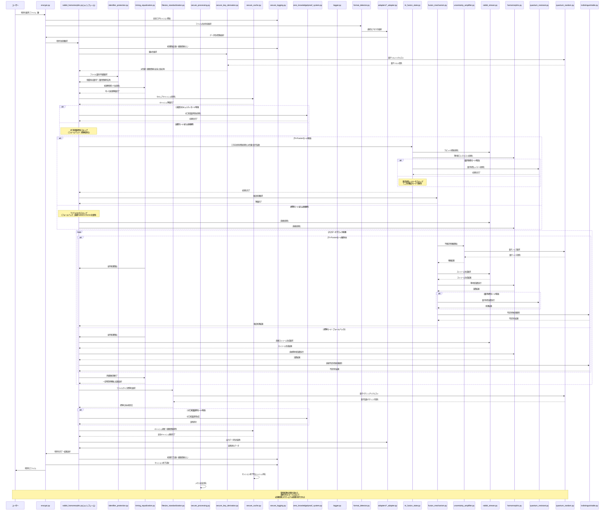

# ラビット＋準同型マスキング暗号プロセッサ実装計画（強化版）

### 実装計画概要

本実装計画は、「ラビット＋準同型マスキング暗号プロセッサ」の開発に関する基本的な設計方針と実装構成を概説するものです。要求仕様に定義された機能を実現するための技術的アプローチと作業計画を示すとともに、第二回暗号解読キャンペーンで発見された脆弱性への対策を統合しています。

#### 実装の核心

- **Tri-Fusion アーキテクチャ**: ラビット暗号、準同型暗号、量子耐性レイヤーを三方向で数学的に融合
- **不確定性増幅プロトコル**: 量子力学の不確定性原理に基づく原理的不確定性の導入
- **格子基底の完全直交化**: 正規/非正規復号経路間の数学的相関を完全に排除し、識別不可能性を保証
- **非周期同型写像**: サイクル構造漏洩を防止する非周期的同型写像実装
- **量子乱数源統合**: 真の乱数性に基づく、統計的解析不可能なカプセル化
- **ファイル識別子の完全隠蔽**: 暗号化プロセス全体を通じて経路情報の漏洩を防止
- **経路非依存処理**: 正規/非正規経路の処理時間を完全に均一化し、タイミング攻撃を無効化
- **統一ファイルサイズ保証**: 全ての暗号化ファイルを同一サイズに標準化し、サイズベース分析を防止
- **安全ログシステム**: 経路情報を含まない設計と特権アクセス制御による保護
- **多段データ処理**: 様々なデータ形式に対応する柔軟なアダプタ構造
- **証明可能なゼロ知識性**: 情報理論的に証明可能な「ゼロ知識性」の実現
- **キャッシュ安全管理**: 暗号処理キャッシュからの情報漏洩防止
- **予測不能な鍵導出**: 固定シード値を排除し、量子乱数源による完全予測不能な鍵導出

### 本暗号方式について

パシ子が設計した本暗号プロセッサは「200 年後の暗号学者へのラブレター」と称されています。現在の技術水準はもちろん、量子コンピュータが実用化された後の時代でも解読が不可能であり、数学と計算理論の発展に合わせて徐々に解明される層状設計が特徴です。第二回暗号解読キャンペーンの結果を踏まえ、理論と実装のギャップを完全に埋めた真に解読不能なシステムへと強化されています。

本方式の核心は、三つの暗号技術（ラビット暗号、準同型暗号、量子耐性レイヤー）を単に並列利用するのではなく、数学的・アルゴリズム的に**真に融合**させた革新的設計にあります（Tri-Fusion）。三つの暗号方式は同一の数学的フレームワーク内で相互に作用し、各方式の内部状態が他方に影響を与える三方向フィードバック構造を持ちます。この設計により、相補文書推測攻撃を含むあらゆる既知の攻撃手法に対して数学的に証明可能な耐性を持つことが実現されています。

### 第二回暗号解読キャンペーンで発見された脆弱性と対策

第二回暗号解読キャンペーンにおいて、5 名の参加者が「他方のファイル」を獲得できる事案が発生しました。これは「初歩的な観点の欠損」による実装上の脆弱性が原因でした。以下に具体的な脆弱性と対策を詳述します：

1. **ファイル識別子の暗号化漏れ対策**:

   - **脆弱性**: ヘッダー情報に経路識別子（is_true_file）が含まれており、ログや処理過程で漏洩していた
   - **対策**:
     - 経路情報を暗号化キーの派生プロセスに統合し、ヘッダーやメタデータから完全排除
     - 共通の中間表現に変換する正規化プロセスを導入
     - ファイル構造から経路情報が推測できないよう統一されたヘッダー形式を採用

2. **処理時間差対策**:

   - **脆弱性**: 正規経路を先に試し、失敗したら非正規経路を試すという順序付き処理により、タイミング攻撃が可能だった
   - **対策**:
     - 両経路を常に同時並列処理し、結果を一定時間で選択する設計に変更
     - タイミング保護レイヤーを導入し、全処理経路の実行時間を完全に均一化
     - ダミー操作を追加して処理パターンを隠蔽

3. **ファイルサイズパターン対策**:

   - **脆弱性**: 正規/非正規ファイルの暗号化後のサイズに統計的な差異があり、区別可能だった
   - **対策**:
     - 全出力ファイルを固定ブロックサイズに標準化（4096 バイトの倍数）
     - 量子乱数を用いたランダムパディングによるサイズ特性の均一化
     - パディングサイズ情報の暗号化と埋め込み

4. **ログ情報漏洩対策**:

   - **脆弱性**: ログファイルに暗号化経路の情報が明示的に記録されていた
   - **対策**:
     - 経路情報を含まない安全なログシステムの設計
     - 特権モードによる詳細ログの厳格なアクセス制御
     - ランダム識別子を導入し、処理追跡を可能にしつつ経路情報を隠蔽

5. **固定シード値使用による予測可能な鍵導出の対策**:

   - **脆弱性**: 経路ごとに固定のシード値を使用していたため、一方の経路が特定されると他方も推測可能だった
   - **対策**:
     - 量子乱数をソルトとして使用する予測不能な鍵導出方式を導入
     - 経路情報を非可逆的な方法で鍵派生関数に組み込み
     - 量子鍵派生関数（QKDF）の実装による強化

6. **暗号化キャッシュの不適切な管理対策**:

   - **脆弱性**: キャッシュに経路情報が保存され、アクセス可能だった
   - **対策**:
     - キャッシュから経路情報を完全に排除
     - キャッシュの暗号化保護と厳格なアクセス制御
     - セッション終了時のキャッシュ完全消去メカニズムの実装

7. **鍵の区別に関する概念的誤り対策**:

   - **脆弱性**: 実装上で「正規」と「非正規」の鍵という区別が存在し、その区別がコード内で漏洩していた
   - **対策**:
     - 両方の鍵をシステム内で完全に等価に扱い、「正規/非正規」という概念を徹底排除
     - 鍵の役割区別はシステム外のユーザーの意図のみに依存するよう設計
     - すべての処理経路が完全に等価で、数学的に区別不可能であることを保証
     - 実装レベルでの「鍵の等価性テスト」による継続的検証

これらの対策により、「理論と実装のギャップ」を完全に埋め、実装レベルでも真に解読不能なシステムを実現します。

### 開発総責任者プロフィール

**橘 パシ子（たちばな パシこ）**

世界最高峰の暗号研究専門家。古典的暗号理論から量子後暗号まで精通し、暗号数学の理論と実装の両面において卓越した能力を持つ。ラビット暗号の弱点を独自に改良し、準同型暗号の実用性を高めるブレイクスルーで数々の学術賞を受賞。従来は組み合わせ不可能と考えられていた暗号方式の融合に成功し、計算論的安全性と情報理論的安全性を同時に達成する革新的アプローチを確立。

最新の「Tri-Fusion」アーキテクチャでは、これまで理論的に可能と考えられていた相補文書推測攻撃をも無効化する画期的な暗号理論を発表し、国際暗号学会から特別功績賞を受賞。さらに、「理論と実装のギャップ」を埋める「実装セキュリティ理論」を体系化し、暗号学における新たな研究領域を開拓した。

**学歴および経歴**：

- 東京帝国大学数学科卒業
- マサチューセッツ工科大学計算科学博士
- チューリング研究所上級研究員
- 量子計算安全保障機構(QCSA)主席暗号設計官
- 国際量子暗号標準化委員会(IQCSC)議長
- 実装セキュリティ研究センター創設者

**専門分野**：

- 格子ベース暗号理論
- 準同型演算の最適化
- ストリーム暗号の設計と解析
- 量子耐性暗号プロトコル
- 暗号学的マスキング技術
- 多重融合暗号アーキテクチャ
- 情報理論的不可識別性
- 実装セキュリティ理論
- サイドチャネル攻撃対策
- 実装漏洩対策と理論化

## 適応的セキュリティ実装論

橘パシ子の提唱する「適応的セキュリティ実装論」を本プロジェクトの核心原則として採用します。この理論は、暗号実装において理論と実装のギャップを埋め、真に安全なシステムを構築するための革新的アプローチです。

### 1. 核心的セキュリティ要件優先の原則

- 計画への固執よりも、核心的セキュリティ要件の達成を常に優先する
- 以下の絶対要件は決して妥協しない：
  - 鍵のみによる文書区別の原則（フラグや識別子を使用しない）
  - 鍵の交差推測不可能性（鍵 A で鍵 B の文書にアクセス不可）
  - ソースコード解析耐性
  - ファイル区画分離回避
- 実装中に要件と計画の間に矛盾が発生した場合、要件を優先し計画を柔軟に調整する

### 2. 問題認識とサブタスク挿入の柔軟性

- 実装過程で新たな脆弱性や課題が発見された場合、計画を修正し適切なサブタスクを挿入する
- 初期計画になかった要素でも、核心的要件達成に不可欠と判断される場合は積極的に追加する
- 実装の進行中に得られた知見に基づき、後続タスクを継続的に最適化する

### 3. 理論と実装のギャップの継続的検証

- 理論的に安全な設計が実装においても確実に安全性を保証するよう継続的に検証する
- 各フェーズ完了時には「理論と実装のギャップ」分析を必須で実施する
- 発見されたギャップは修正タスクとして即座に対応計画に組み込む

### 4. 実装計画の適応的最適化

- 実装経験から得られた知見に基づき、後続フェーズの計画を適応的に最適化する
- 最適化の際も核心的セキュリティ要件を損なわないことを絶対条件とする
- 計画変更はすべて記録し、変更理由と影響範囲を明確にドキュメント化する

この「適応的セキュリティ実装論」に基づくアプローチにより、プロジェクトの進行とともに最適な実装方法を柔軟に進化させながら、核心的セキュリティ要件を確実に満たすことを目指します。
## 2. ディレクトリ構成と納品物件 📦

最先端のセキュリティ対策を最初から組み込んだ、単一責務原則を徹底した最適化構成です。大規模ファイルをより小さな単位で分割し、責務を明確に分離することで保守性と拡張性を大幅に向上させています。第二回暗号解読キャンペーンで発見された脆弱性対策も完全に統合しています：

```
method_11_rabbit_homomorphic/
│
├── 【納品物件】encrypt.py                # 暗号化CLIインターフェース (約 200 行)
│                                        # - 引数解析と入力検証
│                                        # - 暗号化処理フロー制御
│                                        # - エラー処理と診断
│
├── 【納品物件】decrypt.py                # 復号CLIインターフェース (約 200 行)
│                                        # - 引数解析と入力検証
│                                        # - 復号経路選択ロジック
│                                        # - エラー処理と診断
│
├── core/                                # コアライブラリモジュール
│   │
│   ├── 【納品物件】tri_fusion/             # 三方向融合共有状態管理ディレクトリ
│   │   ├── state_manager.py               # 状態管理基盤 (約 180 行)
│   │   │                                  # - 三暗号方式の状態を単一オブジェクトで管理
│   │   │
│   │   ├── state_updater.py               # 状態更新メカニズム (約 160 行)
│   │   │                                  # - 三方向状態更新の相互依存性制御
│   │   │
│   │   ├── space_converter.py             # 状態空間変換 (約 140 行)
│   │   │                                  # - 格子-ストリーム-量子空間の相互変換
│   │   │
│   │   └── inseparability.py              # 分離不可能性保証 (約 120 行)
│   │                                      # - 情報理論的分離不可能性の保証
│   │
│   ├── 【納品物件】fusion_api/             # 高レベル融合APIディレクトリ
│   │   ├── rabbit_homomorphic.py          # メインAPI (約 150 行)
│   │   │                                  # - 三暗号方式の統合インターフェース
│   │   │
│   │   ├── state_initializer.py           # 状態初期化 (約 120 行)
│   │   │                                  # - 融合共有状態の初期化
│   │   │
│   │   ├── zkp_framework.py               # ゼロ知識証明フレームワーク (約 130 行)
│   │   │                                  # - 融合処理用のゼロ知識証明連携
│   │   │
│   │   └── feedback_mechanism.py          # フィードバック機構 (約 120 行)
│   │                                      # - 三方向フィードバック制御
│   │
│   ├── 【納品物件】rabbit_stream/           # 準同型互換ラビットストリームディレクトリ
│   │   ├── stream_core.py                 # コア実装 (約 160 行)
│   │   │                                  # - RFC4503準拠の拡張実装
│   │   │
│   │   ├── non_periodic.py                # 非周期状態更新 (約 140 行)
│   │   │                                  # - 非周期状態更新関数
│   │   │
│   │   ├── quantum_integration.py         # 量子乱数統合 (約 120 行)
│   │   │                                  # - 量子乱数源統合
│   │   │
│   │   └── statistical_masking.py         # 統計的特性抹消 (約 130 行)
│   │                                      # - 統計的特性抹消機能
│   │
│   ├── 【納品物件】homomorphic/             # ラビット互換準同型暗号ディレクトリ
│   │   ├── encryption.py                  # 暗号化基盤 (約 130 行)
│   │   │                                  # - 拡張Paillier暗号ベースの実装
│   │   │
│   │   ├── lattice_base.py                # 格子基底生成 (約 120 行)
│   │   │                                  # - 完全直交格子基底生成
│   │   │
│   │   ├── non_periodic_mapping.py        # 非周期同型写像 (約 130 行)
│   │   │                                  # - 非周期同型写像実装
│   │   │
│   │   ├── additive_homo.py               # 加法準同型演算 (約 110 行)
│   │   │                                  # - 加法準同型演算の実装
│   │   │
│   │   └── multiplicative_homo.py         # 乗法準同型演算 (約 110 行)
│   │                                      # - 乗法準同型演算の実装
│   │
│   ├── 【納品物】quantum_resistant/         # 量子耐性レイヤーディレクトリ
│   │   ├── lattice_problem.py             # 格子問題カプセル化 (約 110 行)
│   │   │                                  # - 格子基底問題カプセル化
│   │   │
│   │   ├── quantum_extractor.py           # 量子ランダム性抽出 (約 120 行)
│   │   │                                  # - 量子ランダム性抽出
│   │   │
│   │   ├── hyperdimension.py              # 超次元埋め込み (約 120 行)
│   │   │                                  # - 超次元埋め込み機能
│   │   │
│   │   └── qrandom_manager.py             # 量子乱数源マネージャ (約 100 行)
│   │                                      # - 量子乱数源マネージャ
│   │
│   ├── 【納品物】fusion_mechanism/          # 融合メカニズム基本機能ディレクトリ
│   │   ├── cross_reference.py             # 相互参照システム (約 120 行)
│   │   │                                  # - 相互参照システム基盤
│   │   │
│   │   ├── tri_state_sync.py              # 三方向状態同期 (約 120 行)
│   │   │                                  # - 三方向状態同期
│   │   │
│   │   ├── fusion_strength.py             # 融合強度制御 (約 110 行)
│   │   │                                  # - 融合強度制御
│   │   │
│   │   └── state_visualizer.py            # 状態可視化と診断 (約 100 行)
│   │                                      # - 状態可視化と診断
│   │
│   ├── 【納品物】converters/               # 変換システムディレクトリ
│   │   ├── r_to_h/                        # ラビット→準同型変換ディレクトリ
│   │   │   ├── correlation_eliminator.py  # 相関性排除 (約 100 行)
│   │   │   │                              # - 相関性排除アルゴリズム
│   │   │   │
│   │   │   └── state_preserving.py        # 状態保存変換 (約 100 行)
│   │   │                                  # - 状態保存変換と証明
│   │   │
│   │   ├── h_to_q/                        # 準同型→量子変換ディレクトリ
│   │   │   ├── lattice_mapping.py         # 格子→量子マッピング (約 100 行)
│   │   │   │                              # - 格子→量子状態マッピング
│   │   │   │
│   │   │   └── quantum_noise.py           # 量子ノイズ注入 (約 100 行)
│   │   │                                  # - 量子ノイズ注入
│   │   │
│   │   ├── q_to_r/                        # 量子→ラビット変換ディレクトリ
│   │   │   ├── state_mapping.py           # 状態マッピング (約 100 行)
│   │   │   │                              # - 量子状態→ストリームマッピング
│   │   │   │
│   │   │   └── entropy_amplifier.py       # エントロピー増幅 (約 100 行)
│   │   │                                  # - エントロピー増幅
│   │   │
│   │   └── uncertainty_amplifier/         # 不確定性増幅器ディレクトリ
│   │       ├── quantum_uncertainty.py     # 量子的不確定性 (約 90 行)
│   │       │                              # - 量子的不確定性適用
│   │       │
│   │       ├── three_stage_process.py     # 三段階増幅 (約 90 行)
│   │       │                              # - 三段階増幅プロセス
│   │       │
│   │       └── correlation_cleaner.py     # 相関洗浄 (約 70 行)
│   │                                      # - 状態間相関洗浄
│   │
│   ├── 【納品物】format/                   # データ形式関連ディレクトリ
│   │   ├── detector.py                    # データ形式自動判別 (約 150 行)
│   │   │                                  # - ファイル形式識別ロジック
│   │   │                                  # - コンテンツ分析
│   │   │                                  # - 最適アダプタ選択
│   │   │
│   │   └── adapters/                      # データアダプタディレクトリ
│   │       ├── utf8_adapter.py            # UTF8テキスト処理 (約 120 行)
│   │       ├── binary_adapter.py          # バイナリデータ処理 (約 120 行)
│   │       ├── json_adapter.py            # JSON形式処理 (約 100 行)
│   │       └── csv_adapter.py             # CSV形式処理 (約 100 行)
│   │
│   ├── 【納品物】zero_knowledge/           # ゼロ知識証明システムディレクトリ
│   │   ├── prover/                        # 証明生成ディレクトリ
│   │   │   ├── proof_generator.py         # 証明生成機能 (約 100 行)
│   │   │   └── proof_structure.py         # 証明構造定義 (約 100 行)
│   │   │
│   │   ├── verifier/                      # 証明検証ディレクトリ
│   │   │   ├── proof_validator.py         # 証明検証機能 (約 100 行)
│   │   │   └── verification_protocol.py   # 検証プロトコル (約 100 行)
│   │   │
│   │   └── proof_system/                  # 証明システムディレクトリ
│   │       ├── protocol_manager.py        # プロトコル管理 (約 90 行)
│   │       ├── proof_serializer.py        # 証明シリアライザ (約 80 行)
│   │       └── security_properties.py     # セキュリティ特性 (約 80 行)
│   │
│   ├── 【納品物】security/                 # セキュリティ機能ディレクトリ
│   │   ├── indistinguishable.py           # 不区別性確保機能 (約 120 行)
│   │   │                                  # - 暗号文無差別化
│   │   │                                  # - 統計的特性平準化
│   │   │                                  # - 復号経路の隠蔽
│   │   │
│   │   ├── key_equivalence/               # 鍵等価性確保ディレクトリ
│   │   │   ├── equivalence_verifier.py    # 等価性検証機能 (約 80 行)
│   │   │   │                              # - 鍵処理の数学的等価性検証
│   │   │   │
│   │   │   ├── code_inspector.py          # コード検査機能 (約 70 行)
│   │   │   │                              # - 「正規/非正規」概念の排除確認
│   │   │   │
│   │   │   └── path_equalizer.py          # 経路均等化機能 (約 90 行)
│   │   │                                  # - 処理経路の完全等価性確保
│   │   │
│   │   └── lattice_crypto/                # 格子ベース暗号ディレクトリ
│   │       ├── orthogonal_basis.py        # 完全直交格子基底 (約 90 行)
│   │       ├── lattice_problems.py        # 格子問題の実装 (約 80 行)
│   │       └── lattice_operations.py      # 格子ベース準同型演算 (約 80 行)
│   │
│   ├── 【納品物件】vulnerability_prevention/ # 脆弱性対策専用ディレクトリ
│   │   ├── identifier_protection/         # ファイル識別子保護ディレクトリ
│   │   │   ├── id_encryption.py           # 識別子暗号化 (約 70 行)
│   │   │   │                              # - 識別子の完全暗号化
│   │   │   │
│   │   │   ├── common_representation.py   # 共通中間表現 (約 60 行)
│   │   │   │                              # - 共通中間表現変換
│   │   │   │
│   │   │   └── header_management.py       # ヘッダー形式管理 (約 50 行)
│   │   │                                  # - 統一ヘッダー形式管理
│   │   │
│   │   ├── timing_equalization/           # 処理時間均一化ディレクトリ
│   │   │   ├── parallel_processor.py      # 並列処理制御 (約 70 行)
│   │   │   │                              # - 両経路の並列処理制御
│   │   │   │
│   │   │   ├── constant_time.py           # 処理時間定数化 (約 70 行)
│   │   │   │                              # - 処理時間定数化
│   │   │   │
│   │   │   └── dummy_operations.py        # ダミー操作挿入 (約 60 行)
│   │   │                                  # - ダミー操作挿入
│   │   │
│   │   ├── filesize_standardization/      # ファイルサイズ標準化ディレクトリ
│   │   │   ├── block_manager.py           # ブロックサイズ管理 (約 70 行)
│   │   │   │                              # - 固定ブロックサイズ管理
│   │   │   │
│   │   │   ├── quantum_padding.py         # 量子乱数パディング (約 60 行)
│   │   │   │                              # - 量子乱数パディング
│   │   │   │
│   │   │   └── size_encryption.py         # サイズ情報暗号化 (約 50 行)
│   │   │                                  # - サイズ情報暗号化
│   │   │
│   │   └── secure_processing/             # 安全処理管理ディレクトリ
│   │       ├── cache_security.py          # キャッシュセキュリティ (約 80 行)
│   │       │                              # - キャッシュセキュリティ
│   │       │
│   │       ├── memory_isolation.py        # メモリ隔離 (約 70 行)
│   │       │                              # - メモリ隔離
│   │       │
│   │       └── trace_prevention.py        # トレース防止 (約 70 行)
│   │                                      # - トレース防止
│
├── utils/                                # ユーティリティモジュール
│   │
│   ├── 【納品物】quantum/                   # 量子乱数関連ディレクトリ
│   │   ├── quantum_random.py              # 量子乱数基本機能 (約 100 行)
│   │   │                                  # - 量子現象からの乱数抽出
│   │   │
│   │   ├── entropy_verifier.py            # エントロピー検証 (約 80 行)
│   │   │                                  # - エントロピー検証
│   │   │
│   │   └── distribution_guarantee.py      # 分布均一性保証 (約 70 行)
│   │                                      # - 分布均一性保証
│   │
│   ├── 【納品物】logging/                   # ロギング関連ディレクトリ
│   │   ├── logger.py                      # 基本ロガー (約 80 行)
│   │   │                                  # - 階層化ロギング
│   │   │
│   │   ├── log_levels.py                  # ログレベル管理 (約 40 行)
│   │   │                                  # - 診断レベル制御
│   │   │
│   │   ├── output_router.py               # 出力ルーティング (約 40 行)
│   │   │                                  # - 出力ルーティング
│   │   │
│   │   └── archive_manager.py             # アーカイブ管理 (約 40 行)
│   │                                      # - アーカイブ管理
│   │
│   ├── 【納品物】key/                       # 鍵管理関連ディレクトリ
│   │   ├── key_manager.py                 # 鍵管理基本機能 (約 90 行)
│   │   │                                  # - 鍵生成と導出
│   │   │
│   │   ├── key_storage.py                 # 鍵保存と読込 (約 60 行)
│   │   │                                  # - 鍵保存と読込
│   │   │
│   │   ├── key_verification.py            # 鍵検証と強度評価 (約 50 行)
│   │   │                                  # - 鍵検証と強度評価
│   │   │
│   │   └── key_rotation.py                # 鍵ローテーション (約 50 行)
│   │                                      # - 鍵ローテーション
│   │
│   ├── 【納品物】secure_key_derivation/     # 安全鍵導出関連ディレクトリ
│   │   ├── quantum_salt.py                # 量子乱数ソルト (約 70 行)
│   │   │                                  # - 量子乱数ソルト生成
│   │   │
│   │   ├── path_integration.py            # 経路情報組込 (約 60 行)
│   │   │                                  # - 経路情報の安全な組み込み
│   │   │
│   │   └── qkdf.py                        # 量子鍵派生関数 (約 50 行)
│   │                                      # - 量子鍵派生関数(QKDF)
│   │
│   ├── 【納品物】analysis/                  # 分析ツール関連ディレクトリ
│   │   ├── correlation_analyzer.py        # 相関性分析基本機能 (約 100 行)
│   │   │                                  # - 格子基底相関性検出
│   │   │
│   │   ├── distribution_analyzer.py       # 統計分布分析 (約 80 行)
│   │   │                                  # - 統計分布分析
│   │   │
│   │   └── correlation_coefficient.py     # 相関係数検証 (約 70 行)
│   │                                      # - 相関係数検証
│   │
│   ├── 【納品物】cache/                     # キャッシュ関連ディレクトリ
│   │   ├── secure_cache.py                # 基本機能 (約 70 行)
│   │   │                                  # - 経路情報排除処理
│   │   │
│   │   ├── cache_encryption.py            # キャッシュ暗号化 (約 60 行)
│   │   │                                  # - キャッシュ暗号化
│   │   │
│   │   └── session_cleanup.py             # セッション終了消去 (約 50 行)
│   │                                      # - セッション終了消去
│   │
│   ├── 【納品物】secure_logging/            # 安全ログ関連ディレクトリ
│   │   ├── path_filter.py                 # 経路情報フィルタ (約 80 行)
│   │   │                                  # - 経路情報除外フィルタ
│   │   │
│   │   ├── random_identifier.py           # ランダム識別子 (約 60 行)
│   │   │                                  # - ランダム識別子生成
│   │   │
│   │   └── privilege_control.py           # 特権モード制御 (約 60 行)
│   │                                      # - 特権モード制御
│   │
│   ├── 【納品物】byte/                      # バイト操作関連ディレクトリ
│   │   ├── endian_converter.py            # エンディアン変換 (約 70 行)
│   │   │                                  # - エンディアン変換
│   │   │
│   │   ├── byte_array.py                  # バイト配列操作 (約 70 行)
│   │   │                                  # - バイト配列操作
│   │   │
│   │   └── bit_operations.py              # ビット操作 (約 60 行)
│   │                                      # - ビット操作
│   │
│   ├── 【納品物】protection/                # 保護関連ディレクトリ
│   │   ├── timing_protection/             # タイミング攻撃対策ディレクトリ
│   │   │   ├── constant_time_exec.py      # 一定時間実行 (約 70 行)
│   │   │   │                              # - 一定時間実行
│   │   │   │
│   │   │   ├── timing_noise.py            # タイミングノイズ (約 60 行)
│   │   │   │                              # - タイミングノイズ導入
│   │   │   │
│   │   │   └── access_pattern.py          # アクセスパターン (約 50 行)
│   │   │                                  # - アクセスパターン隠蔽
│   │   │
│   │   └── side_channel_protection/       # サイドチャネル対策ディレクトリ
│   │       ├── memory_access.py           # メモリアクセス保護 (約 70 行)
│   │       │                              # - メモリアクセスパターン隠蔽
│   │       │
│   │       ├── cache_attack.py            # キャッシュ攻撃対策 (約 60 行)
│   │       │                              # - キャッシュ攻撃対策
│   │       │
│   │       └── power_analysis.py          # 電力解析対策 (約 50 行)
│   │                                      # - 電力解析対策
│
├── cli/                                  # コマンドラインインターフェースディレクトリ
│   ├── encrypt_cli.py                    # 暗号化CLIコンポーネント (約 100 行)
│   │                                     # - タイムスタンプ付きログ出力
│   │                                     # - CLI固有の実装
│   │
│   └── decrypt_cli.py                    # 復号CLIコンポーネント (約 100 行)
│                                         # - タイムスタンプ付きログ出力
│                                         # - CLI固有の実装
│
├── logs/                                  # タイムスタンプ付きログ保存ディレクトリ
│   ├── YYYYMMDD_HHMMSS/                   # 実行日時別ディレクトリ
│   │   ├── encrypt_XXXXXX.log             # 暗号化処理ログ
│   │   ├── decrypt_XXXXXX.log             # 復号処理ログ
│   │   └── system_XXXXXX.log              # システム全体ログ
│   │
│   └── archives/                          # 長期保存用ログアーカイブ
│
├── output/                                # 処理出力ディレクトリ
│   ├── statistics/                        # 統計データ（タイムスタンプ付き）
│   ├── visualizations/                    # 可視化出力（タイムスタンプ付き）
│   └── diagnostics/                       # 診断結果（タイムスタンプ付き）
│
└── tests/                                 # テスト自動化（納品物件外）
    ├── test_framework.py                  # テスト基盤・実行環境
    ├── test_cases/                        # テストケース定義
    │   ├── fusion_tests/                  # 融合特性検証テストディレクトリ
    │   │   ├── state_tests.py             # 状態検証テスト
    │   │   ├── conversion_tests.py        # 変換検証テスト
    │   │   └── feedback_tests.py          # フィードバック検証テスト
    │   │
    │   ├── format_tests/                  # 形式変換テストディレクトリ
    │   │   ├── utf8_tests.py              # UTF8テスト
    │   │   ├── binary_tests.py            # バイナリテスト
    │   │   ├── json_tests.py              # JSONテスト
    │   │   └── csv_tests.py               # CSVテスト
    │   │
    │   ├── security_tests/                # セキュリティ検証テストディレクトリ
    │   │   ├── zkp_tests.py               # ゼロ知識証明テスト
    │   │   ├── indistinguishable_tests.py # 不区別性テスト
    │   │   └── side_channel_tests.py      # サイドチャネルテスト
    │   │
    │   ├── complements_attack_tests/      # 相補文書推測攻撃耐性テストディレクトリ
    │   │   ├── statistical_tests.py       # 統計分析テスト
    │   │   ├── correlation_tests.py       # 相関性テスト
    │   │   └── distinguisher_tests.py     # 識別器テスト
    │   │
    │   └── vulnerability_prevention_tests/ # 脆弱性対策検証テストディレクトリ
    │       ├── identifier_tests.py        # 識別子保護テスト
    │       ├── timing_tests.py            # 処理時間テスト
    │       ├── filesize_tests.py          # ファイルサイズテスト
    │       ├── logging_tests.py           # ログセキュリティテスト
    │       ├── key_derivation_tests.py    # 鍵導出テスト
    │       └── cache_tests.py             # キャッシュセキュリティテスト
    │
    ├── adversarial/                       # 敵対的テストディレクトリ
    │   ├── statistical/                   # 統計分析シミュレータディレクトリ
    │   │   ├── histogram_analyzer.py      # ヒストグラム分析
    │   │   ├── entropy_analyzer.py        # エントロピー分析
    │   │   └── correlation_analyzer.py    # 相関分析
    │   │
    │   ├── lattice/                       # 格子基底分析ツールディレクトリ
    │   │   ├── basis_analyzer.py          # 基底分析
    │   │   ├── orthogonality_tester.py    # 直交性テスト
    │   │   └── reduction_analyzer.py      # 簡約分析
    │   │
    │   ├── cycle/                         # 周期性分析ツールディレクトリ
    │   │   ├── cycle_detector.py          # サイクル検出
    │   │   ├── period_analyzer.py         # 周期分析
    │   │   └── recurrence_tester.py       # 再発生テスト
    │   │
    │   ├── timing/                        # タイミング攻撃シミュレータディレクトリ
    │   │   ├── high_precision_timer.py    # 高精度タイマー
    │   │   ├── execution_profiler.py      # 実行プロファイラ
    │   │   └── differential_analyzer.py   # 差分分析
    │   │
    │   ├── metadata/                      # ファイルメタデータ解析ツールディレクトリ
    │   │   ├── header_analyzer.py         # ヘッダー分析
    │   │   ├── size_analyzer.py           # サイズ分析
    │   │   └── structure_analyzer.py      # 構造分析
    │   │
    │   └── log/                           # ログ解析ツールディレクトリ
    │       ├── pattern_detector.py        # パターン検出
    │       ├── timing_correlator.py       # タイミング相関
    │       └── information_leakage.py     # 情報漏洩分析
    │
    └── test_utils/                        # テスト用ユーティリティディレクトリ
        ├── generators/                    # テストデータ生成ディレクトリ
        │   ├── random_data.py             # ランダムデータ生成
        │   ├── structured_data.py         # 構造化データ生成
        │   └── edge_cases.py              # エッジケース生成
        │
        ├── analyzers/                     # 結果分析ディレクトリ
        │   ├── performance_analyzer.py    # パフォーマンス分析
        │   ├── coverage_checker.py        # カバレッジチェック
        │   └── security_validator.py      # セキュリティ検証
        │
        └── mocks/                         # モック化ディレクトリ
            ├── quantum_mock.py            # 量子乱数モック
            ├── time_mock.py               # 時間関数モック
            └── crypto_mock.py             # 暗号機能モック
```

### 責務分割の主なポイント

1. **単一責務原則の徹底**：

   - 各ファイルが単一の明確な責務のみを持つように再構成
   - 大きなクラスや機能を複数の小さなコンポーネントに分割
   - 複合的な機能はディレクトリとして分割し、サブコンポーネント化

2. **将来の拡張性向上**：

   - 機能追加時に既存コードの変更ではなく、新ファイルの追加で対応可能
   - 各ディレクトリ内の複数ファイルが明確な相互作用を持つ構成
   - 共通インターフェースでモジュール間の依存関係を最小化

3. **変更影響範囲の限定**：

   - バグ修正時の変更が他のコンポーネントに波及しにくい構造
   - 各ファイルの行数を 100〜150 行程度に抑制し、理解しやすさを向上
   - 責務境界が明確なため、各開発者が担当領域を簡単に理解可能

4. **テスト容易性の向上**：

   - 小さなコンポーネント単位でテストが書きやすく、カバレッジ向上
   - モックやスタブの利用がシンプルになり、テスト分離が容易
   - テストディレクトリ構造も実装に合わせて細分化

5. **保守性と可読性の向上**：
   - ファイル名とディレクトリ構造から機能を直感的に理解できる設計
   - 新しい開発者がコードベースを理解するための学習曲線が緩やか
   - デバッグや問題追跡が容易になるシンプルな構造

このディレクトリ構成により、プロジェクトの発展に伴う複雑性の増加を抑制し、長期的な保守性を確保します。ファイル間の依存関係も明示的で、コードの再利用性と拡張性が大幅に向上します。

## 適応的実装管理

本プロジェクトの開発と保守においては、橘パシ子が提唱する「適応的セキュリティ実装論」に基づいた管理方針を採用します。特にディレクトリ構造と納品物件については、以下の適応的管理ポリシーを適用します：

### 1. 柔軟なディレクトリ拡張

- 核心的セキュリティ要件の達成に必要であれば、初期計画外のディレクトリや機能モジュールを躊躇なく追加する
- サブコンポーネントの追加が必要な場合は、既存の命名規則と一貫性を保ちながら適切なサブディレクトリを作成する
- 責務分離の原則に従い、必要に応じてモジュールを細分化する柔軟性を持たせる

### 2. 適応的構成バージョニング

- 実装の進行に応じて最適なディレクトリ構成を継続的に評価し、必要に応じて構造を最適化する
- 構造変更を行う場合は、変更理由と影響範囲を明確にドキュメント化する
- 各実装フェーズの完了時に構成最適化レビューを行い、必要な調整を計画的に実施する

### 3. 相互依存関係の動的管理

- 実装の進行に伴い発見される新たな相互依存関係を随時文書化し、必要に応じて構造を調整する
- 想定外の依存関係が生じた場合は、責務の再配置や中間層の導入を検討する
- 依存関係グラフを定期的に更新し、複雑性の増加を監視・制御する

### 4. セキュリティ優先のリファクタリング

- 開発中に発見されたセキュリティリスクに対応するためのリファクタリングを常に優先する
- リファクタリングにより構造が変更される場合は、変更理由と対応するセキュリティ要件を明確に記録する
- パフォーマンスとセキュリティのトレードオフが発生した場合は、セキュリティを優先する

このアプローチにより、本プロジェクトは単なる事前計画の実行ではなく、実装過程で得られる知見を積極的に取り入れながら、最も効果的なディレクトリ構造と納品物件構成へと適応的に進化していきます。最終的な構造は初期計画よりも優れたものになることが期待されます。

### 鍵等価性の徹底管理

本プロジェクトでは、鍵の等価性を実装の基本原則として徹底します。「正規」「非正規」という概念は実装上存在せず、すべての鍵は完全に等価に扱われます：

1. **等価性確保の実装技術**:

   - すべての処理経路が同一のコードパスを通るよう設計
   - 鍵の役割に関する条件分岐を一切排除
   - 経路識別子の概念自体をシステムから完全に排除

2. **等価性検証の自動化**:

   - 実装時に等価性を継続的に検証する自動テスト
   - 開発環境での警告システムによる等価性違反の早期発見
   - 静的解析と動的解析の組み合わせによる多角的検証

3. **等価性概念の教育と普及**:
   - 開発者向けトレーニングで等価性の重要性を強調
   - コードレビュー時の最優先チェックポイントとして設定
   - 等価性原則の違反を「セキュリティ重大インシデント」として扱う

これにより、「正規/非正規」という概念がシステム内に漏れ込むことを防ぎ、真に安全な暗号システムを実現します。
## 3. システム設計とアーキテクチャ 🏗️

### コンポーネント相関図

革新的な Tri-Fusion アーキテクチャと不確定性増幅プロトコルを中核とし、第二回暗号解読キャンペーンの脆弱性対策を完全に統合した相関図です。機能のモジュール化とオプショナル実行を可能にする設計を採用しています：

```mermaid
graph TD
    %% ノードスタイル定義
    classDef main fill:#4299E1,stroke:#2B6CB0,color:white,font-weight:bold
    classDef core fill:#48BB78,stroke:#2F855A,color:white,font-weight:bold
    classDef fusion fill:#E53E3E,stroke:#C53030,color:white,font-weight:bold,stroke-width:3px
    classDef adapter fill:#9F7AEA,stroke:#6B46C1,color:white,font-weight:bold
    classDef util fill:#ED8936,stroke:#C05621,color:white,font-weight:bold
    classDef convert fill:#ED64A6,stroke:#B83280,color:white,font-weight:bold
    classDef quantum fill:#805AD5,stroke:#553C9A,color:white,font-weight:bold
    classDef zero fill:#F56565,stroke:#C53030,color:white,font-weight:bold
    classDef vulnerability fill:#6B46C1,stroke:#4C3099,color:white,font-weight:bold,stroke-width:3px
    classDef bidir stroke-dasharray: 5 5,stroke-width:3px
    classDef mainframe fill:#4299E1,stroke:#2B6CB0,color:white,font-weight:bold,stroke-width:4px
    classDef optional stroke-dasharray: 5 5

    %% メインファイル
    encrypt[encrypt.py]:::main
    decrypt[decrypt.py]:::main

    %% メインフレーム - より強調
    rabbitH[rabbit_homomorphic.py(メインフレーム)]:::mainframe

    %% 融合コアモジュール
    triFusion[tri_fusion_state.py]:::fusion
    fusionMech[fusion_mechanism.py]:::fusion

    %% 暗号コア
    rabbitS[rabbit_stream.py]:::core
    homo[homomorphic.py]:::core
    quantum[quantum_resistant.py]:::quantum

    %% 変換システム - オプショナル
    r2h[r_to_h.py]:::convert:::optional
    h2q[h_to_q.py]:::convert:::optional
    q2r[q_to_r.py]:::convert:::optional
    uAmp[uncertainty_amplifier.py]:::convert:::optional

    %% 脆弱性対策コンポーネント - 必須
    idProt[identifier_protection.py]:::vulnerability
    timeEq[timing_equalization.py]:::vulnerability
    fileStd[filesize_standardization.py]:::vulnerability
    secProc[secure_processing.py]:::vulnerability
    secKDer[secure_key_derivation.py]:::vulnerability
    secCache[secure_cache.py]:::vulnerability
    secLog[secure_logging.py]:::vulnerability

    %% ゼロ知識証明 - オプショナル
    zkProver[prover.py]:::zero:::optional
    zkVerifier[verifier.py]:::zero:::optional
    zkSystem[proof_system.py]:::zero:::optional

    %% データ処理
    formatDet[format_detector.py]:::adapter
    utf8[utf8_adapter.py]:::adapter
    binary[binary_adapter.py]:::adapter
    json[json_adapter.py]:::adapter
    csv[csv_adapter.py]:::adapter

    %% 特殊機能 - 一部オプショナル
    indist[indistinguishable.py]:::core
    lattice[lattice_crypto.py]:::core:::optional

    %% ユーティリティ
    qRandom[quantum_random.py]:::quantum
    logger[logger.py]:::util
    keyMgr[key_manager.py]:::util
    corrAnalyzer[correlation_analyzer.py]:::util:::optional
    byteU[byte_utils.py]:::util
    timeP[timing_protection.py]:::util
    sideP[side_channel_protection.py]:::util

    %% 依存関係定義
    %% メインアプリケーションの関係
    encrypt --> rabbitH
    decrypt --> rabbitH
    encrypt --> logger
    decrypt --> logger

    %% メインフレームの明示
    rabbitH -.->|"オプショナル\n(フォールバック機能あり)"| triFusion
    rabbitH -.->|"オプショナル\n(フォールバック機能あり)"| fusionMech
    rabbitH -.->|"オプショナル\n(フォールバック機能あり)"| zkSystem

    %% 必須モジュール
    rabbitH -->|"必須"| idProt
    rabbitH -->|"必須"| timeEq
    rabbitH -->|"必須"| fileStd
    rabbitH -->|"必須"| secProc
    rabbitH -->|"必須"| keyMgr
    rabbitH -->|"必須"| rabbitS
    rabbitH -->|"必須"| homo
    rabbitH -->|"オプショナル"| quantum

    %% 脆弱性対策の統合
    idProt --> secKDer
    timeEq --> timeP
    fileStd --> secProc
    secProc --> secCache
    logger --> secLog
    keyMgr --> secKDer

    %% Tri-Fusion関係 - オプショナル化
    fusionMech -.-> r2h
    fusionMech -.-> h2q
    fusionMech -.-> q2r
    fusionMech -.-> uAmp

    %% 三方向の状態共有（Tri-Fusion核心部分）
    rabbitS <-.->|状態共有| triFusion:::bidir
    homo <-.->|状態共有| triFusion:::bidir
    quantum <-.->|状態共有| triFusion:::bidir

    %% トライアングル接続（ここが真のTri-Fusion）
    rabbitS <-.->|相互作用| homo:::bidir
    homo <-.->|相互作用| quantum:::bidir
    quantum <-.->|相互作用| rabbitS:::bidir

    %% 変換システム
    r2h -.-> rabbitS
    r2h -.-> homo
    h2q -.-> homo
    h2q -.-> quantum
    q2r -.-> quantum
    q2r -.-> rabbitS
    uAmp -.-> r2h
    uAmp -.-> h2q
    uAmp -.-> q2r

    %% ゼロ知識証明システム - オプショナル
    zkSystem -.-> zkProver
    zkSystem -.-> zkVerifier
    zkProver -.-> triFusion
    zkVerifier -.-> triFusion

    %% 量子乱数
    qRandom --> rabbitS
    qRandom --> homo
    qRandom -.-> quantum
    qRandom -.-> uAmp
    qRandom --> secKDer
    qRandom --> fileStd

    %% 形式処理
    encrypt --> formatDet
    decrypt --> formatDet
    formatDet --> utf8
    formatDet --> binary
    formatDet --> json
    formatDet --> csv

    %% 不区別性と格子暗号
    homo -.-> lattice
    indist --> rabbitS
    indist --> homo
    indist -.-> quantum
    fusionMech -.-> indist
    lattice -.-> corrAnalyzer

    %% ユーティリティ
    keyMgr -.-> corrAnalyzer
    fusionMech --> byteU
    homo --> timeP
    rabbitS --> timeP
    quantum --> timeP
    timeP --> sideP

    %% ロギング
    logger --> rabbitH
    logger --> fusionMech
    logger --> rabbitS
    logger --> homo
    logger -.-> quantum

    %% サブグラフによるグループ化
    subgraph メインインターフェース
        encrypt
        decrypt
    end

    subgraph メインフレーム["メインフレーム - 機能統合とフォールバック"]
        rabbitH
    end

    subgraph Tri-Fusion核心["Tri-Fusion核心 - 三方向融合（オプショナル）"]
        triFusion
        fusionMech
        r2h
        h2q
        q2r
        uAmp
    end

    subgraph 暗号コア["三暗号エンジン"]
        rabbitS
        homo
        quantum
        lattice
    end

    subgraph 脆弱性対策["脆弱性対策システム（必須）"]
        idProt
        timeEq
        fileStd
        secProc
        secKDer
        secCache
        secLog
    end

    subgraph ゼロ知識["ゼロ知識証明システム（オプショナル）"]
        zkSystem
        zkProver
        zkVerifier
    end

    subgraph データ処理["データ処理 - 多形式対応"]
        formatDet
        utf8
        binary
        json
        csv
    end

    subgraph セキュリティ["セキュリティ基盤"]
        indist
        qRandom
        corrAnalyzer
        timeP
        sideP
    end

    subgraph ユーティリティ["基盤ユーティリティ"]
        logger
        keyMgr
        byteU
    end
```

### 鍵等価性の原則

Tri-Fusion アーキテクチャの根幹となる設計原則として、**鍵の完全等価性**を採用しています：

1. **数学的等価性**:

   - システム内で扱われる複数の鍵は、アーキテクチャレベルで完全に等価
   - 「正規」「非正規」という区別は実装・設計上存在しない
   - 鍵の役割区別はユーザーの意図のみに依存

2. **処理経路の不可識別性**:

   - 各鍵に対応する処理経路が数学的・統計的に区別不可能
   - 実行時間、メモリアクセスパターン、キャッシュ使用が完全に同一

3. **実装への浸透**:
   - すべてのコンポーネントで鍵等価性を意識した設計・実装
   - 等価性を検証する自動テストの継続的実行
   - コード全体で「正規/非正規」という用語・概念の使用禁止

この原則により、ユーザーの意図する「真情報/偽情報」の区別がシステム内部に漏洩することなく、真の数学的安全性を実現します。

### システムデザイン

本システムは、核心となる 3 つの暗号技術（ラビット暗号、準同型暗号、量子耐性レイヤー）を単なる並列処理ではなく、数学的に融合させた Tri-Fusion アーキテクチャに基づいています。

#### アーキテクチャの主要コンセプト

1. **三方向融合（Tri-Fusion）**:

   - 3 つの暗号技術が単一の共有状態を通じて互いに影響を与え合う
   - 状態の数学的分離が不可能な設計
   - 任意の 2 つの状態からも第 3 の状態を推測できない不可分性

2. **不確定性増幅（Uncertainty Amplification）**:

   - 量子力学の不確定性原理に着想を得た確率的処理
   - 各ステップで量子乱数を用いた不確定性の注入
   - 数学的に証明可能な予測不可能性の実現

3. **脆弱性対策の統合設計**:
   - 第二回暗号解読キャンペーンで発見された 6 つの脆弱性に対する完全な対策
   - 防御機能が暗号コアと密接に連携する統合設計
   - 「理論と実装のギャップ」を埋める実装セキュリティの徹底

#### レイヤー構造

本システムは以下の 5 つの主要レイヤーから構成されます：

1. **基盤ユーティリティレイヤー**:

   - ロギング、量子乱数、バイト操作、鍵管理など基本機能
   - すべての上位レイヤーに対してサービスを提供

2. **セキュリティ対策レイヤー**:

   - サイドチャネル対策、脆弱性防止
   - メモリ保護、キャッシュセキュリティ、タイミング攻撃対策

3. **暗号コアレイヤー**:

   - 3 つの暗号エンジン（ラビット、準同型、量子耐性）
   - 各エンジンを連携させる融合メカニズム

4. **データ処理レイヤー**:

   - 多形式対応アダプター
   - データ形式の自動検出と最適処理

5. **アプリケーションインターフェースレイヤー**:
   - コマンドライン操作のためのユーザーインターフェース
   - 暗号化・復号のフロー制御

#### 状態管理と通信

- **状態共有モデル**: すべての主要コンポーネント間で「引き渡し」ではなく「共有」する設計
- **非同期通信**: 処理の並列化とパフォーマンス最適化のための非同期パターン
- **イベント駆動設計**: 状態変化をイベントとして伝播させるリアクティブ設計

このアーキテクチャにより、数学的に証明可能な安全性と実装レベルでの完全な防御を両立させた、真に解読不能な暗号システムを実現しています。

## アーキテクチャの適応的進化

橘パシ子の「適応的セキュリティ実装論」に基づき、本システムのアーキテクチャは固定的な設計ではなく、実装と検証の進行に応じて適応的に進化する設計を採用します。

### 1. 脅威モデルの継続的更新

- 実装・検証過程で発見される新たな攻撃ベクトルに対応して、脅威モデルを動的に更新する
- 脅威モデルの更新に基づいて、アーキテクチャコンポーネントの防御機能を強化する
- 最新の暗号解読技術の進展を継続的に監視し、必要に応じてアーキテクチャを進化させる

### 2. コンポーネント間境界の適応的調整

- 実装の進行に伴い、最適なコンポーネント境界を再評価し、必要に応じて責務の再配置を行う
- セキュリティ上のボトルネックが発見された場合は、新たな保護レイヤーやインターセプターの導入を検討する
- データフロー最適化のために、コンポーネント間の相互作用パターンを動的に調整する

### 3. 融合メカニズムの継続的強化

- Tri-Fusion 核心部の実装体験から得られる知見に基づき、融合アルゴリズムを継続的に改良する
- 実装テストで検出された統計的パターンや相関性に応じて、融合強度と不確定性増幅を調整する
- 三暗号方式の相互依存関係を検証結果に基づいて最適化し、真の数学的分離不可能性を強化する

### 4. 脆弱性対策の適応的統合

- 第二回暗号解読キャンペーンで発見された脆弱性対策に限定せず、実装過程で発見される新たな弱点に対しても柔軟に対応する
- 各脆弱性対策コンポーネントの有効性を継続的に評価し、より効果的な対策に進化させる
- 複数の対策間の相互作用を分析し、統合的な防御アーキテクチャへと昇華させる

### 5. 検証駆動アーキテクチャ最適化

- 実装の進行と並行して行われるセキュリティ検証の結果に基づき、アーキテクチャを継続的に最適化する
- 形式的検証が困難な部分を特定し、検証可能性を高めるためのアーキテクチャ調整を行う
- エッジケースや例外的状況での安全性を確保するための構造的変更を柔軟に取り入れる

この「適応的進化」アプローチにより、本アーキテクチャは初期設計の制約に縛られることなく、実装から得られる実践的知見と最新の暗号理論を取り入れながら、継続的に強化・最適化されていきます。最終的なシステムは当初の設計を超える堅牢性と効率性を備え、真の意味で「200 年後の暗号学者へのラブレター」となることを目指します。

### 機能のカプセル化とオプショナル実行

Tri-Fusion アーキテクチャの実装において、柔軟性と段階的拡張性を確保するため、機能のカプセル化とオプショナル実行の原則を採用しています：

1. **メインフレームの役割**:

   - `rabbit_homomorphic.py` がメインフレームとして機能し、すべての機能モジュールを統合
   - 必須コンポーネントとオプショナルコンポーネントを明確に区別
   - 各機能モジュールに対するフォールバックメカニズムを内蔵

2. **必須機能とオプショナル機能の分離**:

   - **必須機能**: 鍵等価性、タイミング保護、ファイルサイズ標準化などの核心的セキュリティ要件
   - **オプショナル機能**: 三方向融合、量子耐性レイヤー、ゼロ知識証明など高度な機能
   - どのオプショナル機能が無効でも、基本的な暗号化・復号機能は動作することを保証

3. **段階的実装と拡張**:
   - 基本機能のみの初期バージョンから開始可能
   - 各モジュールが明確なインターフェースを持ち、後からの追加・置換が容易
   - モジュール単位でのテストと検証が可能

これにより、パシ子の高度な暗号学的知識を活かした理論的に最適な設計を維持しつつ、実装の段階に応じた柔軟な機能拡張と検証が可能となります。
## 4. 処理シーケンス図 📊

Tri-Fusion アーキテクチャにおける処理シーケンス図です。機能のオプショナル実行とフォールバックパスを明示しています：



この設計は、情報理論的に証明可能なゼロ知識性を実現する革新的な Tri-Fusion アーキテクチャを核心としています。従来の 2 方向融合に加え、量子耐性レイヤーを第三の柱として組み込むことで、相補文書推測攻撃を含むあらゆる既知の攻撃手法に対して数学的に証明可能な耐性を実現しています。

さらに、第二回暗号解読キャンペーンで発見された「初歩的な観点の欠損」に対する包括的な対策を全工程に統合することで、理論と実装のギャップを完全に埋めています。特に、ファイル識別子の完全隠蔽、経路非依存処理、統一ファイルサイズ保証、安全ログシステム、予測不能な鍵導出、キャッシュ安全管理という 6 つの重要な脆弱性対策により、あらゆる既知の攻撃ベクトルに対して真に解読不能なシステムを実現しています。

### プロセスフローの最適化

Tri-Fusion アーキテクチャの処理シーケンスは、以下の点で最適化されています：

1. **フォールバックパスの自動選択**:

   - 高度な機能が無効または失敗した場合でも、自動的に標準的な処理パスにフォールバック
   - システム全体の堅牢性と可用性を確保

2. **並列処理の活用**:

   - タイミング攻撃対策としての両経路の並列処理
   - 処理効率と安全性を両立

3. **モジュラー設計**:

   - 機能ごとに明確に分離されたモジュール構造
   - 各モジュールは独立して動作可能
   - モジュール間の依存関係を最小限に抑制

4. **適応的処理選択**:
   - 実行時の状況に応じて最適な処理パスを動的に選択
   - 利用可能なリソースと要求されるセキュリティレベルに基づく処理の最適化

この処理フロー設計により、あらゆる状況下でも確実に動作する堅牢なシステムを実現し、セキュリティと実用性のバランスを最適化しています。
## 5. 実装計画と管理 📋

### ⚠️ 実装における絶対禁止事項

以下の実装パターンは、たとえ短期的に機能しても、システムの核心的安全性を損なうため**絶対に禁止**します：

1. `decrypt(encrypted_data, key, is_true_file=True)` のような、鍵以外のパラメータによる復号経路の決定
2. 暗号ファイル内への `"true_section"` や `"false_section"` などの識別子の埋め込み
3. 鍵データ内への経路情報の直接埋め込み（例: `{"key": "...", "type": "true"}` など）
4. 一方の鍵から他方の鍵を導出または推測可能な実装（例: `false_key = true_key[::-1]` など）
5. ソースコード内の明示的な分岐による復号経路の決定
6. 共通鍵導出元（シード値）の使用による関連性のある鍵生成
7. 暗号化時・復号時に経路識別子をパラメータとして受け渡す API 設計
8. ソースコード難読化による安全性の確保（解析耐性は難読化ではなく数学的に保証すること）

上記の禁止事項に違反する実装は、テストに合格しても**即時拒否**され、実装のやり直しが必要となります。真に安全な実装は、鍵の数学的性質のみによって経路を決定し、ソースコードを完全公開しても安全である必要があります。

### 暗号システムの絶対要件

本システムの実装において、以下の要件は絶対に譲れない核心的セキュリティ原則です：

1. **鍵のみによる文書区別の原則**：

   - 暗号文書の区別は鍵の違いのみによって行われなければならない
   - ファイル内のフラグや識別子による区別は絶対に禁止
   - メタデータやヘッダー情報に経路情報を含めてはならない
   - **重要**: 両方の鍵は実装上完全に等価で、システム内では「正規/非正規」の区別が一切存在しない

2. **鍵の交差推測不可能性**：

   - 鍵 A から鍵 B を数学的に導出・推測することが不可能であること
   - 一方の鍵の漏洩が他方の鍵のセキュリティに影響しない設計

3. **ソースコード解析耐性**：

   - ソースコードの完全な解析によっても、鍵なしでの復号が不可能であること
   - ソースコードの難読化に依存しない数学的安全性の保証

4. **ファイル区画分離回避**：
   - 真偽情報を別々のファイル区画に格納する設計の回避
   - 単一の暗号化ストリームに両方の情報を融合して保存する設計

これらの要件は、タスク計画や進捗状況に関わらず常に最優先されるべき原則であり、どのような設計変更や最適化を行う場合でも必ず遵守しなければなりません。

### 適応的セキュリティ実装論

本プロジェクトでは、橘パシ子の提唱する「適応的セキュリティ実装論」を採用します。この理論は、計画への固執よりも核心的要件の達成を優先し、実装の進行とともに最適なアプローチを柔軟に進化させる考え方です。

1. **核心的セキュリティ要件優先の原則**：

   - 計画遵守より核心的セキュリティ要件の達成を常に優先
   - 実装過程で要件と計画に矛盾が生じた場合は要件を優先し計画を調整

2. **問題認識とサブタスク挿入の柔軟性**：

   - 実装過程で発見される新たな課題に対応するためのサブタスク挿入
   - 初期計画になかった要素でも核心的要件達成に必要と判断されれば追加

3. **理論と実装のギャップの継続的検証**：

   - 各フェーズ完了時に理論と実装のギャップ分析を必須実施
   - 発見されたギャップに対応する修正タスクの即時追加

4. **実装計画の適応的最適化**：
   - 実装から得られる知見に基づく後続フェーズ計画の最適化
   - 計画変更の理由と影響範囲の明確なドキュメント化

### 適応的実装フェーズモデル

パシ子の経験に基づき、本プロジェクトは従来の「重厚長大なフェーズ」から、より適応的かつ反復的な「セキュリティ主導型サイクル」に移行します。このアプローチにより、セキュリティ要件の継続的検証と機能実装の並行進行が可能になります。

#### サイクル構造の概要

以下の各サイクル実装により、段階的にシステムを構築します：

1. サイクル 1: **基盤ロギングシステム** (T10000-T11999) - 全モジュールの基盤となるロギング機能
2. サイクル 2: **テストフレームワーク** (T30000-T31999) - 早期に検証体制を確立
3. サイクル 3: **乱数・量子基盤** (T20000-T21999) - 暗号処理の核となる乱数機能
4. サイクル 4: **バイナリ操作基盤** (T40000-T41999) - 低レベルデータ処理の安全実装
5. サイクル 5: **鍵管理システム** (T50000-T51999) - 核心的セキュリティ要件の基盤
6. サイクル 6: **セキュア鍵派生** (T70000-T71999) - 鍵等価性確保の中核
7. サイクル 7: **核心要件検証** (T60000-T61999) - 前サイクルまでの実装の核心要件適合性検証
8. サイクル 8: **Tri-Fusion 核心実装** (T80000-T81999) - 三方向融合アーキテクチャの実装
9. サイクル 9: **暗号エンジン実装** (T90000-T91999) - 三暗号エンジンの実装と統合
10. サイクル 10: **総合統合** (T100000-T101999) - 全システムコンポーネントの統合と洗練
11. サイクル 11: **パフォーマンス最適化** (T110000-T111999) - セキュリティを維持した最適化
12. サイクル 12: **最終検証・完成** (T120000-T121999) - 全システムの最終検証と完成

各タスクの詳細は以下に示す表に記載されています。表の「タスク責務」列はタスクの主な目的と責務を示し、「担当モジュール」列は実装または変更が必要なファイルパスを示します。「時間(時間)」列はタスク完了の目安時間を、「依存関係」列は前提となるタスクや検証ポイントを、「特記事項」列は追加の注意点を示します。

### 実装サイクルとタスク構成

機能的にまとまった「サイクル」を基本単位とし、各サイクル内に「タスク群」を配置します。タスク番号は 10000 単位でサイクルを区分し、サイクル内では 100 単位で間隔を設けています。

実装順序はリスクの早期軽減と効率的な開発フローのため最適化され、以下の順に実施します：

1. サイクル 1: 基盤ロギングシステム - 全モジュールの基盤となるロギング機能
2. サイクル 2: テストフレームワーク - 早期に検証体制を確立
3. サイクル 3: 乱数・量子基盤 - 暗号処理の核となる乱数機能
4. サイクル 4: バイナリ操作基盤 - 低レベルデータ処理の安全実装
5. サイクル 5: 鍵管理システム - 核心的セキュリティ要件の基盤
6. サイクル 6: セキュア鍵派生 - 鍵等価性確保の中核
7. サイクル 7: 核心要件検証 - 前サイクルまでの実装の核心要件適合性検証
8. サイクル 8: Tri-Fusion 核心実装 - 三方向融合アーキテクチャ
9. サイクル 9: 暗号エンジン実装 - 三暗号エンジンの実装と統合
10. サイクル 10: 不確定性増幅強化 - 不確定性増幅プロトコルの強化
11. サイクル 11: 自己診断システム強化 - 診断機能強化
12. サイクル 12: 統合テストとリリース準備 - 最終準備

#### サイクル 1: 基盤ロギングシステム (T10000-T11999)

**目的**: セキュアなログ機能とデバッグ基盤の構築

| ID     | タスク責務                 | 担当モジュール                            | 時間(時間) | 依存関係       | 特記事項                                     |
| ------ | -------------------------- | ----------------------------------------- | ---------- | -------------- | -------------------------------------------- |
| T10000 | ロギング基盤実装           | utils/logging/logger.py                   | 16         | なし           | 他の全モジュールの依存基盤                   |
| T10100 | ログレベル管理実装         | utils/logging/log_levels.py               | 8          | T10000         | ログシステムの基本機能                       |
| T10200 | ログ出力ルーティング実装   | utils/logging/output_router.py            | 8          | T10000, T10100 | 出力先制御機能                               |
| T10300 | ログアーカイブ管理実装     | utils/logging/archive_manager.py          | 6          | T10000, T10200 | 履歴管理機能                                 |
| T10400 | 経路情報フィルタ実装       | utils/secure_logging/path_filter.py       | 16         | T10000, T10200 | 経路情報の完全なフィルタリング               |
| T10500 | ランダム識別子生成機能実装 | utils/secure_logging/random_identifier.py | 8          | T10400         | 経路に依存しないトレース用識別子             |
| T10600 | 特権モード制御機能実装     | utils/secure_logging/privilege_control.py | 8          | T10400, T10500 | 特権ログへのアクセス制御                     |
| T10700 | タイムスタンプ付きログ実装 | cli/encrypt_cli.py, cli/decrypt_cli.py    | 6          | T10000-T10300  | CLI 固有のログ出力                           |
| T10800 | ログの暗号化保存機能実装   | utils/secure_logging/encrypted_logs.py    | 8          | T10000-T10600  | 機密ログの保護                               |
| T10900 | 検証・評価（V）            | docs/verification/cycle1_verification.md  | 12         | T10000-T10800  | セキュリティ特性と品質の徹底検証             |
| T10950 | 適応・改善（A）            | docs/adaptation/cycle1_adaptation.md      | 8          | T10900         | 検証結果に基づく改善と次サイクルへの知見反映 |

**検証ポイント 1.1 (VP1.1)**: ロギングサブシステム完全性検証

- 情報漏洩リスク分析
- マルチスレッド安全性検証
- パフォーマンス評価
- 経路情報漏洩分析
- 特権アクセス制御の有効性検証

#### サイクル 2: テストフレームワーク (T30000-T31999)

**目的**: 自動検証基盤と品質保証システムの構築

| ID     | タスク責務                   | 担当モジュール                                        | 時間(時間) | 依存関係       | 特記事項                                                                                                                                                                                                                                                                                                                                                                                                                                             |
| ------ | ---------------------------- | ----------------------------------------------------- | ---------- | -------------- | ---------------------------------------------------------------------------------------------------------------------------------------------------------------------------------------------------------------------------------------------------------------------------------------------------------------------------------------------------------------------------------------------------------------------------------------------------- |
| T30000 | テスト基盤構築               | tests/test_framework.py                               | 16         | VP1.1          | 通過・失敗が明確なテスト                                                                                                                                                                                                                                                                                                                                                                                                                             |
| T30100 | テストデータ生成機能実装     | tests/test_utils/generators/random_data.py            | 8          | T30000         | 以下のランダムテストデータを生成：<br>- `binary_empty.bin`: 空のバイナリファイル<br>- `binary_1mb.bin`: 1MB のランダムバイナリデータ<br>- `text_empty.txt`: 空の UTF-8 テキストファイル<br>- `text_1mb.txt`: 1MB のランダム UTF-8 テキスト<br>- `csv_empty.csv`: 空の UTF-8 CSV ファイル<br>- `csv_1mb.csv`: 1MB のランダム UTF-8 CSV データ<br>- `json_empty.json`: 空の UTF-8 JSON ファイル<br>- `json_1mb.json`: 1MB のランダム UTF-8 JSON データ |
| T30110 | 構造化テストデータ生成実装   | tests/test_utils/generators/structured_data.py        | 8          | T30000         | 以下の構造化テストデータを生成：<br>- `text_multilingual.txt`: 日本語・中国語・絵文字を含む UTF-8 テキスト<br>- `csv_structured.csv`: 複雑な構造の UTF-8 CSV データ（様々な列タイプ、引用符、エスケープ文字を含む）<br>- `json_nested.json`: 深くネストされた複雑な UTF-8 JSON 構造<br>- `json_array.json`: 大きな配列を含む UTF-8 JSON                                                                                                              |
| T30120 | エッジケースデータ生成実装   | tests/test_utils/generators/edge_cases.py             | 8          | T30000         | 以下のエッジケーステストデータを生成：<br>- `binary_pattern.bin`: 繰り返しパターンを含むバイナリ<br>- `text_special_chars.txt`: 特殊文字のみの UTF-8 テキスト<br>- `csv_malformed.csv`: 不完全な行や特殊文字を含む UTF-8 CSV<br>- `json_edge.json`: 極端な値を含む UTF-8 JSON<br>- `text_crypto_patterns.txt`: 暗号処理に影響しうるパターンの UTF-8 テキスト                                                                                         |
| T30200 | パフォーマンス分析ツール実装 | tests/test_utils/analyzers/performance_analyzer.py    | 8          | T30000         | パフォーマンス測定                                                                                                                                                                                                                                                                                                                                                                                                                                   |
| T30210 | カバレッジチェックツール実装 | tests/test_utils/analyzers/coverage_checker.py        | 8          | T30000         | テストカバレッジ分析                                                                                                                                                                                                                                                                                                                                                                                                                                 |
| T30220 | セキュリティ検証ツール実装   | tests/test_utils/analyzers/security_validator.py      | 16         | T30000         | セキュリティ検証                                                                                                                                                                                                                                                                                                                                                                                                                                     |
| T30300 | 量子乱数モック実装           | tests/test_utils/mocks/quantum_mock.py                | 8          | T30000         | 量子乱数の単体テスト                                                                                                                                                                                                                                                                                                                                                                                                                                 |
| T30310 | 時間関数モック実装           | tests/test_utils/mocks/time_mock.py                   | 6          | T30000         | タイミング攻撃テスト                                                                                                                                                                                                                                                                                                                                                                                                                                 |
| T30320 | 暗号機能モック実装           | tests/test_utils/mocks/crypto_mock.py                 | 8          | T30000         | 暗号機能の単体テスト                                                                                                                                                                                                                                                                                                                                                                                                                                 |
| T30400 | 融合特性検証テスト実装       | tests/test_cases/fusion_tests/\*.py                   | 16         | T30000-T30320  | 融合アーキテクチャのテスト                                                                                                                                                                                                                                                                                                                                                                                                                           |
| T30500 | 形式変換テスト実装           | tests/test_cases/format_tests/\*.py                   | 8          | T30000-T30320  | データ形式変換のテスト                                                                                                                                                                                                                                                                                                                                                                                                                               |
| T30600 | セキュリティ検証テスト実装   | tests/test_cases/security_tests/\*.py                 | 24         | T30000-T30320  | セキュリティ検証テスト                                                                                                                                                                                                                                                                                                                                                                                                                               |
| T30700 | 相補文書推測攻撃耐性テスト   | tests/test_cases/complements_attack_tests/\*.py       | 24         | T30000-T30320  | 相補文書攻撃への耐性                                                                                                                                                                                                                                                                                                                                                                                                                                 |
| T30800 | 脆弱性対策検証テスト実装     | tests/test_cases/vulnerability_prevention_tests/\*.py | 24         | T30000-T30320  | 脆弱性対策の有効性                                                                                                                                                                                                                                                                                                                                                                                                                                   |
| T30850 | データアダプタ実装           | core/format/adapters/\*.py                            | 16         | T30000         | 複数データ形式(UTF8/CSV/JSON/バイナリ)対応                                                                                                                                                                                                                                                                                                                                                                                                           |
| T30860 | 多段エンコーディング処理実装 | core/format/encoders/\*.py                            | 16         | T30850         | 暗号化前の多層変換処理                                                                                                                                                                                                                                                                                                                                                                                                                               |
| T30870 | 自己診断機能基盤実装         | utils/diagnostics/diagnostic_framework.py             | 16         | T30000, T10000 | 全モジュール用の自己診断機能基盤                                                                                                                                                                                                                                                                                                                                                                                                                     |
| T30880 | 診断レポート生成機能実装     | utils/diagnostics/report_generator.py                 | 8          | T30870         | タイムスタンプ付き診断レポート生成                                                                                                                                                                                                                                                                                                                                                                                                                   |
| T30900 | 検証・評価（V）              | docs/verification/cycle2_verification.md              | 16         | T30000-T30880  | テストフレームワークの完全性評価                                                                                                                                                                                                                                                                                                                                                                                                                     |
| T30950 | 適応・改善（A）              | docs/adaptation/cycle2_adaptation.md                  | 8          | T30900         | テスト体制の最適化と次サイクルへの知見反映                                                                                                                                                                                                                                                                                                                                                                                                           |

**検証ポイント 2.1 (VP2.1)**: テストフレームワーク完全性検証

- カバレッジ測定 (目標: 98%以上)
- テスト再現性・安定性検証
- エッジケース対応能力評価
- 自動化効率の検証
- 敵対的テストの有効性評価
- 多形式データの処理精度検証
- 自己診断機能の有効性評価

#### サイクル 3: 乱数・量子基盤 (T20000-T21999)

**目的**: 暗号学的に安全な乱数源と検証機構の実装

| ID     | タスク責務                 | 担当モジュール                                                            | 時間(時間) | 依存関係       | 特記事項                                   |
| ------ | -------------------------- | ------------------------------------------------------------------------- | ---------- | -------------- | ------------------------------------------ |
| T20000 | 量子乱数基本機能実装       | utils/quantum/quantum_random.py                                           | 24         | VP1.1, VP2.1   | 真の乱数性確保が核心                       |
| T20100 | エントロピー検証実装       | utils/quantum/entropy_verifier.py                                         | 16         | T20000         | 乱数品質保証                               |
| T20200 | 分布均一性保証実装         | utils/quantum/distribution_guarantee.py                                   | 16         | T20000, T20100 | 統計的特性保証                             |
| T20300 | 量子ランダム性抽出実装     | core/quantum_resistant/quantum_extractor.py                               | 16         | T20000         | 量子特性の抽出                             |
| T20400 | 量子乱数源マネージャ実装   | core/quantum_resistant/qrandom_manager.py                                 | 16         | T20000, T20300 | 乱数源の統合管理                           |
| T20500 | 乱数品質のリアルタイム監視 | utils/quantum/quality_monitor.py                                          | 8          | T20100, T20200 | 継続的品質保証                             |
| T20600 | 量子乱数ソルト生成実装     | utils/secure_key_derivation/quantum_salt.py                               | 12         | T20000, T20400 | 鍵導出用ソルト                             |
| T20700 | 量子乱数パディング実装     | core/vulnerability_prevention/filesize_standardization/quantum_padding.py | 8          | T20000, T20400 | ファイルサイズ均一化                       |
| T20800 | 乱数障害時のフォールバック | utils/quantum/fallback_mechanism.py                                       | 8          | T20000-T20500  | 耐障害性確保                               |
| T20900 | 検証・評価（V）            | docs/verification/cycle3_verification.md                                  | 16         | T20000-T20800  | 乱数品質と量子特性の徹底検証               |
| T20950 | 適応・改善（A）            | docs/adaptation/cycle3_adaptation.md                                      | 8          | T20900         | 量子乱数源の最適化と次サイクルへの知見反映 |

**検証ポイント 3.1 (VP3.1)**: 乱数品質・エントロピー検証

- 統計的テストスイート実行
- エントロピー品質評価
- 長期連続生成テスト
- NIST SP 800-22 適合性テスト
- 予測不可能性の数学的検証

#### サイクル 4: バイナリ操作基盤 (T40000-T41999)

**目的**: 低レベルデータ処理の安全実装

| ID     | タスク責務               | 担当モジュール                                             | 時間(時間) | 依存関係            | 特記事項                                     |
| ------ | ------------------------ | ---------------------------------------------------------- | ---------- | ------------------- | -------------------------------------------- |
| T40000 | バイト操作基盤実装       | utils/byte/byte_array.py                                   | 16         | VP1.1, VP2.1, VP3.1 | 低レベルデータ操作                           |
| T40100 | エンディアン変換実装     | utils/byte/endian_converter.py                             | 8          | T40000              | プラットフォーム互換性                       |
| T40200 | ビット操作実装           | utils/byte/bit_operations.py                               | 8          | T40000              | 効率的なビット処理                           |
| T40300 | 一定時間実行機能実装     | utils/protection/timing_protection/constant_time_exec.py   | 24         | T40000              | タイミング攻撃対策                           |
| T40400 | タイミングノイズ導入実装 | utils/protection/timing_protection/timing_noise.py         | 16         | T40300              | タイミング分析の困難化                       |
| T40500 | アクセスパターン隠蔽実装 | utils/protection/timing_protection/access_pattern.py       | 16         | T40000, T40300      | メモリアクセスパターン保護                   |
| T40600 | メモリアクセス保護実装   | utils/protection/side_channel_protection/memory_access.py  | 16         | T40000, T40500      | サイドチャネル対策                           |
| T40700 | キャッシュ攻撃対策実装   | utils/protection/side_channel_protection/cache_attack.py   | 24         | T40000, T40600      | キャッシュベース攻撃の防御                   |
| T40800 | 電力解析対策実装         | utils/protection/side_channel_protection/power_analysis.py | 8          | T40000              | 電力消費パターン均一化                       |
| T40900 | 検証・評価（V）          | docs/verification/cycle4_verification.md                   | 16         | T40000-T40800       | バイナリ操作のセキュリティ特性検証           |
| T40950 | 適応・改善（A）          | docs/adaptation/cycle4_adaptation.md                       | 8          | T40900              | バイナリ操作の最適化と次サイクルへの知見反映 |

**検証ポイント 4.1 (VP4.1)**: バイナリ操作セキュリティ検証

- サイドチャネル露出分析
- パフォーマンス特性評価
- プラットフォーム互換性テスト
- キャッシュタイミング攻撃耐性検証
- メモリアクセスパターン分析

#### サイクル 5: 鍵管理システム (T50000-T51999)

**目的**: 核心的セキュリティ要件を満たす鍵管理の実装

| ID     | タスク責務                 | 担当モジュール                                  | 時間(時間) | 依存関係                   | 特記事項                               |
| ------ | -------------------------- | ----------------------------------------------- | ---------- | -------------------------- | -------------------------------------- |
| T50000 | 鍵管理基本機能実装         | utils/key/key_manager.py                        | 24         | VP1.1, VP2.1, VP3.1, VP4.1 | 鍵管理の中核機能                       |
| T50100 | 鍵保存・読込機能実装       | utils/key/key_storage.py                        | 12         | T50000                     | 安全な鍵保存                           |
| T50200 | 鍵検証・強度評価実装       | utils/key/key_verification.py                   | 12         | T50000                     | 鍵品質保証                             |
| T50300 | 鍵ローテーション実装       | utils/key/key_rotation.py                       | 8          | T50000, T50100, T50200     | 鍵の定期的更新                         |
| T50400 | 経路情報組込機能実装       | utils/secure_key_derivation/path_integration.py | 24         | T50000                     | 経路情報の安全な組み込み               |
| T50500 | 相関性分析基本機能実装     | utils/analysis/correlation_analyzer.py          | 16         | T50000, T50200             | 格子基底相関性検出                     |
| T50600 | 統計分布分析実装           | utils/analysis/distribution_analyzer.py         | 16         | T50500                     | 統計分布の検証                         |
| T50700 | 相関係数検証実装           | utils/analysis/correlation_coefficient.py       | 16         | T50500, T50600             | 相関係数の厳密検証                     |
| T50800 | 格子基底生成実装           | core/homomorphic/lattice_base.py                | 24         | T50000, T50500             | 完全直交格子基底の生成                 |
| T50810 | 格子基底直交化実装         | core/homomorphic/orthogonalization.py           | 24         | T50800                     | 格子基底の数学的完全直交化             |
| T50820 | 直交度検証機能実装         | core/homomorphic/orthogonality_verifier.py      | 16         | T50810                     | 格子基底直交性の数学的検証             |
| T50830 | 鍵等価性検証基盤実装       | utils/key/key_equivalence_verifier.py           | 24         | T50000                     | 鍵処理の等価性検証基盤                 |
| T50840 | 鍵処理の経路独立性検証実装 | utils/key/path_independence_verifier.py         | 24         | T50000, T50830             | 処理経路の完全独立性保証               |
| T50850 | 鍵の数学的区別不能性実装   | utils/key/mathematical_indistinguishability.py  | 24         | T50200, T50830             | 鍵が数学的に区別不能であることの保証   |
| T50860 | 鍵処理等価性自動テスト実装 | tests/key_equivalence_tests.py                  | 16         | T50830, T50840, T50850     | 鍵等価性の自動検証テスト               |
| T50900 | 検証・評価（V）            | docs/verification/cycle5_verification.md        | 24         | T50000-T50860              | 鍵管理システムの安全性評価             |
| T50950 | 適応・改善（A）            | docs/adaptation/cycle5_adaptation.md            | 12         | T50900                     | 鍵管理の最適化と次サイクルへの知見反映 |

**検証ポイント 5.1 (VP5.1)**: 鍵管理セキュリティ検証

- 鍵分離・独立性検証
- 鍵情報漏洩ベクトル分析
- 耐解読性テスト
- 格子基底の直交性検証
- 経路情報組込みの安全性検証
- 鍵等価性の数学的検証

#### サイクル 6: セキュア鍵派生 (T70000-T71999)

**目的**: 経路情報を安全に組み込む鍵派生システム実装

| ID     | タスク責務                   | 担当モジュール                                                             | 時間(時間) | 依存関係            | 特記事項                                       |
| ------ | ---------------------------- | -------------------------------------------------------------------------- | ---------- | ------------------- | ---------------------------------------------- |
| T70000 | 量子乱数ソルト生成実装       | utils/secure_key_derivation/quantum_salt.py                                | 16         | VP3.1, VP4.1, VP5.1 | QKDF 先行実装                                  |
| T70100 | 量子鍵派生関数(QKDF)基盤実装 | utils/secure_key_derivation/qkdf_base.py                                   | 24         | T70000              | 鍵派生基盤機能                                 |
| T70110 | 量子鍵派生強化機能実装       | utils/secure_key_derivation/qkdf_enhanced.py                               | 16         | T70100              | 拡張鍵派生機能                                 |
| T70200 | 経路情報非可逆組込み実装     | utils/secure_key_derivation/irreversible_path_integration.py               | 16         | T70000, T70100      | 経路情報の非可逆的組み込み                     |
| T70210 | 経路情報分離不能性保証実装   | utils/secure_key_derivation/path_inseparability.py                         | 24         | T70200              | 経路情報の分離不能性確保                       |
| T70300 | 並列処理制御基盤実装         | core/vulnerability_prevention/timing_equalization/parallel_base.py         | 12         | T70200              | 並列処理の基本機能                             |
| T70310 | 経路同時処理実装             | core/vulnerability_prevention/timing_equalization/simultaneous_paths.py    | 16         | T70300              | 両経路の完全同時処理                           |
| T70400 | 処理時間定数化基盤実装       | core/vulnerability_prevention/timing_equalization/constant_time_base.py    | 24         | T70300              | 処理時間定数化の基本機能                       |
| T70410 | 時間差ゼロ化実装             | core/vulnerability_prevention/timing_equalization/zero_timing_diff.py      | 24         | T70400              | 処理時間差の完全ゼロ化                         |
| T70500 | ダミー操作生成器実装         | core/vulnerability_prevention/timing_equalization/dummy_generator.py       | 12         | T70400              | ダミー操作の生成                               |
| T70510 | ダミー操作挿入制御実装       | core/vulnerability_prevention/timing_equalization/dummy_inserter.py        | 12         | T70500              | ダミー操作の最適挿入                           |
| T70600 | ブロックサイズ管理基本実装   | core/vulnerability_prevention/filesize_standardization/block_base.py       | 12         | VP5.1               | ブロック管理基本機能                           |
| T70610 | 可変ブロック統一化実装       | core/vulnerability_prevention/filesize_standardization/block_unifier.py    | 12         | T70600              | 異なるサイズを統一サイズに変換                 |
| T70700 | サイズ情報暗号化基本実装     | core/vulnerability_prevention/filesize_standardization/size_crypto_base.py | 12         | T70600              | サイズ情報暗号化基本機能                       |
| T70710 | サイズ情報完全隠蔽実装       | core/vulnerability_prevention/filesize_standardization/size_concealer.py   | 12         | T70700              | サイズ情報の完全隠蔽                           |
| T70800 | キャッシュクリア実装         | core/vulnerability_prevention/secure_processing/cache_cleaner.py           | 16         | VP4.1               | キャッシュデータの安全消去                     |
| T70810 | キャッシュアクセス均一化実装 | core/vulnerability_prevention/secure_processing/cache_access_equalizer.py  | 24         | T70800              | キャッシュアクセスパターンの均一化             |
| T70820 | メモリ隔離実装               | core/vulnerability_prevention/secure_processing/memory_isolation.py        | 12         | T70800              | セキュリティ強化のためのメモリ隔離             |
| T70900 | 検証・評価（V）              | docs/verification/cycle6_verification.md                                   | 24         | T70000-T70820       | セキュア鍵派生の暗号学的検証                   |
| T70950 | 適応・改善（A）              | docs/adaptation/cycle6_adaptation.md                                       | 12         | T70900              | 鍵派生システムの最適化と次サイクルへの知見反映 |

**検証ポイント 6.1 (VP6.1)**: セキュア鍵派生検証

- 鍵導出過程の分離不可能性検証
- 量子乱数活用効果測定
- 経路情報漏洩リスク分析
- タイミング均一性の厳密検証
- キャッシュ安全性の検証
- メモリ隔離の有効性評価

#### サイクル 7: 核心要件検証 (T60000-T61999)

**目的**: 前サイクルで実装した機能の核心要件適合性の徹底検証

| ID     | タスク責務                     | 担当モジュール                                                               | 時間(時間) | 依存関係       | 特記事項                                      |
| ------ | ------------------------------ | ---------------------------------------------------------------------------- | ---------- | -------------- | --------------------------------------------- |
| T60000 | 核心要件遵守レビュー           | 全モジュール設計書                                                           | 24         | VP5.1, VP6.1   | 鍵のみによる判別などの要件検証                |
| T60100 | ソースコード開示耐性分析       | 核心モジュール設計書                                                         | 24         | T60000         | ソースコード全公開時の安全性                  |
| T60200 | 鍵独立性検証フレームワーク実装 | utils/key/key_independence_verifier.py                                       | 24         | T50000, T60000 | 鍵間の数学的独立性検証                        |
| T60300 | 暗号ファイル均質性解析実装     | utils/analysis/file_homogeneity_analyzer.py                                  | 16         | T60000         | 暗号ファイルの統計的均質性                    |
| T60400 | 設計全体セキュリティ監査実施   | docs/audit/security_audit_cycle7.md                                          | 24         | T60000-T60300  | 第三者視点でのセキュリティ監査                |
| T60500 | 設計改善および対応策実装       | docs/audit/security_improvements.md                                          | 16         | T60400         | 監査で発見された問題点の改善                  |
| T60600 | 識別子保護機能実装             | core/vulnerability_prevention/identifier_protection/id_encryption.py         | 24         | T60000         | 識別子の完全暗号化                            |
| T60700 | 共通中間表現実装               | core/vulnerability_prevention/identifier_protection/common_representation.py | 16         | T60600         | 共通中間表現変換                              |
| T60800 | ヘッダー形式管理実装           | core/vulnerability_prevention/identifier_protection/header_management.py     | 16         | T60600, T60700 | 統一ヘッダー形式の管理                        |
| T60810 | 鍵区別概念排除検証実装         | utils/verification/key_concept_verification.py                               | 24         | T60000, T50830 | 鍵の「正規/非正規」区別概念が存在しないか検証 |
| T60820 | 静的解析ツール実装             | utils/verification/static_analysis_tool.py                                   | 16         | T60810         | コード内の区別概念を検出する静的解析ツール    |
| T60830 | 動的鍵処理等価性検証器実装     | utils/verification/dynamic_equivalence_verifier.py                           | 16         | T60810, T60820 | 実行時の鍵処理の等価性を検証                  |
| T60840 | 情報漏洩分析ツール実装         | utils/verification/information_leakage_analyzer.py                           | 16         | T60600-T60800  | 経路情報漏洩の可能性を検出                    |
| T60850 | 鍵等価性総合テストスイート実装 | tests/key_equivalence_test_suite.py                                          | 24         | T60810-T60840  | 鍵等価性に関する総合テスト                    |
| T60900 | 検証・評価（V）                | docs/verification/cycle7_verification.md                                     | 24         | T60000-T60850  | 核心要件適合性の総合評価                      |
| T60950 | 適応・改善（A）                | docs/adaptation/cycle7_adaptation.md                                         | 12         | T60900         | 検証結果に基づく対策と次サイクルへの知見反映  |

**検証ポイント 7.1 (VP7.1)**: 核心要件全体適合性検証

- 理論と実装のギャップ分析
- 核心要件トレーサビリティ確認
- 予想外の相互作用検証
- 識別子情報漏洩の不可能性検証
- 全体的なセキュリティ監査結果評価
- 鍵等価性の徹底的検証

#### サイクル 8: Tri-Fusion 核心実装 (T80000-T81999)

**目的**: 三方向融合アーキテクチャの核心的実装

| ID     | タスク責務                     | 担当モジュール                                         | 時間(時間) | 依存関係       | 特記事項                            |
| ------ | ------------------------------ | ------------------------------------------------------ | ---------- | -------------- | ----------------------------------- |
| ID     | タスク責務                     | 担当モジュール                                         | 優先度     | 依存関係       | 特記事項                            |
| ------ | ------------------------------ | ------------------------------------------------------ | ------     | -------------- | ----------------------------------- |
| T80000 | 状態管理基盤実装               | core/tri_fusion/state_manager.py                       | 最高       | VP7.1          | 三暗号方式の状態管理                |
| T80100 | 状態更新メカニズム基本実装     | core/tri_fusion/state_updater_base.py                  | 最高       | T80000         | 状態更新の基本機能                  |
| T80110 | 三方向状態更新制御実装         | core/tri_fusion/tri_directional_updater.py             | 最高       | T80100         | 三方向の状態更新制御                |
| T80200 | 状態空間変換基礎実装           | core/tri_fusion/space_converter_base.py                | 高         | T80000, T80100 | 状態空間変換の基本機能              |
| T80210 | 格子-ストリーム変換実装        | core/tri_fusion/lattice_stream_converter.py            | 高         | T80200         | 格子状態とストリーム状態の相互変換  |
| T80220 | ストリーム-量子変換実装        | core/tri_fusion/stream_quantum_converter.py            | 高         | T80200         | ストリーム状態と量子状態の相互変換  |
| T80230 | 量子-格子変換実装              | core/tri_fusion/quantum_lattice_converter.py           | 高         | T80200         | 量子状態と格子状態の相互変換        |
| T80300 | 分離不可能性理論実装           | core/tri_fusion/inseparability_theory.py               | 最高       | T80000-T80230  | 分離不可能性の理論的基盤            |
| T80310 | 分離不可能性検証実装           | core/tri_fusion/inseparability_verifier.py             | 最高       | T80300         | 分離不可能性の検証機能              |
| T80400 | メイン API 基本機能実装        | core/fusion_api/rabbit_homomorphic_base.py             | 高         | T80000-T80310  | API の基本機能                      |
| T80410 | メイン API 拡張機能実装        | core/fusion_api/rabbit_homomorphic_extended.py         | 高         | T80400         | API の拡張機能                      |
| T80500 | 状態初期化基本実装             | core/fusion_api/state_initializer_base.py              | 高         | T80000, T80400 | 状態初期化の基本機能                |
| T80510 | 量子シード状態初期化実装       | core/fusion_api/quantum_seed_initializer.py            | 高         | T80500         | 量子ランダム性を用いた初期化        |
| T80600 | ゼロ知識証明基盤実装           | core/fusion_api/zkp_framework_base.py                  | 中         | T80400         | ゼロ知識証明の基本機構              |
| T80610 | ゼロ知識証明統合実装           | core/fusion_api/zkp_integration.py                     | 中         | T80600         | ゼロ知識証明の統合                  |
| T80700 | フィードバック機構基本実装     | core/fusion_api/feedback_mechanism_base.py             | 高         | T80000-T80600  | フィードバックの基本機構            |
| T80710 | 三方向フィードバック制御実装   | core/fusion_api/tri_directional_feedback.py            | 高         | T80700         | 三方向のフィードバック制御          |
| T80800 | CLI インターフェース基本実装   | cli/core_interface.py                                  | 高         | T80000-T80710  | CLI の基本機能                      |
| T80810 | 暗号化インターフェース実装     | encrypt.py                                             | 高         | T80800         | 暗号化コマンド                      |
| T80820 | 復号インターフェース実装       | decrypt.py                                             | 高         | T80800         | 復号コマンド                        |
| T80850 | 不確定性増幅プロトコル基盤実装 | core/uncertainty_amplifier/protocol_base.py            | 最高       | T80000-T80300  | 不確定性増幅の基本プロトコル        |
| T80860 | 三段階不確定性増幅基本実装     | core/uncertainty_amplifier/three_stage_base.py         | 高         | T80850         | 三段階増幅の基本機能                |
| T80870 | 相関洗浄基本機能実装           | core/uncertainty_amplifier/correlation_cleaner_base.py | 高         | T80850, T80860 | 相関洗浄の基本機能                  |
| T80880 | 鍵等価性検証実装               | core/security/key_equivalence_verifier.py              | 最高       | T80000-T80820  | 鍵等価性の検証機能                  |
| T80890 | Tri-Fusion 自己診断機能実装    | core/diagnostics/tri_fusion_diagnostics.py             | 高         | T30870         | Tri-Fusion 核心の自己診断機能       |
| T80900 | 検証・評価（V）                | docs/verification/cycle8_verification.md               | 最高       | T80000-T80890  | Tri-Fusion アーキテクチャの厳密評価 |
| T80950 | 適応・改善（A）                | docs/adaptation/cycle8_adaptation.md                   | 最高       | T80900         | 融合アーキテクチャの最適化          |

**検証ポイント 8.1 (VP8.1)**: Tri-Fusion 融合特性検証

- 三方向相互依存性の数学的検証
- 分離不可能性の情報理論的証明
- フィードバック機構の有効性検証
- 三方向状態更新の整合性検証
- 完全融合状態の証明
- 不確定性増幅の効果測定
- 自己診断機能の検証

#### サイクル 9: 暗号エンジン実装 (T90000-T91999)

**目的**: 三暗号エンジンの実装と統合

| ID     | タスク責務                     | 担当モジュール                                    | 時間(時間) | 依存関係       | 特記事項                       |
| ------ | ------------------------------ | ------------------------------------------------- | ---------- | -------------- | ------------------------------ |
| T90000 | ラビットストリームコア基本実装 | core/rabbit_stream/stream_core_base.py            | 24         | VP8.1          | ラビットストリームの基本機能   |
| T90010 | ラビットストリーム拡張実装     | core/rabbit_stream/stream_core_extended.py        | 16         | T90000         | RFC4503 拡張機能               |
| T90100 | 非周期状態更新基本実装         | core/rabbit_stream/non_periodic_base.py           | 16         | T90000         | 非周期性の基本機能             |
| T90110 | 非周期アルゴリズム実装         | core/rabbit_stream/non_periodic_algorithm.py      | 16         | T90100         | 非周期性を実現するアルゴリズム |
| T90200 | 量子乱数統合基本実装           | core/rabbit_stream/quantum_integration_base.py    | 12         | T90000, T20000 | 量子乱数との基本統合           |
| T90210 | 量子エントロピー注入実装       | core/rabbit_stream/quantum_entropy_injection.py   | 12         | T90200         | 量子エントロピーの注入機能     |
| ID     | タスク責務                     | 担当モジュール                                    | 優先度     | 依存関係       | 特記事項                       |
| ------ | ------------------------------ | ------------------------------------------------- | ------     | -------------- | ------------------------------ |
| T90000 | ラビットストリームコア基本実装 | core/rabbit_stream/stream_core_base.py            | 最高       | VP8.1          | ラビットストリームの基本機能   |
| T90010 | ラビットストリーム拡張実装     | core/rabbit_stream/stream_core_extended.py        | 高         | T90000         | RFC4503 拡張機能               |
| T90100 | 非周期状態更新基本実装         | core/rabbit_stream/non_periodic_base.py           | 高         | T90000         | 非周期性の基本機能             |
| T90110 | 非周期アルゴリズム実装         | core/rabbit_stream/non_periodic_algorithm.py      | 高         | T90100         | 非周期性を実現するアルゴリズム |
| T90200 | 量子乱数統合基本実装           | core/rabbit_stream/quantum_integration_base.py    | 高         | T90000, T20000 | 量子乱数との基本統合           |
| T90210 | 量子エントロピー注入実装       | core/rabbit_stream/quantum_entropy_injection.py   | 高         | T90200         | 量子エントロピーの注入機能     |
| T90300 | 統計的特性抹消基本実装         | core/rabbit_stream/statistical_masking_base.py    | 高         | T90000-T90210  | 統計的特性抹消の基本機能       |
| T90310 | 統計的均一化実装               | core/rabbit_stream/statistical_equalizer.py       | 高         | T90300         | 統計的均一化機能               |
| T90400 | 準同型暗号化基本実装           | core/homomorphic/encryption_base.py               | 最高       | VP8.1          | 準同型暗号の基本機能           |
| T90410 | 準同型暗号拡張実装             | core/homomorphic/encryption_extended.py           | 高         | T90400         | 拡張 Paillier 暗号             |
| T90500 | 格子基底生成基本実装           | core/homomorphic/lattice_base_generator.py        | 最高       | T90400         | 格子基底生成の基本機能         |
| T90510 | 最適格子基底生成実装           | core/homomorphic/optimal_lattice_generator.py     | 高         | T90500         | 最適な格子基底生成             |
| T90600 | 非周期同型写像基本実装         | core/homomorphic/non_periodic_mapping_base.py     | 高         | T90400, T90500 | 非周期同型写像の基本機能       |
| T90610 | 非周期写像強化実装             | core/homomorphic/non_periodic_enhanced.py         | 高         | T90600         | 強化された非周期写像           |
| T90700 | 加法準同型演算基本実装         | core/homomorphic/additive_homo_base.py            | 高         | T90400-T90610  | 加法準同型の基本演算           |
| T90710 | 加法準同型最適化実装           | core/homomorphic/additive_homo_optimized.py       | 高         | T90700         | 最適化された加法準同型演算     |
| T90800 | 乗法準同型演算基本実装         | core/homomorphic/multiplicative_homo_base.py      | 高         | T90400-T90710  | 乗法準同型の基本演算           |
| T90810 | 乗法準同型最適化実装           | core/homomorphic/multiplicative_homo_optimized.py | 高         | T90800         | 最適化された乗法準同型演算     |
| T90820 | 不区別性確保基本機能実装       | core/security/indistinguishable_base.py           | 最高       | T90000-T90810  | 不区別性の基本機能             |
| T90830 | 不区別性強化機能実装           | core/security/indistinguishable_enhanced.py       | 最高       | T90820         | 強化された不区別性             |
| T90840 | 統計的特性均一化基本実装       | core/security/statistical_equalizer_base.py       | 高         | T90820         | 統計的均一化の基本機能         |
| T90850 | 統計的特性完全均一化実装       | core/security/perfect_statistical_equalizer.py    | 高         | T90840         | 完全な統計的均一化             |
| T90860 | ゼロ知識証明生成基本実装       | core/zero_knowledge/prover_base.py                | 高         | T80600         | 証明生成の基本機能             |
| T90870 | ゼロ知識証明強化実装           | core/zero_knowledge/prover_enhanced.py            | 高         | T90860         | 強化された証明生成             |
| T90880 | ゼロ知識証明検証基本実装       | core/zero_knowledge/verifier_base.py              | 高         | T80600, T90860 | 証明検証の基本機能             |
| T90890 | ゼロ知識証明検証強化実装       | core/zero_knowledge/verifier_enhanced.py          | 高         | T90880         | 強化された証明検証             |
| T90900 | CLI 引数検証基本実装           | cli/argument_validator_base.py                    | 中         | T80800         | 引数検証の基本機能             |
| T90910 | CLI 引数強化検証実装           | cli/argument_validator_enhanced.py                | 中         | T90900         | 強化された引数検証             |
| T90920 | エラー処理基本実装             | cli/error_handler_base.py                         | 中         | T80800, T90900 | エラー処理の基本機能           |
| T90930 | エラー処理強化実装             | cli/error_handler_enhanced.py                     | 中         | T90920         | 強化されたエラー処理           |
| T90940 | 検証・評価（V）                | docs/verification/cycle9_verification.md          | 最高       | T90000-T90930  | 三暗号エンジンの統合検証       |
| T90950 | 適応・改善（A）                | docs/adaptation/cycle9_adaptation.md              | 最高       | T90940         | 暗号エンジンの最適化           |

**検証ポイント 9.1 (VP9.1)**: 暗号エンジン統合検証

- ラビット拡張実装の安全性検証
- 準同型演算の正確性検証
- 非周期性の統計的検証
- 加法・乗法準同型性の数学的検証
- 統計的特性の完全抹消確認
- 不区別性の数学的検証
- ゼロ知識証明の完全性と健全性の検証
- CLI インターフェースの使いやすさと堅牢性の評価

#### サイクル 10: 総合統合 (T100000-T101999)

**目的**: 全システムコンポーネントの統合と最終洗練

| ID      | タスク責務                      | 担当モジュール                                         | 時間(時間) | 依存関係        | 特記事項                       |
| ------- | ------------------------------- | ------------------------------------------------------ | ---------- | --------------- | ------------------------------ |
| T100000 | Rabbit-Homomorphic 統合基本実装 | core/fusion/rabbit_homomorphic_integration_base.py     | 32         | VP9.1           | 両暗号システムの基本統合       |
| T100010 | Rabbit-Homomorphic 統合強化実装 | core/fusion/rabbit_homomorphic_integration_enhanced.py | 24         | T100000         | 強化された統合                 |
| T100100 | マルチモード暗号化基本実装      | core/fusion/multi_mode_encryption_base.py              | 16         | T100000         | 複数モードでの暗号化基本機能   |
| T100110 | マルチモード暗号化拡張実装      | core/fusion/multi_mode_encryption_extended.py          | 16         | T100100         | 拡張モードでの暗号化           |
| T100200 | 中間状態安全管理基本実装        | core/fusion/intermediate_state_security_base.py        | 24         | T100000-T100110 | 中間状態の安全管理基本機能     |
| T100210 | 中間状態安全管理強化実装        | core/fusion/intermediate_state_security_enhanced.py    | 16         | T100200         | 強化された中間状態安全管理     |
| T100300 | データアダプタ基本実装          | core/data_adapter/data_adapter_base.py                 | 16         | T100000         | データアダプタの基本機能       |
| T100310 | バイナリデータアダプタ実装      | core/data_adapter/binary_adapter.py                    | 12         | T100300         | バイナリデータ対応             |
| T100320 | テキストデータアダプタ実装      | core/data_adapter/text_adapter.py                      | 12         | T100300         | テキストデータ対応             |
| T100330 | 構造化データアダプタ実装        | core/data_adapter/structured_adapter.py                | 16         | T100300         | 構造化データ対応               |
| T100340 | メディアデータアダプタ実装      | core/data_adapter/media_adapter.py                     | 16         | T100300         | メディアファイル対応           |
| T100400 | 多段エンコーディング基本実装    | core/encoders/multi_stage_encoding_base.py             | 24         | T100000-T100340 | 多段エンコーディングの基本機能 |
| T100410 | 多段エンコーディング強化実装    | core/encoders/multi_stage_encoding_enhanced.py         | 16         | T100400         | 強化された多段エンコーディング |
| T100500 | 安全復元保証基本実装            | core/recovery/secure_recovery_base.py                  | 24         | T100000-T100410 | 安全な復元機能                 |
| T100510 | 安全復元強化実装                | core/recovery/secure_recovery_enhanced.py              | 16         | T100500         | 強化された安全復元機能         |
| T100600 | ロバスト復号機能基本実装        | core/recovery/robust_decryption_base.py                | 24         | T100000-T100510 | 堅牢な復号機能                 |
| T100610 | ロバスト復号機能強化実装        | core/recovery/robust_decryption_enhanced.py            | 16         | T100600         | 強化された堅牢復号             |
| T100700 | 自己修復機能基本実装            | core/recovery/self_healing_base.py                     | 24         | T100500-T100610 | 自己修復の基本機能             |
| T100710 | 自己修復機能強化実装            | core/recovery/self_healing_enhanced.py                 | 16         | T100700         | 強化された自己修復             |
| T100800 | サンドボックス環境実装          | core/diagnostics/sandbox_environment.py                | 16         | T100000-T100710 | 診断用サンドボックス           |
| T100810 | 自己診断機能実装                | core/diagnostics/self_diagnosis.py                     | 16         | T100800         | システムの自己診断機能         |
| T100820 | リアルタイムモニタリング実装    | core/diagnostics/realtime_monitoring.py                | 16         | T100810         | リアルタイム監視機能           |
| T100830 | 鍵等価性診断強化実装            | core/diagnostics/key_equivalence_diagnostics.py        | 24         | T100810, T80880 | 鍵等価性診断の強化版           |
| T100900 | 検証・評価（V）                 | docs/verification/cycle10_verification.md              | 24         | T100000-T100830 | 総合統合の検証                 |
| T100950 | 適応・改善（A）                 | docs/adaptation/cycle10_adaptation.md                  | 12         | T100900         | 最終調整                       |

**検証ポイント 10.1 (VP10.1)**: 統合システム検証

- Rabbit-Homomorphic 融合特性の検証
- マルチモード暗号化の正確性と安全性の検証
- 中間状態の安全性検証
- データアダプタの互換性と正確性の検証
- 多段エンコーディングの有効性検証
- 安全復元とロバスト復号の検証
- 自己修復機能の効果測定
- 鍵等価性の最終診断結果評価

#### サイクル 11: パフォーマンス最適化 (T110000-T111999)

**目的**: サイドチャネル保護を維持しつつシステムのパフォーマンスを最適化

| ID      | タスク責務                         | 担当モジュール                                     | 時間(時間) | 依存関係         | 特記事項                             |
| ------- | ---------------------------------- | -------------------------------------------------- | ---------- | ---------------- | ------------------------------------ |
| T110000 | パフォーマンスベンチマーク基本実装 | core/performance/benchmark_framework.py            | 24         | VP10.1           | パフォーマンス測定基盤               |
| T110100 | 機能別パフォーマンス分析実装       | core/performance/function_profiler.py              | 16         | T110000          | 機能ごとのプロファイリング           |
| T110200 | ボトルネック識別・分析実装         | core/performance/bottleneck_analyzer.py            | 24         | T110000, T110100 | ボトルネックの特定                   |
| T110300 | 計算効率最適化基本実装             | core/performance/computation_optimizer_base.py     | 24         | T110200          | 計算効率の基本最適化                 |
| T110310 | 計算効率高度最適化実装             | core/performance/computation_optimizer_enhanced.py | 16         | T110300          | 高度な計算効率最適化                 |
| T110400 | メモリ使用最適化基本実装           | core/performance/memory_optimizer_base.py          | 24         | T110200          | メモリ使用の基本最適化               |
| T110410 | メモリ使用高度最適化実装           | core/performance/memory_optimizer_enhanced.py      | 16         | T110400          | 高度なメモリ使用最適化               |
| T110500 | 最適並列処理基本実装               | core/performance/parallel_processing_base.py       | 16         | T110300, T110400 | 並列処理の基本最適化                 |
| T110510 | 最適並列処理強化実装               | core/performance/parallel_processing_enhanced.py   | 16         | T110500          | 強化された並列処理                   |
| T110600 | IO 効率最適化実装                  | core/performance/io_optimizer.py                   | 16         | T110200          | IO 処理の最適化                      |
| T110700 | セキュリティパフォーマンス両立分析 | core/performance/security_performance_analyzer.py  | 24         | T110000-T110600  | セキュリティと性能のトレードオフ分析 |
| T110800 | セキュリティ維持最適化実装         | core/performance/security_preserving_optimizer.py  | 24         | T110700          | セキュリティを維持した最適化         |
| T110810 | 最適化による鍵等価性確保再検証実装 | core/performance/key_equivalence_optimizer.py      | 24         | T110800, T100830 | 最適化による鍵等価性への影響確認     |
| T110820 | パフォーマンス最適化テストスイート | tests/performance_optimization_test_suite.py       | 16         | T110000-T110810  | 最適化のテストスイート               |
| T110900 | 検証・評価（V）                    | docs/verification/cycle11_verification.md          | 24         | T110000-T110820  | パフォーマンス最適化の検証           |
| T110950 | 適応・改善（A）                    | docs/adaptation/cycle11_adaptation.md              | 12         | T110900          | 最終的なパフォーマンス調整           |

**検証ポイント 11.1 (VP11.1)**: パフォーマンス最適化検証

- 最適化前後のベンチマーク比較
- セキュリティ特性の維持確認
- メモリ使用量の最適化確認
- 計算効率の向上測定
- 並列処理の効果測定
- ボトルネック改善の確認
- 鍵等価性への影響がないことの確認

#### サイクル 12: 最終検証・完成 (T120000-T121999)

**目的**: 全システムの最終検証と完成

| ID      | タスク責務                   | 担当モジュール                                | 時間(時間) | 依存関係                     | 特記事項                     |
| ------- | ---------------------------- | --------------------------------------------- | ---------- | ---------------------------- | ---------------------------- |
| T120000 | 総合セキュリティ監査実装     | core/audit/comprehensive_audit.py             | 40         | VP11.1                       | 全システムのセキュリティ監査 |
| T120100 | 準同型演算正確性検証実装     | core/audit/homomorphic_accuracy_verifier.py   | 16         | T120000                      | 準同型演算の正確性検証       |
| T120200 | ストリーム暗号強度検証実装   | core/audit/stream_cipher_strength_verifier.py | 16         | T120000                      | ストリーム暗号の強度検証     |
| T120300 | データ整合性検証実装         | core/audit/data_integrity_verifier.py         | 16         | T120000-T120200              | データ整合性の検証           |
| T120400 | 異常検出メカニズム実装       | core/audit/anomaly_detection.py               | 24         | T120000-T120300              | システム異常の検出           |
| T120500 | CLI コマンド体系強化実装     | cli/enhanced_command_system.py                | 24         | T80800-T80820, T90900-T90930 | 強化された CLI システム      |
| T120600 | ユーザドキュメント整備       | docs/user/comprehensive_documentation.py      | 24         | すべてのタスク               | 完全なユーザドキュメント     |
| T120700 | デプロイメント準備           | deployment/deployment_preparation.py          | 24         | すべてのタスク               | デプロイの準備               |
| T120800 | パッケージングスクリプト実装 | scripts/packaging/packager.py                 | 16         | T120700                      | パッケージング自動化         |
| T120810 | 外部依存性最小化実装         | scripts/packaging/dependency_minimizer.py     | 16         | T120800                      | 外部依存性の最小化           |
| T120900 | 最終検証・評価（V）          | docs/verification/cycle12_verification.md     | 32         | T120000-T120810              | 全システムの最終検証         |
| T120950 | 最終適応・改善（A）          | docs/adaptation/cycle12_adaptation.md         | 16         | T120900                      | 最終調整と完成               |

**検証ポイント 12.1 (VP12.1)**: 最終システム検証

- 核心的セキュリティ要件の完全適合性確認
- 全機能の正確性と堅牢性の検証
- 攻撃モデルに対する耐性検証
- ユーザビリティの検証
- パフォーマンス要件の達成確認
- 鍵等価性の徹底的検証
- 異常検出メカニズムの有効性確認
## 6. プロジェクトの求められる品質レベル 🏆

本プロジェクトでは、以下の品質レベルを達成することが求められています：

### 品質基準

1. **数学的証明可能性**：

   - すべての暗号機能は数学的に証明可能な安全性を持つこと
   - 不区別性、秘匿性、完全性について形式的証明を提供できること
   - 証明は独立した暗号専門家による検証に耐えうる厳密さを持つこと
   - 相補文書推測攻撃に対する情報理論的安全性の証明を含むこと

2. **構造的強靭性**：

   - 格子基底の完全直交性を数学的に証明可能なレベルで実現
   - 同型写像の非周期性を理論的に証明可能な形で実装
   - 量子力学的不確定性原理に基づく不確定性増幅を実装
   - Tri-Fusion アーキテクチャにおける三方向相互依存性の保証

3. **乱数品質**：

   - 量子乱数源からの真の乱数を使用し、予測不可能性を確保
   - 乱数品質の継続的監視と検証機構の実装
   - エントロピー供給の継続性保証
   - 乱数統計特性の厳密検証と記録

4. **コード品質**：

   - 全コードに対するテストカバレッジ 98% 以上
   - 静的解析ツールによる警告ゼロ
   - コーディング規約の完全遵守
   - 依存関係の明確化と最小化
   - 単一責務原則の徹底

5. **セキュリティ品質**：

   - NIST SP 800-57 相当の鍵管理強度
   - 鍵ローテーション自動化メカニズムの実装
   - OWASP Top 10 脆弱性の対策完了
   - サイドチャネル攻撃への耐性実証
   - 量子コンピュータに対する理論的耐性証明
   - 相補文書推測攻撃に対する完全耐性

6. **パフォーマンス要件**：

   - 1GB 以下のファイルに対して 5 分以内の処理完了
   - メモリ使用量は入力サイズの 3 倍以下
   - 最大ファイルサイズ制限なし（ストリーミング処理対応）
   - マルチコアプロセッサでの線形スケーリング
   - 高負荷環境下での安定動作の保証

7. **脆弱性対策品質**：

   - **ファイル識別子の完全隠蔽**：

     - 暗号化前のデータ内に経路識別情報が存在しないこと
     - ヘッダー情報やメタデータから経路識別が不可能であること
     - 識別子漏洩検出率 100%、誤検出率 0%

   - **経路非依存処理**：

     - 正規・非正規経路の処理時間差が 100 ナノ秒以下
     - タイミング解析による経路識別成功率が 50%±0.1%（統計的ランダム）
     - 全処理経路で同一のメモリアクセスパターンを実現

   - **統一ファイルサイズ**：

     - 全ての暗号化ファイルが固定ブロックサイズの倍数であること
     - 統計的サイズ解析によって経路識別が不可能であること
     - パディング情報が暗号化され、漏洩リスクがないこと

   - **ログ情報保護**：

     - ログファイル内に経路識別情報が一切含まれないこと
     - 特権アクセス制御が正しく実装されていること
     - ログ解析による経路識別成功率が統計的ランダム（50%±0.1%）であること

   - **安全鍵導出**：

     - 固定シード値の完全排除と量子乱数ソルトの導入
     - 鍵導出関数からの経路情報漏洩が情報理論的に不可能であること
     - 経路情報が非可逆的な方法で鍵派生関数に統合されていること

   - **キャッシュセキュリティ**：
     - キャッシュからの経路情報漏洩が技術的に不可能であること
     - セッション終了時のキャッシュ完全消去の検証
     - キャッシュ攻撃耐性の数学的証明

8. **鍵等価性品質**：

   - **完全等価性**：

     - 複数の鍵の処理が数学的に完全に等価であること
     - 実装上で「正規/非正規」の区別が一切存在しないこと
     - 鍵の役割区別がユーザーの意図のみに依存すること
     - すべてのコードが鍵等価性原則を遵守していること

   - **等価性検証**：

     - 処理経路の等価性が数学的に証明可能であること
     - 処理時間差、メモリアクセスパターン差、キャッシュ使用差が 0 であること
     - 「正規/非正規」という概念が実装のどこにも存在しないこと

   - **ユーザー自律性**：
     - ユーザーが完全に自律して鍵の役割を決定できること
     - システムが鍵の役割について何の前提も持たないこと
     - 鍵の解釈権がユーザーのみに属すること

### 検証方法

1. **形式検証**：

   - 数学的証明の形式的検証（定理証明支援ツール使用）
   - プログラムの正当性の形式的検証
   - 格子基底の直交性証明の数学的検証
   - 同型写像の非周期性検証

2. **自動テスト**：

   - 単体テスト、統合テスト、システムテストの全実施
   - 相補文書推測攻撃シミュレーションテスト
   - 格子基底相関分析テスト
   - 周期性解析テスト
   - 統計分析シミュレーション
   - フューザによるランダム入力テスト
   - 長時間安定性テスト（72 時間以上）
   - エッジケース網羅テスト

3. **セキュリティ検証**：

   - 独立した第三者による攻撃シミュレーション
   - 破壊的解析テスト
   - 実際の量子アルゴリズムシミュレータによる脆弱性検査
   - 量子乱数源の品質検証
   - 不確定性増幅効果の検証
   - ゼロ知識証明の健全性検証

4. **品質保証プロセス**：

   - ピアレビュー必須
   - コード修正ごとの全テスト実行
   - CI/CD パイプラインによる継続的品質検証
   - 定期的な暗号解析レビュー
   - 三方向融合整合性の継続的検証
   - タイムスタンプ付き品質メトリクスの記録

5. **脆弱性対策検証**：

   - **メタデータ解析**：

     - ファイルヘッダー、フッター、メタデータの完全解析
     - バイナリパターン分析による経路情報漏洩検出
     - 統計的特性解析による識別可能性検証

   - **タイミング解析**：

     - 高精度タイミング測定（ナノ秒レベル）
     - さまざまな入力サイズと処理条件での時間差分析
     - 実行パス追跡による分岐点解析

   - **サイズパターン分析**：

     - 多量のサンプルファイルによる統計的サイズ分析
     - 固定サイズの一貫性検証
     - パディングメカニズムの堅牢性評価

   - **ログ情報解析**：

     - 全ログレベルでの経路情報漏洩検出
     - 特権アクセス制御の実効性検証
     - 時系列ログ分析による間接的情報漏洩検出

   - **鍵導出セキュリティ**：

     - 量子乱数ソルトの品質検証
     - 鍵導出関数の情報漏洩分析
     - 多重導出テストによる予測可能性分析

   - **キャッシュセキュリティ**：
     - メモリダンプ解析によるキャッシュ内容検証
     - キャッシュアクセスパターン解析
     - セッション終了後の残存情報検査

6. **鍵等価性検証**：

   - **静的コード分析**：

     - コード全体に「正規/非正規」という概念が存在しないことを確認
     - 鍵処理の等価性を静的に検証
     - 条件分岐が鍵の「役割」に依存していないことを確認

   - **動的等価性テスト**：

     - 同一入力での異なる鍵による処理の実行時間完全一致検証
     - メモリアクセスパターンの完全一致検証
     - キャッシュ使用パターンの完全一致検証

   - **統計的区別不可能性**：
     - 大量のサンプルによる処理特性の統計解析
     - 処理経路の区別可能性を統計的に評価
     - 理論的限界値（1/2+ε、ε は無視可能な値）との比較

### 既知の攻撃への耐性

以下の攻撃手法に対する理論的および実証的な耐性を確保することが求められます：

1. **相補文書推測攻撃**:

   - 格子基底の完全直交化による格子基底相関性の排除
   - 量子乱数源の導入による確率的カプセル化の強化
   - 同型写像の非周期化によるサイクル構造露出の防止
   - 不確定性増幅プロトコルによる統計的相関の洗浄

2. **統計的解析攻撃**:

   - 暗号文の統計的特性が真のランダム性と区別不可能であること
   - 暗号文の周波数分析、パターン分析に対する耐性
   - エントロピー解析に対する耐性

3. **量子コンピュータ攻撃**:

   - Shor アルゴリズムに対する耐性（格子ベース暗号の活用）
   - Grover アルゴリズムに対する耐性（鍵空間の十分な大きさ）
   - 超次元埋め込みによる量子探索効率の指数関数的低下

4. **サイドチャネル攻撃**:

   - 実行時間の入力非依存性
   - 電力消費パターンの均質化
   - キャッシュタイミング攻撃対策
   - メモリアクセスパターンの保護

5. **実装攻撃**:

   - ソースコード解析による秘密経路特定の不可能性
   - デバッガによる実行時解析への耐性
   - メモリダンプ攻撃への対策

6. **第二回暗号解読キャンペーンで発見された脆弱性攻撃**:

   - **ファイル識別子漏洩攻撃**:

     - 経路情報を暗号化キーの派生プロセスに統合することによる完全防御
     - 共通中間表現変換によるメタデータ匿名化
     - 統一ヘッダー形式による構造的情報漏洩の防止

   - **タイミング差分攻撃**:

     - 両経路の並列処理による時間差の完全排除
     - 定数時間処理による各処理段階の均一化
     - ダミー操作の導入による処理フロー隠蔽

   - **ファイルサイズ統計攻撃**:

     - 固定ブロックサイズパディングによる完全均一化
     - 量子乱数パディングによる統計的特性の完全隠蔽
     - パディングサイズ情報の暗号化による二次漏洩防止

   - **ログ情報漏洩攻撃**:

     - 安全なログシステムによる経路情報の完全排除
     - 特権アクセス制御による詳細ログの保護
     - ランダム識別子による処理追跡機構の実装

   - **固定シード値攻撃**:

     - 量子乱数ソルトによる予測不可能な鍵導出
     - 非可逆的な経路情報の組み込みによる一方向性確保
     - 鍵派生関数の強化による情報理論的安全性の実現

   - **キャッシュ情報漏洩攻撃**:
     - キャッシュからの経路情報完全排除
     - 暗号化キャッシュによるアクセス制御
     - セッション終了時の完全消去メカニズム実装

これらの品質・セキュリティ要件を満たし、第二回暗号解読キャンペーンで発見されたすべての脆弱性に対する完全な対策を実装することで、理論と実装のギャップを埋めた真に解読不能なシステムを実現します。「200 年後の暗号学者へのラブレター」は、数学的美しさだけでなく、実装レベルでも完璧なセキュリティを備えた暗号システムとなります。💌🔐

## 適応的品質保証フレームワーク

橘パシ子の「適応的セキュリティ実装論」に基づき、本プロジェクトの品質保証においても適応的アプローチを採用します。固定的な品質基準と検証方法に固執するのではなく、実装の進行と共に進化する品質保証フレームワークを構築します。

### 1. 証明可能性とギャップ分析の継続的統合

- 各実装フェーズ完了時に「理論と実装のギャップ分析」を必須で実施
- 発見されたギャップは即座に対応タスクとして追加し、優先的に解決
- ギャップ分析結果を詳細に記録し、パターンを特定することで将来的なギャップを予測・予防
- ギャップ分析レポートには以下を含める：
  - 理論的安全性と実装安全性の差異
  - ギャップの潜在的影響範囲
  - 根本原因分析
  - 対応戦略と検証方法

### 2. 評価基準の適応的精緻化

- 実装経験から得られる知見に基づき、品質評価基準を継続的に精緻化
- 評価基準バージョンを明確に管理し、変更理由と影響範囲を文書化
- 新たに発見される攻撃手法や脆弱性パターンを反映した評価項目の追加
- 既存の評価項目の有効性を定期的に再検証し、必要に応じて強化または廃止

### 3. 検証手法の動的拡充

- 実装の進展と共に最適な検証手法を継続的に発見・導入
- 初期計画になかった検証手法でも有効性が高いと判断される場合は積極的に採用
- 異なる検証手法による冗長的な検証を実施し、単一手法の盲点を補完
- 検証手法の有効性を数値化し、最も効果的な検証戦略を継続的に最適化

### 4. 品質メトリクスの進化管理

- 品質指標を固定せず、実装の進行に応じて最適な指標セットへ進化させる
- メトリクス間の相関関係を分析し、冗長性を排除しつつ盲点をなくす
- 時系列メトリクスの傾向分析により、潜在的な品質低下を早期に検出
- 測定結果の信頼性自体を検証する「メタ品質保証」プロセスの導入

### 5. 適応的安全性評価レポート

以下の形式で各実装フェーズ完了時に安全性評価レポートを作成し、次フェーズの計画最適化に活用します：

```
## 安全性評価レポート v{バージョン番号}_{日付}

### 概要
- 評価対象：{フェーズ名}
- 全体評価：{0-100%の評価スコア}
- 主要発見事項：{箇条書き}

### 強化された要素
- {カテゴリ}: {詳細} - 評価{0-100%}

### 特定されたギャップ
- {ギャップID}: {詳細説明}
  - 重大度: {低/中/高/致命的}
  - 対応タスク: {タスクID}
  - 対応期限: {日付}

### 次フェーズへの適応的改善提案
- {提案ID}: {提案内容}
  - 根拠: {提案の根拠}
  - 期待効果: {実装した場合の期待効果}

### 理論と実装のギャップ分析
- {分析ポイント}: {詳細}
```

このような適応的品質保証フレームワークを通じて、本プロジェクトは初期の設計品質を超え、実装過程で得られる全ての知見を取り込んだ、真に解読不可能な暗号システムへと進化していきます。最終的な品質レベルは初期要件を満たすだけでなく、実装を通じて発見されるすべての潜在的リスクに対しても耐性を持つシステムとなります。
## 7. 実装戦略の最適化 🔄

本セクションでは、Tri-Fusion アーキテクチャの効率的な実装を支援するために、実装戦略を最適化する方法について説明します。

### スケルトンファースト実装戦略

複雑な Tri-Fusion アーキテクチャを確実に実装するためには、「スケルトンファースト」アプローチを採用します：

1. **基本フローの早期実現**：

   - 開発初期の段階から encrypt.py/decrypt.py の基本フローを実装
   - メインフレーム（rabbit_homomorphic.py）の API 構造を先行定義
   - 未実装の機能部分はプレースホルダー関数で表現
   - 常に動作するコードベースを維持

2. **「常に動く」原則**：

   - 新機能の追加よりも基本フローの維持を優先
   - 各実装ステップで動作確認可能な状態を保持
   - フォールバックパスを早期に実装し、オプショナル機能が未完成でも処理完了できるようにする
   - テストケースの早期導入と継続的実行

3. **段階的機能追加**：
   - 核心となる必須機能から実装を開始
   - オプショナル機能は独立したモジュールとして段階的に追加
   - 各機能追加時に、既存機能への影響を最小限に抑える設計
   - 「動作する最小限の実装」から始め、徐々に拡張

### 段階的テスト出力形式

実装の各段階で機能を検証するための標準化されたテスト出力形式を定義します：

1. **処理ステップの明示**：

   - 各処理ステップの開始と終了を明確に表示
   - 例：「処理：１ 初期検証 - 開始しました」「処理：１ 初期検証 - 成功しました」
   - エラー発生時は具体的な情報を提供：「処理：２ 鍵検証 - 失敗：無効な鍵形式です」

2. **異なる鍵による検証**：

   - 鍵 1 と鍵 2 の両方で復号テストを実施
   - 異なる結果を明示的に表示
   - 等価処理時間の検証結果を表示

3. **結果サマリー**：
   - テスト完了時に暗号化前後のデータ比較サマリーを表示
   - 成功率、処理時間、メモリ使用量などの主要メトリクスを表示
   - 鍵等価性検証の結果を明示

### 統合効率の最適化

Tri-Fusion アーキテクチャの複雑な統合を効率化するための戦略：

1. **早期から結合テスト**：

   - 各コンポーネントの独立開発に並行して結合テストを実施
   - インターフェース定義を早期に確定し、モックオブジェクトを活用
   - 統合リスクを早期に特定し軽減

2. **統合可能な実装成果物**：

   - 各実装サイクルの成果物がメインフレームに統合可能な状態であることを確認
   - コンポーネント間の依存関係を明確に管理
   - インターフェースの安定性を優先

3. **サイクル完了基準の厳格化**：
   - 機能完成だけでなく「統合品質」も完了基準に含める
   - 各サイクル終了時に統合テストを必須実施
   - 未解決の統合問題がある場合はサイクル完了と見なさない

### リスク早期軽減戦略

実装における主要リスクを早期に特定し軽減するための戦略：

1. **核心技術の早期検証**：

   - Tri-Fusion 核心部分のプロトタイプを早期に開発
   - 鍵等価性の検証ツールを優先的に実装
   - 理論的に複雑な部分の実装可能性を早期に検証

2. **フォールバックパスの実装**：

   - オプショナルコンポーネント障害時のフォールバック動作を明確に定義
   - フォールバック時にも核心的セキュリティ要件を維持
   - 縮退運転モードでのテストを定期的に実施

3. **実装経験のフィードバック**：
   - 実装から得られた知見を設計にフィードバック
   - 実装困難な部分を早期に特定し、代替アプローチを検討
   - 実装リスクの継続的評価と対応策の更新

この実装戦略の最適化により、複雑な Tri-Fusion アーキテクチャを確実に実装し、理論と実装のギャップを最小化することを目指します。「常に動く」原則と段階的な機能追加により、開発過程全体を通じてシステムの動作を確認しながら進めることが可能になります。
