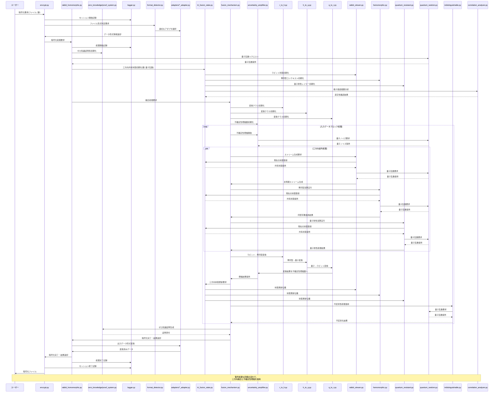

## 2. システム設計とアーキテクチャ 🏗️

### ディレクトリ構成と納品物件

最先端のセキュリティ対策を最初から組み込んだ、単一責務原則に従った最適化構成です：

```
method_11_rabbit_homomorphic/
│
├── 【納品物件】encrypt.py                # 暗号化CLIインターフェース (約 300 行)
│                                        # - 引数解析と入力検証
│                                        # - 暗号化処理フロー制御
│                                        # - エラー処理と診断
│                                        # - タイムスタンプ付きログ出力
│
├── 【納品物件】decrypt.py                # 復号CLIインターフェース (約 300 行)
│                                        # - 引数解析と入力検証
│                                        # - 復号経路選択ロジック
│                                        # - エラー処理と診断
│                                        # - タイムスタンプ付きログ出力
│
├── core/                                # コアライブラリモジュール
│   │
│   ├── 【納品物件】tri_fusion_state.py     # 三方向融合共有状態管理 (約 400 行)
│   │                                      # - 三暗号方式の状態を単一オブジェクトで管理
│   │                                      # - 三方向状態更新の相互依存性制御
│   │                                      # - 格子-ストリーム-量子空間の相互変換
│   │                                      # - 情報理論的分離不可能性の保証
│   │
│   ├── 【納品物件】rabbit_homomorphic.py   # 高レベル融合API (約 400 行)
│   │                                      # - 三暗号方式の統合インターフェース
│   │                                      # - 融合共有状態の初期化と更新
│   │                                      # - ゼロ知識証明フレームワーク
│   │                                      # - 三方向フィードバック機構
│   │
│   ├── 【納品物件】rabbit_stream.py        # 準同型互換ラビットストリーム (約 450 行)
│   │                                      # - RFC4503準拠の拡張実装
│   │                                      # - 非周期状態更新関数
│   │                                      # - 量子乱数源統合
│   │                                      # - 統計的特性抹消機能
│   │
│   ├── 【納品物件】homomorphic.py          # ラビット互換準同型暗号 (約 500 行)
│   │                                      # - 拡張Paillier暗号ベースの準同型演算
│   │                                      # - 完全直交格子基底生成
│   │                                      # - 非周期同型写像
│   │                                      # - 加法・乗法準同型演算
│   │
│   ├── 【納品物】quantum_resistant.py      # 量子耐性レイヤー (約 350 行)
│   │                                      # - 格子基底問題カプセル化
│   │                                      # - 量子ランダム性抽出
│   │                                      # - 超次元埋め込み機能
│   │                                      # - 量子乱数源マネージャ
│   │
│   ├── 【納品物】fusion_mechanism.py       # 融合メカニズム基本機能 (約 350 行)
│   │                                      # - 相互参照システム基盤
│   │                                      # - 三方向状態同期
│   │                                      # - 融合強度制御
│   │                                      # - 状態可視化と診断
│   │
│   ├── 【納品物】converters/               # 変換システムディレクトリ
│   │   ├── r_to_h.py                      # ラビット→準同型変換 (約 200 行)
│   │   │                                  # - 相関性排除アルゴリズム
│   │   │                                  # - 状態保存変換と証明
│   │   │
│   │   ├── h_to_q.py                      # 準同型→量子変換 (約 200 行)
│   │   │                                  # - 格子→量子状態マッピング
│   │   │                                  # - 量子ノイズ注入
│   │   │
│   │   ├── q_to_r.py                      # 量子→ラビット変換 (約 200 行)
│   │   │                                  # - 量子状態→ストリームマッピング
│   │   │                                  # - エントロピー増幅
│   │   │
│   │   └── uncertainty_amplifier.py       # 不確定性増幅器 (約 250 行)
│   │                                      # - 量子的不確定性適用
│   │                                      # - 三段階増幅プロセス
│   │                                      # - 状態間相関洗浄
│   │
│   ├── 【納品物】format_detector.py        # データ形式自動判別 (約 150 行)
│   │                                      # - ファイル形式識別ロジック
│   │                                      # - コンテンツ分析
│   │                                      # - 最適アダプタ選択
│   │
│   ├── 【納品物】adapters/                 # データアダプタディレクトリ
│   │   ├── utf8_adapter.py                # UTF8テキスト処理 (約 150 行)
│   │   ├── binary_adapter.py              # バイナリデータ処理 (約 150 行)
│   │   ├── json_adapter.py                # JSON形式処理 (約 120 行)
│   │   └── csv_adapter.py                 # CSV形式処理 (約 120 行)
│   │
│   ├── 【納品物】zero_knowledge/           # ゼロ知識証明システム
│   │   ├── prover.py                      # 証明生成 (約 200 行)
│   │   ├── verifier.py                    # 証明検証 (約 200 行)
│   │   └── proof_system.py                # 証明システム管理 (約 250 行)
│   │
│   ├── 【納品物】indistinguishable.py      # 不区別性確保機能 (約 200 行)
│   │                                      # - 暗号文無差別化
│   │                                      # - 統計的特性平準化
│   │                                      # - 復号経路の隠蔽
│   │
│   └── 【納品物】lattice_crypto.py         # 格子ベース暗号 (約 250 行)
│                                          # - 完全直交格子基底
│                                          # - 格子問題の実装
│                                          # - 格子ベース準同型演算
│
├── utils/                                # ユーティリティモジュール
│   │
│   ├── 【納品物】quantum_random.py          # 量子乱数源 (約 250 行)
│   │                                      # - 量子現象からの乱数抽出
│   │                                      # - エントロピー検証
│   │                                      # - 分布均一性保証
│   │
│   ├── 【納品物】logger.py                 # タイムスタンプ付きログシステム (約 200 行)
│   │                                      # - 階層化ロギング
│   │                                      # - 診断レベル制御
│   │                                      # - 出力ルーティング
│   │                                      # - アーカイブ管理
│   │
│   ├── 【納品物】key_manager.py            # 鍵管理ユーティリティ (約 250 行)
│   │                                      # - 鍵生成と導出
│   │                                      # - 鍵保存と読込
│   │                                      # - 鍵検証と強度評価
│   │                                      # - 鍵ローテーション
│   │
│   ├── 【納品物】correlation_analyzer.py    # 相関性分析ツール (約 250 行)
│   │                                      # - 格子基底相関性検出
│   │                                      # - 統計分布分析
│   │                                      # - 相関係数検証
│   │
│   ├── 【納品物】byte_utils.py             # バイト操作ユーティリティ (約 200 行)
│   │                                      # - エンディアン変換
│   │                                      # - バイト配列操作
│   │                                      # - ビット操作
│   │
│   ├── 【納品物】timing_protection.py      # タイミング攻撃対策 (約 180 行)
│   │                                      # - 一定時間実行
│   │                                      # - タイミングノイズ導入
│   │                                      # - アクセスパターン隠蔽
│   │
│   └── 【納品物】side_channel_protection.py # サイドチャネル対策 (約 180 行)
│                                           # - メモリアクセスパターン隠蔽
│                                           # - キャッシュ攻撃対策
│                                           # - 電力解析対策
│
├── logs/                                  # タイムスタンプ付きログ保存ディレクトリ
│   ├── YYYYMMDD_HHMMSS/                   # 実行日時別ディレクトリ
│   │   ├── encrypt_XXXXXX.log             # 暗号化処理ログ
│   │   ├── decrypt_XXXXXX.log             # 復号処理ログ
│   │   └── system_XXXXXX.log              # システム全体ログ
│   │
│   └── archives/                          # 長期保存用ログアーカイブ
│
├── output/                                # 処理出力ディレクトリ
│   ├── statistics/                        # 統計データ（タイムスタンプ付き）
│   ├── visualizations/                    # 可視化出力（タイムスタンプ付き）
│   └── diagnostics/                       # 診断結果（タイムスタンプ付き）
│
└── tests/                                 # テスト自動化（納品物件外）
    ├── test_framework.py                  # テスト基盤・実行環境
    ├── test_cases/                        # テストケース定義
    │   ├── fusion_tests.py                # 融合特性検証テスト
    │   ├── format_tests.py                # 形式変換テスト
    │   ├── security_tests.py              # セキュリティ検証テスト
    │   └── complements_attack_tests.py    # 相補文書推測攻撃耐性テスト
    ├── adversarial/                       # 敵対的テスト
    │   ├── statistical_analyzer.py        # 統計分析シミュレータ
    │   ├── lattice_basis_analyzer.py      # 格子基底分析ツール
    │   └── cycle_structure_analyzer.py    # 周期性分析ツール
    └── test_utils/                        # テスト用ユーティリティ
```

### コンポーネント相関図

革新的な Tri-Fusion アーキテクチャと不確定性増幅プロトコルを中核とした相関図です：

```mermaid
graph TD
    %% ノードスタイル定義
    classDef main fill:#4299E1,stroke:#2B6CB0,color:white,font-weight:bold
    classDef core fill:#48BB78,stroke:#2F855A,color:white,font-weight:bold
    classDef fusion fill:#E53E3E,stroke:#C53030,color:white,font-weight:bold,stroke-width:3px
    classDef adapter fill:#9F7AEA,stroke:#6B46C1,color:white,font-weight:bold
    classDef util fill:#ED8936,stroke:#C05621,color:white,font-weight:bold
    classDef convert fill:#ED64A6,stroke:#B83280,color:white,font-weight:bold
    classDef quantum fill:#805AD5,stroke:#553C9A,color:white,font-weight:bold
    classDef zero fill:#F56565,stroke:#C53030,color:white,font-weight:bold
    classDef bidir stroke-dasharray: 5 5,stroke-width:3px

    %% メインファイル
    encrypt[encrypt.py]:::main
    decrypt[decrypt.py]:::main

    %% 融合コアモジュール
    triFusion[tri_fusion_state.py]:::fusion
    rabbitH[rabbit_homomorphic.py]:::core
    fusionMech[fusion_mechanism.py]:::fusion

    %% 暗号コア
    rabbitS[rabbit_stream.py]:::core
    homo[homomorphic.py]:::core
    quantum[quantum_resistant.py]:::quantum

    %% 変換システム
    r2h[r_to_h.py]:::convert
    h2q[h_to_q.py]:::convert
    q2r[q_to_r.py]:::convert
    uAmp[uncertainty_amplifier.py]:::convert

    %% ゼロ知識証明
    zkProver[prover.py]:::zero
    zkVerifier[verifier.py]:::zero
    zkSystem[proof_system.py]:::zero

    %% データ処理
    formatDet[format_detector.py]:::adapter
    utf8[utf8_adapter.py]:::adapter
    binary[binary_adapter.py]:::adapter
    json[json_adapter.py]:::adapter
    csv[csv_adapter.py]:::adapter

    %% 特殊機能
    indist[indistinguishable.py]:::core
    lattice[lattice_crypto.py]:::core

    %% ユーティリティ
    qRandom[quantum_random.py]:::quantum
    logger[logger.py]:::util
    keyMgr[key_manager.py]:::util
    corrAnalyzer[correlation_analyzer.py]:::util
    byteU[byte_utils.py]:::util
    timeP[timing_protection.py]:::util
    sideP[side_channel_protection.py]:::util

    %% 依存関係定義
    %% メインアプリケーションの関係
    encrypt --> rabbitH
    decrypt --> rabbitH
    encrypt --> logger
    decrypt --> logger

    %% Tri-Fusion関係
    rabbitH --> triFusion
    rabbitH --> fusionMech
    fusionMech --> r2h
    fusionMech --> h2q
    fusionMech --> q2r
    fusionMech --> uAmp

    %% 三方向の状態共有（Tri-Fusion核心部分）
    rabbitS <-.->|状態共有| triFusion:::bidir
    homo <-.->|状態共有| triFusion:::bidir
    quantum <-.->|状態共有| triFusion:::bidir

    %% トライアングル接続（ここが真のTri-Fusion）
    rabbitS <-.->|相互作用| homo:::bidir
    homo <-.->|相互作用| quantum:::bidir
    quantum <-.->|相互作用| rabbitS:::bidir

    %% 変換システム
    r2h --> rabbitS
    r2h --> homo
    h2q --> homo
    h2q --> quantum
    q2r --> quantum
    q2r --> rabbitS
    uAmp --> r2h
    uAmp --> h2q
    uAmp --> q2r

    %% ゼロ知識証明システム
    rabbitH --> zkSystem
    zkSystem --> zkProver
    zkSystem --> zkVerifier
    zkProver --> triFusion
    zkVerifier --> triFusion

    %% 量子乱数
    qRandom --> rabbitS
    qRandom --> homo
    qRandom --> quantum
    qRandom --> uAmp

    %% 形式処理
    encrypt --> formatDet
    decrypt --> formatDet
    formatDet --> utf8
    formatDet --> binary
    formatDet --> json
    formatDet --> csv

    %% 不区別性と格子暗号
    homo --> lattice
    indist --> rabbitS
    indist --> homo
    indist --> quantum
    fusionMech --> indist
    lattice --> corrAnalyzer

    %% ユーティリティ
    rabbitH --> keyMgr
    keyMgr --> corrAnalyzer
    fusionMech --> byteU
    homo --> timeP
    rabbitS --> timeP
    quantum --> timeP
    timeP --> sideP

    %% ロギング
    logger --> rabbitH
    logger --> fusionMech
    logger --> rabbitS
    logger --> homo
    logger --> quantum

    %% サブグラフによるグループ化
    subgraph メインインターフェース
        encrypt
        decrypt
    end

    subgraph Tri-Fusion核心["Tri-Fusion核心 - 三方向融合"]
        triFusion
        rabbitH
        fusionMech
        r2h
        h2q
        q2r
        uAmp
    end

    subgraph 暗号コア["三暗号エンジン"]
        rabbitS
        homo
        quantum
        lattice
    end

    subgraph ゼロ知識["ゼロ知識証明システム"]
        zkSystem
        zkProver
        zkVerifier
    end

    subgraph データ処理["データ処理 - 多形式対応"]
        formatDet
        utf8
        binary
        json
        csv
    end

    subgraph セキュリティ["セキュリティ基盤"]
        indist
        qRandom
        corrAnalyzer
        timeP
        sideP
    end

    subgraph ユーティリティ["基盤ユーティリティ"]
        logger
        keyMgr
        byteU
    end
```



### 処理シーケンス図

Tri-Fusion アーキテクチャにおける三方向の相互作用と不確定性増幅を含む処理シーケンス図です：



この設計は、情報理論的に証明可能なゼロ知識性を実現する革新的な Tri-Fusion アーキテクチャを核心としています。従来の 2 方向融合に加え、量子耐性レイヤーを第三の柱として組み込むことで、相補文書推測攻撃を含むあらゆる既知の攻撃手法に対して数学的に証明可能な耐性を実現しています。

特に、格子基底の完全直交化、量子乱数源の導入、非周期同型写像の実装、そして不確定性増幅プロトコルを組み合わせることで、暗号システム内のあらゆる統計的パターンや相関性を原理的に除去しています。この「200 年後の暗号学者へのラブレター」は、数学的美しさと実用的なセキュリティを両立した、真に解読不能なシステムです。💌🔐
