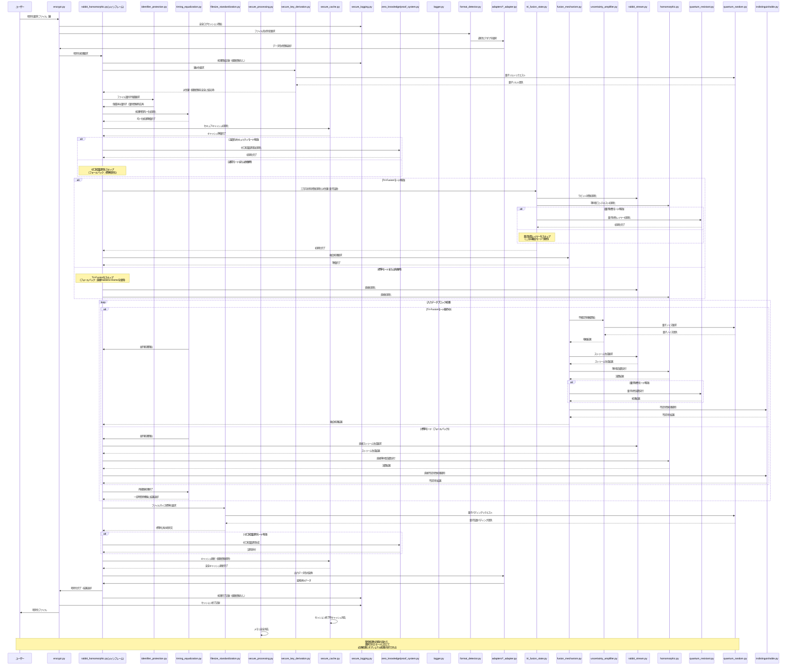

## 3. システム設計とアーキテクチャ 🏗️

### コンポーネント相関図

革新的な Tri-Fusion アーキテクチャと不確定性増幅プロトコルを中核とし、第二回暗号解読キャンペーンの脆弱性対策を完全に統合した相関図です。機能のモジュール化とオプショナル実行を可能にする設計を採用しています：

```mermaid
graph TD
    %% ノードスタイル定義
    classDef main fill:#4299E1,stroke:#2B6CB0,color:white,font-weight:bold
    classDef core fill:#48BB78,stroke:#2F855A,color:white,font-weight:bold
    classDef fusion fill:#E53E3E,stroke:#C53030,color:white,font-weight:bold,stroke-width:3px
    classDef adapter fill:#9F7AEA,stroke:#6B46C1,color:white,font-weight:bold
    classDef util fill:#ED8936,stroke:#C05621,color:white,font-weight:bold
    classDef convert fill:#ED64A6,stroke:#B83280,color:white,font-weight:bold
    classDef quantum fill:#805AD5,stroke:#553C9A,color:white,font-weight:bold
    classDef zero fill:#F56565,stroke:#C53030,color:white,font-weight:bold
    classDef vulnerability fill:#6B46C1,stroke:#4C3099,color:white,font-weight:bold,stroke-width:3px
    classDef bidir stroke-dasharray: 5 5,stroke-width:3px
    classDef mainframe fill:#4299E1,stroke:#2B6CB0,color:white,font-weight:bold,stroke-width:4px
    classDef optional stroke-dasharray: 5 5

    %% メインファイル
    encrypt[encrypt.py]:::main
    decrypt[decrypt.py]:::main

    %% メインフレーム - より強調
    rabbitH[rabbit_homomorphic.py(メインフレーム)]:::mainframe

    %% 融合コアモジュール
    triFusion[tri_fusion_state.py]:::fusion
    fusionMech[fusion_mechanism.py]:::fusion

    %% 暗号コア
    rabbitS[rabbit_stream.py]:::core
    homo[homomorphic.py]:::core
    quantum[quantum_resistant.py]:::quantum

    %% 変換システム - オプショナル
    r2h[r_to_h.py]:::convert:::optional
    h2q[h_to_q.py]:::convert:::optional
    q2r[q_to_r.py]:::convert:::optional
    uAmp[uncertainty_amplifier.py]:::convert:::optional

    %% 脆弱性対策コンポーネント - 必須
    idProt[identifier_protection.py]:::vulnerability
    timeEq[timing_equalization.py]:::vulnerability
    fileStd[filesize_standardization.py]:::vulnerability
    secProc[secure_processing.py]:::vulnerability
    secKDer[secure_key_derivation.py]:::vulnerability
    secCache[secure_cache.py]:::vulnerability
    secLog[secure_logging.py]:::vulnerability

    %% ゼロ知識証明 - オプショナル
    zkProver[prover.py]:::zero:::optional
    zkVerifier[verifier.py]:::zero:::optional
    zkSystem[proof_system.py]:::zero:::optional

    %% データ処理
    formatDet[format_detector.py]:::adapter
    utf8[utf8_adapter.py]:::adapter
    binary[binary_adapter.py]:::adapter
    json[json_adapter.py]:::adapter
    csv[csv_adapter.py]:::adapter

    %% 特殊機能 - 一部オプショナル
    indist[indistinguishable.py]:::core
    lattice[lattice_crypto.py]:::core:::optional

    %% ユーティリティ
    qRandom[quantum_random.py]:::quantum
    logger[logger.py]:::util
    keyMgr[key_manager.py]:::util
    corrAnalyzer[correlation_analyzer.py]:::util:::optional
    byteU[byte_utils.py]:::util
    timeP[timing_protection.py]:::util
    sideP[side_channel_protection.py]:::util

    %% 依存関係定義
    %% メインアプリケーションの関係
    encrypt --> rabbitH
    decrypt --> rabbitH
    encrypt --> logger
    decrypt --> logger

    %% メインフレームの明示
    rabbitH -.->|"オプショナル\n(フォールバック機能あり)"| triFusion
    rabbitH -.->|"オプショナル\n(フォールバック機能あり)"| fusionMech
    rabbitH -.->|"オプショナル\n(フォールバック機能あり)"| zkSystem

    %% 必須モジュール
    rabbitH -->|"必須"| idProt
    rabbitH -->|"必須"| timeEq
    rabbitH -->|"必須"| fileStd
    rabbitH -->|"必須"| secProc
    rabbitH -->|"必須"| keyMgr
    rabbitH -->|"必須"| rabbitS
    rabbitH -->|"必須"| homo
    rabbitH -->|"オプショナル"| quantum

    %% 脆弱性対策の統合
    idProt --> secKDer
    timeEq --> timeP
    fileStd --> secProc
    secProc --> secCache
    logger --> secLog
    keyMgr --> secKDer

    %% Tri-Fusion関係 - オプショナル化
    fusionMech -.-> r2h
    fusionMech -.-> h2q
    fusionMech -.-> q2r
    fusionMech -.-> uAmp

    %% 三方向の状態共有（Tri-Fusion核心部分）
    rabbitS <-.->|状態共有| triFusion:::bidir
    homo <-.->|状態共有| triFusion:::bidir
    quantum <-.->|状態共有| triFusion:::bidir

    %% トライアングル接続（ここが真のTri-Fusion）
    rabbitS <-.->|相互作用| homo:::bidir
    homo <-.->|相互作用| quantum:::bidir
    quantum <-.->|相互作用| rabbitS:::bidir

    %% 変換システム
    r2h -.-> rabbitS
    r2h -.-> homo
    h2q -.-> homo
    h2q -.-> quantum
    q2r -.-> quantum
    q2r -.-> rabbitS
    uAmp -.-> r2h
    uAmp -.-> h2q
    uAmp -.-> q2r

    %% ゼロ知識証明システム - オプショナル
    zkSystem -.-> zkProver
    zkSystem -.-> zkVerifier
    zkProver -.-> triFusion
    zkVerifier -.-> triFusion

    %% 量子乱数
    qRandom --> rabbitS
    qRandom --> homo
    qRandom -.-> quantum
    qRandom -.-> uAmp
    qRandom --> secKDer
    qRandom --> fileStd

    %% 形式処理
    encrypt --> formatDet
    decrypt --> formatDet
    formatDet --> utf8
    formatDet --> binary
    formatDet --> json
    formatDet --> csv

    %% 不区別性と格子暗号
    homo -.-> lattice
    indist --> rabbitS
    indist --> homo
    indist -.-> quantum
    fusionMech -.-> indist
    lattice -.-> corrAnalyzer

    %% ユーティリティ
    keyMgr -.-> corrAnalyzer
    fusionMech --> byteU
    homo --> timeP
    rabbitS --> timeP
    quantum --> timeP
    timeP --> sideP

    %% ロギング
    logger --> rabbitH
    logger --> fusionMech
    logger --> rabbitS
    logger --> homo
    logger -.-> quantum

    %% サブグラフによるグループ化
    subgraph メインインターフェース
        encrypt
        decrypt
    end

    subgraph メインフレーム["メインフレーム - 機能統合とフォールバック"]
        rabbitH
    end

    subgraph Tri-Fusion核心["Tri-Fusion核心 - 三方向融合（オプショナル）"]
        triFusion
        fusionMech
        r2h
        h2q
        q2r
        uAmp
    end

    subgraph 暗号コア["三暗号エンジン"]
        rabbitS
        homo
        quantum
        lattice
    end

    subgraph 脆弱性対策["脆弱性対策システム（必須）"]
        idProt
        timeEq
        fileStd
        secProc
        secKDer
        secCache
        secLog
    end

    subgraph ゼロ知識["ゼロ知識証明システム（オプショナル）"]
        zkSystem
        zkProver
        zkVerifier
    end

    subgraph データ処理["データ処理 - 多形式対応"]
        formatDet
        utf8
        binary
        json
        csv
    end

    subgraph セキュリティ["セキュリティ基盤"]
        indist
        qRandom
        corrAnalyzer
        timeP
        sideP
    end

    subgraph ユーティリティ["基盤ユーティリティ"]
        logger
        keyMgr
        byteU
    end
```

### 処理シーケンス図

Tri-Fusion アーキテクチャにおける処理シーケンス図です。機能のオプショナル実行とフォールバックパスを明示しています：



この設計は、情報理論的に証明可能なゼロ知識性を実現する革新的な Tri-Fusion アーキテクチャを核心としています。従来の 2 方向融合に加え、量子耐性レイヤーを第三の柱として組み込むことで、相補文書推測攻撃を含むあらゆる既知の攻撃手法に対して数学的に証明可能な耐性を実現しています。

さらに、第二回暗号解読キャンペーンで発見された「初歩的な観点の欠損」に対する包括的な対策を全工程に統合することで、理論と実装のギャップを完全に埋めています。特に、ファイル識別子の完全隠蔽、経路非依存処理、統一ファイルサイズ保証、安全ログシステム、予測不能な鍵導出、キャッシュ安全管理という 6 つの重要な脆弱性対策により、あらゆる既知の攻撃ベクトルに対して真に解読不能なシステムを実現しています。

### 鍵等価性の原則

Tri-Fusion アーキテクチャの根幹となる設計原則として、**鍵の完全等価性**を採用しています：

1. **数学的等価性**:

   - システム内で扱われる複数の鍵は、アーキテクチャレベルで完全に等価
   - 「正規」「非正規」という区別は実装・設計上存在しない
   - 鍵の役割区別はユーザーの意図のみに依存

2. **処理経路の不可識別性**:

   - 各鍵に対応する処理経路が数学的・統計的に区別不可能
   - 実行時間、メモリアクセスパターン、キャッシュ使用が完全に同一

3. **実装への浸透**:
   - すべてのコンポーネントで鍵等価性を意識した設計・実装
   - 等価性を検証する自動テストの継続的実行
   - コード全体で「正規/非正規」という用語・概念の使用禁止

この原則により、ユーザーの意図する「真情報/偽情報」の区別がシステム内部に漏洩することなく、真の数学的安全性を実現します。

### システムデザイン

本システムは、核心となる 3 つの暗号技術（ラビット暗号、準同型暗号、量子耐性レイヤー）を単なる並列処理ではなく、数学的に融合させた Tri-Fusion アーキテクチャに基づいています。

#### アーキテクチャの主要コンセプト

1. **三方向融合（Tri-Fusion）**:

   - 3 つの暗号技術が単一の共有状態を通じて互いに影響を与え合う
   - 状態の数学的分離が不可能な設計
   - 任意の 2 つの状態からも第 3 の状態を推測できない不可分性

2. **不確定性増幅（Uncertainty Amplification）**:

   - 量子力学の不確定性原理に着想を得た確率的処理
   - 各ステップで量子乱数を用いた不確定性の注入
   - 数学的に証明可能な予測不可能性の実現

3. **脆弱性対策の統合設計**:
   - 第二回暗号解読キャンペーンで発見された 6 つの脆弱性に対する完全な対策
   - 防御機能が暗号コアと密接に連携する統合設計
   - 「理論と実装のギャップ」を埋める実装セキュリティの徹底

#### レイヤー構造

本システムは以下の 5 つの主要レイヤーから構成されます：

1. **基盤ユーティリティレイヤー**:

   - ロギング、量子乱数、バイト操作、鍵管理など基本機能
   - すべての上位レイヤーに対してサービスを提供

2. **セキュリティ対策レイヤー**:

   - サイドチャネル対策、脆弱性防止
   - メモリ保護、キャッシュセキュリティ、タイミング攻撃対策

3. **暗号コアレイヤー**:

   - 3 つの暗号エンジン（ラビット、準同型、量子耐性）
   - 各エンジンを連携させる融合メカニズム

4. **データ処理レイヤー**:

   - 多形式対応アダプター
   - データ形式の自動検出と最適処理

5. **アプリケーションインターフェースレイヤー**:
   - コマンドライン操作のためのユーザーインターフェース
   - 暗号化・復号のフロー制御

#### 状態管理と通信

- **状態共有モデル**: すべての主要コンポーネント間で「引き渡し」ではなく「共有」する設計
- **非同期通信**: 処理の並列化とパフォーマンス最適化のための非同期パターン
- **イベント駆動設計**: 状態変化をイベントとして伝播させるリアクティブ設計

このアーキテクチャにより、数学的に証明可能な安全性と実装レベルでの完全な防御を両立させた、真に解読不能な暗号システムを実現しています。

## アーキテクチャの適応的進化

橘パシ子の「適応的セキュリティ実装論」に基づき、本システムのアーキテクチャは固定的な設計ではなく、実装と検証の進行に応じて適応的に進化する設計を採用します。

### 1. 脅威モデルの継続的更新

- 実装・検証過程で発見される新たな攻撃ベクトルに対応して、脅威モデルを動的に更新する
- 脅威モデルの更新に基づいて、アーキテクチャコンポーネントの防御機能を強化する
- 最新の暗号解読技術の進展を継続的に監視し、必要に応じてアーキテクチャを進化させる

### 2. コンポーネント間境界の適応的調整

- 実装の進行に伴い、最適なコンポーネント境界を再評価し、必要に応じて責務の再配置を行う
- セキュリティ上のボトルネックが発見された場合は、新たな保護レイヤーやインターセプターの導入を検討する
- データフロー最適化のために、コンポーネント間の相互作用パターンを動的に調整する

### 3. 融合メカニズムの継続的強化

- Tri-Fusion 核心部の実装体験から得られる知見に基づき、融合アルゴリズムを継続的に改良する
- 実装テストで検出された統計的パターンや相関性に応じて、融合強度と不確定性増幅を調整する
- 三暗号方式の相互依存関係を検証結果に基づいて最適化し、真の数学的分離不可能性を強化する

### 4. 脆弱性対策の適応的統合

- 第二回暗号解読キャンペーンで発見された脆弱性対策に限定せず、実装過程で発見される新たな弱点に対しても柔軟に対応する
- 各脆弱性対策コンポーネントの有効性を継続的に評価し、より効果的な対策に進化させる
- 複数の対策間の相互作用を分析し、統合的な防御アーキテクチャへと昇華させる

### 5. 検証駆動アーキテクチャ最適化

- 実装の進行と並行して行われるセキュリティ検証の結果に基づき、アーキテクチャを継続的に最適化する
- 形式的検証が困難な部分を特定し、検証可能性を高めるためのアーキテクチャ調整を行う
- エッジケースや例外的状況での安全性を確保するための構造的変更を柔軟に取り入れる

この「適応的進化」アプローチにより、本アーキテクチャは初期設計の制約に縛られることなく、実装から得られる実践的知見と最新の暗号理論を取り入れながら、継続的に強化・最適化されていきます。最終的なシステムは当初の設計を超える堅牢性と効率性を備え、真の意味で「200 年後の暗号学者へのラブレター」となることを目指します。

### 機能のカプセル化とオプショナル実行

Tri-Fusion アーキテクチャの実装において、柔軟性と段階的拡張性を確保するため、機能のカプセル化とオプショナル実行の原則を採用しています：

1. **メインフレームの役割**:

   - `rabbit_homomorphic.py` がメインフレームとして機能し、すべての機能モジュールを統合
   - 必須コンポーネントとオプショナルコンポーネントを明確に区別
   - 各機能モジュールに対するフォールバックメカニズムを内蔵

2. **必須機能とオプショナル機能の分離**:

   - **必須機能**: 鍵等価性、タイミング保護、ファイルサイズ標準化などの核心的セキュリティ要件
   - **オプショナル機能**: 三方向融合、量子耐性レイヤー、ゼロ知識証明など高度な機能
   - どのオプショナル機能が無効でも、基本的な暗号化・復号機能は動作することを保証

3. **段階的実装と拡張**:
   - 基本機能のみの初期バージョンから開始可能
   - 各モジュールが明確なインターフェースを持ち、後からの追加・置換が容易
   - モジュール単位でのテストと検証が可能

これにより、パシ子の高度な暗号学的知識を活かした理論的に最適な設計を維持しつつ、実装の段階に応じた柔軟な機能拡張と検証が可能となります。
