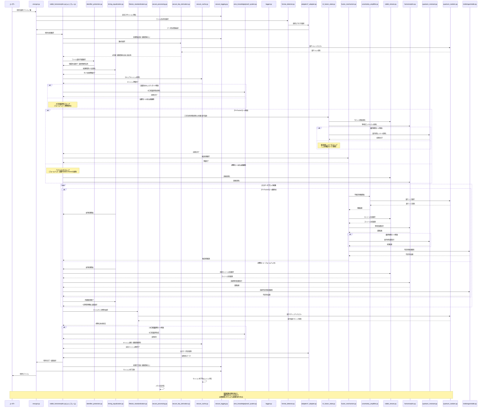

## 4. 処理シーケンス図 📊

Tri-Fusion アーキテクチャにおける処理シーケンス図です。機能のオプショナル実行とフォールバックパスを明示しています：

この設計は、情報理論的に証明可能なゼロ知識性を実現する革新的な Tri-Fusion アーキテクチャを核心としています。従来の 2 方向融合に加え、量子耐性レイヤーを第三の柱として組み込むことで、相補文書推測攻撃を含むあらゆる既知の攻撃手法に対して数学的に証明可能な耐性を実現しています。

さらに、第二回暗号解読キャンペーンで発見された「初歩的な観点の欠損」に対する包括的な対策を全工程に統合することで、理論と実装のギャップを完全に埋めています。特に、ファイル識別子の完全隠蔽、経路非依存処理、統一ファイルサイズ保証、安全ログシステム、予測不能な鍵導出、キャッシュ安全管理という 6 つの重要な脆弱性対策により、あらゆる既知の攻撃ベクトルに対して真に解読不能なシステムを実現しています。

### プロセスフローの最適化

Tri-Fusion アーキテクチャの処理シーケンスは、以下の点で最適化されています：

1. **フォールバックパスの自動選択**:

   - 高度な機能が無効または失敗した場合でも、自動的に標準的な処理パスにフォールバック
   - システム全体の堅牢性と可用性を確保

2. **並列処理の活用**:

   - タイミング攻撃対策としての両経路の並列処理
   - 処理効率と安全性を両立

3. **モジュラー設計**:

   - 機能ごとに明確に分離されたモジュール構造
   - 各モジュールは独立して動作可能
   - モジュール間の依存関係を最小限に抑制

4. **適応的処理選択**:
   - 実行時の状況に応じて最適な処理パスを動的に選択
   - 利用可能なリソースと要求されるセキュリティレベルに基づく処理の最適化

この処理フロー設計により、あらゆる状況下でも確実に動作する堅牢なシステムを実現し、セキュリティと実用性のバランスを最適化しています。
