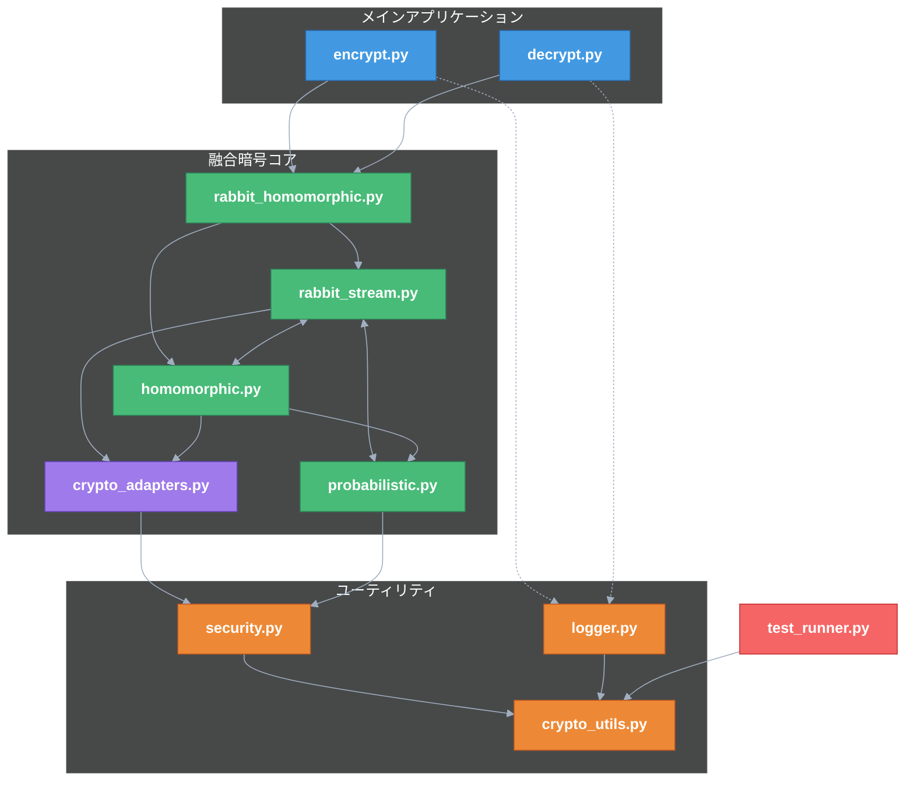

## 納品物件一覧表 📦

下記のディレクトリ構成で実装を行うこと。各ファイルは約 500 行を目安とする。**太字のファイルが納品物件**となる。

### ファイル間の親子関係と依存構造

### 各モジュールの責務と融合ポイント

#### メインスクリプト:

1. **encrypt.py** (約 300 行):

   - ユーザーが直接実行するコマンドラインツール
   - 入力として元ファイル（true.text, false.text）と鍵を受け取る
   - 引数解析、ヘルプ表示、エラー処理などのユーザーインターフェース
   - rabbit_homomorphic.py を使って暗号化を行う
   - 暗号化されたファイルを出力する
   - **自己診断とログ出力機能を内蔵**し、処理状態や結果を記録

2. **decrypt.py** (約 300 行):
   - ユーザーが直接実行するコマンドラインツール
   - 入力として暗号化ファイルと鍵を受け取る
   - 引数解析、ヘルプ表示、エラー処理などのユーザーインターフェース
   - rabbit_homomorphic.py を使って復号を行う
   - 鍵に応じて true.text または false.text を出力する
   - **自己診断とログ出力機能を内蔵**し、処理状態や結果を記録

#### 融合暗号コア:

3. **rabbit_homomorphic.py** (約 400 行):

   - **暗号融合レイヤー**: 両暗号方式を数学的に統合する中核部分
   - **格子-ストリーム変換制御**: 両暗号間のデータ・状態変換を管理
   - **統合 API 提供**: 外部から見ると単一の暗号システムとして機能
   - **暗号化/復号の統合ワークフロー管理**: 暗号化・復号プロセス全体の調整
   - **内部状態の一貫性検証**: 両暗号間の整合性を確認・保証
   - **融合暗号特性の理論的検証**: 実行時に融合特性を数学的に検証

4. **rabbit_stream.py** (約 450 行):

   - **拡張ラビットストリーム生成**: 標準を超える拡張実装
   - **準同型演算対応状態管理**: 準同型演算と互換性のある内部状態設計
   - **格子埋め込み可能ストリーム**: 格子問題への埋め込みが可能な特殊ストリーム生成
   - **可換環対応カウンター**: 準同型演算の可換環と互換性のあるカウンター設計
   - **homomorphic.py との連携インターフェース**: 準同型モジュールと直接連携する API
   - **統計的特性の自己診断**: ストリーム品質の統計的検証機能

5. **homomorphic.py** (約 500 行):

   - **格子ベース部分準同型暗号**: 格子問題に基づく準同型演算実装
   - **ストリーム互換マスキング**: ラビットストリームと互換性のあるマスク生成
   - **rabbit_stream.py との連携インターフェース**: ラビットモジュールと直接連携する API
   - **リング演算最適化**: 加法・乗法準同型性の高効率実装
   - **ラビット状態の準同型変換**: ストリーム状態を準同型空間へ可逆変換
   - **準同型特性の数学的検証**: 準同型性の保存を実行時検証

6. **crypto_adapters.py** (約 500 行):

   - **様々なデータ形式の処理**: 複数のデータ形式に対応するアダプター群
   - **融合暗号処理前後の変換**: 融合暗号プロセッサへの入出力データ変換
   - **統合暗号システムへの最適形式変換**: 各データタイプの最適な処理形式への変換
   - **準同型特性を保持した変換**: データ変換後も準同型特性を維持
   - **暗号文統計特性の均質化**: 異なるデータタイプが同様の暗号文特性を持つよう調整

7. **probabilistic.py** (約 350 行):
   - **融合確率モデル**: ラビットと準同型処理の確率的結合制御
   - **準同型保存乱数生成**: 準同型特性を保存する特殊乱数生成
   - **ラビット連動確率分布**: ラビットの内部状態と連動する確率分布制御
   - **確率的実行経路の多様化**: 実行経路を確率的に分岐させる機構
   - **準同型-ストリーム間の確率的結合**: 両方式を確率的に結合する特殊機構
   - **統計的独立性の検証**: 両方式の確率的独立性を検証

#### ユーティリティモジュール:

8. **crypto_utils.py** (約 400 行):

   - **融合環境の統合鍵管理**: 両暗号方式で整合的に機能する鍵管理
   - **格子-ストリーム変換ユーティリティ**: 両方式間のデータ変換補助機能
   - **環同型演算支援**: 準同型演算の数学的基盤を支援
   - **バイト操作と変換**: 低レベルデータ操作機能
   - **融合暗号の整合性検証**: 両方式の整合性確認機能

9. **logger.py** (約 200 行):

   - **全納品物件で使用される標準ログ機能**
   - **複数ログレベル管理**: ERROR, WARNING, INFO, DEBUG, TRACE のサポート
   - **構造化ログフォーマット**: 統一された解析可能なログ形式
   - **テスト解析用出力形式**: 自動テスト用の標準化されたログ形式
   - **タイムスタンプ付きファイル管理**: 上書き防止と履歴追跡機能

10. **security.py** (約 350 行):
    - **融合暗号向けセキュリティ機能**: 両方式に対応するセキュリティ対策
    - **NIST 認定乱数生成**: 標準準拠の暗号学的乱数生成
    - **サイドチャネル対策**: 電力解析などの物理攻撃への対策
    - **量子攻撃対策**: 量子コンピュータによる攻撃への対策
    - **融合暗号の安全性検証**: 統合システムの安全性を検証

#### テスト関連（納品物件外）:

11. **test_runner.py**:

    - **納品物件を自動実行するだけ**の軽量フレームワーク
    - 納品物件が出力するログを解析して結果を判定
    - テストケースを納品物件に入力として与える
    - 納品物件自体の自己診断機能に依存
    - テスト実行中の修正は一切行わない
    - 品質の担保は納品物件自身が行う

12. **test_cases/**:

    - 各種テストシナリオの定義
    - 納品物件への入力データのみを定義
    - テスト判定ロジックは含まない
    - 期待値の定義のみを行う
    - **各種ファイル形式（UTF8、CSV、JSON、バイナリー）のテストケース**

13. **test_utils/**:
    - テスト実行のサポートツール
    - 納品物件が出力するログの解析機能
    - テスト環境のセットアップとクリーンアップ

## 納品物件一覧表 📦

| No  | 納品物件                   | 行数目安  | 主な責務                                                   |
| --- | -------------------------- | --------- | ---------------------------------------------------------- |
| 1   | encrypt.py                 | 約 300 行 | ユーザーが実行する暗号化スクリプト（CLI インターフェース） |
| 2   | decrypt.py                 | 約 300 行 | ユーザーが実行する復号スクリプト（CLI インターフェース）   |
| 3   | core/rabbit_homomorphic.py | 約 400 行 | 高レベル API 実装・統合レイヤー                            |
| 4   | core/rabbit_stream.py      | 約 450 行 | 拡張ラビット暗号実装                                       |
| 5   | core/homomorphic.py        | 約 500 行 | 準同型暗号実装                                             |
| 6   | core/crypto_adapters.py    | 約 500 行 | データ変換アダプタ実装                                     |
| 7   | core/probabilistic.py      | 約 350 行 | 確率的処理コンポーネント                                   |
| 8   | utils/crypto_utils.py      | 約 400 行 | 暗号化共通ユーティリティ                                   |
| 9   | utils/logger.py            | 約 200 行 | ログ機能実装                                               |
| 10  | utils/security.py          | 約 350 行 | セキュリティユーティリティ                                 |
