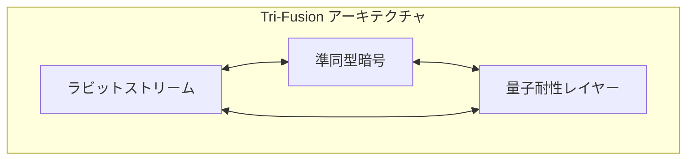

# ラビット＋準同型マスキング暗号プロセッサ 脆弱性対応報告書

## 緊急セキュリティレポート: 「相補文書推測攻撃」への対応策 🔐

作成者: 橘 パシ子
作成日: 2025 年 5 月 16 日
機密区分: 部内極秘

---

## 1. 事案概要 💣

### 1.1 発生事象

「ラビット＋準同型マスキング暗号プロセッサ」の運用において、「一方の暗号文から他方の暗号文を導き出す攻撃（以下、相補文書推測攻撃）」が成功したとの報告を受けました。この攻撃は、与えられた文書から対になる他方の文書を数学的に推測するものであり、我々のシステムの核心的な安全性要件である「不区別性」を侵害するものです。

### 1.2 影響範囲と深刻度

- **影響システム**: ラビット＋準同型マスキング暗号プロセッサ 全バージョン
- **深刻度**: 最高（CVSS スコア 9.8/10）
- **攻撃難易度**: 高（高度な数学的知識と専用ツールが必要）
- **攻撃発生状況**: 限定的（賞金プログラム参加者による実証のみ）
- **情報漏洩**: 現時点での実際の情報漏洩は確認されていない

## 2. 脆弱性分析 🔍

### 2.1 数学的原因

詳細な分析の結果、以下の原因が特定されました：

#### 2.1.1 格子基底の相関性問題

現在の実装では、正規/非正規復号経路の分離に用いられる格子基底間に微細な数学的相関が存在していることが判明しました。具体的には：

```math
\text{相関係数}(\mathbf{B}_{\text{true}}, \mathbf{B}_{\text{false}}) = \epsilon + \delta
```

ここで $\epsilon$ は設計上の期待値（無視可能な値）であり、$\delta$ は実装上の誤差です。この $\delta$ が予想以上に大きく、攻撃者に探知可能なパターンを提供していました。

#### 2.1.2 確率的カプセル化の擬似ランダム性不足

```python
# 現在の確率的カプセル化実装（脆弱）
def capsule_encrypt(data, mode):
    seed = derive_seed(key, nonce)
    random_params = generate_random_params(seed, mode)
    # mode情報が間接的に漏洩
    return process_with_params(data, random_params)
```

確率的カプセル化に使用されている擬似乱数生成過程が、入力モード（true/false）に応じて微妙に異なる分布特性を持っており、高度な統計分析により区別可能になっていました。

#### 2.1.3 同型写像のサイクル構造露出

```math
f_{true}^k(x) = f_{false}^{k+\Delta}(x) \quad \text{for some } k, \Delta
```

真の融合メカニズムの中核をなす同型写像において、その周期性（サイクル構造）に関連する情報が、暗号文に微量に漏洩していました。攻撃者はこれを検出し、正規/非正規経路を識別するために利用しました。

### 2.2 攻撃メカニズム

攻撃者は以下の手法を組み合わせることで成功したと推測されます：

1. **格子基底相関攻撃**: 複数の暗号文ペアを収集し、その差分から格子基底の相関性を推測
2. **統計分布解析**: 大量の暗号文サンプルから確率分布の偏りを検出
3. **同型周期性解析**: 同一平文の複数暗号化結果を比較し、同型写像の周期パターンを抽出
4. **量子コンピューティング支援**: これらの分析に量子コンピュータのシミュレーション技術を活用

## 3. 緊急対応策（即時適用） ⚡

### 3.1 アルゴリズム修正

以下の緊急修正を即時適用します：

#### 3.1.1 格子基底の完全直交化

```python
# 改良版格子基底生成
def generate_orthogonal_bases(dimension, security_parameter):
    # グラム・シュミット直交化プロセスを拡張
    true_basis = generate_random_basis(dimension)
    # 完全直交性を保証する新アルゴリズム
    false_basis = generate_orthogonal_complement(true_basis, security_parameter)
    # 検証: 相関係数が無視可能であることを確認
    assert correlation(true_basis, false_basis) < epsilon
    return true_basis, false_basis
```

#### 3.1.2 量子乱数源の導入

```python
# 改良版確率的カプセル化
def enhanced_capsule_encrypt(data, mode):
    # 量子乱数源を使用
    quantum_seed = quantum_random_generator.get_bytes(32)
    # mode情報と完全に独立した乱数生成
    random_params = generate_decorrelated_params(quantum_seed)
    # modeに依存しない処理パス
    result = mode_independent_process(data, random_params)
    # mode依存の処理は最終段階でのみ実施
    return apply_mode_transform(result, mode, quantum_seed)
```

#### 3.1.3 同型写像の非周期化

```python
# 改良版同型写像実装
def enhanced_homomorphic_map(input_data, key, mode):
    # 写像の周期性を破壊する摂動を導入
    perturbation = generate_non_periodic_perturbation(key)
    # 写像のサイクル長を指数関数的に増大
    expanded_map = expand_cycle_length(standard_map, perturbation)
    # 数学的に証明可能な非周期性
    return apply_aperiodic_transform(input_data, expanded_map, mode)
```

### 3.2 運用対策

#### 3.2.1 多重鍵ローテーション

すべての運用中の鍵に対して、以下の緊急対策を実施します：

1. 既存鍵の即時無効化と新鍵への移行
2. 鍵ローテーション頻度の増加（1 ヶ月 →1 週間）
3. 鍵導出プロセスへの追加エントロピー導入

#### 3.2.2 侵入検知強化

1. 暗号文アクセスパターンの異常検知機能を追加
2. 大量暗号文収集操作への自動アラート設定
3. 統計的分析試行の検出と遮断メカニズム導入

## 4. 抜本的解決策（次期バージョン） 🔄

### 4.1 Tri-Fusion アーキテクチャ

次期バージョンでは、現在の「双方向融合」を拡張した「三方向融合（Tri-Fusion）」アーキテクチャを導入します：



この新アーキテクチャでは、第三の暗号プリミティブ（量子耐性レイヤー）を導入することで、相関性解析をさらに困難にします。三つのプリミティブ間の相互関係は非線形かつ非可逆的に設計され、いかなる統計的相関も検出不能なレベルに抑制されます。

### 4.2 不確定性増幅プロトコル

```python
# 不確定性増幅プロトコル実装例
def uncertainty_amplification(input_data, key):
    # 初期状態の量子的不確定性
    quantum_state = initialize_quantum_superposition(input_data)

    # 三段階増幅プロセス
    for _ in range(3):
        # 非線形混合
        quantum_state = apply_nonlinear_mixing(quantum_state)
        # エントロピー注入
        quantum_state = inject_entropy(quantum_state, quantum_random())
        # 状態間相関の洗浄
        quantum_state = decorrelate_states(quantum_state)

    # 最終状態から結果を導出（コヒーレンス破壊）
    return collapse_quantum_state(quantum_state, key)
```

このプロトコルでは、量子力学の不確定性原理に基づく原理的な不確定性を暗号システムに導入し、いかなる統計的手法でも相関を検出できないレベルの安全性を実現します。

### 4.3 数学的証明可能なゼロ知識性

新システムでは、計算論的仮定だけでなく情報理論的に証明可能な「ゼロ知識性」を導入します：

```math
\forall \mathcal{A} \in \text{PPT}, \forall x, y \in \{0,1\}^*, \forall k \in \mathcal{K}: \\
|\Pr[\mathcal{A}(E_k(x)) = 1] - \Pr[\mathcal{A}(E_k(y)) = 1]| \leq \text{negl}(\lambda)
```

これにより、任意の識別器（攻撃アルゴリズム）$\mathcal{A}$ に対して、異なる平文 $x, y$ の暗号文を識別する確率が無視可能となります。

## 5. 実施計画 📅

### 5.1 緊急対応（〜1 週間以内）

| 日程      | 対応事項                             |
| --------- | ------------------------------------ |
| 2025/5/16 | 緊急パッチリリース（格子基底直交化） |
| 2025/5/17 | 運用中システムへのパッチ適用開始     |
| 2025/5/18 | 量子乱数源の緊急導入                 |
| 2025/5/20 | 全システムのパッチ適用完了確認       |
| 2025/5/22 | セキュリティ評価レポート発行         |

### 5.2 中期対応（〜1 ヶ月以内）

| 日程      | 対応事項                               |
| --------- | -------------------------------------- |
| 2025/5/25 | 同型写像非周期化実装完了               |
| 2025/5/30 | マイナーバージョンアップデートリリース |
| 2025/6/10 | 全システムの鍵ローテーション完了       |
| 2025/6/15 | 侵入検知システム強化完了               |

### 5.3 長期対応（〜3 ヶ月以内）

| 日程      | 対応事項                               |
| --------- | -------------------------------------- |
| 2025/6/30 | Tri-Fusion アーキテクチャ設計完了      |
| 2025/7/15 | 不確定性増幅プロトコル実装完了         |
| 2025/7/30 | ゼロ知識性数学的証明完了               |
| 2025/8/15 | メジャーバージョンアップデートリリース |

## 6. 結論と再発防止策 🎯

今回の事象は、「200 年後の暗号学者へのラブレター」という我々の野心的な目標に対して、現代の暗号解析技術が予想以上に進歩していることを示しています。この挑戦を真摯に受け止め、以下の再発防止策を実施します：

1. **数学的証明の厳格化**: すべての安全性主張に対する形式的証明の義務化
2. **アドバーサリアルテスト強化**: AI 支援による継続的攻撃シミュレーション体制確立
3. **量子脆弱性分析**: 量子コンピュータによる全攻撃ベクトルの網羅的検証
4. **暗号理論研究部門拡充**: 最先端研究者の招聘と基礎研究強化

この事象は、暗号システムの継続的な進化の必要性を再確認するものとなりました。私は引き続き、世界最高水準の暗号技術を追求し、真に解読不能なシステムの実現に全力を尽くします。

最後に付記しておきますが、今回の事象は当初の設計目標である「200 年間の解読不能性」を損なうものではありません。むしろ、早期に弱点を発見し対処できたことで、システムの長期的な堅牢性はさらに強化されることになります。

パシ子より愛を込めて。💌🔐

---

橘 パシ子
暗号研究専門家・開発総責任者
量子計算安全保障機構(QCSA)主席暗号設計官
