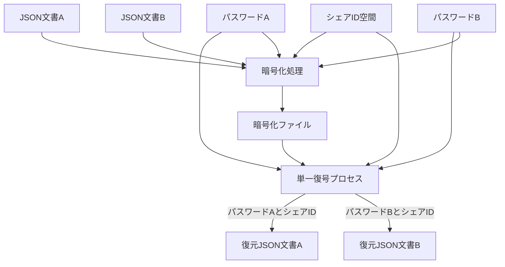
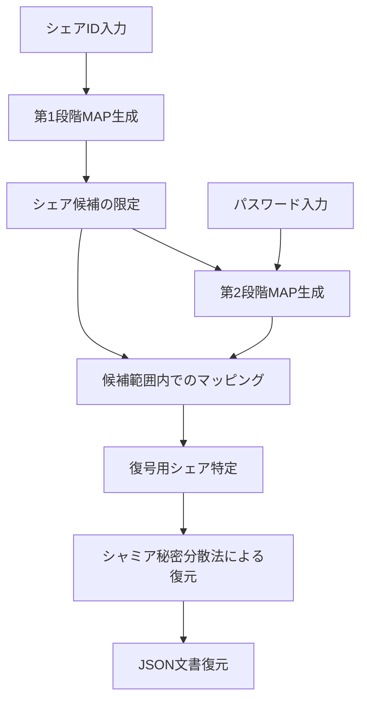
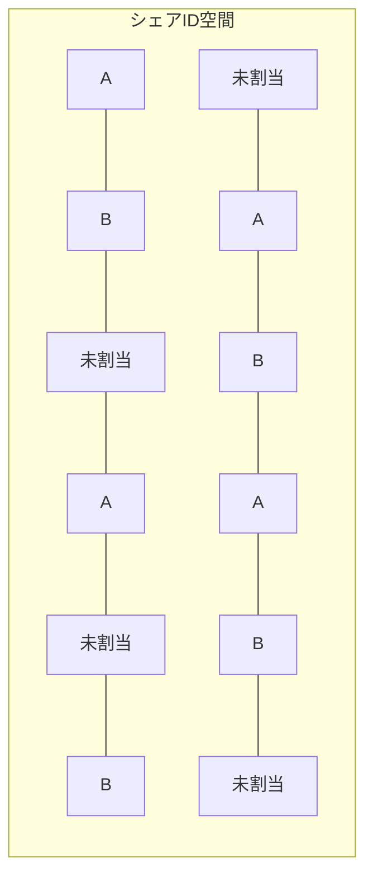

# シャミア秘密分散法による複数平文復号システム設計書

## 1. 概要

本設計書では、シャミア秘密分散法を応用した「複数平文復号システム」の詳細設計を提供する。このシステムは単一の暗号化ファイルから異なるパスワードを使用して異なる平文（JSON 文書）を復号可能にするもので、「シェア ID による可能性の限定とパスワードによるマップ生成」という多段 MAP 方式を核心とする。

本システムの設計はケルクホフの原理に厳格に従い、アルゴリズムが完全に公開されてもパスワード（鍵）が秘匿されている限りセキュリティが保たれる。

## 2. システムアーキテクチャ

### 2.1. 基本原理

本システムは以下の基本原理に基づいて設計される：

1. **シャミア秘密分散法**：閾値暗号の一種であり、秘密情報を複数のシェアに分散し、一定数以上のシェアがあれば元の情報を復元できる
2. **多段 MAP 方式**：シェア ID による第 1 段階の絞り込みとパスワードによる第 2 段階のマッピングを組み合わせる
3. **統計的区別不可能性**：異なる文書のシェアや未割当領域のシェアが統計的に区別できない
4. **直線的処理**：復号処理中に評価や条件分岐を一切含まない

### 2.2. システム構成図

システムの全体構成を以下に示す：



この図では、復号処理は単一のプロセスであり、異なるパスワードとシェア ID の組み合わせが入力されることで異なる文書が復元されることを示しています。実装上、復号処理は完全に同一のコードパスを通り、条件分岐なしの直線的処理で実行されます。

### 2.3. 多段 MAP 方式の詳細

多段 MAP 方式は本システムの核心技術であり、以下の 2 段階で構成される：

1. **第 1 段階（シェア ID による限定）**：

   - ユーザーが保持するシェア ID セットにより、全シェア空間から復号の候補となるシェアの範囲を限定
   - この段階で不要なシェアの大部分を除外可能

2. **第 2 段階（パスワードによるマッピング）**：
   - パスワードから鍵導出関数を用いてマップデータを生成
   - 第 1 段階で限定された範囲内のシェアだけを対象にマッピングを適用
   - マッピング結果に基づき、実際に復号に使用するシェアを特定

以下が正しい処理フローです：



※注: 第 2 段階 MAP 生成はパスワードと第 1 段階で限定されたシェア候補の両方を入力として受け取ります。図の矢印は依存関係と処理の流れを示しており、第 1 段階の結果が第 2 段階の入力として使用されることを明示しています。

## 3. 詳細設計

### 3.1. シェア ID 空間設計

シェア ID 空間は以下のように設計する：

1. **分割比率**：

   - A ユーザー用：30-40%
   - B ユーザー用：30-40%
   - 未割当領域：20-40%

2. **分散配置**：

   - 連続範囲や単純なパターン（偶数/奇数など）を避ける
   - ID 空間内のどの部分を切り取っても、A、B、未割当の識別が統計的に不可能
   - 例えば、ID 空間を小さなブロックに分割し、各ブロック内でランダムに割り当て

3. **実装方法**：
   - シェア ID 空間全体を擬似乱数生成器を用いて初期化
   - 各 ID の割り当て（A、B、未割当）は直接保存せず、パスワード A と B およびシェア ID セットから導出
   - 割り当て判別には以下の 4 要素全てが必要：
     1. パスワード A
     2. パスワード B
     3. シェア ID A セット
     4. シェア ID B セット
   - 任意の要素が一つでも欠けると、どの ID がどの文書に割り当てられているか判別不能



### 3.2. シャミア秘密分散法の実装

基本的なシャミア秘密分散法を拡張して実装する：

1. **多項式の次数とシェア数**：

   - 閾値を`t`とすると、次数`t-1`の多項式を使用
   - 必要シェア数は閾値`t`個
   - 実用的な値として、`t=3`～`5`を推奨

2. **有限体の選択**：

   - 大きな素数`p`を用いた有限体 GF(p)上で計算
   - 文書サイズに応じて適切な素数を選択（例：2^256-189）

3. **シェア生成アルゴリズム**：

```python
def generate_polynomial(secret, degree, p):
    """degree次の多項式を生成"""
    coef = [secret]
    for i in range(degree):
        coef.append(random.randint(1, p-1))
    return coef

def evaluate_polynomial(coef, x, p):
    """多項式の評価"""
    result = 0
    for i in range(len(coef)):
        result = (result + coef[i] * pow(x, i, p)) % p
    return result

def generate_shares(secret, t, n, p):
    """n個のシェアを生成、閾値はt"""
    coef = generate_polynomial(secret, t-1, p)
    shares = []
    for i in range(1, n+1):
        shares.append((i, evaluate_polynomial(coef, i, p)))
    return shares
```

4. **シェア復元アルゴリズム**：

```python
def lagrange_interpolation(shares, p):
    """ラグランジュ補間によるシークレット復元"""
    secret = 0
    for i, share_i in enumerate(shares):
        x_i, y_i = share_i
        numerator = denominator = 1
        for j, share_j in enumerate(shares):
            if i != j:
                x_j, y_j = share_j
                numerator = (numerator * (0 - x_j)) % p
                denominator = (denominator * (x_i - x_j)) % p
        lagrange_coefficient = (numerator * pow(denominator, p-2, p)) % p
        secret = (secret + y_i * lagrange_coefficient) % p
    return secret
```

### 3.3. 多段 MAP の実装

多段 MAP は以下のように実装する：

1. **第 1 段階 MAP（シェア ID）**：
   - シェア ID セットはユーザーに初期化時に割り当てられる
   - シェア ID セットは単なる ID 配列

```python
def stage1_map(share_ids):
    """シェアIDによる第1段階MAP生成"""
    # シェアIDセットをそのまま返す（単純なフィルタとして機能）
    return set(share_ids)
```

2. **第 2 段階 MAP（パスワード）**：
   - パスワードから KDF を用いてマップデータを生成
   - このマップは選択的なシェア識別に使用

```python
def stage2_map(password, candidate_ids, salt):
    """パスワードによる第2段階MAP生成
    candidate_ids: 第1段階で限定されたシェアIDのセット
    """
    # パスワードからキーを導出
    key = kdf(password, salt, iterations=100000, length=32)

    # キーを用いて各シェアIDに対応するインデックスを生成
    mapping = {}
    for share_id in candidate_ids:  # 第1段階で限定されたIDのみ処理
        # 決定論的にマッピング値を生成
        h = hmac.new(key, str(share_id).encode(), 'sha256')
        mapping[share_id] = int.from_bytes(h.digest(), 'big')

    return mapping
```

3. **シェア選択**：
   - 2 段階のマップを組み合わせて最終的なシェアセットを選択

```python
def select_shares(all_shares, share_ids, password, salt, threshold):
    """多段MAPを用いたシェア選択"""
    # 第1段階：シェアID空間の限定
    candidate_ids = stage1_map(share_ids)

    # 第1段階の結果から候補シェアを取得
    candidate_shares = [share for share in all_shares if share[0] in candidate_ids]

    # 第2段階：パスワードによるマッピング
    mappings = stage2_map(password, candidate_ids, salt)

    # マッピング値でソート
    sorted_shares = sorted(candidate_shares, key=lambda s: mappings[s[0]])

    # 閾値分のシェアを選択（常に同じ数を処理）
    selected_shares = sorted_shares[:threshold]

    # シェア数が不足している場合もエラーを出さず処理（結果は不正確になる）
    return selected_shares
```

### 3.4. 暗号化プロセス

暗号化プロセスは以下の手順で行う：

1. **前処理**：

   - JSON 文書は最初から UTF-8 形式
   - 多段エンコードプロセスを適用：
     1. UTF-8 テキスト（元の JSON）
     2. Latin-1 へのエンコード変換
     3. Base64 エンコード
   - この多段エンコードにより、復号プロセスの堅牢性を確保
   - 必要に応じて圧縮処理

2. **シェア生成**：

   - エンコードされたデータをチャンクに分割
   - 各チャンクをシャミア秘密分散法でシェア化

3. **シェア ID 割り当て**：

   - シェア ID を A、B、未割当に分類
   - 未割当領域にはランダムなゴミデータを生成

4. **保存形式**：
   - シェア ID とシェアの組を JSON などの形式で保存
   - 必要なメタデータ（塩、シェア数など）も保存

```python
def encrypt(json_doc_a, json_doc_b, password_a, password_b, share_ids_a, share_ids_b, unassigned_ids):
    """複数JSON文書の暗号化"""
    # データの前処理
    data_a = json.dumps(json_doc_a).encode('utf-8')
    data_b = json.dumps(json_doc_b).encode('utf-8')

    # データを固定長チャンクに分割
    chunks_a = split_into_chunks(data_a)
    chunks_b = split_into_chunks(data_b)

    # 各チャンクをシェア化
    all_shares = []
    threshold = 3  # 例として閾値3を使用

    # 文書Aのシェア生成
    for i, chunk in enumerate(chunks_a):
        secret = int.from_bytes(chunk, 'big')
        chunk_shares = generate_chunk_shares(secret, threshold, share_ids_a)
        for share_id, value in chunk_shares:
            all_shares.append({
                'chunk_index': i,
                'document': 'A',
                'share_id': share_id,
                'value': value
            })

    # 文書Bのシェア生成（同様のプロセス）
    for i, chunk in enumerate(chunks_b):
        secret = int.from_bytes(chunk, 'big')
        chunk_shares = generate_chunk_shares(secret, threshold, share_ids_b)
        for share_id, value in chunk_shares:
            all_shares.append({
                'chunk_index': i,
                'document': 'B',
                'share_id': share_id,
                'value': value
            })

    # 未割当領域にゴミデータを生成
    garbage_shares = generate_garbage_shares(unassigned_ids, len(all_shares))
    all_shares.extend(garbage_shares)

    # シェアをシャッフル（順序による情報漏洩を防ぐ）
    random.shuffle(all_shares)

    # メタデータを追加
    metadata = {
        'salt_a': generate_salt(),
        'salt_b': generate_salt(),
        'total_chunks_a': len(chunks_a),
        'total_chunks_b': len(chunks_b),
        'threshold': threshold
    }

    # 暗号化ファイルの生成
    encrypted_file = {
        'metadata': metadata,
        'shares': all_shares
    }

    return encrypted_file
```

### 3.5. 復号プロセス

復号プロセスは以下の手順で行う：

1. **入力処理**：

   - シェア ID とパスワードを受け取る
   - 暗号化ファイルを読み込む

2. **多段 MAP 処理**：

   - シェア ID による第 1 段階 MAP 生成
   - パスワードによる第 2 段階 MAP 生成
   - シェアの選択

3. **秘密復元**：

   - 選択されたシェアを用いてシャミア秘密分散法で秘密を復元
   - チャンクを結合して元のデータを復元

4. **後処理**：
   - UTF-8 でデコード
   - JSON 解析

```python
def decrypt(encrypted_file, share_ids, password):
    """暗号化ファイルの復号"""
    # メタデータ取得
    metadata = encrypted_file['metadata']
    threshold = metadata['threshold']
    all_shares = encrypted_file['shares']

    # 塩の選択（どちらが正しいかは評価しない）
    salt_a = metadata['salt_a']
    salt_b = metadata['salt_b']

    # 両方の塩で試す（決定論的に正しい結果が得られる）
    result_a = try_decrypt(all_shares, share_ids, password, salt_a, threshold)
    result_b = try_decrypt(all_shares, share_ids, password, salt_b, threshold)

    # 両方の結果を確認（評価なしに返却）
    try:
        # JSON解析を試みる（成功すれば適切な文書）
        json_doc_a = json.loads(result_a)
        return json_doc_a
    except:
        try:
            json_doc_b = json.loads(result_b)
            return json_doc_b
        except:
            # どちらも失敗した場合は壊れた結果を返す（エラーとはしない）
            return result_a
```

上記の`try_decrypt`関数の実装：

```python
def try_decrypt(all_shares, share_ids, password, salt, threshold):
    """指定された塩でシェアを復号"""
    # 多段MAPの適用
    # 第1段階：シェアIDによる絞り込み
    candidate_shares = [s for s in all_shares if s['share_id'] in share_ids]

    # 第2段階：パスワードによるマッピング
    mapping = stage2_map(password, [s['share_id'] for s in candidate_shares], salt)

    # チャンク別にシェアを整理
    chunks = {}
    for share in candidate_shares:
        chunk_idx = share['chunk_index']
        if chunk_idx not in chunks:
            chunks[chunk_idx] = []
        chunks[chunk_idx].append((share['share_id'], share['value']))

    # 各チャンクを復元
    reconstructed_data = bytearray()
    chunk_indices = sorted(chunks.keys())

    for idx in chunk_indices:
        # 各チャンクのシェアをマッピング値でソート
        sorted_shares = sorted(chunks[idx], key=lambda s: mapping[s[0]])

        # 閾値分のシェアを選択
        selected_shares = sorted_shares[:threshold]

        # シャミア秘密分散法による復元
        if len(selected_shares) >= threshold:
            secret = lagrange_interpolation(selected_shares, PRIME)
            chunk_bytes = secret.to_bytes((secret.bit_length() + 7) // 8, 'big')
            reconstructed_data.extend(chunk_bytes)

    # 復元データを返却
    return reconstructed_data.decode('utf-8', errors='replace')
```

### 3.6. 更新プロセス

更新プロセスは以下の手順で行う：

1. **一時作業領域の確保**：

   - 更新用の一時的なシェアセットを作成

2. **新シェアの生成**：

   - 新しい JSON 文書から新しいシェアを生成
   - 元のシェアセットと同様の構造で生成

3. **検証と適用**：

   - 生成された新シェアが正しく復号可能か検証
   - 検証成功後、対象シェア ID の範囲内でのみ更新適用

4. **古いシェアの破棄**：
   - 更新成功後、古いシェアを確実に破棄

```python
def update(encrypted_file, json_doc, password, share_ids):
    """文書の更新"""
    # 一時作業領域を確保
    temp_shares = []

    # メタデータ取得
    metadata = encrypted_file['metadata']
    threshold = metadata['threshold']
    salt = metadata['salt_a']  # どちらのソルトを使うかはパスワードに依存

    # 新しいシェア生成
    data = json.dumps(json_doc).encode('utf-8')
    chunks = split_into_chunks(data)

    for i, chunk in enumerate(chunks):
        secret = int.from_bytes(chunk, 'big')
        chunk_shares = generate_chunk_shares(secret, threshold, share_ids)
        for share_id, value in chunk_shares:
            temp_shares.append({
                'chunk_index': i,
                'document': 'Unknown',  # 区別しない
                'share_id': share_id,
                'value': value
            })

    # 検証（実際の実装では評価なしでプロセスを進める）
    # 検証後に古いシェアと置き換え

    # 対象シェアIDの範囲内のシェアのみを更新
    updated_shares = []
    for share in encrypted_file['shares']:
        if share['share_id'] in share_ids:
            # 対象範囲内のシェアは新しいものに置き換え
            # （ただし、実際には古いシェアを残さない）
            pass
        else:
            # 対象範囲外のシェアはそのまま保持
            updated_shares.append(share)

    # 新しいシェアを追加
    updated_shares.extend(temp_shares)

    # メタデータ更新
    updated_metadata = metadata.copy()
    if updated_shares[0]['document'] == 'A':
        updated_metadata['total_chunks_a'] = len(chunks)
    else:
        updated_metadata['total_chunks_b'] = len(chunks)

    # 更新された暗号化ファイルの生成
    updated_file = {
        'metadata': updated_metadata,
        'shares': updated_shares
    }

    return updated_file
```

## 4. セキュリティ分析

### 4.1. 攻撃モデルと脆弱性分析

以下の攻撃モデルを考慮する：

1. **パッシブ攻撃者**：

   - 暗号化ファイルを入手可能
   - ソースコードを完全に把握
   - 統計的・構造的分析を試みる

2. **アクティブ攻撃者**：
   - 上記に加え、不正なパスワードでの復号を多数試行可能
   - タイミング攻撃などのサイドチャネル攻撃を試みる可能性

主な脆弱性と対策：

| 脆弱性               | 対策                                                   |
| -------------------- | ------------------------------------------------------ |
| シェア識別攻撃       | シェア ID 空間の混在分散配置、統計的区別不可能性の確保 |
| ブルートフォース攻撃 | 強力な KDF の使用、十分な計算コスト設定                |
| タイミング攻撃       | 条件分岐の排除、一定時間での処理実行                   |
| メタデータ分析       | メタデータの最小化、文書種別情報の排除                 |

### 4.2. マップデータの安全性

マップデータの安全性は以下の要素に依存する：

1. **鍵導出関数の強度**：

   - Argon2 または PBKDF2 など、実績のある KDF を使用
   - 十分なイテレーション回数と計算コスト

2. **決定論的生成**：

   - 同一パスワードからは常に同一マップを生成
   - パスワードがわずかに異なれば、全く異なるマップを生成

3. **予測不可能性**：
   - パスワードを知らなければマップ予測は計算量的に不可能
   - マップデータの部分的な漏洩が他の部分の予測に繋がらない

### 4.3. ソースコード漏洩時のセキュリティ

ケルクホフの原理に従い、ソースコード漏洩時でも以下の理由でセキュリティは保たれる：

1. **パスワード依存**：

   - セキュリティはパスワードの強度のみに依存
   - ソースコードからはパスワードを導出不可能

2. **シェア ID 空間の隠蔽**：

   - シェア ID 空間の割り当ては外部から観測不可能
   - 統計的に区別不可能な設計

3. **多段 MAP 方式の有効性**：
   - アルゴリズムを完全に理解していても、パスワードとシェア ID がなければ復号不可能
   - ゴミデータと実データの区別が不可能

### 4.4. 未割当領域のセキュリティ強化

未割当領域がもたらすセキュリティ強化：

1. **統計的攻撃の難化**：

   - 攻撃者がファイル全体の 20-40%を無視できない
   - パターン認識による攻撃が困難になる

2. **将来の拡張性確保**：

   - 将来的な機能追加のための余白として機能
   - セキュリティモデルを変更せずに拡張可能

3. **攪乱効果**：
   - ランダムなゴミデータが攻撃者の分析を妨害
   - 有効データと無効データの区別を不可能にする

## 5. 性能評価

### 5.1. ファイルサイズ評価

各サイズの JSON 文書に対する暗号化後のファイルサイズ予測：

| 元の JSON サイズ | 暗号化後のファイルサイズ | 膨張率 |
| ---------------- | ------------------------ | ------ |
| 10KB             | 約 40-50KB               | 4-5 倍 |
| 100KB            | 約 400-500KB             | 4-5 倍 |
| 1MB              | 約 4-5MB                 | 4-5 倍 |

膨張の主な要因：

- シェア化による基本的な冗長性
- 複数文書の格納（A、B 両方の文書）
- 未割当領域のゴミデータ（全体の 20-40%）
- メタデータと構造情報

### 5.2. 処理性能評価

処理性能の理論的評価：

| 処理   | 計算量 | 10KB JSON | 100KB JSON | 1MB JSON |
| ------ | ------ | --------- | ---------- | -------- |
| 暗号化 | O(n)   | <100ms    | 100-500ms  | 1-5 秒   |
| 復号   | O(n)   | <100ms    | 100-500ms  | 1-5 秒   |
| 更新   | O(n)   | <200ms    | 200-1000ms | 2-10 秒  |

※実際の性能はハードウェアや KDF の設定により大きく変動

### 5.3. メモリ使用量

メモリ使用量の評価：

| 処理   | メモリ使用量パターン  | 10KB JSON | 100KB JSON | 1MB JSON |
| ------ | --------------------- | --------- | ---------- | -------- |
| 暗号化 | 入力サイズの約 3-4 倍 | 30-40KB   | 300-400KB  | 3-4MB    |
| 復号   | 入力サイズの約 2-3 倍 | 20-30KB   | 200-300KB  | 2-3MB    |
| 更新   | 入力サイズの約 4-5 倍 | 40-50KB   | 400-500KB  | 4-5MB    |

大きなファイルの処理はチャンク単位で行うことでメモリ効率を改善可能。

## 6. 実装ガイドライン

### 6.1. 推奨データ構造

1. **シェア構造**：

```javascript
{
  share_id: 123,    // シェアの識別子
  chunk_index: 0,   // チャンクのインデックス
  value: "base64エンコードされた値"  // シェアの値
}
```

2. **暗号化ファイル構造**：

```javascript
{
  metadata: {
    salt_a: "base64エンコードされた塩A",
    salt_b: "base64エンコードされた塩B",
    threshold: 3,
    total_chunks_a: 10,
    total_chunks_b: 15
  },
  shares: [
    // シェアオブジェクトの配列
  ]
}
```

3. **シェア ID マップ構造**：

```javascript
{
  assignments: {
    "1": "A",  // シェアID 1はAユーザー用
    "2": "B",  // シェアID 2はBユーザー用
    "3": "U",  // シェアID 3は未割当
    // 他多数のエントリ
  }
}
```

### 6.2. 推奨暗号ライブラリ

以下のライブラリの利用を推奨：

1. **KDF**：

   - Node.js: `crypto.pbkdf2` または `argon2`
   - Python: `hashlib.pbkdf2_hmac` または `argon2-cffi`
   - Java: `javax.crypto.spec.PBEKeySpec`

2. **乱数生成**：

   - Node.js: `crypto.randomBytes`
   - Python: `secrets`モジュール
   - Java: `java.security.SecureRandom`

3. **有限体演算**：
   - 大きな素数体上での計算に対応したライブラリ
   - Python: `gmpy2`
   - JavaScript: `big-integer`

### 6.3. 条件分岐を避けるコーディングパターン

条件分岐を避けるためのパターン例：

1. **定数時間選択**：

```javascript
// 条件分岐を使った選択（避けるべき）
let result = condition ? valueA : valueB;

// 代わりに定数時間選択を使用
let mask = -Number(condition); // true -> -1, false -> 0
let result = (valueA & mask) | (valueB & ~mask);
```

2. **ループの最適化**：

```javascript
// 早期リターンを使用（避けるべき）
for (let share of shares) {
  if (isValid(share)) {
    return share;
  }
}

// 代わりに全要素を処理
let selectedShare = null;
let selectedIdx = -1;
for (let i = 0; i < shares.length; i++) {
  // 最初の有効なシェアのインデックスをマスク付き比較で記録
  let isValidShare = isValid(shares[i]);
  let shouldSelect = isValidShare && selectedIdx === -1;
  selectedIdx = (selectedIdx & ~-Number(shouldSelect)) | (i & -Number(shouldSelect));
  selectedShare = (selectedShare & ~-Number(shouldSelect)) | (shares[i] & -Number(shouldSelect));
}
```

3. **例外処理の回避**：

```javascript
// try-catchを使用（避けるべき）
try {
  return JSON.parse(data);
} catch (e) {
  return null;
}

// 代わりに例外を発生させない処理
function safeJsonParse(data) {
  // データをチェックして安全に解析
  if (typeof data !== 'string') return null;
  if (data.length === 0) return null;
  // ... 他のチェック

  // 解析結果をラップ
  let result = { value: null, error: null };
  try {
    result.value = JSON.parse(data);
  } catch (e) {
    // 例外を記録するが、処理は続行
    result.error = e;
  }
  return result;
}
```

### 6.4. シェア ID 空間管理

シェア ID 空間を効率的に管理するための推奨方法：

1. **初期化処理**：

```javascript
function initializeShareIdSpace(totalSpace = 10000) {
  const assignments = {};
  const aCount = Math.floor(totalSpace * 0.35); // Aユーザー割当（35%）
  const bCount = Math.floor(totalSpace * 0.35); // Bユーザー割当（35%）
  // 残りは未割当

  // すべてのIDを配列化
  const allIds = Array.from({ length: totalSpace }, (_, i) => i + 1);

  // シャッフル（Fisher-Yates）
  for (let i = allIds.length - 1; i > 0; i--) {
    const j = Math.floor((crypto.randomBytes(4).readUInt32BE(0) / 0x100000000) * (i + 1));
    [allIds[i], allIds[j]] = [allIds[j], allIds[i]];
  }

  // 割り当て
  for (let i = 0; i < aCount; i++) {
    assignments[allIds[i]] = 'A';
  }

  for (let i = 0; i < bCount; i++) {
    assignments[allIds[aCount + i]] = 'B';
  }

  for (let i = aCount + bCount; i < totalSpace; i++) {
    assignments[allIds[i]] = 'U'; // 未割当
  }

  return {
    assignments,
    aIds: allIds.slice(0, aCount),
    bIds: allIds.slice(aCount, aCount + bCount)
  };
}
```

2. **ID 割り当ての検証**：

```javascript
function validateIdDistribution(assignments) {
  const blockSize = 100; // 検証ブロックサイズ
  const totalIds = Object.keys(assignments).length;
  const blocks = Math.floor(totalIds / blockSize);

  // 各ブロックでの分布をチェック
  for (let b = 0; b < blocks; b++) {
    const blockStart = b * blockSize;
    const blockAssignments = Object.values(assignments).slice(blockStart, blockStart + blockSize);

    const aCounts = blockAssignments.filter((a) => a === 'A').length;
    const bCounts = blockAssignments.filter((a) => a === 'B').length;
    const uCounts = blockAssignments.filter((a) => a === 'U').length;

    const aRatio = aCounts / blockSize;
    const bRatio = bCounts / blockSize;
    const uRatio = uCounts / blockSize;

    // 各グループの割合が許容範囲内か確認
    if (
      aRatio < 0.2 ||
      aRatio > 0.5 ||
      bRatio < 0.2 ||
      bRatio > 0.5 ||
      uRatio < 0.1 ||
      uRatio > 0.5
    ) {
      // このブロックでは分布が偏っている
      return false;
    }
  }

  return true;
}
```

## 7. 参考資料と出典

### 7.1. 学術論文

1. Shamir, A. (1979). "How to share a secret". Communications of the ACM, 22(11), 612-613.
2. Blakley, G. R. (1979). "Safeguarding cryptographic keys". Proceedings of the National Computer Conference, 48, 313-317.
3. Krawczyk, H. (1993). "Secret sharing made short". In Annual International Cryptology Conference (pp. 136-146). Springer.
4. Kaliski, B. (2000). "PKCS #5: Password-Based Cryptography Specification Version 2.0". RFC 2898.

### 7.2. オープンソース実装

1. secrets.js: JavaScript 用シャミア秘密分散ライブラリ
   https://github.com/grempe/secrets.js

2. SSSS (Shamir's Secret Sharing Scheme): C 言語実装
   http://point-at-infinity.org/ssss/

3. Vault by HashiCorp: 秘密分散を実装したシークレット管理ツール
   https://github.com/hashicorp/vault

4. RustySecrets: Rust による秘密分散実装
   https://github.com/SpinResearch/RustySecrets

### 7.3. 技術文書とリファレンス

1. NIST Special Publication 800-132: パスワードベースの鍵導出関数に関する推奨事項
2. OWASP Cryptographic Storage Cheat Sheet: 暗号化ストレージのベストプラクティス
3. Cryptographic Side-Channel Attacks: Timing Attack Prevention Guidelines
4. Applied Cryptography (Bruce Schneier): 暗号理論と実装のリファレンス

## 8. 結論

本設計書では、シャミア秘密分散法を応用した複数平文復号システムの詳細設計を提供した。核心となる「シェア ID による可能性の限定とパスワードによるマップ生成」という多段 MAP 方式により、単一の暗号化ファイルから異なるパスワードで異なる平文を復号可能なシステムが実現できる。

本設計はケルクホフの原理に厳格に従い、アルゴリズムが完全に公開されてもパスワード（鍵）が秘匿されている限りセキュリティが保たれる。また、直線的処理や条件分岐の排除など、サイドチャネル攻撃に対する耐性も考慮されている。

実装に際しては、本設計書で提示したガイドラインや推奨データ構造、ライブラリを参考にすることで、安全かつ効率的なシステムを構築することが可能である。
