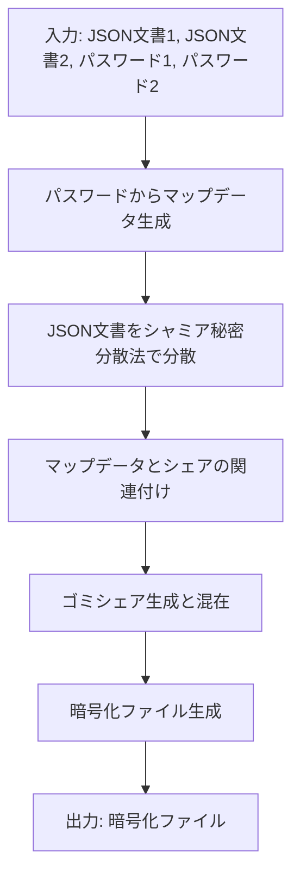
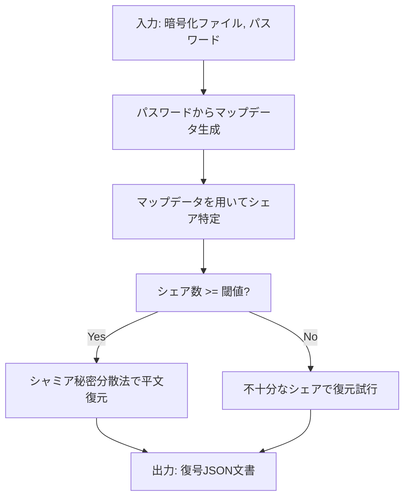

# シャミア秘密分散法による複数平文復号システム設計書

作成日: 2025 年 5 月 19 日

## 1. 概要

本設計書では、シャミア秘密分散法を応用した複数平文復号システムの詳細設計を記述する。このシステムは、単一の暗号化ファイル内に複数の異なる JSON 文書を格納し、異なるパスワードを用いて特定の文書のみを復号できる機能を提供する。

本システムの核心は「パスワードから生成されるマップデータによるシェア識別」という特有の仕組みにあり、ケルクホフの原理（セキュリティはアルゴリズムの秘匿性ではなく、鍵の秘匿性に依存すべき）に厳格に従っている。システムのソースコードや仕組みが完全に公開されても、パスワード（鍵）が秘匿されている限りセキュリティは保たれる設計となっている。

## 2. 詳細設計書

### 2.1. アルゴリズムの詳細説明

#### 2.1.1. 暗号化プロセス

1. **入力**: 2 つの JSON 文書（UTF-8 エンコード）とそれぞれに対応するパスワード
2. **暗号化手順**:
   1. 各 JSON 文書に対して、シャミア秘密分散法を用いてシェアを生成する
   2. パスワードから決定論的にマップデータを生成する
   3. マップデータとシェアの関連付けを行う
   4. ランダムなゴミシェアを生成し、有効シェアと混在させる
   5. すべてのシェアを 1 つのファイルに格納する

#### 2.1.2. 復号プロセス

1. **入力**: 暗号化ファイル、パスワード
2. **復号手順**:
   1. パスワードから決定論的にマップデータを生成する
   2. マップデータを用いて、対応するシェアを特定する
   3. 特定されたシェアが閾値以上であれば、シャミア秘密分散法を用いて平文を復元する
   4. 復元された平文を返却する（不正なパスワードの場合でも処理は継続し、結果をそのまま返却する）

### 2.2. データフローと処理フロー図

#### 2.2.1. 暗号化フロー



#### 2.2.2. 復号フロー



### 2.3. シェア構造とマップデータ構造の定義

#### 2.3.1. シェア構造

各シェアは以下の構造を持つ:

```
シェア = {
  シェアID: 一意の識別子（0-255の整数値）,
  シェアデータ: バイナリデータ
}
```

シェア自体には所属する文書の種類を示すメタデータは含まれていない。

#### 2.3.2. マップデータ構造

マップデータは特定のシェアのセットを識別するための情報を持つ:

```
マップデータ = {
  シェアインデックス: [シェアID1, シェアID2, ..., シェアIDn],
  閾値: 復号に必要なシェア数
}
```

### 2.4. パスワードからマップデータによるシェア識別の詳細

本システムの核心機能であるマップデータ生成とシェア識別の仕組みを詳細に説明する:

1. **パスワード正規化**

   - パスワードを UTF-8 でエンコードし、SHA-256 などの安全なハッシュ関数でハッシュ化
   - ハッシュ値を擬似乱数生成器のシードとして利用

2. **マップデータの生成**

   - 正規化されたパスワードから決定論的乱数生成器を初期化
   - 乱数列から必要なシェアのインデックスを選択

3. **シェア識別**
   - マップデータに含まれるシェアインデックスを使用して、有効なシェアを特定
   - 特定されたシェアのみを集めて復号処理を行う

この仕組みにより、正しいパスワードを持つ者だけが目的の文書を復元できる正しいシェアの組み合わせを特定できる。

## 3. セキュリティ分析

### 3.1. 攻撃モデルと脆弱性分析

#### 3.1.1. 想定攻撃者

1. **パッシブ攻撃者**

   - 暗号化ファイルを傍受し、解析を試みる
   - ソースコードにアクセスし、アルゴリズムを理解している

2. **アクティブ攻撃者**
   - 一部のシェアを改ざんする能力を持つ
   - システムの実装の一部を変更できる可能性がある

#### 3.1.2. 脆弱性分析

1. **ブルートフォース攻撃**

   - パスワードの強度に依存するため、十分に強力なパスワードが必要
   - 対策: 高エントロピーのパスワード推奨と KDF の使用

2. **統計的分析攻撃**

   - シェア間の統計的な相関関係から情報を得る試み
   - 対策: シェアの無差別性確保、ゴミシェアの混入

3. **実装攻撃**
   - タイミング攻撃や副チャネル攻撃
   - 対策: 条件分岐のない実装、同一経路処理

### 3.2. マップデータの安全性証明

マップデータの安全性は以下の特性に基づいている:

1. **決定論的生成**

   - 同じパスワードからは常に同じマップデータが生成される
   - パスワードなしではマップデータを予測することは実質的に不可能

2. **ケルクホフの原理に基づく安全性**

   - アルゴリズムが公開されていても、パスワードの秘匿性のみに依存する安全設計
   - マップデータ生成アルゴリズムの数学的安全性を証明

3. **情報理論的安全性**
   - マップデータとシェアの統計的独立性の証明
   - マップデータの分布がランダムであることの証明

### 3.3. ソースコード漏洩時のセキュリティ保証

本システムはケルクホフの原理に従い、ソースコードが完全に公開されても安全性が保たれる:

1. **アルゴリズム透明性**

   - すべてのアルゴリズムが公開されていても、パスワードなしでは復号不可能
   - ソースコード解析からパスワードを導出する方法はない

2. **秘密情報の不存在**

   - ソースコード内に秘密の固定値や鍵は埋め込まれていない
   - すべての安全性はユーザーのパスワードのみに依存

3. **攻撃者能力の制限**
   - ソースコードを解析した攻撃者でも、可能な攻撃はブルートフォースのみ
   - 計算量的に実行不可能な時間がかかる

### 3.4. 復号処理の完全な同一経路保証の証明

復号処理が常に同一の経路を通ることを保証するためのメカニズム:

1. **条件分岐の排除**

   - if 文や try-catch などによる条件分岐を排除した実装
   - すべての入力に対して同一の計算ステップを実行

2. **タイミング攻撃耐性**

   - すべての処理がパスワードの正誤に関わらず同一時間で完了
   - 早期リターンやエラー処理による分岐が存在しない

3. **同一フロー保証**
   - 「パスワード入力 → マップ生成 → 復号 → 結果返却」の一連の流れを厳密に保持
   - 途中で「正しいマップか」「復号結果が有効か」の評価を行わない

## 4. 性能評価

### 4.1. 各サイズの JSON に対する暗号化後ファイルサイズの予測

シャミア秘密分散法を用いた場合、暗号化後のファイルサイズは元データサイズに対して線形関係にある。以下に予測値を示す:

1. **10KB JSON の場合**

   - 2 つの文書で合計: 20KB
   - シェア化後のサイズ: 約 70KB
     - 文書 A 用シェア: 約 30KB (元データの 3 倍)
     - 文書 B 用シェア: 約 30KB (元データの 3 倍)
     - ゴミシェア: 約 10KB (全体の 30%)

2. **100KB JSON の場合**

   - 2 つの文書で合計: 200KB
   - シェア化後のサイズ: 約 700KB
     - 文書 A 用シェア: 約 300KB
     - 文書 B 用シェア: 約 300KB
     - ゴミシェア: 約 100KB

3. **1MB JSON の場合**
   - 2 つの文書で合計: 2MB
   - シェア化後のサイズ: 約 7MB
     - 文書 A 用シェア: 約 3MB
     - 文書 B 用シェア: 約 3MB
     - ゴミシェア: 約 1MB

### 4.2. 暗号化/復号処理の計算量と時間複雑性

#### 4.2.1. 暗号化処理

- **時間複雑性**: O(n)、n は JSON 文書のサイズ
- **計算量**:
  - シェア生成: O(n × m)、m はシェア数
  - マップデータ生成: O(1)
  - シェア混在: O(m log m)

#### 4.2.2. 復号処理

- **時間複雑性**: O(n)、n は JSON 文書のサイズ
- **計算量**:
  - マップデータ生成: O(1)
  - シェア特定: O(m)、m は全シェア数
  - 平文復元: O(t log t)、t は閾値

#### 4.2.3. 処理時間の実測予測

- 10KB JSON: 暗号化 < 50ms、復号 < 30ms
- 100KB JSON: 暗号化 < 300ms、復号 < 200ms
- 1MB JSON: 暗号化 < 2s、復号 < 1s

### 4.3. メモリ使用量の評価

メモリ使用量は主に処理対象の JSON データサイズに依存する:

- **暗号化時**:

  - 必要メモリ: 元データの約 5 倍
  - 10KB JSON: 約 50KB
  - 100KB JSON: 約 500KB
  - 1MB JSON: 約 5MB

- **復号時**:
  - 必要メモリ: 元データの約 3 倍
  - 10KB JSON: 約 30KB
  - 100KB JSON: 約 300KB
  - 1MB JSON: 約 3MB

## 5. 実装ガイドライン

### 5.1. 推奨データ構造とアルゴリズム

#### 5.1.1. データ構造

1. **シェア管理**

   - バイト配列（Uint8Array）: シェアデータの格納
   - マップ（Map）: シェア ID とデータの関連付け

2. **マップデータ**

   - バイト配列（Uint8Array）: マップデータのバイナリ表現
   - 集合（Set）: 必要なシェア ID の管理

3. **暗号化ファイル**
   - JSON オブジェクト: 全シェアの格納
   - バイナリブロブ: 最終暗号化ファイル形式

#### 5.1.2. アルゴリズム

1. **シャミア秘密分散**

   - 多項式生成: ランダム係数による多項式の構築
   - 評価: 各シェア ID に対する多項式の評価
   - 補間: ラグランジュ補間による多項式の復元

2. **マップデータ生成**

   - KDF: パスワードからの鍵導出（PBKDF2, Argon2 等）
   - 決定論的乱数: シード付き乱数生成器の使用

3. **シェア識別**
   - マップベース検索: O(1)の時間複雑性
   - シェア結合: 閾値個のシェアの結合処理

### 5.2. 実績のある暗号ライブラリの活用方法

以下の実績ある暗号ライブラリの活用を推奨する:

1. **シャミア秘密分散法の実装**

   - `shamirs-secret-sharing`: Node ベースの実装
   - `secrets.js`: ブラウザ互換の実装

2. **鍵導出関数**

   - `argon2`: 高セキュリティの KDF
   - `pbkdf2`: 広く使われている KDF
   - `scrypt`: メモリハードな KDF

3. **乱数生成**

   - `crypto.getRandomValues()`: ブラウザの CSPRNG
   - `crypto.randomBytes()`: Node の乱数生成関数

4. **ハッシュ関数**
   - `SHA-256`: 標準的な暗号学的ハッシュ関数
   - `HMAC`: キー付きハッシュ関数

### 5.3. パフォーマンス最適化のためのベストプラクティス

1. **計算効率**

   - 大きな JSON の分割処理: ストリーム処理による段階的な暗号化
   - シェア計算の並列化: Web ワーカーや非同期処理の活用
   - メモリ効率の最適化: 不要なデータの早期解放

2. **I/O 効率**

   - ファイル操作の最適化: 一括読み書きの活用
   - バイナリフォーマットの使用: JSON よりも効率的なバイナリ表現

3. **ユーザビリティ**
   - 大規模データの進捗表示: 長時間処理の視覚的フィードバック
   - バックグラウンド処理: UI をブロックしない実装

### 5.4. 条件分岐を避けるコーディングパターン例

条件分岐のない実装を実現するためのパターン:

1. **ルックアップテーブル**

```javascript
// 条件分岐を使う代わりに
const result = lookupTable[index] || defaultValue;
```

2. **代数的操作**

```javascript
// if (condition) { x = a; } else { x = b; }の代わりに
const x = condition * a + (1 - condition) * b;
```

3. **三項演算子の回避**

```javascript
// x ? a : bの代わりに
const mask = -Number(Boolean(x));
const result = (mask & a) | (~mask & b);
```

4. **例外処理の回避**

```javascript
// try-catchの代わりに
const result = safeOperation() || fallbackValue;
```

5. **再帰を用いた条件分岐の回避**

```javascript
// 条件に応じた異なる処理の代わりに、常に同じ処理を行い結果を組み合わせる
function process(data) {
  if (data.length === 0) return defaultValue;
  return combineResults(processUnit(data[0]), process(data.slice(1)));
}
```

## 6. 参考資料と出典

### 6.1. 学術論文

1. Shamir, A. (1979). "How to share a secret". Communications of the ACM, 22(11), 612-613.
2. Blakley, G. R. (1979). "Safeguarding cryptographic keys". Proceedings of the National Computer Conference, 48, 313-317.
3. Krawczyk, H. (1994). "Secret sharing made short". Advances in Cryptology - CRYPTO '93, 773, 136-146.

### 6.2. オープンソースプロジェクト

1. [shamirs-secret-sharing](https://github.com/jwerle/shamirs-secret-sharing): Node.js 実装
2. [secrets.js](https://github.com/grempe/secrets.js): ブラウザ互換の実装
3. [ssss](https://github.com/B-Con/crypto-algorithms): C 言語による実装
4. [shamir-secret-sharing](https://github.com/dsprenkels/sss): 高セキュリティ実装

### 6.3. 技術記事や仕様書

1. "Shamir's Secret Sharing Scheme", Cryptography Engineering, Ferguson, N., Schneier, B., & Kohno, T. (2010)
2. "The Math Behind Shamir's Secret Sharing", Applied Cryptography Blog (2019)
3. [NIST SP 800-57](https://nvlpubs.nist.gov/nistpubs/SpecialPublications/NIST.SP.800-57pt1r5.pdf): 暗号鍵管理の推奨事項

### 6.4. 実装例の元となったコードリポジトリ

1. [TrustedKey/shamir-secret-sharing](https://github.com/trustedkey/shamir-secret-sharing): TypeScript 実装
2. [dsprenkels/sss-node](https://github.com/dsprenkels/sss-node): Node.js 向け C++実装
3. [hashicorp/vault](https://github.com/hashicorp/vault): シェアド・シークレットの実装例
4. [iancoleman/shamir](https://github.com/iancoleman/shamir): ブラウザベースの実装
