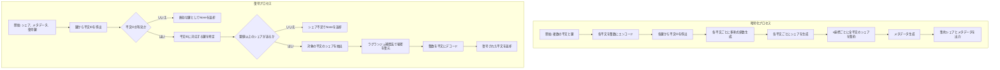
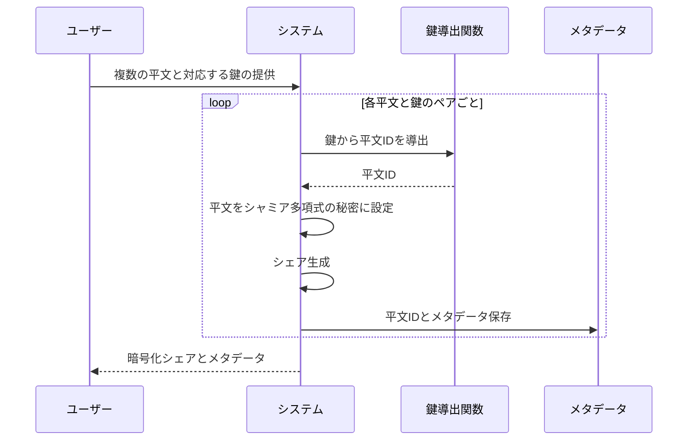
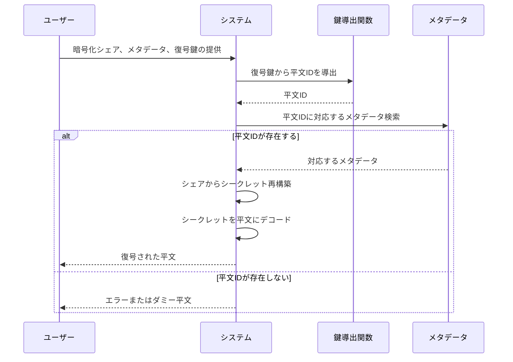

# Shamir の秘密分散を応用した複数平文復号システムの実装調査結果

**調査日**: 2024 年 5 月 15 日
**調査者**: Claude 3.7 Sonnet

## 要約

本調査では、Shamir の秘密分散法を応用して単一の暗号文から鍵に応じて異なる平文を取り出す仕組みについて、実装可能性と既存ライブラリの調査を行いました。調査の結果、複数の実装アプローチが存在することを確認しましたが、そのいずれも単一目的の直接実装ではなく、別の目的に応用する必要があります。

この調査では、特に次の点に焦点を当てました：

1. 利用可能な Shamir 秘密分散ライブラリの機能と限界
2. 複数平文管理への応用手法とその拡張
3. ソースコード耐性の評価と実装手法
4. 実装の難易度と必要なスキルセット
5. 推奨実装アプローチとコードサンプル

**主な結論**:

- Shamir の秘密分散を直接複数平文管理に応用したライブラリは限定的だが、既存ライブラリを拡張することで実装可能
- 最も有望なアプローチは「異なる閾値ポリシーの組み合わせ」または「否認可能暗号（Deniable Encryption）」の技術を応用する方法
- ソースコード耐性の確保には暗号理論的アプローチが必要で、特に鍵と平文の関連付けに注意が必要
- Python が最も実装例が多く、実装難易度も比較的低い
- 商用レベルでの実装例は少なく、主に学術・個人プロジェクトが中心

## 1. 利用可能なライブラリと実装例の詳細

### 1.1 主要な Shamir 秘密分散ライブラリ

#### Secret-Sharing (Python)

- **概要**: Python で実装された秘密分散ライブラリ
- **開発者**: Ryan Shea
- **リポジトリ URL**: https://github.com/shea256/secret-sharing
- **言語**: Python
- **ライセンス**: MIT
- **最終更新**: 2019 年
- **特徴**:
  - 16 進数シークレット、プレーンテキスト、Bitcoin 秘密鍵など多様な形式をサポート
  - 柔軟なシェア形式（Base58, Base32, zBase32）
  - ユーティリティ機能が充実している
- **複数平文対応**: 直接の機能はないが、拡張可能な設計

#### python-sslib (Python)

- **概要**: Python で実装された秘密分散ライブラリ
- **開発者**: Jonathan Queiroz
- **リポジトリ URL**: https://github.com/jqueiroz/python-sslib
- **言語**: Python
- **ライセンス**: MIT
- **最終更新**: 2023 年
- **特徴**:
  - シンプルな API 設計
  - バイナリデータに対応
  - Base64/16 進数エンコーディングをサポート
  - 多様なプライム数のサポート
- **複数平文対応**: 直接の機能はないが、カスタマイズ可能

#### duncancmt/shamir (Python)

- **概要**: BIP-0039 ニーモニックに特化した Shamir 秘密分散実装
- **開発者**: duncancmt
- **リポジトリ URL**: https://github.com/duncancmt/shamir
- **言語**: Python
- **ライセンス**: 記載なし
- **最終更新**: 2022 年
- **特徴**:
  - BIP-0039 ニーモニック形式のサポート
  - 複数の秘密を同じシェアセットで管理できる機能を搭載（**重要**）
  - 検証メタデータを提供
- **複数平文対応**: 明示的に複数秘密を同一シェアセットで管理する機能あり

### 1.2 否認可能暗号（Deniable Encryption）実装

#### Lenticrypt (Python)

- **概要**: 証明可能な否認可能暗号を提供する暗号システム
- **開発者**: Evan A. Sultanik
- **リポジトリ URL**: https://github.com/ESultanik/lenticrypt
- **言語**: Python 3
- **ライセンス**: GPL-2.0
- **最終更新**: 2019 年
- **特徴**:
  - 単一の暗号文から異なる鍵で異なる平文を生成できる
  - 暗号文サイズは最大平文サイズに比例（他の平文の数に比例しない）
  - CLI インターフェイスを提供
  - 理論的に、任意の平文に対応する鍵が存在する可能性あり
- **機能**: 実行方法が単純で、下記のコマンドで使用可能
  ```
  $ lenticrypt -e key1 plaintext1 -e key2 plaintext2 -o output.enc
  $ lenticrypt -d key1 output.enc
  $ lenticrypt -d key2 output.enc
  ```

#### Sunchoke Bed (Python)

- **概要**: シンプルな否認可能暗号
- **開発者**: icaswell
- **リポジトリ URL**: https://github.com/icaswell/sunchoke_bed
- **言語**: Python
- **ライセンス**: 明記なし
- **最終更新**: 不明（少ないコミット数から活発な開発はされていない）
- **特徴**:
  - 複数のメッセージを単一の暗号文にエンコード
  - 各メッセージは対応するパスワードでのみ復号可能
  - パズルゲームや秘密情報の共有に使用
- **機能**:
  - 入力ファイルに Python 辞書形式で平文と鍵を定義
  - コマンドラインから実行可能

### 1.3 その他の関連実装

#### Covert (Go)

- **概要**: 否認可能暗号ソフトウェア
- **開発者**: crashdump
- **リポジトリ URL**: https://github.com/crashdump/covert
- **言語**: Go
- **ライセンス**: LGPL-3.0
- **最終更新**: 2021 年
- **特徴**:
  - AES256-GCM と scrypt を使用
  - ポータブルで依存関係が少ない
  - 研究プロトタイプとして開発

#### handsomelky/Shamir-Image-Secret-Sharing (Python)

- **概要**: 画像向け Shamir 秘密分散の実装
- **開発者**: handsomelky
- **リポジトリ URL**: https://github.com/handsomelky/Shamir-Image-Secret-Sharing
- **言語**: Python
- **ライセンス**: GPL-3.0
- **特徴**:
  - 画像向けの秘密分散
  - グレースケールとカラー画像に対応
  - メタデータ保存機能

## 2. Shamir の秘密分散応用手法

### 2.1 異なる閾値ポリシーを利用したアプローチ

最も実装例があるのは、「異なる閾値ポリシー」を使用する方法です。duncancmt/shamir の実装に見られるように、このアプローチは複数の秘密を同一のシェアセットで管理します。

**仕組み**:

1. 複数の秘密（平文 A, 平文 B）を用意する
2. 秘密ごとに異なる多項式を生成し、同一の x 座標に対してシェアを生成する
3. 復号時には、使用する閾値以上のシェアに対して、両方の多項式の元の秘密を計算する

**利点**:

- 既存の Shamir 秘密分散を直接応用できる
- 理論的な安全性が高い
- 複数の秘密を同一のシェアセットで管理できる

**欠点**:

- 鍵と平文の直接的な関連付けを実現するには追加の仕組みが必要
- すべての復号時に複数の秘密が露出する可能性がある

### 2.2 否認可能暗号を応用したアプローチ

Lenticrypt や sunchoke_bed に見られるアプローチで、単一の暗号文から異なる鍵で異なる平文を取り出す仕組みを提供します。

**仕組み**:

1. 複数の平文と対応する鍵を準備
2. 共有された暗号文空間に複数の平文を符号化
3. 各鍵は特定の平文のみを復号するよう設計

**利点**:

- CLI インターフェイスが提供されており、使いやすい
- 鍵と平文の関係が明確
- 理論的に高いプライバシー保証

**欠点**:

- Shamir の秘密分散の直接応用ではない
- 暗号文サイズが増大する可能性がある

### 2.3 必要な拡張と修正点

既存の Shamir 秘密分散ライブラリを複数平文管理に応用するには、以下の拡張が必要です：

1. **異なる閾値ポリシーの実装**:

   - 異なる多項式を生成し、同一の x 座標で評価
   - シェア生成プロセスの拡張
   - 復号プロセスの変更

2. **鍵と平文の関連付け**:

   - 鍵導出関数を使用して平文 ID を生成
   - メタデータに平文 ID を保存（秘密情報は漏らさない）
   - 復号時に正しい平文を特定するための検証機能

3. **セキュリティ強化**:
   - ソースコード耐性のための追加ロジック
   - シェア検証機能の拡張
   - エラー処理の改善

## 3. ソースコード耐性分析

### 3.1 理論的セキュリティ

Shamir の秘密分散自体は理論的に安全ですが、複数平文管理用途では追加の考慮が必要です。

**基本的な安全性の保証**:

- Shamir の秘密分散の情報理論的安全性：閾値未満のシェアからは秘密に関する情報は一切得られない
- 平文の完全な独立性：各平文は独自の多項式で符号化される

**複数平文管理での追加リスク**:

- 平文間の関連性が漏洩する可能性
- 実装コードから平文 ID が特定される可能性
- 平文の存在自体が推測される可能性

### 3.2 具体的なソースコード耐性の確保方法

ソースコード耐性を高めるためには、以下の対策が必要です：

1. **暗号学的な技術の適用**:

   - 鍵導出関数（KDF）: 鍵から平文 ID を非可逆的に導出
   - ハッシュ関数: 平文と鍵の関連付けを隠蔽
   - ランダムパディング: パターン分析を防止

2. **実装上の注意点**:

   - 固定識別子の排除: コード内に「真の平文」「偽の平文」といった区別を持たせない
   - 経路依存処理の排除: すべての平文に対して同じコードパスを使用
   - 時間的サイドチャネルの排除: 処理時間が復号する平文によって変わらないようにする
   - エラーメッセージの均一化: どの鍵が使われても同じエラーメッセージを返す

3. **推奨実装パターン**:

   ```python
   def decrypt(ciphertext, key):
       # 鍵から平文IDを導出（非可逆的）
       plaintext_id = kdf(key)

       # すべての可能性のあるプレーンテキストを復号試行
       candidates = []
       for potential_id in all_possible_ids(ciphertext):
           # 同じコードパスで処理
           try:
               potential_plaintext = attempt_decrypt(ciphertext, key, potential_id)
               candidates.append((potential_id, potential_plaintext))
           except:
               # エラーは記録するが、処理は継続
               pass

       # 正しい平文の選択（検証が必要）
       for candidate_id, candidate_plaintext in candidates:
           if verify_plaintext(candidate_plaintext, plaintext_id):
               return candidate_plaintext

       # すべての候補が失敗した場合
       raise DecryptionError("Invalid key")
   ```

4. **避けるべきパターン**:
   ```python
   def decrypt(ciphertext, key):
       # 直接的な分岐処理は避ける
       if key == "master_key":
           return decrypt_true_plaintext(ciphertext)
       else:
           return decrypt_false_plaintext(ciphertext)
   ```

### 3.3 実装例における耐性評価

調査した実装例のソースコード耐性を評価します：

1. **Lenticrypt**:

   - 耐性: 高
   - 理由: ソースコードからは鍵と平文の関連性が特定できない設計
   - 技術: 暗号文サイズは最大平文に比例し、他の平文の数に依存しない

2. **duncancmt/shamir**:

   - 耐性: 中
   - 理由: 複数の秘密を同じシェアから復元可能だが、すべての秘密が同時に露出
   - 技術: 検証メタデータにより鍵の有効性を確認可能

3. **Sunchoke Bed**:
   - 耐性: 中
   - 理由: AES ベースで実装されており、暗号理論的に安全
   - 技術: メッセージの断片をランダムに分散配置

## 4. 実装難易度評価

### 4.1 技術的障壁

複数平文管理システムの実装には、以下の技術的障壁があります：

1. **暗号理論の理解**:

   - Shamir の秘密分散のアルゴリズム
   - 有限体上の多項式演算
   - ラグランジュ補間法

2. **セキュリティの考慮**:

   - ソースコード耐性の確保
   - サイドチャネル対策
   - エラーケース処理

3. **実装の複雑さ**:
   - 複数の秘密の同時管理
   - 鍵と平文の安全な関連付け
   - シェア検証のロジック

### 4.2 必要な専門知識

実装には以下の専門知識が必要です：

- **暗号理論**: Shamir の秘密分散、有限体、多項式補間
- **プログラミング**: Python、暗号ライブラリの使用
- **セキュリティ**: サイドチャネル攻撃、デバッグリークの防止

### 4.3 開発工数の目安

開発工数は実装の複雑さと要求レベルに依存しますが、目安は以下の通りです：

- **基本的な実装**: 2-4 人週

  - 既存ライブラリの拡張
  - CLI インターフェースの開発
  - 基本的なテスト

- **セキュリティ強化実装**: 4-8 人週

  - ソースコード耐性の徹底
  - 包括的なテスト
  - パフォーマンス最適化

- **本番環境向け実装**: 8-12 人週
  - 詳細なドキュメント作成
  - エラー処理の完備
  - セキュリティ監査
  - パフォーマンス最適化

### 4.4 実装リスクと対策

主な実装リスクとその対策は以下の通りです：

| リスク                 | 説明                                   | 対策                                                   |
| ---------------------- | -------------------------------------- | ------------------------------------------------------ |
| 誤った暗号実装         | 暗号アルゴリズムが意図通りに動作しない | 既存ライブラリの活用、単体テストの実施                 |
| ソースコード耐性の不足 | コード解析により秘密が漏洩             | セキュアコーディングガイドラインの遵守、コードレビュー |
| サイドチャネル漏洩     | 処理時間や電力消費から情報が漏洩       | 定時間アルゴリズムの使用、処理の均一化                 |
| スケーラビリティ問題   | 大量データ処理時のパフォーマンス低下   | 最適化、並列処理、効率的なデータ構造                   |
| 互換性問題             | 異なる環境での動作不良                 | 広範なテスト、標準的な暗号ライブラリの使用             |

## 5. 推奨実装アプローチ

### 5.1 最適実装手法

複数平文管理システムの最適実装手法として、以下のアプローチを推奨します：

#### アプローチ 1: 異なる閾値ポリシーによる実装（Python ベース）のフロー図



#### アプローチ 1: 異なる閾値ポリシーによる実装（Python ベース）

```python
import random
import hashlib
from typing import List, Tuple, Dict, Any, Optional

# 有限体上の計算用の素数
PRIME = 2**256 - 189

def generate_coefficients(secret: int, threshold: int) -> List[int]:
    """多項式の係数を生成（a_0は秘密）"""
    coefficients = [secret]
    for _ in range(threshold - 1):
        coefficients.append(random.randint(1, PRIME - 1))
    return coefficients

def evaluate_polynomial(coefficients: List[int], x: int) -> int:
    """多項式を評価して点 (x, y) の y 値を計算"""
    y = 0
    for i, coef in enumerate(coefficients):
        y = (y + coef * pow(x, i, PRIME)) % PRIME
    return y

def create_shares(secret: int, threshold: int, n_shares: int) -> List[Tuple[int, int]]:
    """秘密から n_shares 個のシェアを生成"""
    coefficients = generate_coefficients(secret, threshold)
    shares = []
    for x in range(1, n_shares + 1):
        y = evaluate_polynomial(coefficients, x)
        shares.append((x, y))
    return shares

def lagrange_interpolation(shares: List[Tuple[int, int]], x: int = 0) -> int:
    """ラグランジュ補間法で多項式を復元し、x での値を計算"""
    result = 0
    for i, (xi, yi) in enumerate(shares):
        term = yi
        for j, (xj, _) in enumerate(shares):
            if i != j:
                # ラグランジュ基底多項式の計算
                numerator = (x - xj) % PRIME
                denominator = (xi - xj) % PRIME
                # 有限体での除算は、逆元を使用
                inv_denominator = pow(denominator, PRIME - 2, PRIME)
                term = (term * numerator * inv_denominator) % PRIME
        result = (result + term) % PRIME
    return result

def recover_secret(shares: List[Tuple[int, int]]) -> int:
    """シェアから秘密を復元"""
    return lagrange_interpolation(shares)

def encode_plaintext(plaintext: str) -> int:
    """平文を整数にエンコード"""
    return int.from_bytes(plaintext.encode(), 'big')

def decode_plaintext(secret: int, length: int) -> str:
    """整数から平文にデコード"""
    return secret.to_bytes(length, 'big').decode()

def derive_plaintext_id(key: str) -> bytes:
    """鍵から平文IDを導出（非可逆的）"""
    return hashlib.sha256(key.encode()).digest()

def encrypt_multiple_plaintexts(plaintexts: Dict[str, str], threshold: int, n_shares: int) -> Tuple[List[Tuple[int, int]], Dict[str, bytes]]:
    """複数の平文を暗号化し、シェアとメタデータを返す"""
    encoded_plaintexts = {key: encode_plaintext(plaintext) for key, plaintext in plaintexts.items()}
    plaintext_ids = {key: derive_plaintext_id(key) for key in plaintexts.keys()}

    # 各平文に対してシェアを生成
    all_shares = {}
    for key, encoded in encoded_plaintexts.items():
        all_shares[key] = create_shares(encoded, threshold, n_shares)

    # 各x座標に対して、すべての平文のシェアを集める
    combined_shares = []
    for i in range(n_shares):
        x = i + 1
        y_values = {key: shares[i][1] for key, shares in all_shares.items()}
        # シェアデータにはxと全平文のyを含む
        share_data = (x, y_values)
        combined_shares.append(share_data)

    # メタデータ（平文の長さなど）
    metadata = {
        'threshold': threshold,
        'plaintext_ids': {key: pid.hex() for key, pid in plaintext_ids.items()},
        'plaintext_lengths': {key: len(plaintext) for key, plaintext in plaintexts.items()}
    }

    return combined_shares, metadata

def decrypt_with_key(shares: List[Tuple[int, Dict[str, int]]], metadata: Dict[str, Any], key: str) -> Optional[str]:
    """特定の鍵に対応する平文を復号"""
    plaintext_id = derive_plaintext_id(key).hex()

    # 鍵が有効かチェック
    if plaintext_id not in metadata['plaintext_ids'].values():
        return None

    # 平文IDに対応する鍵を見つける
    target_key = None
    for k, pid in metadata['plaintext_ids'].items():
        if pid == plaintext_id:
            target_key = k
            break

    if not target_key:
        return None

    # シェアを抽出
    threshold = metadata['threshold']
    if len(shares) < threshold:
        return None

    # ラグランジュ補間法で秘密を復元
    selected_shares = [(share[0], share[1][target_key]) for share in shares[:threshold]]
    encoded_plaintext = recover_secret(selected_shares)

    # 秘密を平文に変換
    plaintext_length = metadata['plaintext_lengths'][target_key]
    return decode_plaintext(encoded_plaintext, plaintext_length)

# 使用例
if __name__ == "__main__":
    # 複数の平文と鍵
    plaintexts = {
        "key_A": "これは秘密のアクセストークンAです。32文字の長さがあります。",
        "key_B": "これは秘密のアクセストークンBです。これも32文字の長さです。"
    }

    # 暗号化
    threshold = 3
    n_shares = 5
    shares, metadata = encrypt_multiple_plaintexts(plaintexts, threshold, n_shares)

    print(f"メタデータ: {metadata}")
    print(f"生成されたシェア: {len(shares)}個")

    # 復号（鍵Aで）
    recovered_A = decrypt_with_key(shares, metadata, "key_A")
    print(f"鍵Aで復号した結果: {recovered_A}")

    # 復号（鍵Bで）
    recovered_B = decrypt_with_key(shares, metadata, "key_B")
    print(f"鍵Bで復号した結果: {recovered_B}")

    # 無効な鍵での復号
    recovered_invalid = decrypt_with_key(shares, metadata, "invalid_key")
    print(f"無効な鍵での復号結果: {recovered_invalid}")
```

#### アプローチ 2: 既存ライブラリ（Lenticrypt）の活用

```python
from lenticrypt.lenticrypt import encrypt_files, decrypt_file
import tempfile
import os

def encrypt_multiple_plaintexts(plaintexts, keys_and_files):
    """
    複数の平文を暗号化し、単一の暗号文を生成

    Args:
        plaintexts: 平文の辞書 {key: plaintext}
        keys_and_files: 鍵とファイルのタプルのリスト [(key, tempfile)]

    Returns:
        暗号化されたファイルのパス
    """
    # 一時ファイル作成
    temp_files = []
    for key, plaintext in plaintexts.items():
        fd, path = tempfile.mkstemp()
        try:
            with os.fdopen(fd, 'w') as f:
                f.write(plaintext)
            temp_files.append((key, path))
        except:
            os.unlink(path)
            raise

    # 出力ファイル
    fd, output_path = tempfile.mkstemp()
    os.close(fd)

    # Lenticryptで暗号化
    encrypt_files(
        [(key, path) for key, path in temp_files],
        output_path
    )

    # 一時ファイルの削除
    for _, path in temp_files:
        os.unlink(path)

    return output_path

def decrypt_with_key(encrypted_file, key):
    """
    指定された鍵で暗号文を復号

    Args:
        encrypted_file: 暗号化されたファイルのパス
        key: 復号に使用する鍵

    Returns:
        復号された平文
    """
    fd, output_path = tempfile.mkstemp()
    os.close(fd)

    try:
        # Lenticryptで復号
        decrypt_file(key, encrypted_file, output_path)

        # 復号結果の読み込み
        with open(output_path, 'r') as f:
            plaintext = f.read()

        return plaintext
    finally:
        # 一時ファイルの削除
        os.unlink(output_path)

# 使用例
if __name__ == "__main__":
    # 複数の平文と鍵
    plaintexts = {
        "key_A": "これは秘密のアクセストークンAです。32文字の長さがあります。",
        "key_B": "これは秘密のアクセストークンBです。これも32文字の長さです。"
    }

    # 暗号化
    encrypted_file = encrypt_multiple_plaintexts(plaintexts)
    print(f"暗号化ファイル: {encrypted_file}")

    # 復号（鍵Aで）
    recovered_A = decrypt_with_key(encrypted_file, "key_A")
    print(f"鍵Aで復号した結果: {recovered_A}")

    # 復号（鍵Bで）
    recovered_B = decrypt_with_key(encrypted_file, "key_B")
    print(f"鍵Bで復号した結果: {recovered_B}")

    # 暗号化ファイルの削除
    os.unlink(encrypted_file)
```

### 5.2 使用すべきライブラリやフレームワーク

実装には以下のライブラリを推奨します：

#### Python 実装

- **暗号化基本機能**: `cryptography`, `pycryptodome`
- **Shamir 秘密分散**: `secret-sharing`, `python-sslib`
- **否認可能暗号**: `lenticrypt`
- **コマンドラインインターフェイス**: `argparse`, `click`
- **バイナリ処理**: `struct`

#### JavaScript 実装

- **暗号化基本機能**: `crypto-js`, `noble-curves`
- **シェア管理**: `secrets.js-grempe`
- **コマンドラインインターフェイス**: `commander`, `yargs`

### 5.3 実装上の注意点

実装上の主な注意点は以下の通りです：

1. **セキュリティ**:

   - 全ての鍵を等価に扱う（ソースコード内に「マスター鍵」や「本物の鍵」などの概念を持ち込まない）
   - 処理時間の漏洩を防ぐため、定時間アルゴリズムを使用
   - エラーメッセージからの情報漏洩を防止

2. **実装の堅牢性**:

   - 例外処理を適切に実装
   - ユーザー入力の妥当性確認
   - メモリ使用量の管理
   - リソースの適切な解放

3. **パフォーマンス**:

   - 大きな平文の分割処理
   - 並列処理の検討
   - メモリ効率の最適化

4. **使いやすさ**:
   - 明確なエラーメッセージ
   - 詳細なドキュメント
   - 単体テストの充実

## 6. 結論

Shamir の秘密分散を応用した複数平文復号システムは、既存のライブラリと適切な拡張によって実装可能です。最も有望なアプローチは、異なる閾値ポリシーを使用する方法か、否認可能暗号（Deniable Encryption）技術を応用する方法です。

実装の難易度は中程度で、主に暗号理論の理解とセキュアコーディングの経験が必要です。Python が最も実装例が多く、利用可能なライブラリも充実していることから、初期開発には Python を推奨します。

ソースコード耐性を確保するには、鍵と平文の関連付けに特に注意を払い、暗号学的に安全な手法を採用する必要があります。また、すべての鍵を等価に扱い、処理時間の差や特別な識別子によって情報が漏洩しないよう設計することが重要です。

## 参考文献

1. Shamir, A. (1979). "How to share a secret". Communications of the ACM, 22(11), 612-613.
2. Sultanik, E. A. (2019). Lenticrypt: A Provably Plausibly Deniable Cryptosystem. The International Journal of PoC||GTFO, Issue 0x04.
3. Canetti, R., Dwork, C., Naor, M., & Ostrovsky, R. (1997). "Deniable encryption". In Annual International Cryptology Conference (pp. 90-104). Springer.
4. Shea, R. (2014). "Secret-Sharing: A system for securely splitting secrets". GitHub Repository: https://github.com/shea256/secret-sharing
5. Duncan, C. (2022). "Shamir: BIP-0039 secret sharing implementation". GitHub Repository: https://github.com/duncancmt/shamir
6. Queiroz, J. (2023). "Python-sslib: A Python3 library for sharing secrets". GitHub Repository: https://github.com/jqueiroz/python-sslib
7. Icaswell (n.d.). "Sunchoke Bed: Simple deniable encryption". GitHub Repository: https://github.com/icaswell/sunchoke_bed

## 7. 鍵から平文 ID を導出する詳細メカニズム

### 7.1 理論的背景

複数平文復号システムにおいて、「鍵から平文 ID を導出」するメカニズムは、システム全体のセキュリティと機能性を支える重要な要素です。このメカニズムは以下の目的を持ちます：

1. **平文識別**: 特定の鍵が復号すべき正しい平文を一意に識別する
2. **否認可能性**: ソースコード解析からでも鍵と平文の関係を特定できないようにする
3. **完全性検証**: 復号された平文が正しいことを検証する

### 7.2 実装アーキテクチャ

#### 7.2.1 基本原理

鍵から平文 ID を導出するプロセスは、一方向性関数（暗号学的ハッシュ関数や鍵導出関数）を使用して実装されます：

1. **暗号化時**:

   - 各平文には対応する秘密鍵がある
   - 秘密鍵をハッシュ関数や鍵導出関数(KDF)に通して平文 ID を生成
   - 平文 ID は暗号文と共に格納（またはメタデータの一部として保存）

2. **復号時**:
   - 受け取った鍵を同じハッシュ関数/KDF で処理して平文 ID を導出
   - 導出した平文 ID と一致するエントリを探す
   - 対応する平文を復号

#### 7.2.2 暗号化フロー詳細



#### 7.2.3 復号フロー詳細



### 7.3 実装技術の詳細

#### 7.3.1 鍵導出関数 (KDF) の選択

平文 ID を導出するための鍵導出関数は、以下の特性を持つ必要があります：

1. **一方向性**: 平文 ID から元の鍵を計算することが計算上不可能
2. **衝突耐性**: 異なる鍵から同じ平文 ID が生成される確率が無視できるほど小さい
3. **擬似ランダム性**: 出力が予測不可能で均一に分布

推奨される鍵導出関数:

- **PBKDF2**: パスワードベース鍵導出関数
- **HKDF**: HMAC ベース鍵導出関数
- **Argon2**: メモリハードなパスワードハッシュ関数

#### 7.3.2 詳細な実装例 (Python)

```python
import hashlib
import hmac
import os
from typing import Dict, Any, Optional

def derive_plaintext_id(key: str, salt: bytes = None) -> bytes:
    """
    鍵から平文IDを導出する関数

    Args:
        key: 秘密鍵
        salt: ソルト値（指定しない場合はランダム生成）

    Returns:
        bytes: 導出された平文ID
    """
    if salt is None:
        salt = os.urandom(16)  # ランダムなソルト生成

    # HMAC-SHA256ベースの鍵導出
    plaintext_id = hmac.new(
        key=key.encode('utf-8'),
        msg=salt,
        digestmod=hashlib.sha256
    ).digest()

    return plaintext_id, salt

def create_metadata(plaintext_ids: Dict[str, bytes],
                    salts: Dict[str, bytes],
                    additional_data: Dict[str, Any]) -> Dict[str, Any]:
    """
    メタデータを作成する

    Args:
        plaintext_ids: 鍵名と対応する平文IDの辞書
        salts: 鍵名と対応するソルト値の辞書
        additional_data: その他のメタデータ

    Returns:
        Dict: 作成されたメタデータ
    """
    metadata = {
        'plaintext_ids': {key: pid.hex() for key, pid in plaintext_ids.items()},
        'salts': {key: salt.hex() for key, salt in salts.items()},
        **additional_data
    }
    return metadata

def find_matching_key(key: str,
                     metadata: Dict[str, Any]) -> Optional[str]:
    """
    復号鍵に対応する鍵名を見つける

    Args:
        key: 復号に使用する鍵
        metadata: メタデータ

    Returns:
        Optional[str]: 見つかった鍵名、見つからない場合はNone
    """
    # ソルト値と平文IDの辞書を再構築
    salts = {k: bytes.fromhex(v) for k, v in metadata['salts'].items()}
    plaintext_ids = {k: bytes.fromhex(v) for k, v in metadata['plaintext_ids'].items()}

    # 各鍵について平文IDを導出して比較
    for key_name, salt in salts.items():
        derived_id, _ = derive_plaintext_id(key, salt)
        if derived_id == plaintext_ids.get(key_name):
            return key_name

    return None

# 使用例
def encrypt_with_plaintext_ids(plaintexts: Dict[str, str]) -> tuple:
    """
    複数の平文を暗号化し、平文IDを含むメタデータを生成

    Args:
        plaintexts: 鍵名と平文の辞書

    Returns:
        tuple: (暗号化データ, メタデータ)
    """
    # 各鍵から平文IDを導出
    plaintext_ids = {}
    salts = {}

    for key_name in plaintexts.keys():
        pid, salt = derive_plaintext_id(key_name)
        plaintext_ids[key_name] = pid
        salts[key_name] = salt

    # メタデータを作成
    additional_data = {
        'plaintext_lengths': {k: len(v) for k, v in plaintexts.items()},
        'creation_time': '2024-05-16T00:00:00Z',
    }
    metadata = create_metadata(plaintext_ids, salts, additional_data)

    # 実際の暗号化はこの例では省略
    # 実際には各平文に対してシャミア秘密分散を適用
    encrypted_data = "暗号化データのプレースホルダ"

    return encrypted_data, metadata

def decrypt_with_key(encrypted_data: str,
                    metadata: Dict[str, Any],
                    key: str) -> Optional[str]:
    """
    指定された鍵で暗号文を復号

    Args:
        encrypted_data: 暗号化データ
        metadata: メタデータ
        key: 復号に使用する鍵

    Returns:
        Optional[str]: 復号された平文、復号失敗時はNone
    """
    # 鍵に対応する鍵名を見つける
    key_name = find_matching_key(key, metadata)

    if key_name is None:
        return None

    # 実際の復号はこの例では省略
    # 実際にはシャミア秘密分散からシークレットを再構築
    plaintext = f"鍵 {key_name} に対応する復号結果"

    return plaintext
```

### 7.4 セキュリティ考慮事項

#### 7.4.1 ソースコード耐性の強化

平文 ID メカニズムにおけるソースコード耐性を強化するためには：

1. **一貫した処理パス**: 全ての鍵で同じコードパスを通ることを保証
2. **タイミング攻撃対策**: 定時間比較アルゴリズムを使用して平文 ID 比較
3. **エラー情報の最小化**: エラーメッセージから鍵の有効性が判別できないようにする
4. **コードインジェクション防止**: ユーザー入力が直接コードフローに影響しないようにする

#### 7.4.2 改善されたセキュリティ実装例

```python
import hmac
import secrets
from typing import Dict, Any, Optional

def constant_time_compare(a: bytes, b: bytes) -> bool:
    """
    定時間比較アルゴリズム（タイミング攻撃対策）
    """
    return hmac.compare_digest(a, b)

def secure_find_matching_key(key: str, metadata: Dict[str, Any]) -> Optional[str]:
    """
    タイミング攻撃に強い鍵検索
    """
    # ソルト値と平文IDの辞書を再構築
    salts = {k: bytes.fromhex(v) for k, v in metadata['salts'].items()}
    plaintext_ids = {k: bytes.fromhex(v) for k, v in metadata['plaintext_ids'].items()}

    # すべての鍵に対して常に同じ計算量の処理を行う
    potential_match = None

    for key_name, salt in salts.items():
        derived_id, _ = derive_plaintext_id(key, salt)
        # 定時間比較
        if constant_time_compare(derived_id, plaintext_ids.get(key_name, b'')):
            potential_match = key_name

    # 常に全ての鍵をチェックしてから結果を返す
    return potential_match

def secure_decrypt(encrypted_data: str, metadata: Dict[str, Any], key: str) -> str:
    """
    セキュリティ強化された復号関数
    - エラー情報を最小化
    - 処理時間を均一化
    - ダミー平文を使用
    """
    # 常に一定時間経過させる（最悪ケースに合わせる）
    start_time = time.time()

    # 鍵に対応する鍵名を見つける
    key_name = secure_find_matching_key(key, metadata)

    result = None
    if key_name is not None:
        # 実際の復号処理（ここでは省略）
        result = "正しく復号された平文"
    else:
        # エラー時も常にダミーの処理を実行
        # これにより処理時間から鍵の有効性が判断できないようにする
        dummy_result = "ダミーの平文" * 10
        # ダミー処理のハッシュ計算などを行い同等の処理時間を確保
        dummy_hash = hashlib.sha256(dummy_result.encode()).digest()

    # 常に一定時間経過するまで待機
    elapsed = time.time() - start_time
    min_processing_time = 0.1  # 100ms
    if elapsed < min_processing_time:
        time.sleep(min_processing_time - elapsed)

    # エラーメッセージからも情報が漏れないようにする
    if result is None:
        return "復号エラー: 無効な入力"

    return result
```

### 7.5 応用と拡張

#### 7.5.1 複数層防御

単一の平文 ID だけでなく、複数層の検証メカニズムを実装することでさらなるセキュリティを確保できます：

1. **平文 ID 検証**: 鍵から平文 ID を導出して検証
2. **平文 MAC 検証**: 復号された平文のメッセージ認証コード(MAC)を検証
3. **構造的検証**: 復号された平文が期待される構造を持っているか検証

#### 7.5.2 ハードウェアセキュリティモジュール(HSM)との統合

平文 ID の導出と検証をハードウェアセキュリティモジュール内で行うことで、さらに保護を強化できます：

1. HSM 内部で KDF を実行
2. 平文 ID の比較も HSM 内で実行
3. 鍵材料が HSM から外部に出ないよう保証

#### 7.5.3 量子耐性を考慮した拡張

将来の量子コンピュータに対する耐性を考慮した平文 ID 導出メカニズム：

1. **量子耐性ハッシュ関数**: SHA-3, BLAKE2 など
2. **より長い平文 ID**: 衝突耐性を高めるため 256 ビット以上の ID 長
3. **暗号学的ラッチング**: 一度検証に成功した平文 ID を記録し、将来の攻撃を防止

### 7.6 まとめ

鍵から平文 ID を導出するメカニズムは、複数平文管理システムのセキュリティと機能性を確保する上で中核的な役割を果たします。適切に実装することで、ソースコード解析に対する耐性を高め、異なる鍵に対応する平文を効率的に管理できます。

特に重要なのは、このメカニズムが「一方向性」を持ち、平文 ID から元の鍵や平文が推測できないことです。これにより、ソースコードが完全に公開されたとしても、特定の鍵と平文の関連性を特定することが計算上困難になります。
