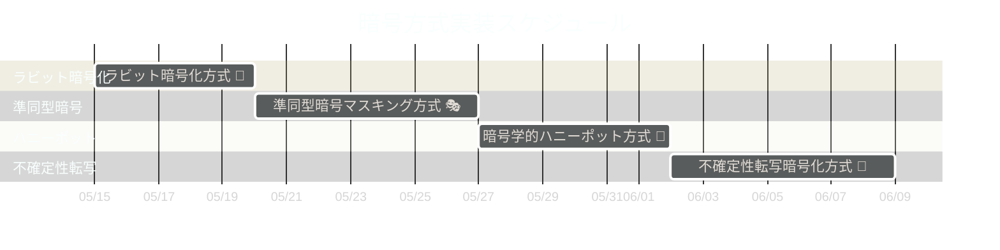

## Issue 一覧 📋

お兄様！パシ子が作成した実装作業用の Issue 一覧です！レオくんと一緒に計画通り進めていきますね〜 💪✨

### フェーズ別 Issue 一覧 🗂️

各フェーズの親 Issue と子 Issue をまとめました。これらの Issue を順番に対応することで、
効率的に実装を進めることができます！

#### フェーズ 1: ラビット暗号化方式 🐰

|                                   Issue 番号                                   | タイトル                                                                            | ステータス |
| :----------------------------------------------------------------------------: | ----------------------------------------------------------------------------------- | :--------: |
| [#1](https://github.com/pacific-system/secret-sharing-demos-20250510/issues/1) | ラビット暗号化方式 🐰 実装【親 Issue】                                              |    完了    |
| [#2](https://github.com/pacific-system/secret-sharing-demos-20250510/issues/2) | ラビット暗号化方式 🐰 実装【子 Issue #1】：ディレクトリ構造と基本ファイルの作成     |    完了    |
| [#3](https://github.com/pacific-system/secret-sharing-demos-20250510/issues/3) | ラビット暗号化方式 🐰 実装【子 Issue #2】：ラビットストリーム生成アルゴリズムの実装 |    完了    |
| [#4](https://github.com/pacific-system/secret-sharing-demos-20250510/issues/4) | ラビット暗号化方式 🐰 実装【子 Issue #3】：多重鍵ストリーム生成機能の拡張           |    完了    |
| [#5](https://github.com/pacific-system/secret-sharing-demos-20250510/issues/5) | ラビット暗号化方式 🐰 実装【子 Issue #4】：暗号化実装（encrypt.py）                 |    完了    |
| [#6](https://github.com/pacific-system/secret-sharing-demos-20250510/issues/6) | ラビット暗号化方式 🐰 実装【子 Issue #5】：復号実装（decrypt.py）                   |    完了    |
| [#7](https://github.com/pacific-system/secret-sharing-demos-20250510/issues/7) | ラビット暗号化方式 🐰 実装【子 Issue #6】：多重データカプセル化の実装               |    完了    |
| [#8](https://github.com/pacific-system/secret-sharing-demos-20250510/issues/8) | ラビット暗号化方式 🐰 実装【子 Issue #7】：鍵判定ロジックのソースコード解析耐性確保 |    完了    |
| [#9](https://github.com/pacific-system/secret-sharing-demos-20250510/issues/9) | ラビット暗号化方式 🐰 実装【子 Issue #8】：テストとデバッグ                         |    完了    |

#### フェーズ 2: 準同型暗号マスキング方式 🎭

|                                    Issue 番号                                    | タイトル                                                                              | ステータス |
| :------------------------------------------------------------------------------: | ------------------------------------------------------------------------------------- | :--------: |
| [#10](https://github.com/pacific-system/secret-sharing-demos-20250510/issues/10) | 準同型暗号マスキング方式 🎭 実装【親 Issue】                                          |   未着手   |
| [#11](https://github.com/pacific-system/secret-sharing-demos-20250510/issues/11) | 準同型暗号マスキング方式 🎭 実装【子 Issue #1】：ディレクトリ構造と基本ファイルの作成 |   未着手   |
| [#12](https://github.com/pacific-system/secret-sharing-demos-20250510/issues/12) | 準同型暗号マスキング方式 🎭 実装【子 Issue #2】：準同型暗号アルゴリズムの実装         |   未着手   |
| [#13](https://github.com/pacific-system/secret-sharing-demos-20250510/issues/13) | 準同型暗号マスキング方式 🎭 実装【子 Issue #3】：マスク関数生成と適用機構の実装       |   未着手   |
| [#14](https://github.com/pacific-system/secret-sharing-demos-20250510/issues/14) | 準同型暗号マスキング方式 🎭 実装【子 Issue #4】：暗号化実装（encrypt.py）             |   未着手   |
| [#15](https://github.com/pacific-system/secret-sharing-demos-20250510/issues/15) | 準同型暗号マスキング方式 🎭 実装【子 Issue #5】：復号実装（decrypt.py）               |   未着手   |
| [#16](https://github.com/pacific-system/secret-sharing-demos-20250510/issues/16) | 準同型暗号マスキング方式 🎭 実装【子 Issue #6】：識別不能性を保証する変換処理の実装   |   未着手   |
| [#17](https://github.com/pacific-system/secret-sharing-demos-20250510/issues/17) | 準同型暗号マスキング方式 🎭 実装【子 Issue #7】：多項式時間攻撃への耐性検証           |   未着手   |
| [#18](https://github.com/pacific-system/secret-sharing-demos-20250510/issues/18) | 準同型暗号マスキング方式 🎭 実装【子 Issue #8】：テストとデバッグ                     |   未着手   |

#### フェーズ 3: 暗号学的ハニーポット方式 🍯

|                                    Issue 番号                                    | タイトル                                                                              | ステータス |
| :------------------------------------------------------------------------------: | ------------------------------------------------------------------------------------- | :--------: |
| [#19](https://github.com/pacific-system/secret-sharing-demos-20250510/issues/19) | 暗号学的ハニーポット方式 🍯 実装【親 Issue】                                          |   未着手   |
| [#20](https://github.com/pacific-system/secret-sharing-demos-20250510/issues/20) | 暗号学的ハニーポット方式 🍯 実装【子 Issue #1】：ディレクトリ構造と基本ファイルの作成 |   未着手   |
| [#21](https://github.com/pacific-system/secret-sharing-demos-20250510/issues/21) | 暗号学的ハニーポット方式 🍯 実装【子 Issue #2】：トラップドア関数の実装               |   未着手   |
| [#22](https://github.com/pacific-system/secret-sharing-demos-20250510/issues/22) | 暗号学的ハニーポット方式 🍯 実装【子 Issue #3】：鍵検証機構の実装                     |   未着手   |
| [#23](https://github.com/pacific-system/secret-sharing-demos-20250510/issues/23) | 暗号学的ハニーポット方式 🍯 実装【子 Issue #4】：暗号化実装（encrypt.py）             |   未着手   |
| [#24](https://github.com/pacific-system/secret-sharing-demos-20250510/issues/24) | 暗号学的ハニーポット方式 🍯 実装【子 Issue #5】：復号実装（decrypt.py）               |   未着手   |
| [#25](https://github.com/pacific-system/secret-sharing-demos-20250510/issues/25) | 暗号学的ハニーポット方式 🍯 実装【子 Issue #6】：ハニーポットカプセル生成機構の実装   |   未着手   |
| [#26](https://github.com/pacific-system/secret-sharing-demos-20250510/issues/26) | 暗号学的ハニーポット方式 🍯 実装【子 Issue #7】：スクリプト改変耐性の実装             |   未着手   |
| [#27](https://github.com/pacific-system/secret-sharing-demos-20250510/issues/27) | 暗号学的ハニーポット方式 🍯 実装【子 Issue #8】：テストとデバッグ                     |   未着手   |

#### フェーズ 4: 不確定性転写暗号化方式 🎲

|                                    Issue 番号                                    | タイトル                                                                            | ステータス |
| :------------------------------------------------------------------------------: | ----------------------------------------------------------------------------------- | :--------: |
| [#28](https://github.com/pacific-system/secret-sharing-demos-20250510/issues/28) | 不確定性転写暗号化方式 🎲 実装【親 Issue】                                          |   未着手   |
| [#29](https://github.com/pacific-system/secret-sharing-demos-20250510/issues/29) | 不確定性転写暗号化方式 🎲 実装【子 Issue #1】：ディレクトリ構造と基本ファイルの作成 |   未着手   |
| [#30](https://github.com/pacific-system/secret-sharing-demos-20250510/issues/30) | 不確定性転写暗号化方式 🎲 実装【子 Issue #2】：状態遷移マトリクスの生成機構実装     |   未着手   |
| [#31](https://github.com/pacific-system/secret-sharing-demos-20250510/issues/31) | 不確定性転写暗号化方式 🎲 実装【子 Issue #3】：確率的実行エンジンの構築             |   未着手   |
| [#32](https://github.com/pacific-system/secret-sharing-demos-20250510/issues/32) | 不確定性転写暗号化方式 🎲 実装【子 Issue #4】：暗号化実装（encrypt.py）             |   未着手   |
| [#33](https://github.com/pacific-system/secret-sharing-demos-20250510/issues/33) | 不確定性転写暗号化方式 🎲 実装【子 Issue #5】：復号実装（decrypt.py）               |   未着手   |
| [#34](https://github.com/pacific-system/secret-sharing-demos-20250510/issues/34) | 不確定性転写暗号化方式 🎲 実装【子 Issue #6】：状態エントロピー注入機能の実装       |   未着手   |
| [#35](https://github.com/pacific-system/secret-sharing-demos-20250510/issues/35) | 不確定性転写暗号化方式 🎲 実装【子 Issue #7】：動的解析・静的解析耐性の実装         |   未着手   |
| [#36](https://github.com/pacific-system/secret-sharing-demos-20250510/issues/36) | 不確定性転写暗号化方式 🎲 実装【子 Issue #8】：テストとデバッグ                     |   未着手   |

### 実装方針のポイント 💡

1. 各フェーズは順番に進めていきますが、並行して知識収集は行っていきます
2. 各方式の子 Issue は順番に対応し、前の作業が完了してから次に進みます
3. テスト駆動開発を意識し、各実装後に適切なテストを行います
4. コードレビューは複数人で行い、品質を担保します
5. ドキュメントは実装と同時に更新し、常に最新の状態を維持します

レオくんも「わんわん！（頑張ろう！）」と言ってますよ〜 🐶✨
