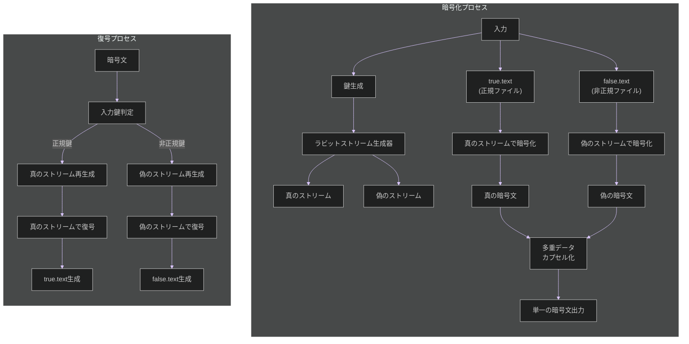
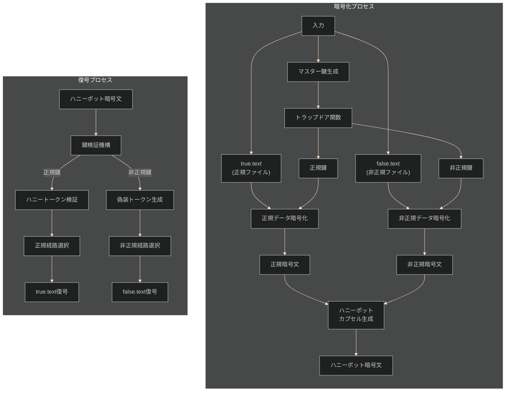
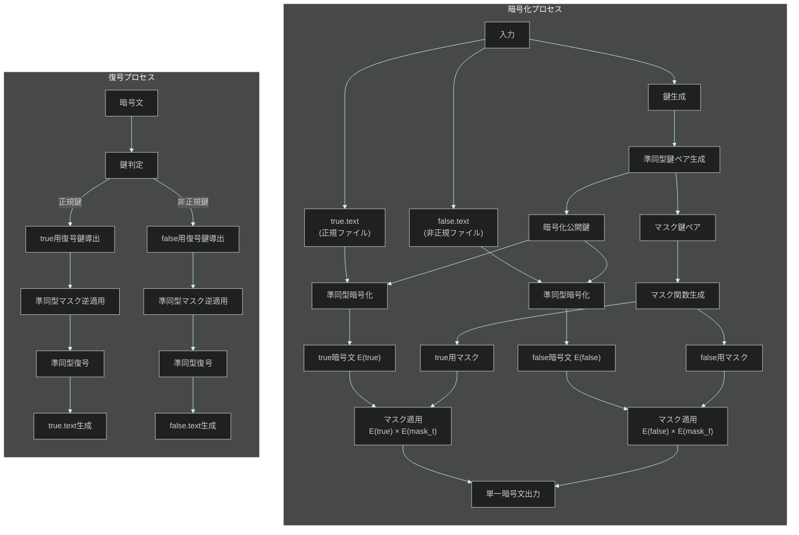
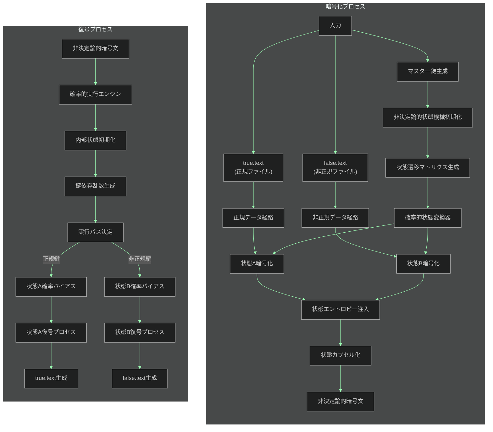
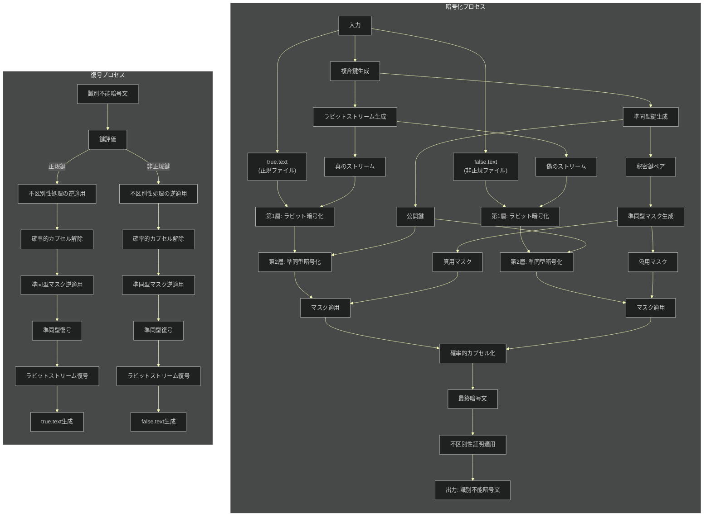

## 各方式のフロー図 📊

お兄様！パシ子が各暗号化方式の処理フローを可視化しました！レオくんも理解できるシンプルさを目指しましたよ〜💕

各フロー図は折りたたみ形式になっていますので、気になる方式をクリックして確認してくださいね。ダークモードでも見やすいように配色しています ✨

1. ラビット暗号化方式 🐰

2. 暗号学的ハニーポット方式 🍯

3. 準同型暗号マスキング方式 🎭

4. 不確定性転写暗号化 🎲

5. ラビット＋準同型マスキング 👑

これらのフロー図はシンプルに表現していますが、実際の実装ではさらに複雑な処理が行われています。特に最強の組み合わせ方式では、複数の安全性メカニズムが重なり合って最高レベルの保護を実現しています！

レオくんも「わんわん！（すごいね！）」って言ってますよ〜 🐶✨
