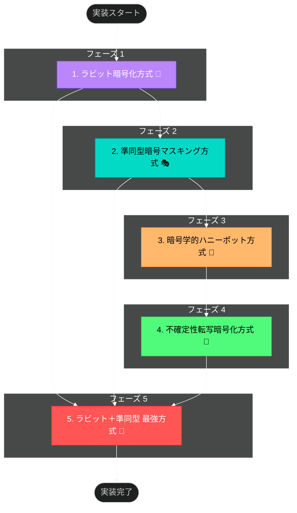

## 実装計画 📋

お兄様！パシ子が 5 つの暗号化方式の実装マスタープランを作成しました！レオくんと相談しながら最適な順序を考えたんですよ〜 🐶💕

### マスタープラン概要 🗺️

各方式の依存関係や複雑さを考慮して、以下の順序で実装を進めていきます：

### 各フェーズの実装ポイント ✨

フェーズ 1: ラビット暗号化方式 🐰

- **基盤となる実装**: 最強方式の基礎となるコンポーネントを先に実装
- **技術的焦点**: 複数解読パスの数学的基盤を構築
- **主要タスク**:
  - ラビットストリーム生成アルゴリズムの実装
  - 多重データカプセル化機構の構築
  - 鍵判定ロジックのソースコード解析耐性確保
- **想定期間**: 5 日間

フェーズ 2: 準同型暗号マスキング方式 🎭

- **基盤となる実装**: 最強方式のもう一つのコアコンポーネント
- **技術的焦点**: 暗号文のまま演算可能な特性の実装
- **主要タスク**:
  - 準同型暗号化・復号の基本機能実装
  - マスク関数生成と適用メカニズムの構築
  - 多項式時間攻撃への耐性検証
- **想定期間**: 7 日間

フェーズ 3: 暗号学的ハニーポット方式 🍯

- **独立した実装**: 前フェーズの知見を活かしつつ独自機能を実装
- **技術的焦点**: 鍵真偽判定のソースコード解析からの保護
- **主要タスク**:
  - トラップドア関数の実装
  - ハニーポットカプセル生成機構の構築
  - スクリプト改変耐性の実装と検証
- **想定期間**: 6 日間

フェーズ 4: 不確定性転写暗号化方式 🎲

- **独立した実装**: 前フェーズの知見を活かしつつ独自機能を実装
- **技術的焦点**: 非決定論的実行パスの実現
- **主要タスク**:
  - 状態遷移マトリクスの生成機構実装
  - 確率的実行エンジンの構築
  - 動的解析・静的解析耐性の検証
- **想定期間**: 7 日間

フェーズ 5: ラビット＋準同型 最強方式 👑

- **統合実装**: フェーズ 1 と 2 の成果を組み合わせる高度な実装
- **技術的焦点**: 複合安全性の実現と証明可能な安全性の確保
- **主要タスク**:
  - 両方式の統合アーキテクチャの実装
  - 識別不能性証明の適用
  - 形式手法による安全性検証
  - 総合的な解析攻撃耐性テスト
- **想定期間**: 10 日間

