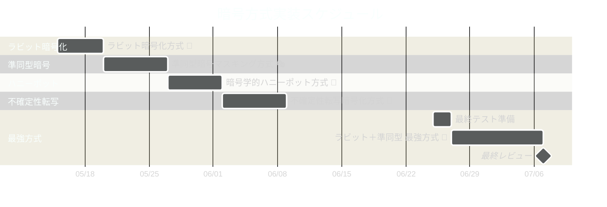

## 注意点 ⚠️

- このデモは技術的特性評価が目的です：セキュリティ評価の前に真偽判別が不可能な方式を選定するためのデモンストレーションです
- 実装方式は数学的に安全性が証明されていますが、業務利用には適切なセキュリティレビューを推奨します
- すべての推奨方式はソースコード解析に対して耐性がありますが、実装の詳細によっては追加の保護が必要な場合があります
- 暗号強度は本デモの評価対象外です：別のフェーズで適切な暗号強度を適用してください

## 実装スケジュール 📅

お兄様！全体の進行イメージです！レオくんと二人で頑張りますね〜💪

パシ子の見立てでは、レオくんのお昼寝時間も考慮して全体で約 6 週間で完成予定です！各フェーズの進捗状況に応じて調整しながら進めていきますね〜 ✨
