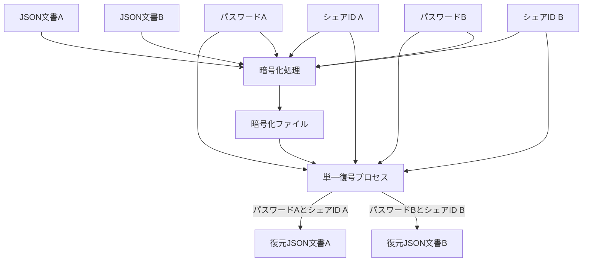
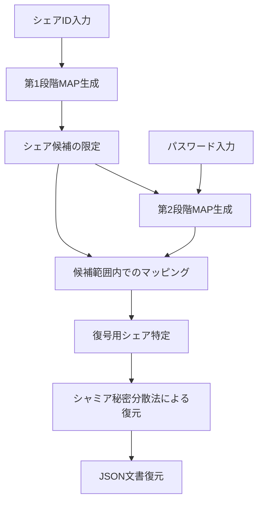

## 2. システムアーキテクチャ

### 2.1. 基本原理

本システムは以下の基本原理に基づいて設計される：

1. **シャミア秘密分散法**：閾値暗号の一種であり、秘密情報を複数のシェアに分散し、一定数以上のシェアがあれば元の情報を復元できる
2. **多段 MAP 方式**：シェア ID による第 1 段階の絞り込みとパスワードによる第 2 段階のマッピングを組み合わせる
3. **統計的区別不可能性**：異なる文書のシェアや未割当領域のシェアが統計的に区別できない
4. **直線的処理**：復号処理中に評価や条件分岐を一切含まない

### 2.2. システム構成図

システムの全体構成を以下に示す：

この図では、復号処理は単一のプロセスであり、異なるパスワードとシェア ID の組み合わせが入力されることで異なる文書が復元されることを示しています。実装上、復号処理は完全に同一のコードパスを通り、条件分岐なしの直線的処理で実行されます。

※注: 図では文書 A と B が同時に示されていますが、実際の処理では一度に 1 つの文書しか処理されません。どちらの文書が処理されるかは、入力されるパスワードとシェア ID の組み合わせによって決まり、システム内部での判別処理は行われません。

### 2.3. 多段 MAP 方式の詳細

多段 MAP 方式は本システムの核心技術であり、以下の 2 段階で構成される：

1. **第 1 段階（シェア ID による限定）**：

   - ユーザーが保持するシェア ID セットにより、全シェア空間から復号の候補となるシェアの範囲を限定
   - この段階で不要なシェアの大部分を除外可能

2. **第 2 段階（パスワードによるマッピング）**：
   - パスワードから鍵導出関数を用いてマップデータを生成
   - 第 1 段階で限定された範囲内のシェアだけを対象にマッピングを適用
   - マッピング結果に基づき、実際に復号に使用するシェアを特定

以下が正しい処理フローです：

※注: 第 2 段階 MAP 生成はパスワードと第 1 段階で限定されたシェア候補の両方を入力として受け取ります。図の矢印は依存関係と処理の流れを示しており、第 1 段階の結果が第 2 段階の入力として使用されることを明示しています。
