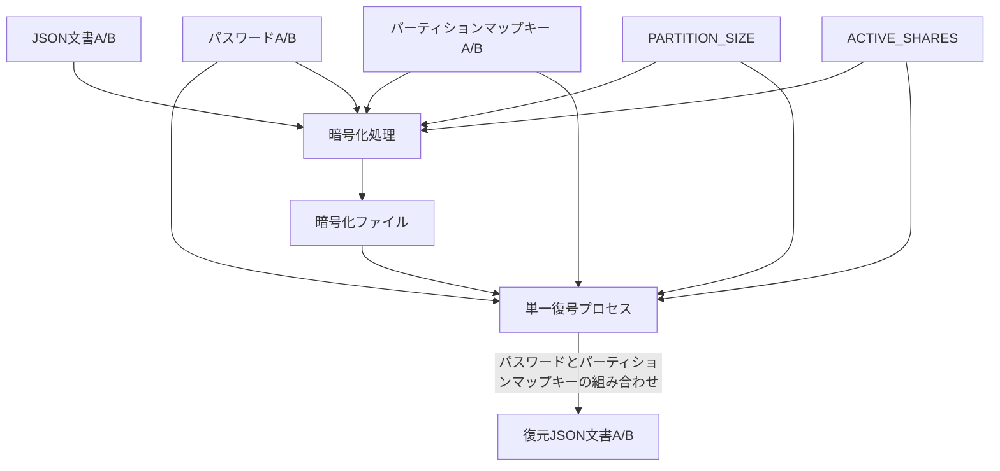
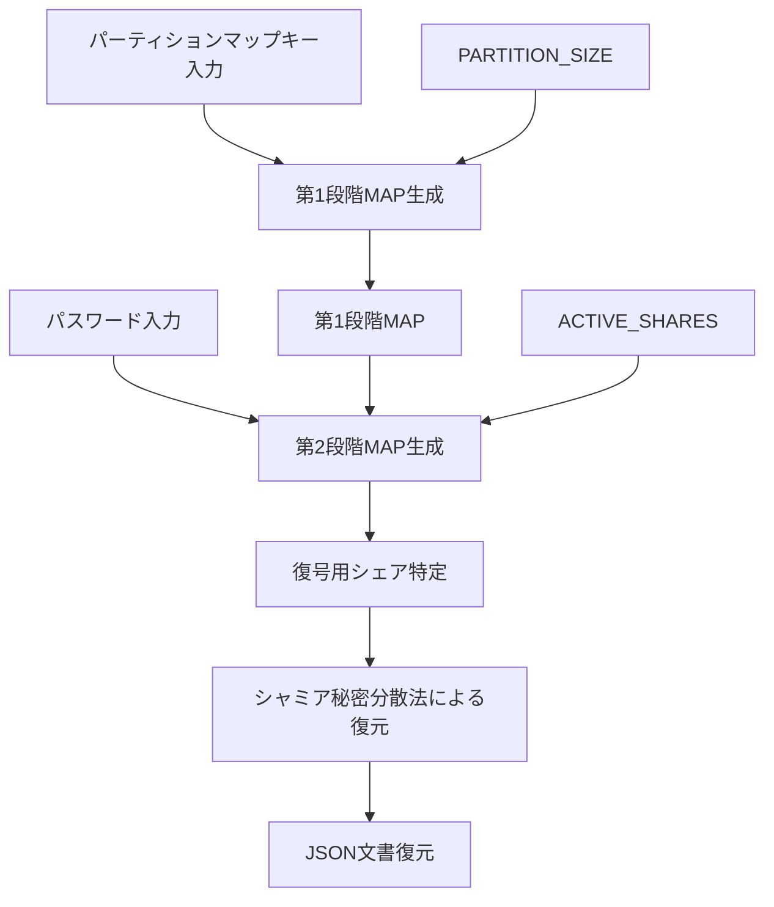

# シャミア秘密分散法による複数平文復号システム設計書

## 2. システムアーキテクチャ

### 2.1. 基本原理

本システムは以下の基本原理に基づいて設計される：

1. **シャミア秘密分散法**：閾値暗号の一種であり、秘密情報を複数のシェアに分散し、一定数以上のシェアがあれば元の情報を復元できる
2. **多段 MAP 方式**：パーティションマップキーによる第 1 段階の MAP 生成とパスワードによる第 2 段階のマッピングを組み合わせる
3. **統計的区別不可能性**：異なる文書のシェアや未割当領域のシェア（すなわちガベージシェア）が統計的に区別できず、暗号化ファイルやその他の生成物からも一切の手がかりが得られない
4. **直線的処理**：復号処理中に評価や条件分岐を一切含まない
5. **ガベージシェア分散配置**：有効シェアと統計的に区別できないガベージシェアをシステム全体に分散配置することで、攻撃者による意味のあるパターン認識を阻止する
6. **障害耐性と自動復旧機能**：更新処理中の障害に対応するためのバックアップ・復元メカニズムを実装し、処理中断時の自動復旧を可能にする
7. **ケルクホフの原理**：システムのセキュリティがアルゴリズムの秘匿ではなくキー（パスワード）の秘匿のみに依存する

#### 2.1.1. システム構成図

システムの全体構成を以下に示す：



この図では、復号処理は単一のプロセスであり、異なるパスワードとパーティションマップキーの組み合わせが入力されることで異なる文書が復元されることを示しています。実装上、復号処理は完全に同一のコードパスを通り、条件分岐なしの直線的処理で実行されます。`PARTITION_SIZE`と`ACTIVE_SHARES`は MAP 生成に必須のパラメーターであり、暗号化処理と単一復号プロセスの両方に入力として使用されます。

※注: 図では文書 A/B が統合されて表現されていますが、実際の処理では一度に 1 つの文書しか処理されません。どちらの文書が処理されるかは、入力されるパスワードとパーティションマップキーの組み合わせによって決まり、システム内部での判別処理は行われません。A 用と B 用のプロセスは完全に対称的であり、同一のコードパスを通ります。

#### 2.1.2. 多段 MAP 方式の詳細

多段 MAP 方式は本システムの核心技術であり、以下の 2 段階で構成される：

1. **第 1 段階（パーティションマップキーによる MAP 生成）**：

   - ファイルが保持するパーティションマップキーセットにより、第 1 段階の MAP を生成
   - この MAP により全シェア空間から復号の候補となるシェアの範囲を特定
   - この段階で不要なシェア（ガベージシェア）の大部分を除外可能
   - パーティション空間には有効シェアとガベージシェアが混在して配置される

2. **第 2 段階（パスワードによるマッピング）**：
   - パスワードから鍵導出関数を用いてマップデータを生成
   - 第 1 段階で特定された範囲内のシェアだけを対象にマッピングを適用
   - マッピング結果に基づき、実際に復号に使用するシェアを特定
   - このプロセスでガベージシェアを識別せずに有効シェアだけを効率的に選択
   - `ACTIVE_SHARES`パラメータにより、選択されるシェア数が決定される

以下が復号の処理フローです：



※注: 第 2 段階 MAP 生成はパスワード、第 1 段階で特定されたシェア候補、および`ACTIVE_SHARES`の３つの入力に依存します。`ACTIVE_SHARES`は各ファイル(A/B)が使用する有効シェア数を表す整数値で、第 2 段階 MAP の出力結果として選択されるシェア数を決定します。図の矢印は依存関係と処理の流れを示しています。第 2 段階 MAP は常に一定数（`ACTIVE_SHARES`個）のシェアを選択するため、これらの 3 つの要素が同じであれば、常に同じシェアが選択される決定論的な特性を持ちます。第 1 段階 MAP 生成は`パーティションマップキー`と`PARTITION_SIZE`に依存し、これらの入力に基づいてシェア候補の範囲を決定します。第 2 段階 MAP 生成が完了した時点で、復号に使用する正確なシェアの特定が可能になります。

#### 2.1.3. 暗号化ファイルの構造

暗号化ファイルの中身を平文で表現すると、以下のように単純な数値の羅列だけです：

```
['43168234226065444066188128433421335992812488068053585868021789200038419124861',
'43168234226065444066188128433421335992812488068053585868021789200038419124861']
...
```

特徴:

- チャンクデータだけが並び、識別情報や関連付け情報は一切含まれない
- 全てのチャンクは外見上区別できず、統計的に同一の分布を持つ
- シェアの所属（A/B/未割当）を示す情報は一切含まれない
- 有効シェアとガベージシェアが統計的に区別できないように設計されている
- 未割当領域のシェアはすなわちガベージシェアであり、システム初期化時は全てのシェアがガベージシェアとなる。暗号化後は`GARBAGE_SHARES + UNASSIGNED_SHARES`のパラメータによってガベージシェアの量が制御される
- チャンク識別子や順序情報も含まれない
- 全ての識別と復号はパーティションマップキーとパスワード　ソルト　 ACTIVE_SHARES 　 GARBAGE_SHARES 　の組み合わせのみで行われる
- システム初期化時は全領域がガベージシェアで埋められ、暗号化時に必要な部分のみが有効シェアに置き換えられる

### 2.2. 暗号書庫生成（createCryptoStorage）

- **目的**: 暗号書庫を初期状態で作成し、A/B 両領域の基盤構造を確立する
- **入力**: なし（システムパラメータのみ使用）
- **処理**:
  1. 全シェア空間にガベージシェアを配置し、統計的区別不可能性の基盤を確立
  2. 全シェア ID 空間（`SHARE_ID_SPACE`）をランダムに 3 区画に分割
     - A 用パーティション（`PARTITION_SIZE`分の ID 領域）
     - B 用パーティション（`PARTITION_SIZE`分の ID 領域）
     - 未割当領域（`UNASSIGNED_SHARES`分の ID 領域）
  3. 各パーティション分布がお互いに重複しないよう確保
  4. A 領域と B 領域に対応するパーティションマップキーを生成
     - 各パーティションマップキーは対応する領域の ID マッピングのみを復元可能
     - 逆変換によりマップキーから元の領域分布を再構築可能に設計
- **出力**:
  - 暗号書庫ファイル（全領域がガベージシェアで満たされた状態）
    - タイムスタンプを含まない UUID ベースのファイル名で生成される
    - これにより作成時期の情報が漏洩することを防止
  - A 用パーティションマップキー：A 用領域の分布を決定論的に特定するためのキー
  - B 用パーティションマップキー：B 用領域の分布を決定論的に特定するためのキー
- **特性**:
  - 暗号書庫生成時点では有効データは含まれず、後続の更新操作により有効データが書き込まれる
  - 生成されたパーティションマップキーはシステム上に保管されず、CLI で利用者に表示されるのみ
  - パーティションマップキーの安全な保管は利用者の責務であり、表示後システムは責務を負わない
  - A 領域と B 領域は完全分離：両領域は互いに不可侵で重複なし
  - 非決定論的分布：暗号書庫の生成ごとに異なるランダムな分布が生成される（セキュリティ向上のため）
  - パーティションマップキーの必要性：領域分布がランダムなため、特定のパーティションを再度アクセスするにはマップキーが必須

### 2.3. 暗号書庫の更新（updateCryptoStorage）

- **目的**: パーティションマップキーが示す領域にデータを格納する
- **入力**:
  - 平文データ（UTF-8 エンコードされた JSON ファイル）
  - 対応するパーティションマップキー
  - 対応するパスワード
- **処理**:
  1. 更新処理の安全性前処理:
     - 暗号書庫ファイル（オリジナル）を一時的にバックアップとして複製（UUID 付加）
     - 更新処理状態を示すロックファイルの生成（処理中であることを示す）
     - バックアップ保持期間（`BACKUP_RETENTION_DAYS`）を超過した古いバックアップの削除
  2. パーティションマップキーから第 1 段階 MAP を再生成
     - パーティションマップキーを用いて、対応する領域の ID 分布を再構築
     - この再構築により、`PARTITION_SIZE`分の ID 空間が確定される
  3. 第 1 段階 MAP とパスワードから第 2 段階 MAP を生成（`ACTIVE_SHARES`分の ID 選択）
     - パスワードからハッシュ値を生成
     - ハッシュ値と第 1 段階 MAP の ID 空間を使用して決定論的乱数を生成
     - 第 1 段階 MAP が定義する ID 空間内での絶対位置として`ACTIVE_SHARES`分の ID を決定論的に選択（`SHARE_ID_SPACE`に対しては暗号書庫が変わるごとに第 2 段階 MAP が示す有効なシェアの位置が変わる）
     - 選択された ID の集合が第 2 段階 MAP となる
     - 相対位置を使用することで同じパスワードでも異なるパーティションマップキーでは異なる絶対位置になり、セキュリティが向上する
  4. データフロー処理:
     1. 前処理と容量検証
        - JSON データのサイズが `ACTIVE_SHARES × CHUNK_SIZE` の容量制限内であることを検証
     2. 多段エンコードプロセスの適用
        - UTF-8 テキスト（元の JSON）
        - Latin-1 へのエンコード変換
        - Base64 エンコード
        - 固定長シリアライズ処理（入力データサイズに関わらず完全な固定サイズを保証）
     3. 平文データ → チャンク分割（64 バイト固定長、合計で正確に`ACTIVE_SHARES`個のチャンクを生成）
     4. 各チャンク → シャミア法適用 → `ACTIVE_SHARES`個のシェア生成（各チャンクが ACTIVE_SHARES 個のシェアに正確に変換される）
     5. ACTIVE_SHARES 個のシェア群を第 2 段階 MAP に配置しファイルに保存（暗号化状態）
  5. 更新処理の安全性後処理:
     - 処理が正常に完了した場合：ロックファイルを削除
     - 処理が異常終了した場合：複製した暗号書庫ファイルをオリジナルに復元
- **出力**: 更新された暗号書庫ファイル
- **特性**:
  - 状態認識なし: 前の状態を考慮せず、指定された MAP に完全に上書き
  - 冪等性: 同一暗号書庫・同一パスワード・同一パーティションマップキーによる複数回の呼び出しは同一結果となる
  - 履歴無依存: 初回更新も 2 回目以降の更新も同一の処理パスをたどる
  - 決定論的: 同じパスワードと同じ第 1 段階 MAP からは常に同じシェア ID 集合が生成されるが、パーティションマップキーが異なれば SHARE_ID_SPACE に対しての絶対位置は異なる（第 1 段階 MAP に対して第 2 段階 MAP が分布するため）
  - 分離性: A 用と B 用のシェア空間は互いに重複せず、別のパーティションに属する
  - 固定サイズ変換: 入力データサイズに関わらず、多段エンコードと固定長シリアライズによって常に同一サイズのチャンク群に変換される
  - 統計的区別不可能性: 固定サイズ処理により、データサイズからファイル内容の特徴を推定できないよう保証
  - 障害耐性: バックアップ機構とロックファイルにより、処理途中のクラッシュや異常終了からの復旧が可能
  - バックアップ管理: 設定に基づいた期間だけバックアップを保持し、古いバックアップを自動的に削除

#### 2.3.1. 更新処理における許容事象

更新処理において正常な振る舞いとして許容される事象：

1. 全く関連のない暗号書庫を、関連のないパスワードで上書きして破壊する
2. 間違ったパスワードを使用して、異なる MAP で既存データを上書きする
3. 同じ暗号書庫内で A のデータを B のデータで上書きする
4. 空（未使用）の領域をデータで上書きする
5. 既に使用済みの領域を新たなデータで上書きする

これらの事象は、暗号システムとしては正常な振る舞いであり、エラーや例外として扱うべきではありません。秘密はアルゴリズムではなく、適切なパスワードとパーティションマップキーの組み合わせにのみ依存します。

### 2.4. 暗号書庫の読取（readCryptoStorage）

- **目的**: 第 2 段階 MAP が示す領域からデータを復号して取得する
- **入力**:
  - 対応するパーティションマップキー
  - 対応するパスワード
- **処理**:
  1. パーティションマップキーから第 1 段階 MAP を再生成
     - パーティションマップキーを用いて、対応する領域の ID 分布を再構築
     - この再構築により、`PARTITION_SIZE`分の ID 空間が確定される
  2. 第 1 段階 MAP とパスワードから第 2 段階 MAP を生成（`ACTIVE_SHARES`分の ID 特定）
     - パスワードからハッシュ値を生成
     - ハッシュ値と第 1 段階 MAP の ID 空間を使用して決定論的乱数を生成
     - 第 1 段階 MAP が定義する ID 空間内での相対位置として`ACTIVE_SHARES`分の ID を決定論的に選択
     - 選択された ID の集合が第 2 段階 MAP となる
     - 相対位置を使用することで同じパスワードでも異なるパーティションマップキーでは異なる絶対位置になり、セキュリティが向上する
  3. データフロー処理（復号過程）:
     1. シェア群取得 → 特定の MAP に基づくシェア選択
     2. 選択されたシェア → シャミア法逆適用 → チャンク復元
     3. チャンク結合 → 平文データ復元
- **出力**: 復号された UTF-8 エンコードの JSON ファイル（成功時）または無意味なデータ（失敗時）
- **特性**:
  - 検証なし: MAP の正当性検証や暗号書庫の整合性チェックは行わない
  - 決定論的: 同一パスワードと同一パーティションマップキーに対しては常に同一のシェア集合にアクセスするが、パーティションマップキーが異なれば絶対位置は異なる
  - 無条件実行: 指定された MAP に従い処理を実行し、結果の意味は呼び出し側が判断
  - 一方向性: MAP から元のパスワードやパーティションマップキーを逆算できない
  - 統計的区別不可能性: 生成された MAP から、どのシェアがどのファイルに属するか識別できない

#### 2.4.1. 読取処理における許容事象

読取処理において正常な振る舞いとして許容される事象：

1. 間違ったパスワードで読み取りを試み、無意味なデータを取得する
2. 存在しないデータ領域の読み取りを試み、ガベージシェアを取得する
3. A のパスワードを使って B のデータ領域にアクセスを試みる
4. 一部破損した暗号書庫から部分的なデータを読み取ろうとする
5. 異なるバージョンの暗号書庫を旧バージョンのアルゴリズムで読み取ろうとする

これらの事象は、暗号システムとしては正常な振る舞いであり、エラーや例外として扱うべきではありません。秘密はアルゴリズムではなく、適切なパスワードとパーティションマップキーの組み合わせにのみ依存します。
