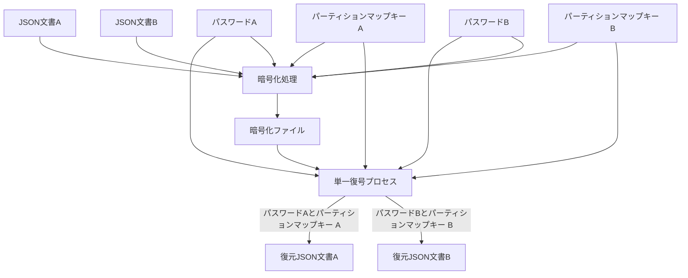
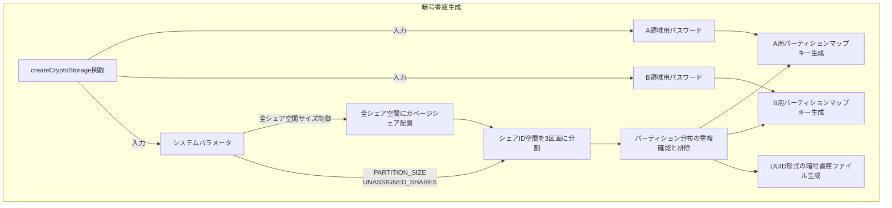
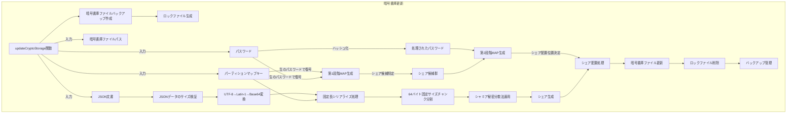
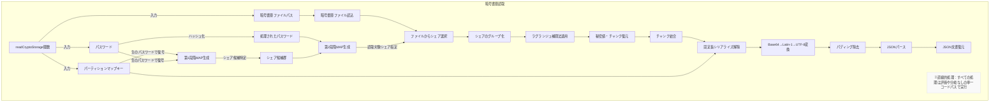

# シャミア秘密分散法による複数平文復号システム設計書

## 2. システムアーキテクチャ

### 2.1. 基本原理

本システムには以下の３つの明確な責務しか存在せず、その範囲外の全ての責務は利用者が負うものとする：

1. **暗号書庫生成（createCryptoStorage）**：初期暗号書庫ファイルの作成とパーティションマップキーの生成
2. **暗号書庫更新（updateCryptoStorage）**：指定されたパーティションマップキーとパスワードに基づく暗号書庫への書き込み
3. **暗号書庫読取（readCryptoStorage）**：指定されたパーティションマップキーとパスワードに基づく暗号書庫からの読み取り

これらの３つの責務の範囲外となる事項（パーティションマップキーの保管、パスワード管理、データバックアップ、入出力ファイルの取り扱いなど）は全て利用者の責任となる。本システムはその設計上、誤用や不適切な運用を検出または防止する機能を持たず、利用者の適切な使用に依存する。

本システムは以下の基本原理に基づいて設計される：

1. **シャミア秘密分散法**：暗号技術の一種であり、秘密情報を複数のシェアに分散し、全てのシェアが揃った場合のみ元の情報を復元できる仕組み
2. **多段 MAP 方式**：パーティションマップキーによる第 1 段階の MAP 生成とパスワードによる第 2 段階のマッピングを組み合わせる
3. **統計的区別不可能性**：異なる文書のシェアや未割当領域のシェアが統計的に区別できず、暗号化ファイルやその他の生成物からも一切の手がかりが得られない
4. **直交処理原則**：全ての処理ステップが互いに独立して一貫性を持ち、入力データの特性に左右されず、常に同一の方法で実行される
5. **直線的処理**：復号処理中に評価や条件分岐を一切含まない
6. **ガベージシェア分散配置**：有効シェアと統計的に区別できないガベージシェアをシステム全体に分散配置することで、攻撃者による意味のあるパターン認識を阻止する
7. **障害耐性と自動復旧機能**：更新処理中の障害に対応するためのバックアップ・復元メカニズムを実装し、処理中断時の自動復旧を可能にする
8. **ケルクホフの原理**：システムのセキュリティがアルゴリズムの秘匿ではなくキー（パスワード）の秘匿のみに依存する

#### 2.1.1. システム構成図

システムの全体構成を以下に示す：

この図では、復号処理は単一のプロセスであり、異なるパスワードとパーティションマップキーの組み合わせが入力されることで異なる文書が復元されることを示しています。実装上、復号処理は完全に同一のコードパスを通り、条件分岐なしの直線的処理で実行されます。

※注: 図では文書 A と B が同時に示されていますが、実際の処理では一度に 1 つの文書しか処理されません。どちらの文書が処理されるかは、入力されるパスワードとパーティションマップキーの組み合わせによって決まり、システム内部での判別処理は行われません。

### 2.2. 暗号書庫生成（createCryptoStorage）の概要

- **目的**: 暗号書庫を初期状態で作成し、A/B 両分布の基盤構造を確立しその両者を復元するためのパーティションマップキーを生成する
- **入力**:
  - A 領域用パスワード（パーティションマップキーの暗号化）
  - B 領域用パスワード（パーティションマップキーの暗号化）
  - システムパラメータ（PARTITION_SIZE, ACTIVE_SHARES など）
- **処理**:

  1. 全シェア空間にガベージシェアを配置し、統計的区別不可能性の基盤を確立
  2. 全シェア ID 空間（`SHARE_ID_SPACE`）をランダムに 3 区画に分布
     - A 用パーティション（`PARTITION_SIZE`分の ID 分布）
     - B 用パーティション（`PARTITION_SIZE`分の ID 分布）
     - 未割当分布（`UNASSIGNED_SHARES`分の ID 分布）
  3. 各パーティション分布がお互いに重複しないよう確保
  4. A 分布と B 分布に対応するパーティションマップキーを生成
     - 各パーティションマップキーは対応する分布の ID マッピング（[1,2,3,7]などの単純な整数配列）をパスワードで暗号化したもの
     - 暗号化されたこの配列から、パスワードを使用して元の分布を再構築可能に設計

- **出力**:
  - 暗号書庫ファイル（全シェア空間がガベージシェアで満たされた状態）
    - タイムスタンプを含まない UUID ベースのファイル名で生成される
    - これにより作成時期の情報が漏洩することを防止
  - A 用パーティションマップキー：A 用分布（単純な整数配列）を暗号化したキー
  - B 用パーティションマップキー：B 用分布（単純な整数配列）を暗号化したキー
- **特性**:
  - 暗号書庫生成時点では有効データは含まれず、後続の更新操作により有効データが書き込まれる
  - 生成されたパーティションマップキーはシステム上に保管されず、CLI で利用者に表示されるのみ
  - パーティションマップキーの安全な保管は利用者の責務であり、表示後システムは責務を負わない
  - パーティションマップキーは単純な整数配列を暗号化したもので、それ自体が A 用か B 用かを示すメタデータは一切含まない
  - A 分布と B 分布は完全分離：両分布は互いに不可侵で重複なし
  - 非決定論的分布：暗号書庫の生成ごとに異なるランダムな分布が生成される（セキュリティ向上のため）
  - パーティションマップキーの必要性：分布がランダムなため、特定のパーティションを再度アクセスするにはマップキーが必須
  - 第 2 段階 MAP の生成は生成処理の責務範囲外：第 2 段階 MAP は更新処理や読取処理の際にパスワードから生成されるもので、暗号書庫生成時には関与しない

暗号書庫生成処理の関係性を以下に示します：

※注: createCryptoStorage 関数の主な責務は初期暗号書庫ファイルの作成とパーティションマップキーの生成です。これらのキーは A/B 領域のシェア ID マッピングを復元するために必要不可欠です。

### 2.3. 暗号書庫更新（updateCryptoStorage）の概要

- **目的**: 指定されたパーティションマップキーとパスワードに基づき、暗号書庫へのデータ書き込みを行う
- **入力**:
  - パーティションマップキー（A または B）
  - パスワード（A または B）
  - JSON 文書（暗号化対象 A または B）
  - 暗号書庫ファイルパス
- **処理**:
  1. 暗号書庫ファイルをバックアップ（WAL 方式）
  2. パーティションマップキーから第 1 段階 MAP を生成
  3. 処理されたパスワードから第 2 段階 MAP を生成
  4. JSON 文書を固定サイズチャンクに分割
  5. シャミア秘密分散法を適用してシェアを生成
  6. 生成したシェアを適切な位置に配置
  7. 処理完了後、バックアップとロックファイルを適切に管理
- **出力**:
  - 更新された暗号書庫ファイル
- **特性**:
  - 書き込み中の障害に対応するバックアップ・復元メカニズム
  - A/B 文書の独立性が保証され、一方を更新しても他方に影響なし
  - 同じパーティションマップキーとパスワードの組み合わせで後に読み取り可能

暗号書庫更新処理の関係性を以下に示します：

### 2.4. 暗号書庫読取（readCryptoStorage）の概要

- **目的**: 指定されたパーティションマップキーとパスワードに基づき、暗号書庫からのデータ読み取りを行う
- **入力**:
  - パーティションマップキー（A または B）
  - パスワード（A または B）
  - 暗号書庫ファイルパス
- **処理**:
  1. パーティションマップキーから第 1 段階 MAP を生成
  2. パスワードから第 2 段階 MAP を生成
  3. 特定されたシェアを選択
  4. シャミア秘密分散法を適用して元のチャンクデータを復元
  5. 復元したチャンクデータを結合して JSON 文書を再構成
- **出力**:
  - 復元された JSON 文書
- **特性**:
  - 完全に直線的な処理で条件分岐がなく、タイミング攻撃に対する耐性がある
  - 暗号書庫自体からは格納されているデータに関する手がかりが得られない
  - 正しいパスワードとパーティションマップキーの組み合わせのみで復号可能

暗号書庫読取処理の関係性を以下に示します：

