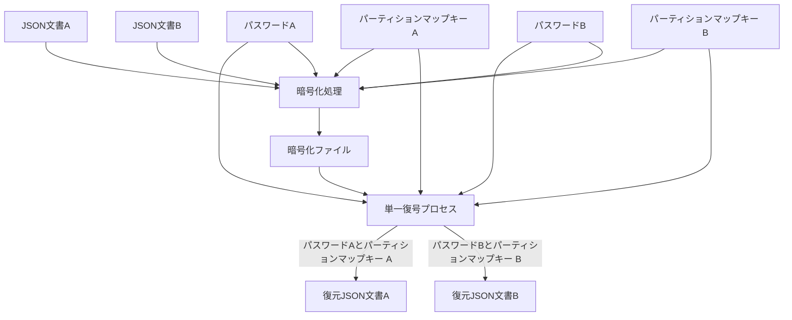
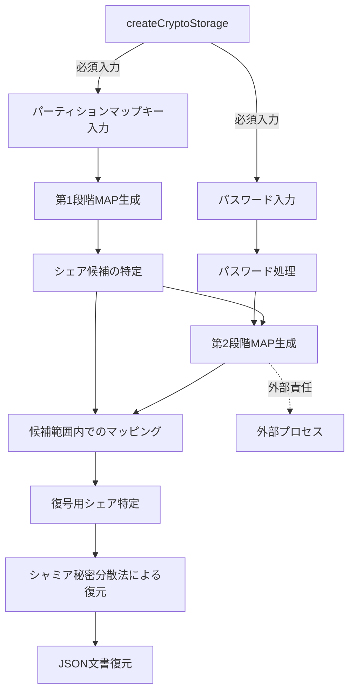

# シャミア秘密分散法による複数平文復号システム設計書

## 2. システムアーキテクチャ

### 2.1. 基本原理

本システムには以下の３つの明確な責務しか存在せず、その範囲外の全ての責務は利用者が負うものとする：

1. **暗号書庫生成（createCryptoStorage）**：初期暗号書庫ファイルの作成とパーティションマップキーの生成
2. **暗号書庫更新（updateCryptoStorage）**：指定されたパーティションマップキーとパスワードに基づく暗号書庫への書き込み
3. **暗号書庫読取（readCryptoStorage）**：指定されたパーティションマップキーとパスワードに基づく暗号書庫からの読み取り

これらの３つの責務の範囲外となる事項（パーティションマップキーの保管、パスワード管理、データバックアップ、入出力ファイルの取り扱いなど）は全て利用者の責任となる。本システムはその設計上、誤用や不適切な運用を検出または防止する機能を持たず、利用者の適切な使用に依存する。

本システムは以下の基本原理に基づいて設計される：

1. **シャミア秘密分散法**：暗号技術の一種であり、秘密情報を複数のシェアに分散し、全てのシェアが揃った場合のみ元の情報を復元できる仕組み
2. **多段 MAP 方式**：パーティションマップキーによる第 1 段階の MAP 生成とパスワードによる第 2 段階のマッピングを組み合わせる
3. **統計的区別不可能性**：異なる文書のシェアや未割当領域のシェアが統計的に区別できず、暗号化ファイルやその他の生成物からも一切の手がかりが得られない
4. **直交処理原則**：全ての処理ステップが互いに独立して一貫性を持ち、入力データの特性に左右されず、常に同一の方法で実行される
5. **直線的処理**：復号処理中に評価や条件分岐を一切含まない
6. **ガベージシェア分散配置**：有効シェアと統計的に区別できないガベージシェアをシステム全体に分散配置することで、攻撃者による意味のあるパターン認識を阻止する
7. **障害耐性と自動復旧機能**：更新処理中の障害に対応するためのバックアップ・復元メカニズムを実装し、処理中断時の自動復旧を可能にする
8. **ケルクホフの原理**：システムのセキュリティがアルゴリズムの秘匿ではなくキー（パスワード）の秘匿のみに依存する

#### 2.1.1. システム構成図

システムの全体構成を以下に示す：



この図では、復号処理は単一のプロセスであり、異なるパスワードとパーティションマップキーの組み合わせが入力されることで異なる文書が復元されることを示しています。実装上、復号処理は完全に同一のコードパスを通り、条件分岐なしの直線的処理で実行されます。

※注: 図では文書 A と B が同時に示されていますが、実際の処理では一度に 1 つの文書しか処理されません。どちらの文書が処理されるかは、入力されるパスワードとパーティションマップキーの組み合わせによって決まり、システム内部での判別処理は行われません。

### 2.2. 暗号書庫生成（createCryptoStorage）

- **目的**: 暗号書庫を初期状態で作成し、A/B 両分布の基盤構造を確立しその両者を復元するためのパーティションマップキーを生成する
- **入力**:
  - A 領域用パスワード（パーティションマップキーの暗号化）
  - B 領域用パスワード（パーティションマップキーの暗号化）
  - システムパラメータ（PARTITION_SIZE, ACTIVE_SHARES など）
- **処理**:

  1. 全シェア空間にガベージシェアを配置し、統計的区別不可能性の基盤を確立
  2. 全シェア ID 空間（`SHARE_ID_SPACE`）をランダムに 3 区画に分布
     - A 用パーティション（`PARTITION_SIZE`分の ID 分布）
     - B 用パーティション（`PARTITION_SIZE`分の ID 分布）
     - 未割当分布（`UNASSIGNED_SHARES`分の ID 分布）
  3. 各パーティション分布がお互いに重複しないよう確保
  4. A 分布と B 分布に対応するパーティションマップキーを生成
     - 各パーティションマップキーは対応する分布の ID マッピング（[1,2,3,7]などの単純な整数配列）をパスワードで暗号化したもの
     - 暗号化されたこの配列から、パスワードを使用して元の分布を再構築可能に設計

- **出力**:
  - 暗号書庫ファイル（全シェア空間がガベージシェアで満たされた状態）
    - タイムスタンプを含まない UUID ベースのファイル名で生成される
    - これにより作成時期の情報が漏洩することを防止
  - A 用パーティションマップキー：A 用分布（単純な整数配列）を暗号化したキー
  - B 用パーティションマップキー：B 用分布（単純な整数配列）を暗号化したキー
- **特性**:
  - 暗号書庫生成時点では有効データは含まれず、後続の更新操作により有効データが書き込まれる
  - 生成されたパーティションマップキーはシステム上に保管されず、CLI で利用者に表示されるのみ
  - パーティションマップキーの安全な保管は利用者の責務であり、表示後システムは責務を負わない
  - パーティションマップキーは単純な整数配列を暗号化したもので、それ自体が A 用か B 用かを示すメタデータは一切含まない
  - A 分布と B 分布は完全分離：両分布は互いに不可侵で重複なし
  - 非決定論的分布：暗号書庫の生成ごとに異なるランダムな分布が生成される（セキュリティ向上のため）
  - パーティションマップキーの必要性：分布がランダムなため、特定のパーティションを再度アクセスするにはマップキーが必須
  - 第 2 段階 MAP の生成は生成処理の責務範囲外：第 2 段階 MAP は更新処理や読取処理の際にパスワードから生成されるもので、暗号書庫生成時には関与しない

### 2.3. 多段 MAP 方式の詳細

多段 MAP 方式は本システムの核心技術であり、以下の 2 段階で構成される：

1. **第 1 段階（パーティションマップキーによる MAP 生成）**：

   - ユーザーが保持するパーティションマップキーにより、第 1 段階の MAP を生成
   - このマップキーは元の整数配列パーティション分布を**全文そのままのパスワード（生のパスワード）**で暗号化したものである
   - この MAP（単純な整数配列 [1,3,5,8,...]）により全シェア空間から復号に必要なシェア全てを特定
   - この段階で不要なシェアの大部分を除外可能
   - 各パーティションマップキーに対応する各パーティション分布は重複せず独立

2. **第 2 段階（処理されたパスワードによるマッピング）**：
   - **必ず処理された（ハッシュ化された）パスワード**から鍵導出関数を用いてマップデータを生成
   - 第 2 段階の MAP も単純な整数配列として実装される
   - 第 1 段階で特定された範囲内のシェア全てを対象にマッピングを適用
   - マッピング結果に基づき、実際に復号に使用するシェア全てを特定
   - 第 2 段階の MAP 生成はパーティション内の相対位置に基づくため、同じ**処理されたパスワード**でも異なるパーティションマップキーを使用すると異なる絶対位置に対応するシェアが選択される
   - **重要：開発者は第 2 段階 MAP 生成に全文そのままの生のパスワードを使用してはならない**

以下が正しい処理フローです：



※注: 第 2 段階 MAP 生成は**処理されたパスワード**と第 1 段階で特定されたシェア候補の両方を入力として受け取ります。図の矢印は依存関係と処理の流れを示しており、第 1 段階の結果が第 2 段階の入力として使用されることを明示しています。パスワードは**必ず処理（ハッシュ化）されてから**第 2 段階 MAP 生成に使用されます。開発者は第 2 段階 MAP 生成に生のパスワードを使用してはなりません。本システムでは、常に全てのシェアを使用して復号を行うため、閾値の概念は存在しません。また、createCryptoStorage の呼び出しには必須入力として**全文そのままのパスワード**とパーティションマップキーが必要です。第 2 段階 MAP の生成は createCryptoStorage プロセスの外部の責任となります。

### 2.4. 暗号化ファイルの構造

暗号化ファイルの中身を平文で表現すると、以下のように単純な数値の羅列だけです：

```
[
  43168234226065444066188128433421335992812488068053585868021789200038419124861,
  19875432109876543210987654321098765432109876543210987654321098765432109876543,
  87654321098765432109876543210987654321098765432109876543210987654321098765432,
  12345678901234567890123456789012345678901234567890123456789012345678901234567,
  ...
]
```

これは実際の暗号領域の内容を表しており、各値はシャミア秘密分散法により生成された非常に大きな整数（シェア値）です。

特徴:

- チャンクデータだけが並び、識別情報や関連付け情報は一切含まれない
- 全てのチャンクは外見上区別できず、統計的に同一の分布を持つ
- シェアの所属（A/B/未割当）を示す情報は一切含まれない
- チャンク識別子や順序情報も含まれない
- 全ての識別と復号はパーティションマップキーとパスワードの組み合わせのみで行われる
- 復号には常に全てのシェアが使用され、シェア数に対する閾値という概念は存在しない

### 2.5. データ処理フロー

#### 暗号化フロー

本システムでの暗号化処理の流れは以下の通りです：

1. **平文データ** → **多段エンコード処理** → **チャンク分割（64 バイト固定長）**:

   - JSON 文書を確認し、容量制限内であることを検証
   - 多段エンコード処理を適用：UTF-8 テキスト → Latin-1 へのエンコード変換 → Base64 エンコード → パーティションマップキーを使用した固定長シリアライズ処理
   - パーティションマップキーを使用して、Base64 エンコード後のデータを固定長形式に暗号化し、データの統計的特徴を完全に隠蔽
   - 処理後のデータを厳密に 64 バイト固定サイズのチャンクに分割
   - 全ての入力に対して常に一定のパディング処理を適用（直交処理原則に基づく）

2. **各チャンク** → **シャミア法適用** → **複数のシェア生成**:

   - 各チャンクをシャミア秘密分散法でシェア化（全シェア使用方式）
   - 多項式の次数はシェア数-1 とし、全てのシェアを使用する方式を実装

3. **シェア群をファイルに保存（暗号化状態）**:
   - パーティションマップキーから第 1 段階 MAP を生成（**全文そのままのパスワード**で復号）
   - **処理されたパスワード**から第 2 段階 MAP を生成（固定数のシェア位置）
   - 第 2 段階 MAP で確定した全シェア位置に有効シェアを配置
   - 最小限のメタデータ（ソルト値のみ）を付加して暗号化ファイルを生成
   - **注意：第 2 段階 MAP 生成には生のパスワードではなく必ず処理されたパスワードを使用する**

#### 復号フロー

復号処理の流れは以下の通りです：

1. **シェア群取得** → **特定の MAP に基づくシェア選択**:

   - パーティションマップキーを使用して第 1 段階 MAP を生成（**全文そのままのパスワード（生のパスワード）**で復号）
   - **処理された（ハッシュ化された）パスワード**とソルトを使用して第 2 段階 MAP を生成
   - 適切なシェアを全て選択し、チャンク毎に整理
   - **注意：第 2 段階 MAP 生成には生のパスワードではなく必ず処理されたパスワードを使用する**

2. **選択されたシェア** → **シャミア法逆適用** → **チャンク復元**:

   - 各チャンクに対してラグランジュ補間で秘密を復元
   - 復元したチャンクを結合して元のデータを生成

3. **チャンク結合** → **多段デコード処理** → **平文データ復元**:
   - 復元したチャンクを結合
   - 固定サイズ調整用のパディングデータを除去
   - 多段デコード処理を適用（暗号化の逆手順）:
     - パーティションマップキーを使用した固定長シリアライズの解除
     - Base64 デコード
     - Latin-1 から UTF-8 へのエンコード変換
   - デコードされた UTF-8 テキストから JSON 文書を復元

### 2.6. 実装上の重要ポイント

以下は本システムの実装において特に重要な点です：

1. **固定サイズチャンク処理**:

   - チャンクサイズは厳密に 64 バイト（512 ビット）を遵守
   - 全チャンクを厳密に同一サイズ・同一方法で処理し、統計的区別不能性を確保
   - 入力サイズに関わらず常に同一のチャンク処理パイプラインを適用

2. **多段エンコード処理**:

   - UTF-8 テキスト（元の JSON）→ Latin-1 へのエンコード変換 → Base64 エンコード → パーティションマップキーを使用した固定長シリアライズ処理
   - Base64 エンコード後にパーティションマップキーを使って固定長形式に暗号化し、完全な固定サイズと統計的区別不能性を保証
   - この多段エンコードとシリアライズにより、復号プロセスの堅牢性を確保し、変動要因を排除

3. **WAL ログ方式と一時ファイル管理**:

   - 更新処理時には WAL（Write-Ahead Logging）方式を採用
   - 一時ファイルは独自の暗号化処理を適用し、本体ファイルとの相関攻撃リスクを防止
   - ロックファイルを使用して複数プロセスの並列実行に対応し、相互干渉を防止

4. **A/B 文書独立性保証**:

   - 各文書の更新は必ず一文書ずつ行われ、同時更新は許可されない
   - A 文書を更新する際、B 文書のシェアは完全に保護され変更されない
   - updateCryptoStorage 関数は領域指定をパラメータとして受け取らず、パーティションマップキーから対応する分布を自動的に特定する

5. **メタデータ最小化**:
   - 塩値（salt）のみを保存し、その他のメタデータは極力排除
   - 初期化ファイルと暗号化済みファイルが外部から区別できないよう設計

これらの実装ポイントに従うことで、安全性と効率性を両立したシステムを構築できます。

### 2.7. パーティションマップキーの詳細

パーティションマップキーは本システムにおける重要な要素であり、以下の特性を持ちます：

1. **パーティションマップキーの本質**:

   - パーティションマップキーは `9jfhsyenehgr6hkwhjyhbweey6d` のような単一行の文字列として表現される
   - 本質的には、パーティション分布データを**全文そのままのパスワード（生のパスワード）**で暗号化した形式である
   - 単なるシェア ID のリストではなく、シェア ID を特定するための元データとして機能する
   - パーティションマップキーの復号には**必ず全文そのままのパスワード**を使用する

2. **MAP との関係**:

   - パーティションマップキーから暗号学的ハッシュ関数を通じて第 1 段階 MAP（整数配列）が生成される
   - 生成される MAP は単純な整数の配列（例: [1,3,5,8,10,15,...]）であり、必要なシェア ID を特定する

3. **メタデータの排除**:

   - パーティションマップキー自体は、A 用か B 用かを示すメタデータを一切含まない
   - 暗号化された形態のみが保存され、外部からはその用途が判別できない
   - このメタデータの排除により、キー自体からの情報漏洩リスクを最小化している

4. **セキュリティモデル**:

   - パーティションマップキーと**全文そのままのパスワード（生のパスワード）**の 2 要素により、セキュリティが確保される
   - 第 1 段階 MAP の保護には**全文そのままのパスワード**を使用し、第 2 段階 MAP 生成には**必ず処理（ハッシュ化）されたパスワード**を使用する
   - どちらか一方だけでは復号できない設計になっている
   - 同じパーティションマップキーを使用すれば常に同じシェア候補群が特定され、決定論的な動作が保証される
   - 一方で、パスワードはユーザーごとに異なるため、実際に使用されるシェアも異なる
   - **重要：開発者は第 2 段階 MAP 生成に全文そのままの生のパスワードを誤って使用してはならない**

5. **createCryptoStorage との関係**:

   - パーティションマップキーは createCryptoStorage 関数への必須入力の一つである
   - このキーにより、暗号化データの物理的な配置が決定される
   - 暗号データ内のどの部分が A 用でどの部分が B 用かはパーティションマップキーのみが把握している

6. **固定長シリアライズ処理との関連**:
   - パーティションマップキーは多段エンコード処理の最終段階である固定長シリアライズ処理にも使用される
   - Base64 エンコード後のデータをパーティションマップキーを使って固定長形式に暗号化することで、データの統計的特徴を完全に隠蔽する
   - この処理によりデータ量やパターンからの情報漏洩リスクを排除し、より高い安全性を確保する

このようにパーティションマップキーは単なる識別子ではなく、暗号システム全体の安全性と機能性を支える重要な要素です。外部から見ると単なる文字列に見えますが、内部的には複雑な暗号学的処理により、効率的かつ安全にデータの分離と保護を実現しています。
