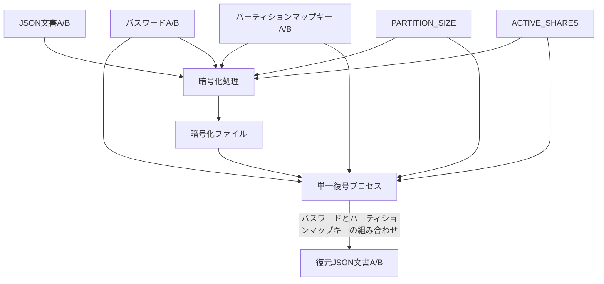
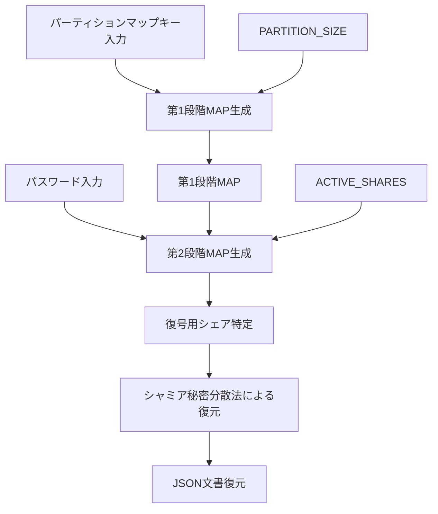

# シャミア秘密分散法による複数平文復号システム設計書

## 2. システムアーキテクチャ

### 2.1. 基本原理

本システムは以下の基本原理に基づいて設計される：

1. **シャミア秘密分散法**：閾値暗号の一種であり、秘密情報を複数のシェアに分散し、一定数以上のシェアがあれば元の情報を復元できる
2. **多段 MAP 方式**：パーティションマップキーによる第 1 段階の MAP 生成とパスワードによる第 2 段階のマッピングを組み合わせる
3. **統計的区別不可能性**：異なる文書のシェアや未割当領域のシェア（すなわちガベージシェア）が統計的に区別できず、暗号化ファイルやその他の生成物からも一切の手がかりが得られない
4. **直線的処理**：復号処理中に評価や条件分岐を一切含まない
5. **ガベージシェア分散配置**：有効シェアと統計的に区別できないガベージシェアをシステム全体に分散配置することで、攻撃者による意味のあるパターン認識を阻止する

### 2.2. システム構成図

システムの全体構成を以下に示す：



この図では、復号処理は単一のプロセスであり、異なるパスワードとパーティションマップキーの組み合わせが入力されることで異なる文書が復元されることを示しています。実装上、復号処理は完全に同一のコードパスを通り、条件分岐なしの直線的処理で実行されます。`PARTITION_SIZE`と`ACTIVE_SHARES`は MAP 生成に必須のパラメーターであり、暗号化処理と単一復号プロセスの両方に入力として使用されます。

※注: 図では文書 A/B が統合されて表現されていますが、実際の処理では一度に 1 つの文書しか処理されません。どちらの文書が処理されるかは、入力されるパスワードとパーティションマップキーの組み合わせによって決まり、システム内部での判別処理は行われません。A 用と B 用のプロセスは完全に対称的であり、同一のコードパスを通ります。

### 2.3. 多段 MAP 方式の詳細

多段 MAP 方式は本システムの核心技術であり、以下の 2 段階で構成される：

1. **第 1 段階（パーティションマップキーによる MAP 生成）**：

   - ファイルが保持するパーティションマップキーセットにより、第 1 段階の MAP を生成
   - この MAP により全シェア空間から復号の候補となるシェアの範囲を特定
   - この段階で不要なシェア（ガベージシェア）の大部分を除外可能
   - パーティション空間には有効シェアとガベージシェアが混在して配置される

2. **第 2 段階（パスワードによるマッピング）**：
   - パスワードから鍵導出関数を用いてマップデータを生成
   - 第 1 段階で特定された範囲内のシェアだけを対象にマッピングを適用
   - マッピング結果に基づき、実際に復号に使用するシェアを特定
   - このプロセスでガベージシェアを識別せずに有効シェアだけを効率的に選択
   - `ACTIVE_SHARES`パラメータにより、選択されるシェア数が決定される

以下が復号の処理フローです：



※注: 第 2 段階 MAP 生成はパスワード、第 1 段階で特定されたシェア候補、および`ACTIVE_SHARES`の３つの入力に依存します。`ACTIVE_SHARES`は各ファイル(A/B)が使用する有効シェア数を表す整数値で、第 2 段階 MAP の出力結果として選択されるシェア数を決定します。図の矢印は依存関係と処理の流れを示しています。第 2 段階 MAP は常に一定数（`ACTIVE_SHARES`個）のシェアを選択するため、これらの 3 つの要素が同じであれば、常に同じシェアが選択される決定論的な特性を持ちます。第 1 段階 MAP 生成は`パーティションマップキー`と`PARTITION_SIZE`に依存し、これらの入力に基づいてシェア候補の範囲を決定します。第 2 段階 MAP 生成が完了した時点で、復号に使用する正確なシェアの特定が可能になります。

### 2.4. 暗号化ファイルの構造

暗号化ファイルの中身を平文で表現すると、以下のように単純な数値の羅列だけです：

```
['43168234226065444066188128433421335992812488068053585868021789200038419124861',
'43168234226065444066188128433421335992812488068053585868021789200038419124861']
...
```

特徴:

- チャンクデータだけが並び、識別情報や関連付け情報は一切含まれない
- 全てのチャンクは外見上区別できず、統計的に同一の分布を持つ
- シェアの所属（A/B/未割当）を示す情報は一切含まれない
- 有効シェアとガベージシェアが統計的に区別できないように設計されている
- 未割当領域のシェアはすなわちガベージシェアであり、システム初期化時は全てのシェアがガベージシェアとなる。暗号化後は`GARBAGE_SHARES + UNASSIGNED_SHARES`のパラメータによってガベージシェアの量が制御される
- チャンク識別子や順序情報も含まれない
- 全ての識別と復号はパーティションマップキーとパスワード　ソルト　 ACTIVE_SHARES 　 GARBAGE_SHARES 　の組み合わせのみで行われる
- システム初期化時は全領域がガベージシェアで埋められ、暗号化時に必要な部分のみが有効シェアに置き換えられる
