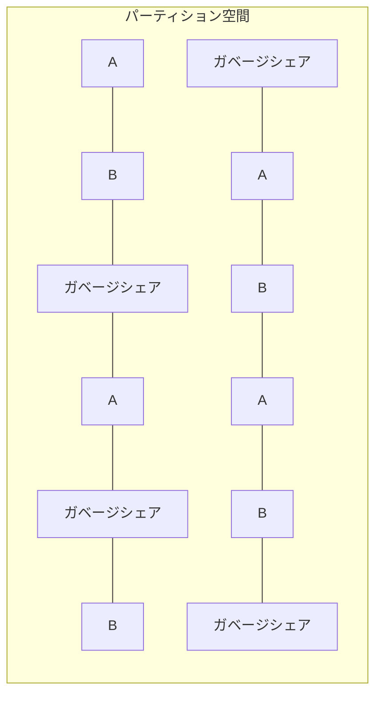

# シャミア秘密分散法による複数平文復号システム設計書

## 3.1. 詳細設計 - 全体的な前提と理念

### 3.1.1. 基本用語と概念

#### 3.1.1.1. システムの主要コンポーネント

- 暗号書庫 = `CryptoStorage`：システム全体が管理する暗号化データファイル
- 生成処理 = `createCryptoStorage`：暗号書庫の初期作成と構造確立を行う処理
- 更新処理 = `updateCryptoStorage`：暗号書庫への文書の暗号化と保存を行う処理
- 読取処理 = `readCryptoStorage`：暗号書庫からの文書の復号と取得を行う処理

#### 3.1.1.2. システムの責務範囲

本システムには以下の３つの明確な責務しか存在せず、その範囲外の全ての責務は利用者が負うものとする：

1. **暗号書庫生成（createCryptoStorage）**：初期暗号書庫ファイルの作成とパーティションマップキーの生成
2. **暗号書庫更新（updateCryptoStorage）**：指定されたパーティションマップキーとパスワードに基づく暗号書庫への書き込み
3. **暗号書庫読取（readCryptoStorage）**：指定されたパーティションマップキーとパスワードに基づく暗号書庫からの読み取り

これらの３つの責務の範囲外となる事項（パーティションマップキーの保管、パスワード管理、データバックアップ、入出力ファイルの取り扱いなど）は全て利用者の責任となる。本システムはその設計上、誤用や不適切な運用を検出または防止する機能を持たず、利用者の適切な使用に依存する。

### 3.1.2. システム設計原則

#### 3.1.2.1. ケルクホフの原理に基づく設計

本システムは、ケルクホフの原理に厳格に従い、システムのセキュリティがアルゴリズムの秘匿ではなくキー（パスワード）の秘匿のみに依存するよう設計されている。

1. **書庫独立性によるセキュリティ強化**：

   - **相対マッピングと絶対位置の分離**：

     - パスワードから生成される第 2 段階 MAP は「相対的なマッピングパターン」のみを定義
     - このパターンが第 1 段階 MAP（書庫固有）に適用されることで、最終的な「絶対位置」が決定
     - 同じパスワードでも異なる暗号書庫では全く異なるシェアが選択される

   - **統計的相関性の排除**：

     - 暗号書庫の生成ごとに完全に独立した第 1 段階 MAP を生成
     - 複数の暗号書庫間で有意な相関を示す特徴が存在しないよう設計
     - これにより、一方の暗号書庫から得られた情報を他方に適用する攻撃を防止

   - **アルゴリズム公開の安全性**：
     - 第 2 段階 MAP の生成アルゴリズムが公開されていても、第 1 段階 MAP が暗号書庫ごとに独立しているため、その知識だけでは攻撃に利用できない
     - この設計がケルクホフの原理に合致し、アルゴリズム秘匿に依存せずセキュリティを確保

2. **更新処理における許容事象**：

   以下の事象は、暗号システムとしては正常な振る舞いであり、エラーや例外として扱うべきではない：

   - 全く関連のない暗号書庫を、関連のないパスワードで上書きして破壊する
   - 間違ったパスワードを使用して、異なる MAP で既存データを上書きする
   - 同じ暗号書庫内で A のデータを B のデータで上書きする
   - 空（未使用）の領域をデータで上書きする
   - 既に使用済みの領域を新たなデータで上書きする

3. **読取処理における許容事象**：

   以下の事象は、暗号システムとしては正常な振る舞いであり、エラーや例外として扱うべきではない：

   - 間違ったパスワードで読み取りを試み、無意味なデータを取得する
   - 存在しないデータ領域の読み取りを試み、ガベージシェアを取得する
   - A のパスワードを使って B のデータ領域にアクセスを試みる
   - 一部破損した暗号書庫から部分的なデータを読み取ろうとする
   - 異なるバージョンの暗号書庫を旧バージョンのアルゴリズムで読み取ろうとする

### 3.1.3. システムパラメータと構成

#### 3.1.3.1. 主要パラメータ

暗号書庫の構成を決定する重要なパラメータ群：

- `ACTIVE_SHARES`：各ファイル(A/B)用の有効シェア数（整数、共通値）
- `GARBAGE_SHARES`：各ファイル(A/B)用のガベージシェア数（整数、共通値）
- `PARTITION_SIZE`：各ファイル(A/B)用パーティション総サイズ（ACTIVE_SHARES + GARBAGE_SHARES）
- `UNASSIGNED_SHARES`：未割当シェア数（整数）、AB どちらにも所属しないガベージシェア
- `SHARE_ID_SPACE`：全シェア ID 空間（PARTITION_SIZE \* 2 + UNASSIGNED_SHARES）
- `BACKUP_RETENTION_DAYS`：バックアップ保持期間（日数）
- `CHUNK_SIZE`：チャンクサイズ（バイト単位、通常 64 バイト）

#### 3.1.3.2. 設定例

暗号書庫のパラメータはシステム構成ファイル `constants.py` で以下のように定義される：

```python
# ファイルパーティション設計
PARTITION_SIZE = 6000   # 各ファイル(A/B)用パーティション総サイズ（整数、共通値）
ACTIVE_SHARES = 2000    # 各ファイル(A/B)用有効シェア数（整数、共通値）
GARBAGE_SHARES = 4000   # 各ファイル(A/B)用ガベージシェア数（整数、共通値）

# 未割当領域
UNASSIGNED_SHARES = 6000     # ガベージシェア数（整数）

# 全体シェア数（自動計算）
SHARE_ID_SPACE = PARTITION_SIZE * 2 + UNASSIGNED_SHARES

# バックアップ設定
BACKUP_RETENTION_DAYS = 30  # バックアップファイル保持期間
```

### 3.1.4. 核心技術：多段 MAP 方式

多段 MAP 方式は本システムの核心技術であり、以下の 2 段階で構成される：

#### 3.1.4.1. 第 1 段階（パーティションマップキーによる MAP 生成）

- ユーザーが保持するパーティションマップキーにより、第 1 段階の MAP を生成
- このマップキーは元の整数配列パーティション分布を**全文そのままのパスワード（生のパスワード）**で暗号化したものである
- この MAP（単純な整数配列 [1,3,5,8,...]）により全シェア空間から復号に必要なシェア全てを特定
- この段階で不要なシェアの大部分を除外可能
- 各パーティションマップキーに対応する各パーティション分布は重複せず独立

#### 3.1.4.2. 第 2 段階（処理されたパスワードによるマッピング）

- **必ず処理された（ハッシュ化された）パスワード**から鍵導出関数を用いてマップデータを生成
- 第 2 段階の MAP も単純な整数配列として実装される
- 第 1 段階で特定された範囲内のシェア全てを対象にマッピングを適用
- マッピング結果に基づき、実際に復号に使用するシェア全てを特定
- 第 2 段階の MAP 生成はパーティション内の相対位置に基づくため、同じ**処理されたパスワード**でも異なるパーティションマップキーを使用すると異なる絶対位置に対応するシェアが選択される
- **重要：開発者は第 2 段階 MAP 生成に全文そのままの生のパスワードを使用してはならない**

#### 3.1.4.3. パーティションマップキーの詳細

パーティションマップキーは本システムにおける重要な要素であり、以下の特性を持つ：

1. **パーティションマップキーの本質**：

   - パーティションマップキーは `9jfhsyenehgr6hkwhjyhbweey6d` のような単一行の文字列として表現される
   - 本質的には、パーティション分布データを**全文そのままのパスワード（生のパスワード）**で暗号化した形式である
   - 単なるシェア ID のリストではなく、シェア ID を特定するための元データとして機能する
   - パーティションマップキーの復号には**必ず全文そのままのパスワード**を使用する

2. **MAP との関係**：

   - パーティションマップキーから暗号学的ハッシュ関数を通じて第 1 段階 MAP（整数配列）が生成される
   - 生成される MAP は単純な整数の配列（例: [1,3,5,8,10,15,...]）であり、必要なシェア ID を特定する

3. **メタデータの排除**：

   - パーティションマップキー自体は、A 用か B 用かを示すメタデータを一切含まない
   - 暗号化された形態のみが保存され、外部からはその用途が判別できない
   - このメタデータの排除により、キー自体からの情報漏洩リスクを最小化している

4. **セキュリティモデル**：

   - パーティションマップキーと**全文そのままのパスワード（生のパスワード）**の 2 要素により、セキュリティが確保される
   - 第 1 段階 MAP の保護には**全文そのままのパスワード**を使用し、第 2 段階 MAP 生成には**必ず処理（ハッシュ化）されたパスワード**を使用する
   - どちらか一方だけでは復号できない設計になっている
   - 同じパーティションマップキーを使用すれば常に同じシェア候補群が特定され、決定論的な動作が保証される
   - 一方で、パスワードはユーザーごとに異なるため、実際に使用されるシェアも異なる
   - **重要：開発者は第 2 段階 MAP 生成に全文そのままの生のパスワードを誤って使用してはならない**

5. **createCryptoStorage との関係**：

   - パーティションマップキーは createCryptoStorage 関数への必須入力の一つである
   - このキーにより、暗号化データの物理的な配置が決定される
   - 暗号データ内のどの部分が A 用でどの部分が B 用かはパーティションマップキーのみが把握している

6. **固定長シリアライズ処理との関連**：
   - パーティションマップキーは多段エンコード処理の最終段階である固定長シリアライズ処理にも使用される
   - Base64 エンコード後のデータをパーティションマップキーを使って固定長形式に暗号化することで、データの統計的特徴を完全に隠蔽する
   - この処理によりデータ量やパターンからの情報漏洩リスクを排除し、より高い安全性を確保する

### 3.1.5. パーティション空間設計

暗号書庫はパーティション空間と呼ばれる論理構造に基づいており、以下のような設計と生成プロセスで実装される：

#### 3.1.5.1. パーティション空間の初期生成過程

1. システムパラメータ（`PARTITION_SIZE`、`ACTIVE_SHARES`、`GARBAGE_SHARES`、`UNASSIGNED_SHARES`）に基づいて、全体の`SHARE_ID_SPACE`を決定
2. 全シェア ID 空間をランダムに以下の 3 つの領域に分割：
   - A 用領域（`PARTITION_SIZE`分）
   - B 用領域（`PARTITION_SIZE`分）
   - 未割当領域（`UNASSIGNED_SHARES`分）
3. A 領域と B 領域を完全に分離・不可侵に設定（重複なし）
4. **上記で確定した A/B 領域の分布に基づいて**パーティションマップキー A/B を生成
5. パーティションマップキーは対応する領域の分布のみを復元可能、他方は復元不可能

このプロセスにより、パーティションマップキーは領域分布を特定するための鍵として機能するが、領域分布自体はパーティションマップキーの生成に先立って決定されることに注意が必要です。

#### 3.1.5.2. パーティション定義と構造

- ファイル A/B それぞれに対して常に**完全に同一サイズ**のパーティション空間を割り当て
- 各パーティション領域は有効シェアとガベージシェアの混合で構成される
- シェア ID 空間の全体サイズは自動計算される（`SHARE_ID_SPACE = PARTITION_SIZE * 2 + UNASSIGNED_SHARES`）

#### 3.1.5.3. 分散配置の原則

- 連続範囲や単純なパターン（偶数/奇数など）は意図的に避ける
- ID 空間内のどの部分を切り取っても、A、B、ガベージシェアの識別が統計的に不可能となるよう設計
- ID 空間を小さなブロックに分割し、各ブロック内でランダムに割り当てる手法を採用



#### 3.1.5.4. 実装とアクセス方法

- パーティション空間全体は暗号書庫生成時に擬似乱数生成器を用いて一度だけ初期化
- 各 ID の割り当て（A、B、ガベージシェア）は暗号書庫内に直接保存せず、初期化時に生成されたパーティションマップキーから逆導出する
- 領域へのアクセスには段階ごとに異なる要素が必要：
  - **第 1 段階（領域特定）**：パーティションマップキー A または B を使用して候補となる`PARTITION_SIZE`分のシェア ID 空間を特定
  - **第 2 段階（有効シェア特定）**：第 1 段階で特定された領域内で、パスワードと`ACTIVE_SHARES`パラメータを用いて、実際にデータを含む`ACTIVE_SHARES`分のシェア ID を特定

#### 3.1.5.5. 有効シェア数と暗号化容量の関係

- 各ファイルが実際に使用できるのは`ACTIVE_SHARES`の数（例：2000 シェア）
- 最大データ容量 = `ACTIVE_SHARES × CHUNK_SIZE`（例：2000 × 64 バイト = 128KB の実データ容量）
- この制限を超えるデータは暗号化不可能（固定長シリアライズ処理で対応）

#### 3.1.5.6. パーティション空間の固定性

- パーティション空間は初期化時に確定し、以降はシステム運用中に容量変更が一切生じない
- 運用要件に応じてこれらの値を調整可能（初期化前に設定）
- シェア ID 空間サイズは暗号化可能なファイルサイズの上限を直接決定する

**例外: 破壊的更新**

- 暗号書庫に対して**関連のないパーティションマップキー**を用いて更新処理を行うと、そのパーティションマップキーに基づいて書庫構造が破壊的に変更される
- これは既存データの上書きを意味し、元のパーティションマップキーに対応するデータは取り出せなくなる
- このような操作はセキュリティモデル上は「許容事象」だが、データの破壊を伴うことに注意が必要

#### 3.1.5.7. パーティション空間管理

パーティション空間の効率的かつ安全な管理のための指針：

1. **分散化と均一性**：

   - パーティションマップ内のシェア（有効シェアとガベージシェア）の分布はランダム性を維持し、パターンを形成しない
   - 任意の連続範囲において、各種別（A/B/未割当）の分布比率が一定となるよう設計
   - ブロック単位での分布検証を実施し、統計的均一性を確保

2. **シェア ID 処理の最適化**：

   - シェア ID の分布テーブルをビットマップまたは固定長配列として実装し、直接アクセス可能にする
   - シェア ID がどのパーティション（A/B/ガベージシェア）に属するかの判定には、条件分岐のない実装を使用
   - マスク演算（AND/OR）を用いた定数時間アクセス処理により、サイドチャネル漏洩を防止

3. **安全な生成と管理**：
   - 暗号学的に安全な乱数発生器を用いたパーティション空間の生成
   - 初期化時にのみ ID 割り当てを行い、以後は変更しない
   - 割り当て情報は 4 つの要素（両パスワードと両パーティションマップキーセット）なしには再構築不可能

#### 3.1.5.8. 未割当領域のセキュリティ強化

ガベージシェア領域がもたらすセキュリティ強化：

1. **統計的攻撃の難化**：

   - 攻撃者がファイル全体の 20-40%を無視できない
   - パターン認識による攻撃が困難になる

2. **空間分離による安全性担保**：

   - ファイル A/B 間の空間的分離を強化し、相互干渉を防止
   - 統計的相関分析に対する耐性を向上
   - 注：この未割当領域は意図的に「何もしない」ことでセキュリティを高めており、ここに追加機能を実装することは設計思想に反する

3. **セキュリティにおける逆説的責務**：
   - この領域は「何もしない、何の役にも立たない」ことがその本質的な責務である
   - この「無用性」が全体システムのセキュリティを高める重要な要素となる
   - システムの進化においても、この領域は常に「無目的」であり続けることがセキュリティモデルの一貫性を保証する

### 3.1.6. シャミア秘密分散法の実装

本システムで採用するシャミア秘密分散法の実装詳細：

#### 3.1.6.1. 多項式の次数とシェア数

- **全シェア使用方式の採用**：本システムでは閾値の概念を使用せず、常に全てのシェアを使用
- 復号に使用するシェアの数を n とすると、次数「n-1」の多項式を使用
- 確実な復号を保証するため、必ず全ての n 個のシェアを使用
- この設計は、潜在的なシェア選択攻撃を排除し、セキュリティを強化

#### 3.1.6.2. 有限体の選択

- 大きな素数`p`を用いた有限体 GF(p)上で計算
- 安全性と実用性のバランスを考慮し、十分な大きさの素数を採用（例：2^256-189 などの暗号学的に安全な素数）
- gmpy2 ライブラリの mpz（多倍長整数）型を使用することで、大きな素数上の演算を効率的に実装
- 選択理由:
  - 秘密情報の完全な情報論的安全性を確保（シャミア法の本質的特性）
  - 多項式補間において高精度かつ一意な計算結果を保証
  - 数学的特性を利用した攻撃への対策として必要十分な大きさを確保

### 3.1.7. データ処理と暗号化ファイル

#### 3.1.7.1. 暗号化ファイルの構造

暗号化ファイルの中身を平文で表現すると、以下のように単純な数値の羅列だけです：

```
[
  43168234226065444066188128433421335992812488068053585868021789200038419124861,
  19875432109876543210987654321098765432109876543210987654321098765432109876543,
  87654321098765432109876543210987654321098765432109876543210987654321098765432,
  12345678901234567890123456789012345678901234567890123456789012345678901234567,
  ...
]
```

これは実際の暗号領域の内容を表しており、各値はシャミア秘密分散法により生成された非常に大きな整数（シェア値）です。

特徴:

- チャンクデータだけが並び、識別情報や関連付け情報は一切含まれない
- 全てのチャンクは外見上区別できず、統計的に同一の分布を持つ
- シェアの所属（A/B/未割当）を示す情報は一切含まれない
- チャンク識別子や順序情報も含まれない
- 全ての識別と復号はパーティションマップキーとパスワードの組み合わせのみで行われる
- 復号には常に全てのシェアが使用され、シェア数に対する閾値という概念は存在しない

#### 3.1.7.2. 多段エンコードプロセス

全ての入力データに対して、以下の統一的な変換処理を適用：

1. JSON 文書を UTF-8 テキストとして処理
2. 固定容量検証とパディング処理：
   - データサイズが`ACTIVE_SHARES × CHUNK_SIZE`以内か検証
   - データサイズによらず同一のパディング処理を適用
3. 多段エンコード変換：
   - UTF-8 → Latin-1 エンコード変換
   - Latin-1 → Base64 エンコード
   - Base64 → 固定長シリアライズ処理

#### 3.1.7.3. チャンク分割と処理

1. エンコード済みデータを 64 バイト固定サイズのチャンクに分割
2. 全チャンクに対して同一の処理を適用（最後のチャンクも含む）
3. 分割後のチャンク数が`ACTIVE_SHARES`と一致することを確認

#### 3.1.7.4. 固定サイズ制約の重要性

シェア生成と配置における固定サイズ制約は、システムの安全性と堅牢性にとって極めて重要である:

1. **区別不能性の確保**：

   - 全てのデータ（実データとガベージシェアを含む）が固定サイズ 64 バイトで処理されることで、統計的・構造的区別が不可能になる
   - チャンクサイズに変動を持たせることは、統計的特徴から実データとガベージシェアの区別が可能になる為禁止

2. **容量制限の明確化**：

   - シェア ID 空間サイズとチャンクサイズから、暗号化可能な最大データ量が明確に定義される
   - システム設計者は容量要件に基づいて、適切な`ACTIVE_SHARES`や`PARTITION_SIZE`を設定可能

3. **運用上の安定性**：
   - 処理パターンが一定であることで、予測可能なパフォーマンスと安定した運用が実現する
   - エラー処理が簡素化され、例外状況の発生を最小限に抑えられる

### 3.1.8. 統計的区別不可能性の実装

統計的区別不可能性を確保するための具体的実装方法を以下に示す：

#### 3.1.8.1. シェア値の均一分布

- シャミア秘密分散法の数学的特性上、多項式の係数をランダムに選択すると、結果として生成されるシェア値は有限体上で均一分布する
- 実装方法：
  ```python
  def generate_polynomial(secret, degree, p):
      """degree次の多項式を生成（係数は完全ランダム）"""
      coef = [secret]  # 最初の係数は秘密値
      # 残りの係数は完全なランダム値
      for i in range(degree):
          coef.append(secrets.randbelow(p))
      return coef
  ```
- この実装により、生成されるシェア値は統計的に区別不可能になる

#### 3.1.8.2. シェア ID 分布の最適化

- 連続した ID（1,2,3...）の使用を避け、ランダム分布させた ID を使用
- 実装方法：
  ```python
  def generate_share_ids(n, id_space_size=2**32):
      """ランダムなシェアIDをn個生成"""
      ids = set()
      while len(ids) < n:
          # 大きな範囲からランダムにID生成
          new_id = secrets.randbelow(id_space_size)
          if new_id > 0:  # IDは0以外
              ids.add(new_id)
      return list(ids)
  ```
- この実装により、ID から文書種別（A/B/未割当）の推測が困難になる

#### 3.1.8.3. シェア間相関の排除

- チャンク間やシェア間の統計的相関を排除する手法
- 各チャンクに対して独立したソルト値を使用
- 実装方法：
  ```python
  def generate_chunk_shares(chunks, share_ids, p):
      """複数チャンクのシェアを生成、相関を排除"""
      all_shares = []
      for i, chunk in enumerate(chunks):
          # 各チャンク専用のソルト値を生成
          chunk_salt = secrets.token_bytes(16)
          # シェア生成時にチャンクとソルトを組み合わせ
          processed_secret = combine_with_salt(chunk, chunk_salt, p)
          # 全シェアを生成（閾値の概念は使用せず）
          polynomial_degree = len(share_ids) - 1
          chunk_shares = generate_shares(processed_secret, polynomial_degree, share_ids, p)
          all_shares.append((chunk_salt, chunk_shares))
      return all_shares
  ```
- チャンク間の相関を排除し、統計的攻撃に対する耐性を向上

#### 3.1.8.4. チャンクサイズの厳密な統一

- すべてのチャンクを 64 バイト固定サイズで処理
- パディング実装の例：
  ```python
  def pad_chunk(chunk, target_size=64):
      """チャンクを指定サイズに厳密にパディング"""
      # チャンクサイズが小さい場合は埋める
      if len(chunk) < target_size:
          # 埋めるサイズを計算
          pad_size = target_size - len(chunk)
          # PyCryptodomeのPadding機能を使用
          from Crypto.Util.Padding import pad
          padded_chunk = pad(chunk, target_size)
          return padded_chunk
      # 既に指定サイズの場合はそのまま返す
      elif len(chunk) == target_size:
          return chunk
      # チャンクサイズが大きい場合は次のチャンクに分割（呼び出し側で処理）
      else:
          return chunk[:target_size]
  ```
- この実装により、あらゆるチャンクが同一サイズとなり、統計的区別を不可能にする

#### 3.1.8.5. 実装上のトレードオフと実用的アプローチ

- 完全な統計的区別不可能性と計算効率のバランスを考慮
- 現実的アプローチ：

  - チャンクサイズを統一（64 バイト固定）し、パディングを統一的に適用
  - HMAC-SHA を用いた決定論的なマッピング
  - 未割当領域には良質な乱数（/dev/urandom または secrets）でガベージシェアを生成
  - 第 2 段階 MAP で特定された位置に有効データを配置

- 実装例：

  ```python
  def create_secure_file(json_data, partition_key, password, salt):
      """全シェア位置に有効データを配置した安全なファイルを生成"""
      # 第1段階MAP生成
      stage1_map = generate_stage1_map(partition_key)

      # 第2段階MAP生成
      # パスワードを固定長に変換
      hashed_password = hash_to_fixed_length(password)
      stage2_map = generate_stage2_map(hashed_password, salt, stage1_map)

      # データを固定サイズチャンクに分割
      chunks = split_to_fixed_chunks(json_data, 64)

      # 必要なチャンク数と実際のチャンク数を比較
      required_chunks = len(stage2_map)
      has_enough_data = len(chunks) >= required_chunks

      # データ定量化（64バイト固定長に調整）
      quantized_chunks = quantize_data_chunks(chunks, required_chunks)

      # チャンク数が多すぎる場合は切り捨て
      chunks = chunks[:required_chunks]

      # 全シェア生成
      all_shares = []
      for i, chunk in enumerate(chunks):
          # シェア生成
          shares = generate_shares_all_required(chunk, stage2_map, PRIME)
          all_shares.extend(shares)

      return all_shares
  ```

- この実装は不足位置にガベージシェアを混入せず、常に全位置を有効データで満たす
