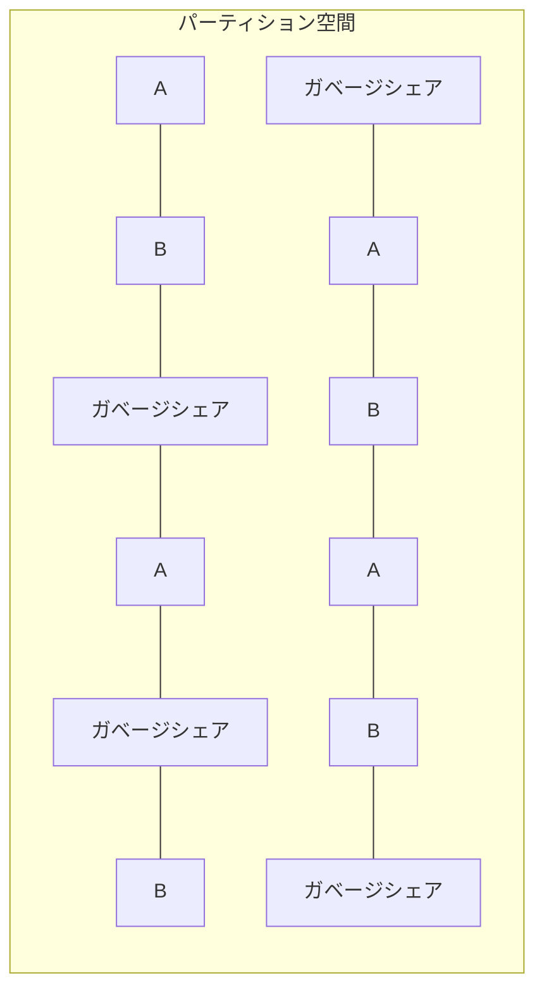

# シャミア秘密分散法による複数平文復号システム設計書

## 3. 詳細設計

### 3.1. パーティション空間設計

パーティション空間は以下のように設計する：

1. **パーティション定義と整数値による明示化**：

   - ファイルパーティション設計を`constants.py`で整数値として明示的に定義

     ```
     # ファイルパーティション設計（整数値で明示的に定義）

     ACTIVE_SHARES = 2000    # 各ファイル(A/B)用有効シェア数（整数、共通値）
     GARBAGE_SHARES = 2000   # 各ファイル(A/B)用ガベージシェア数（整数、共通値）
     PARTITION_SIZE = ACTIVE_SHARES + GARBAGE_SHARES   # 各ファイル(A/B)用パーティション総サイズ（整数、共通値）
     UNASSIGNED_SHARES = 4000     # 未割当シェア数（整数）ガベージシェア
     ```

   - シェア ID 空間のサイズは自動計算される
     ```
     # 全体シェア数（自動計算）
     SHARE_ID_SPACE = PARTITION_SIZE * 2 + UNASSIGNED_SHARES
     ```
   - ファイル A/B それぞれに対して常に**完全に同一**のパーティションサイズを割り当て

2. **分散配置**：

   - 連続範囲や単純なパターン（偶数/奇数など）を避ける
   - ID 空間内のどの部分を切り取っても、A、B、ガベージシェアの識別が統計的に不可能
   - 例えば、ID 空間を小さなブロックに分割し、各ブロック内でランダムに割り当て

3. **実装方法**：

   - パーティション空間全体を擬似乱数生成器を用いて初期化
   - 各 ID の割り当て（A、B、ガベージシェア）は直接保存せず、パスワード A と B およびパーティションマップキー A、パーティションマップキー B から導出
   - 割り当て判別には以下の 4 要素全てが必要：
     1. パスワード A
     2. パスワード B
     3. パーティションマップキー A
     4. パーティションマップキー B
   - 任意の要素が一つでも欠けると、どの ID がどの文書に割り当てられているか判別不能

4. **有効シェア数と暗号化容量の関係**：

   - 各ファイルが実際に使用できるのは`ACTIVE_SHARES`の数（例：2000 シェア）
   - 最大データ容量 = `ACTIVE_SHARES × CHUNK_SIZE`（例：2000 × 64 バイト = 128KB の実データ容量）
   - この制限を超えるデータは暗号化不可能（固定長シリアライズ処理で対応）

5. **パーティション空間の固定性と設定**：

   - パーティション空間は初期化時に確定し、以降はシステム運用中に容量変更が一切生じない
   - この設計は暗号化データの整合性と安全性を保証するために重要
   - ファイルパーティション設計は `method_13_shamir_multi_plaintext_system/shamir/constants.py` で以下のように定義:

     ```
     # ファイルパーティション設計
     PARTITION_SIZE = 3500   # 各ファイル(A/B)用パーティション総サイズ（整数、共通値）
     ACTIVE_SHARES = 2000    # 各ファイル(A/B)用有効シェア数（整数、共通値）
     GARBAGE_SHARES = 1500   # 各ファイル(A/B)用ガベージシェア数（整数、共通値）

     # 未割当領域
     UNASSIGNED_SHARES = 3000     # ガベージシェア数（整数）

     # 全体シェア数（自動計算）
     SHARE_ID_SPACE = PARTITION_SIZE * 2 + UNASSIGNED_SHARES
     ```

   - 運用要件に応じてこれらの値を調整可能（初期化前に設定）
   - シェア ID 空間サイズは暗号化可能なファイルサイズの上限を直接決定する（64 バイト × 有効シェア数）



### 3.2. シャミア秘密分散法の実装

基本的なシャミア秘密分散法を拡張して実装する：

1. **多項式の次数とシェア数**：

   - **全シェア使用方式の採用**：本システムでは閾値の概念を使用せず、常に全てのシェアを使用
   - 復号に使用するシェアの数を n とすると、次数「n-1」の多項式を使用
   - 確実な復号を保証するため、必ず全ての n 個のシェアを使用
   - 実用的な値として、`n=8`程度を推奨（パーティション空間の設計と密接に連携）
   - この設計は、潜在的なシェア選択攻撃を排除し、セキュリティを強化

2. **有限体の選択**：

   - 大きな素数`p`を用いた有限体 GF(p)上で計算
   - 安全性と実用性のバランスを考慮し、十分な大きさの素数を採用（例：2^256-189 などの暗号学的に安全な素数）
   - この素数は現在の計算能力では実用的な時間内に解読できないレベルの安全性を提供
   - gmpy2 ライブラリの mpz（多倍長整数）型を使用することで、大きな素数上の演算を効率的に実装
   - 選択理由:
     - 秘密情報の完全な情報論的安全性を確保（シャミア法の本質的特性）
     - 任意サイズの平文データを効率的に処理するための十分な数値空間を確保
     - 多項式補間において高精度かつ一意な計算結果を保証
     - 数学的特性を利用した攻撃（有限体上での数学的解析）への対策として必要十分な大きさを確保

3. **シェア生成アルゴリズム**：

   - 秘密値から多項式を生成
   - 多項式の係数には秘密値以外をランダムに生成
   - 各シェア ID に対して多項式を評価し、対応するシェア値を得る
   - シェア生成は決定論的手法ではなく、暗号論的に安全な乱数を使用

4. **シェア復元アルゴリズム**：

   - ラグランジュ補間法を用いて複数のシェアから多項式を再構築
   - x=0 における多項式の値（秘密値）を計算
   - モジュラ逆数計算を含む有限体上の演算
   - 実装には定数時間演算を採用し、タイミング攻撃に対する耐性を確保

### 3.3. 多段 MAP の実装

#### 3.3.1. 多段 MAP 方式の詳細

多段 MAP 方式は本システムの核心技術であり、以下の 2 段階で構成される：

1. **第 1 段階（パーティションマップキーによる MAP 生成）**：

   - ファイルが保持するパーティションマップキーセットにより、第 1 段階の MAP を生成
   - 暗号書庫を生成するたびに異なる分布となる
   - この MAP により全シェア空間から復号の候補となるシェアの範囲を特定
   - この段階で不要なシェア（ガベージシェア）の大部分を除外可能
   - パーティション空間には有効シェアとガベージシェアが混在して配置される

2. **第 2 段階（パスワードによるマッピング）**：
   - パスワードから鍵導出関数を用いてマップデータを生成
   - 第 1 段階で特定された範囲内のシェアだけを対象にマッピングを適用
   - マッピング結果に基づき、実際に復号に使用するシェアを特定
   - このプロセスでガベージシェアを識別せずに有効シェアだけを効率的に選択
   - `ACTIVE_SHARES`パラメータにより、選択されるシェア数が決定される

※注: 第 2 段階 MAP 生成はパスワード、第 1 段階で特定されたシェア候補、および`ACTIVE_SHARES`の３つの入力に依存します。`ACTIVE_SHARES`は各ファイル(A/B)が使用する有効シェア数を表す整数値で、第 2 段階 MAP の出力結果として選択されるシェア数を決定します。図の矢印は依存関係と処理の流れを示しています。第 2 段階 MAP は常に一定数（`ACTIVE_SHARES`個）のシェアを選択するため、これらの 3 つの要素が同じであれば、常に同じシェアが選択される決定論的な特性を持ちます。第 1 段階 MAP 生成は`パーティションマップキー`と`PARTITION_SIZE`に依存し、これらの入力に基づいてシェア候補の範囲を決定します。第 2 段階 MAP 生成が完了した時点で、復号に使用する正確なシェアの特定が可能になります。

#### 3.3.2. 多段 MAP の実装詳細

1. **パラメータの理解と総シェア数の把握**：

   - 暗号ファイル初期化時に`ACTIVE_SHARES`、`GARBAGE_SHARES`、`PARTITION_SIZE`、`UNASSIGNED_SHARES`の値を取得
   - これらのパラメータから、各ファイル(A/B)が必要とするシェアの総数を決定
     1. 有効シェア数：各ファイルに`ACTIVE_SHARES`個の有効シェアが必要
     2. ガベージシェア数：各ファイルに`GARBAGE_SHARES`個のガベージシェアが含まれる
     3. パーティションサイズ：`PARTITION_SIZE = ACTIVE_SHARES + GARBAGE_SHARES`が各ファイルの総シェア数
     4. 未割当領域：`UNASSIGNED_SHARES`個のガベージシェアを配置
   - 全体シェア数 = `PARTITION_SIZE * 2 + UNASSIGNED_SHARES`を計算

2. **第 1 段階 MAP（パーティションマップキー）**：

   - パーティションマップキーはファイルに初期化時に割り当てられる
   - パーティションマップキーと`PARTITION_SIZE`から暗号学的ハッシュ関数を用いて第 1 段階 MAP を生成
   - この MAP はパーティション空間内での有効なシェア ID 候補を決定論的に特定
   - 第 1 段階 MAP は常に一定数（`PARTITION_SIZE`分）のシェア ID を選択
   - パーティションマップキーが同じであれば、同じシェア ID セットが常に特定される

3. **第 2 段階 MAP（パスワード）**：

   - パスワードは同一文字長となるよう暗号化（ハッシュ）処理を適用
   - パスワード、ソルト値、および`ACTIVE_SHARES`値からキー導出関数（KDF）を用いて鍵材料を導出
   - その導出された鍵材料を用いて、第 1 段階で特定された候補シェア ID（`PARTITION_SIZE`分）のそれぞれに対して、HMAC-SHA256 などの暗号学的に安全な方法でマッピング値を生成
   - 生成されたマッピング値に基づいて、`PARTITION_SIZE`個のシェア候補から`ACTIVE_SHARES`個のシェアを選択
   - 同じパスワード・ソルト・シェア ID の組み合わせからは常に同じマッピング値が生成される決定論的な特性を持つ

4. **シェア選択と配置プロセス**：

   - 暗号化前にファイル長を厳密に必要な容量となる様に定量化し、`ACTIVE_SHARES * 64バイト`から導かれる必要数に過不足なく適合させる
   - 第 1 段階 MAP で候補シェア ID 全て（`PARTITION_SIZE`分）を選定
   - 第 2 段階 MAP で実際に使用するシェア位置（`ACTIVE_SHARES`分）を特定
   - **ファイル暗号化上限**: データ容量（バイト単位）≦ `ACTIVE_SHARES × CHUNK_SIZE`という単純な掛け算で容量制限を検証
   - **第 2 段階 MAP の全ての位置への有効データ配置**: 復号に必要な全位置に有効なシェア（ガベージシェアなし）を配置
   - 暗号化前にデータサイズチェックを実施し、容量上限を超える場合は処理を中止
   - 暗号化処理では、固定サイズ（64 バイト）チャンクを第 2 段階 MAP で選択された全シェア位置に配置
   - 第 1 段階 MAP で選択されたが第 2 段階 MAP で選択されなかったシェア位置（`GARBAGE_SHARES`分）にはガベージシェアを配置
   - 処理は直線的に行われ、タイミング攻撃に対する耐性を確保

5. **容量制限と最適化**:

   - 暗号化可能な JSON 文書のサイズには固定上限がある
   - 上限値は`ACTIVE_SHARES`とチャンクサイズに依存（`ACTIVE_SHARES × CHUNK_SIZE`）
   - 容量検証は「上限を超えるか否か」の単一条件のみとし、条件分岐を最小化
   - 適切なパディング処理により、データサイズが常に必要なサイズに調整される
   - 堅牢性の原則（区分不能性・ガベージシェアとの区別不能性）を満たすため、64 バイト固定チャンクを厳守

### 3.4. 固定サイズ制約の重要性

シェア生成と配置における固定サイズ制約は、システムの安全性と堅牢性にとって極めて重要である:

1. **区別不能性の確保**:

   - 全てのデータ（実データとガベージシェアを含む）が固定サイズ 64 バイトで処理されることで、統計的・構造的区別が不可能になる
   - チャンクサイズに変動を持たせることは、統計的特徴から実データとガベージシェアの区別が可能になる為禁止します

2. **容量制限の明確化**:

   - シェア ID 空間サイズとチャンクサイズから、暗号化可能な最大データ量が明確に定義される
   - システム設計者は容量要件に基づいて、任意のタイミングで適切な`ACTIVE_SHARES`や`PARTITION_SIZE`を設定可能

3. **運用上の安定性**:
   - 処理パターンが一定であることで、予測可能なパフォーマンスと安定した運用が実現する
   - エラー処理が簡素化され、例外状況の発生を最小限に抑えられる

### 3.5. 暗号化ファイルの構造

暗号化ファイルの中身を平文で表現すると、以下のように単純な数値の羅列だけです：

```
['43168234226065444066188128433421335992812488068053585868021789200038419124861',
'43168234226065444066188128433421335992812488068053585868021789200038419124861']
...
```

特徴:

- チャンクデータだけが並び、識別情報や関連付け情報は一切含まれない
- 全てのチャンクは外見上区別できず、統計的に同一の分布を持つ
- シェアの所属（A/B/未割当）を示す情報は一切含まれない
- 有効シェアとガベージシェアが統計的に区別できないように設計されている
- 未割当分布のシェアはすなわちガベージシェアであり、システム初期化時は全てのシェアがガベージシェアとなる。暗号化後は`GARBAGE_SHARES + UNASSIGNED_SHARES`のパラメータによってガベージシェアの量が制御される
- チャンク識別子や順序情報も含まれない
- 全ての識別と復号はパーティションマップキーとパスワード　ソルト　 ACTIVE_SHARES 　 GARBAGE_SHARES 　の組み合わせのみで行われる
- システム初期化時は全シェア空間がガベージシェアで埋められ、暗号化時に必要な部分のみが有効シェアに置き換えられる

### 3.6. 未割当領域のセキュリティ強化

ガベージシェア領域がもたらすセキュリティ強化：

1. **統計的攻撃の難化**：

   - 攻撃者がファイル全体の 20-40%を無視できない
   - パターン認識による攻撃が困難になる

2. **空間分離による安全性担保**：

   - ファイル A/B 間の空間的分離を強化し、相互干渉を防止
   - 統計的相関分析に対する耐性を向上
   - 注：この未割当領域は意図的に「何もしない」ことでセキュリティを高めており、ここに追加機能を実装することは設計思想に反し、安全性と性能の低下を招く可能性がある

3. **セキュリティにおける逆説的責務**：

   - この領域は「何もしない、何の役にも立たない」ことがその本質的な責務である
   - この「無用性」が全体システムのセキュリティを高める重要な要素となる
   - システムの進化においても、この領域は常に「無目的」であり続けることがセキュリティモデルの一貫性を保証する
