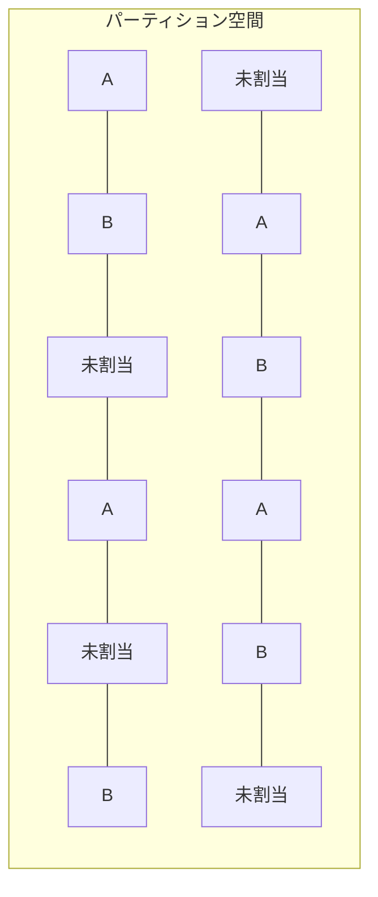

# シャミア秘密分散法による複数平文復号システム設計書

## 3. 詳細設計

### 3.1. パーティション空間設計

パーティション空間は以下のように設計する：

1. **パーティション定義と整数値による明示化**：

   - ファイルパーティション設計を`constants.py`で整数値として明示的に定義
     ```
     # ファイルパーティション設計（整数値で明示的に定義）
     PARTITION_SIZE = 3500   # 各ファイル(A/B)用パーティション総サイズ（整数、共通値）
     ACTIVE_SHARES = 2000    # 各ファイル(A/B)用有効シェア数（整数、共通値）
     GARBAGE_SHARES = 1500   # 各ファイル(A/B)用ゴミデータ数（整数、共通値）
     ```
   - シェア ID 空間のサイズは自動計算される
     ```
     # 全体シェア数（自動計算）
     SHARE_ID_SPACE = PARTITION_SIZE * 2 + UNASSIGNED_SHARES
     ```
   - ファイル A/B それぞれに対して常に**完全に同一**のパーティションサイズを割り当て

2. **分散配置**：

   - 連続範囲や単純なパターン（偶数/奇数など）を避ける
   - ID 空間内のどの部分を切り取っても、A、B、未割当の識別が統計的に不可能
   - 例えば、ID 空間を小さなブロックに分割し、各ブロック内でランダムに割り当て

3. **実装方法**：

   - パーティション空間全体を擬似乱数生成器を用いて初期化
   - 各 ID の割り当て（A、B、未割当）は直接保存せず、パスワード A と B およびパーティションマップキー A、パーティションマップキー B から導出
   - 割り当て判別には以下の 4 要素全てが必要：
     1. パスワード A
     2. パスワード B
     3. パーティションマップキー A
     4. パーティションマップキー B
   - 任意の要素が一つでも欠けると、どの ID がどの文書に割り当てられているか判別不能

4. **有効シェア数と暗号化容量の関係**：

   - 各ファイルが実際に使用できるのは`ACTIVE_SHARES`の数（例：2000 シェア）
   - 最大データ容量 = `ACTIVE_SHARES × CHUNK_SIZE`（例：2000 × 64 バイト = 128KB の実データ容量）
   - この制限を超えるデータは暗号化不可能（固定長シリアライズ処理で対応）

5. **パーティション空間の固定性と設定**：

   - パーティション空間は初期化時に確定し、以降はシステム運用中に容量変更が一切生じない
   - この設計は暗号化データの整合性と安全性を保証するために重要
   - ファイルパーティション設計は `method_13_shamir_multi_plaintext_system/shamir/constants.py` で以下のように定義:

     ```
     # ファイルパーティション設計
     PARTITION_SIZE = 3500   # 各ファイル(A/B)用パーティション総サイズ（整数、共通値）
     ACTIVE_SHARES = 2000    # 各ファイル(A/B)用有効シェア数（整数、共通値）
     GARBAGE_SHARES = 1500   # 各ファイル(A/B)用ゴミデータ数（整数、共通値）

     # 未割当領域
     UNASSIGNED_SHARES = 3000     # 未割当シェア数（整数）

     # 全体シェア数（自動計算）
     SHARE_ID_SPACE = PARTITION_SIZE * 2 + UNASSIGNED_SHARES
     ```

   - 運用要件に応じてこれらの値を調整可能（初期化前に設定）
   - シェア ID 空間サイズは暗号化可能なファイルサイズの上限を直接決定する（64 バイト × 有効シェア数）



### 3.2. シャミア秘密分散法の実装

基本的なシャミア秘密分散法を拡張して実装する：

1. **多項式の次数とシェア数**：

   - **全シェア使用方式の採用**：本システムでは閾値の概念を使用せず、常に全てのシェアを使用
   - 復号に使用するシェアの数を n とすると、次数「n-1」の多項式を使用
   - 確実な復号を保証するため、必ず全ての n 個のシェアを使用
   - 実用的な値として、`n=8`程度を推奨（パーティション空間の設計と密接に連携）
   - この設計は、潜在的なシェア選択攻撃を排除し、セキュリティを強化

2. **有限体の選択**：

   - 大きな素数`p`を用いた有限体 GF(p)上で計算
   - 最大の暗号学的安全性を確保するため、メルセンヌ素数 2^521-1 (約 6.9 × 10^156) を採用
   - この素数は現在の暗号技術において解読不可能なレベルの安全性を提供
   - gmpy2 ライブラリの mpz（多倍長整数）型を使用して効率的に大整数演算を実装
   - 選択理由:
     - 将来的な量子コンピュータによる攻撃への耐性を考慮
     - 規模の大きな秘密情報を安全に分散させるための十分な空間を確保
     - システム全体の堅牢性と信頼性を最大化

3. **シェア生成アルゴリズム**：

   - 秘密値から多項式を生成
   - 多項式の係数には秘密値以外をランダムに生成
   - 各シェア ID に対して多項式を評価し、対応するシェア値を得る
   - シェア生成は決定論的手法ではなく、暗号論的に安全な乱数を使用

4. **シェア復元アルゴリズム**：

   - ラグランジュ補間法を用いて複数のシェアから多項式を再構築
   - x=0 における多項式の値（秘密値）を計算
   - モジュラ逆数計算を含む有限体上の演算
   - 実装には定数時間演算を採用し、タイミング攻撃に対する耐性を確保

### 3.3. 多段 MAP の実装

多段 MAP は以下のように実装する：

1. **第 1 段階 MAP（パーティションマップキー）**：

   - パーティションマップキーはファイルに初期化時に割り当てられる
   - パーティションマップキーから暗号学的ハッシュ関数を用いて第 1 段階 MAP を生成
   - この MAP はパーティション空間内での有効なシェア ID 候補を決定論的に特定
   - パーティションマップキーが同じであれば、同じシェア ID セットが常に特定される
   - 第 1 段階 MAP で指定されるシェア位置の総数は固定であり、初期化時に確定する

2. **第 2 段階 MAP（パスワード）**：

   - パスワードは同一文字長となるよう暗号化（ハッシュ）処理を適用
   - これによりパスワードの文字列長に依存せず、常に同一の処理が可能
   - パスワードとソルト値からキー導出関数（KDF）を用いて MAP データを生成
   - 第 1 段階で特定された候補シェア ID に対してのみ処理を行う
   - HMAC-SHA256 などの暗号学的に安全な方法でマッピング値を生成
   - 同じパスワード・ソルト・シェア ID からは常に同じマッピング値が生成される
   - 第 2 段階 MAP で指定されるシェア位置の総数は常に同一であり、第 1 段階 MAP の最小値以下となる

3. **シェア選択と配置プロセス**：

   - 第 1 段階 MAP で候補シェア ID 全てを選定
   - 第 2 段階 MAP でシェア位置を特定
   - **固定容量制限の厳守**: データ容量がシェア位置の総数に対応可能か厳密に検証
   - **全シェア位置への有効データ配置**: 復号に必要な全位置に有効なシェア（ゴミデータなし）を配置
   - シェア数が不足し全位置を埋められない場合は容量オーバーとして処理を中止
   - データ容量が十分であれば、固定サイズ（64 バイト）チャンクを全シェア位置に配置
   - 処理は直線的に行われ、タイミング攻撃に対する耐性を確保

4. **容量制限と最適化**:

   - 暗号化可能な JSON 文書のサイズには固定上限がある
   - 上限値はシェア ID 空間サイズに依存し、`constants.py`で定義される
   - 容量検証結果は二択のみ（十分/不足）とし、条件分岐を最小化
   - 適切なパディング処理により、全シェア位置に有効データを配置する
   - 堅牢性の原則（区分不能性・ゴミとの区別不能性）を満たすため、64 バイト固定チャンクを厳守

### 3.4. 固定サイズ制約の重要性

シェア生成と配置における固定サイズ制約は、システムの安全性と堅牢性にとって極めて重要である:

1. **区別不能性の確保**:

   - 全てのデータ（実データとゴミデータを含む）が固定サイズ 64 バイトで処理されることで、統計的・構造的区別が不可能になる
   - チャンクサイズに変動を持たせると、統計的特徴から実データとゴミデータの区別が可能になるリスクがある

2. **容量制限の明確化**:

   - シェア ID 空間サイズとチャンクサイズから、暗号化可能な最大データ量が明確に定義される
   - ファイルは事前に容量制限を把握し、適切なパーティションサイズを選択できる

3. **運用上の安定性**:
   - 処理パターンが一定であることで、予測可能なパフォーマンスと安定した運用が実現する
   - エラー処理が簡素化され、例外状況の発生を最小限に抑えられる
