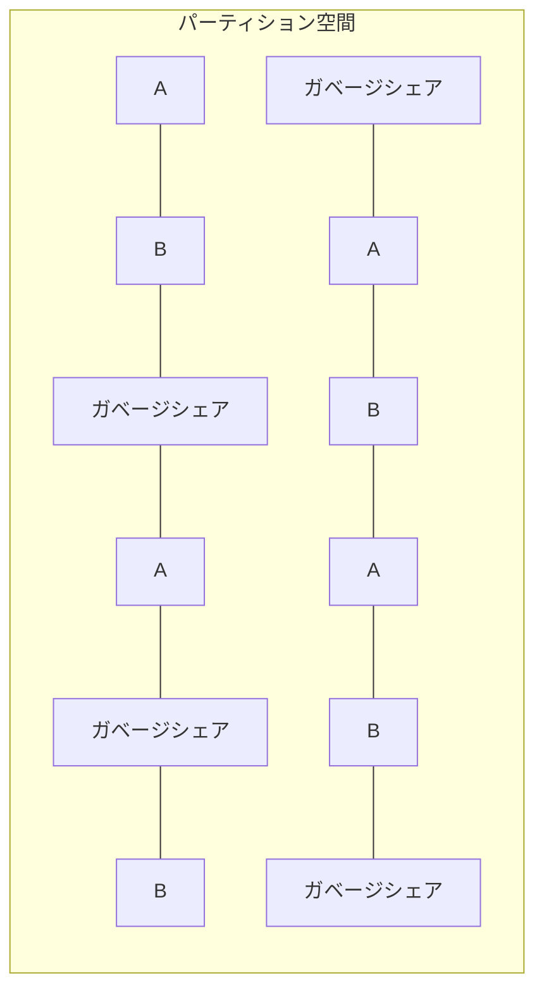

# シャミア秘密分散法による複数平文復号システム設計書

## 3. 詳細設計

### 3.1. 詳細設計の前提と用語

#### 3.1.1. 基本用語

- 暗号書庫 = `CryptoStorage`：システム全体が管理する暗号化データファイル
- 生成処理 = `createCryptoStorage`：暗号書庫の初期作成と構造確立を行う処理
- 更新処理 = `updateCryptoStorage`：暗号書庫への文書の暗号化と保存を行う処理
- 読取処理 = `readCryptoStorage`：暗号書庫からの文書の復号と取得を行う処理

#### 3.1.2. システムパラメータ

暗号書庫の構成を決定する重要なパラメータ群：

- `ACTIVE_SHARES`：各ファイル(A/B)用の有効シェア数（整数、共通値）
- `GARBAGE_SHARES`：各ファイル(A/B)用のガベージシェア数（整数、共通値）
- `PARTITION_SIZE`：各ファイル(A/B)用パーティション総サイズ（ACTIVE_SHARES + GARBAGE_SHARES）
- `UNASSIGNED_SHARES`：未割当シェア数（整数）、AB どちらにも所属しないガベージシェア
- `SHARE_ID_SPACE`：全シェア ID 空間（PARTITION_SIZE \* 2 + UNASSIGNED_SHARES）
- `BACKUP_RETENTION_DAYS`：バックアップ保持期間（日数）
- `CHUNK_SIZE`：チャンクサイズ（バイト単位、通常 64 バイト）

暗号書庫のパラメータはシステム構成ファイル `constants.py` で以下のように定義される：

```python
# ファイルパーティション設計
PARTITION_SIZE = 3500   # 各ファイル(A/B)用パーティション総サイズ（整数、共通値）
ACTIVE_SHARES = 2000    # 各ファイル(A/B)用有効シェア数（整数、共通値）
GARBAGE_SHARES = 1500   # 各ファイル(A/B)用ガベージシェア数（整数、共通値）

# 未割当領域
UNASSIGNED_SHARES = 3000     # ガベージシェア数（整数）

# 全体シェア数（自動計算）
SHARE_ID_SPACE = PARTITION_SIZE * 2 + UNASSIGNED_SHARES

# バックアップ設定
BACKUP_RETENTION_DAYS = 30  # バックアップファイル保持期間
```

#### 3.1.3. システムの責務範囲

本システムには以下の３つの明確な責務しか存在せず、その範囲外の全ての責務は利用者が負うものとする：

1. **暗号書庫生成（createCryptoStorage）**：初期暗号書庫ファイルの作成とパーティションマップキーの生成
2. **暗号書庫更新（updateCryptoStorage）**：指定されたパーティションマップキーとパスワードに基づく暗号書庫への書き込み
3. **暗号書庫読取（readCryptoStorage）**：指定されたパーティションマップキーとパスワードに基づく暗号書庫からの読み取り

これらの３つの責務の範囲外となる事項（パーティションマップキーの保管、パスワード管理、データバックアップ、入出力ファイルの取り扱いなど）は全て利用者の責任となる。本システムはその設計上、誤用や不適切な運用を検出または防止する機能を持たず、利用者の適切な使用に依存する。

### 3.2. パーティション空間設計

暗号書庫はパーティション空間と呼ばれる論理構造に基づいており、以下のような生成プロセスで設計される：

#### 3.2.1. パーティション空間の初期生成過程

1. システムパラメータ（`PARTITION_SIZE`、`ACTIVE_SHARES`、`GARBAGE_SHARES`、`UNASSIGNED_SHARES`）に基づいて、全体の`SHARE_ID_SPACE`を決定
2. 全シェア ID 空間をランダムに以下の 3 つの領域に分割：
   - A 用領域（`PARTITION_SIZE`分）
   - B 用領域（`PARTITION_SIZE`分）
   - 未割当領域（`UNASSIGNED_SHARES`分）
3. A 領域と B 領域を完全に分離・不可侵に設定（重複なし）
4. **上記で確定した A/B 領域の分布に基づいて**パーティションマップキー A/B を生成
5. パーティションマップキーは対応する領域の分布のみを復元可能、他方は復元不可能

このプロセスにより、パーティションマップキーは領域分布を特定するための鍵として機能するが、領域分布自体はパーティションマップキーの生成に先立って決定されることに注意が必要です。

#### 3.2.2. パーティション定義と整数値による明示化

- ファイル A/B それぞれに対して常に**完全に同一サイズ**のパーティション空間を割り当て
- 各パーティション領域は有効シェアとガベージシェアの混合で構成される
- シェア ID 空間の全体サイズは自動計算される（`SHARE_ID_SPACE = PARTITION_SIZE * 2 + UNASSIGNED_SHARES`）

#### 3.2.3. 分散配置の原則

- 連続範囲や単純なパターン（偶数/奇数など）は意図的に避ける
- ID 空間内のどの部分を切り取っても、A、B、ガベージシェアの識別が統計的に不可能となるよう設計
- ID 空間を小さなブロックに分割し、各ブロック内でランダムに割り当てる手法を採用



#### 3.2.4. 実装とアクセス方法

- パーティション空間全体は暗号書庫生成時に擬似乱数生成器を用いて一度だけ初期化
- 各 ID の割り当て（A、B、ガベージシェア）は暗号書庫内に直接保存せず、初期化時に生成されたパーティションマップキーから逆導出する
- 領域へのアクセスには段階ごとに異なる要素が必要：
  - **第 1 段階（領域特定）**：パーティションマップキー A または B を使用して候補となる`PARTITION_SIZE`分のシェア ID 空間を特定
  - **第 2 段階（有効シェア特定）**：第 1 段階で特定された領域内で、パスワードと`ACTIVE_SHARES`パラメータを用いて、実際にデータを含む`ACTIVE_SHARES`分のシェア ID を特定

#### 3.2.5. 有効シェア数と暗号化容量の関係

- 各ファイルが実際に使用できるのは`ACTIVE_SHARES`の数（例：2000 シェア）
- 最大データ容量 = `ACTIVE_SHARES × CHUNK_SIZE`（例：2000 × 64 バイト = 128KB の実データ容量）
- この制限を超えるデータは暗号化不可能（固定長シリアライズ処理で対応）

#### 3.2.6. パーティション空間の固定性

- パーティション空間は初期化時に確定し、以降はシステム運用中に容量変更が一切生じない
- 運用要件に応じてこれらの値を調整可能（初期化前に設定）
- シェア ID 空間サイズは暗号化可能なファイルサイズの上限を直接決定する

**例外: 破壊的更新**

- 暗号書庫に対して**関連のないパーティションマップキー**を用いて更新処理を行うと、そのパーティションマップキーに基づいて書庫構造が破壊的に変更される
- これは既存データの上書きを意味し、元のパーティションマップキーに対応するデータは取り出せなくなる
- このような操作はセキュリティモデル上は「許容事象」だが、データの破壊を伴うことに注意が必要

### 3.3. シャミア秘密分散法の実装

本システムで採用するシャミア秘密分散法の実装詳細：

#### 3.3.1. 多項式の次数とシェア数

- **全シェア使用方式の採用**：本システムでは閾値の概念を使用せず、常に全てのシェアを使用
- 復号に使用するシェアの数を n とすると、次数「n-1」の多項式を使用
- 確実な復号を保証するため、必ず全ての n 個のシェアを使用
- この設計は、潜在的なシェア選択攻撃を排除し、セキュリティを強化

#### 3.3.2. 有限体の選択

- 大きな素数`p`を用いた有限体 GF(p)上で計算
- 安全性と実用性のバランスを考慮し、十分な大きさの素数を採用（例：2^256-189 などの暗号学的に安全な素数）
- gmpy2 ライブラリの mpz（多倍長整数）型を使用することで、大きな素数上の演算を効率的に実装
- 選択理由:
  - 秘密情報の完全な情報論的安全性を確保（シャミア法の本質的特性）
  - 多項式補間において高精度かつ一意な計算結果を保証
  - 数学的特性を利用した攻撃への対策として必要十分な大きさを確保

#### 3.3.3. シェア生成アルゴリズム

- 秘密値から多項式を生成
- 多項式の係数には秘密値以外をランダムに生成
- 各シェア ID に対して多項式を評価し、対応するシェア値を得る
- シェア生成は決定論的手法ではなく、暗号論的に安全な乱数を使用

#### 3.3.4. シェア復元アルゴリズム

- ラグランジュ補間法を用いて複数のシェアから多項式を再構築
- x=0 における多項式の値（秘密値）を計算
- モジュラ逆数計算を含む有限体上の演算
- 実装には定数時間演算を採用し、タイミング攻撃に対する耐性を確保

### 3.4. 多段 MAP 方式の詳細設計

#### 3.4.1. 多段 MAP 方式の概念

多段 MAP 方式は本システムの核心技術であり、以下の 2 段階で構成される：

1. **第 1 段階（MAP 生成とパーティションマップキーの導出）**：

   - 暗号書庫生成時に、まず第 1 段階の MAP（シェア ID の分布）をランダムに生成
   - MAP の実態は単純な整数配列（例: `[1, 5, 8, 15, 29, 42, ...]`）であり、シェア ID を示す
   - 次に、その生成された分布から対応するパーティションマップキーを導出
   - パーティションマップキーは、この整数配列を**全文そのままのパスワード（生のパスワード）**で暗号化したものに他ならない
   - この順序は重要：先に分布が存在し、後からその分布を復元できるキーが作られる
   - 暗号書庫を生成するたびに異なる分布が作られる
   - この MAP により全シェア空間から復号の候補となるシェアの範囲を特定
   - この段階で不要なシェア（ガベージシェア）の大部分を除外可能
   - パーティション空間には有効シェアとガベージシェアが混在して配置される

2. **第 2 段階（パスワードによるマッピング）**：
   - パスワードから鍵導出関数を用いてマップデータを生成
   - 第 2 段階 MAP も整数配列（例: `[3, 7, 11, 22, ...]`）として表現される
   - 第 1 段階で特定された範囲内のシェアだけを対象にマッピングを適用
   - マッピング結果に基づき、実際に復号に使用するシェアを特定
   - このプロセスでガベージシェアを識別せずに有効シェアだけを効率的に選択
   - `ACTIVE_SHARES`パラメータにより、選択されるシェア数が決定される
   - **重要な特性**：第 2 段階 MAP は暗号書庫の構造から完全に独立している
     - 同じパスワードは常に同じ相対的マッピングパターンを生成する
     - しかし、異なる第 1 段階 MAPs（異なる暗号書庫）では、同じパスワードでも選択される実際のシェア ID は全く異なる
     - この特性により、暗号書庫ごとの独立したセキュリティが保証され、書庫間の相関攻撃を防止する

※注: 第 2 段階 MAP 生成はパスワード、第 1 段階で特定されたシェア候補、および`ACTIVE_SHARES`の３つの入力に依存します。第 2 段階 MAP は常に一定数（`ACTIVE_SHARES`個）のシェアを選択するため、これらの 3 つの要素が同じであれば、常に同じシェアが選択される決定論的な特性を持ちます。

#### 3.4.2. 第 1 段階 MAP の実装と順序

- **生成順序**：
  1. 初期化時に、まず第 1 段階の MAP（シェア ID の分布）をランダムに生成
  2. 次に、この生成された分布からパーティションマップキーを逆導出
  3. パーティションマップキーは対応するファイルの分布を復元するための鍵として機能
- **復元プロセス**：
  - 復号や更新時には、パーティションマップキーから第 1 段階 MAP を再構築
  - 再構築された MAP はパーティション空間内での有効なシェア ID 候補を決定論的に特定
  - 第 1 段階 MAP は常に一定数（`PARTITION_SIZE`分）のシェア ID を選択
  - 同じパーティションマップキーからは常に同じシェア ID セットが特定される

#### 3.4.3. 第 2 段階 MAP の実装と書庫独立性

- **基本実装**：

  - 第 2 段階 MAP 生成のために使用される**処理されたパスワード**は同一文字長となるよう暗号化（ハッシュ）処理を適用する（**注意：第 2 段階 MAP 生成には必ず処理されたパスワードを使用し、生のパスワードを誤って使用してはならない**）
  - パスワード、ソルト値、および`ACTIVE_SHARES`値からキー導出関数（KDF）を用いて鍵材料を導出
  - その導出された鍵材料を用いて、第 1 段階で特定された候補シェア ID（`PARTITION_SIZE`分）に対してマッピング値を生成
  - 生成されたマッピング値に基づいて、`PARTITION_SIZE`個のシェア候補から`ACTIVE_SHARES`個のシェアを選択

- **書庫独立性の実現**：

  - 第 2 段階 MAP のアルゴリズムは**意図的に**暗号書庫の内容や構造を参照しない設計
  - 同じパスワードは常に同じ相対的マッピングパターン（選択手法）を生成する
  - このマッピングパターンは第 1 段階 MAP 内での相対的な位置選択として機能する
  - 暗号書庫ごとに第 1 段階 MAP が完全に異なるため、同じパスワードを使用しても異なる書庫では異なるシェア ID が選択される
  - この特性により、複数の暗号書庫間での相関分析攻撃を防止し、各書庫の独立したセキュリティを保証

- **決定論的特性**：
  - 同じパスワード・ソルト・シェア ID 候補の組み合わせからは常に同じマッピング値が生成される
  - これにより、正しいパスワードとパーティションマップキーの組み合わせであれば、常に正しいデータを復元可能

#### 3.4.4. シェア選択と配置プロセス

- 暗号化前にファイル長を厳密に必要な容量となる様に定量化し、必要数に過不足なく適合させる
- 第 1 段階 MAP で候補シェア ID 全て（`PARTITION_SIZE`分）を選定
- 第 2 段階 MAP で実際に使用するシェア位置（`ACTIVE_SHARES`分）を特定
- **ファイル暗号化上限**: データ容量（バイト単位）≦ `ACTIVE_SHARES × CHUNK_SIZE`
- **第 2 段階 MAP の全ての位置への有効データ配置**: 復号に必要な全位置に有効なシェアを配置
- 暗号化前にデータサイズチェックを実施し、容量上限を超える場合は処理を中止
- 第 1 段階 MAP で選択されたが第 2 段階 MAP で選択されなかったシェア位置（`GARBAGE_SHARES`分）にはガベージシェアを配置
- 処理は直線的に行われ、タイミング攻撃に対する耐性を確保

#### 3.4.5. 容量制限と最適化

- 暗号化可能な JSON 文書のサイズには固定上限がある
- 上限値は`ACTIVE_SHARES`とチャンクサイズに依存
- 容量検証は「上限を超えるか否か」の単一条件のみとし、条件分岐を最小化
- 適切なパディング処理により、データサイズが常に必要なサイズに調整される

### 3.5. 共通技術要素

#### 3.5.1. 固定サイズ制約の重要性

シェア生成と配置における固定サイズ制約は、システムの安全性と堅牢性にとって極めて重要である:

1. **区別不能性の確保**:

   - 全てのデータ（実データとガベージシェアを含む）が固定サイズ 64 バイトで処理されることで、統計的・構造的区別が不可能になる
   - チャンクサイズに変動を持たせることは、統計的特徴から実データとガベージシェアの区別が可能になる為禁止

2. **容量制限の明確化**:

   - シェア ID 空間サイズとチャンクサイズから、暗号化可能な最大データ量が明確に定義される
   - システム設計者は容量要件に基づいて、適切な`ACTIVE_SHARES`や`PARTITION_SIZE`を設定可能

3. **運用上の安定性**:
   - 処理パターンが一定であることで、予測可能なパフォーマンスと安定した運用が実現する
   - エラー処理が簡素化され、例外状況の発生を最小限に抑えられる

#### 3.5.2. 暗号化ファイルの構造

暗号化ファイルの中身を平文で表現すると、以下のように単純な数値の羅列だけです：

```python
# 暗号化ファイルの内容（平文で表現した場合）
crypto_storage_content = [
    '43168234226065444066188128433421335992812488068053585868021789200038419124861',
    '39671430685010593424464720438234087121177376061253062203012873568344818805373',
    '29774227254461834571706120786392033520717356668536063492001476579431431520419',
    # ... 他の多数の大きな整数値
]
```

これらの大きな整数値はシェアを表し、特定の順序で並ぶだけです。データを取り出すには、パーティションマップキーとパスワードから生成される第 1 段階 MAP・第 2 段階 MAP を使って、どの整数を取り出せばよいかを特定します。

特徴:

- チャンクデータだけが並び、識別情報や関連付け情報は一切含まれない
- 全てのチャンクは外見上区別できず、統計的に同一の分布を持つ
- シェアの所属（A/B/未割当）を示す情報は一切含まれない
- 有効シェアとガベージシェアが統計的に区別できないように設計されている
- チャンク識別子や順序情報も含まれない
- 全ての識別と復号はパーティションマップキーとパスワード、システムパラメータの組み合わせのみで行われる
- システム初期化時は全シェア空間がガベージシェアで埋められ、暗号化時に必要な部分のみが有効シェアに置き換えられる

#### 3.5.3. 未割当領域のセキュリティ強化

ガベージシェア領域がもたらすセキュリティ強化：

1. **統計的攻撃の難化**：

   - 攻撃者がファイル全体の 20-40%を無視できない
   - パターン認識による攻撃が困難になる

2. **空間分離による安全性担保**：

   - ファイル A/B 間の空間的分離を強化し、相互干渉を防止
   - 統計的相関分析に対する耐性を向上
   - 注：この未割当領域は意図的に「何もしない」ことでセキュリティを高めており、ここに追加機能を実装することは設計思想に反する

3. **セキュリティにおける逆説的責務**：
   - この領域は「何もしない、何の役にも立たない」ことがその本質的な責務である
   - この「無用性」が全体システムのセキュリティを高める重要な要素となる
   - システムの進化においても、この領域は常に「無目的」であり続けることがセキュリティモデルの一貫性を保証する

### 3.6. ケルクホフの原理に基づく設計

本システムは、ケルクホフの原理に厳格に従い、システムのセキュリティがアルゴリズムの秘匿ではなくキー（パスワード）の秘匿のみに依存するよう設計されている。

#### 3.6.0. 書庫独立性によるセキュリティ強化

本システムでは、以下の書庫独立性の原則により、複数の暗号書庫間でのセキュリティを保証している：

- **相対マッピングと絶対位置の分離**：

  - パスワードから生成される第 2 段階 MAP は「相対的なマッピングパターン」のみを定義
  - このパターンが第 1 段階 MAP（書庫固有）に適用されることで、最終的な「絶対位置」が決定
  - 同じパスワードでも異なる暗号書庫では全く異なるシェアが選択される

- **統計的相関性の排除**：

  - 暗号書庫の生成ごとに完全に独立した第 1 段階 MAP を生成
  - 複数の暗号書庫間で有意な相関を示す特徴が存在しないよう設計
  - これにより、一方の暗号書庫から得られた情報を他方に適用する攻撃を防止

- **アルゴリズム公開の安全性**：
  - 第 2 段階 MAP の生成アルゴリズムが公開されていても、第 1 段階 MAP が暗号書庫ごとに独立しているため、その知識だけでは攻撃に利用できない
  - この設計がケルクホフの原理に合致し、アルゴリズム秘匿に依存せずセキュリティを確保

#### 3.6.1. 更新処理における許容事象

更新処理において正常な振る舞いとして許容される事象：

- 全く関連のない暗号書庫を、関連のないパスワードで上書きして破壊する
- 間違ったパスワードを使用して、異なる MAP で既存データを上書きする
- 同じ暗号書庫内で A のデータを B のデータで上書きする
- 空（未使用）の領域をデータで上書きする
- 既に使用済みの領域を新たなデータで上書きする

これらの事象は、暗号システムとしては正常な振る舞いであり、エラーや例外として扱うべきではない。

#### 3.6.2. 読取処理における許容事象

読取処理において正常な振る舞いとして許容される事象：

- 間違ったパスワードで読み取りを試み、無意味なデータを取得する
- 存在しないデータ領域の読み取りを試み、ガベージシェアを取得する
- A のパスワードを使って B のデータ領域にアクセスを試みる
- 一部破損した暗号書庫から部分的なデータを読み取ろうとする
- 異なるバージョンの暗号書庫を旧バージョンのアルゴリズムで読み取ろうとする

これらの事象は、暗号システムとしては正常な振る舞いであり、エラーや例外として扱うべきではない。秘密はアルゴリズムではなく、適切なパスワードとパーティションマップキーの組み合わせにのみ依存する。

### 3.7. 処理フローの詳細設計

#### 3.7.1. 暗号書庫生成（createCryptoStorage）の詳細フロー

1. 全シェア空間にガベージシェアを配置し、統計的区別不可能性の基盤を確立
2. 全シェア ID 空間（`SHARE_ID_SPACE`）をランダムに 3 区画に分割
   - A 用パーティション（`PARTITION_SIZE`分の ID 領域）
   - B 用パーティション（`PARTITION_SIZE`分の ID 領域）
   - 未割当領域（`UNASSIGNED_SHARES`分の ID 領域）
3. 各パーティション領域がお互いに重複しないよう確保
4. **上記で確定した A/B 領域の分布に基づいて**パーティションマップキーを導出
   - このプロセスは重要：先に領域分布が決定され、後からその分布を復元するためのキーが生成される
   - 各パーティションマップキーは対応する領域の ID マッピングのみを復元可能
   - パーティションマップキーは分布を特定するための逆変換機能を持つ
5. UUID ベースの暗号書庫ファイル名を生成（タイムスタンプを含まない）し、情報漏洩を防止
6. ガベージシェアで満たされた状態の暗号書庫ファイルを作成

#### 3.7.2. 暗号書庫更新（updateCryptoStorage）の詳細フロー

1. 安全性前処理:

   - 暗号書庫ファイル（オリジナル）を一時的にバックアップとして複製（UUID 付加）
   - 更新処理状態を示すロックファイルの生成（処理中であることを示す）
   - バックアップ保持期間（`BACKUP_RETENTION_DAYS`）を超過した古いバックアップの削除

2. MAP 生成処理:

   - パーティションマップキーから第 1 段階 MAP を再生成
   - 第 1 段階 MAP とパスワードから第 2 段階 MAP を生成（`ACTIVE_SHARES`分の ID を選択）
   - **書庫独立性の適用**: パスワードから生成される相対的マッピングパターンはどの暗号書庫でも同じだが、第 1 段階 MAP（書庫固有）に適用されることで、選択されるシェア ID は書庫ごとに完全に異なる結果となる

3. データフロー処理:

   - JSON データのサイズが容量制限内であることを検証
   - 多段エンコードプロセス（UTF-8→Latin-1→Base64→ 固定長シリアライズ）
   - 平文データをチャンク分割（64 バイト固定長、合計で正確に`ACTIVE_SHARES`個）
   - 各チャンクにシャミア法を適用して`ACTIVE_SHARES`個のシェアを生成
   - 生成したシェアを第 2 段階 MAP で特定した位置に配置
   - 第 1 段階 MAP で選択されたが第 2 段階 MAP で選択されなかった位置にガベージシェアを配置

4. 安全性後処理:
   - 処理が正常に完了した場合：ロックファイルを削除
   - 処理が異常終了した場合：複製した暗号書庫ファイルをオリジナルに復元

#### 3.7.3. 暗号書庫読取（readCryptoStorage）の詳細フロー

1. MAP 生成処理:

   - パーティションマップキーから第 1 段階 MAP を再生成
   - 第 1 段階 MAP とパスワードから第 2 段階 MAP を生成（`ACTIVE_SHARES`分の ID を特定）
   - **書庫独立性の適用**: パスワードは暗号書庫の構造と独立した相対的マッピングを生成し、これが第 1 段階 MAP に適用されることで、書庫固有の絶対シェア ID 選択へと変換される

2. データフロー処理（復号過程）:

   - 第 2 段階 MAP に基づいてシェアを選択
   - 選択されたシェアにシャミア法の逆適用を行いチャンクを復元
   - 復元されたチャンクを結合して平文データを取得
   - 多段デコードプロセス（固定長デシリアライズ →Base64 デコード →Latin-1→UTF-8）
   - JSON データを復元

3. 出力処理:
   - 復号された UTF-8 エンコードの JSON ファイルを返却（成功時）
   - 復号が失敗しても例外を発生させず、得られたデータをそのまま返却（失敗時）
