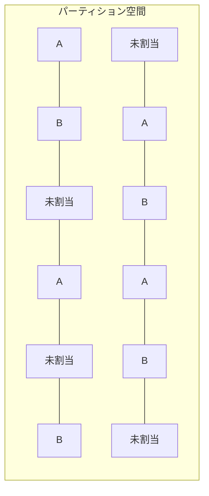

# シャミア秘密分散法による複数平文復号システム設計書

## 3. 詳細設計

### 3.1. パーティション空間設計

パーティション空間は以下のように設計する：

1. **分割比率**：

   - A ユーザー用：30-40%
   - B ユーザー用：30-40%
   - 未割当領域：20-40%

2. **分散配置**：

   - 連続範囲や単純なパターン（偶数/奇数など）を避ける
   - ID 空間内のどの部分を切り取っても、A、B、未割当の識別が統計的に不可能
   - 例えば、ID 空間を小さなブロックに分割し、各ブロック内でランダムに割り当て

3. **実装方法**：

   - パーティション空間全体を擬似乱数生成器を用いて初期化
   - 各 ID の割り当て（A、B、未割当）は直接保存せず、パスワード A と B およびパーティションマップキー A、パーティションマップキー B から導出
   - 割り当て判別には以下の 4 要素全てが必要：
     1. パスワード A
     2. パスワード B
     3. パーティションマップキー A
     4. パーティションマップキー B
   - 任意の要素が一つでも欠けると、どの ID がどの文書に割り当てられているか判別不能

4. **パーティションマップキーの形式**：
   - パーティションマップキーは `9jfhsyenehgr6hkwhjyhbweey6d` のような単一行の文字列
   - この文字列から暗号学的ハッシュ関数によって毎回同じ MAP が決定論的に生成される
   - 同じパーティションマップキーを使用すれば、同じシェア候補の特定が可能になる MAP が生成される（文書の復元にはパスワードも必要）
   - セキュリティは「パーティションマップキー」と「パスワード」の 2 要素に依存



### 3.2. シャミア秘密分散法の実装

基本的なシャミア秘密分散法を拡張して実装する：

1. **多項式の次数とシェア数**：

   - 閾値を`t`とすると、次数`t-1`の多項式を使用
   - 必要シェア数は閾値`t`個
   - 実用的な値として、`t=3`～`5`を推奨

2. **有限体の選択**：

   - 大きな素数`p`を用いた有限体 GF(p)上で計算
   - 暗号学的安全性を確保するため、メルセンヌ素数を使用
     - 標準的実装向け: 2^127-1 (約 1.7 × 10^38)
     - 高度な安全性向け: 2^521-1 (約 6.9 × 10^156)
   - 実装上の利点：高速なモジュロ演算、効率的なビット操作による最適化が可能

3. **シェア生成アルゴリズム**：

```python
def generate_polynomial(secret, degree, p):
    """degree次の多項式を生成"""
    coef = [secret]
    for i in range(degree):
        coef.append(random.randint(1, p-1))
    return coef

def evaluate_polynomial(coef, x, p):
    """多項式の評価"""
    result = 0
    for i in range(len(coef)):
        result = (result + coef[i] * pow(x, i, p)) % p
    return result

def generate_shares(secret, t, n, p):
    """n個のシェアを生成、閾値はt"""
    coef = generate_polynomial(secret, t-1, p)
    shares = []
    for i in range(1, n+1):
        shares.append((i, evaluate_polynomial(coef, i, p)))
    return shares
```

4. **シェア復元アルゴリズム**：

```python
def lagrange_interpolation(shares, p):
    """ラグランジュ補間によるシークレット復元"""
    secret = 0
    for i, share_i in enumerate(shares):
        x_i, y_i = share_i
        numerator = denominator = 1
        for j, share_j in enumerate(shares):
            if i != j:
                x_j, y_j = share_j
                numerator = (numerator * (0 - x_j)) % p
                denominator = (denominator * (x_i - x_j)) % p
        lagrange_coefficient = (numerator * pow(denominator, p-2, p)) % p
        secret = (secret + y_i * lagrange_coefficient) % p
    return secret
```

### 3.3. 多段 MAP の実装

多段 MAP は以下のように実装する：

1. **第 1 段階 MAP（パーティションマップキー）**：
   - パーティションマップキーはユーザーに初期化時に割り当てられる
   - パーティションマップキーから第 1 段階 MAP を生成

```python
def stage1_map(share_ids):
    """パーティションマップキーによる第1段階MAP生成"""
    # パーティションマップキーをそのまま返す（MAPとして機能）
    return set(share_ids)
```

2. **第 2 段階 MAP（パスワード）**：
   - パスワードから KDF を用いてマップデータを生成
   - このマップは選択的なシェア識別に使用

```python
def stage2_map(password, candidate_ids, salt):
    """パスワードによる第2段階MAP生成
    candidate_ids: 第1段階で特定されたパーティションマップキーで得られるID
    """
    # パスワードからキーを導出
    key = kdf(password, salt, iterations=100000, length=32)

    # キーを用いて各パーティションマップキーに対応するインデックスを生成
    mapping = {}
    for share_id in candidate_ids:  # 第1段階で特定されたIDのみ処理
        # 決定論的にマッピング値を生成
        h = hmac.new(key, str(share_id).encode(), 'sha256')
        mapping[share_id] = int.from_bytes(h.digest(), 'big')

    return mapping
```

3. **シェア選択**：
   - 2 段階のマップを組み合わせて最終的なシェアセットを選択

```python
def select_shares(all_shares, share_ids, password, salt, threshold):
    """多段MAPを用いたシェア選択"""
    # 第1段階：パーティションマップキーによるMAP生成
    candidate_ids = stage1_map(share_ids)

    # 第1段階の結果から候補シェアを取得
    candidate_shares = [share for share in all_shares if share[0] in candidate_ids]

    # 第2段階：パスワードによるマッピング
    mappings = stage2_map(password, candidate_ids, salt)

    # マッピング値でソート
    sorted_shares = sorted(candidate_shares, key=lambda s: mappings[s[0]])

    # 閾値分のシェアを選択（常に同じ数を処理）
    selected_shares = sorted_shares[:threshold]

    # シェア数が不足している場合もエラーを出さず処理（結果は不正確になる）
    return selected_shares
```
