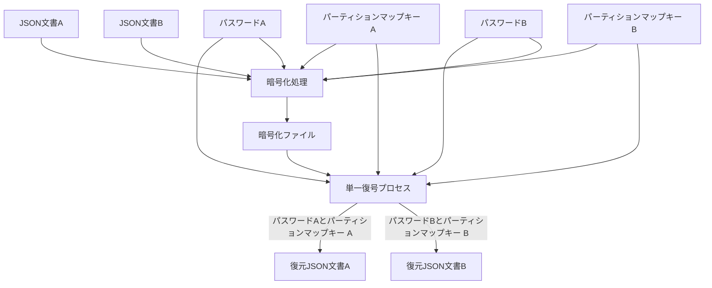
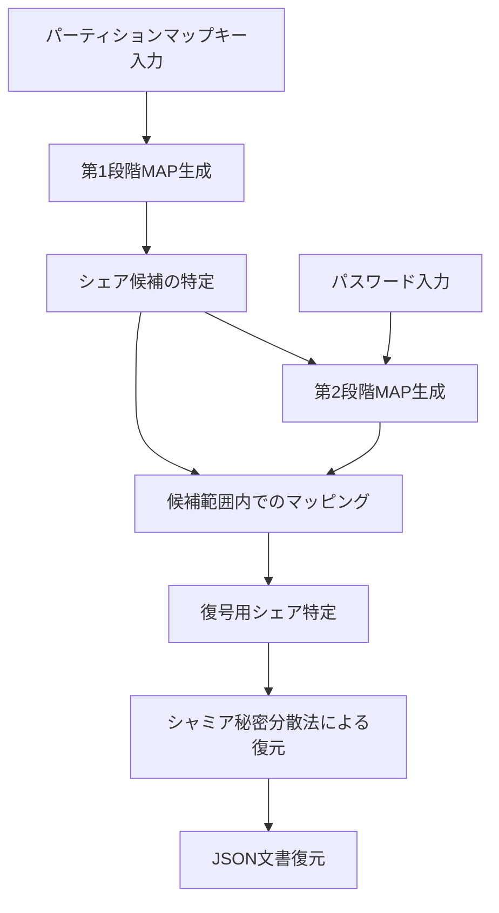
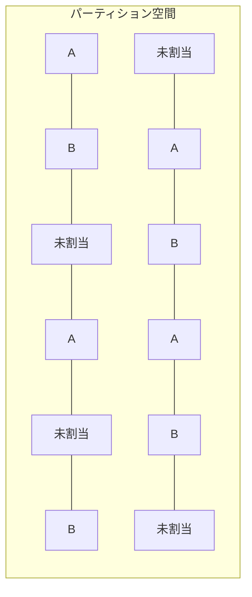

# シャミア秘密分散法による複数平文復号システム設計書

## 0. 用語集

本設計書で使用される重要な用語と概念の定義を以下に示す：

### 0.1. 基本用語

| 用語                               | 定義                                                                                                                                                                                      |
| ---------------------------------- | ----------------------------------------------------------------------------------------------------------------------------------------------------------------------------------------- |
| **シャミア秘密分散法**             | Adi Shamir が考案した閾値暗号の一種。秘密情報を複数の「シェア」に分散し、一定数（閾値）以上のシェアが集まると元の情報を復元できるが、閾値未満では全く情報を得られない技術。               |
| **閾値（threshold）**              | 秘密情報を復元するために必要なシェアの最小数。例えば閾値 3 の場合、3 つ以上のシェアがあれば復元可能だが、2 つ以下では一切復元できない。                                                   |
| **シェア（share）**                | シャミア秘密分散法によって生成される、秘密情報の断片。各シェアは（ID, 値）のペアで構成される。                                                                                            |
| **チャンク（chunk）**              | 暗号化する前のデータを固定長の小さな断片に分割したもの。各チャンクに対してシャミア秘密分散法を適用する。                                                                                  |
| **パーティション空間**             | システム内で使用されるシェア ID の全体集合。A 用、B 用、未割当ての 3 種類に分割される。                                                                                                   |
| **MAP（マップ）**                  | 混在するシェア群の中から、必要なシェアを特定するための対応表または関数。特定の文書を復号する際に必要なシェアを選別するために使用される。単純な整数配列（例: [1,3,5,8]）として実装される。 |
| **パーティション分布（領域分布）** | シェア ID の総集合を A 用、B 用、未割当ての 3 つの領域に分ける具体的な分配のこと。実際には単純な整数配列として表現される。                                                                |

### 0.2. 本システム特有の用語

| 用語                         | 定義                                                                                                                                                                                                                        |
| ---------------------------- | --------------------------------------------------------------------------------------------------------------------------------------------------------------------------------------------------------------------------- |
| **パーティションマップキー** | ユーザーが保持する文字列で、特定の範囲のシェア ID を特定するためのキー。例：「A 用パーティションマップキー」で「A 用シェア」の ID セットを特定できる。単なる ID の集合ではなく、ID を特定するための元データとして機能する。 |
| **多段 MAP 方式**            | 本システムの核心技術。パーティションマップキーによる第 1 段階 MAP とパスワードによる第 2 段階 MAP を組み合わせて、必要なシェアを特定する方式。                                                                              |
| **第 1 段階 MAP**            | パーティションマップキーから生成される MAP。全シェア空間から復号に必要な候補シェアの範囲を特定する。                                                                                                                        |
| **第 2 段階 MAP**            | パスワードから生成される MAP。第 1 段階で特定された候補シェアの中から、実際に復号に使用するシェアを選別する。                                                                                                               |
| **統計的区別不可能性**       | 暗号ファイル内の異なる文書（A/B）のシェアや未割当領域のシェアが統計的に区別できない性質。外部観察者がどのシェアがどの文書に属するか識別できないことを保証する。                                                             |
| **直線的処理**               | 復号処理の途中で条件分岐や評価を含まず、同一のコードパスを通り抜ける処理方式。タイミング攻撃やサイドチャネル攻撃への耐性を持つ。                                                                                            |

### 0.3. データ構造と実装関連用語

| 用語               | 定義                                                                                                                                                                                                                                                                  |
| ------------------ | --------------------------------------------------------------------------------------------------------------------------------------------------------------------------------------------------------------------------------------------------------------------- |
| **メタデータ**     | 暗号化ファイルに保存される最小限の構成情報。具体的には以下の 3 つの情報のみを含む：<br>1. 閾値（threshold）：シェア復元に必要な最小シェア数<br>2. ソルト値（salt）：第 2 段階 MAP を生成するための乱数値<br>3. 総チャンク数（total_chunks）：元データの分割チャンク数 |
| **ガベージシェア** | 未割当領域に配置される無意味なデータ。有効なシェアと統計的に区別できない形式で生成され、セキュリティ強化と将来の拡張性確保に役立つ。                                                                                                                                  |
| **一時ファイル**   | 更新処理中に使用される中間ファイル。シャミア秘密分散法で暗号化され、処理完了時に削除される。                                                                                                                                                                          |

# シャミア秘密分散法による複数平文復号システム設計書

## 1. 概要

本設計書では、シャミア秘密分散法を応用した「複数平文復号システム」の詳細設計を提供する。このシステムは単一の暗号化ファイルから異なるパスワードを使用して異なる平文（JSON 文書）を復号可能にするもので、「パーティションマップキーによる MAP 生成とパスワードによるマップ生成」という多段 MAP 方式を核心とする。

本システムの設計はケルクホフの原理に厳格に従い、アルゴリズムが完全に公開されてもパスワード（鍵）が秘匿されている限りセキュリティが保たれる。

# シャミア秘密分散法による複数平文復号システム設計書

## 4. 実装詳細

### 4.1. 暗号化プロセス

暗号化プロセスは以下の手順で行う：

1. **前処理**：

   - JSON 文書は最初から UTF-8 形式
   - 多段エンコードプロセスを適用：
     1. UTF-8 テキスト（元の JSON）
     2. Latin-1 へのエンコード変換
     3. Base64 エンコード
   - この多段エンコードにより、復号プロセスの堅牢性を確保
   - データを常に圧縮（条件判断なし）

2. **シェア生成**：

   - エンコードされたデータをチャンクに分割
   - 各チャンクをシャミア秘密分散法でシェア化
   - **推奨チャンクサイズ**: 64 バイト（512 ビット）
     - 選定理由: 暗号学的安全性とパフォーマンスのバランスが取れたサイズ
     - 小さすぎるチャンクサイズはオーバーヘッドが大きく、大きすぎるとメモリ効率が悪化
     - 64 バイトはモダン CPU のキャッシュラインサイズに合致し、効率的な処理が可能

3. **パーティションマップキーの使用**：

   - パーティションマップキーの割り当ては初期化時にのみ行われる
   - 暗号化時には既に割り当て済みのパーティションマップキーを使用するだけ
   - パーティションマップキー + パスワード + 文書の 3 つの情報のみで暗号化が完結
   - どのシェアが何に対応するかの判定は一切不要

4. **出力と永続化**：
   - シャミア秘密分散法によって生成されたシェア値のみを保存
   - 塩値は復号に必要なため保存（再計算不可能な乱数値）
   - パーティションマップキーはユーザー入力として提供されるため保存不要
   - マッピング情報はパスワードとパーティションマップキーから計算で再生成可能なため保存不要
   - 閾値など暗号設定のみ最小限のメタデータとして保存
   - 保存データは全て A/B 区別なく単一のフォーマットで格納（文書の種類を識別する情報を含まない）

```python
def encrypt(json_doc, password, share_token, unassigned_ids):
    """単一JSON文書の暗号化（A/B判定なし）"""
    # データの前処理
    data = json.dumps(json_doc).encode('utf-8')

    # 多段エンコード適用
    data_latin = data.decode('utf-8').encode('latin-1')
    data_base64 = base64.b64encode(data_latin)

    # データを固定長チャンクに分割
    chunks = split_into_chunks(data_base64)

    # 各チャンクをシェア化
    all_shares = []
    threshold = 3  # 例として閾値3を使用

    # シェア生成（対象がAかBかを区別せず処理）
    for i, chunk in enumerate(chunks):
        secret = int.from_bytes(chunk, 'big')
        chunk_shares = generate_chunk_shares(secret, threshold, share_ids)
        for share_id, value in chunk_shares:
            all_shares.append({
                'chunk_index': i,
                'share_id': share_id,
                'value': value
            })

    # 未割当領域にゴミデータを生成
    garbage_shares = generate_garbage_shares(unassigned_ids, len(all_shares))
    all_shares.extend(garbage_shares)

    # シェアをシャッフル（順序による情報漏洩を防ぐ）
    random.shuffle(all_shares)

    # メタデータを追加
    metadata = {
        'salt': generate_salt(),
        'total_chunks': len(chunks),
        'threshold': threshold
    }

    # 暗号化ファイルの生成
    encrypted_file = {
        'metadata': metadata,
        'shares': all_shares
    }

    return encrypted_file
```

```python
def split_into_chunks(data, chunk_size=64):
    """データを一定サイズのチャンクに分割

    Args:
        data: 分割対象のバイトデータ
        chunk_size: チャンクサイズ (デフォルト: 64バイト)

    Returns:
        チャンクのリスト
    """
    chunks = []
    for i in range(0, len(data), chunk_size):
        chunk = data[i:i+chunk_size]
        # 最後のチャンクが不完全な場合はパディング
        if len(chunk) < chunk_size:
            chunk = chunk.ljust(chunk_size, b'\0')
        chunks.append(chunk)
    return chunks
```

### 4.2. 復号プロセス

復号プロセスは以下の手順で行う：

1. **入力処理**：

   - パーティションマップキーとパスワードを受け取る
   - 暗号化ファイルを読み込む

2. **多段 MAP 処理**：

   - パーティションマップキーによる第 1 段階 MAP 生成
   - パスワードによる第 2 段階 MAP 生成
   - シェアの選択

3. **秘密復元**：

   - 選択されたシェアを用いてシャミア秘密分散法で秘密を復元
   - チャンクを結合して元のデータを復元

4. **後処理（多段デコード）**：
   - 圧縮データの解凍
   - Base64 デコード
   - Latin-1 から UTF-8 へのエンコード変換
   - UTF-8 テキストから JSON への解析

```python
def decrypt(encrypted_file, share_ids, password):
    """暗号化ファイルの復号（A/B判定なし）"""
    # メタデータ取得
    metadata = encrypted_file['metadata']
    threshold = metadata['threshold']
    all_shares = encrypted_file['shares']
    salt = metadata['salt']

    # 多段MAPの適用で復号処理（判定なしの直線的処理）
    result = try_decrypt(all_shares, share_ids, password, salt, threshold)

    # 復号データを返却（判定なし）
    try:
        # 多段デコード処理
        base64_decoded = base64.b64decode(result)
        latin_decoded = base64_decoded.decode('latin-1').encode('utf-8')
        json_text = latin_decoded.decode('utf-8')
        # JSON解析
        json_doc = json.loads(json_text)
        return json_doc
    except:
        # 失敗した場合でもエラーとせずに結果を返す
        return result
```

```python
def try_decrypt(all_shares, share_ids, password, salt, threshold):
    """シェアを復号（A/B判定なしの直線的処理）"""
    # 多段MAPの適用
    # 第1段階：パーティションマップキーによるMAP生成
    candidate_shares = [s for s in all_shares if s['share_id'] in share_ids]

    # 第2段階：パスワードによるマッピング
    mapping = stage2_map(password, [s['share_id'] for s in candidate_shares], salt)

    # チャンク別にシェアを整理
    chunks = {}
    for share in candidate_shares:
        chunk_idx = share['chunk_index']
        if chunk_idx not in chunks:
            chunks[chunk_idx] = []
        chunks[chunk_idx].append((share['share_id'], share['value']))

    # 各チャンクを復元（判定なしの直線的処理）
    reconstructed_data = bytearray()
    chunk_indices = sorted(chunks.keys())

    for idx in chunk_indices:
        # 各チャンクのシェアをマッピング値でソート
        sorted_shares = sorted(chunks[idx], key=lambda s: mapping[s[0]])

        # 閾値分のシェアを選択
        selected_shares = sorted_shares[:threshold]

        # シャミア秘密分散法による復元
        if len(selected_shares) >= threshold:
            secret = lagrange_interpolation(selected_shares, PRIME)
            chunk_bytes = secret.to_bytes((secret.bit_length() + 7) // 8, 'big')
            reconstructed_data.extend(chunk_bytes)

    # 復元データを返却
    return reconstructed_data
```

### 4.3. 更新プロセス

更新プロセスは以下の手順で行う：

1. **一時作業領域の確保**：

   - 更新用の一時ファイルを別途生成し、UUID を付与して一意性を確保
   - 一時ファイルはシャミア秘密分散法で暗号化し、ユーザーのパスワードで MAP を生成
   - ロックファイルを作成して実行中プロセスを明示（ファイル名に UUID 含む）
   - ロックファイル内にプロセス ID (PID) とタイムスタンプを記録
   - 処理開始時に既存の一時ファイルをスキャン：
     - プロセス ID が存在しない（終了済み）場合のみ削除
     - タイムスタンプが閾値を超過（タイムアウト）したファイルも削除
   - 処理完了時に自プロセスの一時ファイルとロックファイルを確実に削除
   - 例外発生時にもロックの解放と一時ファイルの削除を実行
   - 複数プロセスの並列実行に対応し、相互干渉を防止

2. **新シェアの生成**：

   - 新しい JSON 文書から新しいシェアを生成
   - 元のシェアセットと同様の構造で生成

3. **検証と適用**：

   - 生成された新シェアが正しく復号可能か検証
   - 検証成功後、対象パーティションマップキーの範囲内でのみ更新適用

4. **古いシェアの破棄**：
   - 更新成功後、古いシェアを確実に破棄

### 4.4. 一時ファイル暗号化強度のバランス

一時ファイルの暗号化強度は、メインファイルのセキュリティレベルと処理効率のバランスが重要な検討課題である：

1. **暗号化強度の選択肢**：

   - **最高レベル（メインファイルと同等）**: メインファイルと同じシャミア秘密分散法＋ AES-GCM
   - **中間レベル**: シャミア秘密分散法を省略し、AES-GCM のみで保護
   - **最小レベル**: メモリ内処理のみでディスク書き込みを回避

2. **トレードオフ比較**：

   | セキュリティレベル | 処理速度 | メモリ使用量 | ディスク使用量 | 実装複雑性 |
   | ------------------ | -------- | ------------ | -------------- | ---------- |
   | 最高レベル         | 低       | 中           | 大             | 高         |
   | 中間レベル         | 中       | 中           | 中             | 中         |
   | 最小レベル         | 高       | 大           | なし           | 低         |

3. **推奨アプローチ**：

   - 小～中サイズのファイル（～ 10MB）: **最小レベル**（メモリ内処理）
   - 大きいファイル（10MB ～ 100MB）: **中間レベル**（AES-GCM のみ）
   - 巨大ファイル（100MB ～）: **最高レベル**（シャミア＋ AES-GCM）

4. **適応型実装の例**：

   ```python
   def secure_temp_storage(data, password, file_size):
       """ファイルサイズに応じた適応型一時ストレージ"""
       if file_size < 10 * 1024 * 1024:  # 10MB未満
           # メモリ内処理のみ
           return MemoryTempStorage(data, password)
       elif file_size < 100 * 1024 * 1024:  # 10MB～100MB
           # AES-GCMのみで暗号化
           return AesGcmTempStorage(data, password)
       else:  # 100MB以上
           # シャミア法+AES-GCMで完全保護
           return ShamirAesGcmTempStorage(data, password)
   ```

5. **その他の考慮事項**:
   - 処理タイムアウトの実装（長時間実行による露出リスク低減）
   - 一時ファイルのバージョン管理（複数プロセスの並行実行対応）
   - エラー状態の保存（停電などでの復旧可能性）

### 4.5. WAL ログ方式と競合検出

データの整合性と安全な更新を保証するため、以下の仕組みを実装する：

1. **WAL ログ方式の採用**：

   - 原子的な更新処理を保証し、途中で処理が中断された場合のデータ整合性を確保
   - 実装例：

     ```python
     def atomic_update(encrypted_file, json_doc, password, share_ids):
         """WALログを使用した原子的な更新処理"""
         # WALログの作成
         wal_path = create_wal_file(encrypted_file)

         try:
             # ファイルの状態をWALに記録
             write_initial_state(wal_path, encrypted_file)

             # 更新処理の実行
             updated_file = update_internal(encrypted_file, json_doc, password, share_ids)

             # 更新結果をWALに記録
             write_updated_state(wal_path, updated_file)

             # WALをコミット（実際のファイル書き込み）
             commit_wal(wal_path, updated_file)

             return updated_file

         except Exception as e:
             # エラー発生時はWALを使用して復旧
             rollback_from_wal(wal_path)
             raise e

         finally:
             # 処理完了後にWALをクリーンアップ
             cleanup_wal(wal_path)
     ```

2. **競合検出と自動再試行ロジック**：

   - ファイル更新の競合を検出し、指数バックオフで自動再試行
   - 実装例：

     ```python
     def update_with_retry(encrypted_file, json_doc, password, share_ids, max_retries=5):
         """競合時に指数バックオフで再試行する更新処理"""
         retries = 0
         initial_delay = 0.1

         while retries < max_retries:
             try:
                 # ファイルロックを試行
                 with file_lock(encrypted_file):
                     return atomic_update(encrypted_file, json_doc, password, share_ids)
             except FileLockError:
                 # 競合発生時は待機して再試行
                 retries += 1
                 if retries >= max_retries:
                     raise MaxRetriesExceeded("最大再試行回数を超過しました")

                 # 指数バックオフ
                 delay = initial_delay * (2 ** retries)
                 # 少しランダム性を加えて競合確率を下げる
                 jitter = random.uniform(0, 0.1 * delay)
                 time.sleep(delay + jitter)

         # ここには到達しないはず（例外が発生するため）
         raise RuntimeError("予期せぬエラー: 再試行ロジックの異常終了")
     ```

3. **WAL ログの管理**:

   - WAL ログの形式：

     ```python
     {
         'status': 'start|ready|complete',  # 処理状態
         'timestamp': 1628675432.123,       # タイムスタンプ
         'original_file': {                 # 元ファイルのハッシュとパス
             'path': '/path/to/file.bin',
             'hash': 'sha256-hash-value'
         },
         'new_file': {                      # 更新後ファイル（readyまたはcomplete時）
             'path': '/path/to/new_file.bin',
             'hash': 'sha256-hash-value'
         }
     }
     ```

   - WAL ログの操作：
     - 書き込み: ログエントリを追加（状態の記録）
     - コミット: 最終状態を記録し、ファイル操作を完了
     - ロールバック: 中断された処理を元の状態に戻す
     - クリーンアップ: 不要になった WAL ログファイルを安全に削除

4. **起動時の WAL ログ処理**:
   - システム起動時または操作開始時に未処理の WAL ログを確認
   - 状態が「ready」のログを見つけた場合は中断された更新操作を完了
   - 状態が「start」のログを見つけた場合はロールバックを実行
   - 古い WAL ログ（タイムアウト値を超えたもの）を安全に削除

# シャミア秘密分散法による複数平文復号システム設計書

## 5. セキュリティ分析

### 5.1. 攻撃モデルと脆弱性分析

以下の攻撃モデルを考慮する：

1. **パッシブ攻撃者**：

   - 暗号化ファイルを入手可能
   - ソースコードを完全に把握
   - 統計的・構造的分析を試みる

2. **アクティブ攻撃者**：
   - 上記に加え、不正なパスワードでの復号を多数試行可能
   - タイミング攻撃などのサイドチャネル攻撃を試みる可能性

主な脆弱性と対策：

| 脆弱性               | 対策                                                       |
| -------------------- | ---------------------------------------------------------- |
| シェア識別攻撃       | パーティション空間の混在分散配置、統計的区別不可能性の確保 |
| ブルートフォース攻撃 | 強力な KDF の使用、十分な計算コスト設定                    |
| タイミング攻撃       | 条件分岐の排除、一定時間での処理実行                       |
| メタデータ分析       | メタデータの最小化、文書種別情報の排除                     |

### 5.2. マップデータの安全性

マップデータの安全性は以下の要素に依存する：

1. **鍵導出関数の強度**：

   - Argon2 または PBKDF2 など、実績のある KDF を使用
   - 十分なイテレーション回数と計算コスト
   - **KDF 推奨パラメータ**：
     - Argon2id: メモリ 64MB、イテレーション 3 回、並列度 4
     - PBKDF2-HMAC-SHA256: イテレーション回数 310,000 回以上、出力キー長 32 バイト
     - これらのパラメータは、OWASP 推奨値および業界標準に基づく 2024 年時点での推奨値
     - 実装環境のハードウェア性能に応じて調整し、約 1 秒の処理時間を目安とする

2. **決定論的生成**：

   - 同一パスワードからは常に同一マップを生成
   - パスワードがわずかに異なれば、全く異なるマップを生成

3. **予測不可能性**：
   - パスワードを知らなければマップ予測は計算量的に不可能
   - マップデータの部分的な漏洩が他の部分の予測に繋がらない

### 5.3. ソースコード漏洩時のセキュリティ

ケルクホフの原理に従い、ソースコード漏洩時でも以下の理由でセキュリティは保たれる：

1. **パスワード依存**：

   - セキュリティはパスワードの強度のみに依存
   - ソースコードからはパスワードを導出不可能

2. **パーティション空間の隠蔽**：

   - パーティション空間の割り当ては外部から観測不可能
   - 統計的に区別不可能な設計

3. **多段 MAP 方式の有効性**：
   - アルゴリズムを完全に理解していても、パスワードとパーティションマップキーがなければ復号不可能
   - ゴミデータと実データの区別が不可能

### 5.4. 未割当領域のセキュリティ強化

未割当領域がもたらすセキュリティ強化：

1. **統計的攻撃の難化**：

   - 攻撃者がファイル全体の 20-40%を無視できない
   - パターン認識による攻撃が困難になる

2. **将来の拡張性確保**：

   - 将来的な機能追加のための余白として機能
   - セキュリティモデルを変更せずに拡張可能

3. **攪乱効果**：
   - ランダムなゴミデータが攻撃者の分析を妨害
   - 有効データと無効データの区別を不可能にする

# シャミア秘密分散法による複数平文復号システム設計書

## 2. システムアーキテクチャ

### 2.1. 基本原理

本システムは以下の基本原理に基づいて設計される：

1. **シャミア秘密分散法**：閾値暗号の一種であり、秘密情報を複数のシェアに分散し、一定数以上のシェアがあれば元の情報を復元できる
2. **多段 MAP 方式**：パーティションマップキーによる第 1 段階の MAP 生成とパスワードによる第 2 段階のマッピングを組み合わせる
3. **統計的区別不可能性**：異なる文書のシェアや未割当領域のシェアが統計的に区別できず、暗号化ファイルやその他の生成物からも一切の手がかりが得られない
4. **直線的処理**：復号処理中に評価や条件分岐を一切含まない

### 2.2. システム構成図

システムの全体構成を以下に示す：



この図では、復号処理は単一のプロセスであり、異なるパスワードとパーティションマップキーの組み合わせが入力されることで異なる文書が復元されることを示しています。実装上、復号処理は完全に同一のコードパスを通り、条件分岐なしの直線的処理で実行されます。

※注: 図では文書 A と B が同時に示されていますが、実際の処理では一度に 1 つの文書しか処理されません。どちらの文書が処理されるかは、入力されるパスワードとパーティションマップキーの組み合わせによって決まり、システム内部での判別処理は行われません。

### 2.3. 多段 MAP 方式の詳細

多段 MAP 方式は本システムの核心技術であり、以下の 2 段階で構成される：

1. **第 1 段階（パーティションマップキーによる MAP 生成）**：

   - ユーザーが保持するパーティションマップキーにより、第 1 段階の MAP を生成
   - この MAP により全シェア空間から復号の候補となるシェアの範囲を特定
   - この段階で不要なシェアの大部分を除外可能

2. **第 2 段階（パスワードによるマッピング）**：
   - パスワードから鍵導出関数を用いてマップデータを生成
   - 第 1 段階で特定された範囲内のシェアだけを対象にマッピングを適用
   - マッピング結果に基づき、実際に復号に使用するシェアを特定

以下が正しい処理フローです：



※注: 第 2 段階 MAP 生成はパスワードと第 1 段階で特定されたシェア候補の両方を入力として受け取ります。図の矢印は依存関係と処理の流れを示しており、第 1 段階の結果が第 2 段階の入力として使用されることを明示しています。

### 2.4. 暗号化ファイルの構造

暗号化ファイルの中身を平文で表現すると、以下のように単純な数値の羅列だけです：

```
{43168234226065444066188128433421335992812488068053585868021789200038419124861},
{43168234226065444066188128433421335992812488068053585868021789200038419124861},
...
```

特徴:

- チャンクデータだけが並び、識別情報や関連付け情報は一切含まれない
- 全てのチャンクは外見上区別できず、統計的に同一の分布を持つ
- シェアの所属（A/B/未割当）を示す情報は一切含まれない
- チャンク識別子や順序情報も含まれない
- 全ての識別と復号はパーティションマップキーとパスワードの組み合わせのみで行われる

# シャミア秘密分散法による複数平文復号システム設計書

## 3. 詳細設計

### 3.1. パーティション空間設計

パーティション空間は以下のように設計する：

1. **分割比率**：

   - A ユーザー用：30-40%
   - B ユーザー用：30-40%
   - 未割当領域：20-40%

2. **分散配置**：

   - 連続範囲や単純なパターン（偶数/奇数など）を避ける
   - ID 空間内のどの部分を切り取っても、A、B、未割当の識別が統計的に不可能
   - 例えば、ID 空間を小さなブロックに分割し、各ブロック内でランダムに割り当て

3. **実装方法**：

   - パーティション空間全体を擬似乱数生成器を用いて初期化
   - 各 ID の割り当て（A、B、未割当）は直接保存せず、パスワード A と B およびパーティションマップキー A、パーティションマップキー B から導出
   - 割り当て判別には以下の 4 要素全てが必要：
     1. パスワード A
     2. パスワード B
     3. パーティションマップキー A
     4. パーティションマップキー B
   - 任意の要素が一つでも欠けると、どの ID がどの文書に割り当てられているか判別不能

4. **パーティションマップキーの形式**：
   - パーティションマップキーは `9jfhsyenehgr6hkwhjyhbweey6d` のような単一行の文字列
   - この文字列から暗号学的ハッシュ関数によって毎回同じ MAP が決定論的に生成される
   - 同じパーティションマップキーを使用すれば、同じシェア候補の特定が可能になる MAP が生成される（文書の復元にはパスワードも必要）
   - セキュリティは「パーティションマップキー」と「パスワード」の 2 要素に依存



### 3.2. シャミア秘密分散法の実装

基本的なシャミア秘密分散法を拡張して実装する：

1. **多項式の次数とシェア数**：

   - 閾値を`t`とすると、次数`t-1`の多項式を使用
   - 必要シェア数は閾値`t`個
   - 実用的な値として、`t=3`～`5`を推奨

2. **有限体の選択**：

   - 大きな素数`p`を用いた有限体 GF(p)上で計算
   - 暗号学的安全性を確保するため、メルセンヌ素数を使用
     - 標準的実装向け: 2^127-1 (約 1.7 × 10^38)
     - 高度な安全性向け: 2^521-1 (約 6.9 × 10^156)
   - 実装上の利点：高速なモジュロ演算、効率的なビット操作による最適化が可能

3. **シェア生成アルゴリズム**：

```python
def generate_polynomial(secret, degree, p):
    """degree次の多項式を生成"""
    coef = [secret]
    for i in range(degree):
        coef.append(random.randint(1, p-1))
    return coef

def evaluate_polynomial(coef, x, p):
    """多項式の評価"""
    result = 0
    for i in range(len(coef)):
        result = (result + coef[i] * pow(x, i, p)) % p
    return result

def generate_shares(secret, t, n, p):
    """n個のシェアを生成、閾値はt"""
    coef = generate_polynomial(secret, t-1, p)
    shares = []
    for i in range(1, n+1):
        shares.append((i, evaluate_polynomial(coef, i, p)))
    return shares
```

4. **シェア復元アルゴリズム**：

```python
def lagrange_interpolation(shares, p):
    """ラグランジュ補間によるシークレット復元"""
    secret = 0
    for i, share_i in enumerate(shares):
        x_i, y_i = share_i
        numerator = denominator = 1
        for j, share_j in enumerate(shares):
            if i != j:
                x_j, y_j = share_j
                numerator = (numerator * (0 - x_j)) % p
                denominator = (denominator * (x_i - x_j)) % p
        lagrange_coefficient = (numerator * pow(denominator, p-2, p)) % p
        secret = (secret + y_i * lagrange_coefficient) % p
    return secret
```

### 3.3. 多段 MAP の実装

多段 MAP は以下のように実装する：

1. **第 1 段階 MAP（パーティションマップキー）**：
   - パーティションマップキーはユーザーに初期化時に割り当てられる
   - パーティションマップキーから第 1 段階 MAP を生成

```python
def stage1_map(share_ids):
    """パーティションマップキーによる第1段階MAP生成"""
    # パーティションマップキーをそのまま返す（MAPとして機能）
    return set(share_ids)
```

2. **第 2 段階 MAP（パスワード）**：
   - パスワードから KDF を用いてマップデータを生成
   - このマップは選択的なシェア識別に使用

```python
def stage2_map(password, candidate_ids, salt):
    """パスワードによる第2段階MAP生成
    candidate_ids: 第1段階で特定されたパーティションマップキーで得られるID
    """
    # パスワードからキーを導出
    key = kdf(password, salt, iterations=100000, length=32)

    # キーを用いて各パーティションマップキーに対応するインデックスを生成
    mapping = {}
    for share_id in candidate_ids:  # 第1段階で特定されたIDのみ処理
        # 決定論的にマッピング値を生成
        h = hmac.new(key, str(share_id).encode(), 'sha256')
        mapping[share_id] = int.from_bytes(h.digest(), 'big')

    return mapping
```

3. **シェア選択**：
   - 2 段階のマップを組み合わせて最終的なシェアセットを選択

```python
def select_shares(all_shares, share_ids, password, salt, threshold):
    """多段MAPを用いたシェア選択"""
    # 第1段階：パーティションマップキーによるMAP生成
    candidate_ids = stage1_map(share_ids)

    # 第1段階の結果から候補シェアを取得
    candidate_shares = [share for share in all_shares if share[0] in candidate_ids]

    # 第2段階：パスワードによるマッピング
    mappings = stage2_map(password, candidate_ids, salt)

    # マッピング値でソート
    sorted_shares = sorted(candidate_shares, key=lambda s: mappings[s[0]])

    # 閾値分のシェアを選択（常に同じ数を処理）
    selected_shares = sorted_shares[:threshold]

    # シェア数が不足している場合もエラーを出さず処理（結果は不正確になる）
    return selected_shares
```

# シャミア秘密分散法による複数平文復号システム設計書

## 6. 性能評価

### 6.1. ファイルサイズ評価

各サイズの JSON 文書に対する暗号化後のファイルサイズ予測：

| 元の JSON サイズ | 暗号化後のファイルサイズ | 膨張率 |
| ---------------- | ------------------------ | ------ |
| 10KB             | 約 40-50KB               | 4-5 倍 |
| 100KB            | 約 400-500KB             | 4-5 倍 |
| 1MB              | 約 4-5MB                 | 4-5 倍 |

膨張の主な要因：

- シェア化による基本的な冗長性
- 複数文書の格納（A、B 両方の文書）
- 未割当領域のゴミデータ（全体の 20-40%）
- メタデータと構造情報

### 6.2. 処理性能評価

処理性能の理論的評価：

| 処理   | 計算量 | 10KB JSON | 100KB JSON | 1MB JSON |
| ------ | ------ | --------- | ---------- | -------- |
| 暗号化 | O(n)   | <100ms    | 100-500ms  | 1-5 秒   |
| 復号   | O(n)   | <100ms    | 100-500ms  | 1-5 秒   |
| 更新   | O(n)   | <200ms    | 200-1000ms | 2-10 秒  |

※実際の性能はハードウェアや KDF の設定により大きく変動

### 6.3. メモリ使用量

メモリ使用量の評価：

| 処理   | メモリ使用量パターン  | 10KB JSON | 100KB JSON | 1MB JSON |
| ------ | --------------------- | --------- | ---------- | -------- |
| 暗号化 | 入力サイズの約 3-4 倍 | 30-40KB   | 300-400KB  | 3-4MB    |
| 復号   | 入力サイズの約 2-3 倍 | 20-30KB   | 200-300KB  | 2-3MB    |
| 更新   | 入力サイズの約 4-5 倍 | 40-50KB   | 400-500KB  | 4-5MB    |

大きなファイルの処理はチャンク単位で行うことでメモリ効率を改善可能。

# シャミア秘密分散法による複数平文復号システム設計書

## 9. 結論

本設計書では、シャミア秘密分散法を応用した複数平文復号システムの詳細設計を提供した。核心となる「パーティションマップキーによる MAP 生成とパスワードによるマップ生成」という多段 MAP 方式により、単一の暗号化ファイルから異なるパスワードで異なる平文を復号可能なシステムが実現できる。

本設計はケルクホフの原理に厳格に従い、アルゴリズムが完全に公開されてもパスワード（鍵）が秘匿されている限りセキュリティが保たれる。また、直線的処理や条件分岐の排除など、サイドチャネル攻撃に対する耐性も考慮されている。

実装に際しては、本設計書で提示したガイドラインや推奨データ構造、ライブラリを参考にすることで、安全かつ効率的なシステムを構築することが可能である。

# シャミア秘密分散法による複数平文復号システム設計書

## 7. 実装ガイドライン

### 7.1. セキュアデータ構造設計原則

データ構造設計には以下の原則を適用する：

1. **最小情報の原則**：

   - 復号に必須の情報のみを保存
   - ユーザー入力から導出可能な情報は保存しない
   - メタデータは処理に必要な最低限に留める

2. **識別情報の排除**：

   - 文書種別の識別子（A/B 等）は一切含めない
   - シェアがどの文書に属するかを示す情報を排除
   - すべてのデータを均質に扱い、統計的区別を不可能にする

3. **構造的匿名性**：

   - データ構造自体から情報が漏洩しないよう設計
   - シェア値とその識別子のみを保存し、意味的関連を持たせない
   - 同一の処理パスで異なる結果を導出できるよう構造化

4. **冗長性の最小化**：
   - 同じ情報を複数の場所に保存しない
   - データ間の相関を最小限に抑え、部分情報からの推測を防止
   - 格納形式は効率性とセキュリティのバランスを考慮

これらの原則に従うことで、データ構造自体が暗号解読の手がかりとなることを防ぎ、ケルクホフの原理に基づく堅牢なシステムを実現する。

### 7.2. 推奨暗号ライブラリ

以下のライブラリの利用を推奨：

1. **KDF**：

   - Node.js: `crypto.pbkdf2` または `argon2`
   - Python: `hashlib.pbkdf2_hmac` または `argon2-cffi`
   - Java: `javax.crypto.spec.PBEKeySpec`

2. **乱数生成**：

   - Node.js: `crypto.randomBytes`
   - Python: `secrets`モジュール
   - Java: `java.security.SecureRandom`

3. **有限体演算**：
   - 大きな素数体上での計算に対応したライブラリ
   - Python: `gmpy2`
   - JavaScript: `big-integer`

### 7.3. 条件分岐の禁止と定数時間処理の実装パターン

以下のパターンは条件分岐によるサイドチャネル攻撃を防止するために重要である。**すべての条件分岐を含むコードパターンは本システムでは禁止とする**。

1. **選択操作**：

```python
# ⛔ 禁止: 条件分岐を使った選択
result = value_a if condition else value_b

# ✅ 推奨: 定数時間選択を使用（ビット演算による実装）
mask = -int(condition)  # True -> -1 (全ビット1), False -> 0 (全ビット0)
# Pythonの整数は任意精度なのでビット長を気にする必要がない
result = (value_a & mask) | (value_b & ~mask)
```

2. **ループ処理**：

```python
# ⛔ 禁止: 早期リターンを使用
for share in shares:
    if is_valid(share):
        return share

# ✅ 推奨: 全要素を一定時間で処理
selected_share = None
selected_idx = -1
for i in range(len(shares)):
    # 最初の有効なシェアのインデックスをマスク付き比較で記録
    is_valid_share = is_valid(shares[i])
    should_select = is_valid_share and selected_idx == -1
    # ビット演算でインデックスと値を条件分岐なしで更新
    mask = -int(should_select)
    selected_idx = (selected_idx & ~mask) | (i & mask)
    selected_share = (selected_share & ~mask) | (shares[i] & mask)
```

3. **例外処理**：

```python
# ⛔ 禁止: try-exceptを使用した条件分岐
try:
    return json.loads(data)
except:
    return None

# ✅ 推奨: 例外を発生させない処理
def safe_json_parse(data):
    """安全にJSONを解析する関数"""
    # データをチェックして安全に解析
    if not isinstance(data, str):
        return {'value': None, 'error': 'データが文字列ではありません'}
    if len(data) == 0:
        return {'value': None, 'error': '空文字列です'}
    # ... 他のチェック

    # 解析結果をラップ
    result = {'value': None, 'error': None}
    try:
        result['value'] = json.loads(data)
    except Exception as e:
        # 例外を記録するが、処理は続行
        result['error'] = str(e)
    return result
```

注意: 実装のすべての部分で条件分岐を避け、定数時間アルゴリズムを使用することは、このシステムのセキュリティモデルにおいて**絶対的要件**である。ここで示した禁止パターンを使用した実装は、タイミング攻撃に対して脆弱となるため、許容されない。

### 7.4. パーティション空間管理

パーティション空間の効率的かつ安全な管理のための指針：

1. **分散化と均一性**：

   - パーティションマップキーの分布はランダム性を維持し、パターンを形成しない
   - 任意の連続範囲において、各種別（A/B/未割当）の分布比率が一定となるよう設計
   - ブロック単位での分布検証を実施し、統計的均一性を確保

2. **効率的なルックアップ**：

   - 頻繁なパーティションマップキー検索に対応するため、効率的なデータ構造を採用
   - パーティションマップキーの検索や所属確認において条件分岐を用いない実装
   - ビット演算やルックアップテーブルを活用した定数時間アクセス

3. **安全な生成と管理**：
   - 暗号学的に安全な乱数発生器を用いたパーティション空間の生成
   - 初期化時にのみ ID 割り当てを行い、以後は変更しない
   - 割り当て情報は 4 つの要素（両パスワードと両パーティションマップキーセット）なしには再構築不可能

### 7.5. 統計的区別不可能性の実装

統計的区別不可能性を確保するための具体的実装方法を以下に示す：

1. **シェア値の均一分布**：

   - シャミア秘密分散法の数学的特性上、多項式の係数をランダムに選択すると、結果として生成されるシェア値は有限体上で均一分布する
   - 実装方法：
     ```python
     def generate_polynomial(secret, degree, p):
         """degree次の多項式を生成（係数は完全ランダム）"""
         coef = [secret]  # 最初の係数は秘密値
         # 残りの係数は完全なランダム値
         for i in range(degree):
             coef.append(secrets.randbelow(p))
         return coef
     ```
   - この実装により、生成されるシェア値は統計的に区別不可能になる

2. **シェア ID 分布の最適化**：

   - 連続した ID（1,2,3...）の使用を避け、ランダム分布させた ID を使用
   - 実装方法：
     ```python
     def generate_share_ids(n, id_space_size=2**32):
         """ランダムなシェアIDをn個生成"""
         ids = set()
         while len(ids) < n:
             # 大きな範囲からランダムにID生成
             new_id = secrets.randbelow(id_space_size)
             if new_id > 0:  # IDは0以外
                 ids.add(new_id)
         return list(ids)
     ```
   - この実装により、ID から文書種別（A/B/未割当）の推測が困難になる

3. **シェア間相関の排除**：

   - チャンク間やシェア間の統計的相関を排除する手法
   - 各チャンクに対して独立したソルト値を使用
   - 実装方法：
     ```python
     def generate_chunk_shares(chunks, threshold, share_ids, p):
         """複数チャンクのシェアを生成、相関を排除"""
         all_shares = []
         for i, chunk in enumerate(chunks):
             # 各チャンク専用のソルト値を生成
             chunk_salt = secrets.token_bytes(16)
             # シェア生成時にチャンクとソルトを組み合わせ
             processed_secret = combine_with_salt(chunk, chunk_salt, p)
             chunk_shares = generate_shares(processed_secret, threshold, share_ids, p)
             all_shares.append((chunk_salt, chunk_shares))
         return all_shares
     ```
   - チャンク間の相関を排除し、統計的攻撃に対する耐性を向上

4. **実装上のトレードオフと実用的アプローチ**：

   - 完全な統計的区別不可能性と計算効率のバランスを考慮
   - 現実的アプローチ：

     - チャンクサイズを統一（64 バイト）し、パディングを統一的に適用
     - HMAC-SHA を用いた決定論的なマッピング
     - 未割当領域には良質な乱数（/dev/urandom または secrets）でゴミデータを生成
     - 生成されたすべてのシェアを均一にシャッフル

   - 実装例：

     ```python
     def create_indistinguishable_file(a_shares, b_shares, unassigned_count):
         """統計的区別不可能な暗号化ファイルを生成"""
         # A文書とB文書のシェアを結合
         all_shares = a_shares + b_shares

         # 未割当領域にランダムなゴミデータを生成
         for _ in range(unassigned_count):
             fake_id = secrets.randbelow(2**32)
             fake_value = secrets.randbelow(PRIME)
             all_shares.append((fake_id, fake_value))

         # すべてのシェアをランダムにシャッフル
         random.shuffle(all_shares)

         return all_shares
     ```

   - この実装は完全な数学的区別不可能性ではなく、計算量的な区別不可能性を提供するが、現実的な攻撃者モデルに対して十分な安全性を確保

# シャミア秘密分散法による複数平文復号システム設計書

## 8. 参考資料と出典

### 8.1. 学術論文

1. Shamir, A. (1979). "How to share a secret". Communications of the ACM, 22(11), 612-613.
2. Blakley, G. R. (1979). "Safeguarding cryptographic keys". Proceedings of the National Computer Conference, 48, 313-317.
3. Krawczyk, H. (1993). "Secret sharing made short". In Annual International Cryptology Conference (pp. 136-146). Springer.
4. Kaliski, B. (2000). "PKCS #5: Password-Based Cryptography Specification Version 2.0". RFC 2898.

### 8.2. オープンソース実装

1. secrets.js: JavaScript 用シャミア秘密分散ライブラリ
   https://github.com/grempe/secrets.js

2. SSSS (Shamir's Secret Sharing Scheme): C 言語実装
   http://point-at-infinity.org/ssss/

3. Vault by HashiCorp: 秘密分散を実装したシークレット管理ツール
   https://github.com/hashicorp/vault

4. RustySecrets: Rust による秘密分散実装
   https://github.com/SpinResearch/RustySecrets

### 8.3. 技術文書とリファレンス

1. NIST Special Publication 800-132: パスワードベースの鍵導出関数に関する推奨事項
2. OWASP Cryptographic Storage Cheat Sheet: 暗号化ストレージのベストプラクティス
3. Cryptographic Side-Channel Attacks: Timing Attack Prevention Guidelines
4. Applied Cryptography (Bruce Schneier): 暗号理論と実装のリファレンス
