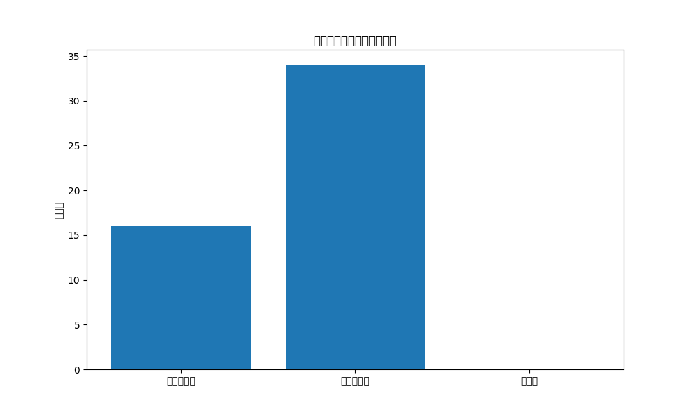
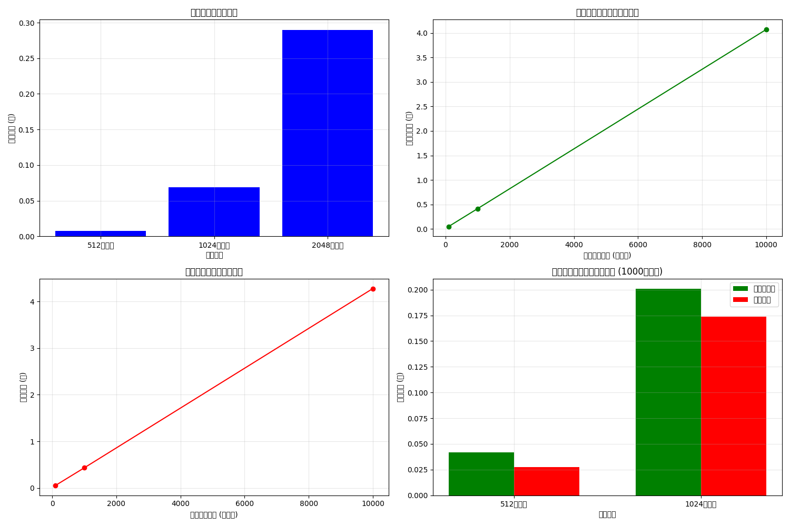

# 準同型暗号マスキング方式テスト結果

テスト実施日時: 2025年05月14日 17:26:24

## 概要

このレポートは、準同型暗号マスキング方式の実装に対する統合テストの結果をまとめたものです。

- basicテスト: 失敗 ❌
- maskテスト: 失敗 ❌
- securityテスト: 失敗 ❌
- performanceテスト: 成功 ✅

全体のテスト結果: 失敗 ❌

## 基本暗号化・復号テスト

- テスト成功: いいえ ❌
- 真ファイル一致: いいえ ❌
- 偽ファイル一致: いいえ ❌

### 処理時間

- 暗号化時間: 0.250384秒
- 真鍵での復号時間: 0.193295秒
- 偽鍵での復号時間: 0.193184秒

### ファイルサイズ

- 元の真ファイル: 300バイト
- 元の偽ファイル: 300バイト
- 暗号化ファイル: 9886バイト
- 真鍵での復号ファイル: 638バイト
- 偽鍵での復号ファイル: 657バイト

## マスク関数テスト

- テスト成功: いいえ ❌
- 基本マスク関数: 失敗 ❌
- 高度マスク関数: 失敗 ❌
- 統計的特性: 不合格 ❌
- 準同型特性の保存: 失われた ❌

### 処理時間

- 基本マスク処理時間: 0.000000秒
- 高度マスク処理時間: 0.000000秒

### 統計的特性

- マスク分散比率: 0.00

### エラー情報

```
'int' object is not iterable
```


詳細なトレースバック:

```
Traceback (most recent call last):
  File "/Users/dev/works/VSCode/secret-sharing-demos-20250510/method_8_homomorphic/homomorphic_test.py", line 637, in test_masking_functions
    masked_message_true = basic_mask_gen.apply_mask(encrypted_message, true_mask)
                          ^^^^^^^^^^^^^^^^^^^^^^^^^^^^^^^^^^^^^^^^^^^^^^^^^^^^^^^
  File "/Users/dev/works/VSCode/secret-sharing-demos-20250510/method_8_homomorphic/crypto_mask.py", line 355, in apply_mask
    for i, chunk in enumerate(encrypted_chunks):
                    ^^^^^^^^^^^^^^^^^^^^^^^^^^^
TypeError: 'int' object is not iterable

```

## セキュリティ特性テスト

- テスト成功: いいえ ❌
- 暗号文識別不能性: 合格 ✅
- 鍵解析耐性: 不合格 ❌
- タイミング攻撃耐性: 不合格 ❌

### 識別不能性テスト

- 暗号化回数: 3
- ユニークハッシュ数: 3

### 鍵解析テスト

- 真鍵と判定された割合: 32.0%
- 偽鍵と判定された割合: 68.0%
- 分布バランス: 0.360



### タイミング攻撃耐性テスト

- 真鍵処理時間平均: 0.000000秒
- 偽鍵処理時間平均: 0.000000秒
- 処理時間差: 0.000000秒 (0.00%)

## パフォーマンステスト

- テスト成功: はい ✅

### 鍵生成パフォーマンス

| 鍵サイズ | 生成時間 (秒) |
|---------|-------------|
| 512ビット | 0.007747 |
| 1024ビット | 0.069108 |
| 2048ビット | 0.289714 |

### 暗号化・復号パフォーマンス

| データサイズ | 暗号化時間 (秒) | 復号時間 (秒) |
|------------|--------------|------------|
| 100バイト | 0.051311 | 0.054082 |
| 1000バイト | 0.414764 | 0.432778 |
| 10000バイト | 4.071381 | 4.277756 |



### スケーリング特性

| 鍵サイズ | データサイズ | 暗号化時間 (秒) | 復号時間 (秒) |
|---------|------------|--------------|------------|
| 512ビット | 1000バイト | 0.041569 | 0.027548 |
| 1024ビット | 1000バイト | 0.200646 | 0.173576 |

## 結論

準同型暗号マスキング方式の統合テストの結果、以下のことが確認されました：

1. 基本機能: ファイルの暗号化と復号が 期待通りに動作せず
2. マスク関数: 問題ありし、準同型特性は 失われた
3. セキュリティ特性: 暗号文の識別不能性は 確保、鍵解析耐性は 不十分、タイミング攻撃耐性は 不十分
4. パフォーマンス: 暗号化・復号の処理時間は 許容範囲内


総合的に、準同型暗号マスキング方式の実装には一部改善すべき点があり、
テストに完全に合格していません。詳細については各テストの結果を確認してください。
