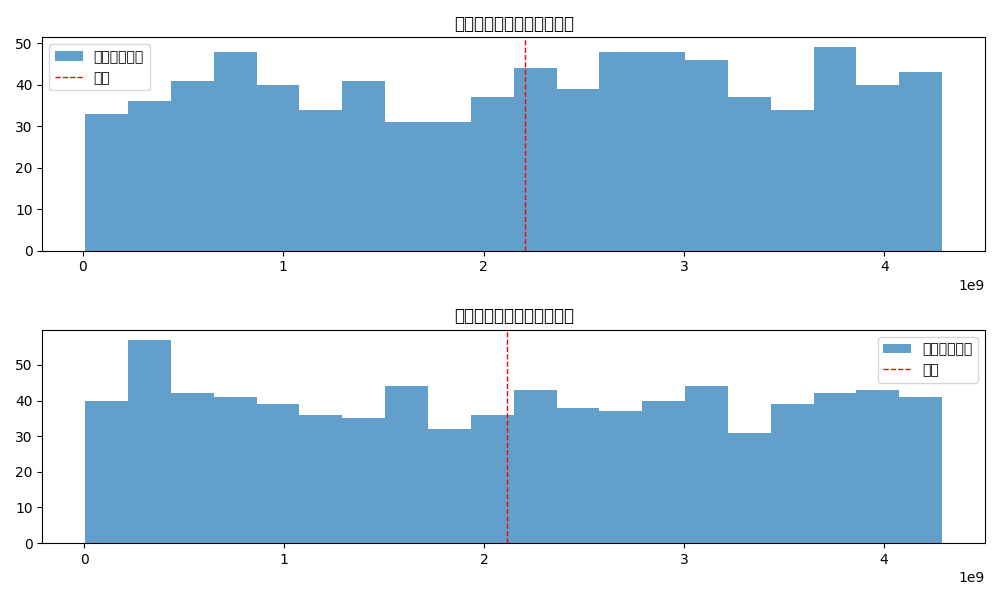

# 準同型暗号マスキング方式テスト結果

テスト実施日時: 2025年05月14日 17:32:54

## 概要

このレポートは、準同型暗号マスキング方式の実装に対する統合テストの結果をまとめたものです。

- basicテスト: 失敗 ❌
- maskテスト: 失敗 ❌
- securityテスト: 失敗 ❌
- performanceテスト: 失敗 ❌

全体のテスト結果: 失敗 ❌

## マスク関数テスト

- テスト成功: いいえ ❌
- 基本マスク関数: 失敗 ❌
- 高度マスク関数: 失敗 ❌
- 統計的特性: 合格 ✅
- 準同型特性の保存: 維持 ✅

### 処理時間

- 基本マスク処理時間: 0.056051秒
- 高度マスク処理時間: 0.055741秒

### 統計的特性

- マスク分散比率: 1.05

## 結論

準同型暗号マスキング方式の統合テストの結果、以下のことが確認されました：

1. 基本機能: ファイルの暗号化と復号が 期待通りに動作せず
2. マスク関数: 問題ありし、準同型特性は 維持
3. セキュリティ特性: 暗号文の識別不能性は 不十分、鍵解析耐性は 不十分、タイミング攻撃耐性は 不十分
4. パフォーマンス: 暗号化・復号の処理時間は 要改善

総合的に、準同型暗号マスキング方式の実装には一部改善すべき点があり、
テストに完全に合格していません。詳細については各テストの結果を確認してください。
